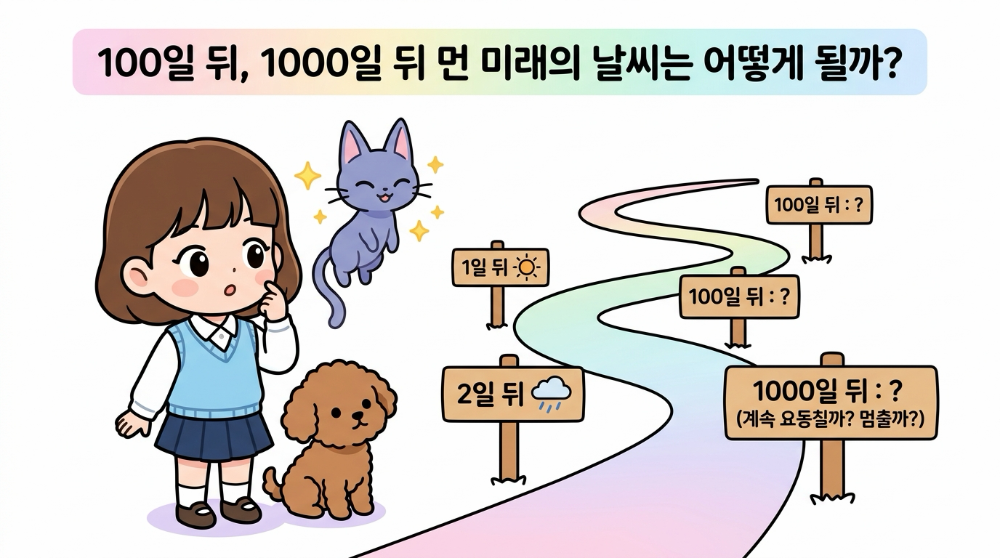
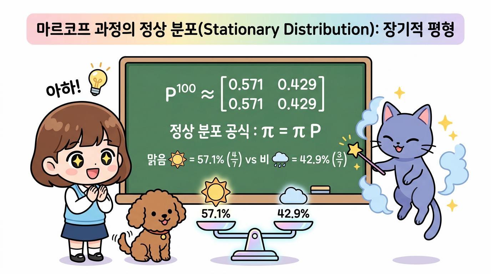
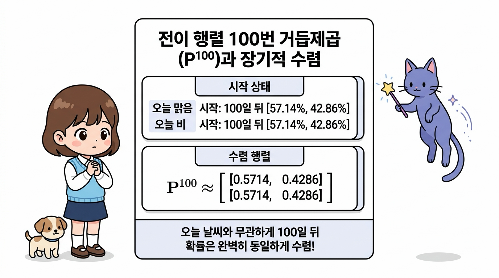
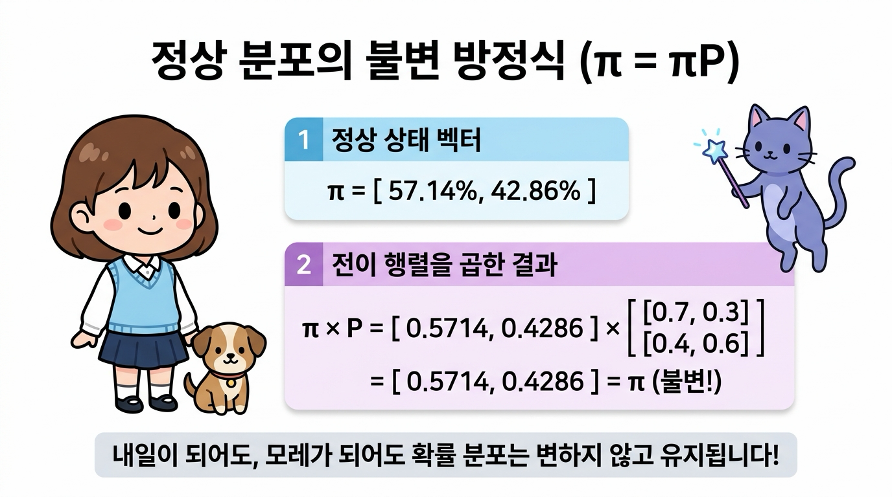
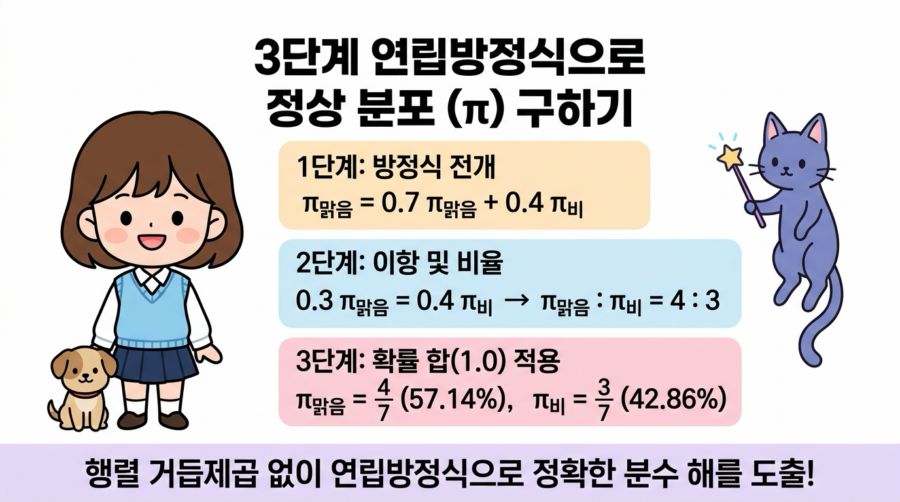
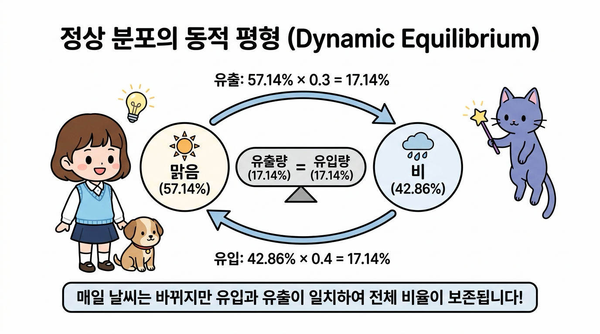
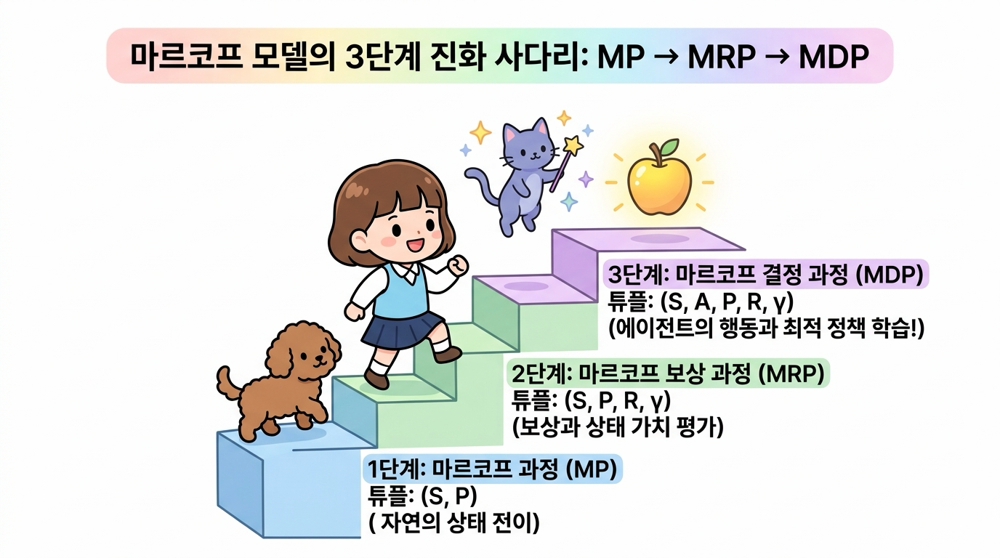

# 04.3 마르코프 과정 (Markov Process)

우리는 앞서 4.1절에서 **"미래는 오직 현재에 의해서만 결정된다"**는 **마르코프 성질(Markov Property)**을 배웠고, 4.2절에서 상태들이 사슬처럼 연결되어 확률적으로 변화하는 **마르코프 체인(Markov Chain)**을 공부했습니다.

이번 4.3절에서는 이러한 원리들을 하나로 모아, 마르코프 성질을 띤 무작위 상태 변화 시스템 자체를 엄밀한 수학적 언어로 정립한 **마르코프 과정(Markov Process, MP)**을 탐험해 봅니다.

상태들의 전체 집합인 **상태 공간(<i>S</i>)**과 이들 간의 확률 지도를 담은 **상태 전이 확률 행렬(<i>P</i>)**의 튜플 정의, 시간에 따라 이어지는 **궤적(Trajectory)**, 그리고 강화학습의 최고봉인 MDP로 도약하는 연결 고리를 도로시, 토토와 함께 신나게 배워보아요!

**그림 04-3-1** 상태 공간 <i>S</i>와 상태 전이 확률 행렬 <i>P</i>로 구성된 마르코프 과정의 기본 수학적 튜플 모델을 공부하는 지니와 도로시, 토토

---

### 04.3.1 마르코프 과정의 수학적 정의 (튜플 MP = (S, P))

**마르코프 과정(Markov Process, MP)**은 **"마르코프 성질을 만족하는 무작위 상태 전이 시스템 그 자체"**를 나타내는 가장 순수하고 기초적인 확률 모델입니다.

수학에서는 복잡한 시스템을 군더더기 없이 간결하게 표현하기 위해 여러 요소를 괄호로 묶은 **튜플(Tuple)** 표기법을 사용합니다. 마르코프 과정은 딱 **2가지 핵심 요소**로 이루어진 튜플로 완벽하게 정의됩니다:

MP = ( <i>S</i>, <i>P</i> )

**그림 04-3-2** 마르코프 과정을 이루는 2대 기둥: 에이전트가 존재할 수 있는 모든 상태들의 집합인 '상태 공간 <i>S</i>'와 이동 확률 규칙인 '상태 전이 행렬 <i>P</i>'

----

튜플을 구성하는 두 기둥을 하나씩 자세히 살펴봅시다:

1. **상태 공간 (State Space, <i>S</i>)**:
   - 시스템이나 에이전트가 존재할 수 있는 **모든 가능한 유한한 상태들의 전체 집합**입니다.
   - 도로시의 모험 지도에 비유하면, 발을 디딜 수 있는 모든 **'목적지 섬(Island)들의 주머니'**에 해당합니다.
   - *날씨 예제*: <i>S</i> = { 1: 맑음, 2: 비 }

2. **상태 전이 확률 행렬 (State Transition Probability Matrix, <i>P</i>)**:
   - 현재 상태 <i>s</i>에서 다음 상태 <i>s'</i>로 시간이 지나 이동할 확률 <i>P</i><i>ss'</i>들을 2차원 표로 정갈하게 모아둔 행렬입니다.
   - 목적지 섬들 사이를 이어주는 **'바람과 파도의 확률 지도'**에 해당합니다.
   - 수식: <i>P</i><i>ss'</i> = <i>P</i>( <i>S</i><i>t</i>+1 = <i>s'</i> | <i>S</i><i>t</i> = <i>s</i> )
   - *날씨 예제*:
     

     <i>P</i> = [ [ 0.7, 0.3 ], [ 0.4, 0.6 ] ]
     

> 💡 **용어 짚고 넘어가기: 마르코프 체인 vs 마르코프 과정**
> 
> * **마르코프 체인(Markov Chain)**: 주로 시간이 째깍째깍 불연속적인 타임 스텝(<i>t</i> = 0, 1, 2, ...)으로 흐르고, 상태 공간이 이산적(셀 수 있음)일 때 상태들이 사슬처럼 꼬리를 물고 이어지는 **'현상과 구조'**를 친근하게 부르는 이름입니다.
> * **마르코프 과정(Markov Process)**: 이를 수학적이고 일반적인 확률 과정(Stochastic Process)의 관점에서 튜플 (<i>S</i>, <i>P</i>)로 엄밀하게 정의한 **'시스템 모델 자체'**를 뜻합니다. 둘은 사실상 같은 대상의 수학적 동의어로 널리 혼용됩니다.

---

### 04.3.2 상태의 시퀀스: 궤적 (Trajectory)

마르코프 과정이 실제로 작동하기 시작하면, 시간의 흐름(<i>t</i> = 0, 1, 2, 3, ...)에 따라 에이전트는 하나의 상태에서 다음 상태로 퐁당퐁당 이동하게 됩니다.

이렇게 에이전트가 시간 순서대로 지나간 **상태들의 역사적 발자국 순서열(시퀀스)**을 강화학습에서는 **궤적(Trajectory, 트래젝터리)** 또는 **에피소드(Episode)**, **이력(History)**이라고 부릅니다:

<i>τ</i> = ( <i>S</i>0, <i>S</i>1, <i>S</i>2, <i>S</i>3, ..., <i>S</i><i>T</i> )

**그림 04-3-3** 이산 타임 스텝(<i>t</i> = 0, 1, 2, 3)을 따라 징검다리를 건너듯 상태들이 이어지는 궤적(Trajectory)과 결합 확률 계산 원리

---

#### 🎲 날씨 궤적의 실제 발생 예시

우리가 배운 날씨 마르코프 과정 (<i>S</i>, <i>P</i>)에서 오늘(<i>t</i>=0) 맑음으로 시작하여 3일간 날씨가 변화하는 궤적을 관찰했다고 해봅시다:

* **<i>t</i> = 0**: 오늘 날씨 <i>S</i>0 = **맑음 ☀️** (시작 상태, 100%)
* **<i>t</i> = 1**: 0.3의 확률을 뚫고 내일 날씨가 <i>S</i>1 = **비 🌧️** 로 바뀌었습니다.
* **<i>t</i> = 2**: 0.6의 유지 확률로 모레 날씨도 <i>S</i>2 = **비 🌧️** 가 이어졌습니다.
* **<i>t</i> = 3**: 0.4의 갤 확률로 글피 날씨가 <i>S</i>3 = **맑음 ☀️** 으로 복귀했습니다.

이때 완성된 궤적은 **[ 맑음 ☀️ &rarr; 비 🌧️ &rarr; 비 🌧️ &rarr; 맑음 ☀️ ]** 입니다.

#### 🧮 궤적의 결합 확률(Joint Probability) 계산법

마르코프 성질 덕분에, 이 특정한 궤적이 세상에 실제로 펼쳐질 전체 결합 확률은 각 단계의 전이 확률들을 단순히 **차례대로 곱하기(연쇄 법칙)**만 하면 명쾌하게 계산됩니다:

<i>P</i>( <i>S</i>0=맑음, <i>S</i>1=비, <i>S</i>2=비, <i>S</i>3=맑음 ) 
= <i>P</i>(<i>S</i>0=맑음) × <i>P</i>(<i>S</i>1=비 | <i>S</i>0=맑음) × <i>P</i>(<i>S</i>2=비 | <i>S</i>1=비) × <i>P</i>(<i>S</i>3=맑음 | <i>S</i>2=비) 
= 1.0 × 0.3 × 0.6 × 0.4 = <b>0.072 (7.2%)</b>

즉, 오늘 맑음에서 시작하여 3일 동안 정확히 이 순서대로 날씨가 바뀔 확률은 정확히 **7.2%**입니다!

---

### 04.3.3 마르코프 과정의 장기적 균형: 정상 분포 (Stationary Distribution)

도로시가 궤적 계산을 보며 지니에게 한 가지 깊은 질문을 던졌습니다.

  

    🎧
    대화 음성 듣기 (도로시 & 지니)
  

  

    <button type="button" class="btn-audio-play" style="background: #0284c7; color: #ffffff; border: none; border-radius: 16px; padding: 5px 13px; font-size: 0.82rem; font-weight: 600; cursor: pointer; display: inline-flex; align-items: center; gap: 4px; box-shadow: 0 1px 2px rgba(2,132,199,0.3);">
      ▶️ 재생
    </button>
    <button type="button" class="btn-audio-stop" style="background: #e2e8f0; color: #475569; border: none; border-radius: 16px; padding: 5px 11px; font-size: 0.82rem; font-weight: 600; cursor: pointer; display: inline-flex; align-items: center; gap: 4px;">
      ⏹️ 정지
    </button>
  

  <audio src="./audio/dialogue_4_3_scene1.mp3" preload="none"></audio>

> 👧 **도로시의 호기심**:
>
> "지니! 1일 뒤, 2일 뒤, 3일 뒤는 행렬을 곱해서 계산할 수 있잖아. 
>
> 그럼 100일 뒤나 1000일 뒤처럼 **아주 먼 미래가 되면 날씨 확률은 어떻게 될까?** 끝없이 마구 요동칠까, 아니면 어떤 값에 가만히 멈출까?"

**그림 04-3-4** "100일 뒤, 1000일 뒤처럼 아주 먼 미래의 날씨 확률은 어떻게 될까? 계속 요동칠까, 멈출까?" 궁금해하는 도로시와 토토

---

지니가 빙그레 미소를 지으며 마법 지팡이로 거대한 저울을 만들어 보였습니다.

> 🧞‍♂️ **지니의 마법 노트: 영원한 시간 끝에 찾아오는 평형의 마법!**
> 
> "놀랍게도 도로시, 전이 행렬을 10번, 50번, 100번 끝없이 거듭제곱하다 보면(<i>P</i>100), 놀랍게도 **오늘 날씨가 맑았든 비가 왔든 상관없이 미래의 확률이 언제나 똑같은 고정된 수치로 수렴**한단다! 
> 
> 이것을 수학에서는 **정상 분포(Stationary Distribution, 정지 분포)**라고 부르지!"

**그림 04-3-5** 전이 행렬을 거듭 곱할수록 오늘 날씨와 무관하게 일정한 장기적 평형 비율(맑음 57.1% vs 비 42.9%)로 수렴하는 정상 분포(π = πP)의 균형 원리

---

### 1) 행렬 거듭제곱(<i>P</i>100)을 통한 장기적 수렴 확인

실제로 전이 행렬 <i>P</i>를 100번 거듭제곱해보면 다음과 같이 모든 행의 숫자가 완벽하게 동일한 값으로 수렴합니다:

<i>P</i>100 ≈ 
[ [ 0.5714, 0.4286 ], 
  [ 0.5714, 0.4286 ] ]

* **첫 번째 행 (오늘 맑음으로 시작했을 때)**: 100일 뒤 맑을 확률 약 **57.14%** (정확히 4/7), 비 올 확률 약 **42.86%** (정확히 3/7)
* **두 번째 행 (오늘 비로 시작했을 때)**: 100일 뒤 맑을 확률 약 **57.14%** (정확히 4/7), 비 올 확률 약 **42.86%** (정확히 3/7)

> 💡 **놀라운 사실**: 오늘 날씨가 맑았든 비가 쏟아졌든 상관없이, 시간이 충분히 흐르면 과거의 기억은 깨끗이 잊혀지고 시스템 고유의 평형 비율인 **57.14% : 42.86%**로 완벽하게 수렴합니다!

**그림 04-3-6** 오늘 날씨(맑음 또는 비)와 무관하게 전이 행렬을 100번 거듭제곱(P¹⁰⁰)하면 동일한 확률 비율(57.14% : 42.86%)로 수렴하는 장기 기억 소멸 원리

---

### 2) 정상 분포의 수학적 불변 방정식: <i>π</i> = <i>π P</i>

도로시가 고개를 갸우뚱하며 다시 물었습니다.

  

    🎧
    대화 음성 듣기 (도로시 & 지니)
  

  

    <button type="button" class="btn-audio-play" style="background: #0284c7; color: #ffffff; border: none; border-radius: 16px; padding: 5px 13px; font-size: 0.82rem; font-weight: 600; cursor: pointer; display: inline-flex; align-items: center; gap: 4px; box-shadow: 0 1px 2px rgba(2,132,199,0.3);">
      ▶️ 재생
    </button>
    <button type="button" class="btn-audio-stop" style="background: #e2e8f0; color: #475569; border: none; border-radius: 16px; padding: 5px 11px; font-size: 0.82rem; font-weight: 600; cursor: pointer; display: inline-flex; align-items: center; gap: 4px;">
      ⏹️ 정지
    </button>
  

  <audio src="./audio/dialogue_4_3_scene2.mp3" preload="none"></audio>

> 👧 **도로시**: 
> "지니! 100일 뒤에 [ 0.5714, 0.4286 ]이 되었다면, 101일 뒤에는 확률이 또 바뀌는 거야?"

> 🧞‍♂️ **지니**: 
> "전혀 아니란다! 바로 그 이유 때문에 **'정상(Stationary - 정지해 있는, 불변의)'** 분포라고 부르는 거야. 이 확률에 전이 행렬 <i>P</i>를 한 번 더 곱해도 확률은 조금도 변하지 않고 그대로 유지된단다!"

정상 분포 벡터를 <b><i>π</i> = [ <i>π</i>맑음, <i>π</i>비 ] = [ 0.5714, 0.4286 ]</b> 라고 할 때, 실제로 다음 날의 확률을 곱해보면:

<b><i>π P</i></b> = [ 0.5714, 0.4286 ] × 
[ [ 0.7, 0.3 ], 
  [ 0.4, 0.6 ] ] 
= [ (0.5714 × 0.7 + 0.4286 × 0.4),  (0.5714 × 0.3 + 0.4286 × 0.6) ] 
= [ (0.4000 + 0.1714),  (0.1714 + 0.2572) ] 
= <b>[ 0.5714, 0.4286 ] = <i>π</i></b>  (완벽한 불변!)

즉, 정상 분포는 시간이 아무리 흘러도 스스로의 상태를 보존하는 **불변의 정상 상태 방정식**을 만족합니다:

> ### <b><i>π</i> = <i>π</i> <i>P</i></b>  &nbsp;&nbsp; (단, <i>π</i>맑음 + <i>π</i>비 = 1.0)

**그림 04-3-7** 정상 분포(π = [0.5714, 0.4286])에 전이 행렬(P)을 곱해도 확률 분포가 변하지 않고 그대로 유지되는 불변 상태 방정식(π = πP)

---

### 3) 3단계 연립방정식으로 정상 분포 직접 구하기

컴퓨터로 100번 행렬을 곱하지 않고도, 수학적으로 손쉽게 정확한 분수 값(4/7, 3/7)을 구하는 3단계 비법입니다.

1. **1단계: 방정식 전개하기**
   - [ <i>π</i>맑음, <i>π</i>비 ] = [ <i>π</i>맑음, <i>π</i>비 ] × [ [0.7, 0.3], [0.4, 0.6] ]
   - <i>π</i>맑음 = 0.7 <i>π</i>맑음 + 0.4 <i>π</i>비

2. **2단계: 이항하여 두 상태의 비율 구하기**
   - <i>π</i>맑음 - 0.7 <i>π</i>맑음 = 0.4 <i>π</i>비
   - 0.3 <i>π</i>맑음 = 0.4 <i>π</i>비 &rarr; **3 <i>π</i>맑음 = 4 <i>π</i>비**
   - 즉, <b><i>π</i>맑음 : <i>π</i>비 = 4 : 3</b>의 비율이 성립합니다!

3. **3단계: 전체 확률의 합 = 1 적용하기**
   - <i>π</i>맑음 + <i>π</i>비 = 1.0
   - <b><i>π</i>맑음 = 4 / (4 + 3) = 4/7 ≈ 57.14%</b>
   - <b><i>π</i>비 = 3 / (4 + 3) = 3/7 ≈ 42.86%</b>

**그림 04-3-8** 전개 &rarr; 이항 및 비율 유도 &rarr; 확률의 총합(1.0) 적용의 3단계를 거쳐 정상 분포 분수 해(4/7, 3/7)를 도출하는 과정

---

### 4) 동적 평형(Dynamic Equilibrium)의 직관적 물리 원리

도로시가 손뼉을 치며 물었습니다.

  

    🎧
    대화 음성 듣기 (도로시 & 지니)
  

  

    <button type="button" class="btn-audio-play" style="background: #0284c7; color: #ffffff; border: none; border-radius: 16px; padding: 5px 13px; font-size: 0.82rem; font-weight: 600; cursor: pointer; display: inline-flex; align-items: center; gap: 4px; box-shadow: 0 1px 2px rgba(2,132,199,0.3);">
      ▶️ 재생
    </button>
    <button type="button" class="btn-audio-stop" style="background: #e2e8f0; color: #475569; border: none; border-radius: 16px; padding: 5px 11px; font-size: 0.82rem; font-weight: 600; cursor: pointer; display: inline-flex; align-items: center; gap: 4px;">
      ⏹️ 정지
    </button>
  

  <audio src="./audio/dialogue_4_3_scene3.mp3" preload="none"></audio>

> 👧 **도로시**:
> "아하! 그런데 날씨는 매일 맑았다가 비가 왔다가 계속 바뀌는데, 어떻게 전체 확률 비율은 딱 멈춰 있을 수 있어?"

> 🧞‍♂️ **지니**:
> "정말 날카로운 질문이야 도로시! 날씨 변화 자체가 멈춘(정적, Static) 것이 아니라, **맑음에서 비로 바뀌는 유출량**과 **비에서 맑음으로 바뀌는 유입량**이 완벽하게 같아졌기 때문이란다! 이를 **동적 평형(Dynamic Equilibrium)**이라고 불러!"

* **맑음 &rarr; 비로 빠져나가는 확률 흐름**: <i>π</i>맑음 × <i>P</i>(비|맑음) = 57.14% × 30% = **17.14%**
* **비 &rarr; 맑음으로 들어오는 확률 흐름**: <i>π</i>비 × <i>P</i>(맑음|비) = 42.86% × 40% = **17.14%**

두 상태 사이를 오가는 확률의 흐름이 정확히 17.14%로 똑같기 때문에, 전체 날씨의 거시적 비율(57.1% : 42.9%)은 마치 호수 표면처럼 잔잔하게 평형을 유지하는 것입니다.

**그림 04-3-9** 맑음에서 비로 나가는 유출량(17.14%)과 비에서 맑음으로 들어오는 유입량(17.14%)이 완벽히 일치하여 거시적 확률을 보존하는 동적 평형(Dynamic Equilibrium)의 원리

---

### 5) 정상 분포의 무한한 활용: 구글 페이지랭크와 강화학습

이 정상 분포(<i>π</i> = <i>πP</i>)는 단순히 날씨를 맞히는 데 그치지 않고 현대 인공지능과 컴퓨터 과학의 토대가 되었습니다:

- 🌐 **구글(Google)의 페이지랭크(PageRank)**:
  - 인터넷 사용자가 웹페이지의 링크를 무작위로 클릭하며 서핑하는 것을 마르코프 과정으로 모델링했습니다.
  - 끝없이 서핑했을 때 사용자가 가장 자주 머무르는 정상 분포(<i>π</i>) 확률이 높은 웹페이지일수록 검색 순위 1위에 올려놓는 혁신을 만들어냈습니다.

- 🤖 **강화학습에서의 상태 방문 분포(State Visitation Distribution)**:
  - 에이전트가 어떤 고정된 정책(Policy)으로 환경을 탐험할 때, 어떤 위험한 상태나 유리한 상태에 장기적으로 얼마나 자주 도달하는지 분석하는 핵심 척도로 사용됩니다.

---

### 04.3.4 마르코프 모델의 3단계 진화 사다리: MP &rarr; MRP &rarr; MDP

우리가 마르코프 과정(MP)을 배우는 진정한 이유는 무엇일까요? 바로 인공지능 강화학습의 완전체인 **마르코프 결정 과정(MDP)**을 정복하기 위한 첫 번째 계단이기 때문입니다.

마르코프 이론은 다음과 같이 **3단계 진화 사다리**를 거쳐 완전한 강화학습으로 완성됩니다:

**그림 04-3-10** 마르코프 과정(MP)에 보상(R)이 붙어 마르코프 보상 과정(MRP)이 되고, 에이전트의 행동(A)이 결합하여 마르코프 결정 과정(MDP)으로 도약하는 3단계 진화 사다리

1. **1단계: 마르코프 과정 (Markov Process, MP)**
   - **튜플**: **( <i>S</i>, <i>P</i> )**
   - **의미**: 에이전트의 개입 없이, 오직 환경의 자연스러운 물리 법칙과 상태 전이만이 존재하는 기초 세계입니다.

2. **2단계: 마르코프 보상 과정 (Markov Reward Process, MRP)**
   - **튜플**: **( <i>S</i>, <i>P</i>, <i>R</i>, <i>γ</i> )**
   - **의미**: 마르코프 과정 위에 **즉각 보상(<i>R</i>)**과 시간의 가치를 할인하는 **할인율(<i>γ</i>)**을 추가한 모델입니다. 도로시가 특정 상태에 도달했을 때의 **'상태 가치(Value, <i>v</i>(<i>s</i>))'**를 벨만 방정식으로 평가할 수 있게 됩니다.

3. **3단계: 마르코프 결정 과정 (Markov Decision Process, MDP)**
   - **튜플**: **( <i>S</i>, <i>A</i>, <i>P</i>, <i>R</i>, <i>γ</i> )**
   - **의미**: 환경의 흐름에 에이전트의 능동적인 선택인 **'행동(Action, <i>A</i>)'**을 결합한 강화학습의 완성형 모델입니다. 도로시가 어느 방향으로 발걸음을 옮겨야 보상을 극대화할 수 있는지 **최적의 정책(Policy, <i>π</i>*)**을 찾아 스스로 학습합니다.

---

## 04.3.5 이번 절의 핵심 요약

**그림 04-3-11** 도로시, 토토, 지니와 함께 완성하는 마르코프 과정(Markov Process) 완전 정복

- **마르코프 과정(Markov Process, MP)의 튜플 정의**
  - 마르코프 성질을 만족하는 무작위 상태 변화 시스템으로, 상태 공간과 전이 행렬의 튜플 **MP = ( <i>S</i>, <i>P</i> )**로 엄밀하게 정의됩니다.

- **상태 공간(<i>S</i>)과 상태 전이 확률 행렬(<i>P</i>)**
  - <i>S</i>는 에이전트가 존재할 수 있는 모든 상태들의 유한 집합이며, <i>P</i>는 상태 <i>s</i>에서 <i>s'</i>로 넘어갈 전이 확률(<i>P</i><i>ss'</i>)들을 담은 2차원 정방행렬입니다.

- **궤적(Trajectory)과 결합 확률**
  - 시간의 흐름(<i>t</i> = 0, 1, 2, ...)에 따라 에이전트가 밟아간 상태들의 순서열 <i>τ</i> = (<i>S</i>0, <i>S</i>1, ..., <i>S</i><i>T</i>)을 뜻하며, 마르코프 성질에 의해 각 단계 전이 확률의 단순 연쇄 곱으로 결합 확률을 손쉽게 계산합니다.

- **정상 분포(Stationary Distribution, <i>π</i> = <i>πP</i>)**
  - 시간이 무한히 흐르면 초기 상태와 무관하게 장기적으로 일정하게 수렴하는 평형 확률 분포(맑음 57.1% vs 비 42.9%)입니다.

- **MDP로 향하는 3단계 진화 체계**
  - **MP (<i>S</i>, <i>P</i>)** &rarr; 보상과 할인율이 추가된 **MRP (<i>S</i>, <i>P</i>, <i>R</i>, <i>γ</i>)** &rarr; 에이전트의 행동이 추가된 완성형 **MDP (<i>S</i>, <i>A</i>, <i>P</i>, <i>R</i>, <i>γ</i>)**의 논리적 계층 구조를 이해합니다.

이제 마르코프 과정(MP)의 수학적 튜플 정의와 궤적 계산, 그리고 정상 분포의 원리까지 완벽하게 정복했습니다! 

다음 [**04.4 은닉 마르코프 모델 (Hidden Markov Model, HMM)**](../4_4_은닉_마르코프/index.html)으로 넘어가 상태가 장막 뒤에 숨겨져 있을 때 겉보기 관측 신호로 진실을 역추적하는 마법의 확률 모델을 정복해봅시다!
