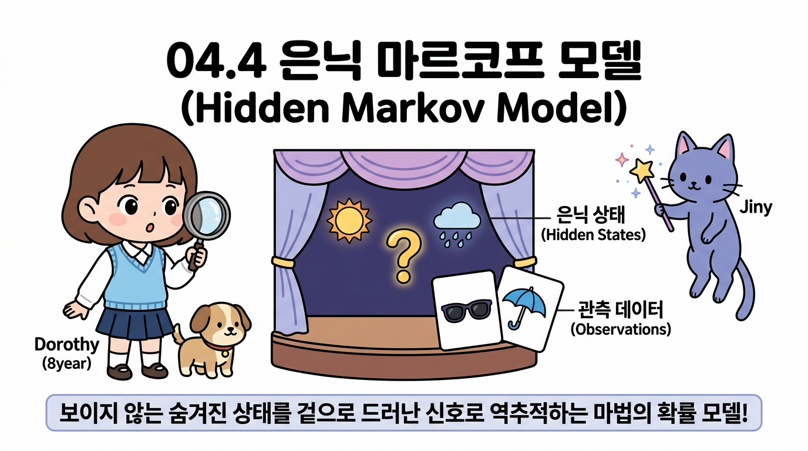
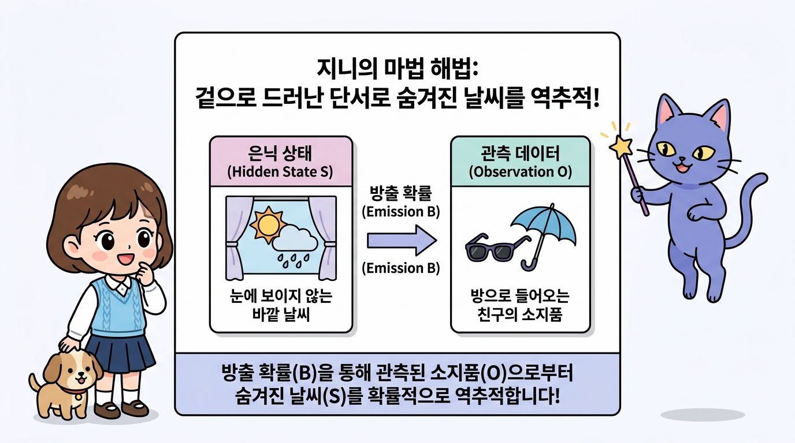
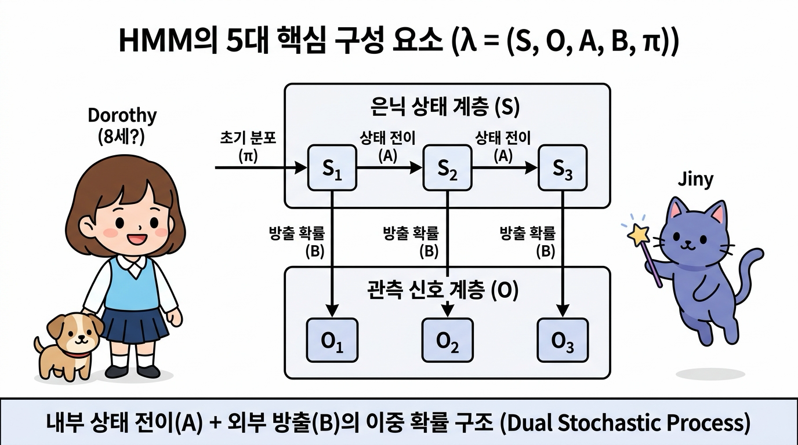
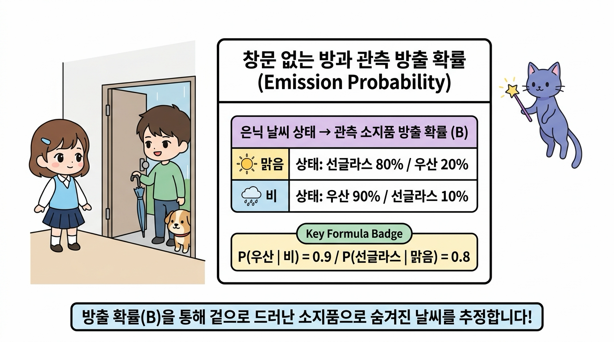
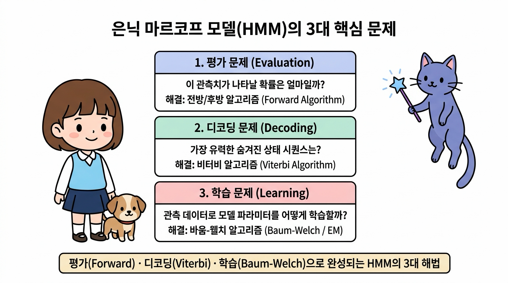
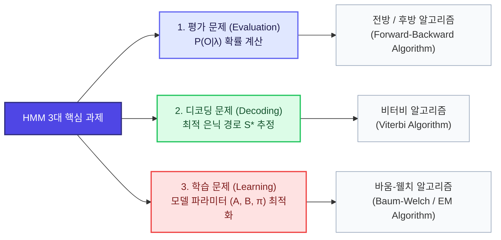
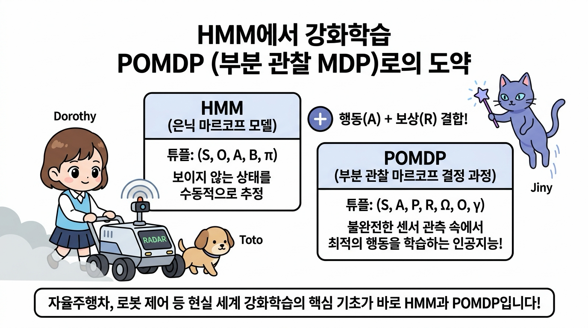
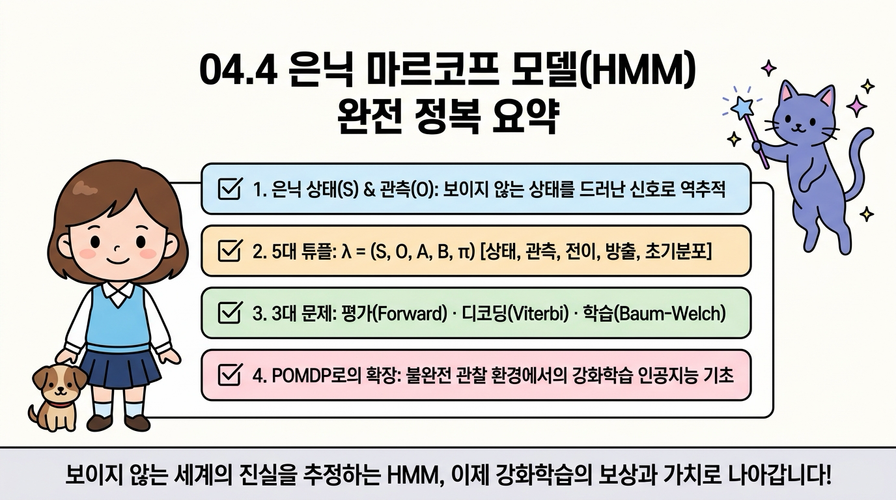

# 04.4 은닉 마르코프 모델 (Hidden Markov Model, HMM)

우리가 찾고자 하는 핵심 상태가 겉으로 드러나지 않고 장막 뒤에 꽁꽁 숨겨져 있다면 어떻게 해야 할까요? 

이번 절에서는 눈에 보이지 않는 **은닉 상태(Hidden State)**와 그 상태로부터 뿜어져 나오는 **관측 신호(Observation, 방출)**를 분석하여 실체를 수학적으로 역추정하는 **은닉 마르코프 모델(Hidden Markov Model, HMM)**을 공부합니다. 

**그림 04-4-1** 거대한 물음표 커튼(은닉 상태) 뒤에서 튀어나오는 관측 신호(선글라스, 우산)를 분석하여 숨겨진 진실을 역추적하는 도로시와 지니의 탐정 교실

지니의 마법 탐정 돋보기 비유와 창문 없는 방의 우산 예제를 통해, HMM의 5대 구성 요소와 3대 핵심 해법(평가, 디코딩, 학습), 그리고 강화학습의 **부분 관찰 마르코프 결정 과정(POMDP)**으로 이어지는 연결고리를 흥미진진하게 정복해봅시다!

---

### 04.4.1 상태가 숨겨져 있다면 어떻게 할까요? (완전 관찰 vs 은닉 상태)

우리가 지금까지 배운 **마르코프 체인(Markov Chain)**과 **마르코프 과정(MP)**에서는 에이전트가 창밖을 내다보며 현재 날씨가 **'맑음'**인지 **'비'**인지 100% 직접 눈으로 완벽하게 알 수 있었습니다. 이를 **완전 관찰(Fully Observable)** 상태라고 부릅니다.

하지만 현실 세계는 그렇게 호락호락하지 않습니다!

  

    🎧
    대화 음성 듣기 (도로시 & 지니)
  

  

    <button type="button" class="btn-audio-play" style="background: #0284c7; color: #ffffff; border: none; border-radius: 16px; padding: 5px 13px; font-size: 0.82rem; font-weight: 600; cursor: pointer; display: inline-flex; align-items: center; gap: 4px; box-shadow: 0 1px 2px rgba(2,132,199,0.3);">
      ▶️ 재생
    </button>
    <button type="button" class="btn-audio-stop" style="background: #e2e8f0; color: #475569; border: none; border-radius: 16px; padding: 5px 11px; font-size: 0.82rem; font-weight: 600; cursor: pointer; display: inline-flex; align-items: center; gap: 4px;">
      ⏹️ 정지
    </button>
  

  <audio src="./audio/dialogue_4_4_scene1.mp3" preload="none"></audio>

#### 👧 **도로시의 궁금증**:

> "지니! 만약 내가 창문이 하나도 없는 밀실 방에 갇혀서 공부하고 있다면 어떻게 해? 
> 
> 바깥 날씨가 맑은지 비가 오는지 직접 볼 수 없는데도, 오늘 날씨를 알아맞힐 수 있는 방법이 있을까?"

**그림 04-4-2** "창문이 하나도 없는 밀실 방에 있다면, 바깥 날씨(맑음/비)를 어떻게 알아맞힐 수 있을까?" 궁금해하는 도로시와 토토

---

#### 🧞‍♂️ **지니의 마법 노트: 겉으로 드러난 단서로 진실을 역추적하라!**

> "물론이지 도로시! 방 안에서는 하늘을 직접 볼 수 없지만(은닉 상태), 밖에서 방으로 들어오는 친구가 손에 **'우산'**을 쥐고 있는지, 머리에 **'선글라스'**를 끼고 있는지(관측 신호)를 관찰할 수 있단다!
> 
> 비록 상태는 숨겨져 있지만(Hidden), 그 상태에 따라 겉으로 방출되는 간접 단서(Observation)를 확률적으로 분석하면 숨겨진 날씨를 마법처럼 역추적할 수 있지!"

**그림 04-4-3** 바깥 날씨(은닉 상태)를 직접 보지 못해도 들어오는 친구의 소지품(관측 신호)을 통해 실체를 역추적하는 은닉 마르코프 모델(HMM)의 원리

* **완전 관찰 마르코프 모델 (Fully Observable)**:
  - 상태 <i>S</i><i>t</i>를 에이전트가 오차 없이 실시간으로 직접 확인합니다. (투명한 유리창 세계)
* **은닉 마르코프 모델 (Hidden Markov Model, HMM)**:
  - 진짜 상태 <i>S</i><i>t</i>는 장막 뒤에 숨겨져 있고, 오직 그 상태의 영향을 받아 겉으로 방출되는 관측 데이터 <i>O</i><i>t</i>만을 수집할 수 있습니다. (장막 뒤의 마술 세계)

---

### 04.4.2 HMM의 5대 핵심 구성 요소: <i>λ</i> = ( <i>S</i>, <i>O</i>, <i>A</i>, <i>B</i>, <i>π</i> )

은닉 마르코프 모델은 단순한 1층 구조가 아니라, **'숨겨진 내부 엔진(상태 전이)'**과 **'겉으로 드러나는 외부 출력(관측 방출)'**이 결합된 **이중 확률 과정(Dual Stochastic Process)**입니다.

수학적으로 HMM은 다음 **5가지 요소의 튜플 <i>λ</i> = ( <i>S</i>, <i>O</i>, <i>A</i>, <i>B</i>, <i>π</i> )**로 완벽하게 정의됩니다:

**그림 04-4-4** 내부의 은닉 상태 전이 마르코프 체인(A)과 외부로 방출되는 관측 신호 확률(B)이 결합된 HMM의 2단 레이어 구조 (λ = (S, O, A, B, π))

| 기호 | 명칭 | 의미와 구체적 예시 |
| :---: | :--- | :--- |
| **<i>S</i>** | **은닉 상태 집합 (Hidden States)** | 눈에 보이지 않는 숨겨진 진짜 상태들의 집합 예: <i>S</i> = { 맑음(<i>s</i>1), 비(<i>s</i>2) } |
| **<i>O</i>** | **관측 기호 집합 (Observations)** | 겉으로 관측 가능한 신호/데이터들의 집합 예: <i>O</i> = { 선글라스(<i>o</i>1), 우산(<i>o</i>2) } |
| **<i>A</i>** | **상태 전이 확률 행렬 (Transition)** | 은닉 상태끼리 변하는 마르코프 체인 확률 <i>a</i><i>ij</i> = <i>P</i>( <i>S</i><i>t</i>+1 = <i>s</i><i>j</i> \| <i>S</i><i>t</i> = <i>s</i><i>i</i> ) |
| **<i>B</i>** | **방출/관측 확률 행렬 (Emission)** | 특정 은닉 상태에서 특정 관측치가 튀어나올 조건부 확률 <i>b</i><i>j</i>(<i>k</i>) = <i>P</i>( <i>O</i><i>t</i> = <i>o</i><i>k</i> \| <i>S</i><i>t</i> = <i>s</i><i>j</i> ) |
| **<i>π</i>** | **초기 상태 분포 (Initial Distribution)** | 첫날(<i>t</i> = 0) 시작 시점의 은닉 상태 확률 <i>π</i><i>i</i> = <i>P</i>( <i>S</i>0 = <i>s</i><i>i</i> ) |

> 💡 **HMM의 핵심 본질: 2중 마르코프 레이어**:
> 1. **상층부 (은닉 계층)**: 날씨는 우리 눈에 보이지 않지만, 스스로 마르코프 성질(전이 행렬 <i>A</i>)에 따라 내일의 날씨로 매끄럽게 전이됩니다.
> 2. **하층부 (관측 계층)**: 매일 정해진 날씨 상태에 따라, 일정한 방출 확률(방출 행렬 <i>B</i>)에 기반하여 관측치(선글라스 or 우산)가 우리 눈앞에 나타납니다.

---

### 04.4.3 창문 없는 방과 친구의 우산: HMM 구체적 계산 예제

이해를 돕기 위해 도로시의 가상 실험을 구체적인 숫자로 계산해봅시다!

**그림 04-4-5** 창문 없는 방 안에서 친구 민우가 들고 들어오는 소지품(방출 확률 B)을 통해 바깥의 은닉 날씨를 유추하는 가상 실험

#### 1) 모델 파라미터 정의

1. **은닉 상태**: <i>S</i> = { 맑음, 비 }
2. **관측 기호**: <i>O</i> = { 선글라스, 우산 }
3. **초기 날씨 확률**: <i>π</i> = [ 맑음: 0.6, 비: 0.4 ]
4. **상태 전이 확률 행렬 <i>A</i>**:
   

   <i>A</i> = 
   [ [ 맑음&rarr;맑음: 0.7, 맑음&rarr;비: 0.3 ], 
     [ 비&rarr;맑음: 0.4,   비&rarr;비: 0.6 ] ]
   

5. **방출 확률 행렬 <i>B</i> (소지품 확률)**:
   - **맑은 날**: 선글라스 80% (0.8), 우산 20% (0.2 - 양산 대용)
   - **비 오는 날**: 우산 90% (0.9), 선글라스 10% (0.1 - 패션용)
   

   <i>B</i> = 
   [ [ 맑음일 때: 선글라스 0.8, 우산 0.2 ], 
     [ 비올 때:   선글라스 0.1, 우산 0.9 ] ]
   

#### 2) 베이즈 정리를 이용한 단일 관측 역추정

  

    🎧
    대화 음성 듣기 (도로시 & 지니)
  

  

    <button type="button" class="btn-audio-play" style="background: #0284c7; color: #ffffff; border: none; border-radius: 16px; padding: 5px 13px; font-size: 0.82rem; font-weight: 600; cursor: pointer; display: inline-flex; align-items: center; gap: 4px; box-shadow: 0 1px 2px rgba(2,132,199,0.3);">
      ▶️ 재생
    </button>
    <button type="button" class="btn-audio-stop" style="background: #e2e8f0; color: #475569; border: none; border-radius: 16px; padding: 5px 11px; font-size: 0.82rem; font-weight: 600; cursor: pointer; display: inline-flex; align-items: center; gap: 4px;">
      ⏹️ 정지
    </button>
  

  <audio src="./audio/dialogue_4_4_scene2.mp3" preload="none"></audio>

> 👧 **도로시의 질문**: 
> "지니! 오늘 첫날인데 친구 민우가 문을 열고 들어오면서 손에 **'우산'**을 들고 나타났어! 
> 
> 그렇다면 오늘 바깥 날씨가 **'비'**가 오고 있을 확률은 얼마야?"

지니가 칠판에 베이즈 역확률 공식을 적어 내려갔습니다:

<b><i>P</i>( 날씨=비 | 관측=우산 )</b> = 
[ <i>P</i>(날씨=비) × <i>P</i>(우산 | 날씨=비) ] / <i>P</i>(우산)  
<b>분자 (비가 오고 우산을 들 확률)</b>: 0.4 × 0.9 = <b>0.36</b> 
<b>분모 (전체 우산을 들 확률)</b>: (맑음 0.6 × 0.2) + (비 0.4 × 0.9) = 0.12 + 0.36 = <b>0.48</b>  
<b><i>P</i>( 날씨=비 | 관측=우산 )</b> = 0.36 / 0.48 = <b>0.75 (75%)</b>

민우가 우산을 들고 나타난 단 하나의 단서만으로, 바깥 날씨가 비일 확률이 초기 40%에서 무려 **75%**로 껑충 뛰어올랐습니다!

---

### 04.4.4 은닉 마르코프 모델(HMM)의 3대 핵심 문제

시간이 흘러 민우가 3일 동안 연속으로 **[ 선글라스, 우산, 우산 ]**을 들고 나타났다면 어떻게 분석해야 할까요? HMM 이론에서는 이를 해결하기 위해 수학적으로 정립된 **3가지 핵심 문제**를 다룹니다:

**그림 04-4-6** 평가(Forward), 디코딩(Viterbi), 학습(Baum-Welch)으로 구성된 은닉 마르코프 모델의 3대 핵심 해결 과제와 알고리즘 체계

#### 1) 평가 문제 (Evaluation Problem): "이 관측 시퀀스가 일어날 확률은?"
- **질문**: 현재 모델 <i>λ</i>가 주어졌을 때, 3일 동안 [선글라스, 우산, 우산]이 관측될 전체 확률 <i>P</i>( <i>O</i> \| <i>λ</i> )은 얼마일까?
- **해법**: 모든 가능한 날씨 경우의 수(23 = 8가지)를 무식하게 더하면 시간이 너무 오래 걸리므로, 중복 계산을 메모이제이션하는 **전방 알고리즘(Forward Algorithm)** 또는 **후방 알고리즘(Backward Algorithm)**을 사용하여 시간 복잡도를 <i>O</i>(<i>N</i>2<i>T</i>)로 획기적으로 줄여 계산합니다.

#### 2) 디코딩 문제 (Decoding Problem): "가장 유력한 실제 날씨 시퀀스는?"
- **질문**: 관측치 [선글라스, 우산, 우산]이 주어졌을 때, 바깥의 실제 3일간 날씨 시퀀스로 가장 확률이 높은 경로는 [맑음, 비, 비]일까, 아니면 [맑음, 맑음, 비]일까?
- **해법**: 동적 계획법(Dynamic Programming)의 걸작인 **비터비 알고리즘(Viterbi Algorithm)**을 사용합니다. 각 시점마다 가장 확률이 높은 최선의 경로만을 누적해 살려두면서, 백트래킹(Backtracking)을 통해 **가장 가능성이 높은 숨겨진 상태 경로(<i>S</i>*)**를 완벽하게 찾아냅니다.

#### 3) 학습 문제 (Learning Problem): "관측치만으로 전이·방출 행렬을 어떻게 배울까?"
- **질문**: 바깥 날씨의 정답(은닉 상태)을 전혀 모른 채, 오직 수많은 친구들의 소지품 기록(관측 데이터 <i>O</i>)들만 잔뜩 모여 있을 때, 모델의 전이 행렬 <i>A</i>와 방출 행렬 <i>B</i>를 데이터에 맞게 최적화할 수 있을까?
- **해법**: 비지도 학습의 대표격인 **바움-웰치 알고리즘(Baum-Welch Algorithm, EM 알고리즘의 HMM 특화 버전)**을 사용합니다. 기댓값 계산(E-step)과 파라미터 갱신(M-step)을 반복 수렴시켜 관측 데이터를 가장 잘 설명하는 최적의 HMM 파라미터를 스스로 학습해냅니다.

---

### 04.4.5 강화학습으로의 도약: POMDP (부분 관찰 마르코프 결정 과정)

우리가 인공지능 강화학습을 공부하면서 HMM을 배우는 진정한 이유는 무엇일까요?

현실 세계의 강화학습 에이전트(로봇 청소기, 자율주행차, 주식 트레이더)는 센서에 노이즈가 끼거나 카메라 시야가 가려져 **환경의 완벽한 전체 상태를 보지 못하는 경우**가 대부분이기 때문입니다.

**그림 04-4-7** 은닉 마르코프 모델(HMM)의 관측 신호 추정 메커니즘에 에이전트의 행동(A)과 보상(R)이 결합하여 완성되는 강화학습 모델 POMDP

은닉 마르코프 모델(HMM)에 에이전트의 능동적인 **'행동(Action, <i>A</i>)'**과 목표 달성을 위한 **'보상(Reward, <i>R</i>)'**이 결합되면, 바로 인공지능의 최고봉 모델인 **부분 관찰 마르코프 결정 과정(Partially Observable Markov Decision Process, POMDP)**으로 완벽하게 도약합니다:

> ### **POMDP = HMM + 행동(Action) + 보상(Reward) + 할인율(<i>γ</i>)**
> - **POMDP 7-튜플 정의**: **( <i>S</i>, <i>A</i>, <i>P</i>, <i>R</i>, <i>Ω</i>, <i>O</i>, <i>γ</i> )**
>   - <i>S</i>: 은닉 상태 집합
>   - <i>A</i>: 에이전트의 행동 집합
>   - <i>P</i>: 행동에 따른 상태 전이 확률 <i>P</i>(<i>s'</i> \| <i>s</i>, <i>a</i>)
>   - <i>R</i>: 보상 함수 <i>R</i>(<i>s</i>, <i>a</i>)
>   - <i>Ω</i>: 관측 기호 집합 (Observations)
>   - <i>O</i>: 관측 방출 확률 <i>P</i>(<i>o</i> \| <i>s'</i>, <i>a</i>)
>   - <i>γ</i>: 시간 할인율

* **자율주행차의 안개 주행**: 안개로 인해 전방 도로 상태(<i>S</i>)가 보이지 않지만, 라이다(LiDAR)와 레이더 센서의 관측 신호(<i>O</i>)를 역추적하여 안전하게 핸들을 조작(<i>A</i>)하고 목적지에 도달(<i>R</i>)합니다.
* **신념 상태 (Belief State)**: POMDP 에이전트는 숨겨진 상태에 대한 확률적 믿음인 **신념 상태 <i>b</i>(<i>s</i>) = <i>P</i>(<i>S</i><i>t</i> = <i>s</i> \| <i>O</i>1:<i>t</i>, <i>A</i>1:<i>t</i>-1)**를 HMM의 베이즈 업데이트 방식으로 지속적으로 갱신하며 최적의 정책을 학습합니다.

---

## 04.4.6 이번 절의 핵심 요약

**그림 04-4-8** 도로시, 토토, 지니와 함께 완성하는 은닉 마르코프 모델(HMM) 완전 정복 요약

- **완전 관찰 vs 은닉 상태**
  - 마르코프 체인과 MP는 상태를 100% 직접 관측하는 완전 관찰 세계인 반면, HMM은 상태는 장막 뒤에 숨고(Hidden) 오직 간접 신호(Observation)만을 관측할 수 있는 불완전 관찰 세계를 다룹니다.

- **HMM의 5대 구성 튜플: <i>λ</i> = ( <i>S</i>, <i>O</i>, <i>A</i>, <i>B</i>, <i>π</i> )**
  - 은닉 상태 집합(<i>S</i>), 관측 기호 집합(<i>O</i>), 상태 전이 확률 행렬(<i>A</i>), 방출/관측 확률 행렬(<i>B</i>), 초기 상태 분포(<i>π</i>)로 구성된 2중 확률 과정(Dual Stochastic Process)입니다.

- **HMM의 3대 핵심 문제와 해결 알고리즘**
  1. **평가 문제 (Evaluation)**: 관측 시퀀스의 발생 확률 <i>P</i>(<i>O</i> \| <i>λ</i>) &rarr; **전방/후방 알고리즘 (Forward-Backward)**
  2. **디코딩 문제 (Decoding)**: 가장 유력한 숨겨진 상태 시퀀스 <i>S</i>* 역추적 &rarr; **비터비 알고리즘 (Viterbi)**
  3. **학습 문제 (Learning)**: 데이터로부터 파라미터 (<i>A</i>, <i>B</i>, <i>π</i>) 최적화 &rarr; **바움-웰치 알고리즘 (Baum-Welch / EM)**

- **강화학습 POMDP로의 확장**
  - HMM의 부분 관찰 추정 메커니즘에 에이전트의 행동(<i>A</i>)과 보상(<i>R</i>)이 결합된 **POMDP**는 자율주행, 로봇 제어 등 현실 세계 강화학습의 핵심 기초가 됩니다.

---

이제 상태가 숨겨진 신비로운 마법의 세계, 은닉 마르코프 모델(HMM)의 수학적 원리와 3대 해법까지 완벽하게 정복했습니다! 

다음 [**04.5 정리 (Summary)**](../4_5_정리/index.html)로 넘어가 4강 마르코프 세계관의 핵심 뼈대를 총정리하고, 5강 마르코프 결정 과정(MDP)으로 나아가는 마법 포털을 열어봅시다!
