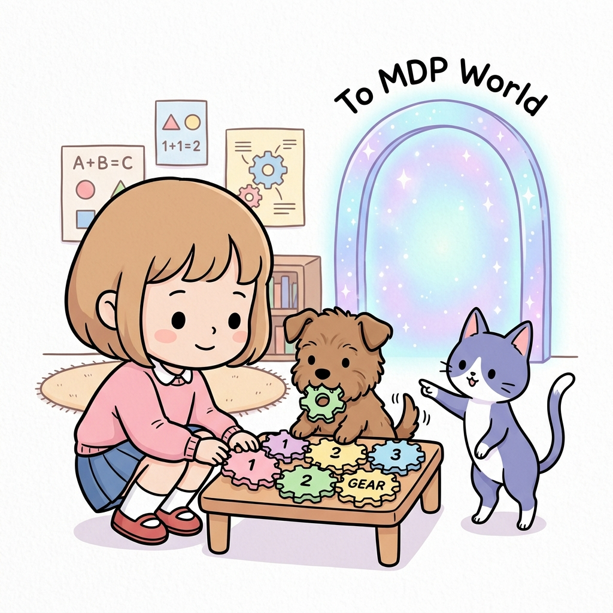

# 04.5 정리 (Summary)

**그림 04-5** 마르코프 톱니바퀴 퍼즐을 멋지게 조립해 마친 뒤, 지니가 소환해 준 마법의 포털을 타고 MDP 세계로 나아가는 도로시와 토토

마르코프 환경과 체인의 톱니바퀴 퍼즐을 마침내 완성하고, 진정한 강화학습의 중심 뼈대인 5강 마르코프 결정 과정(MDP)으로 나아가는 요약 장입니다. 요정 지니의 안내를 받아 마법 포털 문을 두드리며, 4장의 핵심 뼈대를 한눈에 정리해봅시다!

---

  

    🎧
    대화 음성 듣기 (도로시, 토토 & 지니)
  

  

    <button type="button" class="btn-audio-play" style="background: #0284c7; color: #ffffff; border: none; border-radius: 16px; padding: 5px 13px; font-size: 0.82rem; font-weight: 600; cursor: pointer; display: inline-flex; align-items: center; gap: 4px; box-shadow: 0 1px 2px rgba(2,132,199,0.3);">
      ▶️ 재생
    </button>
    <button type="button" class="btn-audio-stop" style="background: #e2e8f0; color: #475569; border: none; border-radius: 16px; padding: 5px 11px; font-size: 0.82rem; font-weight: 600; cursor: pointer; display: inline-flex; align-items: center; gap: 4px;">
      ⏹️ 정지
    </button>
  

  <audio src="./audio/dialogue_4_5_scene1.mp3" preload="none"></audio>

> 👧 **도로시**: "지니야! 우리가 마르코프 성질부터 시작해서 사슬처럼 이어지는 마르코프 체인, 상태 전이 행렬로 수렴하는 마르코프 과정, 그리고 보이지 않는 세계를 읽어내는 은닉 마르코프 모델까지 모두 정복했어!"
>
> 🐶 **토토**: "멍멍! 날씨가 사슬처럼 돌아가고, 100일 뒤에도 동적 평형을 이루는 원리가 정말 신기했어! 멍멍!"
>
> 🧚 **지니**: "둘 다 정말 멋지게 해냈어! 이제 마르코프 확률 역학이라는 단단한 기초 체력을 길렀으니, 진짜 강화학습의 심장인 5강으로 힘차게 나아갈 준비가 된 거란다!"

 

### 04.5.1 4강 핵심 요약

이번 4강에서는 5강 MDP를 더 부드럽고 완벽하게 학습하기 위한 사전 수학적 개념들을 탐구해 보았습니다.

1. **마르코프 성질 (Markov Property)**: 
   "미래는 과거의 이력과 관계없이 오직 현재 상태에 의해서만 결정된다." 강화 학습의 상태 공간 설계가 차원의 저주를 피하고 기하급수적인 효율성을 보장받는 근본적인 가정입니다.
2. **마르코프 체인 (Markov Chain)**: 
   유한한 상태들과 불연속적인 타임 스텝 위에서 상태 간 전이가 확률적(조건부 확률 *p**ij*)으로 발생하는 이산 확률 프로세스입니다.
3. **마르코프 과정 (Markov Process)**: 
   무작위로 스스로 변화하는 무작위 확률 시퀀스입니다. 행동(Action)과 보상(Reward)이 없는 순수한 상태 전이 흐름 상태입니다.
4. **은닉 마르코프 모델 (Hidden Markov Model, HMM)**: 
   상태 자체가 관측 불가능할 때, 간접 관측 시퀀스와 방출 확률(Emission Probability)을 결합하여 내부 상태의 진짜 흐름을 역추적하는 확장 확률 모델입니다.

---

### 04.5.2 5강 MDP(마르코프 결정 과정)와의 튼튼한 다리

  

    🎧
    대화 음성 듣기 (도로시 & 지니)
  

  

    <button type="button" class="btn-audio-play" style="background: #0284c7; color: #ffffff; border: none; border-radius: 16px; padding: 5px 13px; font-size: 0.82rem; font-weight: 600; cursor: pointer; display: inline-flex; align-items: center; gap: 4px; box-shadow: 0 1px 2px rgba(2,132,199,0.3);">
      ▶️ 재생
    </button>
    <button type="button" class="btn-audio-stop" style="background: #e2e8f0; color: #475569; border: none; border-radius: 16px; padding: 5px 11px; font-size: 0.82rem; font-weight: 600; cursor: pointer; display: inline-flex; align-items: center; gap: 4px;">
      ⏹️ 정지
    </button>
  

  <audio src="./audio/dialogue_4_5_scene2.mp3" preload="none"></audio>

> 👧 **도로시**: "지니야! 지금까지 배운 마르코프 과정은 주사위처럼 세상이 저절로 흘러가기만 했잖아? 5장 마르코프 결정 과정에서는 뭐가 더해지는 거야?"
>
> 🧚 **지니**: "바로 에이전트의 주체적인 **행동(A)**과 목표를 향한 **보상(R)**이 더해진단다! 구경꾼에서 주인공으로 변신하여 최고의 결정을 내리는 법을 배우게 될 거야!"

 

마르코프 과정(MP)에 에이전트의 **행동(A)**과 환경이 제공하는 **보상(R)**이 추가되면, 단순 수동적인 확률 변화 시스템이었던 상태 흐름이 에이전트의 학습 대상인 액티브한 **의사결정 제어 시스템**으로 바뀝니다.

이것이 바로 우리가 다음 5강에서 심도 있게 학습할 **마르코프 결정 과정(MDP, Markov Decision Process)**의 진짜 수학적 정체입니다. 

이제 4강의 단단한 지식을 바탕으로 5강의 넓고 멋진 세계로 즐겁게 나아가 봅시다!
