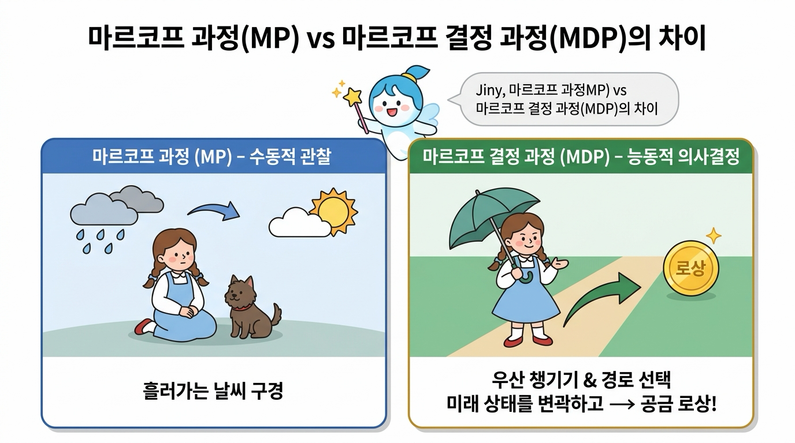
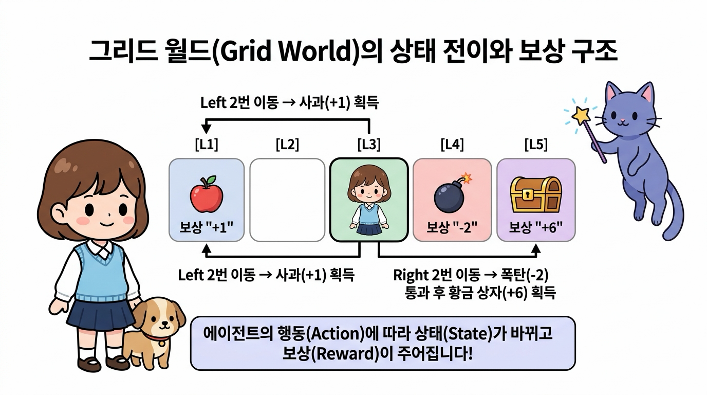
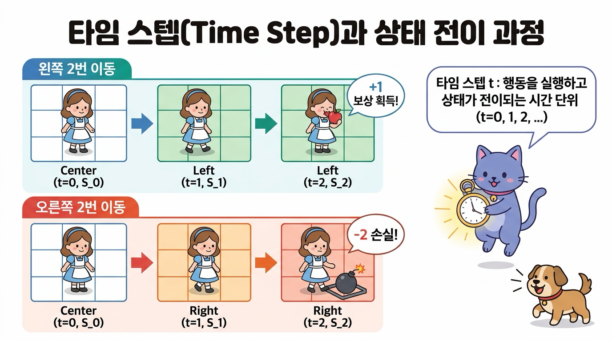
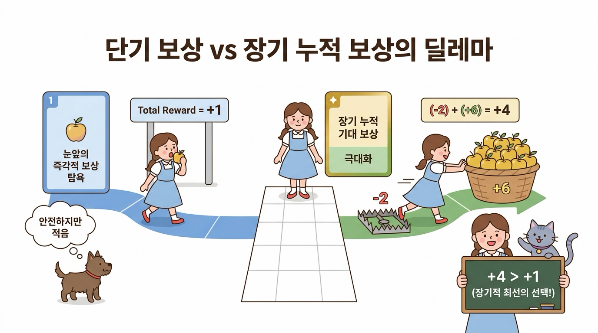
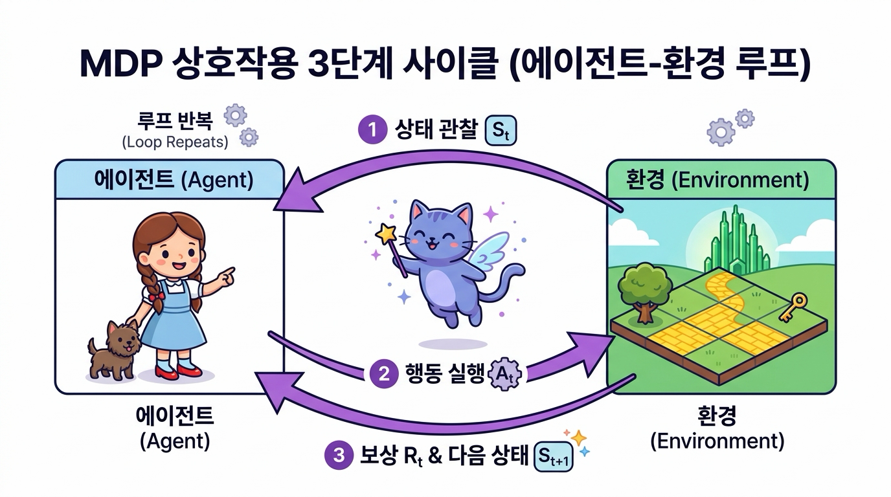
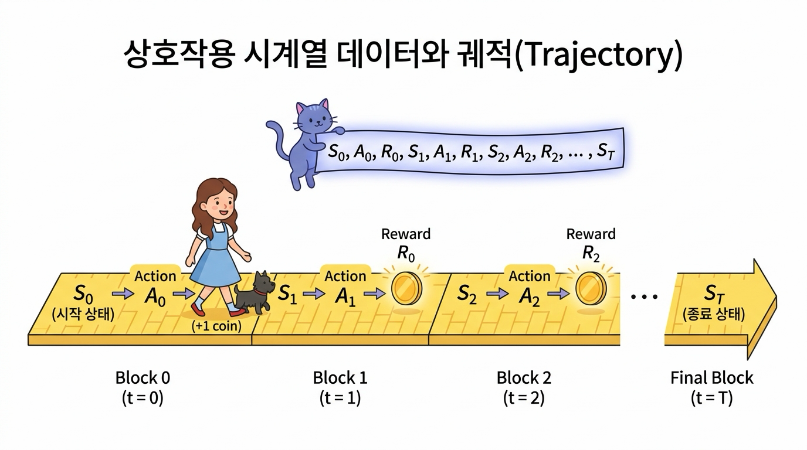
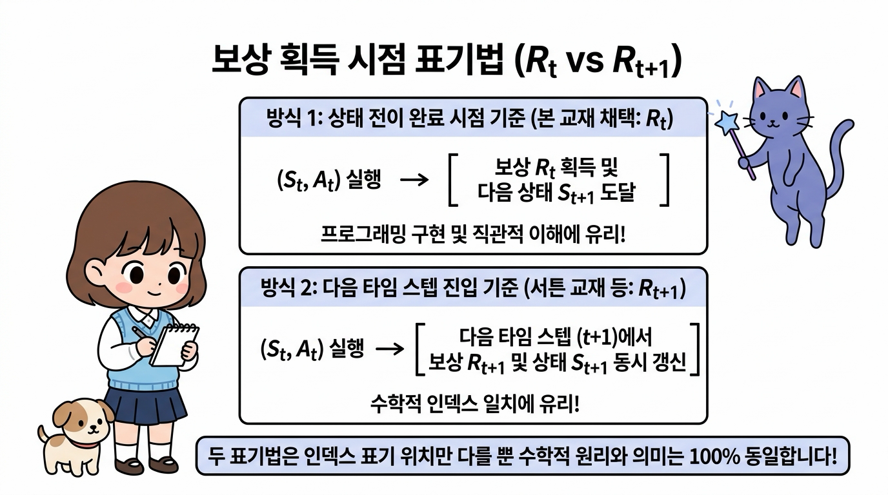
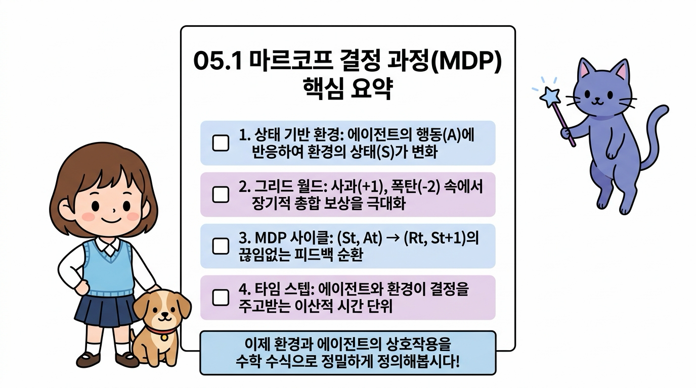

# 05.1 마르코프 결정 과정(MDP)이란?

마르코프 성질(Markov Property)이라는 확률적 바닥 위에, 주체적으로 미래를 개척하는 **의사결정(Decision)**의 날개를 달아준 수학적 프레임워크가 바로 **마르코프 결정 과정(Markov Decision Process, MDP)**입니다. 

에이전트와 환경이 상태, 행동, 보상을 끊임없이 주고받는 강화학습의 핵심 사이클을 지니 요정과 도로시의 모험 속 대화를 통해 쉽고 명쾌하게 정복해 봅시다!

**그림 05-1-1** 오즈의 숲길(Environment)에서 상태(노란 벽돌길)를 관찰하고 행동(이동)을 결정하여 보상(황금 열쇠)을 찾아 나서는 도로시와 지니

---

### 05.1.1 강화학습과 환경의 동적 변화

우리는 앞서 4장에서 스스로 흘러가는 구름처럼 관찰자의 개입 없이 확률적으로 상태가 바뀌는 **마르코프 과정(Markov Process)**을 배웠습니다. 

하지만 강화학습의 세계는 단순히 흘러가는 세상을 구경만 하는 곳이 아닙니다.

> 👧 **도로시**: "지니야! 지난 4장에서 배운 날씨 마르코프 체인은 비가 올지 맑을지 확률적으로 지켜보기만 했잖아? 그런데 강화학습에서는 내가 직접 우산을 챙기거나 길을 골라 걸어갈 수 있는 거야?"
>
> 🧚 **지니**: "맞아, 도로시! 날씨처럼 외부에서 정해진 확률대로 저절로 변하는 시스템을 **마르코프 과정(MP)**이라고 한다면, 우리가 **'어떤 행동(Action)을 취할 것인가'**를 능동적으로 결정하여 세상의 미래 상태와 보상을 직접 바꾸어 나가는 시스템을 **마르코프 결정 과정(MDP)**이라고 불러!"

**그림 05-1-2** 마르코프 과정(MP) vs 마르코프 결정 과정(MDP)의 핵심 차이: 수동적 관찰(날씨 구경) vs 능동적 의사결정(우산 챙기기 & 길 선택)

마르코프 결정 과정Markov Decision Process, MDP에서 **'결정 과정(Decision Process)'**이란 **'에이전트가 환경과 끊임없이 상호작용하며 자신의 목표를 이루기 위해 최선의 행동을 능동적으로 결정하는 연속적인 과정'**을 뜻합니다.

---

### 05.1.2 그리드 월드로 이해하는 상태, 행동, 보상

에이전트가 자신의 행동에 따라 환경의 상태를 실시간으로 바꾸어 나가는 원리를 이해하기 위해 가장 직관적인 **그리드 월드(Grid World)** 예시로 시작해 봅시다.

#### 05.1.2.1 에이전트와 환경, 보상의 정의

격자grid로 이루어진 1차원 세상에 로봇(에이전트)이 서 있습니다. 로봇은 격자 위에서 **왼쪽으로 이동(Left)**하거나 **오른쪽으로 이동(Right)**할 수 있습니다.

* **에이전트(Agent)**: 의사결정의 주체인 로봇(도로시와 토토)
* **환경(Environment)**: 에이전트가 탐험하는 격자판 세계
* **행동(Action, <i>A</i>)**: 로봇이 취할 수 있는 선택지 (왼쪽 또는 오른쪽 이동)
* **상태(State, <i>S</i>)**: 로봇이 현재 위치하고 있는 격자 번호
* **보상(Reward, <i>R</i>)**: 로봇이 특정 칸에 도달했을 때 환경으로부터 주어지는 즉각적인 피드백 (사과: +1, 폭탄: -2, 빈칸: 0)

**그림 05-1-3** 그리드 월드에서의 상태 정의와 보상 요소

---

#### 05.1.2.2 타임 스텝과 상태 전이(State Transition)

에이전트가 행동을 한 번 실행할 때마다 세상의 시간이 한 단위씩 흐르며, 상황(상태)이 새롭게 바뀝니다.

> ⏱️ **타임 스텝(Time Step, <i>t</i>)**: 에이전트가 환경을 관찰하고 다음 행동을 결정하여 실행하는 이산적인 시간 단위(<i>t</i> = 0, 1, 2, ...)입니다. 문제에 따라 1초일 수도, 1분일 수도, 바둑의 한 수일 수도 있습니다.

**그림 05-1-4** 타임 스텝 <i>t</i>의 흐름에 따른 상태 전이와 보상 획득 과정 (왼쪽 이동 경로 vs 오른쪽 이동 경로)

예를 들어 가운데 칸에서 시작하여 왼쪽으로 두 번 이동하면 사과를 먹고 **+1**의 보상을 얻습니다. 반대로 오른쪽으로 두 번 이동하면 폭탄을 밟아 **-2**의 손실을 입습니다.

---

#### 05.1.2.3 단기 보상 vs 장기 누적 보상의 딜레마

이제 또 다른 세상(World B)을 생각해 봅시다:

* **왼쪽 끝 칸**: 보상 **+1** (작은 사과)
* **오른쪽 바로 다음 칸**: 보상 **-2** (위험한 가시 함정/폭탄)
* **오른쪽 끝 칸**: 보상 **+6** (커다란 황금 사과 더미)

> 🐶 **토토**: "멍멍! 오른쪽으로 한 칸 가면 -2 폭탄을 밟으니까 당장 아프잖아! 그냥 왼쪽으로 가서 안전하게 +1 사과를 먹는 게 낫지 않아?"
>
> 👧 **도로시**: "하지만 토토야, 눈앞의 -2 폭탄을 참고 오른쪽으로 한 번 더 전진하면 무려 +6짜리 황금 사과를 얻을 수 있어! (-2) + (+6) = **+4**니까, 왼쪽으로 가서 얻는 **+1**보다 총합이 훨씬 크잖아!"
>
> 🧚 **지니**: "정답이야 도로시! 강화학습의 에이전트는 **'눈앞의 즉각적인 보상'**에 일희일비하지 않고, **'앞으로 얻게 될 미래 보상들의 총합(Cumulative Return)'**을 극대화하도록 행동해야 해. 이것이 바로 강화학습과 단순 탐욕 알고리즘(Greedy)의 결정적 차이란다."

**그림 05-1-5** 단기 보상 vs 장기 누적 보상의 딜레마: 눈앞의 작은 사과(+1) 대신 함정(-2) 너머의 황금 사과 바구니(+6)를 얻어 총합(+4)을 극대화하는 최선의 선택

---

### 05.1.3 에이전트와 환경의 상호작용 피드백 루프

MDP는 에이전트와 환경이 고립되어 있지 않고 끊임없이 정보를 주고받는 **동적 폐루프(Closed-Loop Feedback System)**로 구성됩니다.

#### 05.1.3.1 MDP 상호작용 3단계 사이클

각 타임 스텝 <i>t</i>마다 에이전트와 환경은 다음의 3단계를 끊임없이 반복합니다.

1. **상태 관찰 (State Observation)**: 에이전트는 환경의 현재 상태 <i>St</i>를 관찰합니다.
2. **행동 실행 (Action Execution)**: 에이전트는 정책(Policy)에 따라 선택한 행동 <i>At</i>를 환경에 가합니다.
3. **보상 및 다음 상태 반환 (Reward & Next State)**: 환경은 행동 <i>At</i>의 결과로 에이전트에게 보상 <i>Rt</i>를 지급하고, 새로운 상태 <i>St+1</i>로 전이시켜 에이전트에게 알려줍니다.

**그림 05-1-6** MDP 에이전트와 환경의 3단계 상호작용 폐루프 (Observation &rarr; Action &rarr; Reward & Next State)

---

#### 05.1.3.2 시간의 흐름에 따른 상호작용 궤적 (Trajectory)

이러한 상호작용의 연속은 시간의 흐름에 따라 다음과 같은 **궤적(Trajectory)** 또는 **에피소드 시계열 데이터**를 생성합니다:

<i>S</i>0, <i>A</i>0, <i>R</i>0, <i>S</i>1, <i>A</i>1, <i>R</i>1, <i>S</i>2, <i>A</i>2, <i>R</i>2, ..., <i>S</i><i>T</i>

* <i>S</i>0: 에이전트가 처음 마주한 시작 상태
* <i>A</i>0: 시작 상태에서 내린 첫 번째 결정 행동
* <i>R</i>0: 첫 번째 행동으로 획득한 보상
* <i>S</i>1: 시간 <i>t</i> = 1에서 도착한 새로운 상태

**그림 05-1-7** 시간의 흐름(<i>t</i> = 0, 1, 2, ..., <i>T</i>)에 따른 상호작용 시계열 데이터와 상태-행동-보상 궤적(Trajectory)

---

### 05.1.4 보상 획득 시점의 표기법 (<i>Rt</i> vs <i>Rt+1</i>)

강화학습 교재나 논문을 읽다 보면 보상이 <i>Rt</i>로 적혀 있기도 하고, <i>Rt+1</i>로 적혀 있기도 합니다. 이는 수학적 본질이 다른 것이 아니라 **'시간 인덱스를 붙이는 관점의 차이'**일 뿐입니다.

**그림 05-1-8** 보상 표기법 비교: 행동 시점 기준(<i>Rt</i>) vs 도착 상태 시점 기준(<i>Rt+1</i>)

| 구분 | 프로그래밍 중심 표기법 (<i>Rt</i>) | 수학/이론 중심 표기법 (<i>Rt+1</i>) |
| :--- | :--- | :--- |
| **관점** | "시간 <i>t</i>에서 행동 <i>At</i>를 취해서 얻은 결과 보상" | "행동 <i>At</i>의 결과로 시간 <i>t+1</i>에 도달하여 수령한 보상" |
| **전이 튜플** | (<i>St</i>, <i>At</i>, <i>Rt</i>, <i>St+1</i>) | (<i>St</i>, <i>At</i>, <i>Rt+1</i>, <i>St+1</i>) |
| **장점** | 파이썬 딕셔너리나 코드 루프 작성 시 <i>t</i> 인덱스가 일치하여 직관적임 | 시간 <i>t+1</i>의 정보(상태와 보상)가 동일한 타임스탬프를 공유하여 수학적으로 깔끔함 |
| **대표 문헌** | 본 교재 및 다수의 강화학습 실습 코드 | 서튼(Sutton) & 바토(Barto) 강화학습 교과서 (2판) |

> 🧚 **지니의 팁**: "우리 책에서는 파이썬 코딩과 직관적인 이해를 돕기 위해 **<i>St</i>에서 <i>At</i>를 실행하여 <i>Rt</i>를 받고 <i>St+1</i>로 간다**는 표기법을 기본으로 사용해! 하지만 다른 논문이나 서적에서 <i>Rt+1</i>을 보더라도 '아, 한 스텝 뒤에 도착해서 받는 보상이구나' 하고 편안하게 이해하면 된단다."

---

### 05.1.5 핵심 요약

**그림 05-1-9** 05.1 마르코프 결정 과정(MDP) 핵심 개념 요약 인포그래픽

1. **마르코프 결정 과정(MDP)**: 마르코프 성질에 에이전트의 주체적인 **행동(Action)**과 목표 달성을 위한 **보상(Reward)**이 결합된 의사결정 모델입니다.
2. **MDP 4대 요소**: 상태(State, <i>S</i>), 행동(Action, <i>A</i>), 보상(Reward, <i>R</i>), 상태 전이(State Transition, <i>P</i> 또는 <i>f</i>)로 구성됩니다.
3. **누적 보상 극대화**: 강화학습의 궁극적인 목표는 눈앞의 즉각적인 보상뿐만 아니라 미래에 얻게 될 **장기적인 총 보상**을 최대화하는 것입니다.
4. **상호작용 루프**: 에이전트는 환경의 상태 <i>St</i>를 관찰하고 행동 <i>At</i>를 수행하며, 환경은 보상 <i>Rt</i>와 다음 상태 <i>St+1</i>을 반환하는 상호작용 사이클을 무한히 반복합니다.

다음 **05.2절**에서는 이러한 에이전트와 환경의 상호작용을 수학적 기호와 수식(전이 함수, 보상 함수, 정책)으로 엄밀하게 정의해 보겠습니다!
