# 05.2 환경과 에이전트를 수식으로

마르코프 결정 과정(MDP)의 역동적인 상호작용을 수학적으로 정밀하게 다루기 위해 필요한 3대 핵심 수식을 정의합니다. 

환경이 작동하는 규칙인 **상태 전이 확률**과 **보상 함수**, 그리고 에이전트의 지능과 행동 기준을 나타내는 **정책(Policy)**의 수학적 뼈대를 지니와 도로시의 대화를 통해 마스터해 봅시다!

**그림 05-2-1** 칠판에 적힌 상태 전이 확률 <i>p</i>(<i>s'</i> \| <i>s</i>, <i>a</i>), 보상 함수 <i>r</i>(<i>s</i>, <i>a</i>, <i>s'</i>), 정책 <i>&pi;</i>(<i>a</i> \| <i>s</i>)를 다정하게 설명해 주는 지니와 도로시

---

### 05.2.1 강화학습의 3대 수학적 기둥

MDP에서 에이전트와 환경이 주고받는 모든 상호작용은 다음의 3가지 핵심 질문에 대한 수식으로 명쾌하게 정의됩니다.

1. **상태 전이 (State Transition)**: 상태는 에이전트의 행동에 따라 어떻게 전이되는가?
2. **보상 함수 (Reward Function)**: 에이전트가 행동을 취했을 때 보상은 어떻게 지급되는가?
3. **정책 (Policy)**: 에이전트는 상태를 보고 어떤 기준으로 행동을 결정하는가?

---

  

    🎧
    대화 음성 듣기 (도로시 & 지니)
  

  

    <button type="button" class="btn-audio-play" style="background: #0284c7; color: #ffffff; border: none; border-radius: 16px; padding: 5px 13px; font-size: 0.82rem; font-weight: 600; cursor: pointer; display: inline-flex; align-items: center; gap: 4px; box-shadow: 0 1px 2px rgba(2,132,199,0.3);">
      ▶️ 재생
    </button>
    <button type="button" class="btn-audio-stop" style="background: #e2e8f0; color: #475569; border: none; border-radius: 16px; padding: 5px 11px; font-size: 0.82rem; font-weight: 600; cursor: pointer; display: inline-flex; align-items: center; gap: 4px;">
      ⏹️ 정지
    </button>
  

  <audio src="./audio/dialogue_5_2_scene1.mp3" preload="none"></audio>

> 👧 **도로시**: "지니야! 앞선 4장 마르코프 과정에서는 그냥 상태 <i>P</i><i>ij</i> 행렬 하나만 있었는데, MDP에서는 왜 이렇게 3개나 필요한 거야?"
>
> 🧚 **지니**: "마르코프 과정에서는 상태가 저절로 흘러갔지만, MDP에서는 **'에이전트가 무슨 행동(<i>a</i>)을 골랐는가'**에 따라 세상의 다음 상태(<i>s'</i>)도 달라지고 받는 보상(<i>r</i>)도 달라지기 때문이야! 그래서 에이전트의 선택 기준인 **정책(&pi;)**, 환경의 반응인 **전이 확률(<i>p</i>)**, 결과로 얻는 **보상(<i>r</i>)**이라는 삼총사가 꼭 필요하단다!"

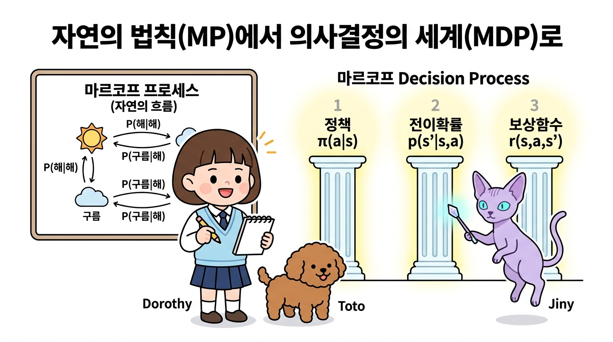

**그림 05-2-2** 도로시의 궁금증과 지니의 해답: 마르코프 과정(MP의 상태 행렬 <i>Pij</i>) vs 마르코프 결정 과정(MDP의 3대 수식: &pi;, <i>p</i>, <i>r</i>)

---

### 05.2.2 상태 전이 (State Transition)

상태 전이state transition는 에이전트가 현재 상태 <i>s</i>에서 특정 행동 <i>a</i>를 실행했을 때 다음 상태 <i>s'</i>로 변화하는 물리적 또는 논리적 메커니즘을 뜻합니다.

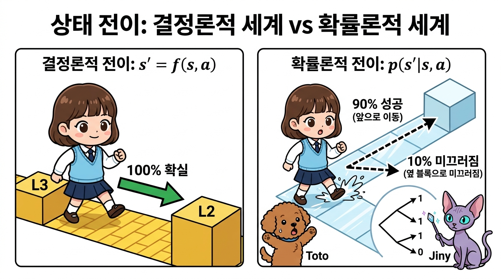

**그림 05-2-3** 상태 전이의 두 가지 형태: 결정적 전이 vs 확률적 전이 (환경의 마찰, 외력, 기계 오차)

---

#### 05.2.2.1 결정적 상태 전이와 상태 전이 함수 <i>f</i>(<i>s</i>, <i>a</i>)

**결정적 상태 전이(Deterministic Transition)**는 현재 상태 <i>s</i>에서 행동 <i>a</i>를 취했을 때, 다음 상태 <i>s'</i>가 100% 확실하게 단 하나로 결정되는 경우입니다.

<i>s'</i> = <i>f</i>(<i>s</i>, <i>a</i>)

* <i>f</i>(<i>s</i>, <i>a</i>): 현재 상태 <i>s</i>와 에이전트의 행동 <i>a</i>를 입력받아 다음 상태 <i>s'</i>를 하나로 확정하여 출력하는 함수입니다. 이를 **상태 전이 함수**라고 부릅니다.
* 예: 체스나 바둑처럼 플레이어가 말을 움직이면 말이 놓이는 위치가 100% 확실하게 정해지는 완벽한 환경.

---

  

    🎧
    대화 음성 듣기 (도로시 & 지니)
  

  

    <button type="button" class="btn-audio-play" style="background: #0284c7; color: #ffffff; border: none; border-radius: 16px; padding: 5px 13px; font-size: 0.82rem; font-weight: 600; cursor: pointer; display: inline-flex; align-items: center; gap: 4px; box-shadow: 0 1px 2px rgba(2,132,199,0.3);">
      ▶️ 재생
    </button>
    <button type="button" class="btn-audio-stop" style="background: #e2e8f0; color: #475569; border: none; border-radius: 16px; padding: 5px 11px; font-size: 0.82rem; font-weight: 600; cursor: pointer; display: inline-flex; align-items: center; gap: 4px;">
      ⏹️ 정지
    </button>
  

  <audio src="./audio/dialogue_5_2_scene2.mp3" preload="none"></audio>

> 👧 **도로시**: "지니야! 내가 L3 타일에서 '왼쪽으로 한 칸 걷기'를 하면, 바람이나 미끄러짐 없이 무조건 L2 타일에 정확히 도착하는 세상인 거지?"
>
> 🧚 **지니**: "맞아 도로시야! 어떤 우연이나 오차도 없이, 상태와 행동을 넣으면 다음 상태가 자판기 버튼 누르듯 100% 하나로 튀어나오는 완벽한 함수 <i>f</i>(<i>s</i>, <i>a</i>)로 정의된단다!"

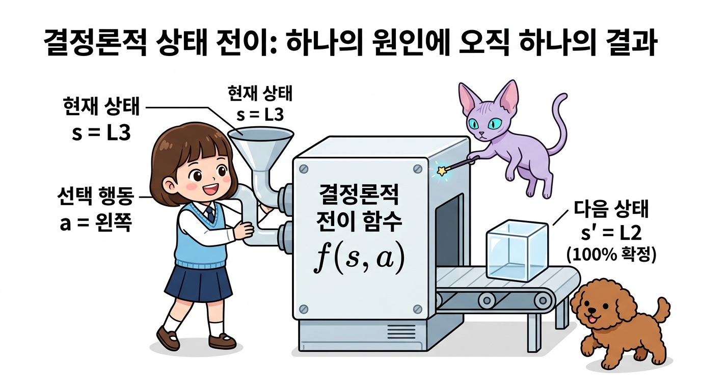

**그림 05-2-4** 결정적 상태 전이와 상태 전이 함수 <i>s'</i> = <i>f</i>(<i>s</i>, <i>a</i>)의 입출력 구조 (오차 없는 100% 확정 전이)

---

#### 05.2.2.2 확률적 상태 전이와 상태 전이 확률 <i>p</i>(<i>s'</i> \| <i>s</i>, <i>a</i>)

현실 세계의 로봇이나 자율주행차는 바닥의 미끄러움(마찰력 변화), 강한 돌풍(외력), 모터의 기어 유격이나 센서 노이즈(내부 오차) 때문에 의도한 대로 완벽하게 움직이지 못할 수 있습니다.

  

    🎧
    대화 음성 듣기 (토토 & 지니)
  

  

    <button type="button" class="btn-audio-play" style="background: #0284c7; color: #ffffff; border: none; border-radius: 16px; padding: 5px 13px; font-size: 0.82rem; font-weight: 600; cursor: pointer; display: inline-flex; align-items: center; gap: 4px; box-shadow: 0 1px 2px rgba(2,132,199,0.3);">
      ▶️ 재생
    </button>
    <button type="button" class="btn-audio-stop" style="background: #e2e8f0; color: #475569; border: none; border-radius: 16px; padding: 5px 11px; font-size: 0.82rem; font-weight: 600; cursor: pointer; display: inline-flex; align-items: center; gap: 4px;">
      ⏹️ 정지
    </button>
  

  <audio src="./audio/dialogue_5_2_scene3.mp3" preload="none"></audio>

> 🐶 **토토**: "멍멍! 내가 앞으로 똑바로 달리려고 했는데, 빙판길이라 미끄러져서 옆으로 갈 수도 있다는 뜻이야?"
>
> 🧚 **지니**: "맞아 토토야! '왼쪽으로 이동' 행동을 실행해도 90%(0.9)의 확률로만 왼쪽 칸에 안착하고, 10%(0.1)의 확률로는 얼음에 미끄러져 제자리에 머물 수 있어. 이처럼 현실의 불확실성을 담아낸 것이 바로 **상태 전이 확률**이란다!"

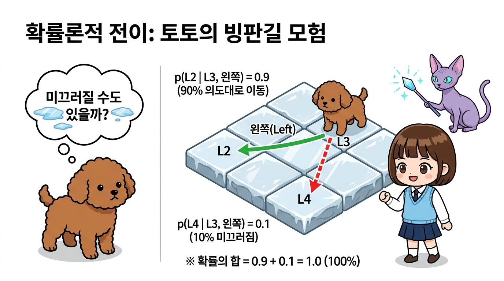

**그림 05-2-5** 토토의 걱정과 상태 전이 확률 <i>p</i>(<i>s'</i> \| <i>s</i>, <i>a</i>): 90% 정상 도달 vs 10% 미끄러짐 제자리 잔류

---

확률적 상태 전이는 다음과 같이 **조건부 확률(Conditional Probability)**로 나타냅니다.

<i>p</i>(<i>s'</i> | <i>s</i>, <i>a</i>) = Pr(<i>S</i><i>t+1</i> = <i>s'</i> | <i>S</i><i>t</i> = <i>s</i>, <i>A</i><i>t</i> = <i>a</i>)

* 기호 `|`의 오른쪽은 조건(현재 상태 <i>s</i>에서 행동 <i>a</i>를 취함)입니다.
* 기호 `|`의 왼쪽은 그 조건하에서 다음 상태가 <i>s'</i>가 될 확률을 뜻합니다.
* 모든 가능한 다음 상태 <i>s'</i>에 대해 확률을 다 더하면 항상 1이 됩니다:
   &Sigma;<i>s'</i> &isin; <i>S</i> <i>p</i>(<i>s'</i> \| <i>s</i>, <i>a</i>) = 1.0

> 💡 **참고**: 결정적 상태 전이 <i>s'</i> = <i>f</i>(<i>s</i>, <i>a</i>)는 특정 <i>s'</i>에 대해 전이 확률이 1.0이고 나머지 상태는 0.0인 확률적 상태 전이의 특수한 형태로 자연스럽게 포섭됩니다.

---

### 05.2.3 MDP에서의 마르코프 성질 (Markov Property)

마르코프 결정 과정에서 가장 중요한 대전제는 **"다음 상태 <i>S</i><i>t+1</i>와 보상 <i>R</i><i>t</i>는 오직 현재 상태 <i>S</i><i>t</i>와 현재 행동 <i>A</i><i>t</i>에 의해서만 결정되며, 과거의 모든 궤적(<i>S</i>0, <i>A</i>0, ..., <i>S</i><i>t-1</i>, <i>A</i><i>t-1</i>)과는 무관하다"**는 것입니다.

Pr(<i>S</i><i>t+1</i> = <i>s'</i> | <i>S</i><i>t</i> = <i>s</i><i>t</i>, <i>A</i><i>t</i> = <i>a</i><i>t</i>, <i>S</i><i>t-1</i> = <i>s</i><i>t-1</i>, <i>A</i><i>t-1</i> = <i>a</i><i>t-1</i>, ..., <i>S</i>0 = <i>s</i>0, <i>A</i>0 = <i>a</i>0) 
= Pr(<i>S</i><i>t+1</i> = <i>s'</i> | <i>S</i><i>t</i> = <i>s</i><i>t</i>, <i>A</i><i>t</i> = <i>a</i><i>t</i>) = <i>p</i>(<i>s'</i> | <i>s</i><i>t</i>, <i>a</i><i>t</i>)

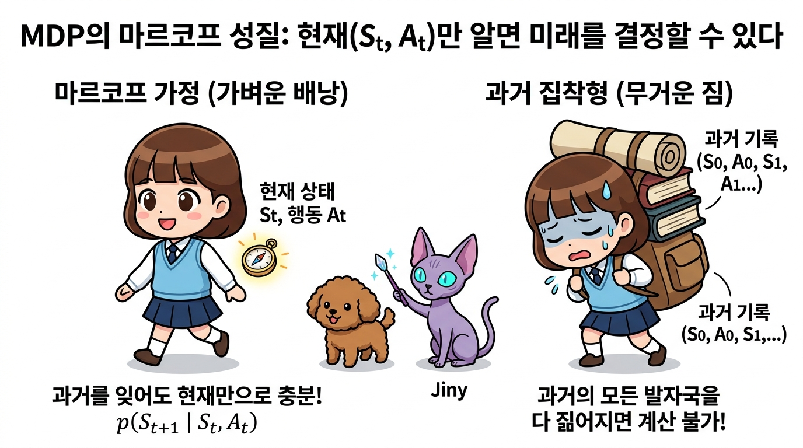

**그림 05-2-6** MDP에서의 마르코프 성질: 현재 상태만으로 충분한 가벼운 의사결정 vs 무거운 과거 기록의 짐

---

#### 왜 마르코프 성질이 강화학습의 축복일까요?
**문제의 단순화 (Memoryless)**:  
에이전트는 거대한 과거 역사책을 짊어지고 다닐 필요 없이, 현재 손에 쥔 나침반(현재 상태 <i>St</i>)만 보고도 항상 최적의 결정을 내릴 수 있습니다.

**차원의 저주(Curse of Dimensionality) 극복**:  
과거 기록의 조합을 모두 상태로 고려하면 상태 공간이 시간 흐름에 따라 기하급수적으로 폭발하지만, 마르코프 가정을 통해 현재 상태 집합 \|<i>S</i>\|만으로 문제를 유한하게 정의하고 효율적인 알고리즘(DP, Q-Learning 등)을 적용할 수 있게 됩니다.

---

### 05.2.4 보상 함수 (Reward Function)

에이전트가 상태 <i>s</i>에서 행동 <i>a</i>를 취해 다음 상태 <i>s'</i>에 도달했을 때 환경이 부여하는 피드백 값입니다.

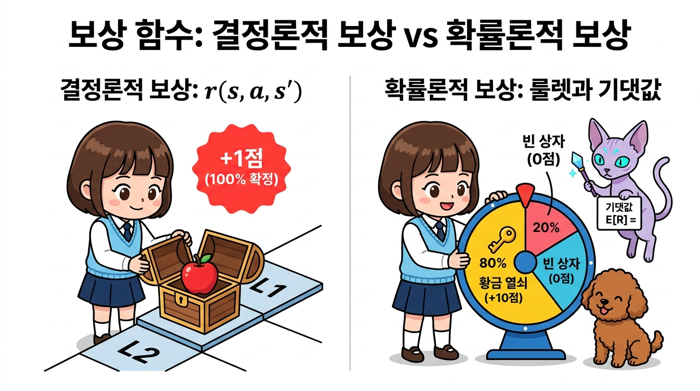

**그림 05-2-7** 보상 함수의 유형: 확정적으로 주어지는 결정적 보상 vs 기댓값으로 계산하는 확률적 보상

---

#### 05.2.4.1 결정적 보상 함수 <i>r</i>(<i>s</i>, <i>a</i>, <i>s'</i>)

에이전트가 상태 <i>s</i>에서 행동 <i>a</i>를 하여 상태 <i>s'</i>로 전이되었을 때 지급받는 실수(Real Number) 보상값입니다.

<i>R</i><i>t</i> = <i>r</i>(<i>s</i>, <i>a</i>, <i>s'</i>)

* 예를 들어 그리드 월드에서 어떤 칸(<i>s'</i>)에 도착했는지만으로 사과(+1)나 폭탄(-2)이 정해진다면, 단순화하여 <i>r</i>(<i>s'</i>) 형태로 쓸 수도 있습니다.

---

  

    🎧
    대화 음성 듣기 (도로시 & 지니)
  

  

    <button type="button" class="btn-audio-play" style="background: #0284c7; color: #ffffff; border: none; border-radius: 16px; padding: 5px 13px; font-size: 0.82rem; font-weight: 600; cursor: pointer; display: inline-flex; align-items: center; gap: 4px; box-shadow: 0 1px 2px rgba(2,132,199,0.3);">
      ▶️ 재생
    </button>
    <button type="button" class="btn-audio-stop" style="background: #e2e8f0; color: #475569; border: none; border-radius: 16px; padding: 5px 11px; font-size: 0.82rem; font-weight: 600; cursor: pointer; display: inline-flex; align-items: center; gap: 4px;">
      ⏹️ 정지
    </button>
  

  <audio src="./audio/dialogue_5_2_scene4.mp3" preload="none"></audio>

> 👧 **도로시**: "지니야! L3 타일에서 왼쪽으로 이동해서 L2 타일(사과 칸)에 도착하면, 의심할 여지 없이 무조건 +1 사과를 얻는 거지?"
>
> 🧚 **지니**: "맞아 도로시야! 행동의 결과로 특정 상태에 도달했을 때 정해진 수치(+1 또는 -2)가 100% 확실하게 주어지는 함수를 **결정적 보상 함수 <i>r</i>(<i>s</i>, <i>a</i>, <i>s'</i>)**라고 한단다!"

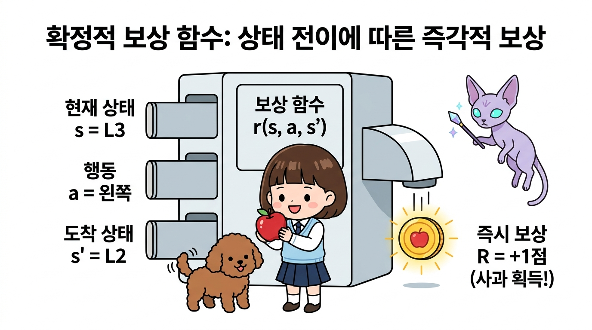

**그림 05-2-8** 결정적 보상 함수 <i>r</i>(<i>s</i>, <i>a</i>, <i>s'</i>): 상태와 행동, 도착 상태에 따라 100% 확정 지급되는 보상 메커니즘

---

#### 05.2.4.2 확률적 보상과 보상 기댓값 함수 &Ropf;(<i>s</i>, <i>a</i>)

보물상자를 열었을 때 80% 확률로 황금 열쇠(+10)가 나오고 20% 확률로는 꽝(0)이 나오는 것처럼 보상이 확률적으로 주어질 수도 있습니다. 이 경우 우리는 **보상의 기댓값(Expected Reward)**을 계산하여 다룹니다.

&Ropf;(<i>s</i>, <i>a</i>) = &Eopf;[ <i>R</i><i>t</i> | <i>S</i><i>t</i> = <i>s</i>, <i>A</i><i>t</i> = <i>a</i> ] = &Sigma;<i>s'</i> &isin; <i>S</i> <i>p</i>(<i>s'</i> | <i>s</i>, <i>a</i>) &middot; <i>r</i>(<i>s</i>, <i>a</i>, <i>s'</i>)

---

  

    🎧
    대화 음성 듣기 (토토 & 지니)
  

  

    <button type="button" class="btn-audio-play" style="background: #0284c7; color: #ffffff; border: none; border-radius: 16px; padding: 5px 13px; font-size: 0.82rem; font-weight: 600; cursor: pointer; display: inline-flex; align-items: center; gap: 4px; box-shadow: 0 1px 2px rgba(2,132,199,0.3);">
      ▶️ 재생
    </button>
    <button type="button" class="btn-audio-stop" style="background: #e2e8f0; color: #475569; border: none; border-radius: 16px; padding: 5px 11px; font-size: 0.82rem; font-weight: 600; cursor: pointer; display: inline-flex; align-items: center; gap: 4px;">
      ⏹️ 정지
    </button>
  

  <audio src="./audio/dialogue_5_2_scene5.mp3" preload="none"></audio>

> 🐶 **토토**: "멍멍! 보물상자를 열었을 때 어떤 때는 황금 열쇠(+10)가 나오고, 어떤 때는 먼지만 풀풀 날리는 꽝(0)이 나오면 보상을 몇 점이라고 해야 해?"
>
> 🧚 **지니**: "그럴 때는 각 결과가 나올 확률을 곱해서 더한 **보상의 기댓값(Expected Reward)**을 계산하면 돼! 80% 확률의 +10과 20% 확률의 0점을 합산하면 평균적으로 8.0점의 가치가 있는 상자라고 평가할 수 있단다!"

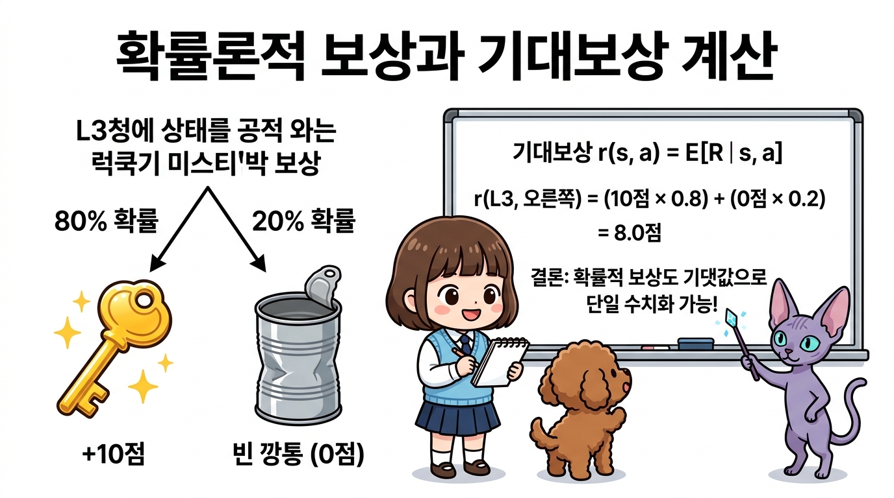

**그림 05-2-9** 확률적 보상과 보상 기댓값 함수 &Ropf;(<i>s</i>, <i>a</i>): 불확실한 보상 결과들의 가중 평균 계산 구조

이처럼 기댓값 수식을 도입하면 확률적 보상 시스템도 결정적 보상과 완전히 동일한 벨만 방정식 체계 안에서 깔끔하게 해결됩니다.

---

### 05.2.5 에이전트의 정책 (Policy)

**정책(Policy)**은 에이전트의 지능과 행동 양식을 결정하는 핵심 전략입니다. 즉, "어떤 상태 <i>s</i>에 있을 때 무슨 행동 <i>a</i>를 할 것인가?"를 규정하는 수학적 매핑입니다.

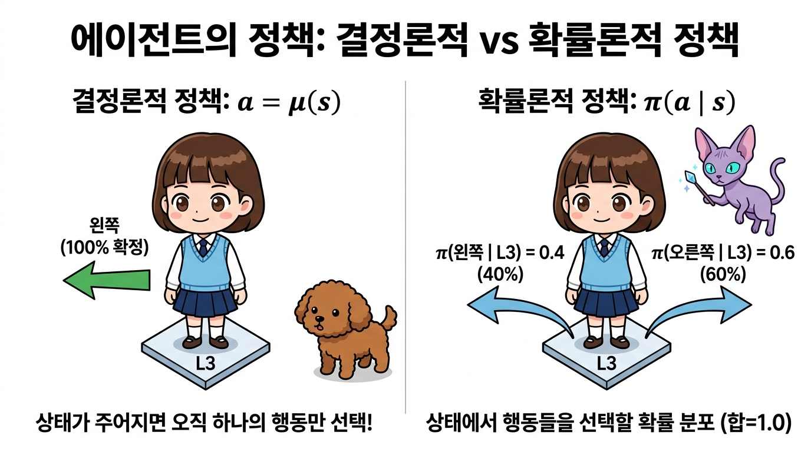

**그림 05-2-10** 에이전트의 정책 유형 비교: 100% 확정형 결정적 정책 &mu;(<i>s</i>) vs 확률 분포를 갖는 확률적 정책 &pi;(<i>a</i> \| <i>s</i>)

---

#### 05.2.5.1 결정적 정책 &mu;(<i>s</i>)

상태 <i>s</i>가 주어지면 에이전트가 수행할 행동 <i>a</i>가 단 하나로 100% 확정되는 규칙입니다.

<i>a</i> = &mu;(<i>s</i>)

* **&mu; (뮤, mu)**: 제어 이론에서 상태를 제어 입력으로 1:1 대응시키는 제어 함수(Controller)를 나타낼 때 전통적으로 사용하는 그리스 문자입니다.
* 예: 상태 <i>s</i> = L3일 때 &mu;(L3) = Left (무조건 왼쪽으로만 이동).

---

  

    🎧
    대화 음성 듣기 (도로시 & 지니)
  

  

    <button type="button" class="btn-audio-play" style="background: #0284c7; color: #ffffff; border: none; border-radius: 16px; padding: 5px 13px; font-size: 0.82rem; font-weight: 600; cursor: pointer; display: inline-flex; align-items: center; gap: 4px; box-shadow: 0 1px 2px rgba(2,132,199,0.3);">
      ▶️ 재생
    </button>
    <button type="button" class="btn-audio-stop" style="background: #e2e8f0; color: #475569; border: none; border-radius: 16px; padding: 5px 11px; font-size: 0.82rem; font-weight: 600; cursor: pointer; display: inline-flex; align-items: center; gap: 4px;">
      ⏹️ 정지
    </button>
  

  <audio src="./audio/dialogue_5_2_scene6.mp3" preload="none"></audio>

> 👧 **도로시**: "지니야! L3 상태에 서면 망설임 없이 무조건 '왼쪽(Left)'으로만 가도록 정해둔 나침반 규칙이 바로 **결정적 정책(&mu;)**인 거지?"
>
> 🧚 **지니**: "맞아 도로시야! 어떤 상황(<i>s</i>)에서도 고민이나 확률 없이 단 하나의 최선의 행동(<i>a</i>)을 100% 확정하여 실행하는 규칙을 **결정적 정책 <i>a</i> = &mu;(<i>s</i>)**라고 부른단다!"

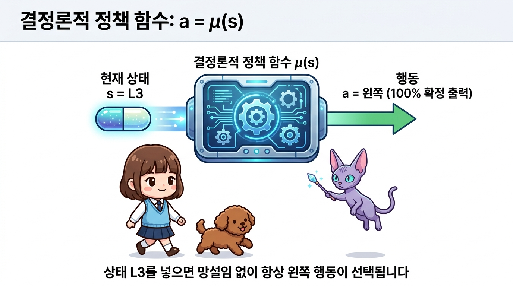

**그림 05-2-11** 결정적 정책 <i>a</i> = &mu;(<i>s</i>): 현재 상태에서 실행할 최적의 행동이 단 하나로 100% 확정되는 정책 메커니즘

---

#### 05.2.5.2 확률적 정책 &pi;(<i>a</i> \| <i>s</i>)

상태 <i>s</i>가 주어졌을 때 여러 행동 후보들 각각을 선택할 **확률 분포(Probability Distribution)**를 반환하는 규칙입니다.

&pi;(<i>a</i> | <i>s</i>) = Pr(<i>A</i><i>t</i> = <i>a</i> | <i>S</i><i>t</i> = <i>s</i>)

* **&pi; (파이, pi)**: 정책(Policy)의 첫 글자 'P'에 대응되는 그리스 문자이자 확률론의 기본 기호입니다.
* 특정 상태 <i>s</i>에서 취할 수 있는 모든 행동 <i>a</i>에 대한 정책 확률의 합은 반드시 1.0입니다:
   &Sigma;<i>a</i> &isin; <i>A</i> &pi;(<i>a</i> \| <i>s</i>) = 1.0
* 예: 상태 <i>s</i> = L3에서 &pi;(Left \| L3) = 0.4, &pi;(Right \| L3) = 0.6.

---

  

    🎧
    대화 음성 듣기 (토토 & 지니)
  

  

    <button type="button" class="btn-audio-play" style="background: #0284c7; color: #ffffff; border: none; border-radius: 16px; padding: 5px 13px; font-size: 0.82rem; font-weight: 600; cursor: pointer; display: inline-flex; align-items: center; gap: 4px; box-shadow: 0 1px 2px rgba(2,132,199,0.3);">
      ▶️ 재생
    </button>
    <button type="button" class="btn-audio-stop" style="background: #e2e8f0; color: #475569; border: none; border-radius: 16px; padding: 5px 11px; font-size: 0.82rem; font-weight: 600; cursor: pointer; display: inline-flex; align-items: center; gap: 4px;">
      ⏹️ 정지
    </button>
  

  <audio src="./audio/dialogue_5_2_scene7.mp3" preload="none"></audio>

> 🐶 **토토**: "멍멍! 항상 똑같은 길만 가면 새로운 곳에 숨겨진 황금 보물을 못 찾을 수도 있잖아?"
>
> 🧚 **지니**: "맞아 토토야! 그래서 학습 초기에는 왼쪽으로 갈 확률 40%(0.4), 오른쪽으로 갈 확률 60%(0.6)처럼 확률적으로 행동을 골라 세상을 골고루 탐험(Exploration)할 수 있는 **확률적 정책 &pi;(<i>a</i> \| <i>s</i>)**를 유용하게 활용한단다!"

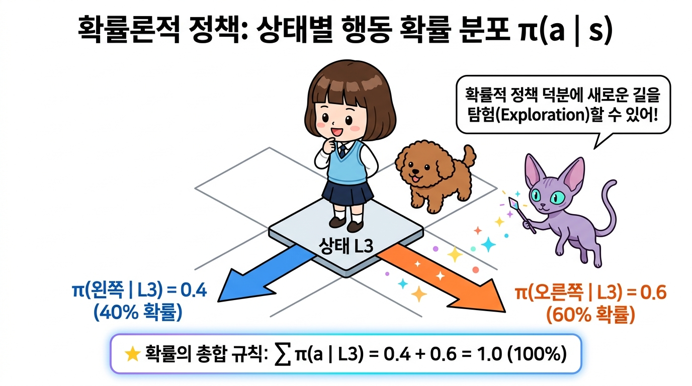

**그림 05-2-12** 확률적 정책 &pi;(<i>a</i> \| <i>s</i>): 상태 <i>s</i>에서 각 행동 후보를 선택할 확률 분포 구조 (확률의 총합 = 1.0)

  

    🎧
    지니의 꿀팁 음성 듣기 (지니)
  

  

    <button type="button" class="btn-audio-play" style="background: #0284c7; color: #ffffff; border: none; border-radius: 16px; padding: 5px 13px; font-size: 0.82rem; font-weight: 600; cursor: pointer; display: inline-flex; align-items: center; gap: 4px; box-shadow: 0 1px 2px rgba(2,132,199,0.3);">
      ▶️ 재생
    </button>
    <button type="button" class="btn-audio-stop" style="background: #e2e8f0; color: #475569; border: none; border-radius: 16px; padding: 5px 11px; font-size: 0.82rem; font-weight: 600; cursor: pointer; display: inline-flex; align-items: center; gap: 4px;">
      ⏹️ 정지
    </button>
  

  <audio src="./audio/dialogue_5_2_scene8.mp3" preload="none"></audio>

> 🧚 **지니의 꿀팁**: "강화학습 초기에는 에이전트가 새로운 보상을 찾기 위해 다양한 길을 탐험(Exploration)해야 하므로 **확률적 정책(&pi;)**을 많이 쓰고, 학습이 완료되어 가장 완벽한 길을 찾았을 때는 흔들림 없이 최선의 선택만 내리는 **결정적 정책(&mu;)**을 주로 사용한단다!"

---

### 05.2.6 핵심 요약

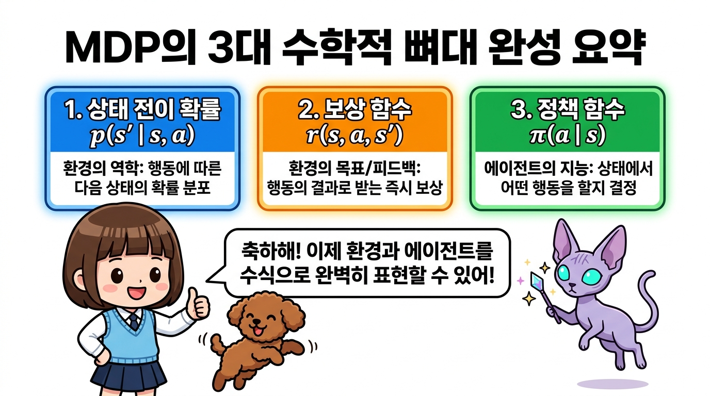

**그림 05-2-13** 05.2 환경과 에이전트의 수식 핵심 정리 인포그래픽

1. **상태 전이 확률 <i>p</i>(<i>s'</i> \| <i>s</i>, <i>a</i>)**: 현재 상태 <i>s</i>에서 행동 <i>a</i>를 수행했을 때 다음 상태 <i>s'</i>로 도달할 확률 분포입니다.
2. **마르코프 성질(Markov Property)**: 과거의 기록에 의존하지 않고 오직 현재의 (<i>s</i>, <i>a</i>)만으로 미래의 상태 <i>s'</i>와 보상 <i>r</i>이 결정되는 성질입니다.
3. **보상 함수 <i>r</i>(<i>s</i>, <i>a</i>, <i>s'</i>)**: 행동과 전이의 결과로 환경이 에이전트에게 지급하는 평가 신호입니다.
4. **정책 &pi;(<i>a</i> \| <i>s</i>) / &mu;(<i>s</i>)**: 상태 <i>s</i>에서 에이전트가 어떤 행동을 선택할지 결정하는 의사결정 알고리즘입니다.

다음 **05.3절**에서는 이 수식들을 바탕으로 에이전트가 달성해야 할 궁극적인 목적지인 **'MDP의 목표와 가치 함수(Value Function)'**를 정복해 보겠습니다!

