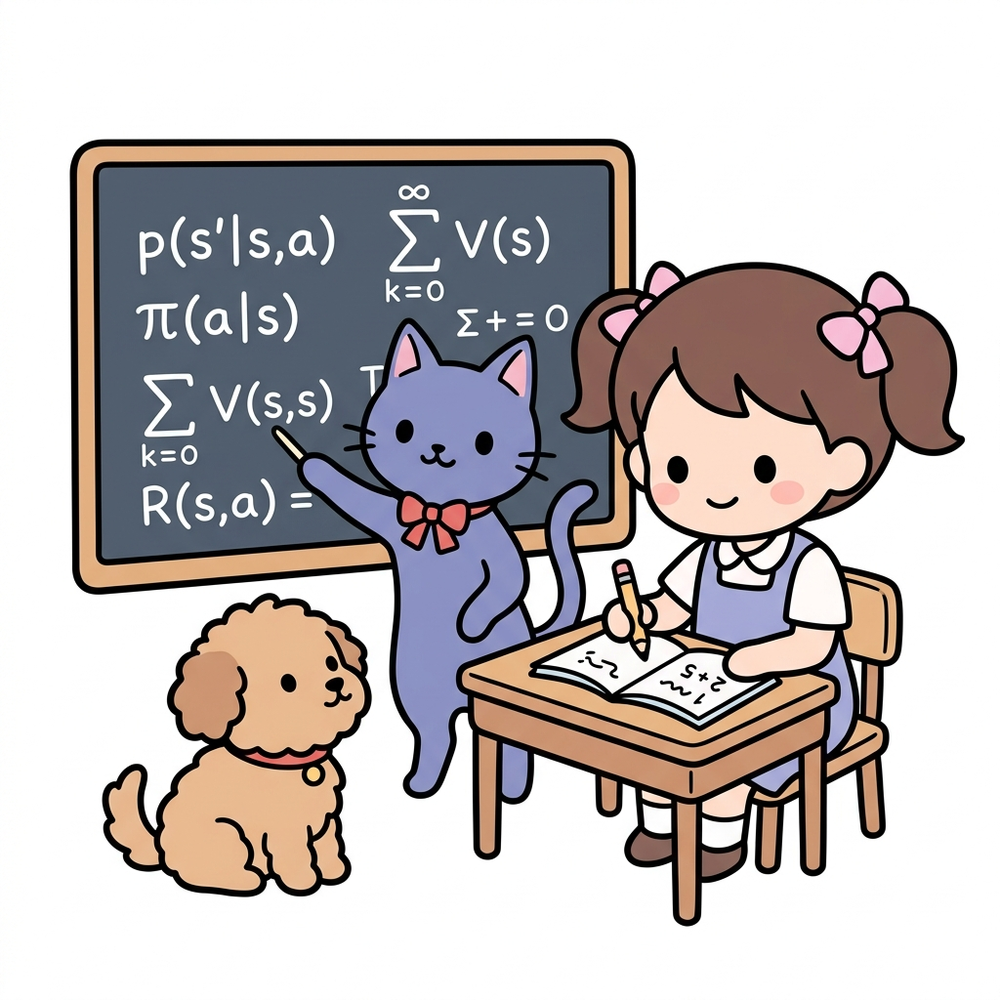
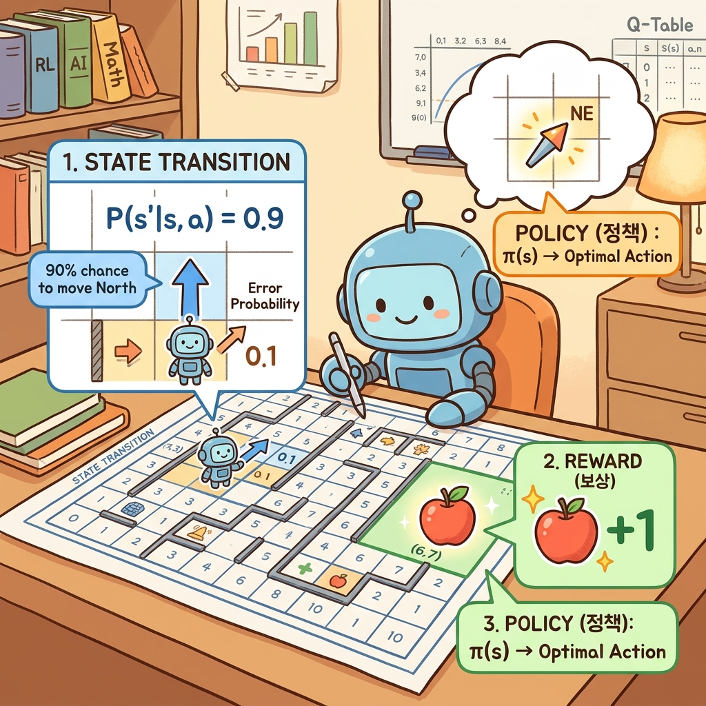
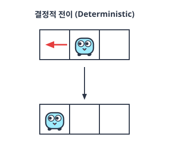
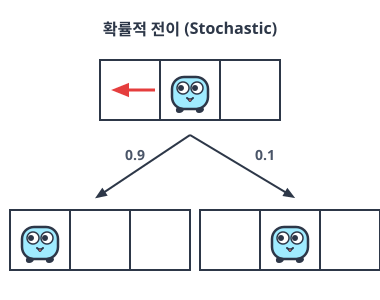
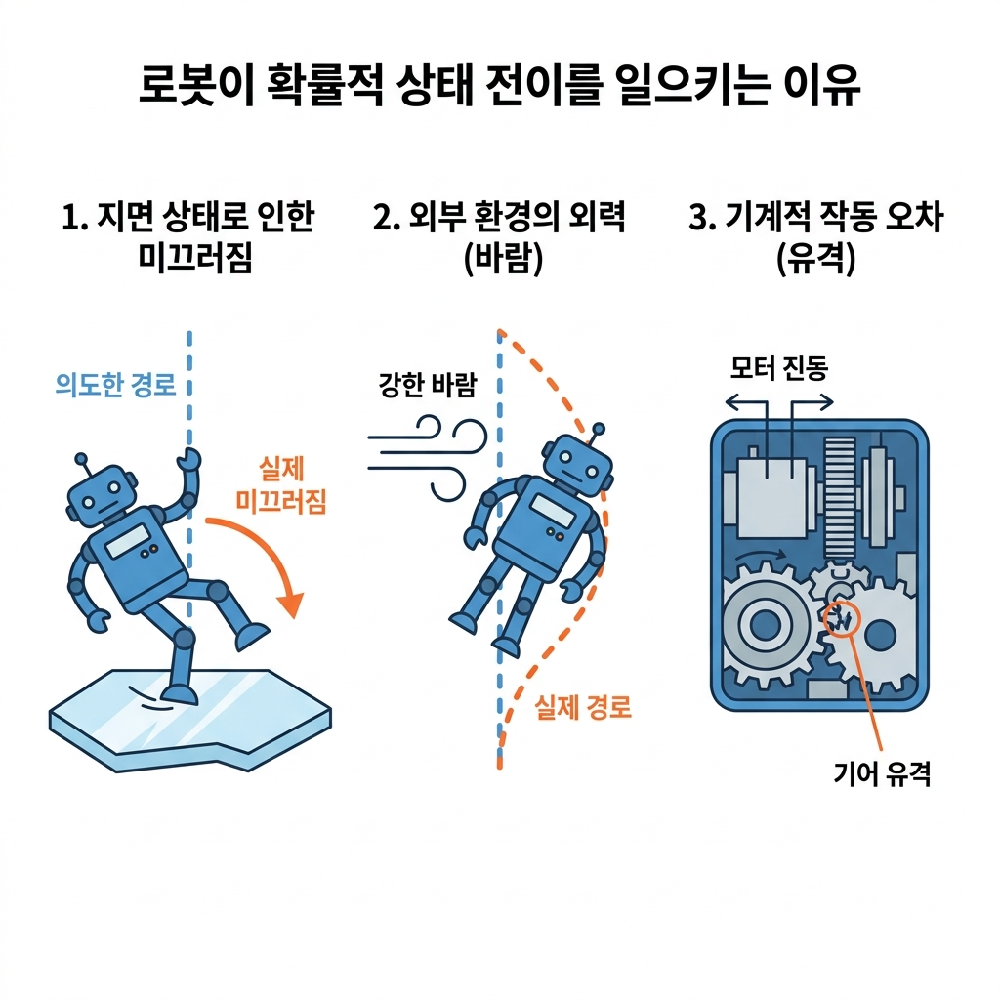
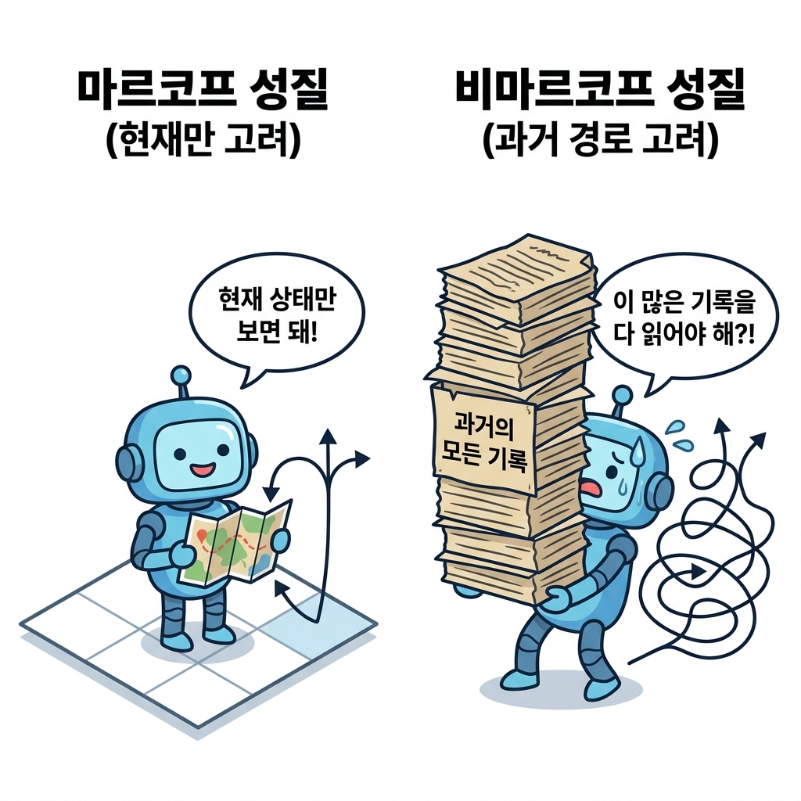
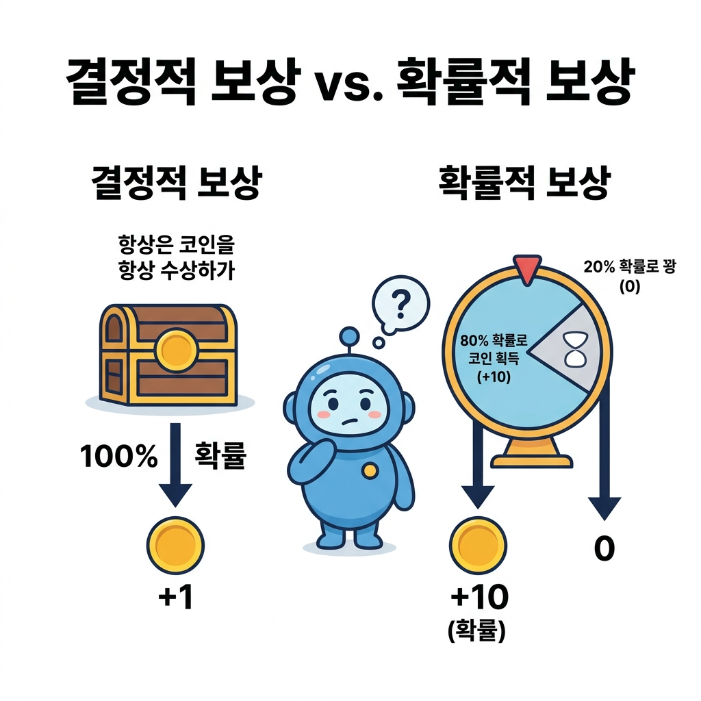
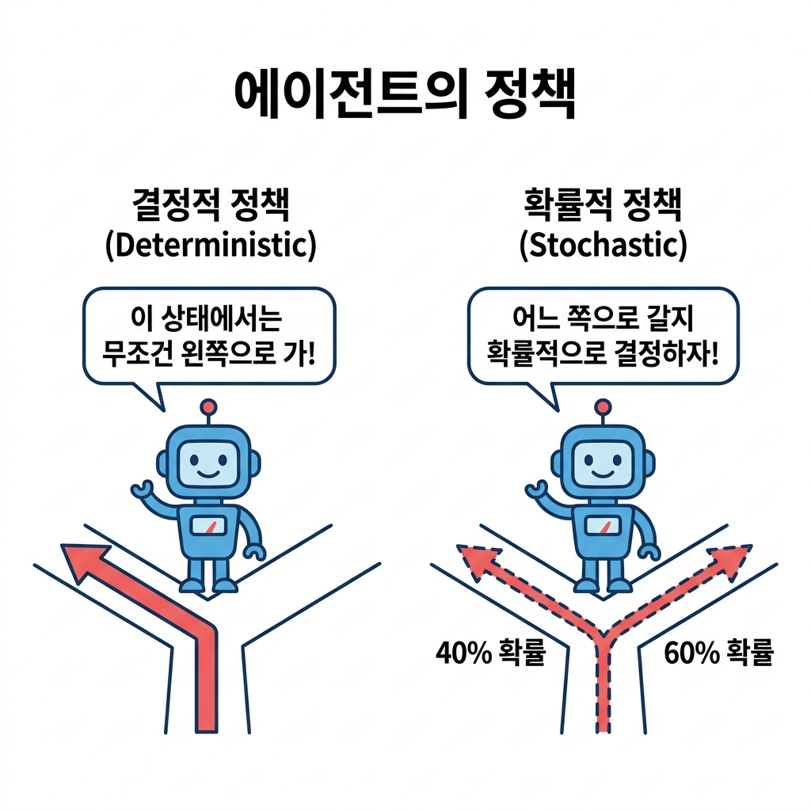

# 05.2 환경과 에이전트를 수식으로

**그림 05-2** 칠판에 적어둔 상태 전이 확률 p(s'|s,a)와 정책 pi(a|s)의 수식을 설명해 주는 지니와 도로시

MDP의 동적 상호작용을 수학으로 기술하기 위한 핵심 수식들을 정리합니다. 상태 전이 확률, 보상 함수, 그리고 에이전트의 행동 가이드라인인 **정책(Policy)** 수식의 엄밀한 정의들을 지니와 도로시의 즐거운 칠판 수학 필기를 보며 머릿속에 정교하게 담아봅시다!

---

MDP는 에이전트와 환경의 상호작용을 수식으로 표현합니다. 그렇게 하려면 다음의 세 요소를 수식으로 표현해야 합니다.

• 상태 전이: 상태는 어떻게 전이되는가?
• 보상: 보상은 어떻게 주어지는가?
• 정책: 에이전트는 행동을 어떻게 결정하는가?

이 세 요소를 모두 수식으로 표현한다면 MDP를 공식으로 표현했다고 볼 수 있습니다. 

### 05.2.1 상태 전이

'상태 전이'부터 살펴보겠습니다. 

상태 전이state transition는 에이전트가 어떤 상태에서 특정 행동을 취했을 때 다음 상태로 변화하는 물리적 또는 논리적 움직임을 의미합니다. 

이러한 상태 전이는 전이되는 규칙성에 따라 크게 두 가지 방식으로 나뉩니다.

1. **결정적 상태 전이 (Deterministic)**: 에이전트가 내린 행동의 결과로 다음 상태가 항상 100% 동일하게 한 가지로 확실하게 결정되는 방식입니다.
2. **확률적 상태 전이 (Probabilistic)**: 에이전트가 특정 행동을 취하더라도 바람, 마찰력, 혹은 시스템 노이즈 등 여러 무작위적인 주변 조건에 의해 여러 후보 상태 중 하나로 확률을 가지고 이동하는 방식입니다.

이 두 가지 성격이 강화 학습 수식에서 어떻게 구체적으로 다루어지는지 알아보겠습니다.

#### 05.2.1.1 결정적 상태 전이와 상태 전이 함수

결정적 상태 전이의 예인 [그림 05-5]를 보겠습니다.

**그림 05-5** 결정적 상태 전이의 예

[그림 05-5]는 에이전트가 왼쪽으로 이동하는 행동을 선택했고, 그 결과로 에이전트가 '반드시' 왼쪽으로 이동하는 모습을 보여줍니다. 

이처럼 현재 상태와 행동이 주어졌을 때 다음 상태가 항상 100% 동일하게 한 가지로만 결정되는 성질을 **결정적**deterministic이라고 합니다.

상태 전이가 결정적일 경우 다음 상태 *s'*는 현재 상태 *s*와 행동 *a*에 의해 '단 하나로' 결정됩니다. 따라서 함수로는 다음과처럼 표현할 수 있습니다.
$$
s' = f(s, a)
$$

*f*(*s*, *a*)는 상태 *s*와 행동 *a*를 입력하면 다음 상태 *s'*를 출력하는 함수입니다. 이 함수를 가리켜 상태 전이 함수state transition function라고 합니다.

#### 05.2.1.2 확률적 상태 전이와 상태 전이 확률

반면, 확률적stochastic 상태 전이는 특정 행동을 선택하더라도 다음 상태가 하나로 확실하게 결정되지 않고 여러 가능성을 갖습니다. 

구체적인 예인 [그림 05-6]을 보겠습니다.

**그림 05-6** 확률적 상태 전이의 예

[그림 05-6]은 에이전트가 왼쪽으로 이동하는 행동을 선택했음에도 불구하고, 0.9의 확률로만 실제로 왼쪽으로 이동하고 0.1의 확률로는 제자리에 머물러 있는 모습을 보여줍니다. 

이처럼 행동에 따른 결과가 확률적으로 달라지는 이유는 바닥이 미끄러운 물리적 환경 때문일 수도 있고, 에이전트의 모터나 센서 등 내부 제어 장치에 미세한 작동 오차가 존재하기 때문일 수도 있습니다. 이러한 현실적인 불확실성 요인들을 그림으로 표현하면 [그림 05-7]과 같습니다.

**그림 05-7** 확률적 상태 전이를 일으키는 현실의 불확실성 요인

[그림 05-7]과 같이 바닥 표면 상태(미끄러운 얼음이나 오일), 바람과 같은 외력의 방해, 혹은 기어의 유격(backlash)이나 모터 제어의 내부 진동 같은 기계 오차는 에이전트가 의도한 행동(Intended Command)을 취하더라도 결과적으로 실제 경로가 이탈하여 다른 상태로 전이되도록 만듭니다. 강화 학습은 이처럼 현실 세계에 상존하는 다양한 물리적 제어 오차와 불확실성을 모델링하기 위해 확률적 상태 전이를 기본 뼈대로 삼습니다.

>  상태 전이가 결정적이라도 확률적으로 설명하는 것이 가능합니다. 예를 들어 '에이전트가 왼쪽으로 이동하는 행동을 선택하면 1.0(100%)의 확률로 왼쪽으로 이동한다'라고 기술하면 결정적 전이는 확률적 전이의 특수한 케이스로 자연스럽게 포함됩니다.

이제 확률적 상태 전이를 수식으로 표기하는 방법을 설명하겠습니다. 

에이전트가 상태 *s*에서 행동 *a*를 선택한다고 해봅시다. 이 경우 다음 상태 *s'*로 이동할 확률은 다음과 같이 조건부 확률 형태로 나타냅니다.

$$
p(s' \mid s, a)
$$

기호 |의 오른쪽에는 '조건'을 나타내는 확률 변수를 적습니다. 

지금 식에서는 '상태 *s*에서 행동 *a*를 선택했다'라는 것이 조건에 해당합니다. 이 두 조건이 주어졌을 때 *s'*로 전이될 확률을 *p*(*s'* | *s*, *a*)로 나타내며, 이때 *p*(*s'* | *s*, *a*)를 상태 전이 확률state transition probability이라고 합니다. [그림 05-8]은 *p*(*s'* | *s*, *a*)의 구체적인 예입니다.

**그림 05-8** 상태 전이 확률의 예

그림과 같이 총 5개의 칸을 왼쪽부터 순서대로 L1, L2, L3, L4, L5라고 부르기로 합니다. 또한 에이전트의 행동에 대해서는 '왼쪽으로 이동'을 Left, '오른쪽으로 이동'을 Right로 표기합니다. 

이제 에이전트가 L3에 있을 때, 즉 상태가 L3일 때 행동으로 Left를 선택했다고 해봅시다. 그리고 이 경우의 상태 전이 확률 *p*(*s'* | *s* = L3, *a* = Left)가 [그림 05-8]의 오른쪽 표와 같다고 합시다.

>  [그림 05-8]의 표는 정확히 말하면 상태 전이의 '확률 분포'입니다. 확률 변수 *s'*가 취할 수 있는 '모든' 값 각각의 확률을 나타내고 있기 때문입니다. 즉, 확률의 '분포'를 표현하였습니다.

#### 05.2.1.3 마르코프 성질(Markov Property) 정의

*p*(*s'* | *s*, *a*)가 다음 상태 *s'*를 결정하는 데는 '현재' 상태 *s*와 행동 *a*만이 영향을 줍니다. 

다시 말해 상태 전이에서는 과거의 정보, 즉 지금까지 어떤 상태들을 거쳐 왔고 어떤 행동들을 취해 왔는지는 전혀 신경 쓰지 않습니다. 이처럼 현재의 정보만 고려하는 성질을 **마르코프 성질**Markov property이라고 합니다. 이 개념을 시각화하면 [그림 05-9]와 같습니다.

**그림 05-9** 마르코프 성질의 개념 비교

[그림 05-9]의 왼쪽처럼 마르코프 성질을 만족하는 세계에서는 에이전트가 오직 '현재의 위치(상태)' 정보만을 지도에서 읽고 다음 행동 방향을 간단히 선택합니다. 반면, 오른쪽의 비마르코프 세계에서는 과거에 어디서부터 걸어왔는지 적혀 있는 거대한 무덤의 역사 책들을 머리에 짊어지고 끙끙대며 매 단계 행동을 정해야 합니다.

강화 학습 모델인 MDP는 이처럼 마르코프 성질을 만족한다고 가정하고 설계됩니다. 마르코프 성질을 도입하는 가장 큰 현실적인 이유는 **문제를 단순화하여 쉽게 해결하기 위해서**입니다. 과거의 기록까지 누적해 고려해야 한다면 데이터의 크기와 상태 공간의 수가 기하급수적으로 증가(차원의 저주)하여 문제를 푸는 것 자체가 거의 불가능해지기 때문입니다.

---

### 05.2.2 보상 함수

다음으로 보상에 대해 생각해봅시다.

#### 05.2.2.1 결정적 보상 함수 r(s, a, s')

설명이 복잡해지지 않도록 보상은 '결정적'으로 주어진다고 가정하겠습니다. 

에이전트가 상태 *s*에서 행동 *a*를 수행하여 다음 상태 *s'*가 되었을 때 얻는 보상을 *r*(*s*, *a*, *s'*)라는 함수로 정의합니다. 

그럼 보상 함수reward function의 예로 [그림 05-10]을 보겠습니다.

**그림 05-10** 보상 함수의 예

그림에는 에이전트가 상태 L2에서(*s* = L2), 행동 Left를 선택하여 상태 L1로 전이된 예가 그려져 있습니다. 

이 경우의 보상은 보상 함수 *r*(*s*, *a*, *s'*)를 통해 1임을 알 수 있습니다.

참고로 이 예에서는 다음 상태 *s'*만 알면 보상이 결정됩니다. 

이번 문제에서는 이동한 위치에 사과가 있느냐에 의해서만 보상이 결정되기 때문입니다. 따라서 보상 함수를 *r*(*s'*)로 구현할 수도 있습니다.

#### 05.2.2.2 확률적 보상 및 보상 기댓값의 개념

보상은 항상 똑같이 고정된 값이 지급되는 '결정적 보상'뿐 아니라, 확률 분포에 따라 지급되는 '확률적 보상' 형태로 주어질 수도 있습니다. 이 차이는 [그림 05-11]을 통해 잘 이해할 수 있습니다.

**그림 05-11** 결정적 보상과 확률적 보상의 비교

[그림 05-11]의 왼쪽처럼 '결정적 보상'은 해당 위치에 가기만 하면 100% 확률로 무조건 코인(+1)을 획득합니다. 반면, 오른쪽의 '확률적 보상'은 일종의 룰렛 판과 같아서, 80% 확률로 큰 잭팟 보상(+10)을 얻을 수 있지만 20% 확률로는 꽝(0)이 나오는 구조를 가집니다. 

강화 학습에서는 이와 같은 확률적 보상도 자연스럽게 수식으로 처리할 수 있습니다. 보상 함수 *r*(*s*, *a*, *s'*)가 고정 상수가 아닌 **'보상의 평균 기댓값(Expected Reward)'**을 계산하여 반환하도록 정의하면, 뒤이어 나오는 벨만 방정식 등 복잡한 MDP 유도 과정은 결정적 보상일 때와 수학적으로 완전히 동일하게 작동합니다. 다만 이번 강의의 설명 편의성을 위해 기본적으로 보상은 결정적으로 주어진다고 가정하고 이야기를 이어가겠습니다.

---

### 05.2.3 에이전트의 정책

다음으로 에이전트의 정책에 대해 생각해보죠.

정책policy은 에이전트가 행동을 결정하는 방식을 말합니다. 

#### '마르코프 결정 과정'에서 '결정'의 두 가지 본질적인 의미

여기서 '마르코프 결정 과정'이라는 이름에 포함된 **'결정'**이라는 단어의 뜻을 명확히 짚고 넘어갈 필요가 있습니다. 강화 학습에서 '결정'은 크게 두 가지 관점에서 핵심적인 역할을 수행합니다.

1. **에이전트의 주체적 의사결정 (Decision Making)**:
   단순히 환경의 변화를 수동적으로 관찰하는 마르코프 체인(Markov Chain)과 달리, MDP에서는 에이전트가 매 순간 행동을 **주체적으로 결정(의사결정)**합니다. 에이전트가 어떤 결정을 내리느냐에 따라 다음 상태와 앞으로 받게 될 보상의 흐름이 역동적으로 변화합니다. 이 **의사결정 규칙**을 정의한 것이 바로 **정책**입니다.
2. **인과 관계의 결정론적 성격 (Deterministic)**:
   의사결정(정책)과 그 결과(상태 전이)가 100% 확실한 하나의 결과로 고정되는지, 아니면 무작위적 확률을 따르는지를 구분하는 성질입니다.
   - **행동 결정(정책)**: 특정 상태에서 에이전트가 취할 행동이 단 하나로 확정되어 있다면 **결정적 정책**이고, 상황에 따라 여러 행동을 확률 분포로 선택한다면 **확률적 정책**입니다.
   - **상태 결정(상태 전이)**: 행동에 의해 다음 상태가 오직 하나로 확실하게 정해진다면 **결정적 상태 전이**이고, 여러 다음 상태로 갈 확률 분포가 주어져 있다면 **확률적 상태 전이**입니다.

결국 MDP의 궁극적인 목적은 전체 타임 스텝에 걸쳐 누적 보상을 최대화할 수 있는 **최선의 행동 결정(최적 정책)** 규칙을 찾아내는 것입니다. 에이전트가 마주하게 될 정책의 두 가지 유형(결정적 정책 vs 확률적 정책)의 핵심 차이를 정리하면 [그림 05-12]와 같습니다.

**그림 05-12** 에이전트의 정책 유형 비교 (결정적 vs 확률적)

[그림 05-12]의 왼쪽과 같이 결정적 정책에서는 에이전트가 처한 상태(갈림길)에서 무조건 정해진 방향(왼쪽)으로만 이동하는 100% 확정형 행동 결정을 내립니다. 반면, 오른쪽의 확률적 정책에서는 왼쪽으로 갈 확률(40%)과 오른쪽으로 갈 확률(60%)처럼 확률 분포에 기반하여 행동 결정을 내립니다.

정책에서 중요한 점은 에이전트는 '현재 상태'만으로 행동을 결정할 수 있다는 것입니다. '현재 상태'만으로 충분한 이유는 무엇일까요? 바로 환경의 상태 전이가 마르코프 성질에 따라 이루어지기 때문입니다.

#### 05.2.3.1 결정적 정책 μ(s)

환경의 상태 전이에서는 현재 상태 *s*와 행동 *a*만을 고려하여 다음 상태 *s'*가 결정됩니다. 

보상도 마찬가지로 현재 상태 *s*와 행동 *a* 그리고 전이된 상태 *s'*만으로 결정됩니다. 이상이 의미하는 바는 '환경에 대해 필요한 정보는 모두 현재 상태에 있다'는 것입니다. 따라서 에이전트가 '현재 상태'만으로 행동을 결정할 수 있습니다.

> NOTE_ MDP의 마르코프 성질이라는 특성은 에이전트에 대한 제약이 아니라 '환경에 대한 제약'으로 볼 수 있습니다. 즉, 마르코프 성질을 만족하도록 '상태'를 관리하는 책임이 환경 쪽에 있다는 뜻입니다. 에이전트 관점에서 보면 최선의 선택에 필요한 정보가 모두 현재 상태에 담기기 때문에 현재만을 바라보고 행동할 수 있습니다.

이때 행동을 결정하는 방식인 정책은 '결정적' 또는 '확률적'인 방식으로 나뉩니다. 먼저 결정적 정책의 구체적인 구현 예인 [그림 05-13]을 보겠습니다.

**그림 05-13** 결정적 정책의 예

[그림 05-13]과 같이 결정적 정책에서는 에이전트가 상태 L3에 있을 때 다른 대안 없이 반드시 왼쪽(Left)으로 이동하는 하나의 약속된 행동만을 수행합니다. 

이러한 결정적 정책은 함수로 다음과 같이 정의할 수 있습니다.
$$
a = \mu(s)
$$

μ(*s*)는 매개변수로 상태를 건네주면 행동 *a*를 반환하는 함수입니다.

> **수학 기호 사전: μ (뮤, mu)**
> 그리스 문자 **μ**는 **'뮤'**라고 읽습니다. 제어 이론(Control Theory)과 수학적 최적화 분야에서는 상태를 하나의 확실한 제어 행동으로 연결해주는 함수 규칙(매핑)을 나타낼 때 전통적으로 그리스 문자 μ를 관례적으로 사용해 왔으며, 강화 학습에서도 결정적 정책 함수를 나타낼 때 이 기호를 차용했습니다.

이 예에서 μ(*s* = L3)은 Left를 반환합니다.

#### 05.2.3.2 확률적 정책 π(a | s)

반면, 확률적 정책의 구체적인 구현 예인 [그림 05-14]를 보겠습니다.

**그림 05-14** 확률적 정책의 예

[그림 05-14]와 같이 확률적 정책에서는 에이전트가 상태 L3에 있을 때 왼쪽으로 이동할 확률은 0.4(40%), 오른쪽으로 이동할 확률은 0.6(60%)과 같이 각 행동에 대한 선택 확률 분포를 가집니다. 이렇게 에이전트의 행동이 확률 분포에 따라 결정되는 정책은

수식으로 다음과 같이 표현할 수 있습니다.

$$
\pi(a \mid s)
$$

π(*a* | *s*)는 상태 *s*에서 행동 *a*를 취할 확률을 나타냅니다.

> **수학 기호 사전: π (파이, pi)**
> 그리스 문자 **π**는 **'파이'**라고 읽습니다. 원주율 기호로 친숙하지만, 강화 학습에서는 **정책(Policy)**의 영문 첫 글자인 **'P'**에 매칭되는 그리스 문자로 쓰이기 시작하여 정책을 뜻하는 표준 기호로 정착되었습니다. 또한 확률론에서 π는 상태 전이 과정의 확률 분포나 정상 분포(Stationary Distribution)를 나타낼 때 단골로 쓰이는 기호이기도 해서, 행동에 따른 확률 분포를 리턴하는 '확률적 정책'의 본질에 매우 잘 어울리는 수학적 기호입니다.

[그림 05-14]의 예를 수식으로 표현하면 다음과 같습니다.

$$
\begin{aligned}
\pi(a = \text{Left} \mid s = L3) &= 0.4 \\
\pi(a = \text{Right} \mid s = L3) &= 0.6
\end{aligned}
$$

>  NOTE_ 결정적 정책은 확률적 정책으로도 표현할 수 있습니다. 예를 들어 결정적 정책인 *a* = μ(*s*)는 상태 *s*에서 행동 *a*를 수행할 확률이 1.0인 확률 분포로 나타낼 수 있습니다.

---

### 05.2.4 핵심 요약

상태 전이, 보상 함수, 정책을 수식으로 표현해보았습니다. 

1. **상태 전이 확률**: 상태 *s*에서 행동 *a*를 선택했을 때 다음 상태 *s'*로 갈 확률 분포를 *p*(*s'* | *s*, *a*)로 모델링합니다.
2. **마르코프 성질**: 다음 상태 *s'*의 결정이 과거의 상태/행동 기록과 독립적이고 오직 현재 상태 *s*와 현재 행동 *a*에 의해서만 결정되는 성질을 말합니다.
3. **보상 함수**: 상태 *s*에서 행동 *a*를 통해 다음 상태 *s'*가 되었을 때 주어지는 고유 보상값 *r*(*s*, *a*, *s'*)입니다.
4. **정책**: 상태 *s*에서 행동 *a*를 선택할 행동 규칙으로, 결정적 정책 *a* = μ(*s*)와 확률적 정책 π(*a* | *s*)로 구분됩니다.

다음 절에서는 이 세 수식을 이용하여 MDP의 목표를 정의하겠습니다.
