# 05.3 MDP의 목표

에이전트가 오즈의 세계에서 달성해야 할 궁극적인 목적지인 **할인 누적 수익(Discounted Return, <i>Gt</i>)**과 미래 보상의 가치를 조율하는 **할인율(Discount Factor, <i>&gamma;</i>)**, 그리고 모든 상태에서 최고의 성과를 보장하는 **최적 정책(Optimal Policy, <i>&pi;</i>&ast;)**의 수학적 원리를 지니와 도로시의 즐거운 수업을 통해 정복해 봅시다!

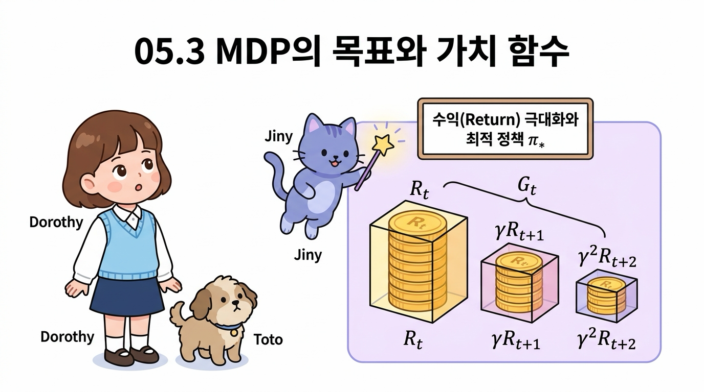

**그림 05-3-1** 미래로 갈수록 할인율 <i>&gamma;</i>에 의해 점차 가치가 할인되는 보상 상자들과 최적 정책 <i>&pi;</i>&ast;의 목표를 설명하는 지니와 도로시

---

### 05.3.1 일회성 과제와 지속적 과제

최적 정책을 수식으로 정확하게 정의하기 전에, 먼저 강화학습이 해결하고자 하는 문제 환경이 어떤 시간적 특성을 갖는지 구분해야 합니다. 

MDP 문제는 크게 **'일회성 과제'**와 **'지속적 과제'**로 나뉩니다.

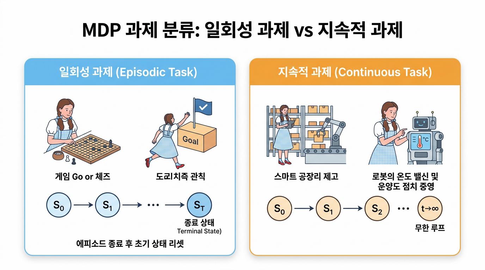

**그림 05-3-2** MDP 과제의 두 가지 유형: 일회성 과제(에피소드 종료 및 리셋) vs 지속적 과제(무한 루프)

---

#### 05.3.1.1 일회성 과제 (Episodic Task)와 에피소드(Episode)

**일회성 과제**는 명확한 '시작 상태'와 '종료 상태(Terminal State)'가 존재하는 문제입니다.

> 👧 **도로시**: "지니야! 미로를 탈출해서 출구(Goal) 깃발에 도착하면 게임 한 판이 끝나고 다시 시작 칸으로 돌아가잖아! 이것도 일회성 과제야?"
>
> 🧚 **지니**: "정답이야 도로시! 시작(<i>S</i>0)부터 끝(<i>S</i><i>T</i>)까지 플레이하는 한 판의 전체 경험을 **'에피소드(Episode)'**라고 하고, 끝나면 깔끔하게 초기 상태로 리셋되는 문제를 **일회성 과제(Episodic Task)**라고 부른단다!"

* **에피소드(Episode)**: 시작 상태 <i>S</i>0에서 출발하여 종료 상태 <i>S</i><i>T</i>에 도달할 때까지 에이전트가 겪은 모든 (상태, 행동, 보상)의 한 판 경험 시퀀스를 의미합니다.
* **종료 후 리셋**: 에피소드가 끝나면 환경은 초기 상태로 완전히 리셋되어 새로운 에피소드를 시작합니다.
* **대표 예시**: 바둑(승패 결정 시 종료), 체스, 슈퍼 마리오 게임, 미로 탈출(Goal 칸 도착 시 종료).

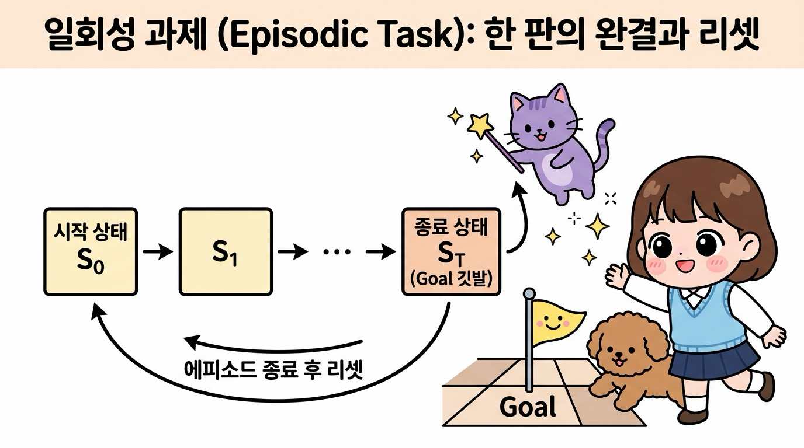

**그림 05-3-3** 일회성 과제(Episodic Task): 시작 상태 <i>S</i>0에서 종료 상태 <i>ST</i>까지의 한 판(에피소드) 완결과 환경 리셋 구조

---

#### 05.3.1.2 지속적 과제 (Continuous Task)

**지속적 과제**는 인위적인 '끝'이나 종료 상태가 없이 시간 <i>t</i> &rarr; &infin; 로 영원히 이어지는 문제입니다.

> 🐶 **토토**: "멍멍! 그럼 멈추지 않고 24시간 계속 돌아가는 로봇 공장이나 자동 온도 조절기는 끝이 없는 거야?"
>
> 🧚 **지니**: "맞아 토토야! 공장 자동화나 로봇의 균형 제어처럼 정해진 끝(종료 상태) 없이 시간(<i>t</i>)이 무한히 흘러가며 실시간으로 최적의 행동을 계속 내려야 하는 문제를 **지속적 과제(Continuous Task)**라고 부른단다!"

* **특징**: 에이전트는 멈추지 않고 실시간으로 상태를 관찰하며 끝없는 제어 결정을 내려야 합니다.
* **대표 예시**: 스마트 팩토리의 재고 관리(품절과 과재고를 방지하며 영구 운영), 데이터센터 냉각 전력 최적 제어, 화학 플랜트의 연속 공정 제어, 로봇의 자세 균형 제어.

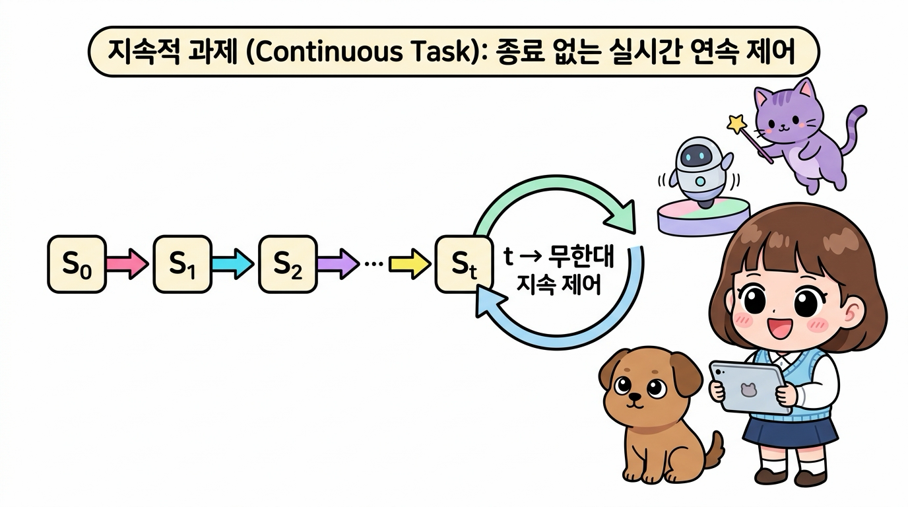

**그림 05-3-4** 지속적 과제(Continuous Task): 종료 상태 없이 시간 <i>t</i> &rarr; &infin; 로 영원히 이어지는 실시간 연속 제어 구조

---

### 05.3.2 수익(Return)과 할인율 (Discount Factor, <i>&gamma;</i>)

강화학습에서 에이전트가 극대화해야 하는 최종 목표는 단 한 번의 즉각적인 보상 <i>Rt</i>가 아니라, 앞으로 받게 될 모든 보상들의 총합인 **수익(Return, <i>Gt</i>)**입니다.

---

#### 05.3.2.1 할인 누적 보상 수익 <i>Gt</i>의 정의

시간 <i>t</i> 이후 에이전트가 획득하는 할인 수익 <i>Gt</i>는 다음과 같이 정의됩니다.

> 👧 **도로시**: "지니야! 오늘 받는 사과는 온전히 1.0배이지만, 한 스텝 뒤에 받는 사과는 0.9배, 두 스텝 뒤는 0.81배로 점점 줄여서 모두 더하는 게 바로 **수익(<i>Gt</i>)**인 거지?"
>
> 🧚 **지니**: "맞아 도로시야! 미래의 보상 상자에 시간의 거리만큼 할인율 <i>&gamma;</i>를 거듭제곱(&gamma;, &gamma;2, &gamma;3...)하여 모두 더한 총합이 바로 에이전트가 극대화해야 할 진짜 점수, **할인 수익 <i>Gt</i>**란다!"

<i>G</i><i>t</i> = <i>R</i><i>t</i> + <i>&gamma;</i><i>R</i><i>t+1</i> + <i>&gamma;</i>2<i>R</i><i>t+2</i> + <i>&gamma;</i>3<i>R</i><i>t+3</i> + ... = &Sigma;<i>k</i>=0&infin; <i>&gamma;</i><i>k</i><i>R</i><i>t+k</i>

* <i>Gt</i>: 시간 <i>t</i> 시점에서 바라본 미래 총 누적 가치(Return)
* <i>&gamma;</i> (감마, gamma): **할인율(Discount Factor)**로서 0 &le; <i>&gamma;</i> &lt; 1 범위의 상수 (보통 0.9 ~ 0.99 사용)

만약 <i>&gamma;</i> = 0.9 라면:

<i>G</i><i>t</i> = <i>R</i><i>t</i> + 0.9 &middot; <i>R</i><i>t+1</i> + 0.81 &middot; <i>R</i><i>t+2</i> + 0.729 &middot; <i>R</i><i>t+3</i> + ...

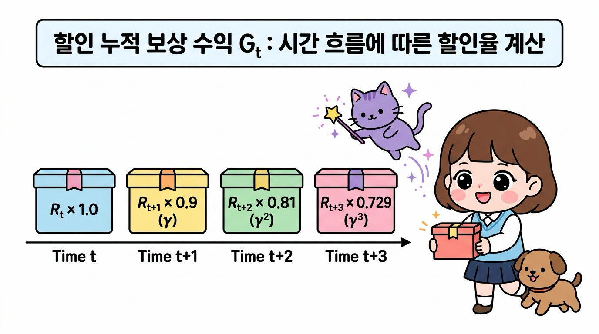

**그림 05-3-5** 할인 누적 보상 수익 <i>Gt</i>: 시간 흐름(Time <i>t</i>, <i>t+1</i>, <i>t+2</i>, <i>t+3</i>)에 따른 할인율(&gamma; = 0.9) 적용과 보상 상자 가치 합산 원리

---

#### 05.3.2.2 할인율 <i>&gamma;</i>를 도입하는 2가지 결정적 이유

> 👧 **도로시**: "지니야! 왜 미래에 받을 보상은 <i>&gamma;</i>를 곱해서 깎아버리는 거야? 미래의 보상도 100% 다 받으면 안 돼?"
>
> 🧚 **지니**: "아주 날카로운 질문이야 도로시! 할인율 <i>&gamma;</i>를 넣는 데는 2가지 중요한 이유가 있어!"

**그림 05-3-6** 도로시의 궁금증과 지니의 해답: 왜 미래의 보상을 할인(<i>&gamma;</i>)할까?

1. **수학적 무한 발산 방지 (Convergence)**:
   끝없이 이어지는 지속적 과제에서 만약 <i>&gamma;</i> = 1.0(무할인)이라면, 매 스텝마다 +1의 보상을 받을 때 총합 <i>Gt</i> = 1 + 1 + 1 + ... = &infin; (무한대)가 되어버립니다. 무한대끼리는 어떤 정책이 더 우수한지 크기를 비교할 수 없습니다. 하지만 <i>&gamma;</i> &lt; 1 이면 등비급수의 합 공식에 의해:
   

   <i>G</i><i>t</i> &le; <i>R</i>max / (1 - <i>&gamma;</i>)
   

   항상 유한한 값으로 깔끔하게 수렴하므로 수학적 계산과 최적화가 가능해집니다.
2. **시간 선호와 미래의 불확실성 반영 (Time Preference)**:
   "오늘 당장 받는 1만 원"과 "10년 뒤에 받는 2만 원"은 가치가 다릅니다. 미래는 예측하기 어려운 돌발 상황(환경의 변화, 배터리 방전, 조기 종료 등)이 존재하므로, 합리적인 에이전트는 가까운 시점의 확실한 보상을 먼 미래의 불확실한 보상보다 더 높은 가치로 평가해야 합니다.

---

### 05.3.3 상태 가치 함수 (State-Value Function)

에이전트의 행동과 환경의 상태 전이는 확률적일 수 있으므로, 똑같은 상태 <i>s</i>에서 출발하더라도 매 에피소드마다 실제로 얻게 되는 수익 <i>Gt</i>의 값은 조금씩 다를 수 있습니다.

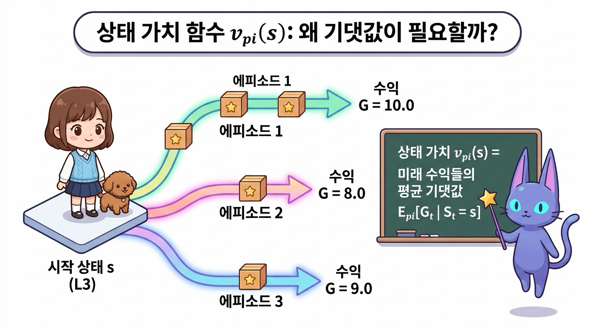

**그림 05-3-7** 상태 가치 함수(State-Value Function)의 개념: 동일한 시작 상태 <i>s</i>에서 출발해도 매번 다른 수익 <i>Gt</i>가 나오는 확률적 환경과 기댓값의 필요성

---

#### 05.3.3.1 상태 가치 함수 <i>v&pi;</i>(<i>s</i>)의 수학적 정의

상태 가치 함수 <i>v&pi;</i>(<i>s</i>)는 **'에이전트가 상태 <i>s</i>에서 출발하여 정책 <i>&pi;</i>를 따라 끝까지 움직였을 때 기대할 수 있는 할인 누적 수익의 평균 기댓값(Expected Return)'**입니다.

> 👧 **도로시**: "지니야! 똑같은 L3 타일에서 출발해도 바람이 불거나 주사위를 굴리는 것(확률적 정책)에 따라 매번 얻는 총 수익(<i>Gt</i>)이 조금씩 달라질 수 있잖아! 그럼 이 타일의 진짜 가치는 어떻게 매겨?"
>
> 🧚 **지니**: "맞아 도로시야! 그래서 수많은 에피소드를 반복해서 얻은 미래 수익들의 **통계적 평균 기댓값(Expectation, &Eopf;&pi;)**을 구하는 거야! 이것이 바로 그 땅의 진짜 잠재적 가치를 나타내는 **상태 가치 함수 <i>v</i><i>&pi;</i>(<i>s</i>)**란다!"

<i>v</i><i>&pi;</i>(<i>s</i>) = &Eopf;<i>&pi;</i>[ <i>G</i><i>t</i> | <i>S</i><i>t</i> = <i>s</i> ]

* **&Eopf;<i>&pi;</i> (익스펙테이션, Expectation)**: 정책 <i>&pi;</i>를 따를 때 발생하는 모든 가능한 경로 확률 가중 평균(기댓값) 연산자입니다.
* **정책 종속성**: 에이전트가 무슨 정책 <i>&pi;</i>를 쓰느냐에 따라 미래 경로와 보상이 완전히 바뀌므로, 가치 함수 아래첨자에 반드시 정책 기호 <i>&pi;</i>를 명시합니다.

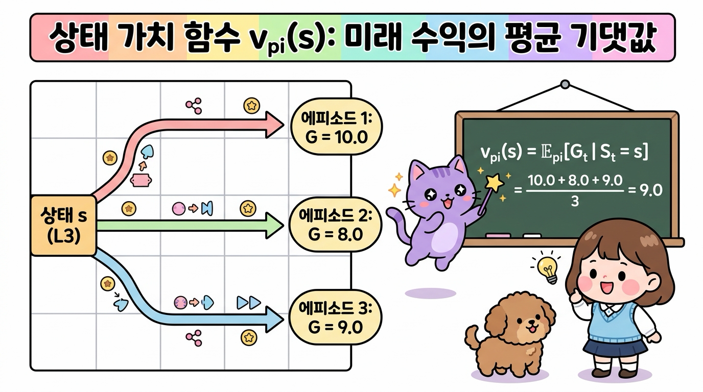

**그림 05-3-8** 상태 가치 함수 <i>v&pi;</i>(<i>s</i>): 동일한 상태 <i>s</i>에서 출발한 여러 에피소드 수익들의 통계적 가중 평균 기댓값 계산 구조

---

### 05.3.4 최적 정책(<i>&pi;</i>&ast;)과 최적 가치 함수(<i>v</i>&ast;)

이제 강화학습의 궁극적인 지향점인 **최적 정책**을 정의할 수 있습니다.

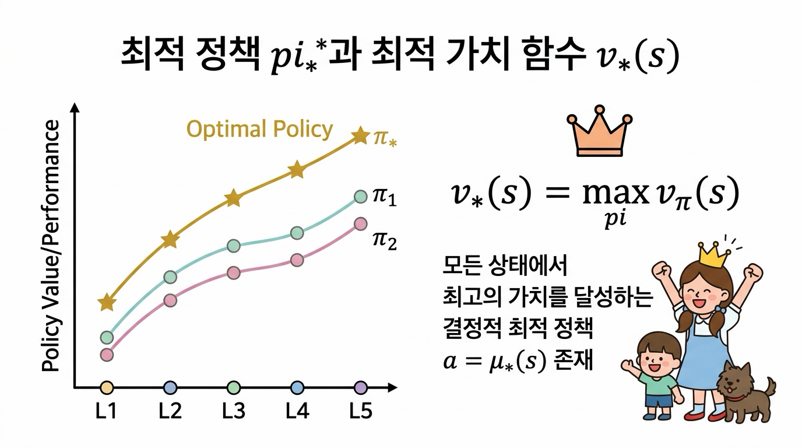

**그림 05-3-9** 정책 간의 부분 순서 비교 및 모든 상태에서 최대 가치를 달성하는 결정적 최적 정책 <i>&pi;</i>&ast;

---

#### 05.3.4.1 정책의 우열 비교 (Partial Ordering)

두 정책 <i>&pi;</i>와 <i>&pi;'</i>의 우열은 모든 상태 <i>s</i>에서의 가치 함수 크기로 판정합니다.

> 👧 **도로시**: "지니야! 두 정책 중에서 어떤 정책이 더 똑똑한지 어떻게 비교해? 어떤 칸에서는 1등이고 다른 칸에서는 2등이면 어떡하지?"
>
> 🧚 **지니**: "아주 날카로운 지적이야 도로시! 정책 간의 우열을 가리려면 **모든 가능한 상태(칸) <i>s</i>에서 단 한 번도 뒤처지지 않고 가치가 크거나 같아야(&forall;<i>s</i>, <i>v</i><i>&pi;</i>(<i>s</i>) &ge; <i>v</i><i>&pi;'</i>(<i>s</i>))** 비로소 더 우수한 정책(<i>&pi;</i> &ge; <i>&pi;'</i>)이라고 판정할 수 있단다!"

<i>&pi;</i> &ge; <i>&pi;'</i> &nbsp;&iff;&nbsp; &forall;<i>s</i> &isin; <i>S</i>, &nbsp; <i>v</i><i>&pi;</i>(<i>s</i>) &ge; <i>v</i><i>&pi;'</i>(<i>s</i>)

* 어떤 상태에서는 <i>&pi;</i>가 좋고 다른 상태에서는 <i>&pi;'</i>가 좋다면 두 정책 간의 우열을 가릴 수 없습니다 (비교 불가).
* **모든 가능한 상태 <i>s</i>에 대하여** 항상 <i>v&pi;</i>(<i>s</i>) &ge; <i>v&pi;'</i>(<i>s</i>)를 만족할 때만 "정책 <i>&pi;</i>가 <i>&pi;'</i>보다 우수하다"고 선언합니다.

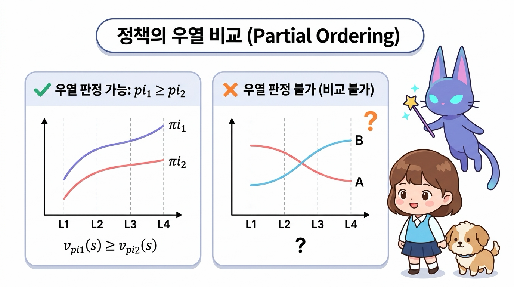

**그림 05-3-10** 정책의 우열 비교(Partial Ordering): 모든 상태에서 가치 곡선이 항상 위에 있어야 우열 판정 가능(<i>&pi;</i>1 &ge; <i>&pi;</i>2) vs 상태마다 가치 곡선이 교차하면 비교 불가

---

#### 05.3.4.2 최적 정책 <i>&pi;</i>&ast;과 최적 상태 가치 함수 <i>v</i>&ast;(<i>s</i>)

존재하는 모든 가능한 정책들 중에서 가장 높은 가치를 주는 최고의 정책을 **최적 정책(Optimal Policy, <i>&pi;</i>&ast;)**이라고 합니다.

> 👧 **도로시**: "지니야! 그럼 세상에 존재하는 수많은 정책들 중에서 모든 상태에서 최고의 점수를 달성하는 단 하나의 왕관 정책이 바로 **최적 정책(<i>&pi;</i>&ast;)**인 거지?"
>
> 🧚 **지니**: "정답이야 도로시! 모든 상태 <i>s</i>에서 가장 큰 가치를 뽑아내는 최적 가치 함수 <i>v</i>&ast;(<i>s</i>) = max<i>&pi;</i> <i>v</i><i>&pi;</i>(<i>s</i>)를 달성하는 결정적 최적 정책 <i>a</i> = &mu;&ast;(<i>s</i>)가 항상 존재한단다!"

<i>v</i>&ast;(<i>s</i>) = max<i>&pi;</i> <i>v</i><i>&pi;</i>(<i>s</i>), &emsp; &forall;<i>s</i> &isin; <i>S</i>

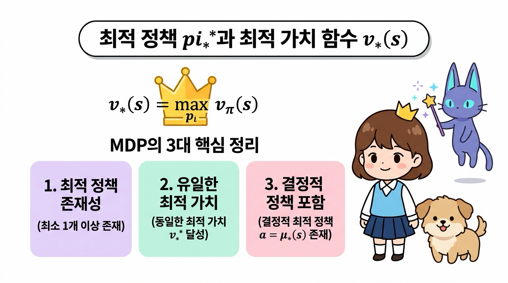

**그림 05-3-11** 최적 정책 <i>&pi;</i>&ast;과 최적 가치 함수 <i>v</i>&ast;(<i>s</i>), 그리고 MDP의 3대 핵심 정리(최적 정책 존재성, 유일한 최적 가치, 결정적 최적 정책 포함)

---

#### MDP의 3대 핵심 정리

1. **최적 정책의 존재성**: 모든 유한 MDP(Finite MDP)에는 다른 모든 정책보다 크거나 같은 최적 정책 <i>&pi;</i>&ast;가 **최소한 하나 이상 반드시 존재**합니다.
2. **공통의 최적 가치 함수 공유**: 최적 정책이 여러 개 존재하더라도, 그들이 달성하는 **최적 가치 함수 <i>v</i>&ast;(<i>s</i>)는 유일하게 하나로 동일**합니다.
3. **결정적 최적 정책의 존재**: 여러 최적 정책 중에는 각 상태마다 최선의 행동을 100% 확정하여 선택하는 **결정적 최적 정책 <i>a</i> = &mu;&ast;(<i>s</i>)**가 반드시 포함되어 있습니다.

---

### 05.3.5 핵심 요약

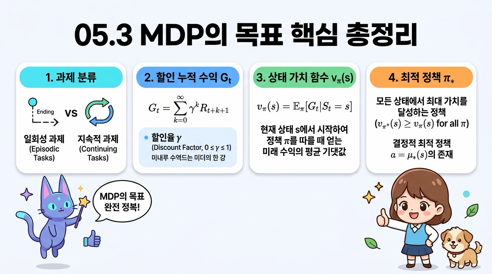

**그림 05-3-12** 05.3 MDP의 목표 핵심 총정리: 과제 분류, 할인 누적 수익 <i>Gt</i>, 상태 가치 함수 <i>v&pi;</i>(<i>s</i>), 최적 정책 <i>&pi;</i>&ast;

1. **과제 분류**: 에피소드로 끝나는 **일회성 과제(Episodic)**와 무한히 지속되는 **지속적 과제(Continuous)**로 구분됩니다.
2. **할인율 (0 &le; <i>&gamma;</i> &lt; 1)**: 무한한 시간 단계에서 기대 수익이 발산하는 것을 막고, 가까운 미래 보상의 가치를 합리적으로 반영합니다.
3. **할인 누적 수익 <i>Gt</i>**: 시간 <i>t</i>부터 미래에 획득할 보상들의 할인 총합 <i>Gt</i> = &Sigma;<i>k</i>=0&infin; <i>&gamma;k</i> <i>Rt+k</i> 입니다.
4. **상태 가치 함수 <i>v&pi;</i>(<i>s</i>)**: 상태 <i>s</i>에서 정책 <i>&pi;</i>를 따를 때 얻게 되는 기대 수익 <i>v&pi;</i>(<i>s</i>) = &Eopf;<i>&pi;</i>[<i>Gt</i> | <i>St</i> = <i>s</i>] 입니다.
5. **최적 정책 <i>&pi;</i>&ast;**: 모든 상태에서 가치 함수를 극대화하는 왕관의 정책이며, 항상 결정적 형태 <i>a</i> = &mu;&ast;(<i>s</i>)로 존재합니다.

다음 **05.4절**에서는 구체적인 2-그리드 월드 예제를 통해 실제로 4가지 결정적 정책들의 가치를 손으로 직접 계산하고 비교해 보겠습니다!
