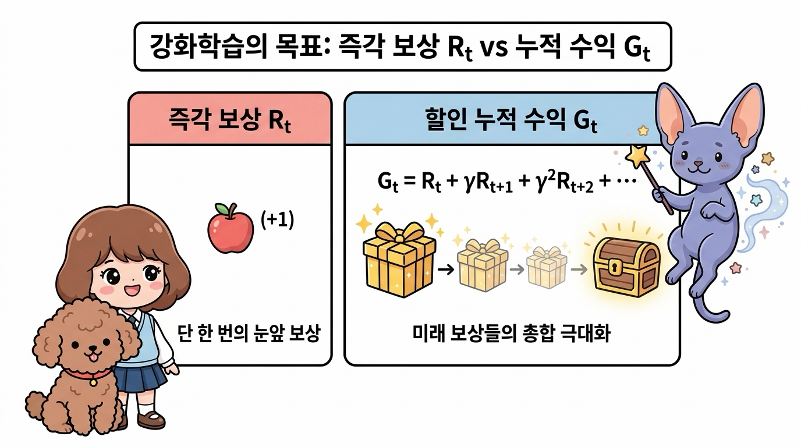
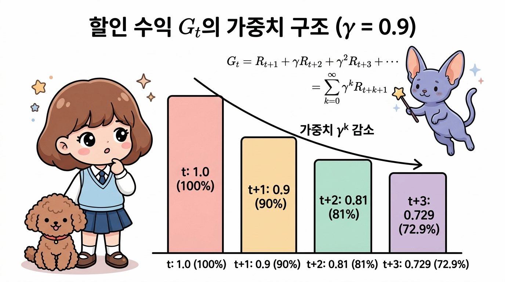
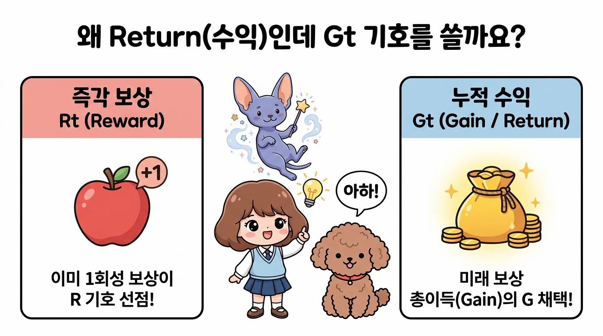
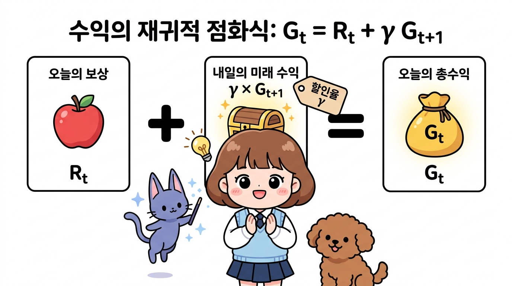
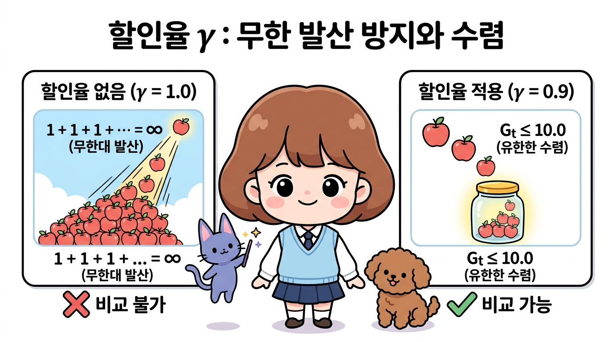
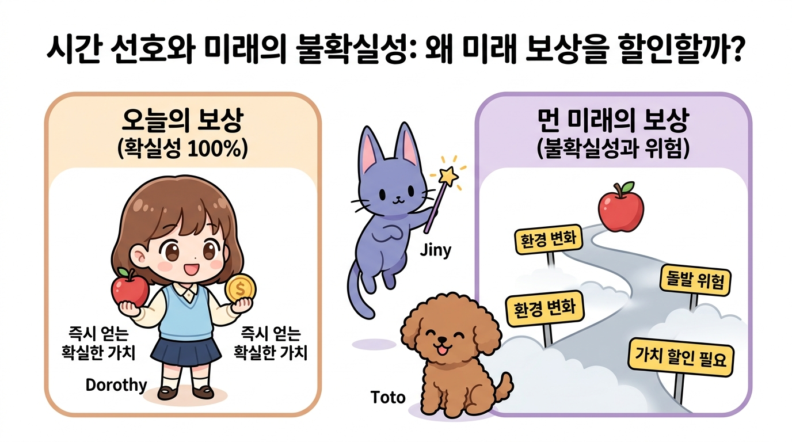
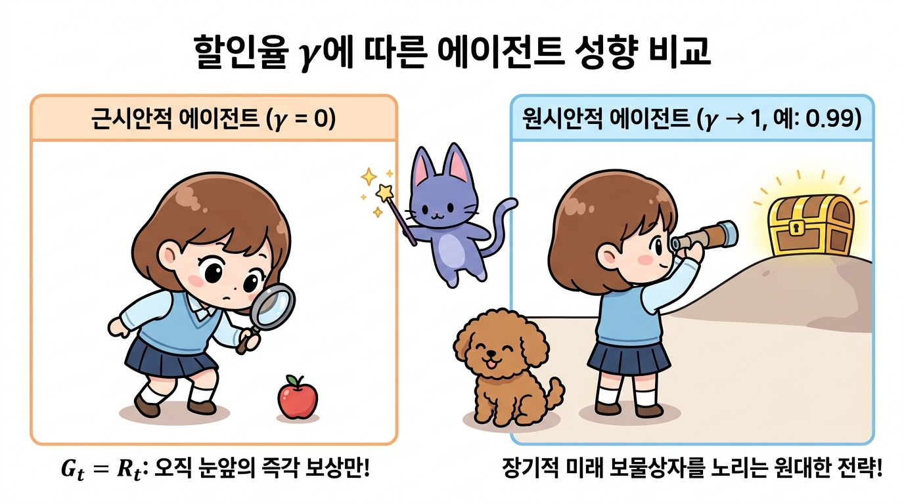
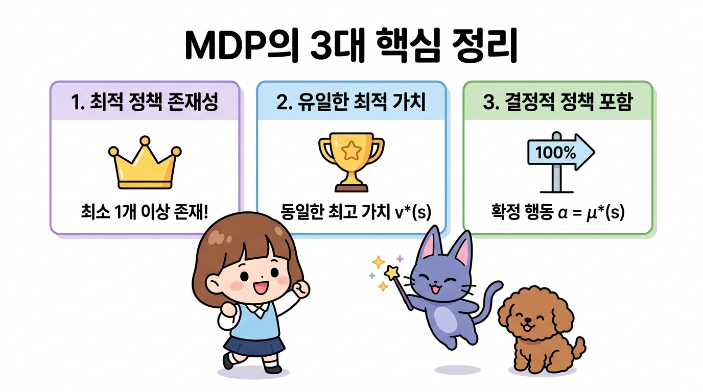

# 05.3 MDP의 목표

에이전트가 오즈의 세계에서 달성해야 할 궁극적인 목적지인 **할인 누적 수익(Discounted Return, <i>Gt</i>)**과 미래 보상의 가치를 조율하는 **할인율(Discount Factor, <i>&gamma;</i>)**, 그리고 모든 상태에서 최고의 성과를 보장하는 **최적 정책(Optimal Policy, <i>&pi;</i>&ast;)**의 수학적 원리를 지니와 도로시의 즐거운 수업을 통해 정복해 봅시다!

**그림 05-3-1** 미래로 갈수록 할인율 <i>&gamma;</i>에 의해 점차 가치가 할인되는 보상 상자들과 최적 정책 <i>&pi;</i>&ast;의 목표를 설명하는 지니와 도로시

 

---

 

### 05.3.1 일회성 과제와 지속적 과제

최적 정책을 수식으로 정확하게 정의하기 전에, 먼저 **강화학습이 해결하고자 하는 문제 환경**이 어떤 **시간적 특성**을 갖는지 구분해야 합니다.

MDP 문제는 시간 흐름과 종료 시점의 유무에 따라 크게 **'일회성 과제(Episodic Task)'**와 **'지속적 과제(Continuous Task)'**로 나뉩니다.

**그림 05-3-2** MDP 과제의 두 가지 유형: 일회성 과제(에피소드 종료 및 리셋) vs 지속적 과제(무한 루프)

 

---

 

#### 05.3.1.1 일회성 과제 (Episodic Task)와 에피소드(Episode)

**일회성 과제**는 명확한 '시작 상태'와 '종료 상태(Terminal State)'가 존재하는 문제입니다.

  

    🎧
    대화 음성 듣기 (도로시 & 지니)
  

  

    <button type="button" class="btn-audio-play" style="background: #0284c7; color: #ffffff; border: none; border-radius: 16px; padding: 5px 13px; font-size: 0.82rem; font-weight: 600; cursor: pointer; display: inline-flex; align-items: center; gap: 4px; box-shadow: 0 1px 2px rgba(2,132,199,0.3);">
      ▶️ 재생
    </button>
    <button type="button" class="btn-audio-stop" style="background: #e2e8f0; color: #475569; border: none; border-radius: 16px; padding: 5px 11px; font-size: 0.82rem; font-weight: 600; cursor: pointer; display: inline-flex; align-items: center; gap: 4px;">
      ⏹️ 정지
    </button>
  

  <audio src="./audio/dialogue_5_3_scene1.mp3" preload="none"></audio>

> 👧 **도로시**: "지니야! 미로를 탈출해서 출구(Goal) 깃발에 도착하면 게임 한 판이 끝나고 다시 시작 칸으로 돌아가잖아! 이것도 일회성 과제야?"
>
> 🧚 **지니**: "정답이야 도로시! 시작(<i>S</i>0)부터 끝(<i>S</i><i>T</i>)까지 플레이하는 한 판의 전체 경험을 **'에피소드(Episode)'**라고 하고, 끝나면 깔끔하게 초기 상태로 리셋되는 문제를 **일회성 과제(Episodic Task)**라고 부른단다!"

**그림 05-3-3** 일회성 과제(Episodic Task): 시작 상태 <i>S</i>0에서 종료 상태 <i>ST</i>까지의 한 판(에피소드) 완결과 환경 리셋 구조

* **에피소드(Episode)**: 시작 상태 <i>S</i>0에서 출발하여 종료 상태 <i>S</i><i>T</i>에 도달할 때까지 에이전트가 겪은 모든 (상태, 행동, 보상)의 한 판 경험 시퀀스를 의미합니다.
   (<i>S</i>0, <i>A</i>0, <i>R</i>0, <i>S</i>1, <i>A</i>1, <i>R</i>1, ..., <i>S</i><i>T</i>)
* **종료 상태 (Terminal State, <i>S</i><i>T</i>)**: 에이전트의 목표 달성(Goal 도달), 실패(게임 오버), 정해진 제한 시간 초과 등으로 상호작용이 완결되는 특별한 상태입니다.
* **종료 후 리셋**: 에피소드가 끝나면 환경은 초기 상태로 완전히 리셋되어 **새로운 에피소드를 시작**합니다.
* **대표 예시**: 바둑(승패 결정 시 종료), 체스, 슈퍼 마리오 게임, 미로 탈출(Goal 칸 도착 시 종료).

 

---

 

#### 05.3.1.2 지속적 과제 (Continuous Task)

**지속적 과제**는 인위적인 '끝'이나 종료 상태가 없이 시간 <i>t</i> &rarr; &infin; 로 영원히 이어지는 문제입니다.

  

    🎧
    대화 음성 듣기 (토토 & 지니)
  

  

    <button type="button" class="btn-audio-play" style="background: #0284c7; color: #ffffff; border: none; border-radius: 16px; padding: 5px 13px; font-size: 0.82rem; font-weight: 600; cursor: pointer; display: inline-flex; align-items: center; gap: 4px; box-shadow: 0 1px 2px rgba(2,132,199,0.3);">
      ▶️ 재생
    </button>
    <button type="button" class="btn-audio-stop" style="background: #e2e8f0; color: #475569; border: none; border-radius: 16px; padding: 5px 11px; font-size: 0.82rem; font-weight: 600; cursor: pointer; display: inline-flex; align-items: center; gap: 4px;">
      ⏹️ 정지
    </button>
  

  <audio src="./audio/dialogue_5_3_scene2.mp3" preload="none"></audio>

> 🐶 **토토**: "멍멍! 그럼 멈추지 않고 24시간 계속 돌아가는 로봇 공장이나 자동 온도 조절기는 끝이 없는 거야?"
>
> 🧚 **지니**: "맞아 토토야! 공장 자동화나 로봇의 균형 제어처럼 정해진 끝(종료 상태) 없이 시간(<i>t</i>)이 무한히 흘러가며 실시간으로 최적의 행동을 계속 내려야 하는 문제를 **지속적 과제(Continuous Task)**라고 부른단다!"

**그림 05-3-4** 지속적 과제(Continuous Task): 종료 상태 없이 시간 <i>t</i> &rarr; &infin; 로 영원히 이어지는 실시간 연속 제어 구조

* **특징**: 에이전트는 멈추지 않고 실시간으로 상태를 관찰하며 끝없는 제어 결정을 내려야 합니다.
* **대표 예시**: 스마트 팩토리의 재고 관리(품절과 과재고를 방지하며 영구 운영), 데이터센터 냉각 전력 최적 제어, 화학 플랜트의 연속 공정 제어, 로봇의 자세 균형 제어.

 

---

 

#### 05.3.1.3 두 과제의 비교와 통합 표기법

| 구분 | 일회성 과제 (Episodic Task) | 지속적 과제 (Continuous Task) |
| :--- | :--- | :--- |
| **종료 상태 (Terminal State)** | 명확히 존재 (시간 <i>T</i>에서 종료) | 존재하지 않음 (시간 <i>t</i> &rarr; &infin;) |
| **학습 단위** | 에피소드(Episode) 단위로 완결 및 리셋 | 실시간 연속 흐름 (중단 없는 영구 제어) |
| **보상 합산 방식** | 유한 합 (할인율 없이도 수렴 가능) | 무한 급수 (할인율 <i>&gamma;</i> &lt; 1 필수) |
| **대표적인 사례** | 바둑, 체스, 아케이드 게임, 미로 탈출 | 로봇 자세 제어, 스마트 팩토리, 전력망 제어 |

  

    🎧
    지니의 보너스 팁 음성 듣기 (지니)
  

  

    <button type="button" class="btn-audio-play" style="background: #0284c7; color: #ffffff; border: none; border-radius: 16px; padding: 5px 13px; font-size: 0.82rem; font-weight: 600; cursor: pointer; display: inline-flex; align-items: center; gap: 4px; box-shadow: 0 1px 2px rgba(2,132,199,0.3);">
      ▶️ 재생
    </button>
    <button type="button" class="btn-audio-stop" style="background: #e2e8f0; color: #475569; border: none; border-radius: 16px; padding: 5px 11px; font-size: 0.82rem; font-weight: 600; cursor: pointer; display: inline-flex; align-items: center; gap: 4px;">
      ⏹️ 정지
    </button>
  

  <audio src="./audio/dialogue_5_3_scene3.mp3" preload="none"></audio>

> 💡 **지니의 보너스 팁: 흡수 상태(Absorbing State)를 통한 통합**  
> "일회성 과제에서 종료 상태 <i>S</i><i>T</i>에 도달했을 때, 그 상태에서 스스로에게만 전이되며(전이 확률 1.0) 영원히 보상 0을 지급하는 특별한 **'흡수 상태(Absorbing State)'**로 생각하면, 일회성 과제도 무한한 지속적 과제의 수식 체계 안으로 완벽하게 통합하여 다룰 수 있단다!"

 

---

 

### 05.3.2 수익(Return)과 할인율 (Discount Factor, <i>&gamma;</i>)

강화학습에서 에이전트가 극대화해야 하는 **최종 목표**는 단 한 번의 즉각적인 보상 <i>Rt</i>가 아니라, **앞으로 받게 될 모든 보상**들의 총합인 **수익(Return, <i>Gt</i>)**입니다.

**그림 05-3-5** 강화학습의 목표 비교: 눈앞의 1회성 즉각 보상 <i>Rt</i> vs 미래 보상들을 할인하여 합산한 총수익 <i>Gt</i>

 

---

 

#### 05.3.2.1 할인 누적 보상 수익 <i>Gt</i>의 정의

시간 <i>t</i> 이후 에이전트가 획득하는 할인 수익 <i>Gt</i>는 다음과 같이 정의됩니다.

$$
G_t = R_t + \gamma R_{t+1} + \gamma^2 R_{t+2} + \gamma^3 R_{t+3} + \dots = \sum_{k=0}^{\infty} \gamma^k R_{t+k}
$$

  

    🎧
    대화 음성 듣기 (도로시 & 지니)
  

  

    <button type="button" class="btn-audio-play" style="background: #0284c7; color: #ffffff; border: none; border-radius: 16px; padding: 5px 13px; font-size: 0.82rem; font-weight: 600; cursor: pointer; display: inline-flex; align-items: center; gap: 4px; box-shadow: 0 1px 2px rgba(2,132,199,0.3);">
      ▶️ 재생
    </button>
    <button type="button" class="btn-audio-stop" style="background: #e2e8f0; color: #475569; border: none; border-radius: 16px; padding: 5px 11px; font-size: 0.82rem; font-weight: 600; cursor: pointer; display: inline-flex; align-items: center; gap: 4px;">
      ⏹️ 정지
    </button>
  

  <audio src="./audio/dialogue_5_3_scene4.mp3" preload="none"></audio>

> 👧 **도로시**: "지니야! 오늘 받는 사과는 온전히 1.0배이지만, 한 스텝 뒤에 받는 사과는 0.9배, 두 스텝 뒤는 0.81배로 점점 줄여서 모두 더하는 게 바로 **수익(<i>Gt</i>)**인 거지?"
>
> 🧚 **지니**: "맞아 도로시야! 미래의 보상 상자에 시간의 거리만큼 할인율 <i>&gamma;</i>를 거듭제곱(&gamma;, &gamma;2, &gamma;3...)하여 모두 더한 총합이 바로 에이전트가 극대화해야 할 진짜 점수, **할인 수익 <i>Gt</i>**란다!"

**그림 05-3-6** 할인 누적 보상 수익 <i>Gt</i>: 시간 흐름(Time <i>t</i>, <i>t+1</i>, <i>t+2</i>, <i>t+3</i>)에 따른 할인율(&gamma; = 0.9) 적용과 보상 상자 가치 합산 원리

 

---

 

#### <i>Gt</i> 구조 알아 보기

* <i>Gt</i>: 시간 <i>t</i> 시점에서 바라본 미래 총 누적 가치(Return)
* <i>&gamma;</i> (감마, gamma): **할인율(Discount Factor)**로서 0 &le; <i>&gamma;</i> &lt; 1 범위의 상수 (보통 0.9 ~ 0.99 사용)

만약 <i>&gamma;</i> = 0.9 라면, 할인 누적 수익 <i>Gt</i>는 다음과 같이 전개됩니다:
$$
G_t = R_t + 0.9 \cdot R_{t+1} + 0.81 \cdot R_{t+2} + 0.729 \cdot R_{t+3} + \dots
$$

 

---

 

#### 예시로 알아 보기

  

    🎧
    대화 음성 듣기 (도로시 & 지니)
  

  

    <button type="button" class="btn-audio-play" style="background: #0284c7; color: #ffffff; border: none; border-radius: 16px; padding: 5px 13px; font-size: 0.82rem; font-weight: 600; cursor: pointer; display: inline-flex; align-items: center; gap: 4px; box-shadow: 0 1px 2px rgba(2,132,199,0.3);">
      ▶️ 재생
    </button>
    <button type="button" class="btn-audio-stop" style="background: #e2e8f0; color: #475569; border: none; border-radius: 16px; padding: 5px 11px; font-size: 0.82rem; font-weight: 600; cursor: pointer; display: inline-flex; align-items: center; gap: 4px;">
      ⏹️ 정지
    </button>
  

  <audio src="./audio/dialogue_5_3_scene5.mp3" preload="none"></audio>

> 👧 **도로시**: "스텝이 지날 때마다 할인율이 <i>&gamma;</i> &times; <i>&gamma;</i> &times; <i>&gamma;</i> &times; ... 처럼 거듭제곱되니까, 시간이 흐를수록 미래 보상의 영향력이 점점 작아지는 거구나!"
>
> 🧚 **지니**: "맞아 도로시야! 이 기하급수적 감쇠 구조 덕분에 에이전트는 눈앞의 확실한 보상을 우선적으로 챙기면서도, 먼 미래의 보물상자도 완전히 잊지 않고 균형 있게 전략을 세울 수 있단다!"

**그림 05-3-7** 할인 누적 수익 <i>Gt</i>의 가중치 감쇠 구조(&gamma; = 0.9): 스텝이 멀어질수록 &gamma;<i>k</i> 비율로 보상 가치가 지수적으로 감소하는 원리

**스텝별 가중치(<i>&gamma;k</i>)의 지수적 감소**:

- **현재 시점 (<i>k</i>=0, <i>t</i>)**: <i>&gamma;</i>0 = 1.0 &rarr; 오늘 받는 보상 <i>Rt</i>는 100% 가치 그대로 온전히 반영됩니다.
- **1스텝 뒤 (<i>k</i>=1, <i>t+1</i>)**: <i>&gamma;</i>1 = 0.9 &rarr; 내일 받는 보상 <i>Rt+1</i>은 90%의 가치로 할인됩니다.
- **2스텝 뒤 (<i>k</i>=2, <i>t+2</i>)**: <i>&gamma;</i>2 = 0.81 &rarr; 모레 받는 보상 <i>Rt+2</i>는 81%의 가치로 할인됩니다.
- **3스텝 뒤 (<i>k</i>=3, <i>t+3</i>)**: <i>&gamma;</i>3 = 0.729 &rarr; 3스텝 뒤 보상 <i>Rt+3</i>은 72.9%의 가치로 점차 줄어듭니다.

 

---

 

#### 왜 수익이 Return 인데, <i>Gt</i> 인가요?

수익은 영어로 **Return**인데, 왜 앞 글자 *R*을 쓰지 않고 알파벳 **<i>Gt</i>**를 사용할까요? 많은 입문자들이 가장 궁금해하는 질문 중 하나입니다!

  

    🎧
    대화 음성 듣기 (도로시 & 지니)
  

  

    <button type="button" class="btn-audio-play" style="background: #0284c7; color: #ffffff; border: none; border-radius: 16px; padding: 5px 13px; font-size: 0.82rem; font-weight: 600; cursor: pointer; display: inline-flex; align-items: center; gap: 4px; box-shadow: 0 1px 2px rgba(2,132,199,0.3);">
      ▶️ 재생
    </button>
    <button type="button" class="btn-audio-stop" style="background: #e2e8f0; color: #475569; border: none; border-radius: 16px; padding: 5px 11px; font-size: 0.82rem; font-weight: 600; cursor: pointer; display: inline-flex; align-items: center; gap: 4px;">
      ⏹️ 정지
    </button>
  

  <audio src="./audio/dialogue_5_3_scene6.mp3" preload="none"></audio>

> 👧 **도로시**: "아하! Return의 *R*은 이미 오늘 먹는 사과 보상(<i>Rt</i>)이 차지하고 있었구나! 그래서 미래의 보물들을 싹 모은 '진짜 총이득(Gain)'이라는 뜻으로 <i>Gt</i>를 쓰는 거네?"
>
> 🧚 **지니**: "정답이야 도로시! '눈앞의 사과 한 입(<i>R</i>)'과 '모험 끝에 얻을 커다란 보물 주머니(<i>G</i>)'를 명쾌하게 구분하기 위한 전 세계 강화학습 학자들의 지혜로운 약속이란다!"

**그림 05-3-8** 수익의 기호가 <i>Gt</i>인 이유: 즉각 보상 <i>Rt</i>(Reward)와의 기호 충돌 방지 및 미래 총이득(Gain)의 의미

1. **보상(Reward, <i>R</i>) 기호와의 충돌 방지**:  
   강화학습에서는 이미 매 스텝마다 환경으로부터 즉각적으로 지급받는 1회성 보상을 **보상(Reward, <i>Rt</i>)**으로 표기하고 있습니다. 만약 수익(Return)에도 *R*을 사용한다면 한 입 먹는 사과 보상 <i>Rt</i>와 미래 보상의 총합 <i>Rt</i>가 서로 충돌하여 수식을 전개할 수 없게 됩니다.

2. **총이득을 뜻하는 'Gain'의 머리글자 <i>G</i>**:  
   강화학습의 교과서(Sutton & Barto)에서는 보상들의 누적 총합을 에이전트가 최종적으로 획득하는 **'총이득(Gain)'**으로 정의하여 머리글자 **<i>G</i>**를 표준 기호로 채택했습니다. 금융 및 투자 분야에서도 투자의 결과로 회수하는 총이득을 'Gain'으로 부르는 것과 같은 이치입니다.

 

---

 

#### 05.3.2.2 수익의 점화식 (재귀적 관계)

수익 <i>Gt</i>의 식을 가만히 들여다보면 매우 강력하고 아름다운 **수학적 성질**을 발견할 수 있습니다. 

바로 **현재 시점의 수익 <i>Gt</i>**와 **다음 시점의 수익 <i>Gt+1</i>** 사이의 재귀적 관계(Recursive Relation)입니다.

$$
\begin{aligned}
G_t &= R_t + \gamma ( R_{t+1} + \gamma R_{t+2} + \gamma^2 R_{t+3} + \dots ) \\
G_t &= R_t + \gamma G_{t+1}
\end{aligned}
$$

  

    🎧
    대화 음성 듣기 (도로시 & 지니)
  

  

    <button type="button" class="btn-audio-play" style="background: #0284c7; color: #ffffff; border: none; border-radius: 16px; padding: 5px 13px; font-size: 0.82rem; font-weight: 600; cursor: pointer; display: inline-flex; align-items: center; gap: 4px; box-shadow: 0 1px 2px rgba(2,132,199,0.3);">
      ▶️ 재생
    </button>
    <button type="button" class="btn-audio-stop" style="background: #e2e8f0; color: #475569; border: none; border-radius: 16px; padding: 5px 11px; font-size: 0.82rem; font-weight: 600; cursor: pointer; display: inline-flex; align-items: center; gap: 4px;">
      ⏹️ 정지
    </button>
  

  <audio src="./audio/dialogue_5_3_scene7.mp3" preload="none"></audio>

> 👧 **도로시**: "와! 내일 시점의 미래 누적 수익 상자(<i>Gt+1</i>)를 통째로 가져와서 할인율 <i>&gamma;</i>만 곱한 뒤, 오늘 당장 받은 사과(<i>Rt</i>)와 더해주면 오늘 시점의 총수익(<i>Gt</i>)이 바로 완성되는 거네?"
>
> 🧚 **지니**: "정확해 도로시! 이 단순하고 명쾌한 재귀식(<i>Gt</i> = <i>Rt</i> + <i>&gamma;</i><i>Gt+1</i>)이 바로 다음 장에서 배울 강화학습의 심장, **벨만 방정식(Bellman Equation)**을 탄생시키는 위대한 출발점이란다!"

**그림 05-3-9** 수익의 재귀적 점화식(<i>Gt</i> = <i>Rt</i> + <i>&gamma;</i><i>Gt+1</i>): 오늘의 즉각 보상 <i>Rt</i>에 내일의 미래 총수익 <i>Gt+1</i>을 할인율 <i>&gamma;</i>로 감싸 합산하는 핵심 원리

 

---

 

#### 05.3.2.3 할인율 <i>&gamma;</i>를 도입하는 2가지 결정적 이유

  

    🎧
    대화 음성 듣기 (도로시 & 지니)
  

  

    <button type="button" class="btn-audio-play" style="background: #0284c7; color: #ffffff; border: none; border-radius: 16px; padding: 5px 13px; font-size: 0.82rem; font-weight: 600; cursor: pointer; display: inline-flex; align-items: center; gap: 4px; box-shadow: 0 1px 2px rgba(2,132,199,0.3);">
      ▶️ 재생
    </button>
    <button type="button" class="btn-audio-stop" style="background: #e2e8f0; color: #475569; border: none; border-radius: 16px; padding: 5px 11px; font-size: 0.82rem; font-weight: 600; cursor: pointer; display: inline-flex; align-items: center; gap: 4px;">
      ⏹️ 정지
    </button>
  

  <audio src="./audio/dialogue_5_3_scene8.mp3" preload="none"></audio>

> 👧 **도로시**: "지니야! 왜 미래에 받을 보상은 <i>&gamma;</i>를 곱해서 깎아버리는 거야? 미래의 보상도 100% 다 받으면 안 돼?"
>
> 🧚 **지니**: "아주 날카로운 질문이야 도로시! 할인율 <i>&gamma;</i>를 넣는 데는 2가지 중요한 이유가 있어!"

**그림 05-3-10** 도로시의 궁금증과 지니의 해답: 왜 미래의 보상을 할인(<i>&gamma;</i>)할까?

 

---

 

#### 1. 수학적 무한 발산 방지 (Convergence)

끝없이 이어지는 지속적 과제에서 만약 <i>&gamma;</i> = 1.0(무할인)이라면, 매 스텝마다 +1의 보상을 받을 때 총합 <i>Gt</i> = 1 + 1 + 1 + ... = &infin; (**무한대**)가 되어버립니다. **무한대끼리는 어떤 정책이 더 우수한지 크기를 비교할 수 없습니다.** 

하지만 <i>&gamma;</i> &lt; 1 이면 무한 등비급수의 합 공식에 의해:
$$
G_t = \sum_{k=0}^{\infty} \gamma^k R_{t+k} \le R_{\max} \sum_{k=0}^{\infty} \gamma^k = \frac{R_{\max}}{1 - \gamma}
$$

항상 **유한한 값**으로 깔끔하게 **수렴**하므로 수학적 계산과 최적화가 가능해집니다.
$$
R_{\max} = 1, \quad \gamma = 0.9 \implies G_t \le \frac{1}{1 - 0.9} = \frac{1}{0.1} = 10.0
$$

**그림 05-3-11** 할인율 <i>&gamma;</i>에 의한 수학적 무한 발산 방지: 무할인(<i>&gamma;</i> = 1.0) 시 무한대 발산(비교 불가) vs 할인율 적용(<i>&gamma;</i> = 0.9) 시 유한한 값(<i>Gt</i> &le; 10.0)으로의 안정적 수렴

 

---

 

#### 2. 시간 선호와 미래의 불확실성 반영 (Time Preference & Uncertainty)

"오늘 당장 받는 1만 원"과 "10년 뒤에 받는 1만 원"은 가치가 다릅니다. 미래는 예측하기 어려운 돌발 상황(환경의 변화, 배터리 방전, 조기 종료 등)이 존재하므로, 합리적인 에이전트는 가까운 시점의 확실한 보상을 먼 미래의 불확실한 보상보다 더 높은 가치로 평가해야 합니다.

**그림 05-3-12** 시간 선호와 미래의 불확실성: 오늘 즉시 받는 확실한 보상(높은 가치) vs 시간 경과에 따른 위험(환경 변화, 방전 등)으로 인해 가치가 할인(<i>&gamma;</i>)되는 먼 미래의 보상

 

---

 

#### 05.3.2.4 할인율 크기에 따른 에이전트의 성향 비교

* **<i>&gamma;</i> = 0 (근시안적 에이전트, Myopic Agent)**:
  미래 보상을 전혀 고려하지 않고 오직 현재 스텝의 즉각 보상(<i>Gt</i> = <i>Rt</i>)에만 반응합니다. 당장 눈앞의 사탕 하나에 현혹되어 먼 미래의 거대한 위험이나 **더 큰 보상을 놓치기 쉽습니다.**
* **<i>&gamma;</i> &rarr; 1 (원시안적 에이전트, Farsighted Agent)**:
  먼 미래의 보상도 현재 가치와 거의 대등하게 높이 평가합니다(예: <i>&gamma;</i> = 0.99). 지금 당장의 작은 손해를 감수하더라도 먼 훗날의 거대한 보물상자를 쟁취하기 위해 **장기적인 전략을 세웁니다.**

**그림 05-3-13** 할인율 크기에 따른 에이전트의 행동 성향 비교: 오직 눈앞의 즉각 보상에만 집착하는 근시안적 에이전트(<i>&gamma;</i> = 0) vs 먼 미래의 거대한 보물상자를 목표로 장기 전략을 세우는 원시안적 에이전트(<i>&gamma;</i> &rarr; 1)

 

---

 

### 05.3.3 상태 가치 함수 (State-Value Function)

에이전트의 행동과 환경의 상태 전이는 확률적일 수 있으므로, 똑같은 상태 <i>s</i>에서 출발하더라도 **매 에피소드마다** 실제로 얻게 되는 **수익 <i>Gt</i>의 값은 조금씩 다를 수 있습니다.**

**그림 05-3-14** 상태 가치 함수(State-Value Function)의 개념: 동일한 시작 상태 <i>s</i>에서 출발해도 매번 다른 수익 <i>Gt</i>가 나오는 확률적 환경과 기댓값의 필요성

 

---

 

#### 05.3.3.1 상태 가치 함수 <i>v&pi;</i>(<i>s</i>)의 수학적 정의

상태 가치 함수 <i>v&pi;</i>(<i>s</i>)는 **'에이전트가 상태 <i>s</i>에서 출발하여 정책 <i>&pi;</i>를 따라 끝까지 움직였을 때 기대할 수 있는 할인 누적 수익의 평균 기댓값(Expected Return)'**입니다.

$$
v_\pi(s) = \mathbb{E}_\pi [ G_t \mid S_t = s ]
$$

  

    🎧
    대화 음성 듣기 (도로시 & 지니)
  

  

    <button type="button" class="btn-audio-play" style="background: #0284c7; color: #ffffff; border: none; border-radius: 16px; padding: 5px 13px; font-size: 0.82rem; font-weight: 600; cursor: pointer; display: inline-flex; align-items: center; gap: 4px; box-shadow: 0 1px 2px rgba(2,132,199,0.3);">
      ▶️ 재생
    </button>
    <button type="button" class="btn-audio-stop" style="background: #e2e8f0; color: #475569; border: none; border-radius: 16px; padding: 5px 11px; font-size: 0.82rem; font-weight: 600; cursor: pointer; display: inline-flex; align-items: center; gap: 4px;">
      ⏹️ 정지
    </button>
  

  <audio src="./audio/dialogue_5_3_scene9.mp3" preload="none"></audio>

> 👧 **도로시**: "지니야! 똑같은 L3 타일에서 출발해도 바람이 불거나 주사위를 굴리는 것(확률적 정책)에 따라 매번 얻는 총 수익(<i>Gt</i>)이 조금씩 달라질 수 있잖아! 그럼 이 타일의 진짜 가치는 어떻게 매겨?"
>
> 🧚 **지니**: "맞아 도로시야! 그래서 수많은 에피소드를 반복해서 얻은 미래 수익들의 **통계적 평균 기댓값(Expectation, &Eopf;&pi;)**을 구하는 거야! 이것이 바로 그 땅의 진짜 잠재적 가치를 나타내는 **상태 가치 함수 <i>v</i><i>&pi;</i>(<i>s</i>)**란다!"

**그림 05-3-15** 상태 가치 함수 <i>v&pi;</i>(<i>s</i>): 동일한 상태 <i>s</i>에서 출발한 여러 에피소드 수익들의 통계적 가중 평균 기댓값 계산 구조

* **&Eopf;<i>&pi;</i> (익스펙테이션, Expectation)**: 정책 <i>&pi;</i>를 따를 때 발생하는 모든 가능한 경로 확률 가중 평균(기댓값) 연산자입니다.
* **정책 종속성**: 에이전트가 **무슨 정책 <i>&pi;</i>를 쓰느냐에 따라** 미래 경로와 보상이 완전히 바뀌므로, 가치 함수 아래첨자에 반드시 정책 기호 <i>&pi;</i>를 명시합니다.

 

---

 

### 05.3.4 최적 정책(<i>&pi;</i>&ast;)과 최적 가치 함수(<i>v</i>&ast;)

이제 강화학습의 궁극적인 지향점인 **최적 정책**을 정의할 수 있습니다.

**그림 05-3-16** 정책 간의 부분 순서 비교 및 모든 상태에서 최대 가치를 달성하는 결정적 최적 정책 <i>&pi;</i>&ast;

 

---

 

#### 05.3.4.1 정책의 우열 비교 (Partial Ordering)

두 정책 <i>&pi;</i>와 <i>&pi;'</i>의 우열은 모든 상태 <i>s</i>에서의 가치 함수 크기로 판정합니다.

$$
\pi \ge \pi' \iff v_\pi(s) \ge v_{\pi'}(s), \quad \forall s \in \mathcal{S}
$$

  

    🎧
    대화 음성 듣기 (도로시 & 지니)
  

  

    <button type="button" class="btn-audio-play" style="background: #0284c7; color: #ffffff; border: none; border-radius: 16px; padding: 5px 13px; font-size: 0.82rem; font-weight: 600; cursor: pointer; display: inline-flex; align-items: center; gap: 4px; box-shadow: 0 1px 2px rgba(2,132,199,0.3);">
      ▶️ 재생
    </button>
    <button type="button" class="btn-audio-stop" style="background: #e2e8f0; color: #475569; border: none; border-radius: 16px; padding: 5px 11px; font-size: 0.82rem; font-weight: 600; cursor: pointer; display: inline-flex; align-items: center; gap: 4px;">
      ⏹️ 정지
    </button>
  

  <audio src="./audio/dialogue_5_3_scene10.mp3" preload="none"></audio>

> 👧 **도로시**: "지니야! 두 정책 중에서 어떤 정책이 더 똑똑한지 어떻게 비교해? 어떤 칸에서는 1등이고 다른 칸에서는 2등이면 어떡하지?"
>
> 🧚 **지니**: "아주 날카로운 지적이야 도로시! 정책 간의 우열을 가리려면 **모든 가능한 상태(칸) <i>s</i>에서 단 한 번도 뒤처지지 않고 가치가 크거나 같아야(&forall;<i>s</i>, <i>v</i><i>&pi;</i>(<i>s</i>) &ge; <i>v</i><i>&pi;'</i>(<i>s</i>))** 비로소 더 우수한 정책(<i>&pi;</i> &ge; <i>&pi;'</i>)이라고 판정할 수 있단다!"

**그림 05-3-17** 정책의 우열 비교(Partial Ordering): 모든 상태에서 가치 곡선이 항상 위에 있어야 우열 판정 가능(<i>&pi;</i>1 &ge; <i>&pi;</i>2) vs 상태마다 가치 곡선이 교차하면 비교 불가

* 어떤 상태에서는 <i>&pi;</i>가 좋고 다른 상태에서는 <i>&pi;'</i>가 좋다면 두 정책 간의 우열을 가릴 수 없습니다 (비교 불가 상태).
* **모든 가능한 상태 <i>s</i>에 대하여** 항상 <i>v&pi;</i>(<i>s</i>) &ge; <i>v&pi;'</i>(<i>s</i>)를 만족할 때만 "정책 <i>&pi;</i>가 <i>&pi;'</i>보다 우수하다"고 선언합니다.

 

---

 

#### 05.3.4.2 최적 정책 <i>&pi;</i>&ast;과 최적 상태 가치 함수 <i>v</i>&ast;(<i>s</i>)

존재하는 모든 가능한 정책들 중에서 가장 높은 가치를 주는 최고의 정책을 **최적 정책(Optimal Policy, <i>&pi;</i>&ast;)**이라고 합니다.

$$
v_*(s) = \max_\pi v_\pi(s), \quad \forall s \in \mathcal{S}
$$

  

    🎧
    대화 음성 듣기 (도로시 & 지니)
  

  

    <button type="button" class="btn-audio-play" style="background: #0284c7; color: #ffffff; border: none; border-radius: 16px; padding: 5px 13px; font-size: 0.82rem; font-weight: 600; cursor: pointer; display: inline-flex; align-items: center; gap: 4px; box-shadow: 0 1px 2px rgba(2,132,199,0.3);">
      ▶️ 재생
    </button>
    <button type="button" class="btn-audio-stop" style="background: #e2e8f0; color: #475569; border: none; border-radius: 16px; padding: 5px 11px; font-size: 0.82rem; font-weight: 600; cursor: pointer; display: inline-flex; align-items: center; gap: 4px;">
      ⏹️ 정지
    </button>
  

  <audio src="./audio/dialogue_5_3_scene11.mp3" preload="none"></audio>

> 👧 **도로시**: "지니야! 그럼 세상에 존재하는 수많은 정책들 중에서 모든 상태에서 최고의 점수를 달성하는 단 하나의 왕관 정책이 바로 **최적 정책(<i>&pi;</i>&ast;)**인 거지?"
>
> 🧚 **지니**: "정답이야 도로시! **모든 상태 <i>s</i>에서 가장 큰 가치**를 뽑아내는 최적 가치 함수 <i>v</i>&ast;(<i>s</i>) = max<i>&pi;</i> <i>v</i><i>&pi;</i>(<i>s</i>)를 달성하는 결정적 최적 정책 <i>a</i> = &mu;&ast;(<i>s</i>)가 항상 존재한단다!"

 

---

 

#### MDP의 3대 핵심 정리

강화학습 이론에서 MDP가 강력한 해법을 가질 수 있는 이유는 다음 **3가지 수학적 핵심 정리(Theorems)**가 든든하게 뒷받침해주기 때문입니다.

1. **최적 정책의 존재성 (Existence of Optimal Policy)**:
   모든 유한 MDP(Finite MDP)에는 다른 어떤 정책과 비교해도 모든 상태에서 뒤처지지 않는 최적 정책 <i>&pi;</i>&ast;가 **최소한 하나 이상 반드시 존재**합니다 ($\exists \pi_* \text{ s.t. } \pi_* \ge \pi, \; \forall \pi$). 어떤 상태는 A가 좋고 다른 상태는 B가 좋아 1등을 가릴 수 없는 '비교 불가'의 늪에 빠지지 않고, 모든 상태에서 동시에 최고인 왕관 정책이 항상 보장됩니다.

2. **공통의 최적 가치 함수 공유 (Unique Optimal Value Function)**:
   최적의 경로가 여러 갈래일 수 있으므로 최적 정책 <i>&pi;</i>&ast; 자체는 여러 개 존재할 수 있습니다 (예: 왼쪽으로 도나 오른쪽으로 도나 똑같이 최소 걸음으로 도착하는 경우). 하지만 이들이 달성하는 **최적 가치 함수 <i>v</i>&ast;(<i>s</i>)는 유일하게 하나로 완벽히 동일**합니다.

3. **결정적 최적 정책의 존재 (Existence of Deterministic Optimal Policy)**:
   여러 최적 정책 중에는 동전을 던져 확률적으로 행동을 고를 필요 없이, 각 상태 <i>s</i>마다 단 하나의 최선의 행동만을 100% 확정하여 선택하는 **결정적 최적 정책 <i>a</i> = &mu;&ast;(<i>s</i>)**가 반드시 포함되어 있습니다. 따라서 에이전트는 복잡한 확률 탐색 없이 깔끔한 규칙 표(Lookup Table) 하나만으로도 완벽하게 제어할 수 있습니다.

**그림 05-3-18** MDP의 3대 핵심 정리: 최적 정책의 존재성(최소 1개 이상 존재), 유일한 최적 가치 함수 <i>v</i>&ast;(<i>s</i>) 공유, 100% 확정 행동을 선택하는 결정적 최적 정책(<i>a</i> = &mu;&ast;(<i>s</i>))의 보장

  

    🎧
    대화 음성 듣기 (도로시 & 지니)
  

  

    <button type="button" class="btn-audio-play" style="background: #0284c7; color: #ffffff; border: none; border-radius: 16px; padding: 5px 13px; font-size: 0.82rem; font-weight: 600; cursor: pointer; display: inline-flex; align-items: center; gap: 4px; box-shadow: 0 1px 2px rgba(2,132,199,0.3);">
      ▶️ 재생
    </button>
    <button type="button" class="btn-audio-stop" style="background: #e2e8f0; color: #475569; border: none; border-radius: 16px; padding: 5px 11px; font-size: 0.82rem; font-weight: 600; cursor: pointer; display: inline-flex; align-items: center; gap: 4px;">
      ⏹️ 정지
    </button>
  

  <audio src="./audio/dialogue_5_3_scene12.mp3" preload="none"></audio>

> 👧 **도로시**: "와! 아무리 넓고 복잡한 미로 세상이라도 무조건 1등 정책(<i>&pi;</i>&ast;)이 존재하고, 최고 점수(<i>v</i>&ast;)는 딱 하나로 정해져 있으며, 심지어 주사위를 굴릴 필요 없이 확정된 행동(<i>a</i> = &mu;&ast;(<i>s</i>))만 하면 된다는 거네?"
>
> 🧚 **지니**: "정답이야 도로시! 이 3대 정리가 든든하게 증명되어 있기 때문에, 다음 장부터 배울 **벨만 최적 방정식**과 **Q-러닝** 같은 알고리즘들이 안심하고 100% 최고의 해답을 찾아낼 수 있는 거란다!"

 

---

 

### 05.3.5 핵심 요약

**그림 05-3-19** 05.3 MDP의 목표 핵심 총정리: 과제 분류, 할인 누적 수익 <i>Gt</i>, 상태 가치 함수 <i>v&pi;</i>(<i>s</i>), 최적 정책 <i>&pi;</i>&ast;

1. **과제 분류**: 명확한 종료 상태와 리셋이 있는 **일회성 과제(Episodic)**와 끝없이 연속 제어를 수행하는 **지속적 과제(Continuous)**로 구분됩니다.
2. **할인율 (0 &le; <i>&gamma;</i> &lt; 1)**: 무한한 시간 단계에서 기대 수익이 발산하는 것을 막고, 가까운 미래 보상의 가치를 합리적으로 반영합니다.
3. **할인 누적 수익 <i>Gt</i>**: 시간 <i>t</i>부터 미래에 획득할 보상들의 할인 총합 <i>Gt</i> = &Sigma;<i>k</i>=0&infin; <i>&gamma;k</i> <i>Rt+k</i> 이며, 재귀식 <i>Gt</i> = <i>Rt</i> + <i>&gamma;</i><i>Gt+1</i> 성질을 갖습니다.
4. **상태 가치 함수 <i>v&pi;</i>(<i>s</i>)**: 상태 <i>s</i>에서 정책 <i>&pi;</i>를 따를 때 얻게 되는 미래 기대 수익 <i>v&pi;</i>(<i>s</i>) = &Eopf;<i>&pi;</i>[<i>Gt</i> | <i>St</i> = <i>s</i>] 입니다.
5. **최적 정책 <i>&pi;</i>&ast;**: 모든 상태에서 가치 함수를 극대화하는 왕관의 정책이며, 항상 결정적 형태 <i>a</i> = &mu;&ast;(<i>s</i>)로 존재합니다.

다음 **05.4절**에서는 구체적인 2-그리드 월드 예제를 통해 실제로 4가지 결정적 정책들의 가치를 손으로 직접 계산하고 비교해 보겠습니다!
