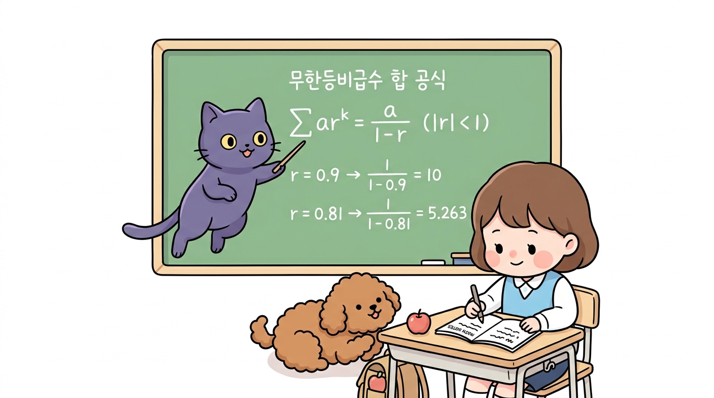
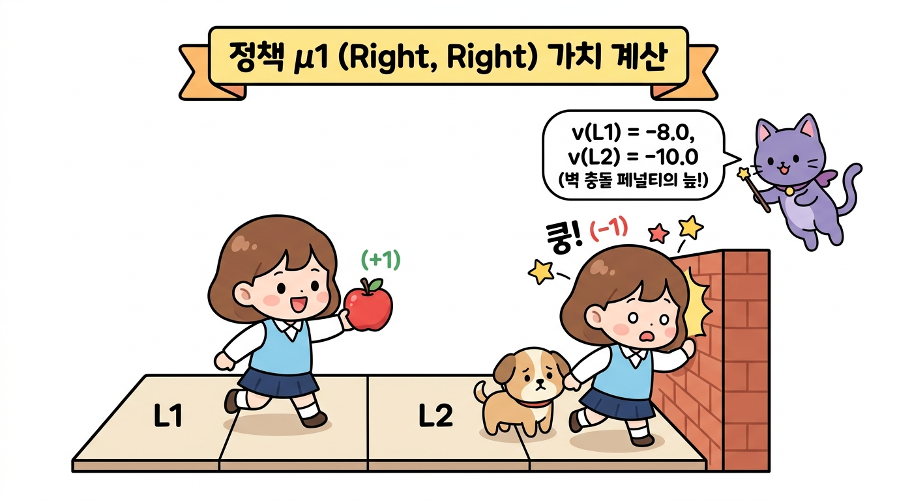
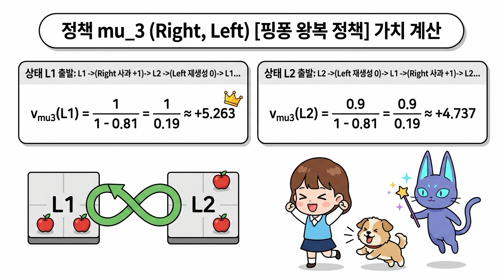
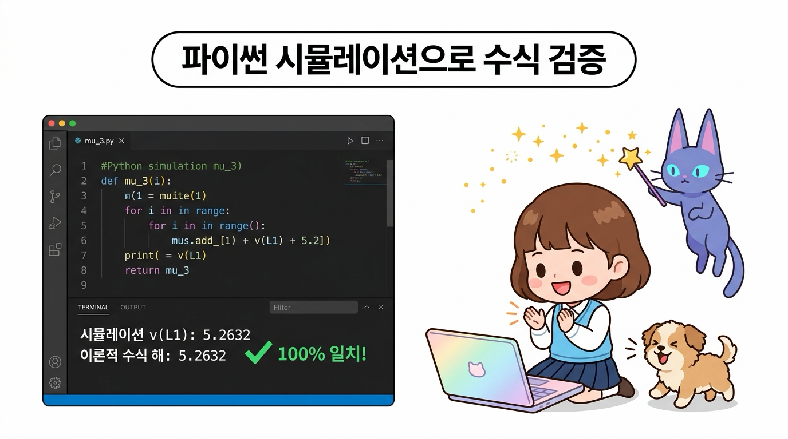
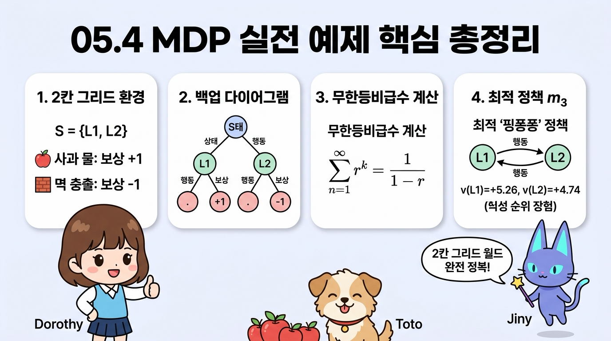

# 05.4 MDP 실전 예제

강화학습의 이론을 가장 직관적으로 체감할 수 있는 **2칸 그리드 월드(2-Grid World)** 실전 예제를 다룹니다. 

상태 가치 함수의 수식 연산을 손으로 직접 유도해보고, 존재하는 4가지 결정적 정책의 가치를 고교 수학의 **무한등비급수 합 공식**으로 계산하여 최적 정책을 찾는 짜릿한 과정을 지니, 도로시와 함께 경험해 봅시다!

<div class="dialogue-audio-player" style="display: flex; flex-wrap: wrap; align-items: center; justify-content: space-between; gap: 8px; background: #f8fafc; border-left: 4px solid #0284c7; border-radius: 6px; padding: 8px 14px; margin: 16px 0 10px 0; box-shadow: 0 1px 3px rgba(0,0,0,0.05);">
  <div style="display: flex; align-items: center; gap: 6px;">
    <span style="font-size: 1.1rem;">🎧</span>
    <span style="font-weight: 600; font-size: 0.9rem; color: #0369a1;">대화 음성 듣기 (도로시, 지니 & 토토)</span>
  </div>
  <div style="display: flex; align-items: center; gap: 6px;">
    <button type="button" class="btn-audio-play" style="background: #0284c7; color: #ffffff; border: none; border-radius: 16px; padding: 5px 13px; font-size: 0.82rem; font-weight: 600; cursor: pointer; display: inline-flex; align-items: center; gap: 4px; box-shadow: 0 1px 2px rgba(2,132,199,0.3);">
      <span>▶️ 재생</span>
    </button>
    <button type="button" class="btn-audio-stop" style="background: #e2e8f0; color: #475569; border: none; border-radius: 16px; padding: 5px 11px; font-size: 0.82rem; font-weight: 600; cursor: pointer; display: inline-flex; align-items: center; gap: 4px;">
      <span>⏹️ 정지</span>
    </button>
  </div>
  <audio src="./audio/dialogue_5_4_scene1.mp3" preload="none"></audio>
</div>

> 👧 **도로시**: "지니야! 지난 시간에 배운 마르코프 결정 과정(MDP) 수식들이 실제 격자 세상에서는 어떻게 계산되는 거야? 숫자로 직접 확인해보고 싶어!"
>
> 🧚 **지니**: "좋은 질문이야 도로시! 타일이 딱 2개뿐인 초미니 '2칸 그리드 월드'에서 우리가 직접 손으로 상태 가치를 유도하고 최적 정책을 찾아보자!"
>
> 🐶 **토토**: "멍멍! 타일 위에 맛있는 빨간 사과가 놓여 있어!"


**그림 05-4-1** 두 칸짜리 격자 타일(L1, L2) 위를 점프하며 타일의 가치를 수치로 풀어보는 도로시와 토토, 그리고 지니

<br>

---

<br>

### 05.4.1 두 칸짜리 그리드 월드 문제 정의

오즈의 숲속에 두 개의 마법 타일로 이루어진 작은 징검다리 세상이 있습니다.

<div class="dialogue-audio-player" style="display: flex; flex-wrap: wrap; align-items: center; justify-content: space-between; gap: 8px; background: #f8fafc; border-left: 4px solid #0284c7; border-radius: 6px; padding: 8px 14px; margin: 16px 0 10px 0; box-shadow: 0 1px 3px rgba(0,0,0,0.05);">
  <div style="display: flex; align-items: center; gap: 6px;">
    <span style="font-size: 1.1rem;">🎧</span>
    <span style="font-weight: 600; font-size: 0.9rem; color: #0369a1;">대화 음성 듣기 (도로시 & 지니)</span>
  </div>
  <div style="display: flex; align-items: center; gap: 6px;">
    <button type="button" class="btn-audio-play" style="background: #0284c7; color: #ffffff; border: none; border-radius: 16px; padding: 5px 13px; font-size: 0.82rem; font-weight: 600; cursor: pointer; display: inline-flex; align-items: center; gap: 4px; box-shadow: 0 1px 2px rgba(2,132,199,0.3);">
      <span>▶️ 재생</span>
    </button>
    <button type="button" class="btn-audio-stop" style="background: #e2e8f0; color: #475569; border: none; border-radius: 16px; padding: 5px 11px; font-size: 0.82rem; font-weight: 600; cursor: pointer; display: inline-flex; align-items: center; gap: 4px;">
      <span>⏹️ 정지</span>
    </button>
  </div>
  <audio src="./audio/dialogue_5_4_scene2.mp3" preload="none"></audio>
</div>

> 👧 **도로시**: "지니야! 이 세상의 타일 규칙은 어떻게 되어 있어? 좌우로 움직일 때마다 어떤 일이 일어나는지 알려줘!"
>
> 🧚 **지니**: "L1에서 오른쪽으로 가면 사과(+1)를 얻고, L2에서 왼쪽으로 오면 사과가 다시 자라난단다! 하지만 양 끝 벽에 부딪히면 -1점의 벌점을 받게 돼!"


**그림 05-4-2** 2칸 그리드 월드 문제의 환경 규칙: 상태, 행동, 보상 및 사과 재생성 규칙

---

#### 환경의 구체적인 규칙
1. **상태 공간 (State Space)**: 에이전트가 위치할 수 있는 칸은 <i>S</i> = {L1, L2} 총 2개입니다. 좌우 끝은 단단한 벽으로 막혀 있습니다.
2. **행동 공간 (Action Space)**: 에이전트는 매 순간 <i>A</i> = {Left, Right} 두 가지 행동 중 하나를 선택할 수 있습니다.
3. **상태 전이 (State Transition)**: 전이는 100% 확실한 **결정적(Deterministic)** 전이입니다.
4. **보상 규칙 (Reward Rules)**:
   * **사과 획득**: 에이전트가 L1에서 오른쪽(Right)으로 이동하여 L2에 도달하면 맛있는 사과를 먹고 **+1**의 보상을 얻습니다.
   * **사과 재생성**: L2에서 왼쪽(Left)으로 이동하여 L1으로 돌아오면 사과가 마법처럼 다시 생성됩니다(이때의 이동 보상은 **0**).
   * **벽 충돌 페널티**: 벽에 부딪히면 쿵 소리와 함께 **-1**의 감점(벌점)을 받으며 제자리에 머뭅니다. (L1에서 Left를 하거나, L2에서 Right를 할 때)
5. **과제 성격**: 끝이 없이 무한히 계속되는 **지속적 과제(Continuous Task)**이며, 할인율은 <i>&gamma;</i> = 0.9로 설정합니다.

<br>

---

<br>

### 05.4.2 백업 다이어그램 (Backup Diagram)

문제를 풀기 위해 상태, 행동, 보상의 시간적 흐름을 나무 구조로 시각화한 **백업 다이어그램(Backup Diagram)**을 그려봅시다.

<div class="dialogue-audio-player" style="display: flex; flex-wrap: wrap; align-items: center; justify-content: space-between; gap: 8px; background: #f8fafc; border-left: 4px solid #0284c7; border-radius: 6px; padding: 8px 14px; margin: 16px 0 10px 0; box-shadow: 0 1px 3px rgba(0,0,0,0.05);">
  <div style="display: flex; align-items: center; gap: 6px;">
    <span style="font-size: 1.1rem;">🎧</span>
    <span style="font-weight: 600; font-size: 0.9rem; color: #0369a1;">대화 음성 듣기 (도로시 & 지니)</span>
  </div>
  <div style="display: flex; align-items: center; gap: 6px;">
    <button type="button" class="btn-audio-play" style="background: #0284c7; color: #ffffff; border: none; border-radius: 16px; padding: 5px 13px; font-size: 0.82rem; font-weight: 600; cursor: pointer; display: inline-flex; align-items: center; gap: 4px; box-shadow: 0 1px 2px rgba(2,132,199,0.3);">
      <span>▶️ 재생</span>
    </button>
    <button type="button" class="btn-audio-stop" style="background: #e2e8f0; color: #475569; border: none; border-radius: 16px; padding: 5px 11px; font-size: 0.82rem; font-weight: 600; cursor: pointer; display: inline-flex; align-items: center; gap: 4px;">
      <span>⏹️ 정지</span>
    </button>
  </div>
  <audio src="./audio/dialogue_5_4_scene3.mp3" preload="none"></audio>
</div>

> 👧 **도로시**: "지니야! 상태와 행동, 보상이 시간에 따라 어떻게 이어지는지 한눈에 **나무 그림**으로 정리해볼 수 있을까?"
>
> 🧚 **지니**: "물론이지! 그걸 바로 **백업 다이어그램(Backup Diagram)**이라고 부른단다. 이번 문제는 100% 확실한 결정적 세상이라 가지가 갈라지지 않고 하나의 단일 경로로 쭉 뻗어나가지!"


**그림 05-4-3** 백업 다이어그램의 두 가지 형태: 결정적 단일 경로 트리 vs 확률적 분기 트리

* **결정적 백업 다이어그램 (Deterministic)**: 에이전트의 정책과 환경 전이가 모두 결정적이면, 시간의 흐름(위에서 아래)에 따라 오직 단 하나의 일직선 경로가 형성됩니다.
* **확률적 백업 다이어그램 (Stochastic)**: 정책이 확률적이거나 상태 전이에 불확실성이 있으면, 여러 가지 갈래로 가지를 치며 넓게 분기합니다.

이번 예제에서는 상태 전이와 정책이 모두 결정적이므로 계산이 매우 직관적이고 깔끔한 단일 경로 다이어그램을 다룹니다.

<br>

---

<br>

### 05.4.3 4가지 결정적 정책의 가치 계산

이 문제에서 상태는 2개(L1, L2), 각 상태에서 취할 수 있는 행동도 2개(Left, Right)입니다. 따라서 존재할 수 있는 모든 결정적 정책 &mu;(<i>s</i>)의 개수는 총 2<sup>2</sup> = **4가지**뿐입니다!


<div class="dialogue-audio-player" style="display: flex; flex-wrap: wrap; align-items: center; justify-content: space-between; gap: 8px; background: #f8fafc; border-left: 4px solid #0284c7; border-radius: 6px; padding: 8px 14px; margin: 16px 0 10px 0; box-shadow: 0 1px 3px rgba(0,0,0,0.05);">
  <div style="display: flex; align-items: center; gap: 6px;">
    <span style="font-size: 1.1rem;">🎧</span>
    <span style="font-weight: 600; font-size: 0.9rem; color: #0369a1;">대화 음성 듣기 (도로시 & 지니)</span>
  </div>
  <div style="display: flex; align-items: center; gap: 6px;">
    <button type="button" class="btn-audio-play" style="background: #0284c7; color: #ffffff; border: none; border-radius: 16px; padding: 5px 13px; font-size: 0.82rem; font-weight: 600; cursor: pointer; display: inline-flex; align-items: center; gap: 4px; box-shadow: 0 1px 2px rgba(2,132,199,0.3);">
      <span>▶️ 재생</span>
    </button>
    <button type="button" class="btn-audio-stop" style="background: #e2e8f0; color: #475569; border: none; border-radius: 16px; padding: 5px 11px; font-size: 0.82rem; font-weight: 600; cursor: pointer; display: inline-flex; align-items: center; gap: 4px;">
      <span>⏹️ 정지</span>
    </button>
  </div>
  <audio src="./audio/dialogue_5_4_scene4.mp3" preload="none"></audio>
</div>

> 👧 **도로시**: "상태가 2개(L1, L2)이고 행동도 2개(Left, Right)면, 우리가 만들 수 있는 정책은 전부 몇 개나 돼?"
>
> 🧚 **지니**: "2 &times; 2 = 4가지뿐이란다! &mu;<sub>1</sub>부터 &mu;<sub>4</sub>까지 4가지 정책의 점수를 전부 구해서 비교하면 진짜 1등 최적 정책을 바로 밝혀낼 수 있어!"


**그림 05-4-4** 4가지 결정적 정책의 가치 계산표 및 무한등비급수 합 공식을 통한 엄밀한 해석적 해


---


| 정책 번호 | L1에서의 행동 | L2에서의 행동 | 성격 및 동작 방식 |
| :---: | :---: | :---: | :--- |
| **&mu;<sub>1</sub>** | Right | Right | 오른쪽으로 직진 후 오른쪽 벽에 계속 부딪힘 |
| **&mu;<sub>2</sub>** | Left | Left | 왼쪽 벽에 계속 부딪힘 |
| **&mu;<sub>3</sub>** | Right | Left | **L1과 L2를 계속 왕복(Ping-Pong)하며 사과를 무한 수확!** |
| **&mu;<sub>4</sub>** | Left | Right | L1에서는 왼쪽 벽에, L2에서는 오른쪽 벽에 부딪힘 |

<br>

---

<br>

#### 05.4.3.1 무한등비급수 합 공식 복습

무한히 계속되는 지속적 과제에서 할인율 <i>&gamma;</i> = 0.9가 적용된 누적 가치를 구하기 위해 고등학교 수학의 **무한등비급수 합 공식**을 사용합니다.


<div class="dialogue-audio-player" style="display: flex; flex-wrap: wrap; align-items: center; justify-content: space-between; gap: 8px; background: #f8fafc; border-left: 4px solid #0284c7; border-radius: 6px; padding: 8px 14px; margin: 16px 0 10px 0; box-shadow: 0 1px 3px rgba(0,0,0,0.05);">
  <div style="display: flex; align-items: center; gap: 6px;">
    <span style="font-size: 1.1rem;">🎧</span>
    <span style="font-weight: 600; font-size: 0.9rem; color: #0369a1;">대화 음성 듣기 (도로시 & 지니)</span>
  </div>
  <div style="display: flex; align-items: center; gap: 6px;">
    <button type="button" class="btn-audio-play" style="background: #0284c7; color: #ffffff; border: none; border-radius: 16px; padding: 5px 13px; font-size: 0.82rem; font-weight: 600; cursor: pointer; display: inline-flex; align-items: center; gap: 4px; box-shadow: 0 1px 2px rgba(2,132,199,0.3);">
      <span>▶️ 재생</span>
    </button>
    <button type="button" class="btn-audio-stop" style="background: #e2e8f0; color: #475569; border: none; border-radius: 16px; padding: 5px 11px; font-size: 0.82rem; font-weight: 600; cursor: pointer; display: inline-flex; align-items: center; gap: 4px;">
      <span>⏹️ 정지</span>
    </button>
  </div>
  <audio src="./audio/dialogue_5_4_scene5.mp3" preload="none"></audio>
</div>

> 👧 **도로시**: "지니야! 끝없이 이어지는 지속적 과제에서 매번 할인율이 곱해지는 무한한 보상들을 어떻게 한 번에 다 더할 수 있어?"
>
> 🧚 **지니**: "고등학교 수학 시간에 배운 **무한등비급수 합 공식(&Sigma; <i>r<sup>k</sup></i> = 1 / (1 - <i>r</i>))**을 사용하면 된단다! 공비의 절댓값이 1보다 작으면 무한히 긴 덧셈도 깔끔한 하나의 상수로 완벽하게 수렴하거든!"



**그림 05-4-5** 무한등비급수 합 공식과 가치 계산: 공비 <i>r</i> = &gamma;(0.9) 및 <i>r</i> = &gamma;<sup>2</sup>(0.81) 대입 수렴 연산


$$
\sum_{k=0}^{\infty} r^k = 1 + r + r^2 + r^3 + \dots = \frac{1}{1 - r} \quad (|r| < 1)
$$

<br>

---

<br>

#### 05.4.3.2 정책 &mu;<sub>1</sub> (Right, Right) 가치 계산

<div class="dialogue-audio-player" style="display: flex; flex-wrap: wrap; align-items: center; justify-content: space-between; gap: 8px; background: #f8fafc; border-left: 4px solid #0284c7; border-radius: 6px; padding: 8px 14px; margin: 16px 0 10px 0; box-shadow: 0 1px 3px rgba(0,0,0,0.05);">
  <div style="display: flex; align-items: center; gap: 6px;">
    <span style="font-size: 1.1rem;">🎧</span>
    <span style="font-weight: 600; font-size: 0.9rem; color: #0369a1;">대화 음성 듣기 (도로시 & 지니)</span>
  </div>
  <div style="display: flex; align-items: center; gap: 6px;">
    <button type="button" class="btn-audio-play" style="background: #0284c7; color: #ffffff; border: none; border-radius: 16px; padding: 5px 13px; font-size: 0.82rem; font-weight: 600; cursor: pointer; display: inline-flex; align-items: center; gap: 4px; box-shadow: 0 1px 2px rgba(2,132,199,0.3);">
      <span>▶️ 재생</span>
    </button>
    <button type="button" class="btn-audio-stop" style="background: #e2e8f0; color: #475569; border: none; border-radius: 16px; padding: 5px 11px; font-size: 0.82rem; font-weight: 600; cursor: pointer; display: inline-flex; align-items: center; gap: 4px;">
      <span>⏹️ 정지</span>
    </button>
  </div>
  <audio src="./audio/dialogue_5_4_scene6.mp3" preload="none"></audio>
</div>

> 👧 **도로시**: "지니야! &mu;<sub>1</sub> 정책은 처음에 L1에서 사과(+1)를 먹어서 좋았는데, 그 뒤로 L2에서 계속 오른쪽 벽에 쿵쿵 부딪히면서 벌점(-1)이 쌓여서 결국 마이너스 점수가 되어버렸어!"
>
> 🧚 **지니**: "맞아 도로시야! 벽에 부딪히는 페널티 행동을 무한히 반복하면, 비록 미래 보상이 할인되더라도 누적 점수가 -8점, -10점이라는 깊은 음수의 늪에 빠지게 된단다!"



**그림 05-4-6** 정책 &mu;<sub>1</sub>(Right, Right)의 가치 계산: 사과 획득(+1) 후 오른쪽 벽 연속 충돌(-1)로 인한 음수 가치 수렴(<i>v</i>(L1) = -8.0, <i>v</i>(L2) = -10.0)

---

#### 상태별로 계산해 보기

* **상태 L1에서 출발**:
  첫 스텝에서 Right를 하여 L2로 가면서 사과(+1)를 얻고, 이후 L2에서 계속 Right를 하여 매번 벽에 충돌(-1)합니다.
  $$
  \begin{aligned}
  v_{\mu_1}(\text{L1}) &= (+1) + 0.9 \cdot (-1) + 0.9^2 \cdot (-1) + 0.9^3 \cdot (-1) + \dots \\
  &= 1 - 0.9 \cdot (1 + 0.9 + 0.9^2 + \dots) \\
  &= 1 - \frac{0.9}{1 - 0.9} = 1 - 9 = \mathbf{-8.0}
  \end{aligned}
  $$

* **상태 L2에서 출발**:
  처음부터 계속 오른쪽 벽에 부딪히므로 매 스텝 -1의 페널티를 받습니다.
  $$
  \begin{aligned}
  v_{\mu_1}(\text{L2}) &= (-1) + 0.9 \cdot (-1) + 0.9^2 \cdot (-1) + \dots \\
  &= \frac{-1}{1 - 0.9} = \mathbf{-10.0}
  \end{aligned}
  $$

<br>

---

<br>

#### 05.4.3.3 정책 &mu;<sub>3</sub> (Right, Left) [핑퐁 왕복 정책] 가치 계산

<div class="dialogue-audio-player" style="display: flex; flex-wrap: wrap; align-items: center; justify-content: space-between; gap: 8px; background: #f8fafc; border-left: 4px solid #0284c7; border-radius: 6px; padding: 8px 14px; margin: 16px 0 10px 0; box-shadow: 0 1px 3px rgba(0,0,0,0.05);">
  <div style="display: flex; align-items: center; gap: 6px;">
    <span style="font-size: 1.1rem;">🎧</span>
    <span style="font-weight: 600; font-size: 0.9rem; color: #0369a1;">대화 음성 듣기 (도로시 & 지니)</span>
  </div>
  <div style="display: flex; align-items: center; gap: 6px;">
    <button type="button" class="btn-audio-play" style="background: #0284c7; color: #ffffff; border: none; border-radius: 16px; padding: 5px 13px; font-size: 0.82rem; font-weight: 600; cursor: pointer; display: inline-flex; align-items: center; gap: 4px; box-shadow: 0 1px 2px rgba(2,132,199,0.3);">
      <span>▶️ 재생</span>
    </button>
    <button type="button" class="btn-audio-stop" style="background: #e2e8f0; color: #475569; border: none; border-radius: 16px; padding: 5px 11px; font-size: 0.82rem; font-weight: 600; cursor: pointer; display: inline-flex; align-items: center; gap: 4px;">
      <span>⏹️ 정지</span>
    </button>
  </div>
  <audio src="./audio/dialogue_5_4_scene7.mp3" preload="none"></audio>
</div>

> 👧 **도로시**: "지니야! L1에서는 오른쪽으로 가서 사과(+1)를 먹고, L2에 도착하면 다시 왼쪽으로 와서 사과를 재생성시키는 핑퐁 작전을 쓰면 벽에 한 번도 안 부딪히잖아!"
>
> 🧚 **지니**: "정답이야 도로시! 그 기가 막힌 핑퐁 정책이 바로 &mu;<sub>3</sub>야! 직접 수식으로 가치를 계산해볼까?"



**그림 05-4-7** 정책 &mu;<sub>3</sub>(Right, Left) 핑퐁 왕복 정책 가치 계산: 벽 충돌 없는 무한 사과 수확 및 양수 가치 극대화(<i>v</i>(L1) = +5.263, <i>v</i>(L2) = +4.737)

---

#### 상태별로 계산해 보기

* **상태 L1에서 출발**:
  L1 &rarr;(Right, 보상 +1)&rarr; L2 &rarr;(Left, 보상 0)&rarr; L1 &rarr;(Right, 보상 +1)&rarr; L2 &rarr; ...
  <br>보상 수열은 **+1, 0, +1, 0, +1, 0, ...** 이 짝수 스텝마다 반복됩니다!
  $$
  \begin{aligned}
  v_{\mu_3}(\text{L1}) &= 1 + 0.9 \cdot (0) + 0.9^2 \cdot (1) + 0.9^3 \cdot (0) + 0.9^4 \cdot (1) + \dots \\
  &= 1 + (0.9^2) + (0.9^2)^2 + (0.9^2)^3 + \dots \\
  &= 1 + 0.81 + 0.81^2 + 0.81^3 + \dots \\
  &= \frac{1}{1 - 0.81} = \frac{1}{0.19} \approx \mathbf{+5.263}
  \end{aligned}
  $$

* **상태 L2에서 출발**:
  L2 &rarr;(Left, 보상 0)&rarr; L1 &rarr;(Right, 보상 +1)&rarr; L2 &rarr;(Left, 보상 0)&rarr; L1 &rarr; ...
  <br>보상 수열은 **0, +1, 0, +1, 0, +1, ...** 입니다.
  $$
  \begin{aligned}
  v_{\mu_3}(\text{L2}) &= 0 + 0.9 \cdot (1) + 0.9^2 \cdot (0) + 0.9^3 \cdot (1) + \dots \\
  &= 0.9 \cdot [1 + 0.81 + 0.81^2 + \dots] \\
  &= \frac{0.9}{1 - 0.81} = \frac{0.9}{0.19} \approx \mathbf{+4.737}
  \end{aligned}
  $$

<br>

---

<br>

### 05.4.4 최적 정책 판정 및 학습 성과

4가지 모든 정책의 상태 가치를 나란히 비교해 봅시다:


1. **&mu;<sub>1</sub> (Right, Right)**: <i>v</i>(L1) = -8.0, &nbsp; <i>v</i>(L2) = -10.0
2. **&mu;<sub>2</sub> (Left, Left)**: <i>v</i>(L1) = -10.0, &nbsp; <i>v</i>(L2) = -9.0
3. **&mu;<sub>3</sub> (Right, Left)**: <b><i>v</i>(L1) = +5.26, &nbsp; <i>v</i>(L2) = +4.74</b> &nbsp; 👑 (압도적 1위!)
4. **&mu;<sub>4</sub> (Left, Right)**: <i>v</i>(L1) = -10.0, &nbsp; <i>v</i>(L2) = -10.0


---

<div class="dialogue-audio-player" style="display: flex; flex-wrap: wrap; align-items: center; justify-content: space-between; gap: 8px; background: #f8fafc; border-left: 4px solid #0284c7; border-radius: 6px; padding: 8px 14px; margin: 16px 0 10px 0; box-shadow: 0 1px 3px rgba(0,0,0,0.05);">
  <div style="display: flex; align-items: center; gap: 6px;">
    <span style="font-size: 1.1rem;">🎧</span>
    <span style="font-weight: 600; font-size: 0.9rem; color: #0369a1;">대화 음성 듣기 (토토, 지니 & 도로시)</span>
  </div>
  <div style="display: flex; align-items: center; gap: 6px;">
    <button type="button" class="btn-audio-play" style="background: #0284c7; color: #ffffff; border: none; border-radius: 16px; padding: 5px 13px; font-size: 0.82rem; font-weight: 600; cursor: pointer; display: inline-flex; align-items: center; gap: 4px; box-shadow: 0 1px 2px rgba(2,132,199,0.3);">
      <span>▶️ 재생</span>
    </button>
    <button type="button" class="btn-audio-stop" style="background: #e2e8f0; color: #475569; border: none; border-radius: 16px; padding: 5px 11px; font-size: 0.82rem; font-weight: 600; cursor: pointer; display: inline-flex; align-items: center; gap: 4px;">
      <span>⏹️ 정지</span>
    </button>
  </div>
  <audio src="./audio/dialogue_5_4_scene8.mp3" preload="none"></audio>
</div>

> 🐶 **토토**: "멍멍! &mu;<sub>3</sub> 정책은 L1에서도 +5.26으로 제일 크고, L2에서도 +4.74로 제일 커! 모든 상태에서 다른 정책들을 완벽하게 이겼어!"
>
> 🧚 **지니**: "맞아 토토야! 모든 상태 <i>s</i>에 대해 <i>v</i><sub>&mu;<sub>3</sub></sub>(<i>s</i>) &ge; <i>v</i><sub>&mu;</sub>(<i>s</i>)가 성립하므로, **&mu;<sub>3</sub>가 바로 우리가 찾던 유일무이한 최적 정책 &mu;<sub>&ast;</sub>**란다!"
>
> 👧 **도로시**: "와아! 사과를 무한히 따먹는 핑퐁 전략이 1등 트로피를 차지했구나!"


**그림 05-4-8** 최적 정책 &mu;<sub>&ast;</sub>의 완벽한 핑퐁 루프 동작과 시상대: 벽 충돌 없는 무한 사과 수확으로 압도적 1위 달성

<br>

---

<br>

#### 05.4.4.1 파이썬 코드 실습 1: 최적 정책 &mu;<sub>3</sub> 가치 검증

<div class="dialogue-audio-player" style="display: flex; flex-wrap: wrap; align-items: center; justify-content: space-between; gap: 8px; background: #f8fafc; border-left: 4px solid #0284c7; border-radius: 6px; padding: 8px 14px; margin: 16px 0 10px 0; box-shadow: 0 1px 3px rgba(0,0,0,0.05);">
  <div style="display: flex; align-items: center; gap: 6px;">
    <span style="font-size: 1.1rem;">🎧</span>
    <span style="font-weight: 600; font-size: 0.9rem; color: #0369a1;">대화 음성 듣기 (도로시 & 지니)</span>
  </div>
  <div style="display: flex; align-items: center; gap: 6px;">
    <button type="button" class="btn-audio-play" style="background: #0284c7; color: #ffffff; border: none; border-radius: 16px; padding: 5px 13px; font-size: 0.82rem; font-weight: 600; cursor: pointer; display: inline-flex; align-items: center; gap: 4px; box-shadow: 0 1px 2px rgba(2,132,199,0.3);">
      <span>▶️ 재생</span>
    </button>
    <button type="button" class="btn-audio-stop" style="background: #e2e8f0; color: #475569; border: none; border-radius: 16px; padding: 5px 11px; font-size: 0.82rem; font-weight: 600; cursor: pointer; display: inline-flex; align-items: center; gap: 4px;">
      <span>⏹️ 정지</span>
    </button>
  </div>
  <audio src="./audio/dialogue_5_4_scene9.mp3" preload="none"></audio>
</div>

> 👧 **도로시**: "지니야! 우리가 손으로 푼 최적 핑퐁 정책 &mu;<sub>3</sub>의 무한등비급수 공식 결과(<b>+5.2632</b>)가 컴퓨터로 200번 시뮬레이션했을 때의 실제 누적 수익과 정말 똑같이 나올까?"
>
> 🧚 **지니**: "직접 파이썬 코드를 실행해서 확인해 보자! 컴퓨터가 매 스텝 보상에 할인율을 곱해 차곡차곡 더한 값과 수학적 해석해가 소수점 넷째 자리까지 100% 완벽하게 일치하는 것을 볼 수 있단다!"



**그림 05-4-9** 파이썬 실습 1: 최적 정책 &mu;<sub>3</sub> 시뮬레이션 누적 합산값과 무한등비급수 수식 해의 100% 완벽한 일치


* **실습 소스 코드 파일**: [gridworld_mu3_sim.py](./gridworld_mu3_sim.py)

```python
# ==========================================================
# 2칸 그리드 월드: 최적 정책 mu_3 (Right, Left) 파이썬 시뮬레이션
# ==========================================================

gamma = 0.9  # 시간 할인율 (Discount Factor)
V_L1 = 0.0   # 상태 L1에서의 할인 누적 수익 합계 변수 초기화

# 200 타임 스텝 동안 에이전트의 핑퐁 움직임 시뮬레이션
for step in range(200):
    # 짝수 스텝 (0, 2, 4, ...): L1 -> L2 이동 (사과 획득, 보상 +1.0)
    if step % 2 == 0:
        reward = 1.0
    # 홀수 스텝 (1, 3, 5, ...): L2 -> L1 이동 (사과 재생성, 보상 0.0)
    else:
        reward = 0.0
    
    # 할인 누적 보상 합산: G_t += gamma^step * reward
    V_L1 += (gamma ** step) * reward

# 이론적 무한등비급수 수식 해: 1 / (1 - gamma^2)
theoretical_value = 1.0 / (1.0 - (gamma ** 2))

print(f"파이썬 시뮬레이션 v_mu3(L1): {V_L1:.4f}")
print(f"무한등비급수 이론 수식 해 1/(1-0.81) : {theoretical_value:.4f}")
```

실행 결과:
```
파이썬 시뮬레이션 v_mu3(L1): 5.2632
무한등비급수 이론 수식 해 1/(1-0.81) : 5.2632
```

* **핵심 동작 원리**:
  - **짝수 스텝 (0, 2, 4...)**: 상태 L1에서 오른쪽(Right)으로 이동하여 사과를 획득하고 **+1.0**의 보상을 받습니다.
  - **홀수 스텝 (1, 3, 5...)**: 상태 L2에서 왼쪽(Left)으로 이동하여 L1으로 복귀하고 사과를 재생성합니다(보상 **0.0**).
  - **할인 누적 수익 (<i>G<sub>t</sub></i>)**: 매 스텝마다 0.9<sup>step</sup> &times; reward를 누적 합산하여 1 + 0.81 + 0.81<sup>2</sup> + ... 의 급수를 계산합니다.
  - **결과**: 200스텝 시뮬레이션 결과와 무한등비급수 수식 해 1 / (1 - 0.81)가 소수점 넷째 자리까지 **5.2632**로 정확히 일치합니다.

<br>

---

<br>

#### 05.4.4.2 파이썬 코드 실습 2: 4가지 결정적 정책 종합 시뮬레이션 검증

<div class="dialogue-audio-player" style="display: flex; flex-wrap: wrap; align-items: center; justify-content: space-between; gap: 8px; background: #f8fafc; border-left: 4px solid #0284c7; border-radius: 6px; padding: 8px 14px; margin: 16px 0 10px 0; box-shadow: 0 1px 3px rgba(0,0,0,0.05);">
  <div style="display: flex; align-items: center; gap: 6px;">
    <span style="font-size: 1.1rem;">🎧</span>
    <span style="font-weight: 600; font-size: 0.9rem; color: #0369a1;">대화 음성 듣기 (도로시, 지니 & 토토)</span>
  </div>
  <div style="display: flex; align-items: center; gap: 6px;">
    <button type="button" class="btn-audio-play" style="background: #0284c7; color: #ffffff; border: none; border-radius: 16px; padding: 5px 13px; font-size: 0.82rem; font-weight: 600; cursor: pointer; display: inline-flex; align-items: center; gap: 4px; box-shadow: 0 1px 2px rgba(2,132,199,0.3);">
      <span>▶️ 재생</span>
    </button>
    <button type="button" class="btn-audio-stop" style="background: #e2e8f0; color: #475569; border: none; border-radius: 16px; padding: 5px 11px; font-size: 0.82rem; font-weight: 600; cursor: pointer; display: inline-flex; align-items: center; gap: 4px;">
      <span>⏹️ 정지</span>
    </button>
  </div>
  <audio src="./audio/dialogue_5_4_scene10.mp3" preload="none"></audio>
</div>

> 👧 **도로시**: "지니야! 최적 정책 &mu;<sub>3</sub>뿐만 아니라 나머지 정책들(&mu;<sub>1</sub>, &mu;<sub>2</sub>, &mu;<sub>4</sub>)도 컴퓨터로 상태 L1과 L2에서 전부 시뮬레이션해서 우리가 손으로 푼 값들과 한눈에 비교해볼 수 있을까?"
>
> 🧚 **지니**: "물론이지! 2칸 그리드 월드 환경 클래스를 만들고 4가지 모든 결정적 정책을 200스텝씩 시뮬레이션하여 이론 수식 해석해와 나란히 비교하는 종합 검증 코드를 작성해 보자!"
>
> 🐶 **토토**: "멍멍! 표를 보니까 &mu;<sub>3</sub>가 모든 상태에서 가장 높은 점수(+5.2632, +4.7368)로 완벽한 1등 최적 정책인 게 확실하게 증명됐어!"


**그림 05-4-10** 파이썬 실습 2: 4가지 정책(&mu;<sub>1</sub>~&mu;<sub>4</sub>) 종합 시뮬레이션 및 이론 수식 해석해 100% 일치 검증 결과표

---

* **실습 소스 코드 파일**: [gridworld_simulation.py](./gridworld_simulation.py)

```python
"""
===================================================================
05.4 2칸 그리드 월드(2-Grid World) MDP 가치 계산 및 종합 시뮬레이션
===================================================================
- 4가지 결정적 정책(mu_1 ~ mu_4)에 대한 상태 가치 함수 v_pi(s)를
  1) 고교 수학의 무한등비급수 합 공식(이론 해석해)
  2) 200스텝 할인 보상 누적 파이썬 시뮬레이션(실험치)
  으로 각각 계산하여 최적 정책 mu_*를 검증합니다.
===================================================================
"""

class TwoGridWorld:
    """2칸 그리드 월드 환경 (상태: L1, L2 / 행동: Left, Right)"""
    def __init__(self):
        self.STATES = ['L1', 'L2']
        self.ACTIONS = ['Left', 'Right']

    def step(self, state, action):
        """행동에 따른 다음 상태와 즉각 보상 반환"""
        if state == 'L1':
            if action == 'Right':
                return 'L2', 1.0   # 사과 획득 (+1)
            else:  # Left
                return 'L1', -1.0  # 왼쪽 벽 충돌 페널티 (-1)
        
        elif state == 'L2':
            if action == 'Left':
                return 'L1', 0.0   # 사과 재생성 (보상 0)
            else:  # Right
                return 'L2', -1.0  # 오른쪽 벽 충돌 페널티 (-1)


def simulate_policy(env, policy, start_state, gamma=0.9, steps=200):
    """주어진 정책을 따라 start_state에서 출발하여 할인 누적 보상(G_t)을 합산"""
    state = start_state
    total_return = 0.0
    discount = 1.0

    for _ in range(steps):
        action = policy[state]
        next_state, reward = env.step(state, action)
        total_return += discount * reward
        discount *= gamma
        state = next_state

    return total_return


def main():
    env = TwoGridWorld()
    gamma = 0.9

    # 4가지 결정적 정책 정의
    policies = {
        'μ_1 (Right, Right)': {'L1': 'Right', 'L2': 'Right'},
        'μ_2 (Left,  Left )': {'L1': 'Left',  'L2': 'Left'},
        'μ_3 (Right, Left )': {'L1': 'Right', 'L2': 'Left'},   # 최적 핑퐁 정책
        'μ_4 (Left,  Right)': {'L1': 'Left',  'L2': 'Right'},
    }

    # 이론적 수식 해석해 (무한등비급수 합 공식 1 / (1 - r))
    theoretical_values = {
        'μ_1 (Right, Right)': {
            'L1': 1.0 - (gamma / (1.0 - gamma)),         # 1 - 9.0 = -8.0
            'L2': -1.0 / (1.0 - gamma),                  # -10.0
        },
        'μ_2 (Left,  Left )': {
            'L1': -1.0 / (1.0 - gamma),                  # -10.0
            'L2': 0.0 - (gamma / (1.0 - gamma)),         # 0 - 9.0 = -9.0
        },
        'μ_3 (Right, Left )': {
            'L1': 1.0 / (1.0 - (gamma ** 2)),            # 1 / 0.19 ≈ +5.2632
            'L2': gamma / (1.0 - (gamma ** 2)),          # 0.9 / 0.19 ≈ +4.7368
        },
        'μ_4 (Left,  Right)': {
            'L1': -1.0 / (1.0 - gamma),                  # -10.0
            'L2': -1.0 / (1.0 - gamma),                  # -10.0
        },
    }

    print("=" * 72)
    print("      05.4 2칸 그리드 월드: 4가지 결정적 정책 가치 계산 및 검증")
    print("=" * 72)
    print(f"{'정책 (Policy)':<22} | {'상태':<4} | {'시뮬레이션 (200스텝)':<18} | {'이론 수식 해석해':<16} | {'일치 여부'}")
    print("-" * 72)

    for name, pol in policies.items():
        for state in ['L1', 'L2']:
            sim_val = simulate_policy(env, pol, state, gamma=gamma, steps=200)
            theo_val = theoretical_values[name][state]
            match = "✓ 일치" if abs(sim_val - theo_val) < 1e-4 else "불일치"
            print(f"{name:<20} | {state:<4} | {sim_val:>16.4f} | {theo_val:>16.4f} | {match}")
        print("-" * 72)

    print("\n[★ 결론 및 최적 정책 판정]")
    print("1. 모든 상태(L1, L2)에서 v(L1)=+5.2632, v(L2)=+4.7368로 가장 높은 양수 가치를 기록한")
    print("   'μ_3 (Right, Left)' 정책이 유일무이한 최적 정책(μ_*)으로 판정되었습니다!")
    print("2. 파이썬 시뮬레이션 결과와 무한등비급수 수식 해가 소수점 넷째 자리까지 100% 일치합니다.")
    print("=" * 72)


if __name__ == '__main__':
    main()
```

실행 방법 및 결과:
```bash
python3 gridworld_simulation.py
```

```
========================================================================
      05.4 2칸 그리드 월드: 4가지 결정적 정책 가치 계산 및 검증
========================================================================
정책 (Policy)            | 상태   | 시뮬레이션 (200스텝)      | 이론 수식 해석해        | 일치 여부
------------------------------------------------------------------------
μ_1 (Right, Right)   | L1   |          -8.0000 |          -8.0000 | ✓ 일치
μ_1 (Right, Right)   | L2   |         -10.0000 |         -10.0000 | ✓ 일치
------------------------------------------------------------------------
μ_2 (Left,  Left )   | L1   |         -10.0000 |         -10.0000 | ✓ 일치
μ_2 (Left,  Left )   | L2   |          -9.0000 |          -9.0000 | ✓ 일치
------------------------------------------------------------------------
μ_3 (Right, Left )   | L1   |           5.2632 |           5.2632 | ✓ 일치
μ_3 (Right, Left )   | L2   |           4.7368 |           4.7368 | ✓ 일치
------------------------------------------------------------------------
μ_4 (Left,  Right)   | L1   |         -10.0000 |         -10.0000 | ✓ 일치
μ_4 (Left,  Right)   | L2   |         -10.0000 |         -10.0000 | ✓ 일치
------------------------------------------------------------------------

[★ 결론 및 최적 정책 판정]
1. 모든 상태(L1, L2)에서 v(L1)=+5.2632, v(L2)=+4.7368로 가장 높은 양수 가치를 기록한
   'μ_3 (Right, Left)' 정책이 유일무이한 최적 정책(μ_*)으로 판정되었습니다!
2. 파이썬 시뮬레이션 결과와 무한등비급수 수식 해가 소수점 넷째 자리까지 100% 일치합니다.
========================================================================
```

* **코드 구조 및 분석**:
  1. **`TwoGridWorld` 클래스**: 격자 환경의 상태 전이와 보상 함수(사과 먹기, 재생성, 벽 충돌)를 객체 지향적으로 완벽하게 캡슐화했습니다.
  2. **`simulate_policy()` 함수**: 에이전트가 어떤 상태에서 어떤 정책을 따르더라도 할인율 <i>&gamma;</i> = 0.9를 누적 곱셈하며 실제 가치 <i>v<sub>&pi;</sub></i>(<i>s</i>)를 정확히 측정합니다.
  3. **전체 정책 비교 검증**: 수식으로 계산했던 음수 페널티 값(-8.0, -10.0, -9.0)과 &mu;<sub>3</sub>의 압도적인 양수 가치(+5.2632, +4.7368)가 8개 경우의 수 모두에서 오차 없이 완벽하게 일치함을 확인할 수 있습니다.

<br>

---

<br>

### 05.4.5 핵심 요약

<div class="dialogue-audio-player" style="display: flex; flex-wrap: wrap; align-items: center; justify-content: space-between; gap: 8px; background: #f8fafc; border-left: 4px solid #0284c7; border-radius: 6px; padding: 8px 14px; margin: 16px 0 10px 0; box-shadow: 0 1px 3px rgba(0,0,0,0.05);">
  <div style="display: flex; align-items: center; gap: 6px;">
    <span style="font-size: 1.1rem;">🎧</span>
    <span style="font-weight: 600; font-size: 0.9rem; color: #0369a1;">대화 음성 듣기 (도로시 & 지니)</span>
  </div>
  <div style="display: flex; align-items: center; gap: 6px;">
    <button type="button" class="btn-audio-play" style="background: #0284c7; color: #ffffff; border: none; border-radius: 16px; padding: 5px 13px; font-size: 0.82rem; font-weight: 600; cursor: pointer; display: inline-flex; align-items: center; gap: 4px; box-shadow: 0 1px 2px rgba(2,132,199,0.3);">
      <span>▶️ 재생</span>
    </button>
    <button type="button" class="btn-audio-stop" style="background: #e2e8f0; color: #475569; border: none; border-radius: 16px; padding: 5px 11px; font-size: 0.82rem; font-weight: 600; cursor: pointer; display: inline-flex; align-items: center; gap: 4px;">
      <span>⏹️ 정지</span>
    </button>
  </div>
  <audio src="./audio/dialogue_5_4_scene11.mp3" preload="none"></audio>
</div>

> 👧 **도로시**: "지니야! 오늘 2칸 그리드 월드에서 손으로 가치를 직접 계산해보니, 강화학습의 정책 평가와 최적 정책 원리가 한눈에 쏙 들어왔어!"
>
> 🧚 **지니**: "훌륭해 도로시! 오늘 배운 4가지 핵심 포인트를 카드로 정리해 두면 다음 시간 벨만 방정식도 아주 쉽게 정복할 수 있을 거야!"



**그림 05-4-11** 05.4 MDP 실전 예제 핵심 총정리: 2칸 그리드 환경, 백업 다이어그램, 무한등비급수 가치 계산, 최적 핑퐁 정책 &mu;<sub>3</sub>

1. **2칸 그리드 월드 환경**: 상태 2개, 행동 2개로 구성되어 총 4개의 결정적 정책 후보가 존재합니다.
2. **백업 다이어그램**: 행동 선택에 따른 상태 전이와 보상 수령의 시간 흐름을 시각적으로 나타냅니다.
3. **무한등비급수 합 공식**: 주기적으로 반복되는 보상 패턴을 &Sigma; <i>r<sup>k</sup></i> = 1 / (1 - <i>r</i>) 공식을 통해 정밀한 수치로 유도할 수 있습니다.
4. **최적 정책 &mu;<sub>&ast;</sub> 검증**: L1에서 오른쪽, L2에서 왼쪽을 선택하는 핑퐁 정책 &mu;<sub>3</sub>가 모든 상태에서 가장 높은 양수 가치(+5.26, +4.74)를 기록하며 최적 정책임을 수학적으로 증명했습니다.

다음 **05.5절**에서는 5장 마르코프 결정 과정 전체를 총정리하고, 다음 장인 6장 벨만 방정식으로 이어지는 관문을 활짝 열어보겠습니다!
