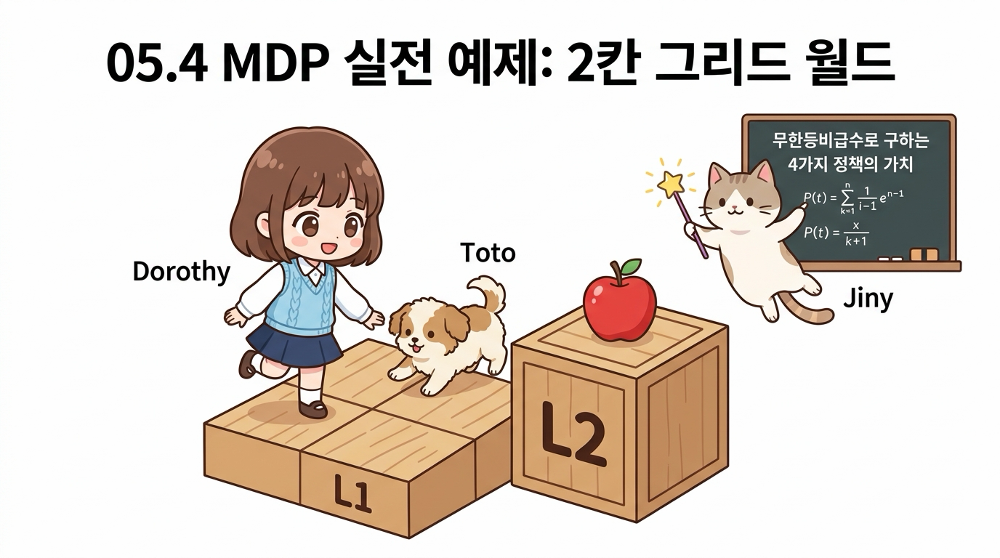
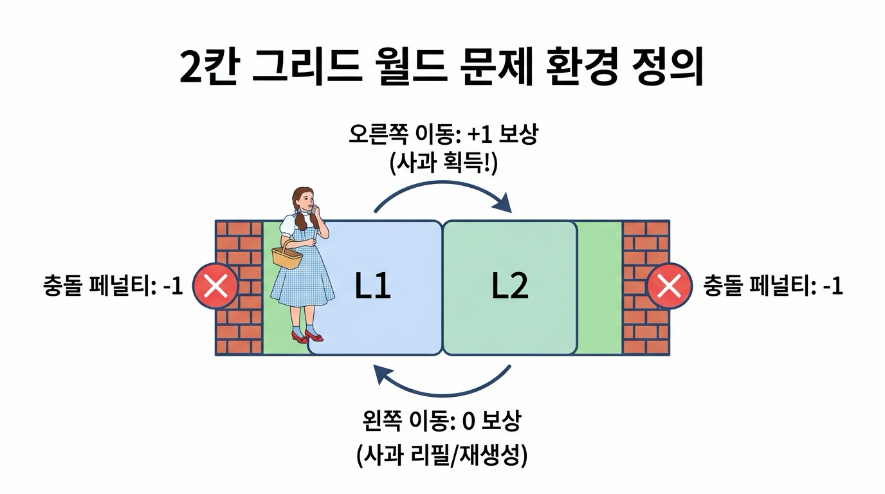
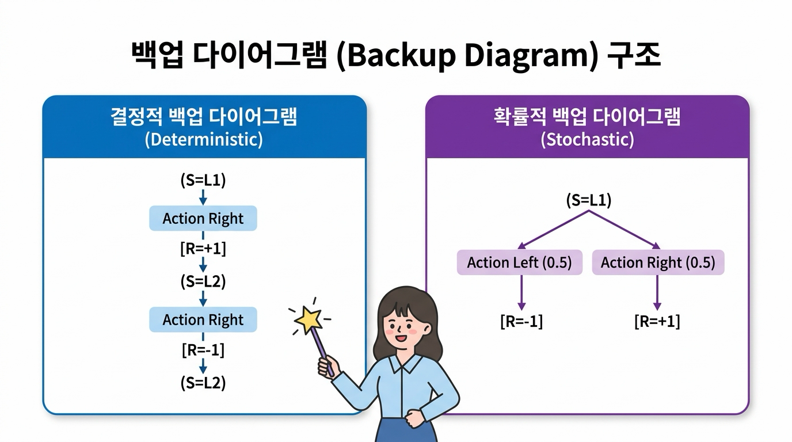
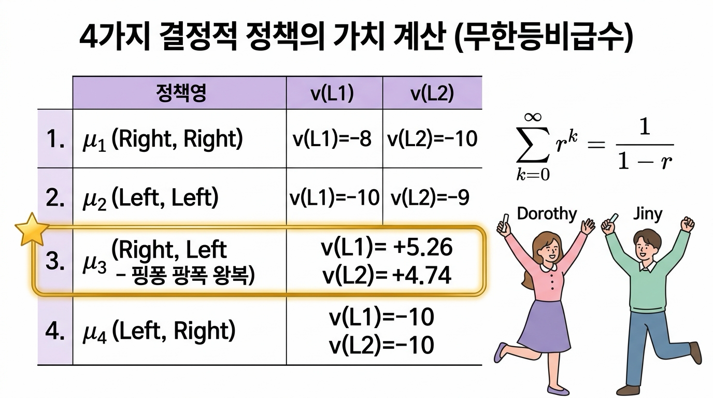

# 05.4 MDP 실전 예제

**그림 05-4-1** 두 칸짜리 격자 타일(L1, L2) 위를 점프하며 타일의 가치를 수치로 풀어보는 도로시와 토토, 그리고 지니


강화학습의 이론을 가장 직관적으로 체감할 수 있는 **2칸 그리드 월드(2-Grid World)** 실전 예제를 다룹니다. 상태 가치 함수의 수식 연산을 손으로 직접 유도해보고, 존재하는 4가지 결정적 정책의 가치를 고교 수학의 **무한등비급수 합 공식**으로 계산하여 최적 정책을 찾는 짜릿한 과정을 지니, 도로시와 함께 경험해 봅시다!

---

### 05.4.1 두 칸짜리 그리드 월드 문제 정의

**그림 05-4-2** 2칸 그리드 월드 문제의 환경 규칙: 상태, 행동, 보상 및 사과 재생성 규칙


오즈의 숲속에 두 개의 마법 타일로 이루어진 작은 징검다리 세상이 있습니다.

#### 환경의 구체적인 규칙
1. **상태 공간 (State Space)**: 에이전트가 위치할 수 있는 칸은 <i>S</i> = {L1, L2} 총 2개입니다. 좌우 끝은 단단한 벽으로 막혀 있습니다.
2. **행동 공간 (Action Space)**: 에이전트는 매 순간 <i>A</i> = {Left, Right} 두 가지 행동 중 하나를 선택할 수 있습니다.
3. **상태 전이 (State Transition)**: 전이는 100% 확실한 **결정적(Deterministic)** 전이입니다.
4. **보상 규칙 (Reward Rules)**:
   * **사과 획득**: 에이전트가 L1에서 오른쪽(Right)으로 이동하여 L2에 도달하면 맛있는 사과를 먹고 **+1**의 보상을 얻습니다.
   * **사과 재생성**: L2에서 왼쪽(Left)으로 이동하여 L1으로 돌아오면 사과가 마법처럼 다시 생성됩니다(이때의 이동 보상은 **0**).
   * **벽 충돌 페널티**: 벽에 부딪히면 쿵 소리와 함께 **-1**의 감점(벌점)을 받으며 제자리에 머뭅니다. (L1에서 Left를 하거나, L2에서 Right를 할 때)
5. **과제 성격**: 끝이 없이 무한히 계속되는 **지속적 과제(Continuous Task)**이며, 할인율은 <i>&gamma;</i> = 0.9로 설정합니다.

---

### 05.4.2 백업 다이어그램 (Backup Diagram)

문제를 풀기 위해 상태, 행동, 보상의 시간적 흐름을 나무 구조로 시각화한 **백업 다이어그램(Backup Diagram)**을 그려봅시다.

**그림 05-4-3** 백업 다이어그램의 두 가지 형태: 결정적 단일 경로 트리 vs 확률적 분기 트리


* **결정적 백업 다이어그램 (Deterministic)**: 에이전트의 정책과 환경 전이가 모두 결정적이면, 시간의 흐름(위에서 아래)에 따라 오직 단 하나의 일직선 경로가 형성됩니다.
* **확률적 백업 다이어그램 (Stochastic)**: 정책이 확률적이거나 상태 전이에 불확실성이 있으면, 여러 가지 갈래로 가지를 치며 넓게 분기합니다.

이번 예제에서는 상태 전이와 정책이 모두 결정적이므로 계산이 매우 직관적이고 깔끔한 단일 경로 다이어그램을 다룹니다.

---

### 05.4.3 4가지 결정적 정책의 가치 계산

이 문제에서 상태는 2개(L1, L2), 각 상태에서 취할 수 있는 행동도 2개(Left, Right)입니다. 따라서 존재할 수 있는 모든 결정적 정책 &mu;(<i>s</i>)의 개수는 총 2<sup>2</sup> = **4가지**뿐입니다!

**그림 05-4-4** 4가지 결정적 정책의 가치 계산표 및 무한등비급수 합 공식을 통한 엄밀한 해석적 해


| 정책 번호 | L1에서의 행동 | L2에서의 행동 | 성격 및 동작 방식 |
| :---: | :---: | :---: | :--- |
| **&mu;<sub>1</sub>** | Right | Right | 오른쪽으로 직진 후 오른쪽 벽에 계속 부딪힘 |
| **&mu;<sub>2</sub>** | Left | Left | 왼쪽 벽에 계속 부딪힘 |
| **&mu;<sub>3</sub>** | Right | Left | **L1과 L2를 계속 왕복(Ping-Pong)하며 사과를 무한 수확!** |
| **&mu;<sub>4</sub>** | Left | Right | L1에서는 왼쪽 벽에, L2에서는 오른쪽 벽에 부딪힘 |

#### 05.4.3.1 무한등비급수 합 공식 복습

무한히 계속되는 지속적 과제에서 할인율 <i>&gamma;</i> = 0.9가 적용된 누적 가치를 구하기 위해 고등학교 수학의 **무한등비급수 합 공식**을 사용합니다.

<div style="background-color: #f8fafc; border-left: 4px solid #3b82f6; padding: 12px 18px; margin: 16px 0; font-family: monospace; font-size: 1.1rem; color: #1e293b; text-align: center; border-radius: 4px;">
&Sigma;<sub><i>k</i>=0</sub><sup>&infin;</sup> <i>r</i><sup><i>k</i></sup> = 1 + <i>r</i> + <i>r</i><sup>2</sup> + <i>r</i><sup>3</sup> + ... = 1 / (1 - <i>r</i>) &emsp; (|<i>r</i>| &lt; 1)
</div>

---

#### 05.4.3.2 정책 &mu;<sub>1</sub> (Right, Right) 가치 계산

* **상태 L1에서 출발**:
  첫 스텝에서 Right를 하여 L2로 가면서 사과(+1)를 얻고, 이후 L2에서 계속 Right를 하여 매번 벽에 충돌(-1)합니다.
  <div style="background-color: #f8fafc; padding: 12px 18px; margin: 10px 0; font-family: monospace; color: #1e293b; text-align: center;">
  <i>v</i><sub>&mu;<sub>1</sub></sub>(L1) = (+1) + 0.9 &middot; (-1) + 0.9<sup>2</sup> &middot; (-1) + 0.9<sup>3</sup> &middot; (-1) + ...<br>
  = 1 - 0.9 &middot; (1 + 0.9 + 0.9<sup>2</sup> + ...)<br>
  = 1 - 0.9 / (1 - 0.9) = 1 - 9 = <b>-8.0</b>
  </div>

* **상태 L2에서 출발**:
  처음부터 계속 오른쪽 벽에 부딪히므로 매 스텝 -1의 페널티를 받습니다.
  <div style="background-color: #f8fafc; padding: 12px 18px; margin: 10px 0; font-family: monospace; color: #1e293b; text-align: center;">
  <i>v</i><sub>&mu;<sub>1</sub></sub>(L2) = (-1) + 0.9 &middot; (-1) + 0.9<sup>2</sup> &middot; (-1) + ...<br>
  = -1 / (1 - 0.9) = <b>-10.0</b>
  </div>

---

#### 05.4.3.3 정책 &mu;<sub>3</sub> (Right, Left) [핑퐁 왕복 정책] 가치 계산

> 👧 **도로시**: "지니야! L1에서는 오른쪽으로 가서 사과(+1)를 먹고, L2에 도착하면 다시 왼쪽으로 와서 사과를 재생성시키는 핑퐁 작전을 쓰면 벽에 한 번도 안 부딪히잖아!"
>
> 🧚 **지니**: "정답이야 도로시! 그 기가 막힌 핑퐁 정책이 바로 &mu;<sub>3</sub>야! 직접 수식으로 가치를 계산해볼까?"

* **상태 L1에서 출발**:
  L1 &rarr;(Right, 보상 +1)&rarr; L2 &rarr;(Left, 보상 0)&rarr; L1 &rarr;(Right, 보상 +1)&rarr; L2 &rarr; ...
  <br>보상 수열은 **+1, 0, +1, 0, +1, 0, ...** 이 짝수 스텝마다 반복됩니다!
  <div style="background-color: #f8fafc; border-left: 4px solid #10b981; padding: 12px 18px; margin: 10px 0; font-family: monospace; color: #065f46; text-align: center;">
  <i>v</i><sub>&mu;<sub>3</sub></sub>(L1) = 1 + 0.9 &middot; (0) + 0.9<sup>2</sup> &middot; (1) + 0.9<sup>3</sup> &middot; (0) + 0.9<sup>4</sup> &middot; (1) + ...<br>
  = 1 + (0.9<sup>2</sup>) + (0.9<sup>2</sup>)<sup>2</sup> + (0.9<sup>2</sup>)<sup>3</sup> + ...<br>
  = 1 + 0.81 + 0.81<sup>2</sup> + 0.81<sup>3</sup> + ...<br>
  = 1 / (1 - 0.81) = 1 / 0.19 &approx; <b>+5.263</b>
  </div>

* **상태 L2에서 출발**:
  L2 &rarr;(Left, 보상 0)&rarr; L1 &rarr;(Right, 보상 +1)&rarr; L2 &rarr;(Left, 보상 0)&rarr; L1 &rarr; ...
  <br>보상 수열은 **0, +1, 0, +1, 0, +1, ...** 입니다.
  <div style="background-color: #f8fafc; border-left: 4px solid #10b981; padding: 12px 18px; margin: 10px 0; font-family: monospace; color: #065f46; text-align: center;">
  <i>v</i><sub>&mu;<sub>3</sub></sub>(L2) = 0 + 0.9 &middot; (1) + 0.9<sup>2</sup> &middot; (0) + 0.9<sup>3</sup> &middot; (1) + ...<br>
  = 0.9 &middot; [1 + 0.81 + 0.81<sup>2</sup> + ...]<br>
  = 0.9 / (1 - 0.81) = 0.9 / 0.19 &approx; <b>+4.737</b>
  </div>

---

### 05.4.4 최적 정책 판정 및 학습 성과

**그림 05-4-5** 최적 정책 &mu;<sub>*</sub>의 완벽한 핑퐁 루프 동작: 벽 충돌 없이 무한한 사과 수확


4가지 모든 정책의 상태 가치를 나란히 비교해 봅시다:

1. **&mu;<sub>1</sub> (Right, Right)**: <i>v</i>(L1) = -8.0, &nbsp; <i>v</i>(L2) = -10.0
2. **&mu;<sub>2</sub> (Left, Left)**: <i>v</i>(L1) = -10.0, &nbsp; <i>v</i>(L2) = -9.0
3. **&mu;<sub>3</sub> (Right, Left)**: <b><i>v</i>(L1) = +5.26, &nbsp; <i>v</i>(L2) = +4.74</b> &nbsp; 👑 (압도적 1위!)
4. **&mu;<sub>4</sub> (Left, Right)**: <i>v</i>(L1) = -10.0, &nbsp; <i>v</i>(L2) = -10.0

> 🐶 **토토**: "멍멍! &mu;<sub>3</sub> 정책은 L1에서도 +5.26으로 제일 크고, L2에서도 +4.74로 제일 커! 모든 상태에서 다른 정책들을 완벽하게 이겼어!"
>
> 🧚 **지니**: "맞아 토토야! 모든 상태 <i>s</i>에 대해 <i>v</i><sub>&mu;<sub>3</sub></sub>(<i>s</i>) &ge; <i>v</i><sub>&mu;</sub>(<i>s</i>)가 성립하므로, **&mu;<sub>3</sub>가 바로 우리가 찾던 유일무이한 최적 정책 &mu;<sub>*</sub>**란다!"

#### 파이썬 시뮬레이션 검증 코드

```python
# 무한등비급수 가치 계산 파이썬 시뮬레이션
gamma = 0.9

# 정책 mu_3 (Right, Left) 시뮬레이션 (100 스텝)
V_L1 = 0
for step in range(100):
    if step % 2 == 0:
        reward = 1.0  # L1 -> L2 (사과 획득)
    else:
        reward = 0.0  # L2 -> L1 (사과 재생성)
    V_L1 += (gamma ** step) * reward

print(f"시뮬레이션 v_mu3(L1): {V_L1:.4f}")
print(f"이론적 수식 해 1/(1-0.81): {1.0 / (1.0 - 0.81):.4f}")
```

실행 결과:
```
시뮬레이션 v_mu3(L1): 5.2632
이론적 수식 해 1/(1-0.81): 5.2632
```

---

### 05.4.5 핵심 요약

1. **2칸 그리드 월드 환경**: 상태 2개, 행동 2개로 구성되어 총 4개의 결정적 정책 후보가 존재합니다.
2. **백업 다이어그램**: 행동 선택에 따른 상태 전이와 보상 수령의 시간 흐름을 시각적으로 나타냅니다.
3. **무한등비급수 합 공식**: 주기적으로 반복되는 보상 패턴을 &Sigma; <i>r<sup>k</sup></i> = 1 / (1 - <i>r</i>) 공식을 통해 정밀한 수치로 유도할 수 있습니다.
4. **최적 정책 &mu;<sub>*</sub> 검증**: L1에서 오른쪽, L2에서 왼쪽을 선택하는 핑퐁 정책 &mu;<sub>3</sub>가 모든 상태에서 가장 높은 양수 가치(+5.26, +4.74)를 기록하며 최적 정책임을 수학적으로 증명했습니다.

다음 **05.5절**에서는 5장 마르코프 결정 과정 전체를 총정리하고, 다음 장인 6장 벨만 방정식으로 이어지는 관문을 활짝 열어보겠습니다!
