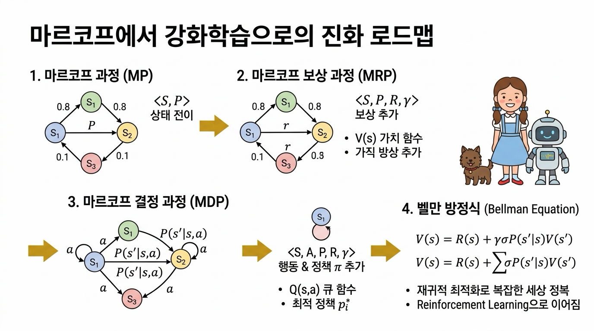

# 05.5 마르코프 결정 과정(MDP) 총정리

**그림 05-5-1** 2칸 그리드 월드에서 최적 정책을 완벽하게 찾아내어 황금 트로피를 높이 든 도로시와 6장 벨만 방정식 마법서를 펼쳐주는 지니

마르코프 결정 과정(MDP)의 핵심 이론과 수작업 연산을 총망라하여 정리합니다. 의사결정의 주체인 에이전트와 환경이 만들어내는 확률적 역학을 이해한 도로시가 다음 단계인 **'벨만 방정식(Bellman Equation)'**이라는 강력한 마법 도구를 향해 도약하는 징검다리를 놓아봅시다!

---

  

    🎧
    대화 음성 듣기 (도로시, 토토 & 지니)
  

  

    <button type="button" class="btn-audio-play" style="background: #0284c7; color: #ffffff; border: none; border-radius: 16px; padding: 5px 13px; font-size: 0.82rem; font-weight: 600; cursor: pointer; display: inline-flex; align-items: center; gap: 4px; box-shadow: 0 1px 2px rgba(2,132,199,0.3);">
      ▶️ 재생
    </button>
    <button type="button" class="btn-audio-stop" style="background: #e2e8f0; color: #475569; border: none; border-radius: 16px; padding: 5px 11px; font-size: 0.82rem; font-weight: 600; cursor: pointer; display: inline-flex; align-items: center; gap: 4px;">
      ⏹️ 정지
    </button>
  

  <audio src="./audio/dialogue_5_5_scene1.mp3" preload="none"></audio>

> 👧 **도로시**: "지니야! 우리가 상태, 행동, 전이 확률, 보상 함수, 그리고 할인율까지 5대 튜플을 모두 정복하고, 2칸 그리드 월드에서 손으로 직접 무한등비급수를 계산해서 최적 정책까지 찾아냈어!"
>
> 🐶 **토토**: "멍멍! 나도 이제 벽에 쾅 부딪히지 않고 사과를 무한히 따먹는 핑퐁 왕복 전략을 완벽하게 이해했다고! 멍멍!"
>
> 🧚 **지니**: "둘 다 정말 대견해! 단순히 관찰만 하던 마르코프 과정에 주체적인 '행동'과 '보상'을 결합해, 스스로 최선의 길을 선택하는 강화학습의 위대한 수학적 뼈대인 MDP를 완벽하게 마스터한 거란다!"

 

### 05.5.1 5장 단원 핵심 종합 요약

이번 5장에서는 강화학습의 수학적 뼈대인 **마르코프 결정 과정(Markov Decision Process, MDP)**을 구축하고, 실전 문제에서 최적 정책을 도출하는 전 과정을 배웠습니다.

**그림 05-5-2** 마르코프 과정(MP)에서 보상(MRP)과 행동(MDP)을 거쳐 벨만 방정식으로 진화하는 강화학습 발전 로드맵

#### 1. MDP의 5대 핵심 튜플 &lang;<i>S</i>, <i>A</i>, <i>P</i>, <i>R</i>, <i>&gamma;</i>&rang;
* **상태 집합 (<i>S</i>)**: 에이전트가 탐험하는 환경의 모든 상황들의 모임
* **행동 집합 (<i>A</i>)**: 에이전트가 특정 상태에서 취할 수 있는 모든 선택지의 모임
* **상태 전이 확률 (<i>P</i>)**: 현재 상태 <i>s</i>에서 행동 <i>a</i>를 수행했을 때 다음 상태 <i>s'</i>로 갈 확률 <i>p</i>(<i>s'</i> | <i>s</i>, <i>a</i>)
* **보상 함수 (<i>R</i>)**: 전이의 결과로 환경이 부여하는 피드백 신호 <i>r</i>(<i>s</i>, <i>a</i>, <i>s'</i>)
* **할인율 (<i>&gamma;</i>)**: 0 &le; <i>&gamma;</i> &lt; 1 범위에서 미래 보상의 시간적 가치를 감쇄시키는 상수

#### 2. 에이전트의 지능: 정책 (Policy)
* **결정적 정책**: <i>a</i> = &mu;(<i>s</i>) (상태 <i>s</i>에서 100% 확정 행동 선택)
* **확률적 정책**: &pi;(<i>a</i> | <i>s</i>) = Pr(<i>At</i> = <i>a</i> | <i>St</i> = <i>s</i>) (행동들에 대한 확률 분포)

#### 3. 수익과 가치 평가 (Value Function)
* **할인 누적 수익 <i>Gt</i>**: 미래에 받을 모든 보상들의 할인 총합 <i>Gt</i> = &Sigma;<i>k</i>=0&infin; <i>&gamma;k</i> <i>Rt+k</i>
* **상태 가치 함수 <i>v&pi;</i>(<i>s</i>)**: 상태 <i>s</i>에서 정책 <i>&pi;</i>를 따를 때 기대되는 평균 수익 <i>v&pi;</i>(<i>s</i>) = &Eopf;<i>&pi;</i>[<i>Gt</i> | <i>St</i> = <i>s</i>]

#### 4. 최적 정책과 2칸 그리드 월드 검증
* **최적 정책 <i>&pi;</i>***: 모든 상태 <i>s</i>에서 <i>v</i>*(<i>s</i>) &ge; <i>v&pi;</i>(<i>s</i>)를 달성하는 최우수 정책
* **무한등비급수 연산**: 2칸 그리드 월드에서 4가지 결정적 정책의 가치를 직접 계산하여, 벽 충돌 없이 사과를 무한 재생성하며 수확하는 핑퐁 왕복 정책 &mu;3가 가치 +5.26, +4.74로 최적임을 증명했습니다.

---

### 05.5.2 다음 단계: 왜 6장 '벨만 방정식'이 필요한가?

  

    🎧
    대화 음성 듣기 (도로시 & 지니)
  

  

    <button type="button" class="btn-audio-play" style="background: #0284c7; color: #ffffff; border: none; border-radius: 16px; padding: 5px 13px; font-size: 0.82rem; font-weight: 600; cursor: pointer; display: inline-flex; align-items: center; gap: 4px; box-shadow: 0 1px 2px rgba(2,132,199,0.3);">
      ▶️ 재생
    </button>
    <button type="button" class="btn-audio-stop" style="background: #e2e8f0; color: #475569; border: none; border-radius: 16px; padding: 5px 11px; font-size: 0.82rem; font-weight: 600; cursor: pointer; display: inline-flex; align-items: center; gap: 4px;">
      ⏹️ 정지
    </button>
  

  <audio src="./audio/dialogue_5_5_scene2.mp3" preload="none"></audio>

> 👧 **도로시**: "지니야! 2칸짜리 문제에서는 정책이 4개뿐이라서 손으로 무한등비급수를 하나하나 다 계산할 수 있었잖아? 그런데 바둑판처럼 칸이 수백 개거나 체스처럼 복잡한 세상에서는 정책이 수억 개가 넘을 텐데, 그걸 다 일일이 나열해서 비교할 수는 없잖아?"
>
> 🧚 **지니**: "정말 놀라운 통찰이야 도로시! 이번 장에서 쓴 전수조사(Brute-force) 방식은 격자가 2개인 아기 세상에서만 통하는 특별한 방법이야. 복잡한 미로, 자율주행차, 알파고 같은 거대한 세계를 정복하기 위해서는 **'현재 상태의 가치와 다음 상태의 가치 사이의 아름다운 재귀적 관계식'**이 필요한데, 그것이 바로 다음 장에서 배울 **벨만 방정식(Bellman Equation)**이란다!"

다음 **06장 벨만 방정식**에서는:
1. 복잡한 무한등비급수 합을 단 한 줄의 깔끔한 재귀식(Recursion)으로 압축하는 마법을 배웁니다.
2. 상태 가치 함수 <i>v</i>(<i>s</i>)뿐 아니라, 행동의 가치를 직접 평가하는 **행동 가치 함수 <i>q</i>(<i>s</i>, <i>a</i>)**의 세계를 탐험합니다.
3. 컴퓨터가 스스로 최적의 정책을 찾아내는 동적 프로그래밍(DP)의 위대한 문을 열게 됩니다!
