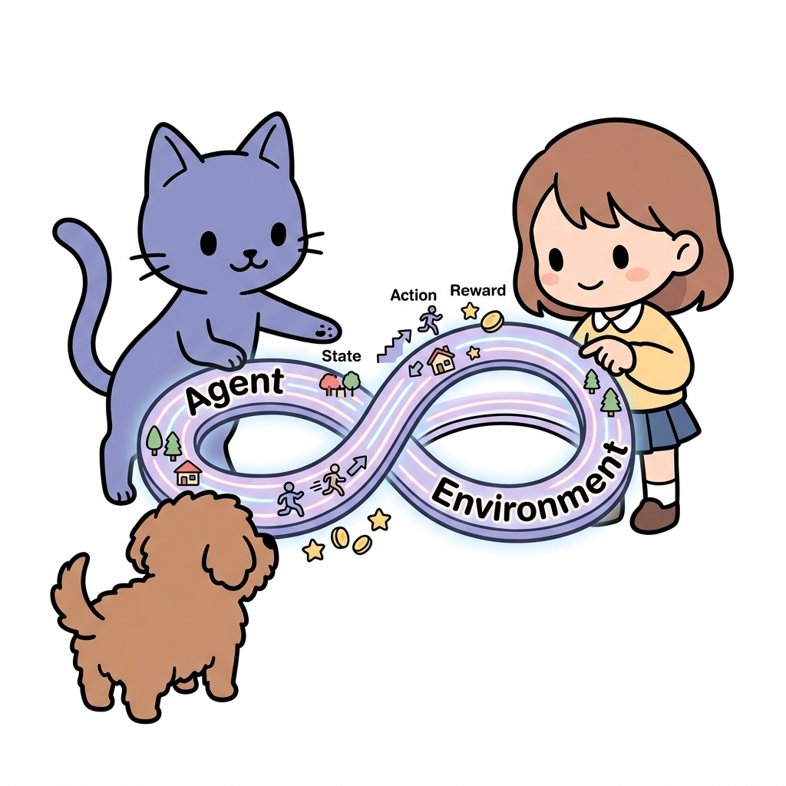
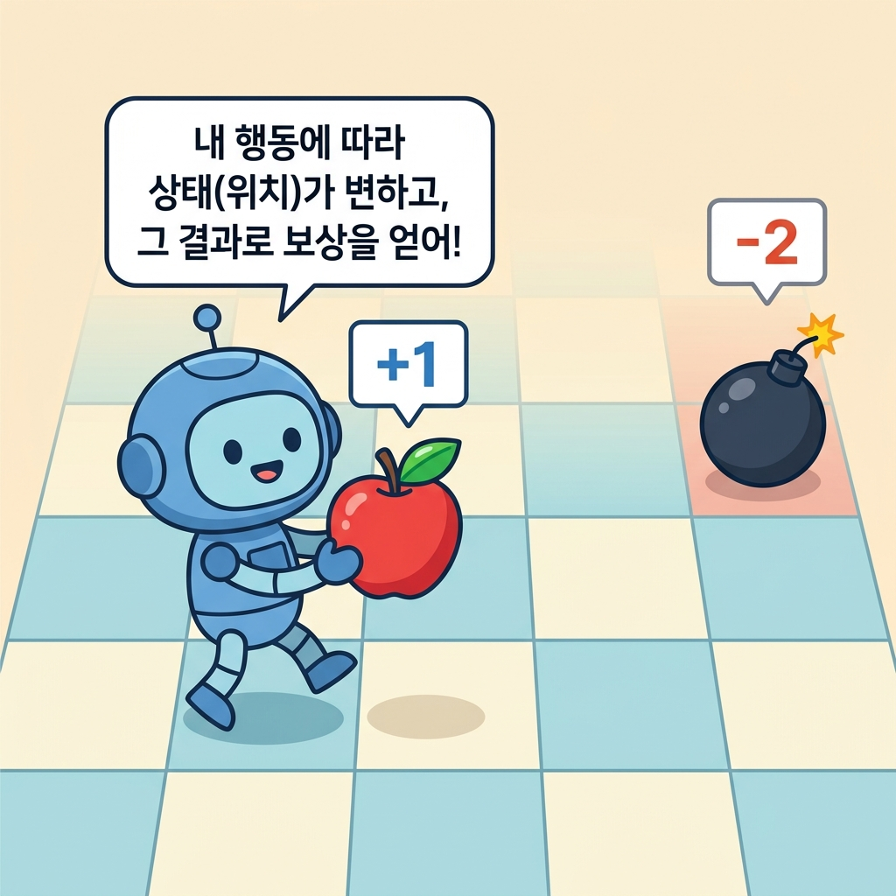

# 5강 마르코프 결정 과정

**그림 05-0** 에이전트(Agent, 도로시)의 행동이 어떻게 환경(Environment)의 상태 변화와 보상을 가져오는지 순환 궤도로 설명하는 지니

마르코프 결정 과정(MDP)은 **"에이전트가 행동을 취하면, 환경이 그에 반응하여 다음 상태와 즉각적인 보상을 돌려주는 끊임없는 상호작용"**을 정밀하게 다룹니다. 지니가 설계해준 에이전트와 환경의 아름다운 뫼비우스 순환 궤도 위에서, 어떻게 우리가 최적의 결정을 내려갈 수 있을지 5강의 MDP 이론을 탄탄하게 다져봅시다!

---

우리가 3강에서 다루었던 **밴디트 문제**에서는 에이전트가 어떤 행동을 하든 다음에 마주할 슬롯머신의 상태(승률 분포)를 바꿀 수 없었습니다. 에이전트는 고정된 상태 속에서 단순히 어떤 기계가 가장 대박인지 시행착오를 겪으며 찾아낼 뿐이었죠.

하지만 현실의 강화 학습 문제들은 다릅니다. 바둑을 두면 바둑판 위의 바둑돌 배치(상태)가 바뀌고, 자율주행 차량이 운전대를 조작하면 차량의 물리적인 좌표(상태)가 바뀝니다. 즉, **"에이전트의 행동에 반응하여 환경의 다음 상태가 시시각각 변화한다"**는 점이 현실적인 강화 학습의 중요한 본질입니다.

이번 5강에서는 에이전트의 행동이 환경을 동적으로 변화시키는 상호작용 메커니즘을 수학적으로 완벽하게 모델링할 수 있는 강화 학습의 근본적인 뼈대, **마르코프 결정 과정(Markov Decision Process, MDP)**의 원리를 학습합니다.

---

## 직관적으로 이해하는 MDP

우리가 조종하는 귀여운 파란색 꼬마 로봇(에이전트)이 바둑판 모양의 격자판 위를 탐험하고 있다고 상상해 봅시다. 이 가상 공간을 **그리드 월드(Grid World)**라고 부릅니다.

에이전트가 상하좌우로 이동하는 행동을 취할 때마다 로봇이 위치한 그리드 상태가 변하게 됩니다. 
- 한 칸 이동할 때마다 맛있는 사과(+1)를 즉시 먹어 보상을 획득할 수도 있고, 
- 무시무시한 폭탄(-2)에 걸려 큰 손실을 입을 수도 있습니다.

여기서 가장 중요한 핵심은 **"눈앞의 즉각적인 보상만 좇다가는 장기적으로 큰 낭패를 볼 수 있다"**는 점입니다. 멀리 떨어져 있는 황금 사과 더미(+6)를 안전하게 먹기 위해, 당장의 폭탄 경로를 현명하게 우회하거나 장기적인 기대 수익 총합을 예측하는 똑똑한 안목이 필요합니다. 이러한 모든 설계의 수학적 밑바탕이 바로 MDP입니다.

---

## 학습 목표

이 단원을 충실히 공부하고 나면 아래 네 가지 중요한 강화 학습 질문에 명확하게 답할 수 있습니다!

1. **상태 전이 확률(State Transition Probability)**을 도입하여 상태 변화가 '결정적'인 경우와 '확률적'인 상황을 어떻게 수식으로 정의하는지 비교 설명할 수 있다.
2. 과거의 모든 경로 기록을 다 외우지 않고 오직 '현재 상태'만 관찰하며 의사결정을 내려도 충분하다는 **마르코프 성질(Markov Property)**의 본질적 의미와 장점을 이해한다.
3. 미래에 얻을 보상을 현재 가치로 차감해서 계산하는 **할인율(Discount Rate, γ)**의 개념과 필요성을 설명할 수 있다.
4. **상태 가치 함수(State-Value Function)**와 기대 수익의 의미를 파악하고, 모든 다른 정책보다 일관되게 높은 가치를 보장하는 **최적 정책(Optimal Policy)**의 정의를 증명한다.

---

## 학습 목차

- [05.1 마르코프 결정 과정(MDP)이란?](./5_1_마르코프_결정_과정_MDP_이란/index.md)
  - 그리드 월드 문제의 개념과 로봇의 위치가 변하는 과정을 살펴보고, 에이전트와 환경이 타임 스텝 단위로 주고받는 상호작용 피드백 루프를 학습합니다.
- [05.2 환경과 에이전트를 수식으로](./5_2_환경과_에이전트를_수식으로/index.md)
  - 상태 전이 함수 *p*(*s'* | *s*, *a*), 보상 함수 *r*(*s*, *a*, *s'*), 그리고 행동을 정하는 정책 π(*a* | *s*)를 수학 기호로 정교하게 정의하고 마르코프 가설을 분석합니다.
- [05.3 MDP의 목표](./5_3_MDP의_목표/index.md)
  - 끝이 있는 일회성 과제(에피소드)와 무한히 지속되는 과제의 차이를 이해하고, 할인율을 적용해 장기 누적 기대 수익을 극대화하는 상태 가치 함수에 대해 배웁니다.
- [05.4 MDP 예제](./5_4_MDP_예제/index.md)
  - 2칸짜리 초소형 그리드 월드 문제의 백업 다이어그램을 손으로 직접 그리고, 4가지 정책 패턴의 가치 함수를 무한등비급수 공식으로 계산하여 최적 정책을 실제로 구출해 봅니다.
- [05.5 정리](./5_5_정리/index.md)
  - 5강에서 습득한 MDP 수식 체계의 의의를 종합적으로 검토하고, 강화 학습의 알파이자 오메가인 벨만 방정식으로 나아가기 위해 핵심을 정리합니다.

---

## 학습 정리

1. **상태 전이와 보상 함수**: MDP 환경은 현재 상태 *s*와 행동 *a*가 주어졌을 때 다음 상태 *s'*로 이동할 조건부 확률 *p*(*s'* | *s*, *a*)와 이 과정에서 얻어지는 기대 보상 수식 *r*(*s*, *a*, *s'*)로 완벽히 묘사됩니다.
2. **마르코프 성질**: "미래 상태는 이전 히스토리와 상관없이 오직 현재 상태에 의해서만 결정된다"는 성질입니다. 이 덕분에 에이전트는 불필요한 과거 기억 장부를 들고 다닐 필요 없이 실시간 상태 정보만을 사용해 계산 효율성을 얻을 수 있습니다.
3. **할인율(γ)**: 먼 미래의 가치를 현재 시점으로 줄여서 환산하기 위한 실수 상수(0 ≤ γ < 1)입니다. 무한 루프에서 수익이 발산하는 것을 막아주며 합리적인 시간 선호도를 제어합니다.
4. **최적 가치 함수와 최적 정책**: 상태 공간 of 모든 상태에서 가치 함수 *v*π(*s*)가 다른 어떤 정책보다 크거나 같도록 보증하는 행동 정책이 최적 정책 π*이며, 그때 학습되는 이상적인 Q-장부가 최적 상태 가치 함수 *v**(*s*)입니다.
