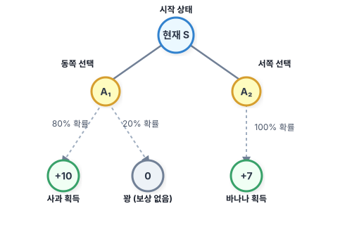

# 06.1 벨만 소개와 사전 학습

**그림 06-1** 요술 액자 속 역사적인 대수학자 리처드 벨만 교수의 모습을 경외스럽게 올려다보는 지니와 도로시

5강에서 배웠던 마르코프 결정 과정(MDP) 문제를 해소하기 위해 실질적인 열쇠 역할을 할 **벨만 방정식(Bellman Equation)**의 역사적 탄생 배경과 기초 개념을 학습합니다. 동적 계획법의 대부 리처드 벨만 교수의 이야기를 지니와 도로시의 대화로 기분 좋게 풀어봅시다!

---

우리가 5강에서 배웠던 **마르코프 결정 과정(MDP)**은 강화 학습 환경에서 에이전트가 어떻게 상태를 바꾸고 보상을 얻는지 규정하는 뼈대였습니다. 그리고 이번 6강에서 배울 **벨만 방정식(Bellman Equation)**은 그 MDP 문제를 실제로 풀기 위해 사용되는 핵심 도구입니다.

벨만 방정식을 본격적으로 유도하고 수학 문제를 풀기 전에, 이 공식의 주인공인 **리처드 벨만**이 어떤 사람인지, 그리고 이 수식을 이해하기 위해 꼭 복습해야 하는 **기댓값 계산법**을 친절하게 알아봅시다!

---

### 06.1.1 역사 속의 리처드 벨만과 '동적 계획법'의 탄생

벨만 방정식의 **벨만(Bellman)**은 미국의 저명한 수학자인 **리처드 벨만**Richard Bellman, 1920~1984의 이름에서 유래되었습니다. 그는 컴퓨터 과학과 최적 제어 이론의 선구자 중 한 명입니다.

그가 활약하던 1950년대 미국 국방부와 RAND 연구소에는 재미있는 일화가 전해집니다. 당시 국방부 장관이었던 찰스 윌슨은 '학술 연구'나 '수학'이라는 단어를 매우 싫어하여, 이와 관련된 예산을 삭감하기로 유명했습니다.

당시 연구원이었던 벨만은 자신의 수학적 최적화 연구 과제를 정부의 간섭으로부터 보호하고 예산을 지켜내기 위해 아주 기발한 이름을 짓기로 결심했습니다. 
- **Dynamic (동적)**: 이 단어는 당시 정치인들이나 대중들에게 '활기차고, 끊임없이 변화하며, 긍정적인' 느낌을 주는 단어였습니다. 누구도 '동적인 것'에 반대할 수는 없었죠!
- **Programming (계획법)**: 컴퓨터 프로그래밍이 널리 쓰이기 전이었던 당시에 이 단어는 군수 물자의 '물류 배정 계획'이나 '스케줄링'을 뜻하는 단어였습니다.

벨만은 이 두 단어를 합쳐 **'동적 계획법(Dynamic Programming, DP)'**이라는 거창하고 멋진 명칭을 고안해 냈고, 장관의 눈을 피해 자신의 최적화 연구 예산을 안전하게 지켜낼 수 있었습니다. 

벨만은 이 동적 계획법의 핵심 정리로 **'벨만 방정식'**을 발표하였으며, 이는 현대 강화 학습 알고리즘의 가장 중요한 뿌리가 되었습니다.

---

### 06.1.2 벨만의 최적성 원리 (Principle of Optimality)

리처드 벨만이 제시한 가장 직관적이고도 강력한 생각은 바로 **최적성의 원리(Principle of Optimality)**입니다.

> **벨만 최적성의 원리**: 
> "어떤 상태에서 출발하든, 최적 경로 상의 그 이후의 의사결정들 역시 이전의 결정이 만들어낸 결과 상태에 대해 항상 최적 정책이어야 한다."

이 어려운 문장을 도로시와 토토의 여행 예시로 아주 쉽게 바꾸어 이해해 봅시다:
- **서울에서 부산으로 가는 가장 빠른 최적 경로**가 `[서울 -> 대전 -> 대구 -> 부산]`이라고 가정해 봅시다.
- 그렇다면, 서울에서 대전을 지나 이미 대구에 도착한 상태라면, **대구에서 부산으로 가는 남은 최적 경로**는 반드시 `[대구 -> 부산]`이어야 합니다. 갑자기 광주로 돌아가서 갈 수는 없으니까요!

이 지극히 당연해 보이는 원리 덕분에, 우리는 **"미래 전체를 한꺼번에 계획하는 복잡한 문제"**를 **"현재 서 있는 단계에서 다음 단계로 넘어가는 단 한 단계의 의사결정 문제"**로 잘게 쪼개어 해결할 수 있게 됩니다. 

이것이 벨만 방정식이 가진 마법의 열쇠입니다.

---

### 06.1.3 사전 학습: 불확실성 속에서의 의사결정과 기댓값

우리가 풀게 될 강화 학습 세계(MDP)는 바람이 불어 미끄러지거나 모터가 삐끗하는 등의 **확률적인 불확실성**이 늘 존재합니다. 따라서 에이전트는 행동을 결정할 때 단순히 눈앞의 숫자 하나만 보는 것이 아니라, 평균적으로 얻게 될 **기댓값(Expectation)**을 계산해 보아야 합니다.

도로시가 직면한 간단한 예시 문제를 통해 기댓값을 복습해 봅시다:

> **도로시의 선택**:
> 현재 상태 *S*에서 도로시가 취할 수 있는 행동은 동쪽으로 가기(*A*₁)와 서쪽으로 가기(*A*₂) 두 가지입니다.
>
> - **동쪽(*A*₁)으로 가면**: 80% 확률로 대박 사과(+10 보상)를 얻고, 20% 확률로 꽝(0 보상)을 얻습니다.
> - **서쪽(*A*₂)으로 가면**: 100% 확률로 확실한 바나나(+7 보상)를 얻습니다.

도로시는 평균적으로 어떤 행동을 취하는 것이 장기적으로 유리할까요? 두 행동의 기대 보상(기댓값)을 계산해 봅시다!

#### 1. 동쪽(*A*₁) 행동의 기대 보상 기댓값
$$
\mathbb{E}[R \mid S, A_1] = (10 \times 0.8) + (0 \times 0.2) = 8 + 0 = 8
$$

#### 2. 서쪽(*A*₂) 행동의 기대 보상 기댓값
$$
\mathbb{E}[R \mid S, A_2] = 7 \times 1.0 = 7
$$

#### 3. 결론
도로시의 동쪽 선택 기댓값(8)이 서쪽 선택 기댓값(7)보다 크므로, 확률적인 위험이 있더라도 **동쪽으로 가는 행동(*A*₁)을 선택하는 것이 합리적인 결정**입니다.

벨만 방정식은 이처럼 **"현재 상태의 가치를 다음 타임 스텝에서 얻을 수 있는 상태들의 가치 기댓값들의 합산"**으로 구성하는 방정식입니다. 이제 기댓값의 개념을 든든하게 복습했으니, 벨만 방정식이 어떻게 멋진 수식으로 유도되는지 다음 6.2절로 넘어가 확인해 봅시다!
