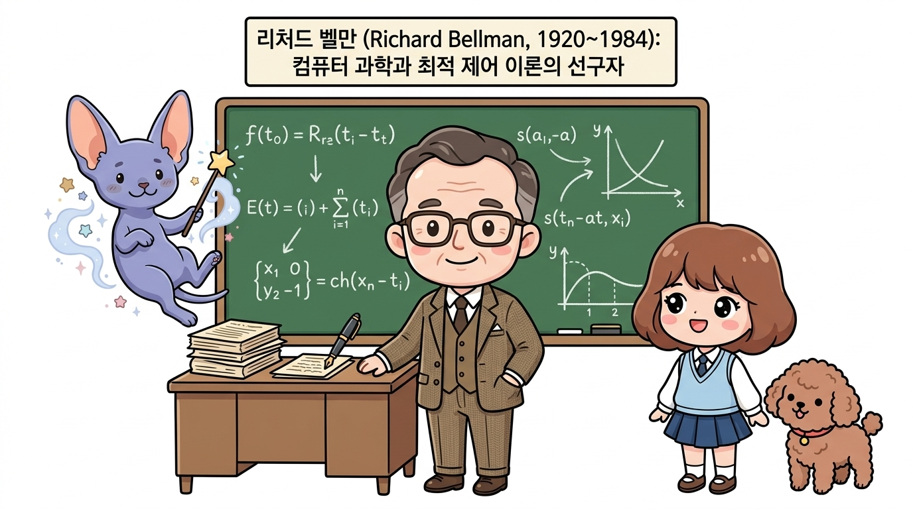
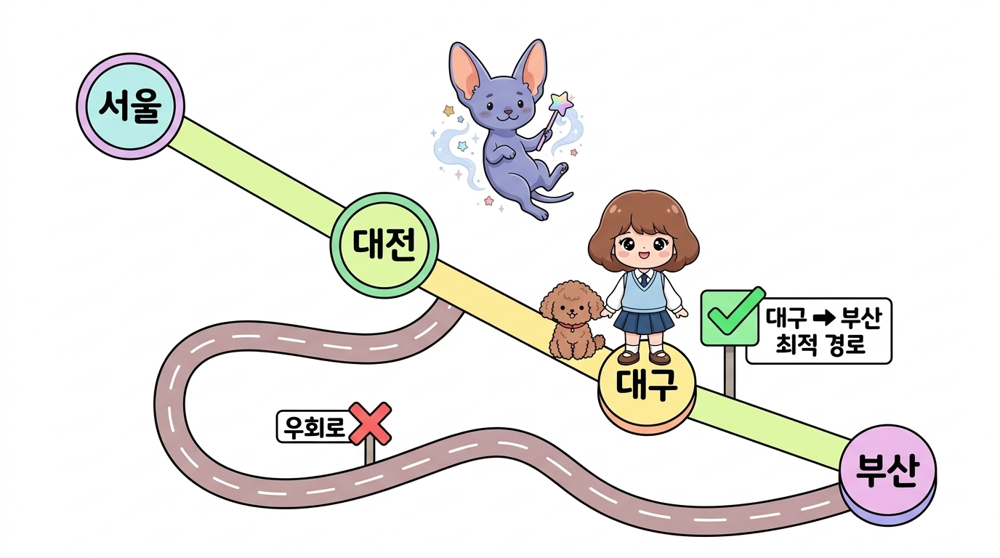
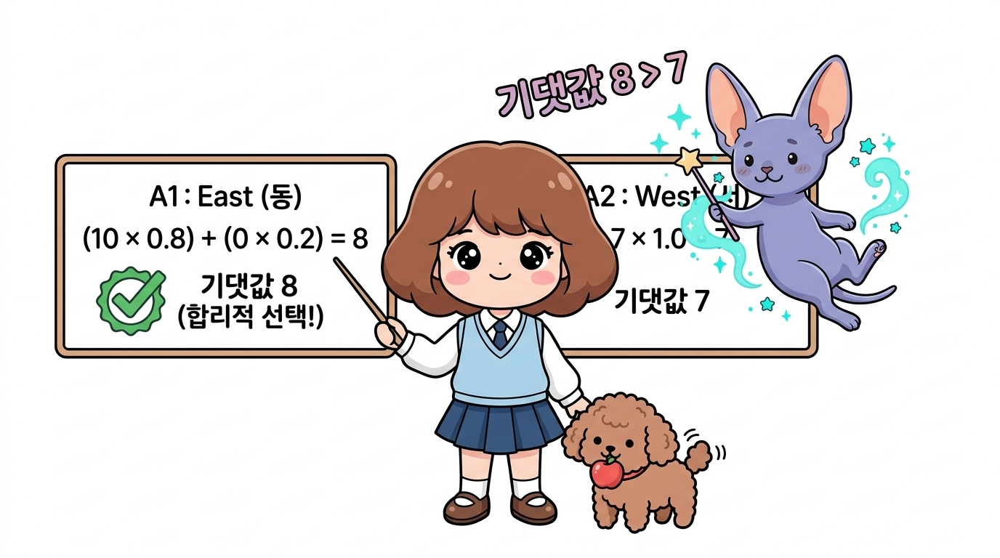

# 06.1 벨만 소개와 사전 학습

**그림 06-1** 요술 액자 속 역사적인 대수학자 리처드 벨만 교수의 모습을 경외스럽게 올려다보는 지니와 도로시

  

    🎧
    대화 음성 듣기 (도로시 & 지니)
  

  

    <button type="button" class="btn-audio-play" style="background: #0284c7; color: #ffffff; border: none; border-radius: 16px; padding: 5px 13px; font-size: 0.82rem; font-weight: 600; cursor: pointer; display: inline-flex; align-items: center; gap: 4px; box-shadow: 0 1px 2px rgba(2,132,199,0.3);">
      ▶️ 재생
    </button>
    <button type="button" class="btn-audio-stop" style="background: #e2e8f0; color: #475569; border: none; border-radius: 16px; padding: 5px 11px; font-size: 0.82rem; font-weight: 600; cursor: pointer; display: inline-flex; align-items: center; gap: 4px;">
      ⏹️ 정지
    </button>
  

  <audio src="./audio/dialogue_6_1_scene1.mp3" preload="none"></audio>

> 👧 **도로시**: "지니! 요술 액자 속에 계신 멋진 신사분은 누구셔? 되게 지혜로워 보이셔!"
> 
> 🐱 **지니**: "저분이 바로 20세기 컴퓨터 과학과 수학의 거장이자, 강화학습의 든든한 뼈대인 '동적 계획법'과 '벨만 방정식'을 창시하신 리처드 벨만 교수님이란다!"

5강에서 배웠던 마르코프 결정 과정(MDP) 문제를 해소하기 위해 실질적인 열쇠 역할을 할 **벨만 방정식(Bellman Equation)**의 역사적 탄생 배경과 기초 개념을 학습합니다. 동적 계획법의 대부 리처드 벨만 교수의 이야기를 지니와 도로시의 대화로 기분 좋게 풀어봅시다!

---

#### MDP의 풀이

우리가 5강에서 배웠던 **마르코프 결정 과정(MDP)**은 강화 학습 환경에서 에이전트가 어떻게 상태를 바꾸고 보상을 얻는지 규정하는 뼈대였습니다. 그리고 이번 6강에서 배울 **벨만 방정식(Bellman Equation)**은 그 MDP 문제를 실제로 풀기 위해 사용되는 핵심 도구입니다.

  

    🎧
    대화 음성 듣기 (도로시 & 지니)
  

  

    <button type="button" class="btn-audio-play" style="background: #0284c7; color: #ffffff; border: none; border-radius: 16px; padding: 5px 13px; font-size: 0.82rem; font-weight: 600; cursor: pointer; display: inline-flex; align-items: center; gap: 4px; box-shadow: 0 1px 2px rgba(2,132,199,0.3);">
      ▶️ 재생
    </button>
    <button type="button" class="btn-audio-stop" style="background: #e2e8f0; color: #475569; border: none; border-radius: 16px; padding: 5px 11px; font-size: 0.82rem; font-weight: 600; cursor: pointer; display: inline-flex; align-items: center; gap: 4px;">
      ⏹️ 정지
    </button>
  

  <audio src="./audio/dialogue_6_1_scene2.mp3" preload="none"></audio>

> 👧 **도로시**: "우리가 5장에서 배운 마르코프 결정 과정(MDP)을 풀려면 왜 벨만 방정식이 꼭 필요해?"
> 
> 🐱 **지니**: "MDP가 '세상의 규칙과 지도'라면, 벨만 방정식은 그 세상에서 가장 많은 보물을 얻을 수 있는 '최적의 길을 찾아내는 만능 열쇠'이기 때문이란다!"

---

벨만 방정식을 본격적으로 유도하고 수학 문제를 풀기 전에, 이 공식의 주인공인 **리처드 벨만**이 어떤 사람인지, 그리고 이 수식을 이해하기 위해 꼭 복습해야 하는 **기댓값 계산법**을 친절하게 알아봅시다!

  

    🎧
    대화 음성 듣기 (도로시 & 지니)
  

  

    <button type="button" class="btn-audio-play" style="background: #0284c7; color: #ffffff; border: none; border-radius: 16px; padding: 5px 13px; font-size: 0.82rem; font-weight: 600; cursor: pointer; display: inline-flex; align-items: center; gap: 4px; box-shadow: 0 1px 2px rgba(2,132,199,0.3);">
      ▶️ 재생
    </button>
    <button type="button" class="btn-audio-stop" style="background: #e2e8f0; color: #475569; border: none; border-radius: 16px; padding: 5px 11px; font-size: 0.82rem; font-weight: 600; cursor: pointer; display: inline-flex; align-items: center; gap: 4px;">
      ⏹️ 정지
    </button>
  

  <audio src="./audio/dialogue_6_1_scene3.mp3" preload="none"></audio>

> 👧 **도로시**: "벨만 방정식을 본격적으로 배우기 전에 우리가 꼭 짚고 넘어가야 할 보물 지도가 있구나!"
> 
> 🐱 **지니**: "그렇단다! 벨만 교수의 흥미진진한 이야기와 함께 '최적성의 원리', 그리고 '기댓값 계산법'이라는 세 가지 발판만 다지면 누구나 쉽게 정복할 수 있어!"

---

### 06.1.1 역사 속의 리처드 벨만과 '동적 계획법'의 탄생

벨만 방정식의 **벨만(Bellman)**은 미국의 저명한 수학자인 **리처드 벨만**Richard Bellman, 1920~1984의 이름에서 유래되었습니다. 

그는 컴퓨터 과학과 최적 제어 이론의 선구자 중 한 명입니다.

  

    🎧
    대화 음성 듣기 (도로시 & 지니)
  

  

    <button type="button" class="btn-audio-play" style="background: #0284c7; color: #ffffff; border: none; border-radius: 16px; padding: 5px 13px; font-size: 0.82rem; font-weight: 600; cursor: pointer; display: inline-flex; align-items: center; gap: 4px; box-shadow: 0 1px 2px rgba(2,132,199,0.3);">
      ▶️ 재생
    </button>
    <button type="button" class="btn-audio-stop" style="background: #e2e8f0; color: #475569; border: none; border-radius: 16px; padding: 5px 11px; font-size: 0.82rem; font-weight: 600; cursor: pointer; display: inline-flex; align-items: center; gap: 4px;">
      ⏹️ 정지
    </button>
  

  <audio src="./audio/dialogue_6_1_scene4.mp3" preload="none"></audio>

> 👧 **도로시**: "리처드 벨만 교수님은 어떤 분야에서 활약하셨던 분이야?"
> 
> 🐱 **지니**: "컴퓨터 과학뿐만 아니라 최적 제어 이론, 응용 수학 등 수많은 분야에서 오늘날 인공지능의 토대가 된 위대한 이론들을 개척하신 선구자이시지!"

---

그가 활약하던 1950년대 미국 국방부와 RAND 연구소에는 재미있는 일화가 전해집니다. 당시 국방부 장관이었던 찰스 윌슨은 '학술 연구'나 '수학'이라는 단어를 매우 싫어하여, 이와 관련된 예산을 삭감하기로 유명했습니다.

  

    🎧
    대화 음성 듣기 (도로시 & 지니)
  

  

    <button type="button" class="btn-audio-play" style="background: #0284c7; color: #ffffff; border: none; border-radius: 16px; padding: 5px 13px; font-size: 0.82rem; font-weight: 600; cursor: pointer; display: inline-flex; align-items: center; gap: 4px; box-shadow: 0 1px 2px rgba(2,132,199,0.3);">
      ▶️ 재생
    </button>
    <button type="button" class="btn-audio-stop" style="background: #e2e8f0; color: #475569; border: none; border-radius: 16px; padding: 5px 11px; font-size: 0.82rem; font-weight: 600; cursor: pointer; display: inline-flex; align-items: center; gap: 4px;">
      ⏹️ 정지
    </button>
  

  <audio src="./audio/dialogue_6_1_scene5.mp3" preload="none"></audio>

> 👧 **도로시**: "국방부 장관이 '수학'이라는 단어만 보면 연구 예산을 깎아버렸다니, 벨만 교수님도 연구를 이어가기 정말 힘드셨겠다!"
> 
> 🐱 **지니**: "맞아! 연구소를 지키고 순수 연구를 이어가기 위해 정치인들의 간섭을 피할 기발한 묘수가 절실했던 순간이었단다!"

---

당시 연구원이었던 벨만은 자신의 수학적 최적화 연구 과제를 정부의 간섭으로부터 보호하고 예산을 지켜내기 위해 아주 기발한 이름을 짓기로 결심했습니다. 
- **Dynamic (동적)**: 이 단어는 당시 정치인들이나 대중들에게 '활기차고, 끊임없이 변화하며, 긍정적인' 느낌을 주는 단어였습니다. 누구도 '동적인 것'에 반대할 수는 없었죠!
- **Programming (계획법)**: 컴퓨터 프로그래밍이 널리 쓰이기 전이었던 당시에 이 단어는 군수 물자의 '물류 배정 계획'이나 '스케줄링'을 뜻하는 단어였습니다.

  

    🎧
    대화 음성 듣기 (도로시 & 지니)
  

  

    <button type="button" class="btn-audio-play" style="background: #0284c7; color: #ffffff; border: none; border-radius: 16px; padding: 5px 13px; font-size: 0.82rem; font-weight: 600; cursor: pointer; display: inline-flex; align-items: center; gap: 4px; box-shadow: 0 1px 2px rgba(2,132,199,0.3);">
      ▶️ 재생
    </button>
    <button type="button" class="btn-audio-stop" style="background: #e2e8f0; color: #475569; border: none; border-radius: 16px; padding: 5px 11px; font-size: 0.82rem; font-weight: 600; cursor: pointer; display: inline-flex; align-items: center; gap: 4px;">
      ⏹️ 정지
    </button>
  

  <audio src="./audio/dialogue_6_1_scene6.mp3" preload="none"></audio>

> 👧 **도로시**: "활기차고 긍정적인 'Dynamic'에 군사 계획을 뜻하는 'Programming'을 합쳤다니, 정말 영리한 작명이야!"
> 
> 🐱 **지니**: "그렇지! 누구도 반대할 수 없는 거창하고 실용적인 이름을 만들어 예산 심사관들의 눈을 멋지게 통과하셨지!"

---

벨만은 이 두 단어를 합쳐 **'동적 계획법(Dynamic Programming, DP)'**이라는 거창하고 멋진 명칭을 고안해 냈고, 장관의 눈을 피해 자신의 최적화 연구 예산을 안전하게 지켜낼 수 있었습니다. 

  

    🎧
    대화 음성 듣기 (도로시 & 지니)
  

  

    <button type="button" class="btn-audio-play" style="background: #0284c7; color: #ffffff; border: none; border-radius: 16px; padding: 5px 13px; font-size: 0.82rem; font-weight: 600; cursor: pointer; display: inline-flex; align-items: center; gap: 4px; box-shadow: 0 1px 2px rgba(2,132,199,0.3);">
      ▶️ 재생
    </button>
    <button type="button" class="btn-audio-stop" style="background: #e2e8f0; color: #475569; border: none; border-radius: 16px; padding: 5px 11px; font-size: 0.82rem; font-weight: 600; cursor: pointer; display: inline-flex; align-items: center; gap: 4px;">
      ⏹️ 정지
    </button>
  

  <audio src="./audio/dialogue_6_1_scene7.mp3" preload="none"></audio>

> 👧 **도로시**: "연구 예산을 지켜내기 위한 위장 작명이었는데, 지금은 인공지능의 가장 강력한 무기가 되었다니 정말 드라마 같아!"
> 
> 🐱 **지니**: "맞아! 진리를 향한 수학자의 열정이 낳은 '동적 계획법'이 오늘날 알파고와 최신 로봇 공학을 움직이는 핵심 원리가 되었단다!"

---

벨만은 이 동적 계획법의 핵심 정리로 **'벨만 방정식'**을 발표하였으며, 이는 현대 강화 학습 알고리즘의 가장 중요한 뿌리가 되었습니다.

---

### 06.1.2 벨만의 최적성 원리 (Principle of Optimality)

리처드 벨만이 제시한 가장 직관적이고도 강력한 생각은 바로 **최적성의 원리(Principle of Optimality)**입니다.

> **벨만 최적성의 원리**: 
> "어떤 상태에서 출발하든, 최적 경로 상의 그 이후의 의사결정들 역시 이전의 결정이 만들어낸 결과 상태에 대해 항상 최적 정책이어야 한다."

  

    🎧
    대화 음성 듣기 (도로시 & 지니)
  

  

    <button type="button" class="btn-audio-play" style="background: #0284c7; color: #ffffff; border: none; border-radius: 16px; padding: 5px 13px; font-size: 0.82rem; font-weight: 600; cursor: pointer; display: inline-flex; align-items: center; gap: 4px; box-shadow: 0 1px 2px rgba(2,132,199,0.3);">
      ▶️ 재생
    </button>
    <button type="button" class="btn-audio-stop" style="background: #e2e8f0; color: #475569; border: none; border-radius: 16px; padding: 5px 11px; font-size: 0.82rem; font-weight: 600; cursor: pointer; display: inline-flex; align-items: center; gap: 4px;">
      ⏹️ 정지
    </button>
  

  <audio src="./audio/dialogue_6_1_scene8.mp3" preload="none"></audio>

> 👧 **도로시**: "벨만 최적성의 원리란 말이 조금 어렵게 들려. 무슨 뜻이야, 지니?"
> 
> 🐱 **지니**: "출발지에서 목표까지 가는 최고의 경로라면, 중간에 어디에 도착하든 그곳에서부터 남은 여정 역시 반드시 최고여야 한다는 단순하고도 강력한 진리란다!"

---

#### 예시로 이해하기

이 어려운 문장을 도로시와 토토의 여행 예시로 아주 쉽게 바꾸어 이해해 봅시다:
- **서울에서 부산으로 가는 가장 빠른 최적 경로**가 `[서울 -> 대전 -> 대구 -> 부산]`이라고 가정해 봅시다.
- 그렇다면, 서울에서 대전을 지나 이미 대구에 도착한 상태라면, **대구에서 부산으로 가는 남은 최적 경로**는 반드시 `[대구 -> 부산]`이어야 합니다. 갑자기 광주로 돌아가서 갈 수는 없으니까요!

  

    🎧
    대화 음성 듣기 (도로시 & 지니)
  

  

    <button type="button" class="btn-audio-play" style="background: #0284c7; color: #ffffff; border: none; border-radius: 16px; padding: 5px 13px; font-size: 0.82rem; font-weight: 600; cursor: pointer; display: inline-flex; align-items: center; gap: 4px; box-shadow: 0 1px 2px rgba(2,132,199,0.3);">
      ▶️ 재생
    </button>
    <button type="button" class="btn-audio-stop" style="background: #e2e8f0; color: #475569; border: none; border-radius: 16px; padding: 5px 11px; font-size: 0.82rem; font-weight: 600; cursor: pointer; display: inline-flex; align-items: center; gap: 4px;">
      ⏹️ 정지
    </button>
  

  <audio src="./audio/dialogue_6_1_scene9.mp3" preload="none"></audio>

> 👧 **도로시**: "서울에서 부산 갈 때 이미 대구에 도착했다면, 남은 최적 경로는 당연히 대구에서 부산으로 바로 가는 길이어야 하네!"
> 
> 🐱 **지니**: "정답이야 도로시! 과거의 경로나 실수가 어떠했든, '지금 서 있는 상태'에서 목표까지 남은 길을 최적으로 선택하면 된다는 뜻이지!"

---

#### 의사결정 및 해결

이 지극히 당연해 보이는 원리 덕분에, 우리는 **"미래 전체를 한꺼번에 계획하는 복잡한 문제"**를 **"현재 서 있는 단계에서 다음 단계로 넘어가는 단 한 단계의 의사결정 문제"**로 잘게 쪼개어 해결할 수 있게 됩니다. 

이것이 벨만 방정식이 가진 마법의 열쇠입니다.

  

    🎧
    대화 음성 듣기 (도로시 & 지니)
  

  

    <button type="button" class="btn-audio-play" style="background: #0284c7; color: #ffffff; border: none; border-radius: 16px; padding: 5px 13px; font-size: 0.82rem; font-weight: 600; cursor: pointer; display: inline-flex; align-items: center; gap: 4px; box-shadow: 0 1px 2px rgba(2,132,199,0.3);">
      ▶️ 재생
    </button>
    <button type="button" class="btn-audio-stop" style="background: #e2e8f0; color: #475569; border: none; border-radius: 16px; padding: 5px 11px; font-size: 0.82rem; font-weight: 600; cursor: pointer; display: inline-flex; align-items: center; gap: 4px;">
      ⏹️ 정지
    </button>
  

  <audio src="./audio/dialogue_6_1_scene10.mp3" preload="none"></audio>

> 👧 **도로시**: "먼 미래 100걸음을 한꺼번에 예측하지 않아도, '지금 여기서 다음 한 걸음'만 최적으로 고르면 된다니 마음이 훨씬 편해져!"
> 
> 🐱 **지니**: "그것이 바로 동적 계획법의 마법이야! 복잡한 장기 문제를 단 한 걸음의 부분 문제로 쪼개어 해결하는 비밀의 열쇠란다!"

---

### 06.1.3 사전 학습: 불확실성 속에서의 의사결정과 기댓값

우리가 풀게 될 강화 학습 세계(MDP)는 바람이 불어 미끄러지거나 모터가 삐끗하는 등의 **확률적인 불확실성**이 늘 존재합니다. 따라서 에이전트는 행동을 결정할 때 단순히 눈앞의 숫자 하나만 보는 것이 아니라, 평균적으로 얻게 될 **기댓값(Expectation)**을 계산해 보아야 합니다.

  

    🎧
    대화 음성 듣기 (도로시 & 지니)
  

  

    <button type="button" class="btn-audio-play" style="background: #0284c7; color: #ffffff; border: none; border-radius: 16px; padding: 5px 13px; font-size: 0.82rem; font-weight: 600; cursor: pointer; display: inline-flex; align-items: center; gap: 4px; box-shadow: 0 1px 2px rgba(2,132,199,0.3);">
      ▶️ 재생
    </button>
    <button type="button" class="btn-audio-stop" style="background: #e2e8f0; color: #475569; border: none; border-radius: 16px; padding: 5px 11px; font-size: 0.82rem; font-weight: 600; cursor: pointer; display: inline-flex; align-items: center; gap: 4px;">
      ⏹️ 정지
    </button>
  

  <audio src="./audio/dialogue_6_1_scene11.mp3" preload="none"></audio>

> 👧 **도로시**: "바람이 불어 미끄러지거나 위험이 도사리는 모험에서는 어떤 길을 골라야 해?"
> 
> 🐱 **지니**: "눈앞의 운에만 맡기지 말고, 각 결과가 일어날 확률에 보상을 곱해 모두 더한 '평균 기댓값'을 계산해보면 언제나 가장 현명한 선택을 내릴 수 있단다!"

---

#### 기대값 복습

도로시가 직면한 간단한 예시 문제를 통해 기댓값을 복습해 봅시다:

> **도로시의 선택**:
> 현재 상태 *S*에서 도로시가 취할 수 있는 행동은 동쪽으로 가기(*A*₁)와 서쪽으로 가기(*A*₂) 두 가지입니다.
>
> - **동쪽(*A*₁)으로 가면**: 80% 확률로 대박 사과(+10 보상)를 얻고, 20% 확률로 꽝(0 보상)을 얻습니다.
> - **서쪽(*A*₂)으로 가면**: 100% 확률로 확실한 바나나(+7 보상)를 얻습니다.

---

도로시는 평균적으로 어떤 행동을 취하는 것이 장기적으로 유리할까요? 두 행동의 기대 보상(기댓값)을 계산해 봅시다!

#### 1. 동쪽(*A*₁) 행동의 기대 보상 기댓값
$$
\mathbb{E}[R \mid S, A_1] = (10 \times 0.8) + (0 \times 0.2) = 8 + 0 = 8
$$

#### 2. 서쪽(*A*₂) 행동의 기대 보상 기댓값
$$
\mathbb{E}[R \mid S, A_2] = 7 \times 1.0 = 7
$$

#### 3. 결론
도로시의 동쪽 선택 기댓값(8)이 서쪽 선택 기댓값(7)보다 크므로, 확률적인 위험이 있더라도 **동쪽으로 가는 행동(*A*₁)을 선택하는 것이 합리적인 결정**입니다.

  

    🎧
    대화 음성 듣기 (도로시 & 지니)
  

  

    <button type="button" class="btn-audio-play" style="background: #0284c7; color: #ffffff; border: none; border-radius: 16px; padding: 5px 13px; font-size: 0.82rem; font-weight: 600; cursor: pointer; display: inline-flex; align-items: center; gap: 4px; box-shadow: 0 1px 2px rgba(2,132,199,0.3);">
      ▶️ 재생
    </button>
    <button type="button" class="btn-audio-stop" style="background: #e2e8f0; color: #475569; border: none; border-radius: 16px; padding: 5px 11px; font-size: 0.82rem; font-weight: 600; cursor: pointer; display: inline-flex; align-items: center; gap: 4px;">
      ⏹️ 정지
    </button>
  

  <audio src="./audio/dialogue_6_1_scene12.mp3" preload="none"></audio>

> 👧 **도로시**: "동쪽은 80% 확률로 10사과니까 기댓값이 8점이고, 서쪽은 100% 7바나나라서 7점이네! 20% 꽝이 있어도 동쪽이 평균적으로 더 이득이야!"
> 
> 🐱 **지니**: "완벽해 도로시! 일시적인 위험이 있더라도 수많은 시도를 반복할 때는 기댓값이 더 높은 행동을 선택하는 것이 진정한 합리적 의사결정이란다!"

---

#### 방정식

벨만 방정식은 이처럼 **"현재 상태의 가치를 다음 타임 스텝에서 얻을 수 있는 상태들의 가치 기댓값들의 합산"**으로 구성하는 방정식입니다. 

이제 기댓값의 개념을 든든하게 복습했으니, 벨만 방정식이 어떻게 멋진 수식으로 유도되는지 다음 6.2절로 넘어가 확인해 봅시다!

  

    🎧
    대화 음성 듣기 (도로시 & 지니)
  

  

    <button type="button" class="btn-audio-play" style="background: #0284c7; color: #ffffff; border: none; border-radius: 16px; padding: 5px 13px; font-size: 0.82rem; font-weight: 600; cursor: pointer; display: inline-flex; align-items: center; gap: 4px; box-shadow: 0 1px 2px rgba(2,132,199,0.3);">
      ▶️ 재생
    </button>
    <button type="button" class="btn-audio-stop" style="background: #e2e8f0; color: #475569; border: none; border-radius: 16px; padding: 5px 11px; font-size: 0.82rem; font-weight: 600; cursor: pointer; display: inline-flex; align-items: center; gap: 4px;">
      ⏹️ 정지
    </button>
  

  <audio src="./audio/dialogue_6_1_scene13.mp3" preload="none"></audio>

> 👧 **도로시**: "현재 칸의 가치를 다음 칸들에서 기대되는 보상들의 평균으로 이어주는 것이 벨만 방정식의 핵심 다리 역할을 하는구나!"
> 
> 🐱 **지니**: "그렇단다! 이제 기댓값과 최적성의 원리라는 튼튼한 날개를 달았으니, 6.2절에서 아름다운 벨만 방정식을 유도하러 떠나보자!"

---

## 06.1.4 핵심정리

  

    🎧
    대화 음성 듣기 (도로시 & 지니)
  

  

    <button type="button" class="btn-audio-play" style="background: #0284c7; color: #ffffff; border: none; border-radius: 16px; padding: 5px 13px; font-size: 0.82rem; font-weight: 600; cursor: pointer; display: inline-flex; align-items: center; gap: 4px; box-shadow: 0 1px 2px rgba(2,132,199,0.3);">
      ▶️ 재생
    </button>
    <button type="button" class="btn-audio-stop" style="background: #e2e8f0; color: #475569; border: none; border-radius: 16px; padding: 5px 11px; font-size: 0.82rem; font-weight: 600; cursor: pointer; display: inline-flex; align-items: center; gap: 4px;">
      ⏹️ 정지
    </button>
  

  <audio src="./audio/dialogue_6_1_scene14.mp3" preload="none"></audio>

> 👧 **도로시**: "동적 계획법의 탄생 배경부터 최적성의 원리, 기댓값의 계산 원리까지 머릿속에 지도가 훤히 그려져!"
> 
> 🐱 **지니**: "대견하구나 도로시! 이 세 가지 기본기를 마음에 품고, 이제 강화학습의 진짜 꽃인 6.2절 벨만 기대 방정식으로 힘차게 전진해보자!"

이번 06.1절에서는 벨만 방정식의 탄생 배경과 철학, 그리고 앞으로 전개될 수식 유도의 핵심 전제들을 학습했습니다.

| 핵심 개념 | 주요 내용 및 수학적 의미 | 핵심 시사점 |
| :--- | :--- | :--- |
| **1. 동적 계획법 (DP)** | 시간 흐름에 따른 다단계 의사결정 문제를 작은 부분 문제들로 쪼개어 해결하는 수학적 최적화 기법 | 복잡한 장기 미래 문제를 한 단계씩 재귀적으로 해결하는 발판 |
| **2. 벨만 최적성의 원리** | 어떤 상태에서 출발하든, 최적 경로 상의 그 이후의 의사결정들 역시 이전의 결정이 만들어낸 결과 상태에 대해 항상 최적이어야 함 | 먼 미래의 경로 전체를 한꺼번에 탐색할 필요 없이 **단 한 걸음의 최적 선택**에 집중 가능 |
| **3. 기댓값 기반 합리적 의사결정** | 확률적 불확실성이 존재하는 환경에서 각 결과의 발생 확률과 보상을 곱한 가중 평균($\mathbb{E}[R]$)으로 행동을 평가 | 눈앞의 일시적 위험보다 평균적으로 더 높은 누적 보상을 주는 행동을 선택 |

> 💡 **다음 절 예고**: 
> 이제 우리는 "현재 상태의 가치"를 "즉각적인 보상"과 "다음 상태들의 할인된 가치 기댓값"으로 나누어 표현하는 **벨만 기대 방정식(Bellman Expectation Equation)**의 본격적인 수식 유도 여정(06.2절)으로 떠날 준비를 마쳤습니다!
