# 06.2 벨만 방정식 도출

현재 상태의 가치 V(s)를 다음 단계 상태들의 가치 V(s')와의 순환 점화식으로 연결하여 풀어내는 **벨만 방정식 도출 과정**을 공부합니다.  도로시의 종이비행기 날리기 징검다리 전이 놀이와 지니의 칠판 전개 수식을 통해, 점진적 점화식의 비밀을 경쾌하게 정복해봅시다!

  

    🎧
    대화 음성 듣기 (도로시 & 지니)
  

  

    <button type="button" class="btn-audio-play" style="background: #0284c7; color: #ffffff; border: none; border-radius: 16px; padding: 5px 13px; font-size: 0.82rem; font-weight: 600; cursor: pointer; display: inline-flex; align-items: center; gap: 4px; box-shadow: 0 1px 2px rgba(2,132,199,0.3);">
      ▶️ 재생
    </button>
    <button type="button" class="btn-audio-stop" style="background: #e2e8f0; color: #475569; border: none; border-radius: 16px; padding: 5px 11px; font-size: 0.82rem; font-weight: 600; cursor: pointer; display: inline-flex; align-items: center; gap: 4px;">
      ⏹️ 정지
    </button>
  

  <audio src="./audio/dialogue_6_2_scene1.mp3" preload="none"></audio>

> 👧 **도로시**: "지니! 현재 상태의 가치가 다음 상태 가치들의 합으로 이어진다는 게 정말 신기해!"
> 
> 🐱 **지니**: "맞아 도로시! 종이비행기가 어느 타일로 날아가든, **그 다음 순간의 기대 가치를 차곡차곡 모으면** 지금 서 있는 자리의 가치를 완벽하게 알 수 있단다!"

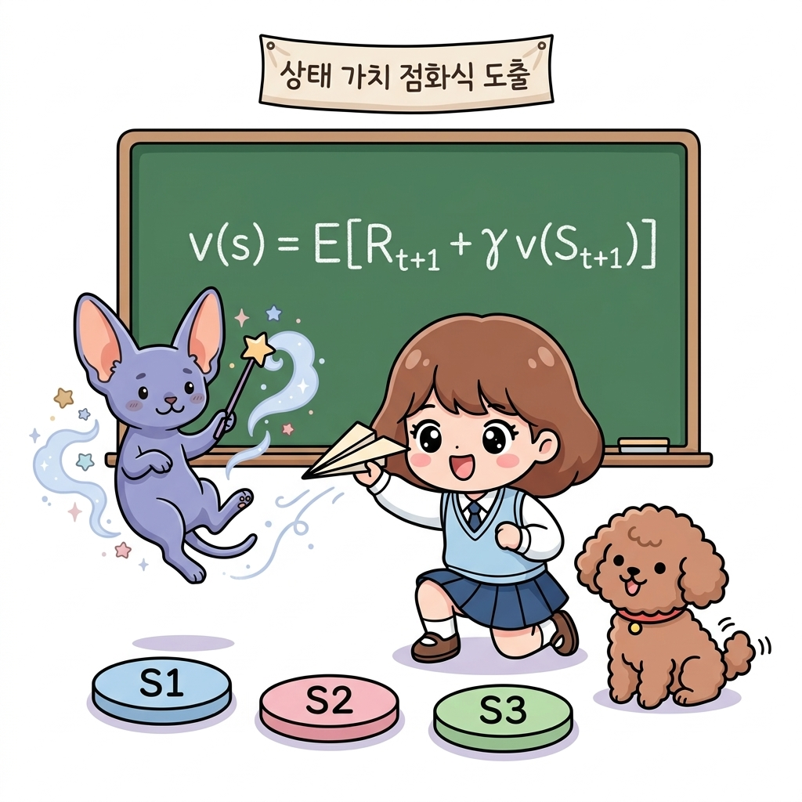

**그림 06-2** 칠판에 적어둔 상태 가치 점화식 V(s)을 활용하여 타일 표적 위에 종이비행기를 날려 전이 확률 게임을 시험하는 도로시와 지니

---

#### 이번 절에서는 벨만 방정식을 도출하겠습니다. 

하지만 그전에 간단한 예를 이용해 확률과 기댓값에 대해 복습해보죠. 

확률과 기댓값에 자신이 있다면 06.2.1절은 건너뛰고 곧바로 06.2.2절로 넘어가도 좋습니다.

  

    🎧
    대화 음성 듣기 (도로시 & 지니)
  

  

    <button type="button" class="btn-audio-play" style="background: #0284c7; color: #ffffff; border: none; border-radius: 16px; padding: 5px 13px; font-size: 0.82rem; font-weight: 600; cursor: pointer; display: inline-flex; align-items: center; gap: 4px; box-shadow: 0 1px 2px rgba(2,132,199,0.3);">
      ▶️ 재생
    </button>
    <button type="button" class="btn-audio-stop" style="background: #e2e8f0; color: #475569; border: none; border-radius: 16px; padding: 5px 11px; font-size: 0.82rem; font-weight: 600; cursor: pointer; display: inline-flex; align-items: center; gap: 4px;">
      ⏹️ 정지
    </button>
  

  <audio src="./audio/dialogue_6_2_scene2.mp3" preload="none"></audio>

> 👧 **도로시**: "지니, 벨만 방정식을 풀기 전에 **확률과 기댓값**부터 다시 가볍게 짚고 가도 될까?"
> 
> 🐱 **지니**: "물론이지! 기본기가 튼튼할수록 뒤에 나올 수식들이 마법처럼 술술 풀릴 거야. 주사위 놀이부터 출발해보자!"

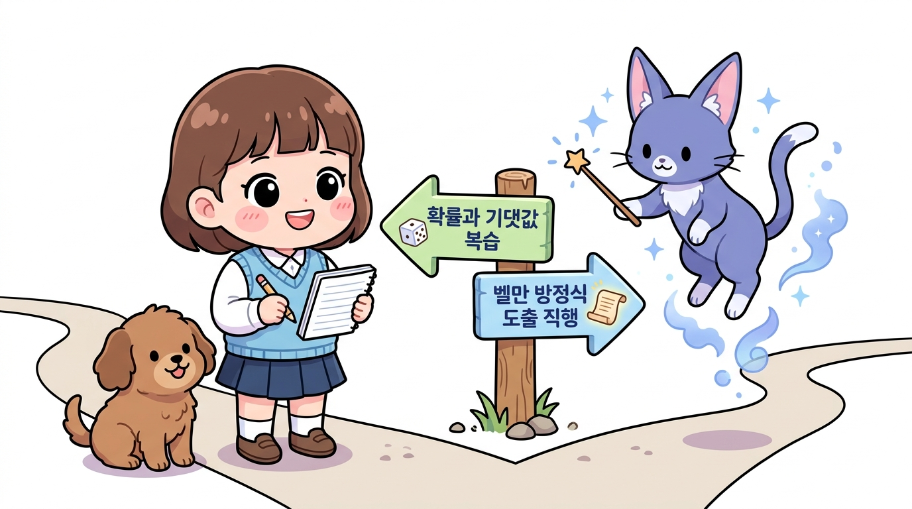

---

### 06.2.1 확률과 기댓값

주사위를 예로 들어 설명하겠습니다. 

  

    🎧
    대화 음성 듣기 (도로시 & 지니)
  

  

    <button type="button" class="btn-audio-play" style="background: #0284c7; color: #ffffff; border: none; border-radius: 16px; padding: 5px 13px; font-size: 0.82rem; font-weight: 600; cursor: pointer; display: inline-flex; align-items: center; gap: 4px; box-shadow: 0 1px 2px rgba(2,132,199,0.3);">
      ▶️ 재생
    </button>
    <button type="button" class="btn-audio-stop" style="background: #e2e8f0; color: #475569; border: none; border-radius: 16px; padding: 5px 11px; font-size: 0.82rem; font-weight: 600; cursor: pointer; display: inline-flex; align-items: center; gap: 4px;">
      ⏹️ 정지
    </button>
  

  <audio src="./audio/dialogue_6_2_scene3.mp3" preload="none"></audio>

> 👧 **도로시**: "주사위를 던지면 1부터 6까지 눈이 골고루 나오잖아. 이걸 수학으로는 어떻게 부를까?"
> 
> 🐱 **지니**: "어떤 값이 나올지 정해지지 않은 수를 **확률 변수(Random Variable)**라고 부른단다. 눈의 개수를 *x*라고 이름 붙여보자!"

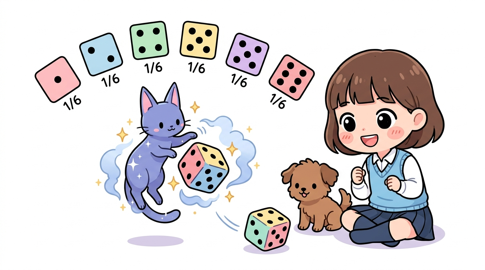

---

#### 이상적인 주사위

각각의 눈이 나올 확률이 정확하게 1/6 씩인 이상적인 주사위라고 가정하죠. 

이때 눈 개수를 *x*라는 확률 변수로 표현하면 *x*는 1부터 6까지의 정수가 될 수 있습니다. 

그리고 확률은 모두 1/6 씩이니, 각 눈이 나올 확률을 다음 식으로 표현할 수 있습니다.
$$
p(x) = \frac{1}{6}
$$

  

    🎧
    대화 음성 듣기 (도로시 & 지니)
  

  

    <button type="button" class="btn-audio-play" style="background: #0284c7; color: #ffffff; border: none; border-radius: 16px; padding: 5px 13px; font-size: 0.82rem; font-weight: 600; cursor: pointer; display: inline-flex; align-items: center; gap: 4px; box-shadow: 0 1px 2px rgba(2,132,199,0.3);">
      ▶️ 재생
    </button>
    <button type="button" class="btn-audio-stop" style="background: #e2e8f0; color: #475569; border: none; border-radius: 16px; padding: 5px 11px; font-size: 0.82rem; font-weight: 600; cursor: pointer; display: inline-flex; align-items: center; gap: 4px;">
      ⏹️ 정지
    </button>
  

  <audio src="./audio/dialogue_6_2_scene4.mp3" preload="none"></audio>

> 👧 **도로시**: "여섯 개 면 모두 똑같이 공평하니까, 각각의 눈이 나올 확률은 전부 1/6이네!"
> 
> 🐱 **지니**: "정답이야! 모든 눈의 **확률을 다 더하면** 정확히 1(100%)이 되는 이상적인 확률 분포란다!"

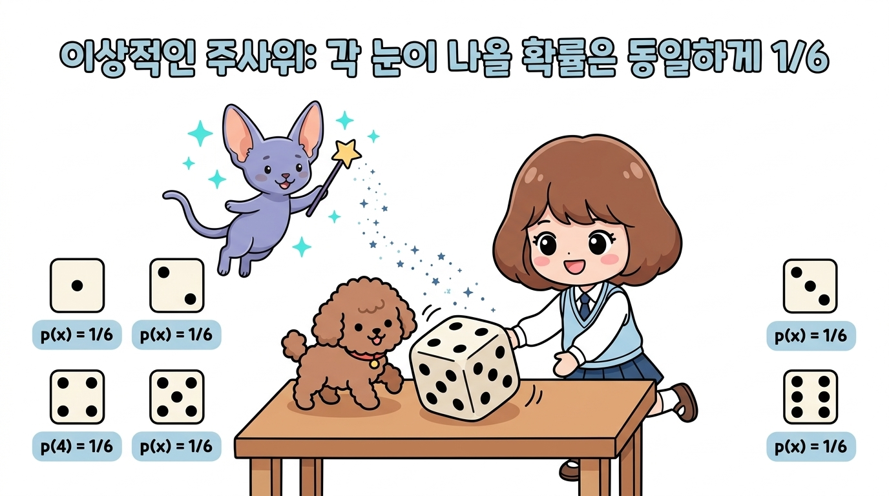

---

#### 복습! 기댓값(Expectation)이란 무엇일까요?

기댓값(기대 수익/평균 보상)은 어떤 사건이 일어날 확률과 그때 얻을 수 있는 보상을 곱한 값을 모든 경우에 대해 더해 구한 **평균적인 수익 값**을 의미합니다.

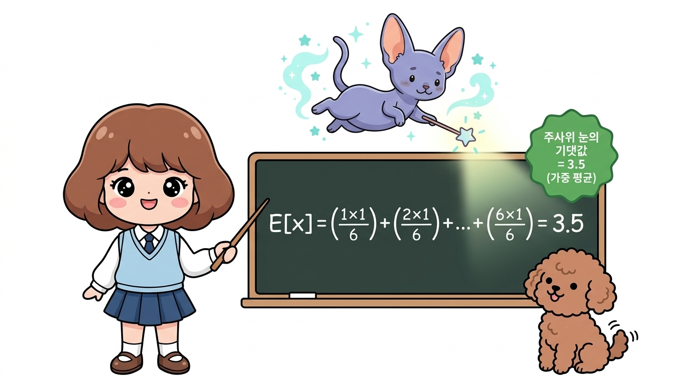

---

#### 주사위 눈의 기댓값

이제 주사위를 굴렸을 때 나올 눈의 기댓값을 구해봅시다. 

다음처럼 계산하면 됩니다.
$$
\mathbb{E}[x] = 1 \cdot \frac{1}{6} + 2 \cdot \frac{1}{6} + 3 \cdot \frac{1}{6} + 4 \cdot \frac{1}{6} + 5 \cdot \frac{1}{6} + 6 \cdot \frac{1}{6} = 3.5
$$

이와 같이 각각의 '눈 개수'와 '확률'을 곱한 다음, 그 모두를 더합니다.

참고로 합(시그마, Σ) 기호를 쓰면 기댓값을 다음 식으로도 표현할 수 있습니다.
$$
\mathbb{E}[x] = \sum_x x p(x)
$$

  

    🎧
    대화 음성 듣기 (도로시 & 지니)
  

  

    <button type="button" class="btn-audio-play" style="background: #0284c7; color: #ffffff; border: none; border-radius: 16px; padding: 5px 13px; font-size: 0.82rem; font-weight: 600; cursor: pointer; display: inline-flex; align-items: center; gap: 4px; box-shadow: 0 1px 2px rgba(2,132,199,0.3);">
      ▶️ 재생
    </button>
    <button type="button" class="btn-audio-stop" style="background: #e2e8f0; color: #475569; border: none; border-radius: 16px; padding: 5px 11px; font-size: 0.82rem; font-weight: 600; cursor: pointer; display: inline-flex; align-items: center; gap: 4px;">
      ⏹️ 정지
    </button>
  

  <audio src="./audio/dialogue_6_2_scene5.mp3" preload="none"></audio>

> 👧 **도로시**: "주사위 눈에는 3.5라는 숫자가 없는데, 왜 기댓값은 3.5가 나오는 거야?"
> 
> 🐱 **지니**: "기댓값은 한 번 던져서 나오는 눈이 아니라, 주사위를 수없이 많이 굴렸을 때 얻게 되는 '무게중심(평균)'이기 때문이란다!"

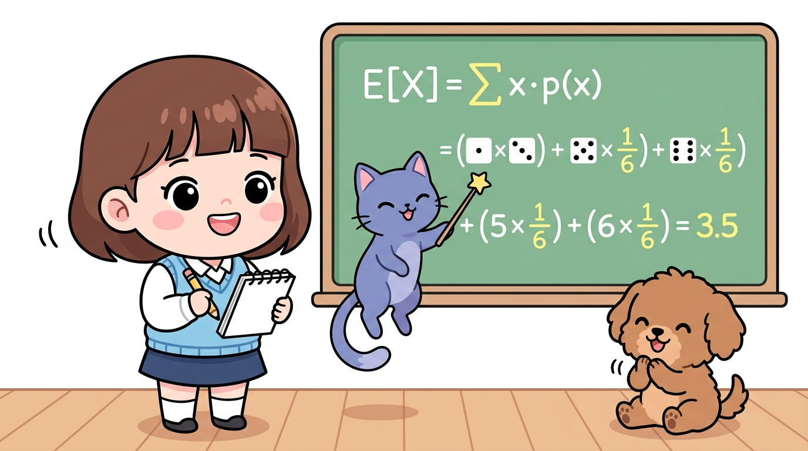

---

#### 백업 다이어그램

백업 다이어그램은 [그림 06-2]와 같이 상위 행동 노드('주사위 굴리기')에서 각각의 눈이 나올 확률(1/6)에 따라 6가지 결과 상태로 가지가 뻗어나가는 **트리 구조**로 표현됩니다.

  

    🎧
    대화 음성 듣기 (도로시 & 지니)
  

  

    <button type="button" class="btn-audio-play" style="background: #0284c7; color: #ffffff; border: none; border-radius: 16px; padding: 5px 13px; font-size: 0.82rem; font-weight: 600; cursor: pointer; display: inline-flex; align-items: center; gap: 4px; box-shadow: 0 1px 2px rgba(2,132,199,0.3);">
      ▶️ 재생
    </button>
    <button type="button" class="btn-audio-stop" style="background: #e2e8f0; color: #475569; border: none; border-radius: 16px; padding: 5px 11px; font-size: 0.82rem; font-weight: 600; cursor: pointer; display: inline-flex; align-items: center; gap: 4px;">
      ⏹️ 정지
    </button>
  

  <audio src="./audio/dialogue_6_2_scene6.mp3" preload="none"></audio>

> 👧 **도로시**: "위의 까만 점이 주사위를 굴리는 '행동'이고, 아래로 뻗은 여섯 갈래가 일어날 수 있는 **'결과 상태'**들이구나!"
> 
> 🐱 **지니**: "완벽해! 이렇게 행동에서 결과로 이어지는 확률 가지를 나무 모양으로 펼쳐둔 그림을 강화학습에서는 **백업 다이어그램(Backup Diagram)**이라고 부른단다!"

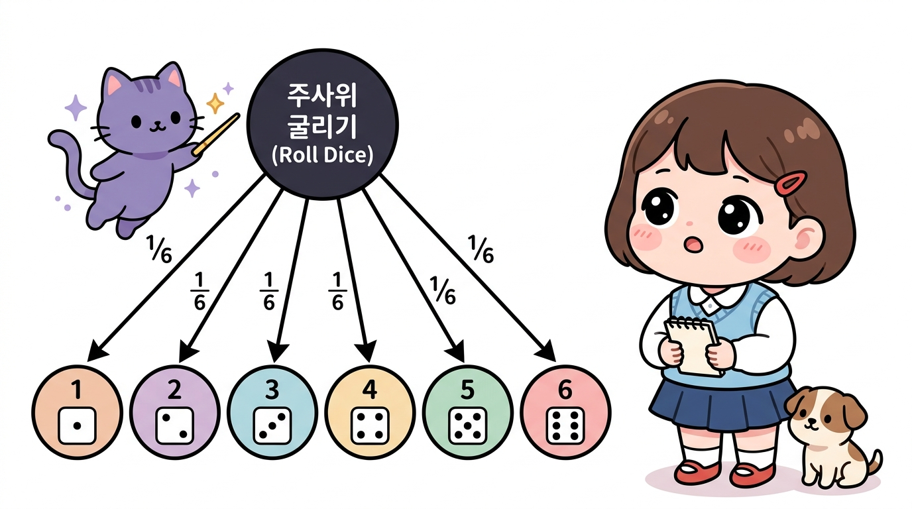

**그림 06-2** 주사위 굴리기 행동에서 6가지 눈이 나올 확률(각 1/6)에 따라 결과 노드로 연결되는 백업 다이어그램 구조

---

#### 주사위와 동전

자, 이번에는 1단계 사건(주사위)의 결과에 따라 2단계 사건(동전 던지기)의 환경 조건과 보상이 달라지는 **순차적 전이 문제**를 생각해봅시다. 

[그림 06-3]은 주사위와 동전을 순서대로 던지는 2단계 확률 게임의 전체 분기 구조를 직관적으로 나타낸 것입니다.

  

    🎧
    대화 음성 듣기 (도로시 & 지니)
  

  

    <button type="button" class="btn-audio-play" style="background: #0284c7; color: #ffffff; border: none; border-radius: 16px; padding: 5px 13px; font-size: 0.82rem; font-weight: 600; cursor: pointer; display: inline-flex; align-items: center; gap: 4px; box-shadow: 0 1px 2px rgba(2,132,199,0.3);">
      ▶️ 재생
    </button>
    <button type="button" class="btn-audio-stop" style="background: #e2e8f0; color: #475569; border: none; border-radius: 16px; padding: 5px 11px; font-size: 0.82rem; font-weight: 600; cursor: pointer; display: inline-flex; align-items: center; gap: 4px;">
      ⏹️ 정지
    </button>
  

  <audio src="./audio/dialogue_6_2_scene7.mp3" preload="none"></audio>

> 👧 **도로시**: "주사위 결과에 따라 내가 받게 되는 **동전의 종류**가 달라지는 거네?"
> 
> 🐱 **지니**: "그렇단다! 이전 사건이 다음 사건의 환경을 결정하는 '순차적 의사결정'의 첫걸음이지!"

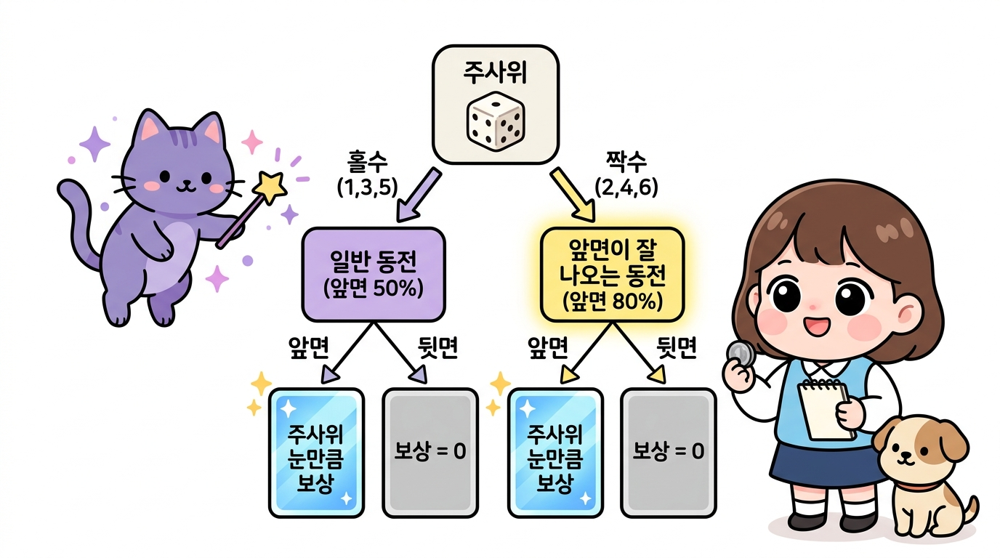

**그림 06-3** 주사위 결과(홀수/짝수)에 따라 서로 다른 동전이 주어지고, 동전의 앞/뒷면에 따라 최종 보상이 결정되는 2단계 순차 게임 구조

---

#### 이번 문제는 주사위를 먼저 던지고 이어서 동전을 던지는 방식으로 진행됩니다. 

이때 주사위를 던져 짝수가 나오면 앞면이 잘 나오는 동전(확률 = 0.8)이 주어지고, 홀수가 나오면 일반 동전(확률 = 0.5)이 주어집니다. 

그런 다음 주어진 동전을 던져 앞면이 나오면 주사위의 눈 개수만큼을 보상으로 얻습니다. 

반대로 뒷면이 나온다면 보상은 0입니다.

  

    🎧
    대화 음성 듣기 (도로시 & 지니)
  

  

    <button type="button" class="btn-audio-play" style="background: #0284c7; color: #ffffff; border: none; border-radius: 16px; padding: 5px 13px; font-size: 0.82rem; font-weight: 600; cursor: pointer; display: inline-flex; align-items: center; gap: 4px; box-shadow: 0 1px 2px rgba(2,132,199,0.3);">
      ▶️ 재생
    </button>
    <button type="button" class="btn-audio-stop" style="background: #e2e8f0; color: #475569; border: none; border-radius: 16px; padding: 5px 11px; font-size: 0.82rem; font-weight: 600; cursor: pointer; display: inline-flex; align-items: center; gap: 4px;">
      ⏹️ 정지
    </button>
  

  <audio src="./audio/dialogue_6_2_scene8.mp3" preload="none"></audio>

> 👧 **도로시**: "짝수가 나오면 앞면 확률이 무려 80%나 되는 행운의 동전을 받는구나! 주사위 눈이 4나 6이 나오면 대박이겠어!"
> 
> 🐱 **지니**: "맞아! 하지만 뒷면이 나오면 아무리 큰 눈이라도 보상이 0점이 되니, 확률과 보상을 곱해서 꼼꼼히 따져봐야 한단다!"

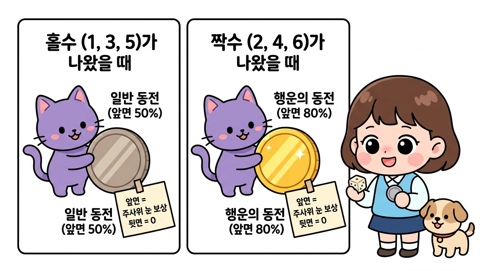

---

#### 예를 들면 다음과 같습니다.

• 주사위 눈이 4개이고 이어서 (앞면이 나오기 쉬운) 동전이 앞면이면 보상은 4이다.  
• 주사위 눈이 5개이고 이어서 (일반) 동전이 뒷면이면 보상은 0이다.  

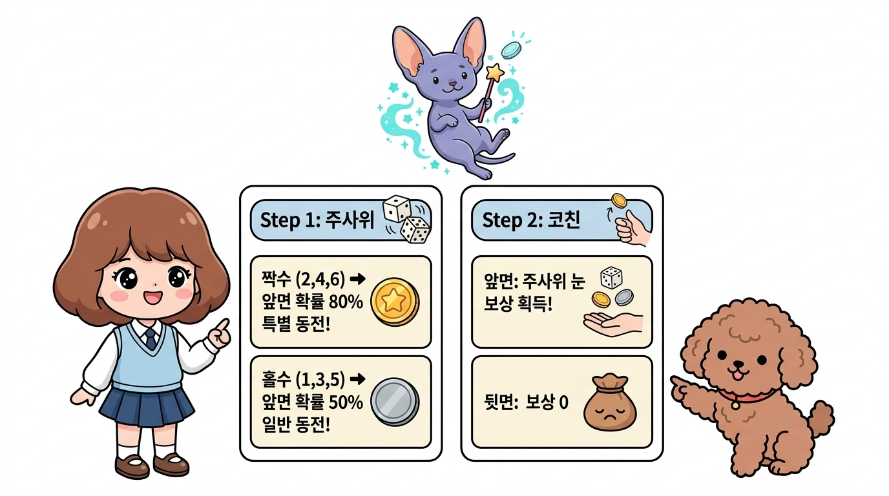

---

#### 보상의 기대값, 백업 다이어그램

이 문제의 '보상 기댓값'은 얼마일까요? 

먼저 모든 분기 경로를 한눈에 볼 수 있도록 백업 다이어그램을 그려봅시다.

[그림 06-4]는 상단의 '주사위' 행동에서 6가지 눈(확률 각 1/6)으로 갈라진 뒤, 각 상태에서 주어진 동전을 던져 앞면과 뒷면(홀수는 각 1/2, 짝수는 4/5와 1/5)으로 분기하는 총 12가지 경로를 체계적으로 나타낸 2단계 백업 다이어그램입니다.

  

    🎧
    대화 음성 듣기 (도로시 & 지니)
  

  

    <button type="button" class="btn-audio-play" style="background: #0284c7; color: #ffffff; border: none; border-radius: 16px; padding: 5px 13px; font-size: 0.82rem; font-weight: 600; cursor: pointer; display: inline-flex; align-items: center; gap: 4px; box-shadow: 0 1px 2px rgba(2,132,199,0.3);">
      ▶️ 재생
    </button>
    <button type="button" class="btn-audio-stop" style="background: #e2e8f0; color: #475569; border: none; border-radius: 16px; padding: 5px 11px; font-size: 0.82rem; font-weight: 600; cursor: pointer; display: inline-flex; align-items: center; gap: 4px;">
      ⏹️ 정지
    </button>
  

  <audio src="./audio/dialogue_6_2_scene9.mp3" preload="none"></audio>

> 👧 **도로시**: "공책에 적힌 것처럼 첫 번째 경로는 주사위 $1/6$에 동전 앞면 $1/2$을 곱해서 정확히 $1/12$의 확률로 보상 1을 얻게 되는 거네!"
> 
> 🐱 **지니**: "정확해! 열두 가지 모든 나뭇가지 끝마다 '그 경로가 일어날 확률'과 '받게 될 보상'이 딱 정해져 있단다!"

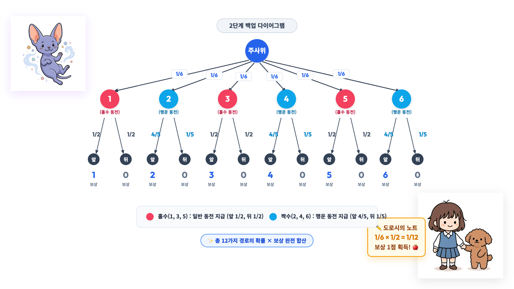

**그림 06-4** 주사위(1단계)와 동전(2단계)의 순차적 전이 확률 및 최종 보상을 나타내는 12가지 경로의 백업 다이어그램

그림을 보면, 예컨대 주사위가 1이 나올 확률은 1/6이고 이어서 동전의 앞면이 나올 확률은 1/2입니다. 그리고 이때 말단 노드에서 얻는 보상이 바로 1입니다.

---

#### 다시 말해 다음과 같이 표현할 수 있습니다.

• 1/6 × 1/2 = 1/12의 확률로  
• 보상 1을 얻는다.  

'보상 기댓값'을 구하려면 모든 경우에 대해 똑같이 계산하여 다 더하면 됩니다. 

실제로 해보면 다음과 같습니다.

$$
\left(\frac{1}{6} \cdot \frac{1}{2} \cdot 1\right) + \left(\frac{1}{6} \cdot \frac{1}{2} \cdot 0\right) + \left(\frac{1}{6} \cdot \frac{4}{5} \cdot 2\right) + \left(\frac{1}{6} \cdot \frac{1}{5} \cdot 0\right) + \left(\frac{1}{6} \cdot \frac{1}{2} \cdot 3\right) + \left(\frac{1}{6} \cdot \frac{1}{2} \cdot 0\right) +
$$
$$
\left(\frac{1}{6} \cdot \frac{4}{5} \cdot 4\right) + \left(\frac{1}{6} \cdot \frac{1}{5} \cdot 0\right) + \left(\frac{1}{6} \cdot \frac{1}{2} \cdot 5\right) + \left(\frac{1}{6} \cdot \frac{1}{2} \cdot 0\right) + \left(\frac{1}{6} \cdot \frac{4}{5} \cdot 6\right) + \left(\frac{1}{6} \cdot \frac{1}{5} \cdot 0\right)
$$
$$
= 2.35
$$

  

    🎧
    대화 음성 듣기 (도로시 & 지니)
  

  

    <button type="button" class="btn-audio-play" style="background: #0284c7; color: #ffffff; border: none; border-radius: 16px; padding: 5px 13px; font-size: 0.82rem; font-weight: 600; cursor: pointer; display: inline-flex; align-items: center; gap: 4px; box-shadow: 0 1px 2px rgba(2,132,199,0.3);">
      ▶️ 재생
    </button>
    <button type="button" class="btn-audio-stop" style="background: #e2e8f0; color: #475569; border: none; border-radius: 16px; padding: 5px 11px; font-size: 0.82rem; font-weight: 600; cursor: pointer; display: inline-flex; align-items: center; gap: 4px;">
      ⏹️ 정지
    </button>
  

  <audio src="./audio/dialogue_6_2_scene10.mp3" preload="none"></audio>

> 👧 **도로시**: "열두 가지 경우의 수를 전부 확률과 보상으로 곱해서 더하니까 최종 평균 점수가 딱 2.35점이 나왔어!"
> 
> 🐱 **지니**: "맞아! 복잡해 보이는 2단계 게임도 모든 경로를 나무 가지처럼 펼친 다음 **'확률 × 보상'을 몽땅 더하면 평균 수익**을 단번에 구할 수 있단다!"

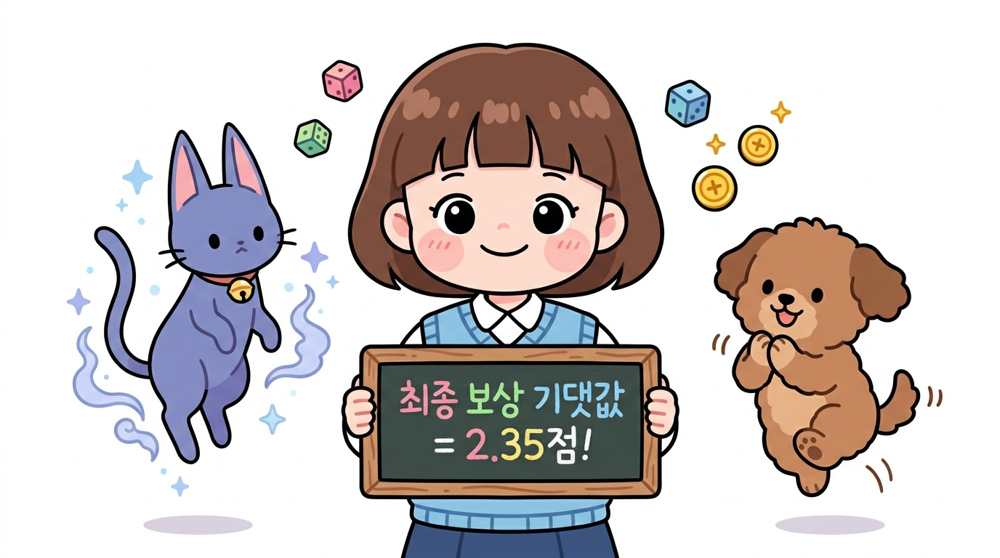

---

#### 드디어 보상의 기댓값을 알아냈습니다. 

방법은 [그림 06-4]의 말단 노드가 발생할 **확률**과 그때의 보상을 **곱**하는 계산을 모든 후보에 수행한 다음 다 더하는 것이었습니다.

  

    🎧
    대화 음성 듣기 (도로시 & 지니)
  

  

    <button type="button" class="btn-audio-play" style="background: #0284c7; color: #ffffff; border: none; border-radius: 16px; padding: 5px 13px; font-size: 0.82rem; font-weight: 600; cursor: pointer; display: inline-flex; align-items: center; gap: 4px; box-shadow: 0 1px 2px rgba(2,132,199,0.3);">
      ▶️ 재생
    </button>
    <button type="button" class="btn-audio-stop" style="background: #e2e8f0; color: #475569; border: none; border-radius: 16px; padding: 5px 11px; font-size: 0.82rem; font-weight: 600; cursor: pointer; display: inline-flex; align-items: center; gap: 4px;">
      ⏹️ 정지
    </button>
  

  <audio src="./audio/dialogue_6_2_scene11.mp3" preload="none"></audio>

> 👧 **도로시**: "결국 '어떤 일이 일어날 확률'에 '그때 얻는 보상'을 곱해서 다 더하는 것이 기댓값의 핵심 원리구나!"
> 
> 🐱 **지니**: "정확해 도로시! 이제 구체적인 숫자 대신 깔끔한 수학 기호로 일반화해보자!"

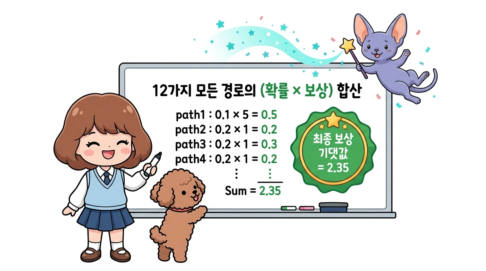

---

#### 문자 표현 개선

지금까지 계산한 것을 문자로 표현해봅시다. 

주사위의 눈을 *x*, 동전의 결과(앞 혹은 뒤)를 *y*로 표기하겠습니다. 

이번 문제에서는 **주사위 눈 개수**에 따라 **동전 앞면이 나올 확률**이 달라집니다. 

이 설정은 **조건부 확률 *p*(*y* | *x*)**로 표현하며 값은 다음과 같습니다.
$$
p(y = \text{앞} \mid x = 4) = 0.8
$$
$$
p(y = \text{뒤} \mid x = 4) = 0.2
$$

또한 *x*와 *y*가 동시에 일어날 확률, 즉 '동시 확률'은 다음과 같습니다.

$$
p(x, y) = p(x) p(y \mid x)
$$

  

    🎧
    대화 음성 듣기 (도로시 & 지니)
  

  

    <button type="button" class="btn-audio-play" style="background: #0284c7; color: #ffffff; border: none; border-radius: 16px; padding: 5px 13px; font-size: 0.82rem; font-weight: 600; cursor: pointer; display: inline-flex; align-items: center; gap: 4px; box-shadow: 0 1px 2px rgba(2,132,199,0.3);">
      ▶️ 재생
    </button>
    <button type="button" class="btn-audio-stop" style="background: #e2e8f0; color: #475569; border: none; border-radius: 16px; padding: 5px 11px; font-size: 0.82rem; font-weight: 600; cursor: pointer; display: inline-flex; align-items: center; gap: 4px;">
      ⏹️ 정지
    </button>
  

  <audio src="./audio/dialogue_6_2_scene12.mp3" preload="none"></audio>

> 👧 **도로시**: "주사위 눈 *x*가 먼저 결정된 상태에서 동전 결과 *y*가 나오는 걸 $p(y \mid x)$라고 쓰는 거구나!"
> 
> 🐱 **지니**: "그렇단다! '주사위가 4일 때 동전 앞면 확률'처럼 뒤의 조건이 먼저 정해져 있을 때 일어나는 확률을 **조건부 확률**이라고 해!"

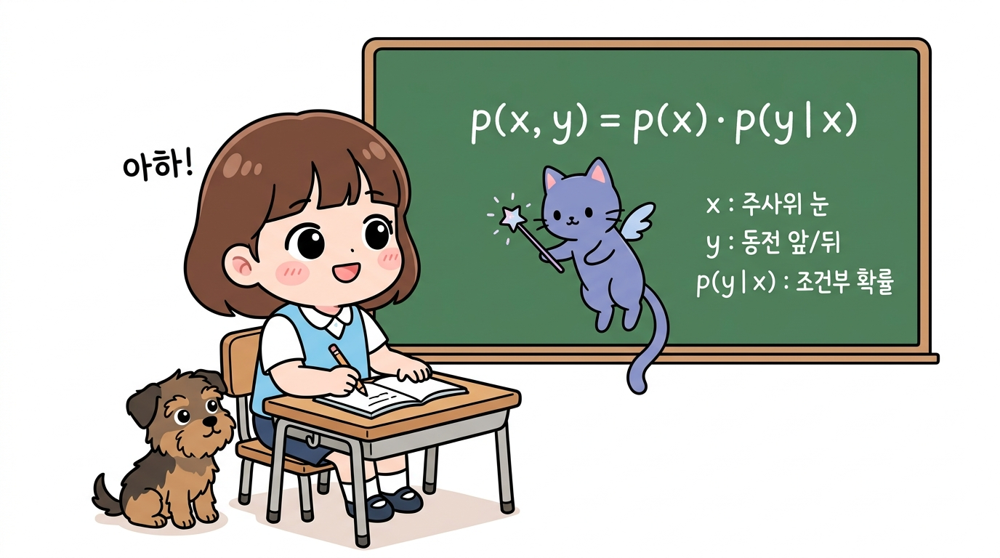

---

#### [Tip] 친절한 개념 노트: 확률의 곱셈 정리(Multiplication Rule of Probability)

이 수식은 확률론에서 매우 중요한 **확률의 곱셈 정리**를 나타냅니다.

> - **동시 확률 *p*(*x*, *y*)**: 주사위 눈금 *x*가 나오고 동시에 동전 앞/뒷면 *y*가 발생할 확률입니다.
> - **조건부 확률 *p*(*y* | *x*)**: 먼저 일어난 주사위 눈금 *x*의 결과가 고정되어 있을 때, 그 다음 사건인 동전 결과 *y*가 일어날 확률입니다.
> - **곱셈 법칙**: 두 사건이 연달아 일어나는 확률 *p*(*x*, *y*)는 **"첫 번째 사건이 일어날 확률 *p*(*x*)"**에 **"첫 번째 사건이 일어났다는 가정하에 두 번째 사건이 일어날 조건부 확률 *p*(*y* | *x*)"**를 곱해서 구할 수 있다는 원리입니다.
>
> 예컨대 주사위 눈이 4가 나오고 동전이 앞면이 나올 확률은 다음과 같이 계산됩니다:
> $$
> p(4, \text{앞}) = p(x=4) \times p(y=\text{앞} \mid x=4) = \frac{1}{6} \times 0.8 = 0.133... \text{ (약 } 13.3\% \text{)}
>$$

  

    🎧
    대화 음성 듣기 (도로시 & 지니)
  

  

    <button type="button" class="btn-audio-play" style="background: #0284c7; color: #ffffff; border: none; border-radius: 16px; padding: 5px 13px; font-size: 0.82rem; font-weight: 600; cursor: pointer; display: inline-flex; align-items: center; gap: 4px; box-shadow: 0 1px 2px rgba(2,132,199,0.3);">
      ▶️ 재생
    </button>
    <button type="button" class="btn-audio-stop" style="background: #e2e8f0; color: #475569; border: none; border-radius: 16px; padding: 5px 11px; font-size: 0.82rem; font-weight: 600; cursor: pointer; display: inline-flex; align-items: center; gap: 4px;">
      ⏹️ 정지
    </button>
  

  <audio src="./audio/dialogue_6_2_scene13.mp3" preload="none"></audio>

> 👧 **도로시**: "두 사건이 연달아 일어나는 확률은 그냥 '첫 번째 확률 × 두 번째 조건부 확률'로 간단히 곱하면 되는 거였어!"
> 
> 🐱 **지니**: "맞아 도로시! 이 곱셈 정리 덕분에 앞으로 어떤 다단계 모험 경로도 막힘없이 계산해낼 수 있단다!"

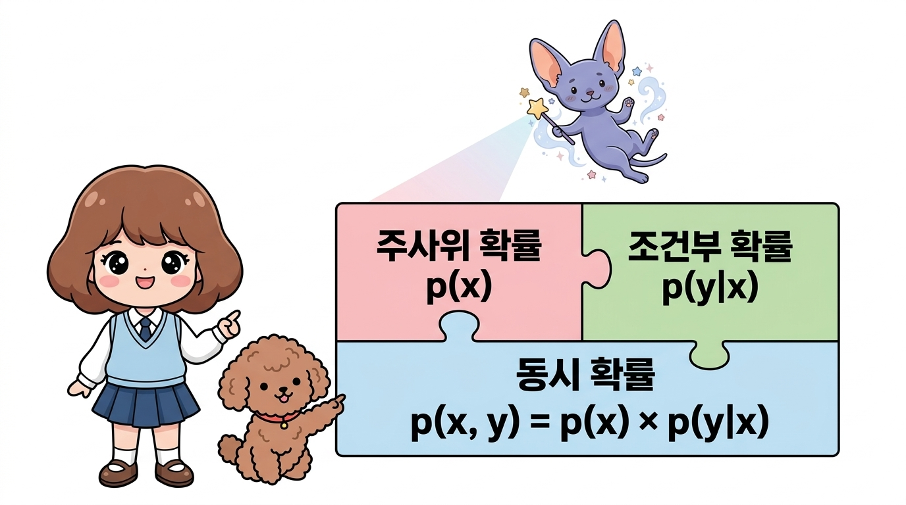

---

#### 이번 문제에서 보상은 *x*와 *y*의 값에 의해 결정됩니다. 

따라서 보상을 함수 *r*(*x*, *y*)로 나타낼 수 있습니다.

$$
r(x = 4, y = \text{앞}) = 4
$$
$$
r(x = 3, y = \text{뒤}) = 0
$$

  

    🎧
    대화 음성 듣기 (도로시 & 지니)
  

  

    <button type="button" class="btn-audio-play" style="background: #0284c7; color: #ffffff; border: none; border-radius: 16px; padding: 5px 13px; font-size: 0.82rem; font-weight: 600; cursor: pointer; display: inline-flex; align-items: center; gap: 4px; box-shadow: 0 1px 2px rgba(2,132,199,0.3);">
      ▶️ 재생
    </button>
    <button type="button" class="btn-audio-stop" style="background: #e2e8f0; color: #475569; border: none; border-radius: 16px; padding: 5px 11px; font-size: 0.82rem; font-weight: 600; cursor: pointer; display: inline-flex; align-items: center; gap: 4px;">
      ⏹️ 정지
    </button>
  

  <audio src="./audio/dialogue_6_2_scene14.mp3" preload="none"></audio>

> 👧 **도로시**: "보상도 *x*(주사위 눈)와 *y*(동전 앞/뒤)라는 두 사건의 결과에 의해 결정되니까, 함수로 $r(x, y)$처럼 명확하게 표현할 수 있네!"
> 
> 🐱 **지니**: "맞아! 주사위 4에 동전 앞면이면 $r(4, \text{앞}) = 4$개의 황금 사과를 얻고, 뒷면이면 아쉽지만 $0$이 되는 셈이지!"

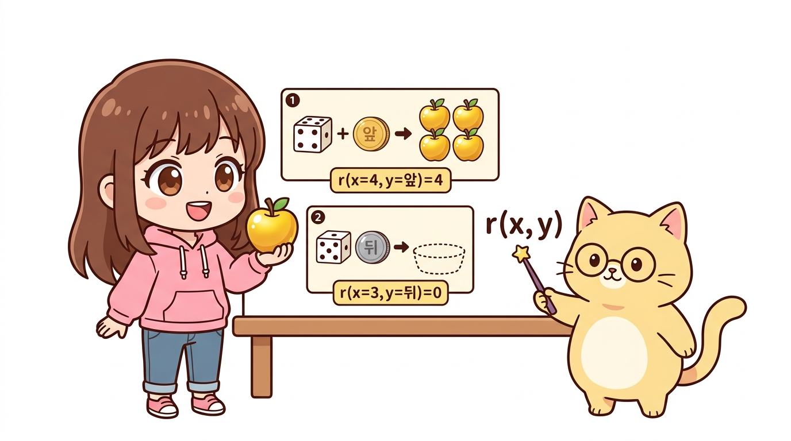

---

#### 기댓값은 '값 × 그 값이 발생할 확률'의 합입니다. 

그러므로 보상의 기댓값은 다음 식으로 나타낼 수 있습니다.

$$
\mathbb{E}[r(x, y)] = \sum_x \sum_y p(x, y) r(x, y)
$$
$$
= \sum_x \sum_y p(x) p(y \mid x) r(x, y)
$$

이 수식의 형태는 다음 절에서 도출할 벨만 방정식에서도 동일하게 등장합니다.

  

    🎧
    대화 음성 듣기 (도로시 & 지니)
  

  

    <button type="button" class="btn-audio-play" style="background: #0284c7; color: #ffffff; border: none; border-radius: 16px; padding: 5px 13px; font-size: 0.82rem; font-weight: 600; cursor: pointer; display: inline-flex; align-items: center; gap: 4px; box-shadow: 0 1px 2px rgba(2,132,199,0.3);">
      ▶️ 재생
    </button>
    <button type="button" class="btn-audio-stop" style="background: #e2e8f0; color: #475569; border: none; border-radius: 16px; padding: 5px 11px; font-size: 0.82rem; font-weight: 600; cursor: pointer; display: inline-flex; align-items: center; gap: 4px;">
      ⏹️ 정지
    </button>
  

  <audio src="./audio/dialogue_6_2_scene15.mp3" preload="none"></audio>

> 👧 **도로시**: "와! 시그마가 두 개($\sum_x \sum_y$)나 붙어 있어서 어려워 보였는데, 결국 '모든 주사위 눈 *x*'와 '모든 동전 결과 *y*'에 대해 확률과 보상을 곱해 다 더한다는 뜻이네!"
> 
> 🐱 **지니**: "대단해 도로시! 이 $\sum \sum p(x) p(y \mid x) r(x, y)$ 구조가 바로 다음 절에서 배우게 될 **벨만 방정식의 핵심 뼈대**란다!"

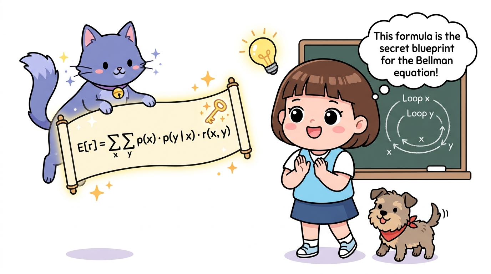

이로써 벨만 방정식을 맞이할 준비가 끝났습니다. 

여기까지 이해했다면 벨만 방정식 도출도 어렵지 않을 것입니다.

---

### 06.2.2 벨만 방정식 도출

벨만 방정식을 도출해보겠습니다. 

먼저 복습을 하자면, 앞서 '**수익**'을 다음과 같이 정의했습니다.
$$
G_t = R_t + \gamma R_{t+1} + \gamma^2 R_{t+2} + \cdots
$$

[식 06.2]

  

    🎧
    대화 음성 듣기 (도로시 & 지니)
  

  

    <button type="button" class="btn-audio-play" style="background: #0284c7; color: #ffffff; border: none; border-radius: 16px; padding: 5px 13px; font-size: 0.82rem; font-weight: 600; cursor: pointer; display: inline-flex; align-items: center; gap: 4px; box-shadow: 0 1px 2px rgba(2,132,199,0.3);">
      ▶️ 재생
    </button>
    <button type="button" class="btn-audio-stop" style="background: #e2e8f0; color: #475569; border: none; border-radius: 16px; padding: 5px 11px; font-size: 0.82rem; font-weight: 600; cursor: pointer; display: inline-flex; align-items: center; gap: 4px;">
      ⏹️ 정지
    </button>
  

  <audio src="./audio/dialogue_6_2_scene16.mp3" preload="none"></audio>

> 👧 **도로시**: "앞서 배웠던 수익 $G_t$가 드디어 다시 등장했네! 시간 $t$부터 미래로 가며 받는 보상들의 할인된 총합이었지?"
> 
> 🐱 **지니**: "맞아 도로시! 이 친숙한 수익 공식 [식 06.2]가 바로 벨만 방정식의 위대한 마법이 시작되는 첫 번째 출발점이란다!"

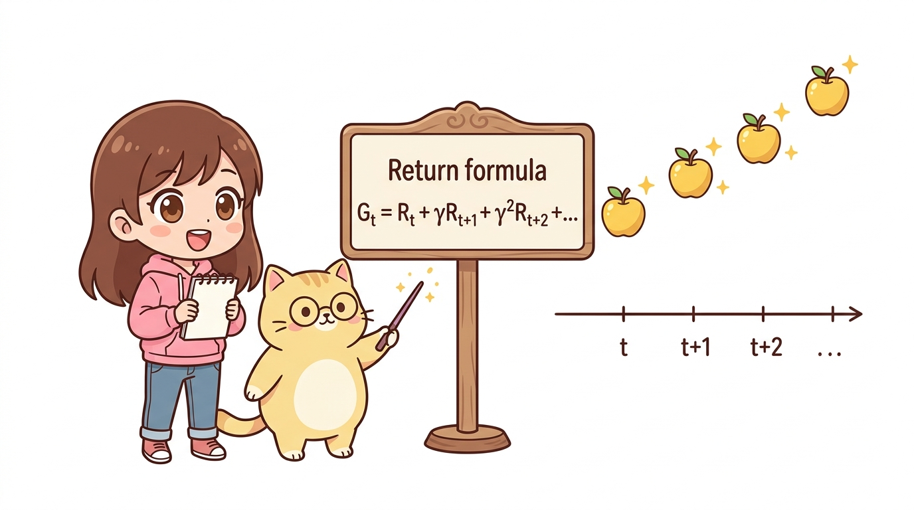

---

#### 무한히 반복

이번 절에서는 보상을 무한히 계속 받을 수 있는 **지속적 과제continuous task**를 가정합니다. 

수익 *G**t*는 시간 *t* 이후로 얻을 수 있는 보상의 총합입니다. 

단, 할인율 *γ*에 따라 더 나중에 받는 보상일수록 값이 기하급수적으로 감소합니다. 

  

    🎧
    대화 음성 듣기 (도로시 & 지니)
  

  

    <button type="button" class="btn-audio-play" style="background: #0284c7; color: #ffffff; border: none; border-radius: 16px; padding: 5px 13px; font-size: 0.82rem; font-weight: 600; cursor: pointer; display: inline-flex; align-items: center; gap: 4px; box-shadow: 0 1px 2px rgba(2,132,199,0.3);">
      ▶️ 재생
    </button>
    <button type="button" class="btn-audio-stop" style="background: #e2e8f0; color: #475569; border: none; border-radius: 16px; padding: 5px 11px; font-size: 0.82rem; font-weight: 600; cursor: pointer; display: inline-flex; align-items: center; gap: 4px;">
      ⏹️ 정지
    </button>
  

  <audio src="./audio/dialogue_6_2_scene17.mp3" preload="none"></audio>

> 👧 **도로시**: "끝없이 이어지는 모험에서는 미래의 사과 보상에 할인율 $\gamma$를 거듭제곱해서 곱해주는구나!"
> 
> 🐱 **지니**: "맞아! 먼 미래의 보상일수록 가치를 조금씩 할인해서 더해주면, 무한한 미래의 보상 총합 $G_t$가 무한대로 폭발하지 않고 깔끔한 유한한 숫자로 수렴하게 된단다!"

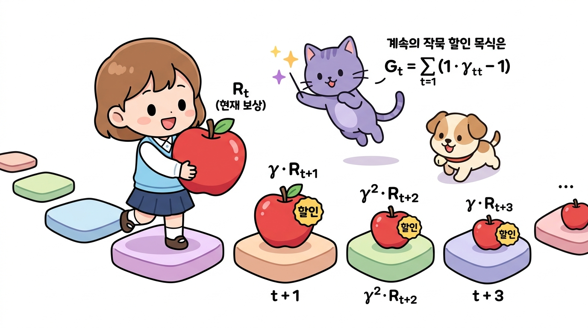

---

#### 그럼 이쯤에서 [식 06.2]의 *t*에 *t* + 1을 대입해보겠습니다. 

그러면 잘 보이지 않던 [식 06.2]의 구조가 또렷하게 드러납니다.
$$
G_{t+1} = R_{t+1} + \gamma R_{t+2} + \gamma^2 R_{t+3} + \cdots
$$

[식 06.3]

[식 06.3]는 시간 *t* + 1 이후에 얻을 수 있는 보상의 합입니다. 

  

    🎧
    대화 음성 듣기 (도로시 & 지니)
  

  

    <button type="button" class="btn-audio-play" style="background: #0284c7; color: #ffffff; border: none; border-radius: 16px; padding: 5px 13px; font-size: 0.82rem; font-weight: 600; cursor: pointer; display: inline-flex; align-items: center; gap: 4px; box-shadow: 0 1px 2px rgba(2,132,199,0.3);">
      ▶️ 재생
    </button>
    <button type="button" class="btn-audio-stop" style="background: #e2e8f0; color: #475569; border: none; border-radius: 16px; padding: 5px 11px; font-size: 0.82rem; font-weight: 600; cursor: pointer; display: inline-flex; align-items: center; gap: 4px;">
      ⏹️ 정지
    </button>
  

  <audio src="./audio/dialogue_6_2_scene18.mp3" preload="none"></audio>

> 👧 **도로시**: "시간 $t$ 대신 $t+1$을 대입했더니, 정확히 내일($t+1$)부터 시작되는 보상들의 총합 $G_{t+1}$이 만들어졌어!"
> 
> 🐱 **지니**: "그렇단다! 시간을 딱 한 단위만 앞으로 굴려보면, 복잡해 보이던 전체 미래 수익이 아주 단순한 점화식으로 연결될 준비를 마치게 되지!"

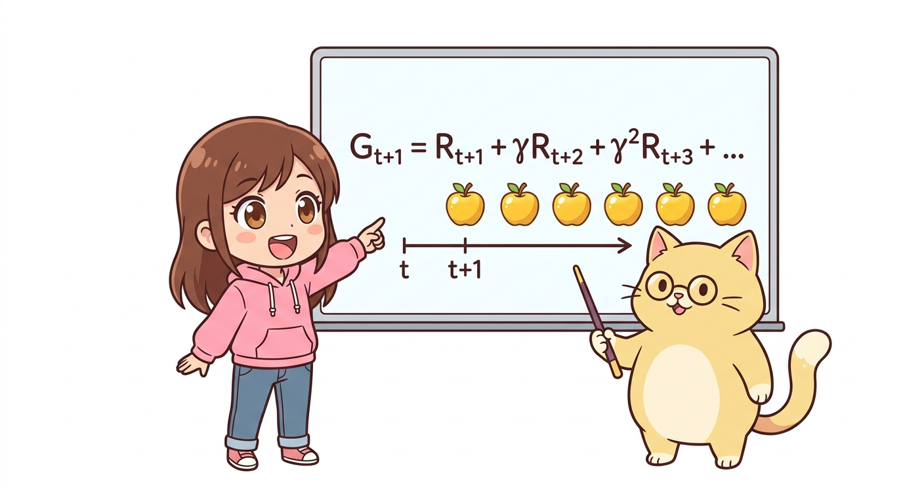

---

#### 이 식을 적용하여 [식 06.2]을 다음과 같이 변형하겠습니다.

$$
G_t = R_t + \gamma R_{t+1} + \gamma^2 R_{t+2} + \cdots
$$
$$
= R_t + \gamma (R_{t+1} + \gamma R_{t+2} + \cdots)
$$
$$
= R_t + \gamma G_{t+1}
$$

[식 06.4]

  

    🎧
    대화 음성 듣기 (도로시 & 지니)
  

  

    <button type="button" class="btn-audio-play" style="background: #0284c7; color: #ffffff; border: none; border-radius: 16px; padding: 5px 13px; font-size: 0.82rem; font-weight: 600; cursor: pointer; display: inline-flex; align-items: center; gap: 4px; box-shadow: 0 1px 2px rgba(2,132,199,0.3);">
      ▶️ 재생
    </button>
    <button type="button" class="btn-audio-stop" style="background: #e2e8f0; color: #475569; border: none; border-radius: 16px; padding: 5px 11px; font-size: 0.82rem; font-weight: 600; cursor: pointer; display: inline-flex; align-items: center; gap: 4px;">
      ⏹️ 정지
    </button>
  

  <audio src="./audio/dialogue_6_2_scene19.mp3" preload="none"></audio>

> 👧 **도로시**: "와! 무한히 길었던 미래의 보상들을 $\gamma$로 묶었더니, 딱 '지금 받는 보상 $R_t$' 하나와 '내일부터의 수익 상자 $\gamma G_{t+1}$'로 마법처럼 압축되었어!"
> 
> 🐱 **지니**: "바로 그거야 도로시! 무한한 미래를 단 한 걸음과 그 이후의 묶음으로 쪼개는 이 점화식이 벨만 방정식의 가장 위대한 열쇠란다!"

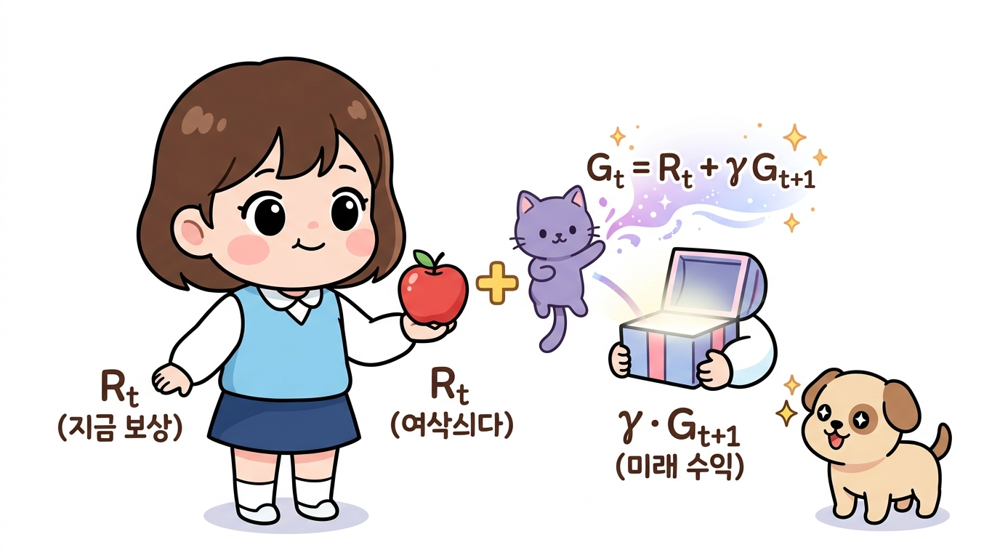

---

#### [식 06.4]으로부터 수익인 *G**t*와 *G**t*+1의 관계를 알 수 있습니다. 

  

    🎧
    대화 음성 듣기 (도로시 & 지니)
  

  

    <button type="button" class="btn-audio-play" style="background: #0284c7; color: #ffffff; border: none; border-radius: 16px; padding: 5px 13px; font-size: 0.82rem; font-weight: 600; cursor: pointer; display: inline-flex; align-items: center; gap: 4px; box-shadow: 0 1px 2px rgba(2,132,199,0.3);">
      ▶️ 재생
    </button>
    <button type="button" class="btn-audio-stop" style="background: #e2e8f0; color: #475569; border: none; border-radius: 16px; padding: 5px 11px; font-size: 0.82rem; font-weight: 600; cursor: pointer; display: inline-flex; align-items: center; gap: 4px;">
      ⏹️ 정지
    </button>
  

  <audio src="./audio/dialogue_6_2_scene20.mp3" preload="none"></audio>

> 👧 **도로시**: "오늘의 사과 하나와 내일부터 열릴 보물 상자가 연결되는 것처럼, 모든 강화학습 알고리즘의 뼈대가 되는 관계식이구나!"
> 
> 🐱 **지니**: "그렇단다! '전체 미래'를 '한 걸음 + 그 다음'으로 바라보는 이 강력한 관점이 앞으로 배울 몬테카를로, TD, Q-러닝의 기초가 된단다!"

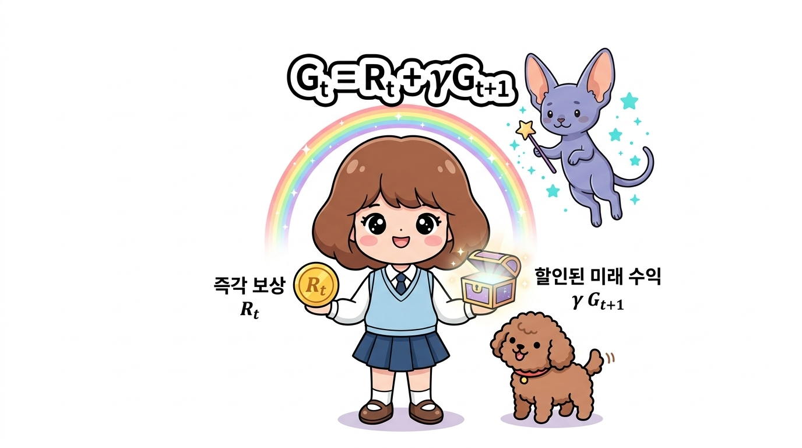

---

#### 이 관계는 수많은 강화 학습 이론과 알고리즘에서 사용됩니다.

이어서 [식 06.4]을 상태 가치 함수의 수식에 대입해보겠습니다.

상태 가치 함수는 수익에 대한 기댓값(기대 수익)이며, 다음 식으로 정의됩니다.
$$
v_{\pi}(s) = \mathbb{E}_{\pi}[G_t \mid S_t = s]
$$

[식 06.5]

  

    🎧
    대화 음성 듣기 (도로시 & 지니)
  

  

    <button type="button" class="btn-audio-play" style="background: #0284c7; color: #ffffff; border: none; border-radius: 16px; padding: 5px 13px; font-size: 0.82rem; font-weight: 600; cursor: pointer; display: inline-flex; align-items: center; gap: 4px; box-shadow: 0 1px 2px rgba(2,132,199,0.3);">
      ▶️ 재생
    </button>
    <button type="button" class="btn-audio-stop" style="background: #e2e8f0; color: #475569; border: none; border-radius: 16px; padding: 5px 11px; font-size: 0.82rem; font-weight: 600; cursor: pointer; display: inline-flex; align-items: center; gap: 4px;">
      ⏹️ 정지
    </button>
  

  <audio src="./audio/dialogue_6_2_scene21.mp3" preload="none"></audio>

> 👧 **도로시**: "상태 가치 함수 $v_\pi(s)$는 내가 지금 상태 $s$에 서 있을 때, 앞으로 얻게 될 전체 수익 $G_t$의 평균 기댓값이구나!"
> 
> 🐱 **지니**: "정답이야 도로시! '이 상태가 얼마나 값어치가 있는가?'를 나타내는 보물 상자의 무게를 측정하는 기준이 바로 [식 06.5]란다!"

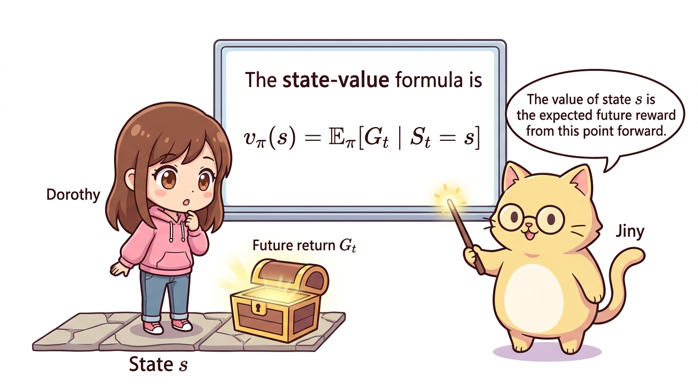

---

#### [식 06.5]와 같이 상태 *s*의 상태 가치 함수가 *v**π*(*s*)로 표현됩니다. 

이 식의 *G**t*에 [식 06.4]을 대입하면 다음과 같습니다.

$$
v_{\pi}(s) = \mathbb{E}_{\pi}[G_t \mid S_t = s]
$$
$$
= \mathbb{E}_{\pi}[R_t + \gamma G_{t+1} \mid S_t = s]
$$
$$
= \mathbb{E}_{\pi}[R_t \mid S_t = s] + \gamma \mathbb{E}_{\pi}[G_{t+1} \mid S_t = s]
$$

[식 06.6]

  

    🎧
    대화 음성 듣기 (도로시 & 지니)
  

  

    <button type="button" class="btn-audio-play" style="background: #0284c7; color: #ffffff; border: none; border-radius: 16px; padding: 5px 13px; font-size: 0.82rem; font-weight: 600; cursor: pointer; display: inline-flex; align-items: center; gap: 4px; box-shadow: 0 1px 2px rgba(2,132,199,0.3);">
      ▶️ 재생
    </button>
    <button type="button" class="btn-audio-stop" style="background: #e2e8f0; color: #475569; border: none; border-radius: 16px; padding: 5px 11px; font-size: 0.82rem; font-weight: 600; cursor: pointer; display: inline-flex; align-items: center; gap: 4px;">
      ⏹️ 정지
    </button>
  

  <audio src="./audio/dialogue_6_2_scene22.mp3" preload="none"></audio>

> 👧 **도로시**: "상태 가치 함수 $v_\pi(s)$ 안의 $G_t$ 자리에 $R_t + \gamma G_{t+1}$을 넣으니까 기댓값이 덧셈으로 딱 두 개로 나뉘네!"
> 
> 🐱 **지니**: "훌륭해! 첫 번째는 '지금 받을 즉시 보상의 기댓값'이고, 두 번째는 '할인된 내일 이후의 미래 가치 기댓값'이지. 이제 이 두 항을 각각 하나씩 해결해보자!"

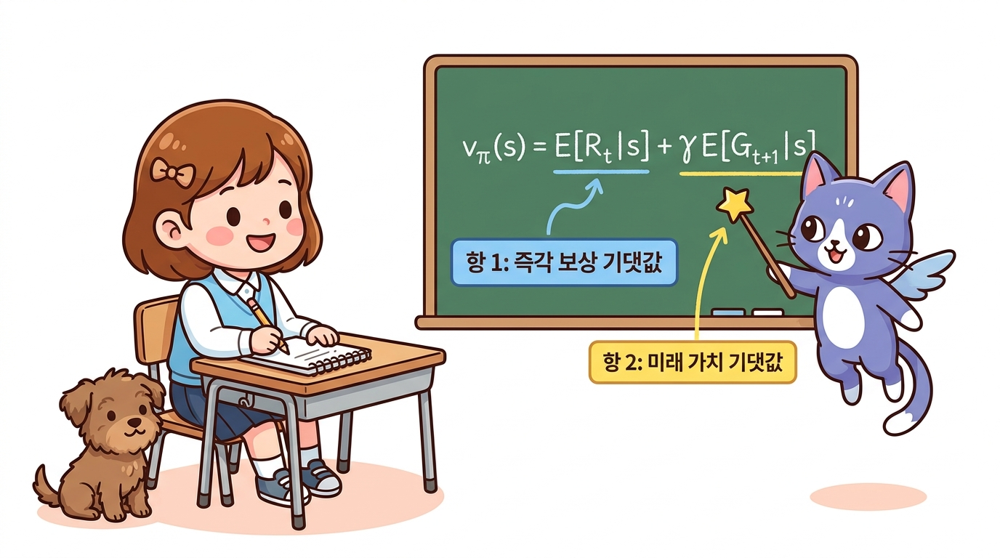

---

#### 기댓값의 선형성

마지막 식의 전개는 기댓값의 '선형성' 덕분에 성립됩니다. 

  

    🎧
    대화 음성 듣기 (도로시 & 지니)
  

  

    <button type="button" class="btn-audio-play" style="background: #0284c7; color: #ffffff; border: none; border-radius: 16px; padding: 5px 13px; font-size: 0.82rem; font-weight: 600; cursor: pointer; display: inline-flex; align-items: center; gap: 4px; box-shadow: 0 1px 2px rgba(2,132,199,0.3);">
      ▶️ 재생
    </button>
    <button type="button" class="btn-audio-stop" style="background: #e2e8f0; color: #475569; border: none; border-radius: 16px; padding: 5px 11px; font-size: 0.82rem; font-weight: 600; cursor: pointer; display: inline-flex; align-items: center; gap: 4px;">
      ⏹️ 정지
    </button>
  

  <audio src="./audio/dialogue_6_2_scene23.mp3" preload="none"></audio>

> 👧 **도로시**: "기댓값 기호 $\mathbb{E}$는 덧셈 기호 앞에서 사이좋게 각각 분리될 수 있는 '선형성'을 가졌구나!"
> 
> 🐱 **지니**: "그렇단다! 덕분에 복잡하게 얽혀 있던 식을 두 개의 독립된 문제로 나누어 정복할 수 있게 되었어!"

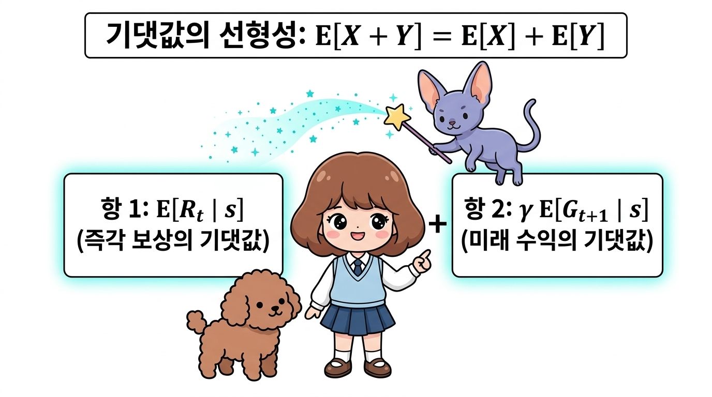

---

선형성이란 확률 변수 *X*와 *Y*가 있을 때 **E**[*X* + *Y*] = **E**[*X*] + **E**[*Y*]가 성립함을 말합니다.

> NOTE_ 이 책에서는 에이전트의 정책을 확률적 정책 *π*(*a* | *s*)로 가정합니다. 결정적 정책도 확률적 정책으로 표현할 수 있기 때문이죠. 마찬가지로 환경의 상태 전이도 확률적이라고, 즉 수식으로 *p*(*s'* | *s*, *a*)라고 가정합니다.

  

    🎧
    대화 음성 듣기 (도로시 & 지니)
  

  

    <button type="button" class="btn-audio-play" style="background: #0284c7; color: #ffffff; border: none; border-radius: 16px; padding: 5px 13px; font-size: 0.82rem; font-weight: 600; cursor: pointer; display: inline-flex; align-items: center; gap: 4px; box-shadow: 0 1px 2px rgba(2,132,199,0.3);">
      ▶️ 재생
    </button>
    <button type="button" class="btn-audio-stop" style="background: #e2e8f0; color: #475569; border: none; border-radius: 16px; padding: 5px 11px; font-size: 0.82rem; font-weight: 600; cursor: pointer; display: inline-flex; align-items: center; gap: 4px;">
      ⏹️ 정지
    </button>
  

  <audio src="./audio/dialogue_6_2_scene24.mp3" preload="none"></audio>

> 👧 **도로시**: "기댓값의 선형성 덕분에 덧셈을 자유롭게 분리할 수 있고, 정책 $\pi(a \mid s)$과 상태 전이 $p(s' \mid s, a)$가 확률적이어도 모두 수학적으로 포용할 수 있구나!"
> 
> 🐱 **지니**: "그렇단다! 불확실성이 가득한 현실 세계에서도 이 두 가지 탄탄한 확률 원리가 있기에 벨만 방정식을 엄밀하게 전개해 나갈 수 있단다!"

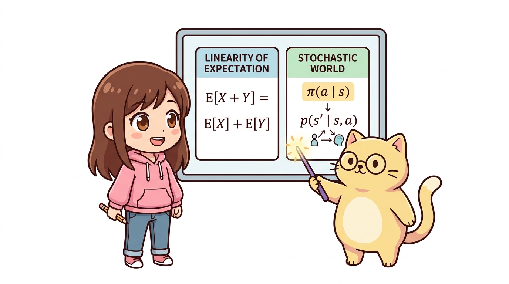

---

#### 🔍 구체적인 예제로 [식 06.6]의 의미 파헤치기

그럼 이제 분리해낸 [식 06.6]의 두 항을 하나씩 차근차근 구하며 수식의 비밀을 밝혀봅시다.

먼저 첫 번째 항인 **E***π*[*R**t* | *S**t* = *s*]부터 시작하겠습니다. 

이 식은 **"현재 상태 *s*에서 에이전트가 자신의 정책 *π*에 따라 어떤 행동을 선택했을 때, 즉시 얻게 될 즉각 보상 *R**t*의 평균값(기댓값)"**을 의미합니다. 

  

    🎧
    대화 음성 듣기 (도로시 & 지니)
  

  

    <button type="button" class="btn-audio-play" style="background: #0284c7; color: #ffffff; border: none; border-radius: 16px; padding: 5px 13px; font-size: 0.82rem; font-weight: 600; cursor: pointer; display: inline-flex; align-items: center; gap: 4px; box-shadow: 0 1px 2px rgba(2,132,199,0.3);">
      ▶️ 재생
    </button>
    <button type="button" class="btn-audio-stop" style="background: #e2e8f0; color: #475569; border: none; border-radius: 16px; padding: 5px 11px; font-size: 0.82rem; font-weight: 600; cursor: pointer; display: inline-flex; align-items: center; gap: 4px;">
      ⏹️ 정지
    </button>
  

  <audio src="./audio/dialogue_6_2_scene25.mp3" preload="none"></audio>

> 👧 **도로시**: "첫 번째 항인 $\mathbb{E}_\pi[R_t \mid S_t = s]$는 현재 상태 $s$에서 정책에 따라 행동했을 때 당장 주어지는 사과 보상의 평균값이구나!"
> 
> 🐱 **지니**: "정확해 도로시! 에이전트가 어떤 행동을 고를 확률과 그에 따라 상태가 바뀌어 보상을 받을 확률을 2단계 주사위-동전처럼 계산하면 된단다!"

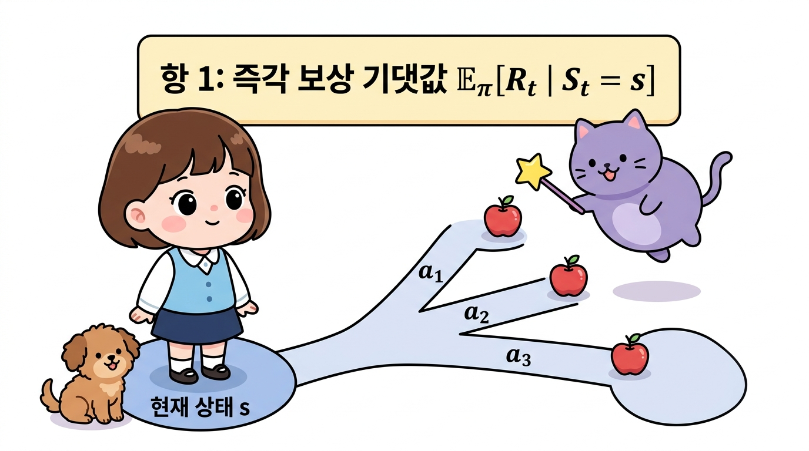

---

#### 상태와 행동 관계도

이해를 돕기 위해 아래의 상태와 행동 관계도를 함께 보시죠.

그림 06-5 상태와 행동의 관계

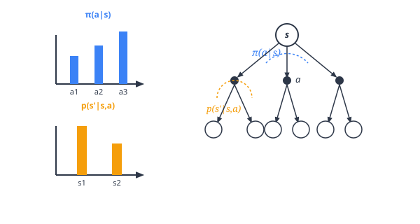

먼저 상황을 확인합니다.  현재 상태가 *s*이고, 에이전트는 정책 *π*(*a* | *s*)에 따라 행동합니다. 

---

#### 예를 들어 다음의 세 가지 행동을 취할 수 있다고 해봅시다.

$$
\pi(a = a_1 \mid s) = 0.2
$$
$$
\pi(a = a_2 \mid s) = 0.3
$$
$$
\pi(a = a_3 \mid s) = 0.5
$$

에이전트는 이 확률 분포에 따라 행동을 선택합니다. 

  

    🎧
    대화 음성 듣기 (도로시 & 지니)
  

  

    <button type="button" class="btn-audio-play" style="background: #0284c7; color: #ffffff; border: none; border-radius: 16px; padding: 5px 13px; font-size: 0.82rem; font-weight: 600; cursor: pointer; display: inline-flex; align-items: center; gap: 4px; box-shadow: 0 1px 2px rgba(2,132,199,0.3);">
      ▶️ 재생
    </button>
    <button type="button" class="btn-audio-stop" style="background: #e2e8f0; color: #475569; border: none; border-radius: 16px; padding: 5px 11px; font-size: 0.82rem; font-weight: 600; cursor: pointer; display: inline-flex; align-items: center; gap: 4px;">
      ⏹️ 정지
    </button>
  

  <audio src="./audio/dialogue_6_2_scene26.mp3" preload="none"></audio>

> 👧 **도로시**: "세 가지 행동 중 하나를 고르는 확률의 합도 $0.2 + 0.3 + 0.5 = 1.0$으로 딱 맞아떨어져!"
> 
> 🐱 **지니**: "그렇단다! 어떤 행동을 취하든 확률에 따라 골라지고, 각각 다른 전이와 보상으로 이어지게 되지!"

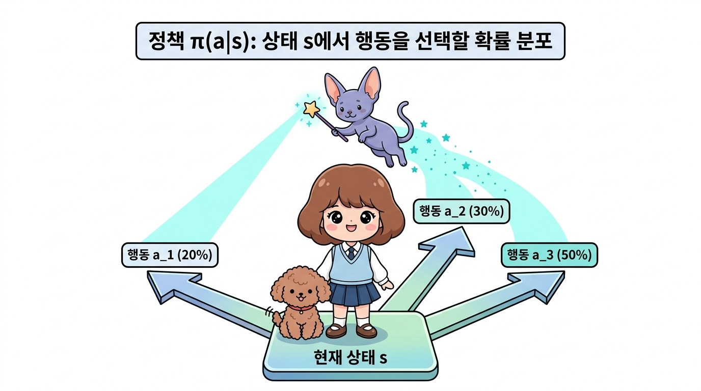

---

#### 그러면 상태 전이 확률 *p*(*s'* | *s*, *a*)에 따라 새로운 상태 *s'*로 이동합니다. 

예를 들어 행동 *a*1을 수행했을 때 전이될 수 있는 상태 후보가 두 개라면 다음과 같은 값을 취합니다.
$$
p(s' = s_1 \mid s, a = a_1) = 0.6
$$
$$
p(s' = s_2 \mid s, a = a_1) = 0.4
$$

그리고 마지막으로 보상은 *r*(*s*, *a*, *s'*) 함수로 결정됩니다. 

이상이 우리가 처한 상황입니다.

  

    🎧
    대화 음성 듣기 (도로시 & 지니)
  

  

    <button type="button" class="btn-audio-play" style="background: #0284c7; color: #ffffff; border: none; border-radius: 16px; padding: 5px 13px; font-size: 0.82rem; font-weight: 600; cursor: pointer; display: inline-flex; align-items: center; gap: 4px; box-shadow: 0 1px 2px rgba(2,132,199,0.3);">
      ▶️ 재생
    </button>
    <button type="button" class="btn-audio-stop" style="background: #e2e8f0; color: #475569; border: none; border-radius: 16px; padding: 5px 11px; font-size: 0.82rem; font-weight: 600; cursor: pointer; display: inline-flex; align-items: center; gap: 4px;">
      ⏹️ 정지
    </button>
  

  <audio src="./audio/dialogue_6_2_scene27.mp3" preload="none"></audio>

> 👧 **도로시**: "행동 $a_1$을 취해도 바람이 불거나 바닥이 미끄러우면 상태 $s_1$로 갈 수도 있고 $s_2$로 갈 수도 있는 거네?"
> 
> 🐱 **지니**: "그렇단다! 환경의 상태 변화 역시 확률적이기 때문에, '행동 선택 확률'에 '상태 전이 확률'을 곱해서 어떤 보상을 얻게 될지 계산해야 한단다!"

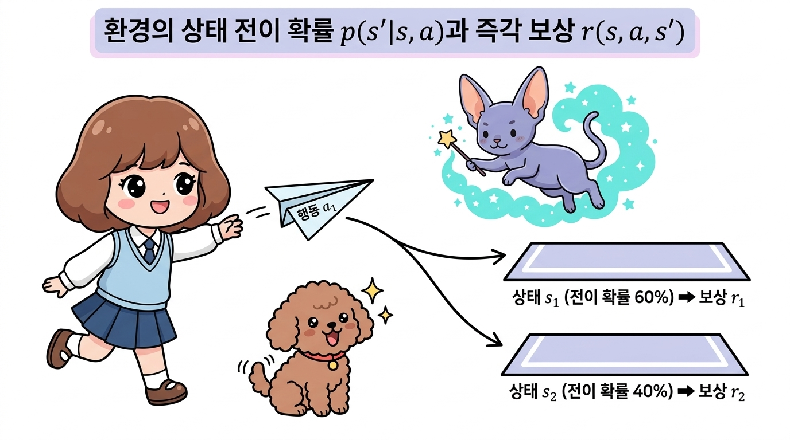

---

#### 이제 구체적인 예를 들어 계산해봅시다. 

에이전트가 0.2의 확률로 행동 *a*1을 선택하고 0.6의 확률로 상태 *s*1로 전이한다고 가정하죠. 이 경우 얻게 되는 보상은 다음과 같습니다.
• *π*(*a* = *a*1 | *s*)*p*(*s'* = *s*1 | *s*, *a* = *a*1) = 0.2 × 0.6 = 0.12의 확률로  
• *r*(*s*, *a* = *a*1, *s'* = *s*1)의 보상을 얻는다.  

기댓값을 구하려면 모든 후보에 똑같은 계산을 수행하여 다 더하면 됩니다.
$$
\mathbb{E}_{\pi}[R_t \mid S_t = s] = \sum_{a, s'} \pi(a \mid s) p(s' \mid s, a) r(s, a, s')
$$

이와 같이 '에이전트가 선택하는 행동의 확률' *π*(*a* | *s*)와 '전이되는 상태의 확률' *p*(*s'* | *s*, *a*) 그리고 '보상 함수' *r*(*s*, *a*, *s'*)를 곱합니다. 

이 계산을 모든 후보에 수행한 다음 다 더했습니다. 

  

    🎧
    대화 음성 듣기 (도로시 & 지니)
  

  

    <button type="button" class="btn-audio-play" style="background: #0284c7; color: #ffffff; border: none; border-radius: 16px; padding: 5px 13px; font-size: 0.82rem; font-weight: 600; cursor: pointer; display: inline-flex; align-items: center; gap: 4px; box-shadow: 0 1px 2px rgba(2,132,199,0.3);">
      ▶️ 재생
    </button>
    <button type="button" class="btn-audio-stop" style="background: #e2e8f0; color: #475569; border: none; border-radius: 16px; padding: 5px 11px; font-size: 0.82rem; font-weight: 600; cursor: pointer; display: inline-flex; align-items: center; gap: 4px;">
      ⏹️ 정지
    </button>
  

  <audio src="./audio/dialogue_6_2_scene28.mp3" preload="none"></audio>

> 👧 **도로시**: "결국 첫 번째 항은 '행동 확률 $\pi(a \mid s)$' × '전이 확률 $p(s' \mid s, a)$' × '보상 $r(s, a, s')$'을 모든 후보에 대해 곱해서 더한 거네!"
> 
> 🐱 **지니**: "완벽해 도로시! 앞서 풀었던 '주사위 눈 확률 × 동전 앞면 확률 × 보상'과 토시 하나 안 틀리고 똑같은 구조지!"

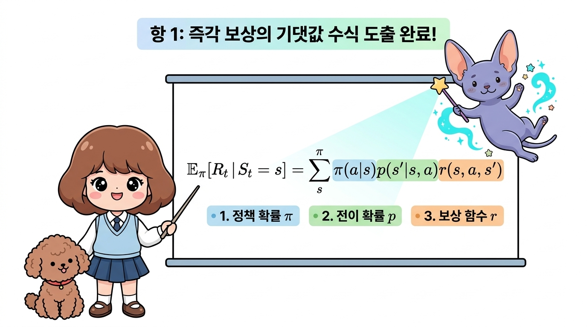

---

#### 잘 생각해보면 앞 절의 '주사위와 동전' 예제에서 보여준 수식과 같은 구조입니다.

이것으로 [식 06.6] 첫 번째 항의 전개는 완벽하게 정복했습니다(그림 06-6).

그림 06-6 식 06.6 전개 상태 지도

  

    🎧
    대화 음성 듣기 (도로시 & 지니)
  

  

    <button type="button" class="btn-audio-play" style="background: #0284c7; color: #ffffff; border: none; border-radius: 16px; padding: 5px 13px; font-size: 0.82rem; font-weight: 600; cursor: pointer; display: inline-flex; align-items: center; gap: 4px; box-shadow: 0 1px 2px rgba(2,132,199,0.3);">
      ▶️ 재생
    </button>
    <button type="button" class="btn-audio-stop" style="background: #e2e8f0; color: #475569; border: none; border-radius: 16px; padding: 5px 11px; font-size: 0.82rem; font-weight: 600; cursor: pointer; display: inline-flex; align-items: center; gap: 4px;">
      ⏹️ 정지
    </button>
  

  <audio src="./audio/dialogue_6_2_scene29.mp3" preload="none"></audio>

> 👧 **도로시**: "첫 번째 항인 즉각 보상 기댓값 전개를 완벽하게 풀었으니, 이제 절반 고지를 넘었어!"
> 
> 🐱 **지니**: "축하해 도로시! 이제 칠판의 오른쪽 화살표가 가리키는 두 번째 항 $\gamma \mathbb{E}_\pi[G_{t+1} \mid S_t = s]$을 향해 힘차게 나아갈 차례란다!"

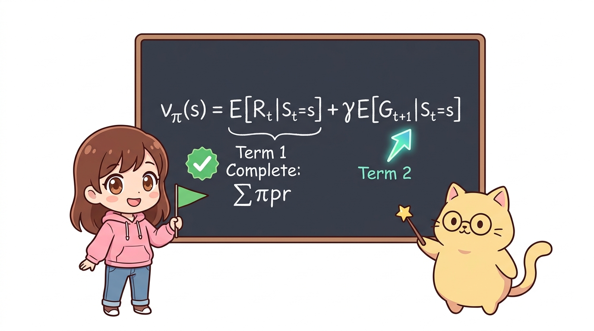

---

#### 이제 *γ* **E***π*[*G**t*+1 | *S**t* = *s*]가 남았습니다. 

여기서 *γ*는 상수이므로 **E***π*[*G**t*+1 | *S**t* = *s*]에 대해서만 살펴보죠. 

이 식은 상태 가치 함수의 정의식과 비슷하지만 *G**t*+1 부분이 다릅니다. 상태 가치 함수는 다음과 같이 *G**t*+1이 아니라 *G**t*였습니다.
$$
v_{\pi}(s) = \mathbb{E}_{\pi}[G_t \mid S_t = s]
$$

[식 06.5]

  

    🎧
    대화 음성 듣기 (도로시 & 지니)
  

  

    <button type="button" class="btn-audio-play" style="background: #0284c7; color: #ffffff; border: none; border-radius: 16px; padding: 5px 13px; font-size: 0.82rem; font-weight: 600; cursor: pointer; display: inline-flex; align-items: center; gap: 4px; box-shadow: 0 1px 2px rgba(2,132,199,0.3);">
      ▶️ 재생
    </button>
    <button type="button" class="btn-audio-stop" style="background: #e2e8f0; color: #475569; border: none; border-radius: 16px; padding: 5px 11px; font-size: 0.82rem; font-weight: 600; cursor: pointer; display: inline-flex; align-items: center; gap: 4px;">
      ⏹️ 정지
    </button>
  

  <audio src="./audio/dialogue_6_2_scene30.mp3" preload="none"></audio>

> 👧 **도로시**: "돋보기로 들여다보니 정말 그렇네! 원래 상태 가치 함수는 시간 $t$ 기준의 $G_t$인데, 두 번째 항은 다음 시간인 $G_{t+1}$이라 시간 인덱스가 서로 달라!"
> 
> 🐱 **지니**: "날카로운 관찰이야! '현재 상태($S_t=s$)'의 조건에서 '다음 시간의 수익($G_{t+1}$)'을 기대하고 있으니, 이 시간 차이를 맞춰주는 묘수가 필요하단다!"

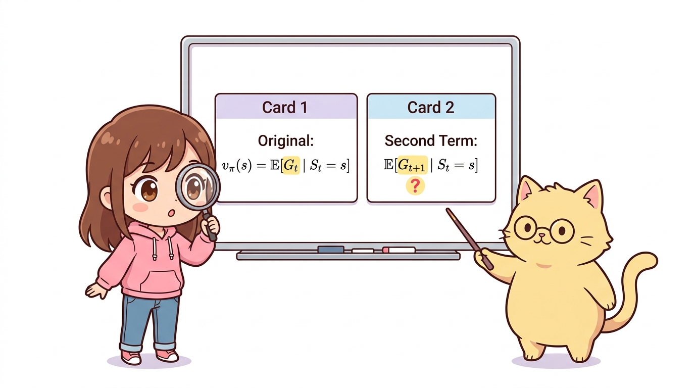

---

#### 먼저 [식 06.5]의 *t*에 *t* + 1을 대입합니다.

$$
v_{\pi}(s) = \mathbb{E}_{\pi}[G_{t+1} \mid S_{t+1} = s]
$$

이 식은 상태 *S**t*+1 = *s*에서의 가치 함수입니다. 

이제 우리의 관심은 **E***π*[*G**t*+1 | *S**t* = *s*]입니다. 

이 식은 현재 시간이 *t*일 때 한 단위 뒤 시간(*t*+1)의 기대 수익을 뜻합니다. 문제 해결의 핵심은 조건인 *S**t* = *s*를 *S**t*+1 = *s'* 형태로 바꾸는 것입니다. 

즉, 시간을 한 단위만큼 흘려보내는 것입니다.

  

    🎧
    대화 음성 듣기 (도로시 & 지니)
  

  

    <button type="button" class="btn-audio-play" style="background: #0284c7; color: #ffffff; border: none; border-radius: 16px; padding: 5px 13px; font-size: 0.82rem; font-weight: 600; cursor: pointer; display: inline-flex; align-items: center; gap: 4px; box-shadow: 0 1px 2px rgba(2,132,199,0.3);">
      ▶️ 재생
    </button>
    <button type="button" class="btn-audio-stop" style="background: #e2e8f0; color: #475569; border: none; border-radius: 16px; padding: 5px 11px; font-size: 0.82rem; font-weight: 600; cursor: pointer; display: inline-flex; align-items: center; gap: 4px;">
      ⏹️ 정지
    </button>
  

  <audio src="./audio/dialogue_6_2_scene31.mp3" preload="none"></audio>

> 👧 **도로시**: "지니, 두 번째 항의 $G_{t+1}$은 다음 시간의 미래 수익인데, 현재 상태 조건($S_t = s$)과 시간이 서로 달라서 계산하기 까다로워 보여!"
> 
> 🐱 **지니**: "시간을 딱 한 걸음만 앞으로 흘려보내 보렴! 다음 턴에 도착할 상태를 $S_{t+1} = s'$라고 두면, 그 상태에서 기대되는 미래 수익 $\mathbb{E}[G_{t+1} \mid S_{t+1} = s']$은 바로 **'다음 상태의 가치 $v_\pi(s')$'** 그 자체가 된단다!"

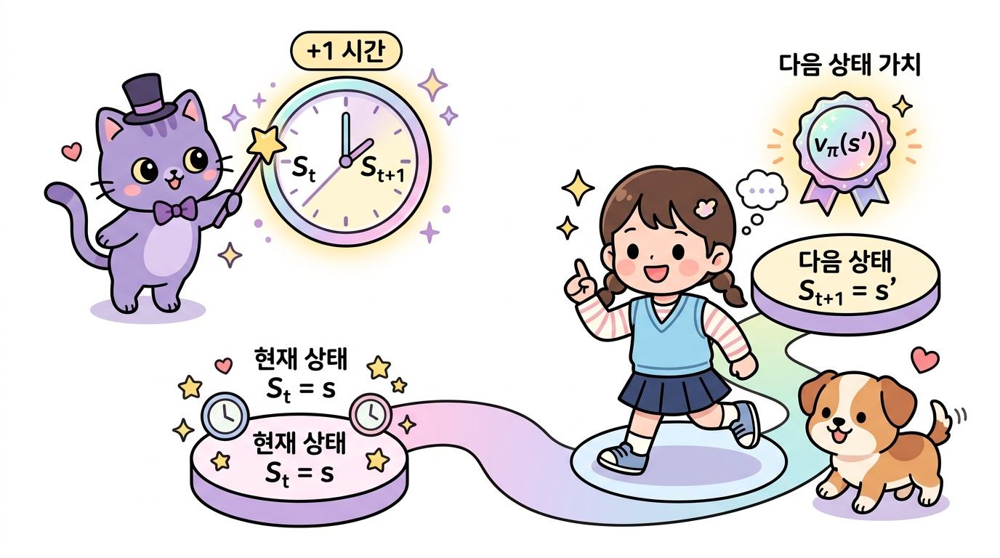

---

#### 앞서와 마찬가지로 구체적인 예를 들어 설명하겠습니다. 

지금 에이전트의 상태는 *S**t* = *s*입니다. 그리고 에이전트가 0.2의 확률로 *a*1 행동을 선택하고, 0.6의 확률로 *s*1 상태로 전이한다고 해봅시다. 

그러면 다음과 같이 나타낼 수 있습니다.

• *π*(*a* = *a*1 | *s*)*p*(*s'* = *s*1 | *s*, *a* = *a*1) = 0.2 × 0.6 = 0.12의 확률로  
• **E***π*[*G**t*+1 | *S**t*+1 = *s*1] = *v**π*(*s*1)로 전이된다.  

이와 같이 다음 단계의 시간을 '보는' 것으로 다음 상태의 가치 함수를 얻을 수 있습니다. 

  

    🎧
    대화 음성 듣기 (도로시 & 지니)
  

  

    <button type="button" class="btn-audio-play" style="background: #0284c7; color: #ffffff; border: none; border-radius: 16px; padding: 5px 13px; font-size: 0.82rem; font-weight: 600; cursor: pointer; display: inline-flex; align-items: center; gap: 4px; box-shadow: 0 1px 2px rgba(2,132,199,0.3);">
      ▶️ 재생
    </button>
    <button type="button" class="btn-audio-stop" style="background: #e2e8f0; color: #475569; border: none; border-radius: 16px; padding: 5px 11px; font-size: 0.82rem; font-weight: 600; cursor: pointer; display: inline-flex; align-items: center; gap: 4px;">
      ⏹️ 정지
    </button>
  

  <audio src="./audio/dialogue_6_2_scene32.mp3" preload="none"></audio>

> 👧 **도로시**: "행동 $a_1$을 고르고 상태 $s_1$로 갈 확률이 $0.2 \times 0.6 = 0.12$이고, 그 상태에 도착했을 때의 미래 가치가 바로 $v_\pi(s_1)$이 되는구나!"
> 
> 🐱 **지니**: "정확해 도로시! 이렇게 특정 한 경로($s \to a_1 \to s_1$)에서 얻는 기대 미래 가치는 '경로 확률(0.12) × 다음 상태 가치 $v_\pi(s_1)$'로 딱 떨어지게 된단다!"

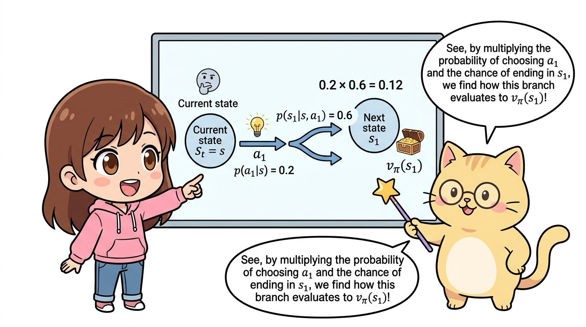

---

#### 이제 기댓값 **E***π*[*G**t*+1 | *S**t* = *s*]를 구하려면 모든 후보에 이 계산을 수행하여 다 더합니다.

$$
\mathbb{E}_{\pi}[G_{t+1} \mid S_t = s] = \sum_{a, s'} \pi(a \mid s) p(s' \mid s, a) \mathbb{E}_{\pi}[G_{t+1} \mid S_{t+1} = s']
$$
$$
= \sum_{a, s'} \pi(a \mid s) p(s' \mid s, a) v_{\pi}(s')
$$

두 번째 항 전개도 마쳤습니다. 

  

    🎧
    대화 음성 듣기 (도로시 & 지니)
  

  

    <button type="button" class="btn-audio-play" style="background: #0284c7; color: #ffffff; border: none; border-radius: 16px; padding: 5px 13px; font-size: 0.82rem; font-weight: 600; cursor: pointer; display: inline-flex; align-items: center; gap: 4px; box-shadow: 0 1px 2px rgba(2,132,199,0.3);">
      ▶️ 재생
    </button>
    <button type="button" class="btn-audio-stop" style="background: #e2e8f0; color: #475569; border: none; border-radius: 16px; padding: 5px 11px; font-size: 0.82rem; font-weight: 600; cursor: pointer; display: inline-flex; align-items: center; gap: 4px;">
      ⏹️ 정지
    </button>
  

  <audio src="./audio/dialogue_6_2_scene33.mp3" preload="none"></audio>

> 👧 **도로시**: "아하! 방금 계산한 단일 경로들을 시그마($\sum_{a, s'}$)로 몽땅 합치니까, 미래의 복잡한 수익들을 일일이 계산할 필요 없이 '다음 칸들의 가치 $v_\pi(s')$'의 가중평균으로 깔끔하게 정리되었어!"
> 
> 🐱 **지니**: "정답이야! 이것이 바로 미래의 모든 가치를 다음 한 걸음의 상태 가치들로 압축해 끌어당기는 동적 계획법의 놀라운 지혜란다!"

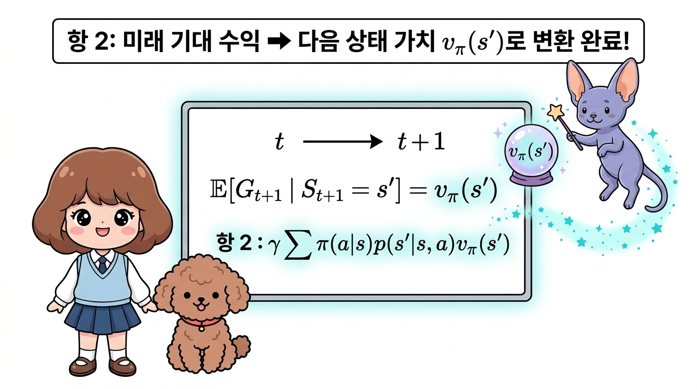

---

#### 앞서 전개한 식에 대입하면 다음 식이 도출됩니다.

$$
v_{\pi}(s) = \mathbb{E}_{\pi}[R_t \mid S_t = s] + \gamma \mathbb{E}_{\pi}[G_{t+1} \mid S_t = s]
$$
$$
= \sum_{a, s'} \pi(a \mid s) p(s' \mid s, a) r(s, a, s') + \gamma \sum_{a, s'} \pi(a \mid s) p(s' \mid s, a) v_{\pi}(s')
$$
$$
= \sum_{a, s'} \pi(a \mid s) p(s' \mid s, a) \{ r(s, a, s') + \gamma v_{\pi}(s') \}
$$

[식 06.7]이 바로 벨만 방정식입니다. 

  

    🎧
    대화 음성 듣기 (도로시 & 지니)
  

  

    <button type="button" class="btn-audio-play" style="background: #0284c7; color: #ffffff; border: none; border-radius: 16px; padding: 5px 13px; font-size: 0.82rem; font-weight: 600; cursor: pointer; display: inline-flex; align-items: center; gap: 4px; box-shadow: 0 1px 2px rgba(2,132,199,0.3);">
      ▶️ 재생
    </button>
    <button type="button" class="btn-audio-stop" style="background: #e2e8f0; color: #475569; border: none; border-radius: 16px; padding: 5px 11px; font-size: 0.82rem; font-weight: 600; cursor: pointer; display: inline-flex; align-items: center; gap: 4px;">
      ⏹️ 정지
    </button>
  

  <audio src="./audio/dialogue_6_2_scene34.mp3" preload="none"></audio>

> 👧 **도로시**: "지니! 첫 번째 항(즉각 보상)과 두 번째 항(할인된 다음 상태 가치)을 하나로 묶었더니 드디어 [식 06.7] 벨만 방정식이 완성되었어!"
> 
> 🐱 **지니**: "축하해 도로시! '현재 상태 가치 $v_\pi(s)$'를 '다음 상태들의 가치 $v_\pi(s')$'와의 재귀적 순환 점화식으로 풀어낸 강화학습 역사상 가장 위대한 방정식의 정상에 오른 거란다!"

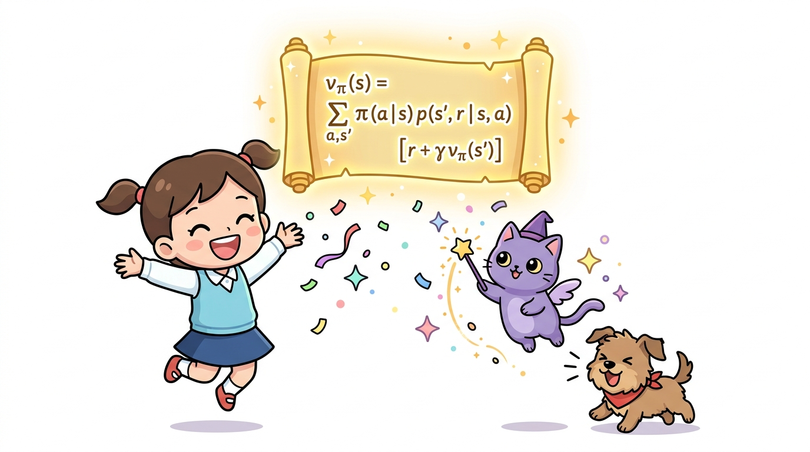

---

벨만 방정식은 '상태 *s*의 상태 가치 함수'와 '다음에 취할 수 있는 상태 *s'*의 상태 가치 함수'의 관계를 나타낸 식으로, 모든 상태 *s*와 모든 정책 *π*에 대해 성립합니다.

  

    🎧
    대화 음성 듣기 (도로시 & 지니)
  

  

    <button type="button" class="btn-audio-play" style="background: #0284c7; color: #ffffff; border: none; border-radius: 16px; padding: 5px 13px; font-size: 0.82rem; font-weight: 600; cursor: pointer; display: inline-flex; align-items: center; gap: 4px; box-shadow: 0 1px 2px rgba(2,132,199,0.3);">
      ▶️ 재생
    </button>
    <button type="button" class="btn-audio-stop" style="background: #e2e8f0; color: #475569; border: none; border-radius: 16px; padding: 5px 11px; font-size: 0.82rem; font-weight: 600; cursor: pointer; display: inline-flex; align-items: center; gap: 4px;">
      ⏹️ 정지
    </button>
  

  <audio src="./audio/dialogue_6_2_scene35.mp3" preload="none"></audio>

> 👧 **도로시**: "현재 칸 $s$의 가치 $v_\pi(s)$가 다음 칸들 $s'$의 가치 $v_\pi(s')$와 거울처럼 맞물려서 순환하는 모습이 정말 아름다워!"
> 
> 🐱 **지니**: "맞아! 상태 공간 전체가 서로의 가치를 참조하며 균형을 이루는 이 점화식이 바로 벨만 방정식의 진정한 힘이란다!"

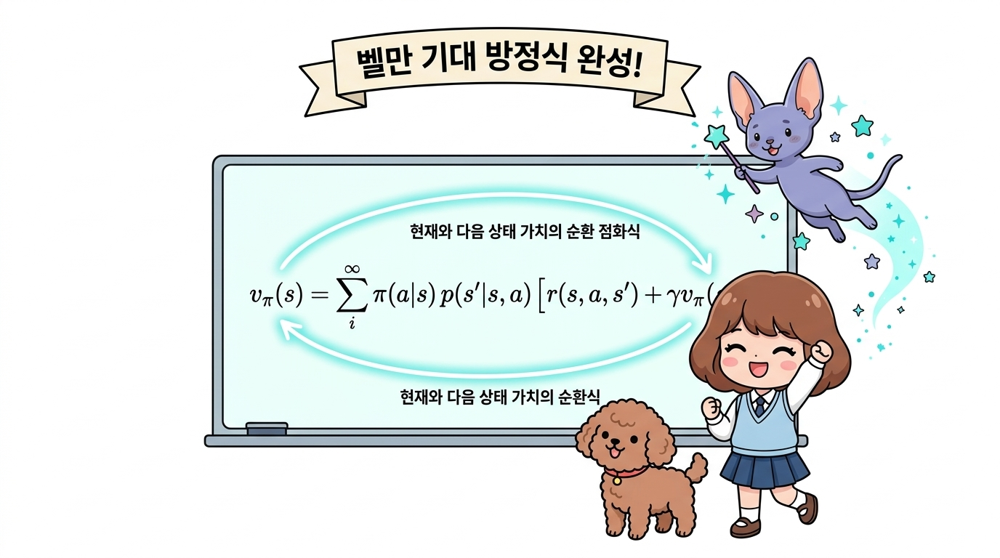

---

이 식을 백업 다이어그램을 활용하여 각 수식의 항들이 의미하는 바를 시각적으로 매칭해 정리하면 다음과 같습니다.

그림 06-6a 벨만 방정식의 백업 다이어그램 상세 구조

  

    🎧
    대화 음성 듣기 (도로시 & 지니)
  

  

    <button type="button" class="btn-audio-play" style="background: #0284c7; color: #ffffff; border: none; border-radius: 16px; padding: 5px 13px; font-size: 0.82rem; font-weight: 600; cursor: pointer; display: inline-flex; align-items: center; gap: 4px; box-shadow: 0 1px 2px rgba(2,132,199,0.3);">
      ▶️ 재생
    </button>
    <button type="button" class="btn-audio-stop" style="background: #e2e8f0; color: #475569; border: none; border-radius: 16px; padding: 5px 11px; font-size: 0.82rem; font-weight: 600; cursor: pointer; display: inline-flex; align-items: center; gap: 4px;">
      ⏹️ 정지
    </button>
  

  <audio src="./audio/dialogue_6_2_scene36.mp3" preload="none"></audio>

> 👧 **도로시**: "백업 다이어그램을 보니 위에서 아래로 확률을 곱하며 가지가 뻗어나가고, 반대로 아래의 보상과 미래 가치가 위로 올라와(Backup) 현재 가치를 채워주는 느낌이야!"
> 
> 🐱 **지니**: "정확한 직관이야! 그래서 '정보를 아래에서 위로 퍼 올린다'는 뜻으로 **백업(Backup)**이라는 멋진 이름이 붙은 거란다!"

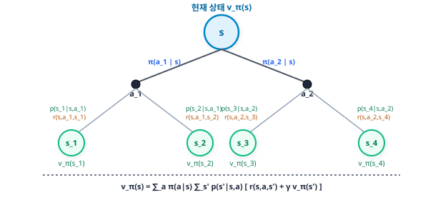

위 [그림 06-6a]에서 보듯, 벨만 방정식은 상태 *s*에서 발생할 수 있는 모든 행동 *a*와 그에 따른 다음 상태 *s'*에 대해 **"확률 × (보상 + 할인된 다음 상태 가치)"**를 재귀적으로 합산하여 현재 가치 *v**π*(*s*)를 도출해내는 완벽한 흐름을 표현하고 있습니다.

---

## 06.2.3 핵심정리

  

    🎧
    대화 음성 듣기 (도로시 & 지니)
  

  

    <button type="button" class="btn-audio-play" style="background: #0284c7; color: #ffffff; border: none; border-radius: 16px; padding: 5px 13px; font-size: 0.82rem; font-weight: 600; cursor: pointer; display: inline-flex; align-items: center; gap: 4px; box-shadow: 0 1px 2px rgba(2,132,199,0.3);">
      ▶️ 재생
    </button>
    <button type="button" class="btn-audio-stop" style="background: #e2e8f0; color: #475569; border: none; border-radius: 16px; padding: 5px 11px; font-size: 0.82rem; font-weight: 600; cursor: pointer; display: inline-flex; align-items: center; gap: 4px;">
      ⏹️ 정지
    </button>
  

  <audio src="./audio/dialogue_6_2_scene37.mp3" preload="none"></audio>

> 👧 **도로시**: "주사위와 동전 2단계 게임에서 출발해서, 수익의 재귀적 분해, 기댓값의 선형성을 거쳐 벨만 방정식을 완주하니까 공식 하나하나의 의미가 가슴에 쏙쏙 와닿아!"
> 
> 🐱 **지니**: "정말 뿌듯하지 도로시? 이제 이 강력한 벨만 기대 방정식을 무기 삼아, 다음 06.3절에서는 행동 가치 $Q$ 함수와 최적 정책을 찾는 **벨만 최적 방정식**의 신비로운 모험을 떠나보자꾸나!"

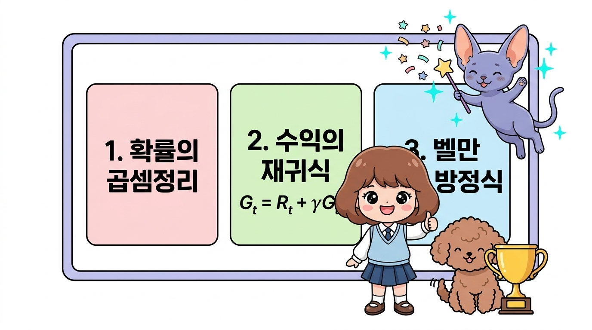

이번 06.2절에서는 강화학습의 이론적 심장인 **벨만 기대 방정식(Bellman Expectation Equation)**을 처음부터 끝까지 수학적으로 도출하는 과정을 완주했습니다.

#### 1. 확률과 기댓값 (복습)

• **주요 수식**:
$$
p(x, y) = p(x) p(y \mid x)
$$
$$
\mathbb{E}[r] = \sum_x \sum_y p(x) p(y \mid x) r(x, y)
$$

• **핵심 직관**: 2단계 연속 사건의 동시 확률은 '첫 사건 확률 × 조건부 확률'이며, 기댓값은 모든 경로의 '확률 × 보상'을 곱해 더한 가중 평균합입니다.

#### 2. 수익의 재귀적 분해

• **주요 수식**:
$$
G_t = R_t + \gamma G_{t+1}
$$

• **핵심 직관**: 무한한 미래 보상의 합을 **"지금 당장 받는 즉각 보상 $R_t$"**과 **"할인된 다음 턴 이후의 미래 수익 $\gamma G_{t+1}$"**로 분할하여 벨만 점화식의 토대를 마련합니다.

#### 3. 기댓값의 선형성 적용

• **주요 수식**:
$$
v_\pi(s) = \mathbb{E}_\pi[R_t \mid S_t = s] + \gamma \mathbb{E}_\pi[G_{t+1} \mid S_t = s]
$$

• **핵심 직관**: 덧셈에 대한 기댓값 분리 성질($\mathbb{E}[X + Y] = \mathbb{E}[X] + \mathbb{E}[Y]$)을 통해 복잡한 기대 수익을 '즉각 보상 기댓값'과 '미래 가치 기댓값'이라는 독립된 두 개의 항으로 전개합니다.

#### 4. 항 1: 즉각 보상 기댓값 도출

• **주요 수식**:
$$
\mathbb{E}_\pi[R_t \mid S_t = s] = \sum_{a, s'} \pi(a \mid s) p(s' \mid s, a) r(s, a, s')
$$

• **핵심 직관**: 에이전트의 정책 확률 $\pi$로 행동 $a$를 고르고 환경의 상태 전이 확률 $p$로 새로운 상태 $s'$로 이동할 때 얻는 즉시 보상 $r(s, a, s')$의 가중 평균을 구합니다.

#### 5. 항 2: 미래 가치 기댓값 도출

• **주요 수식**:
$$
\gamma \mathbb{E}_\pi[G_{t+1} \mid S_t = s] = \gamma \sum_{a, s'} \pi(a \mid s) p(s' \mid s, a) v_\pi(s')
$$

• **핵심 직관**: 다음 상태 $s'$에 도착했을 때 기대되는 미래 수익은 곧 그 상태의 가치 함수 $v_\pi(s')$와 동일하므로, 시간을 한 걸음 앞으로 흘려보내 다음 상태들의 가치 기댓값으로 표현합니다.

#### 6. 벨만 기대 방정식 완성

• **주요 수식**:
$$
v_\pi(s) = \sum_{a, s'} \pi(a \mid s) p(s' \mid s, a) \left[ r(s, a, s') + \gamma v_\pi(s') \right]
$$

• **핵심 직관**: **현재 상태의 가치 $v_\pi(s)$**를 **다음 상태들의 가치 $v_\pi(s')$**들과의 재귀적 관계로 묶어주는 강화학습의 핵심 순환 점화식이 완성됩니다.

> 💡 **다음 절 예고**: 
> 이제 우리는 벨만 기대 방정식이라는 강력한 뼈대를 세웠습니다. 다음 06.3절에서는 **상태-행동 가치 함수(Q 함수)**에 대한 벨만 방정식과, 최적의 정책을 찾아내는 **벨만 최적 방정식(Bellman Optimality Equation)**으로 한 걸음 더 깊이 들어가 보겠습니다!

