# 06.3 벨만 방정식의 예

벨만 방정식 점화식을 기반으로 상태 가치 함수들을 구하기 위해 실제로 **연립방정식(Simultaneous Equations)**을 구축하고 해결하는 예제를 배웁니다. 

도로시의 블록 저울 조율 마법과 지니의 대수학 칠판 계산법을 통해 벨만 방정식의 수치적 해법을 통쾌하게 정복해봅시다!

  

    🎧
    대화 음성 듣기 (도로시 & 지니)
  

  

    <button type="button" class="btn-audio-play" style="background: #0284c7; color: #ffffff; border: none; border-radius: 16px; padding: 5px 13px; font-size: 0.82rem; font-weight: 600; cursor: pointer; display: inline-flex; align-items: center; gap: 4px; box-shadow: 0 1px 2px rgba(2,132,199,0.3);">
      ▶️ 재생
    </button>
    <button type="button" class="btn-audio-stop" style="background: #e2e8f0; color: #475569; border: none; border-radius: 16px; padding: 5px 11px; font-size: 0.82rem; font-weight: 600; cursor: pointer; display: inline-flex; align-items: center; gap: 4px;">
      ⏹️ 정지
    </button>
  

  <audio src="./audio/dialogue_6_3_scene1.mp3" preload="none"></audio>

> 👧 **도로시**: "지니! 지난번에 유도한 벨만 방정식으로 진짜 상태 가치를 구할 수 있는 거야?"
> 
> 🐱 **지니**: "그럼 도로시! 벨만 방정식은 미지수가 들어있는 연립방정식이라서, 대수학 마법으로 정확한 수치를 척척 풀어낼 수 있단다!"

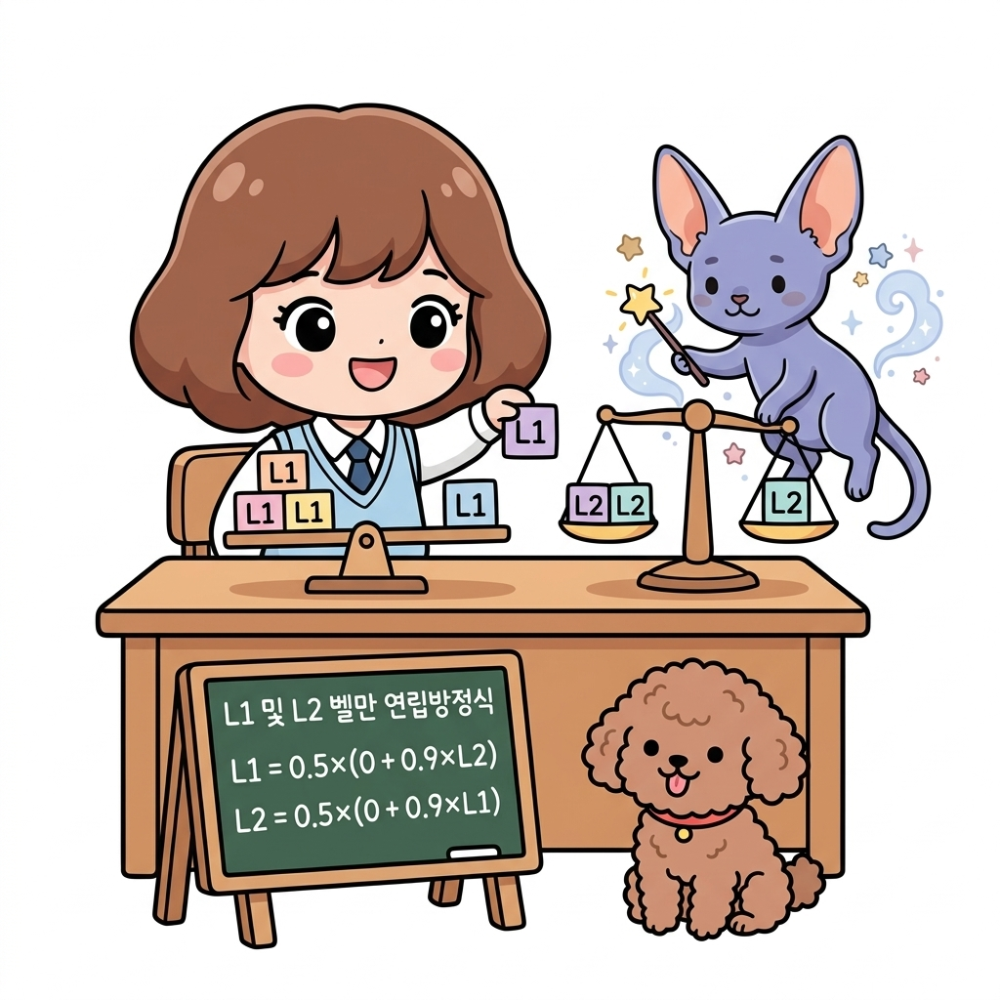

**그림 06-3** X와 Y 블록이 얹혀 있는 마법 저울들의 수평을 지팡이로 정교하게 맞추어 연립방정식을 연산하는 도로시와 지니

---

벨만 방정식은 강화 학습 문제를 풀기 위한 중요한 기초를 제공합니다. 

벨만 방정식을 이용하면 상태 가치 함수를 구할 수 있죠. 

이번 절에서는 그 '위력'을 보여주기 위해 벨만 방정식을 이용해 실제로 문제를 풀어보겠습니다.

  

    🎧
    대화 음성 듣기 (도로시 & 지니)
  

  

    <button type="button" class="btn-audio-play" style="background: #0284c7; color: #ffffff; border: none; border-radius: 16px; padding: 5px 13px; font-size: 0.82rem; font-weight: 600; cursor: pointer; display: inline-flex; align-items: center; gap: 4px; box-shadow: 0 1px 2px rgba(2,132,199,0.3);">
      ▶️ 재생
    </button>
    <button type="button" class="btn-audio-stop" style="background: #e2e8f0; color: #475569; border: none; border-radius: 16px; padding: 5px 11px; font-size: 0.82rem; font-weight: 600; cursor: pointer; display: inline-flex; align-items: center; gap: 4px;">
      ⏹️ 정지
    </button>
  

  <audio src="./audio/dialogue_6_3_scene2.mp3" preload="none"></audio>

> 👧 **도로시**: "벨만 방정식의 위력을 직접 눈으로 확인해보고 싶어!"
> 
> 🐱 **지니**: "좋아! 복잡한 미래의 무한한 길을 단 두 개의 깔끔한 연립방정식으로 압축하는 마법을 보여줄게!"

---

### 06.3.1 두 칸짜리 그리드 월드

여기서 다룰 문제는 [그림 06-7]의 '두 칸짜리 그리드 월드'입니다. 

그림 06-7 두 칸짜리 그리드 월드(벽에 부딪히면 -1, 사과를 얻으면 +1, 사과는 계속 생성)

  

    🎧
    대화 음성 듣기 (도로시 & 지니)
  

  

    <button type="button" class="btn-audio-play" style="background: #0284c7; color: #ffffff; border: none; border-radius: 16px; padding: 5px 13px; font-size: 0.82rem; font-weight: 600; cursor: pointer; display: inline-flex; align-items: center; gap: 4px; box-shadow: 0 1px 2px rgba(2,132,199,0.3);">
      ▶️ 재생
    </button>
    <button type="button" class="btn-audio-stop" style="background: #e2e8f0; color: #475569; border: none; border-radius: 16px; padding: 5px 11px; font-size: 0.82rem; font-weight: 600; cursor: pointer; display: inline-flex; align-items: center; gap: 4px;">
      ⏹️ 정지
    </button>
  

  <audio src="./audio/dialogue_6_3_scene3.mp3" preload="none"></audio>

> 👧 **도로시**: "L1과 L2, 딱 두 칸짜리 격자 세상이네? 룰은 어떻게 돼?"
> 
> 🐱 **지니**: "벽에 쾅 부딪히면 벌점 -1점이고, 탐스러운 사과를 따먹으면 보너스 +1점이야! 사과는 먹어도 계속 새로 열린단다!"

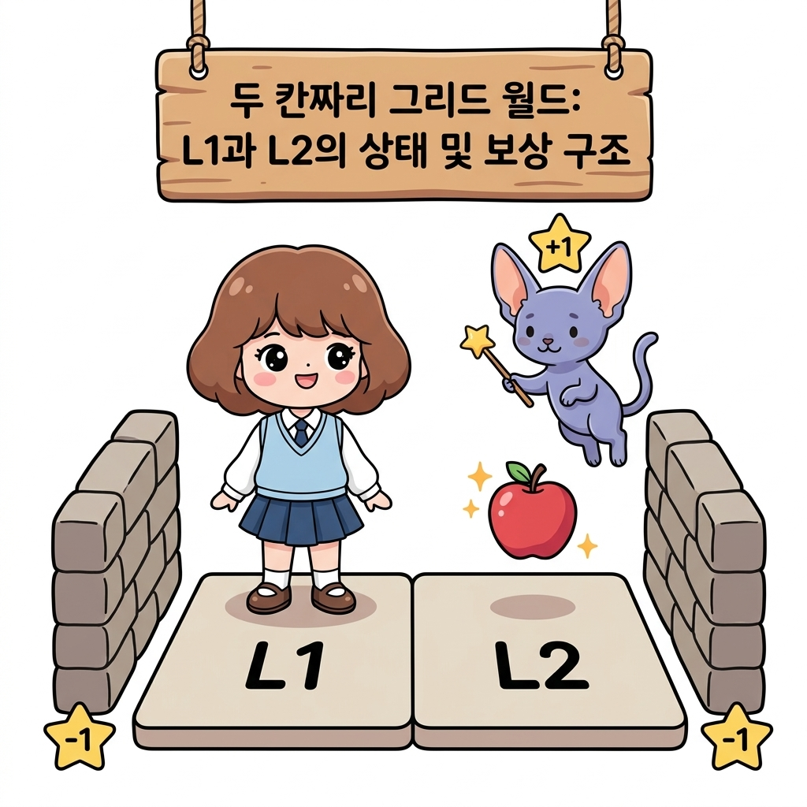

---

#### 문제의 시작

이번에는 에이전트가 무작위로 움직인다고 가정합니다. 

즉 50%의 확률로는 오른쪽, 나머지 50%의 확률로 왼쪽으로 이동합니다.

  

    🎧
    대화 음성 듣기 (도로시 & 지니)
  

  

    <button type="button" class="btn-audio-play" style="background: #0284c7; color: #ffffff; border: none; border-radius: 16px; padding: 5px 13px; font-size: 0.82rem; font-weight: 600; cursor: pointer; display: inline-flex; align-items: center; gap: 4px; box-shadow: 0 1px 2px rgba(2,132,199,0.3);">
      ▶️ 재생
    </button>
    <button type="button" class="btn-audio-stop" style="background: #e2e8f0; color: #475569; border: none; border-radius: 16px; padding: 5px 11px; font-size: 0.82rem; font-weight: 600; cursor: pointer; display: inline-flex; align-items: center; gap: 4px;">
      ⏹️ 정지
    </button>
  

  <audio src="./audio/dialogue_6_3_scene4.mp3" preload="none"></audio>

> 👧 **도로시**: "여기서 내가 왼쪽이나 오른쪽으로 반반의 확률로 걸어간다는 거지?"
> 
> 🐱 **지니**: "맞아! 반반, 즉 50% 확률로 왼쪽이나 오른쪽을 고르는 무작위 정책을 따르는 거야!"

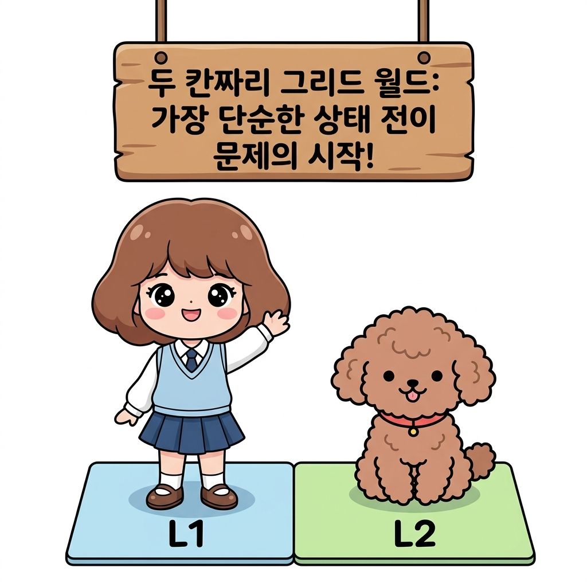

---

#### L1 기대수익

*v**π*(*L1*)은 상태 *L1*에서 무작위 정책 *π*에 따라 행동했을 때 얻을 수 있는 기대 수익입니다. 

이 기대 수익은 앞으로 **무한히** 지속되는 **보상의 총합**입니다. 

  

    🎧
    대화 음성 듣기 (도로시 & 지니)
  

  

    <button type="button" class="btn-audio-play" style="background: #0284c7; color: #ffffff; border: none; border-radius: 16px; padding: 5px 13px; font-size: 0.82rem; font-weight: 600; cursor: pointer; display: inline-flex; align-items: center; gap: 4px; box-shadow: 0 1px 2px rgba(2,132,199,0.3);">
      ▶️ 재생
    </button>
    <button type="button" class="btn-audio-stop" style="background: #e2e8f0; color: #475569; border: none; border-radius: 16px; padding: 5px 11px; font-size: 0.82rem; font-weight: 600; cursor: pointer; display: inline-flex; align-items: center; gap: 4px;">
      ⏹️ 정지
    </button>
  

  <audio src="./audio/dialogue_6_3_scene5.mp3" preload="none"></audio>

> 👧 **도로시**: "L1에서 출발해서 영원히 움직이면 받을 수 있는 기대 수익은 어떻게 계산할까?"
> 
> 🐱 **지니**: "앞으로 무한히 계속해서 받을 미래 보상들의 총합인데, 끝없이 이어져서 직접 더하기는 불가능해 보여!"

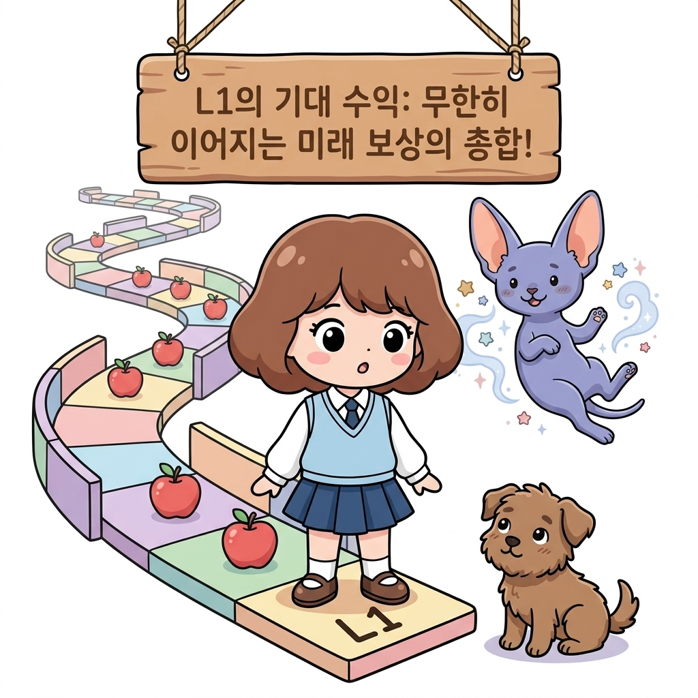

---

#### 백업 다이어그램부터 살펴보죠

그림 06-8 넓게 퍼져나가는 백업 다이어그램(이번 문제에서 상태는 결정적으로 전이됨)

  

    🎧
    대화 음성 듣기 (도로시 & 지니)
  

  

    <button type="button" class="btn-audio-play" style="background: #0284c7; color: #ffffff; border: none; border-radius: 16px; padding: 5px 13px; font-size: 0.82rem; font-weight: 600; cursor: pointer; display: inline-flex; align-items: center; gap: 4px; box-shadow: 0 1px 2px rgba(2,132,199,0.3);">
      ▶️ 재생
    </button>
    <button type="button" class="btn-audio-stop" style="background: #e2e8f0; color: #475569; border: none; border-radius: 16px; padding: 5px 11px; font-size: 0.82rem; font-weight: 600; cursor: pointer; display: inline-flex; align-items: center; gap: 4px;">
      ⏹️ 정지
    </button>
  

  <audio src="./audio/dialogue_6_3_scene6.mp3" preload="none"></audio>

> 👧 **도로시**: "우와, 백업 다이어그램을 그려보니까 가지가 끝도 없이 퍼져나가네!"
> 
> 🐱 **지니**: "한 걸음 걸을 때마다 두 갈래씩 영원히 뻗어나가니까, 나무처럼 거대해지는 무한 분기란다!"

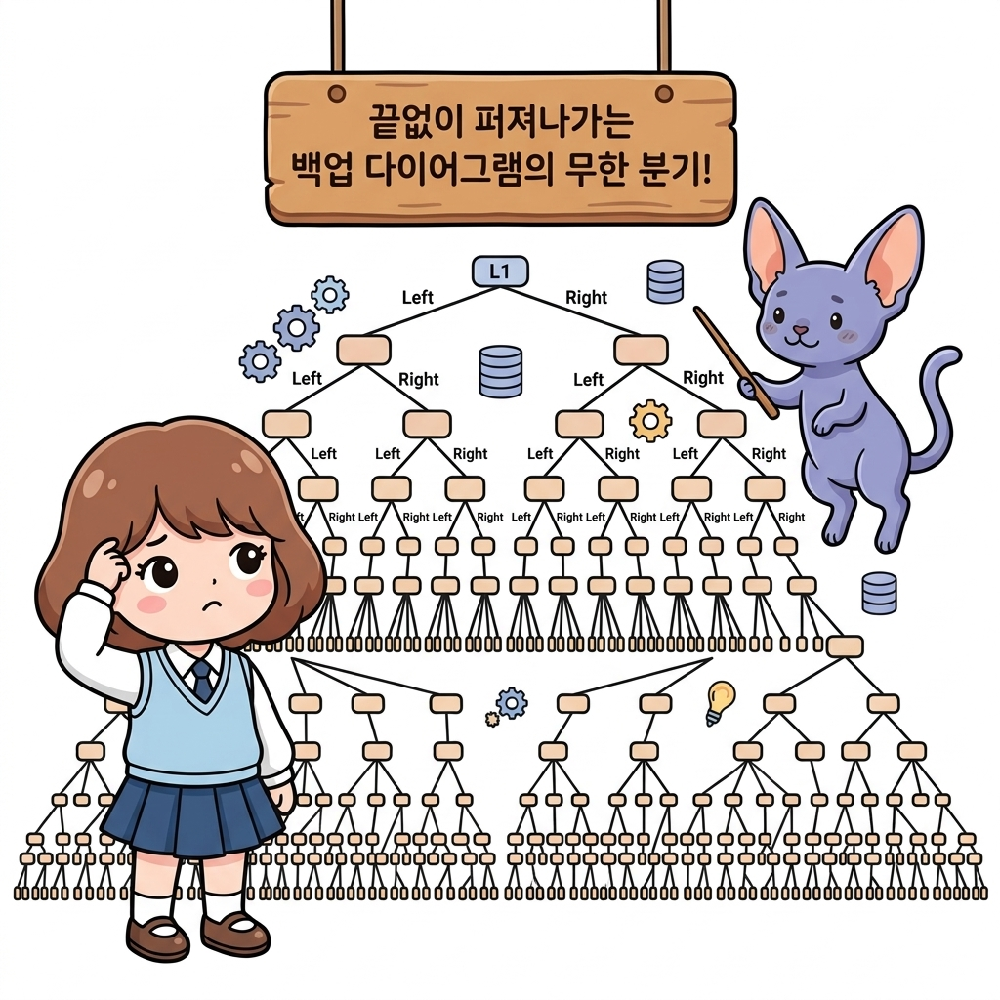

[그림 06-8]과 같이 지금 문제는 무한히 분기되어 뻗어나가는 계산입니다. 

---

#### 무한한 분기

이처럼 **무한히 분기**하는 계산을 벨만 방정식을 이용하여 구할 수 있습니다. 

  

    🎧
    대화 음성 듣기 (도로시 & 지니)
  

  

    <button type="button" class="btn-audio-play" style="background: #0284c7; color: #ffffff; border: none; border-radius: 16px; padding: 5px 13px; font-size: 0.82rem; font-weight: 600; cursor: pointer; display: inline-flex; align-items: center; gap: 4px; box-shadow: 0 1px 2px rgba(2,132,199,0.3);">
      ▶️ 재생
    </button>
    <button type="button" class="btn-audio-stop" style="background: #e2e8f0; color: #475569; border: none; border-radius: 16px; padding: 5px 11px; font-size: 0.82rem; font-weight: 600; cursor: pointer; display: inline-flex; align-items: center; gap: 4px;">
      ⏹️ 정지
    </button>
  

  <audio src="./audio/dialogue_6_3_scene7.mp3" preload="none"></audio>

> 👧 **도로시**: "다람쥐 쳇바퀴처럼 끝없는 무한 계산의 굴레에서 어떻게 빠져나오지?"
> 
> 🐱 **지니**: "바로 벨만 방정식이라는 마법 열쇠를 쓰면, 무한한 미래가 단 하나의 징검다리 점화식으로 쏙 정리된단다!"

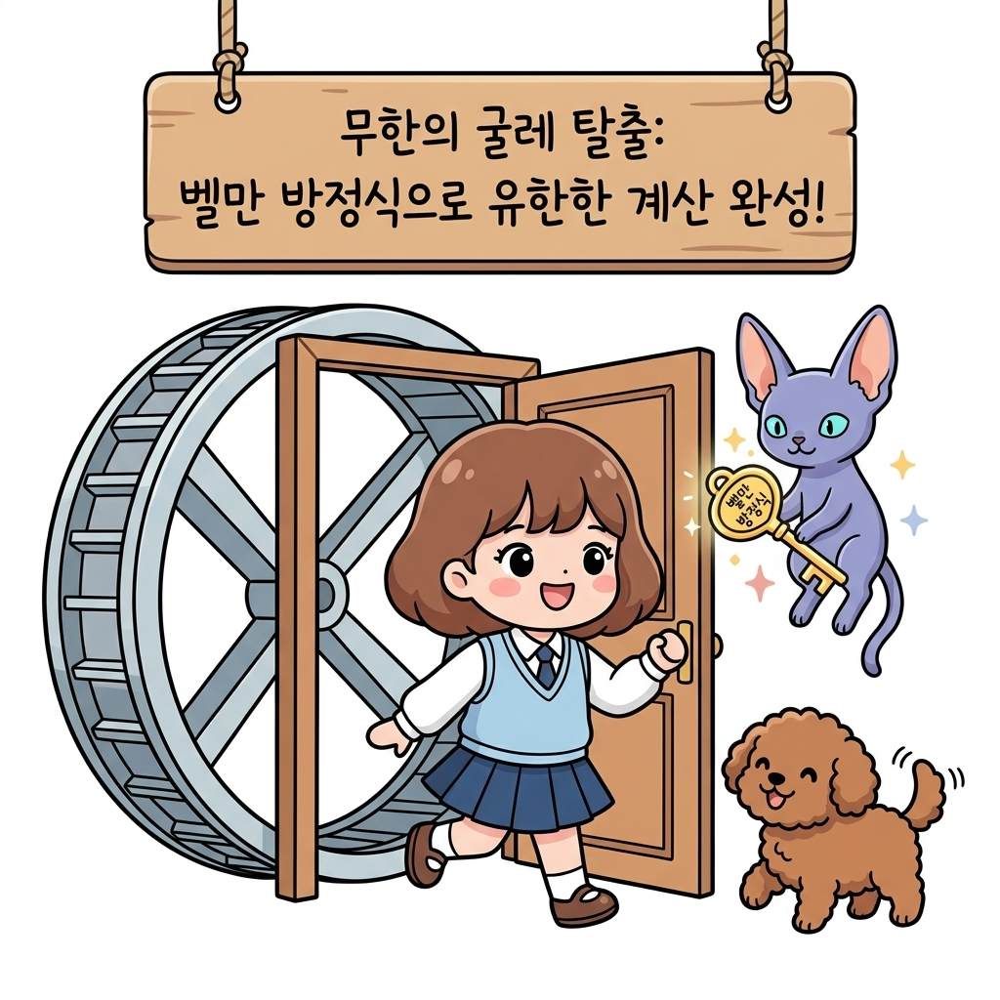

---

#### 그럼 벨만 방정식을 이용하여 *v**π*(*L1*)을 표현해봅시다

06.2.2절의 [식 06.7]에서 보았듯이 벨만 방정식은 다음과 같이 나타냅니다.

$$
\begin{aligned}
v_{\pi}(s) &= \sum_{a, s'} \pi(a \mid s) p(s' \mid s, a) \{ r(s, a, s') + \gamma v_{\pi}(s') \} \\
&= \sum_a \pi(a \mid s) \sum_{s'} p(s' \mid s, a) \{ r(s, a, s') + \gamma v_{\pi}(s') \}
\end{aligned}
$$

[식 06.7]

[식 06.7]의 첫 번째 식에서 두 번째 식으로 넘어가는 과정은, 모든 조합에 대한 총합 기호인 *Σ**a*, *s'*를 행동에 대한 합 *Σ**a*와 다음 상태에 대한 합 *Σ**s'*로 분리해 적은 것입니다. 

이는 행동과 상태의 결합 기댓값을 단계적으로 계산하기 위한 준비 단계입니다.

  

    🎧
    대화 음성 듣기 (도로시 & 지니)
  

  

    <button type="button" class="btn-audio-play" style="background: #0284c7; color: #ffffff; border: none; border-radius: 16px; padding: 5px 13px; font-size: 0.82rem; font-weight: 600; cursor: pointer; display: inline-flex; align-items: center; gap: 4px; box-shadow: 0 1px 2px rgba(2,132,199,0.3);">
      ▶️ 재생
    </button>
    <button type="button" class="btn-audio-stop" style="background: #e2e8f0; color: #475569; border: none; border-radius: 16px; padding: 5px 11px; font-size: 0.82rem; font-weight: 600; cursor: pointer; display: inline-flex; align-items: center; gap: 4px;">
      ⏹️ 정지
    </button>
  

  <audio src="./audio/dialogue_6_3_scene8.mp3" preload="none"></audio>

> 👧 **도로시**: "벨만 방정식의 시그마 기호가 행동과 다음 상태 둘 다 더하고 있네?"
> 
> 🐱 **지니**: "맞아! 행동에 대한 합과 다음 상태에 대한 합을 둘로 똑 떨어지게 분리하면 단계별로 계산하기 아주 쉬워져!"

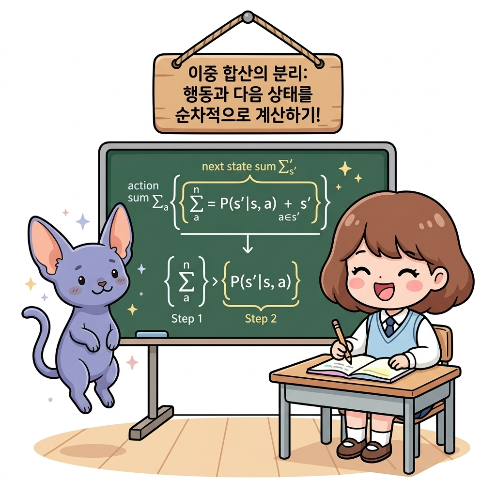

---

#### 결정적 상태전이

또한, 이번 그리드 월드 예제처럼 **상태 전이가 결정적(deterministic)**일 때는 수식이 아주 큰 폭으로 간소화됩니다. 

결정적 전이란 상태 *s*에서 행동 *a*를 취했을 때 도달할 다음 상태가 확률적으로 나뉘지 않고, 오직 하나의 상태 *s'* = *f*(*s*, *a*)로 100% 확실하게 정해지는 상황을 뜻합니다. 

  

    🎧
    대화 음성 듣기 (도로시 & 지니)
  

  

    <button type="button" class="btn-audio-play" style="background: #0284c7; color: #ffffff; border: none; border-radius: 16px; padding: 5px 13px; font-size: 0.82rem; font-weight: 600; cursor: pointer; display: inline-flex; align-items: center; gap: 4px; box-shadow: 0 1px 2px rgba(2,132,199,0.3);">
      ▶️ 재생
    </button>
    <button type="button" class="btn-audio-stop" style="background: #e2e8f0; color: #475569; border: none; border-radius: 16px; padding: 5px 11px; font-size: 0.82rem; font-weight: 600; cursor: pointer; display: inline-flex; align-items: center; gap: 4px;">
      ⏹️ 정지
    </button>
  

  <audio src="./audio/dialogue_6_3_scene9.mp3" preload="none"></audio>

> 👧 **도로시**: "이번 격자 세상은 발을 헛디딜 확률 없이, 내가 걸어간 칸으로 정확히 이동하지?"
> 
> 🐱 **지니**: "빙고! 바람이나 미끄러짐이 없는 결정적 전이라서, 다음 상태가 100% 확실하게 정해진단다!"

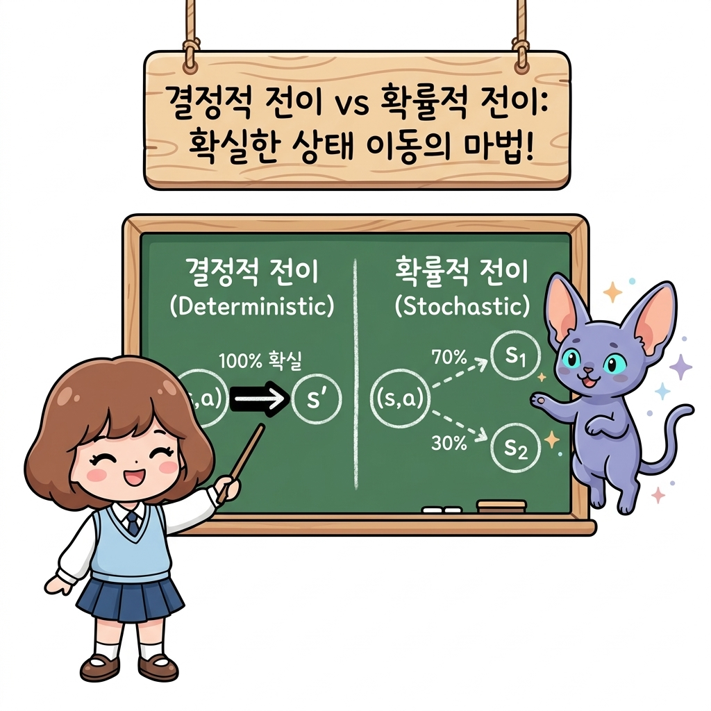

---

#### 상태전이 함수

이러한 관계를 상태 전이 확률 *p*(*s'* | *s*, *a*) 대신 **상태 전이 함수 *f*(*s*, *a*)**를 사용하여 대입하면 다음과 같습니다.

이를 [식 06.7]에 대입하면 다음과 같습니다.

*   *s'* = *f*(*s*, *a*)인 표적 상태로 갈 확률: *p*(*s'* | *s*, *a*) = 1
*   그 외의 다른 모든 상태로 갈 확률: *p*(*s'* | *s*, *a*) = 0

  

    🎧
    대화 음성 듣기 (도로시 & 지니)
  

  

    <button type="button" class="btn-audio-play" style="background: #0284c7; color: #ffffff; border: none; border-radius: 16px; padding: 5px 13px; font-size: 0.82rem; font-weight: 600; cursor: pointer; display: inline-flex; align-items: center; gap: 4px; box-shadow: 0 1px 2px rgba(2,132,199,0.3);">
      ▶️ 재생
    </button>
    <button type="button" class="btn-audio-stop" style="background: #e2e8f0; color: #475569; border: none; border-radius: 16px; padding: 5px 11px; font-size: 0.82rem; font-weight: 600; cursor: pointer; display: inline-flex; align-items: center; gap: 4px;">
      ⏹️ 정지
    </button>
  

  <audio src="./audio/dialogue_6_3_scene10.mp3" preload="none"></audio>

> 👧 **도로시**: "다음 칸이 100% 확실하다면, 전이 확률은 어떻게 바뀌어?"
> 
> 🐱 **지니**: "도착할 한 곳의 확률만 1이고, 나머지 다른 곳으로 갈 확률은 몽땅 0이 된단다!"

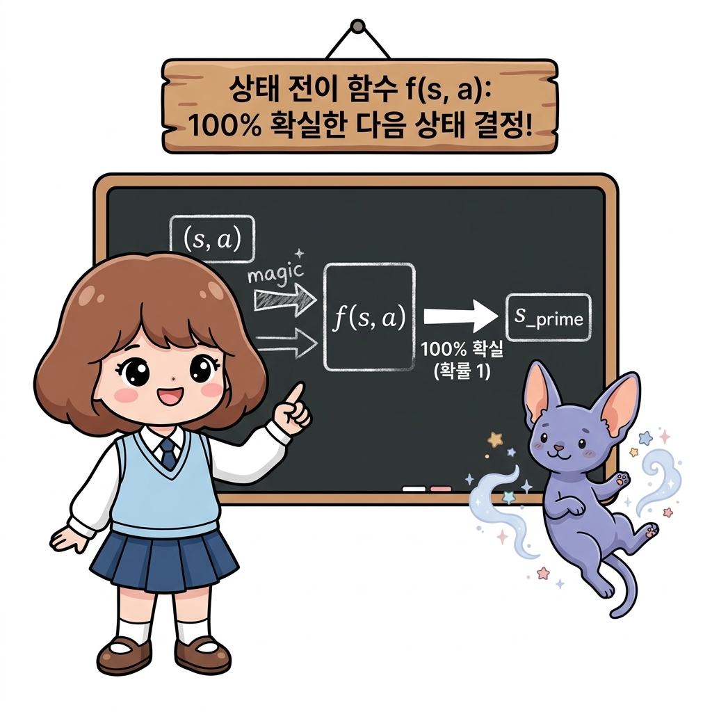

---

#### 합산 기호의 소멸

따라서 [식 06.7]의 상태 합(*Σ**s'*) 부분에서는 확률이 0인 항들이 모두 사라지고, 오직 *s'* = *f*(*s*, *a*)인 항 하나만 살아남아 합산 기호(*Σ**s'*) 자체가 완전히 사라지게 됩니다. 

  

    🎧
    대화 음성 듣기 (도로시 & 지니)
  

  

    <button type="button" class="btn-audio-play" style="background: #0284c7; color: #ffffff; border: none; border-radius: 16px; padding: 5px 13px; font-size: 0.82rem; font-weight: 600; cursor: pointer; display: inline-flex; align-items: center; gap: 4px; box-shadow: 0 1px 2px rgba(2,132,199,0.3);">
      ▶️ 재생
    </button>
    <button type="button" class="btn-audio-stop" style="background: #e2e8f0; color: #475569; border: none; border-radius: 16px; padding: 5px 11px; font-size: 0.82rem; font-weight: 600; cursor: pointer; display: inline-flex; align-items: center; gap: 4px;">
      ⏹️ 정지
    </button>
  

  <audio src="./audio/dialogue_6_3_scene11.mp3" preload="none"></audio>

> 👧 **도로시**: "확률이 0인 항들을 지우니까 다음 상태 시그마 기호가 통째로 사라졌어!"
> 
> 🐱 **지니**: "그렇지! 오직 확실한 한 칸만 남으니, 복잡했던 상태 합산 기호가 마법처럼 펑 하고 사라진 거야!"

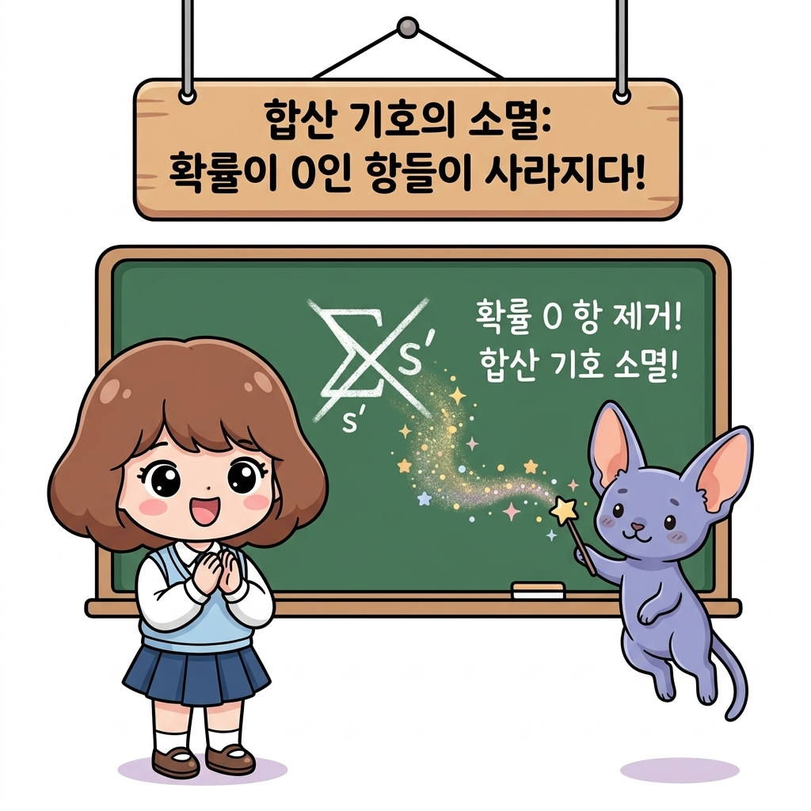

---

#### 간소화

결과적으로 식을 다음과 같이 간소화할 수 있습니다.

*s'* = *f*(*s*, *a*) 일 때,

$$
v_{\pi}(s) = \sum_a \pi(a \mid s) \{ r(s, a, s') + \gamma v_{\pi}(s') \}
$$

[식 06.8]

  

    🎧
    대화 음성 듣기 (도로시 & 지니)
  

  

    <button type="button" class="btn-audio-play" style="background: #0284c7; color: #ffffff; border: none; border-radius: 16px; padding: 5px 13px; font-size: 0.82rem; font-weight: 600; cursor: pointer; display: inline-flex; align-items: center; gap: 4px; box-shadow: 0 1px 2px rgba(2,132,199,0.3);">
      ▶️ 재생
    </button>
    <button type="button" class="btn-audio-stop" style="background: #e2e8f0; color: #475569; border: none; border-radius: 16px; padding: 5px 11px; font-size: 0.82rem; font-weight: 600; cursor: pointer; display: inline-flex; align-items: center; gap: 4px;">
      ⏹️ 정지
    </button>
  

  <audio src="./audio/dialogue_6_3_scene12.mp3" preload="none"></audio>

> 👧 **도로시**: "결정적 환경의 벨만 방정식 식 06.8이 이렇게나 간단해지다니!"
> 
> 🐱 **지니**: "각 행동을 고를 확률에, 그때 얻는 즉각 보상과 다음 상태 가치만 쏙 곱해서 더해주면 끝이란다!"

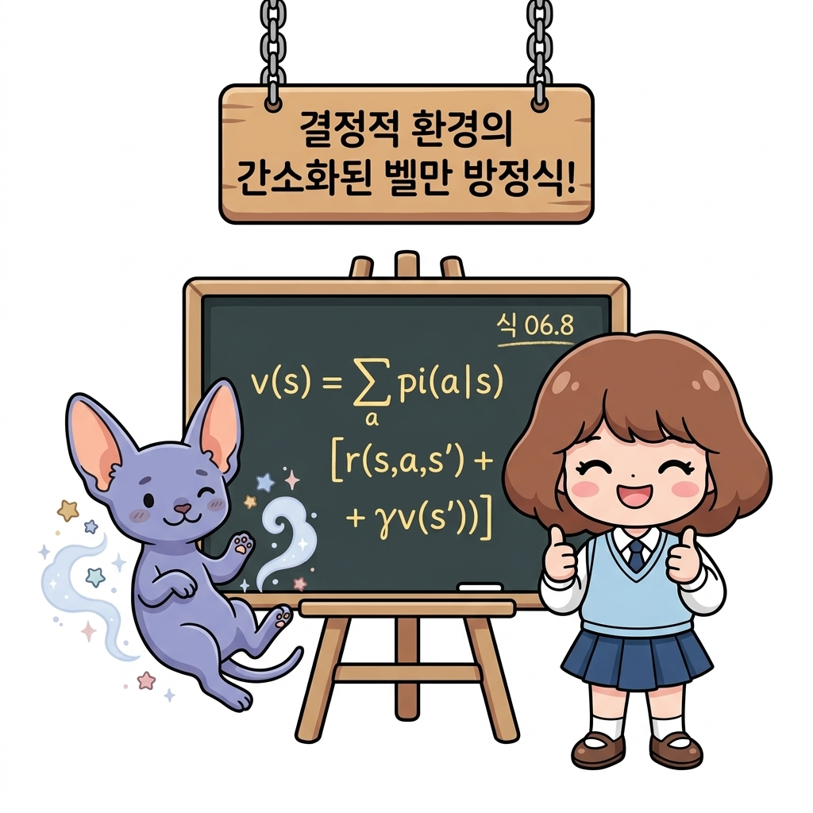

---

#### 문제대입

이제 [식 06.8]에 이번 문제를 대입해보죠. 

[그림 06-9]의 백업 다이어그램을 참고하면서 진행하겠습니다.

[그림 06-9] *v**π*(*L1*)을 구하기 위한 백업 다이어그램

[그림 06-9]를 보면 백업 다이어그램이 두 갈래로 나뉘어 있습니다. 

  

    🎧
    대화 음성 듣기 (도로시 & 지니)
  

  

    <button type="button" class="btn-audio-play" style="background: #0284c7; color: #ffffff; border: none; border-radius: 16px; padding: 5px 13px; font-size: 0.82rem; font-weight: 600; cursor: pointer; display: inline-flex; align-items: center; gap: 4px; box-shadow: 0 1px 2px rgba(2,132,199,0.3);">
      ▶️ 재생
    </button>
    <button type="button" class="btn-audio-stop" style="background: #e2e8f0; color: #475569; border: none; border-radius: 16px; padding: 5px 11px; font-size: 0.82rem; font-weight: 600; cursor: pointer; display: inline-flex; align-items: center; gap: 4px;">
      ⏹️ 정지
    </button>
  

  <audio src="./audio/dialogue_6_3_scene13.mp3" preload="none"></audio>

> 👧 **도로시**: "이제 L1의 백업 다이어그램을 보면서 수식을 조립해볼까?"
> 
> 🐱 **지니**: "좋아! L1에서는 왼쪽으로 벽을 들이받는 길과, 오른쪽으로 사과를 향해 가는 딱 두 갈래 길만 보면 돼!"

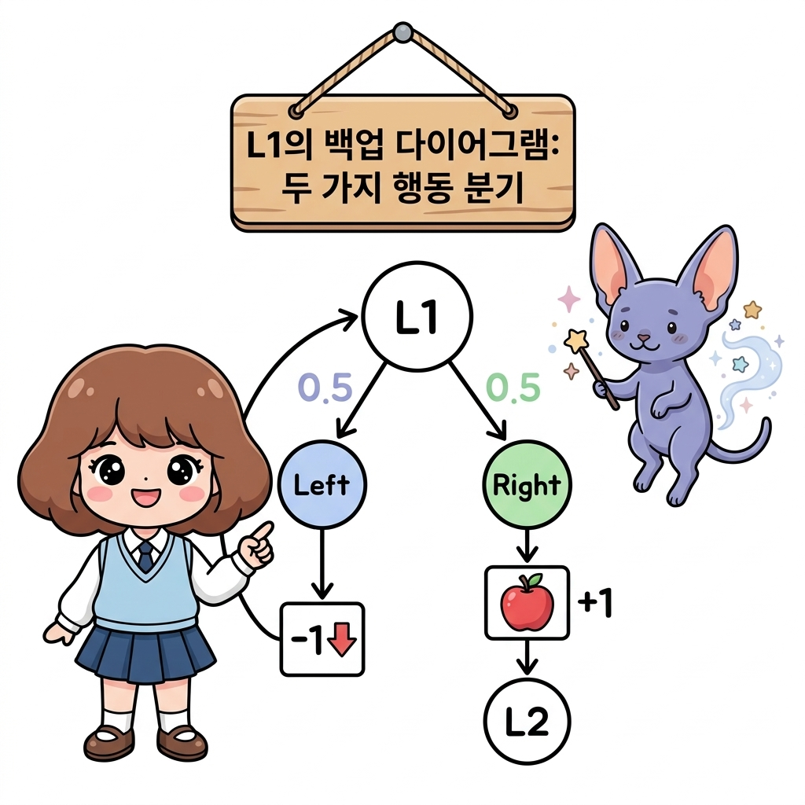

---

#### L1의 Left 이동

하나는 0.5의 확률로 행동 Left를 선택하고 **상태는 전이되지 않습니다**. 

보상은 -1입니다. 

이때 할인율 *γ*를 0.9로 설정하면 [식 06.8]에서 Left를 선택하는 경우는 다음과 같습니다.

$$
0.5 \{ -1 + 0.9 v_{\pi}(L1) \}
$$

  

    🎧
    대화 음성 듣기 (도로시 & 지니)
  

  

    <button type="button" class="btn-audio-play" style="background: #0284c7; color: #ffffff; border: none; border-radius: 16px; padding: 5px 13px; font-size: 0.82rem; font-weight: 600; cursor: pointer; display: inline-flex; align-items: center; gap: 4px; box-shadow: 0 1px 2px rgba(2,132,199,0.3);">
      ▶️ 재생
    </button>
    <button type="button" class="btn-audio-stop" style="background: #e2e8f0; color: #475569; border: none; border-radius: 16px; padding: 5px 11px; font-size: 0.82rem; font-weight: 600; cursor: pointer; display: inline-flex; align-items: center; gap: 4px;">
      ⏹️ 정지
    </button>
  

  <audio src="./audio/dialogue_6_3_scene14.mp3" preload="none"></audio>

> 👧 **도로시**: "L1에서 왼쪽으로 가면 벽에 쿵 부딪혀서 제자리 L1에 남고 감점 -1이네!"
> 
> 🐱 **지니**: "맞아, 50% 확률에 보상 -1 더하기 할인율 0.9 곱하기 v(L1)을 묶어주면 돼!"

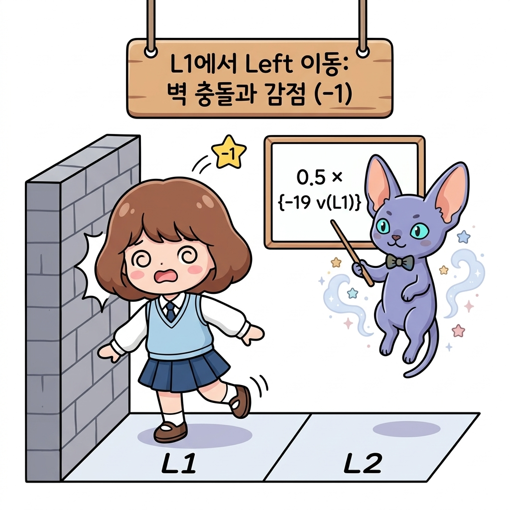

---

#### L1의 Right 이동

[그림 06-9]에서 또 다른 가능성은 0.5의 확률로 행동 Right를 선택하여, **상태 *L2*로 전이**하고 보상 1을 얻는 경우입니다. 

이로부터 다음 식을 얻을 수 있습니다.

$$
0.5 \{ 1 + 0.9 v_{\pi}(L2) \}
$$

  

    🎧
    대화 음성 듣기 (도로시 & 지니)
  

  

    <button type="button" class="btn-audio-play" style="background: #0284c7; color: #ffffff; border: none; border-radius: 16px; padding: 5px 13px; font-size: 0.82rem; font-weight: 600; cursor: pointer; display: inline-flex; align-items: center; gap: 4px; box-shadow: 0 1px 2px rgba(2,132,199,0.3);">
      ▶️ 재생
    </button>
    <button type="button" class="btn-audio-stop" style="background: #e2e8f0; color: #475569; border: none; border-radius: 16px; padding: 5px 11px; font-size: 0.82rem; font-weight: 600; cursor: pointer; display: inline-flex; align-items: center; gap: 4px;">
      ⏹️ 정지
    </button>
  

  <audio src="./audio/dialogue_6_3_scene15.mp3" preload="none"></audio>

> 👧 **도로시**: "오른쪽으로 가면 L2로 넘어가면서 달콤한 사과 보너스 +1을 받네!"
> 
> 🐱 **지니**: "정답이야! 50% 확률에 보상 1 더하기 할인율 0.9 곱하기 v(L2)를 곱해주면 되지!"

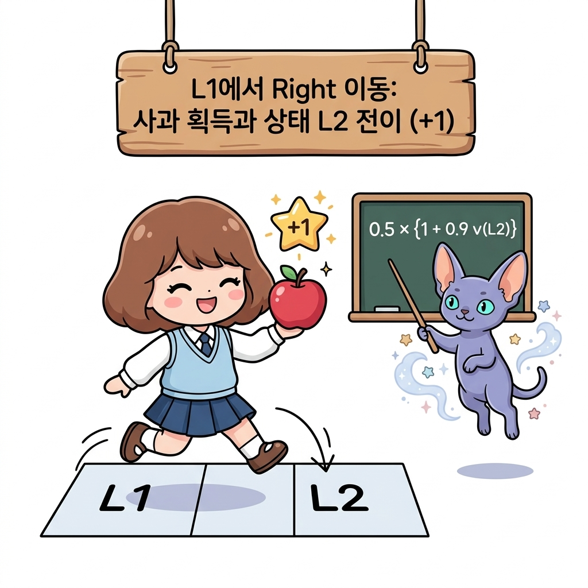

---

#### *L1*에서의 벨만 방정식

지금까지의 내용을 벨만 방정식으로 나타내면 다음과 같습니다.

$$
v_{\pi}(L1) = 0.5 \{ -1 + 0.9 v_{\pi}(L1) \} + 0.5 \{ 1 + 0.9 v_{\pi}(L2) \}
$$

이 식이 상태 *L1*에서의 벨만 방정식입니다. 

다음과 같이 정리할 수도 있습니다.

$$
-0.55 v_{\pi}(L1) + 0.45 v_{\pi}(L2) = 0
$$

[식 06.9]

  

    🎧
    대화 음성 듣기 (도로시 & 지니)
  

  

    <button type="button" class="btn-audio-play" style="background: #0284c7; color: #ffffff; border: none; border-radius: 16px; padding: 5px 13px; font-size: 0.82rem; font-weight: 600; cursor: pointer; display: inline-flex; align-items: center; gap: 4px; box-shadow: 0 1px 2px rgba(2,132,199,0.3);">
      ▶️ 재생
    </button>
    <button type="button" class="btn-audio-stop" style="background: #e2e8f0; color: #475569; border: none; border-radius: 16px; padding: 5px 11px; font-size: 0.82rem; font-weight: 600; cursor: pointer; display: inline-flex; align-items: center; gap: 4px;">
      ⏹️ 정지
    </button>
  

  <audio src="./audio/dialogue_6_3_scene16.mp3" preload="none"></audio>

> 👧 **도로시**: "두 가지 행동을 더해서 정리하니까, -0.55 v(L1) + 0.45 v(L2) = 0이 됐어!"
> 
> 🐱 **지니**: "훌륭해 도로시! 미지수가 두 개인 멋진 첫 번째 일차방정식 [식 06.9]가 완성되었어!"

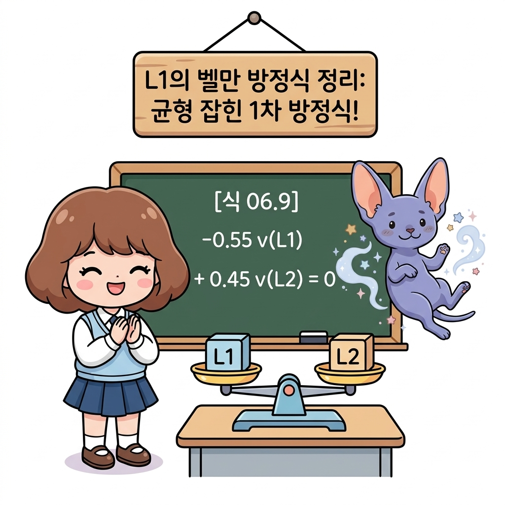

---

#### *L2*에서의 벨만 방정식

이제 상태 *L2*에서의 벨만 방정식을 구해보겠습니다. 

조금 전과 마찬가지로 참고용 백업 다이어그램을 준비했습니다.

그림 06-10 *v**π*(*L2*)를 구하기 위한 백업 다이어그램

  

    🎧
    대화 음성 듣기 (도로시 & 지니)
  

  

    <button type="button" class="btn-audio-play" style="background: #0284c7; color: #ffffff; border: none; border-radius: 16px; padding: 5px 13px; font-size: 0.82rem; font-weight: 600; cursor: pointer; display: inline-flex; align-items: center; gap: 4px; box-shadow: 0 1px 2px rgba(2,132,199,0.3);">
      ▶️ 재생
    </button>
    <button type="button" class="btn-audio-stop" style="background: #e2e8f0; color: #475569; border: none; border-radius: 16px; padding: 5px 11px; font-size: 0.82rem; font-weight: 600; cursor: pointer; display: inline-flex; align-items: center; gap: 4px;">
      ⏹️ 정지
    </button>
  

  <audio src="./audio/dialogue_6_3_scene17.mp3" preload="none"></audio>

> 👧 **도로시**: "이번에는 L2 칸에 서 있을 때의 백업 다이어그램을 볼 차례야!"
> 
> 🐱 **지니**: "L2에서도 똑같이 왼쪽과 오른쪽, 두 갈래 행동의 기대 가치를 합쳐주면 된단다!"

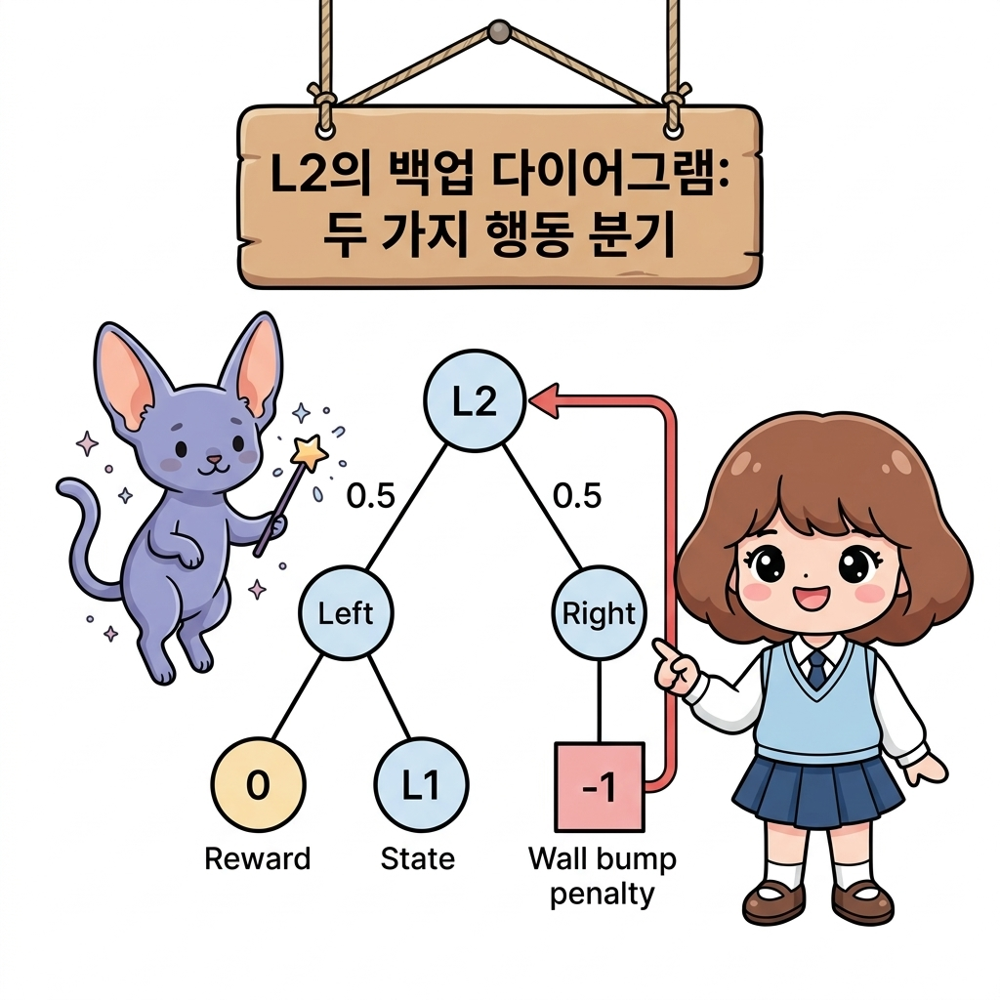

---

#### L2에서 Left 이동

상태 *L2*에서 0.5의 확률로 행동 Left를 선택하면 **상태 *L1*로 전이**하고, 이 경로에는 사과가 없으므로 보상은 0입니다. 

이때 할인율 *γ*를 0.9로 설정하면 Left를 선택하는 경우는 다음과 같습니다.

$$
0.5 \{ 0 + 0.9 v_{\pi}(L1) \}
$$

  

    🎧
    대화 음성 듣기 (도로시 & 지니)
  

  

    <button type="button" class="btn-audio-play" style="background: #0284c7; color: #ffffff; border: none; border-radius: 16px; padding: 5px 13px; font-size: 0.82rem; font-weight: 600; cursor: pointer; display: inline-flex; align-items: center; gap: 4px; box-shadow: 0 1px 2px rgba(2,132,199,0.3);">
      ▶️ 재생
    </button>
    <button type="button" class="btn-audio-stop" style="background: #e2e8f0; color: #475569; border: none; border-radius: 16px; padding: 5px 11px; font-size: 0.82rem; font-weight: 600; cursor: pointer; display: inline-flex; align-items: center; gap: 4px;">
      ⏹️ 정지
    </button>
  

  <audio src="./audio/dialogue_6_3_scene18.mp3" preload="none"></audio>

> 👧 **도로시**: "L2에서 왼쪽으로 가면 L1으로 돌아가는데, 이때 사과가 없으니 보상은 0이네?"
> 
> 🐱 **지니**: "맞아! 보상은 0점이고 다음 상태는 L1이니, 50%에 0.9 곱하기 v(L1)을 곱하면 돼!"

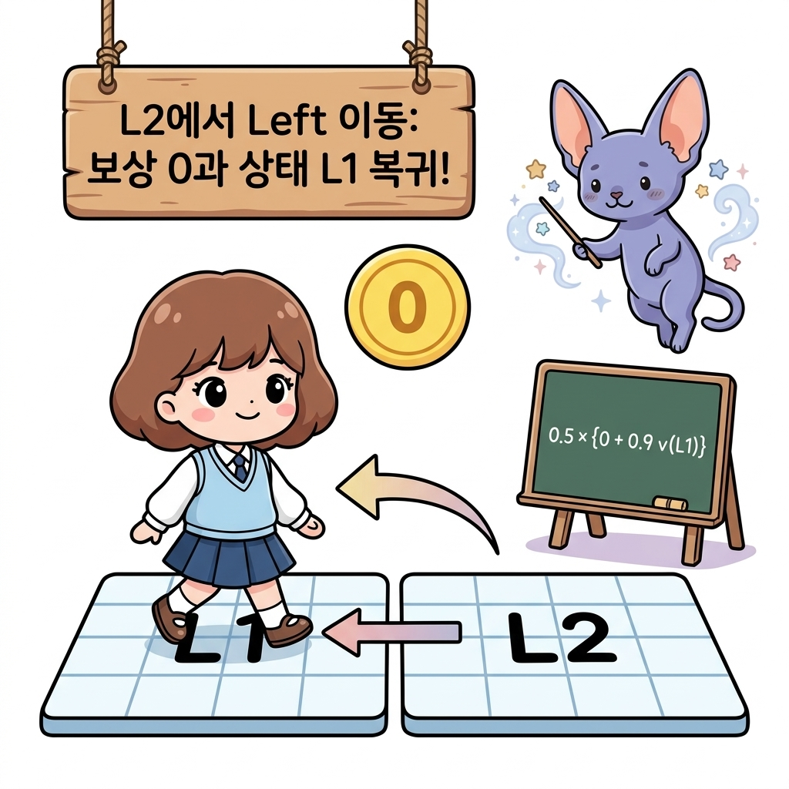

---

#### L2에서 Right 이동

상태 *L2*에서 0.5의 확률로 행동 Right를 선택하면 **오른쪽 벽에 부딪혀 상태가 전이되지 않고 *L2*에 머물며**, 보상은 -1입니다. 

이로부터 다음 식을 얻을 수 있습니다.

$$
0.5 \{ -1 + 0.9 v_{\pi}(L2) \}
$$

  

    🎧
    대화 음성 듣기 (도로시 & 지니)
  

  

    <button type="button" class="btn-audio-play" style="background: #0284c7; color: #ffffff; border: none; border-radius: 16px; padding: 5px 13px; font-size: 0.82rem; font-weight: 600; cursor: pointer; display: inline-flex; align-items: center; gap: 4px; box-shadow: 0 1px 2px rgba(2,132,199,0.3);">
      ▶️ 재생
    </button>
    <button type="button" class="btn-audio-stop" style="background: #e2e8f0; color: #475569; border: none; border-radius: 16px; padding: 5px 11px; font-size: 0.82rem; font-weight: 600; cursor: pointer; display: inline-flex; align-items: center; gap: 4px;">
      ⏹️ 정지
    </button>
  

  <audio src="./audio/dialogue_6_3_scene19.mp3" preload="none"></audio>

> 👧 **도로시**: "L2에서 오른쪽으로 가면 벽에 부딪혀서 제자리 L2에 남고 감점 -1점이군!"
> 
> 🐱 **지니**: "그렇지! 50%에 -1 더하기 0.9 곱하기 v(L2)를 곱해주면 오른쪽 경로 완성!"

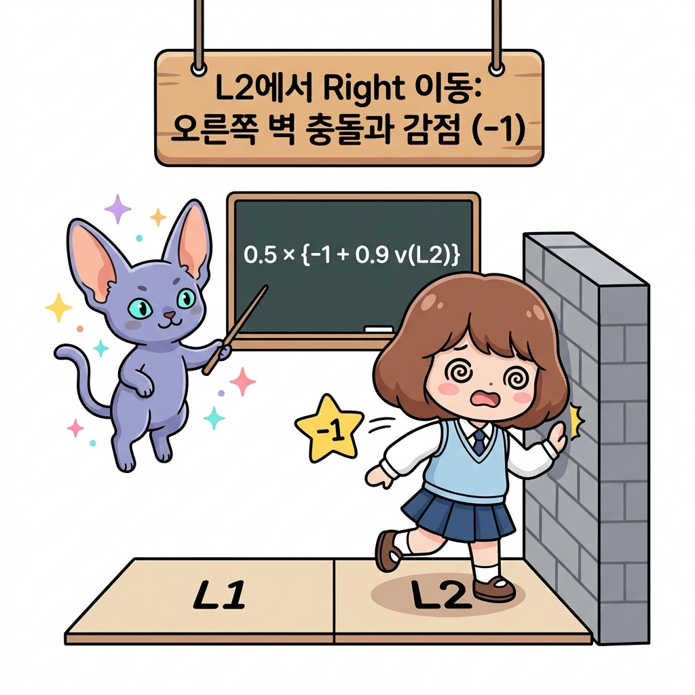

---

#### *L2* 식의 정리

이 두 행동의 기댓값을 합치면 상태 *L2*에서의 벨만 방정식이 됩니다.

$$
v_{\pi}(L2) = 0.5 \{ 0 + 0.9 v_{\pi}(L1) \} + 0.5 \{ -1 + 0.9 v_{\pi}(L2) \}
$$

이 식을 전개하여 정리하면 다음과 같습니다.

$$
0.45 v_{\pi}(L1) - 0.55 v_{\pi}(L2) = 0.5
$$

[식 06.10]

  

    🎧
    대화 음성 듣기 (도로시 & 지니)
  

  

    <button type="button" class="btn-audio-play" style="background: #0284c7; color: #ffffff; border: none; border-radius: 16px; padding: 5px 13px; font-size: 0.82rem; font-weight: 600; cursor: pointer; display: inline-flex; align-items: center; gap: 4px; box-shadow: 0 1px 2px rgba(2,132,199,0.3);">
      ▶️ 재생
    </button>
    <button type="button" class="btn-audio-stop" style="background: #e2e8f0; color: #475569; border: none; border-radius: 16px; padding: 5px 11px; font-size: 0.82rem; font-weight: 600; cursor: pointer; display: inline-flex; align-items: center; gap: 4px;">
      ⏹️ 정지
    </button>
  

  <audio src="./audio/dialogue_6_3_scene20.mp3" preload="none"></audio>

> 👧 **도로시**: "L2의 식도 괄호를 풀고 정리하니까, 0.45 v(L1) - 0.55 v(L2) = 0.5가 나왔어!"
> 
> 🐱 **지니**: "완벽해! 이렇게 해서 두 번째 일차방정식 [식 06.10]까지 완벽하게 손에 넣었단다!"

![L2 벨만 방정식 정리: [식 06.10] 완성](./img/equation_consolidation.png)

---

#### 벨만 방정식 연립

이렇게 하여 모든 상태에서의 벨만 방정식을 구했습니다. 

이제 알고 싶은 변수는 *v**π*(*L1*)과 *v**π*(*L2*)가 남았습니다. 

그리고 다음의 두 방정식을 얻었습니다([식 06.9]와 [식 06.10]).

$$
\begin{cases}
-0.55 v_{\pi}(L1) + 0.45 v_{\pi}(L2) = 0 \\
0.45 v_{\pi}(L1) - 0.55 v_{\pi}(L2) = 0.5
\end{cases}
$$

  

    🎧
    대화 음성 듣기 (도로시 & 지니)
  

  

    <button type="button" class="btn-audio-play" style="background: #0284c7; color: #ffffff; border: none; border-radius: 16px; padding: 5px 13px; font-size: 0.82rem; font-weight: 600; cursor: pointer; display: inline-flex; align-items: center; gap: 4px; box-shadow: 0 1px 2px rgba(2,132,199,0.3);">
      ▶️ 재생
    </button>
    <button type="button" class="btn-audio-stop" style="background: #e2e8f0; color: #475569; border: none; border-radius: 16px; padding: 5px 11px; font-size: 0.82rem; font-weight: 600; cursor: pointer; display: inline-flex; align-items: center; gap: 4px;">
      ⏹️ 정지
    </button>
  

  <audio src="./audio/dialogue_6_3_scene21.mp3" preload="none"></audio>

> 👧 **도로시**: "미지수는 v(L1)과 v(L2) 두 개고, 식도 딱 두 개니까 중학교 연립방정식이네!"
> 
> 🐱 **지니**: "맞아 도로시! 가감법이나 대입법으로 두 식을 묶어서 풀기만 하면 진짜 가치 숫자가 튀어나온단다!"

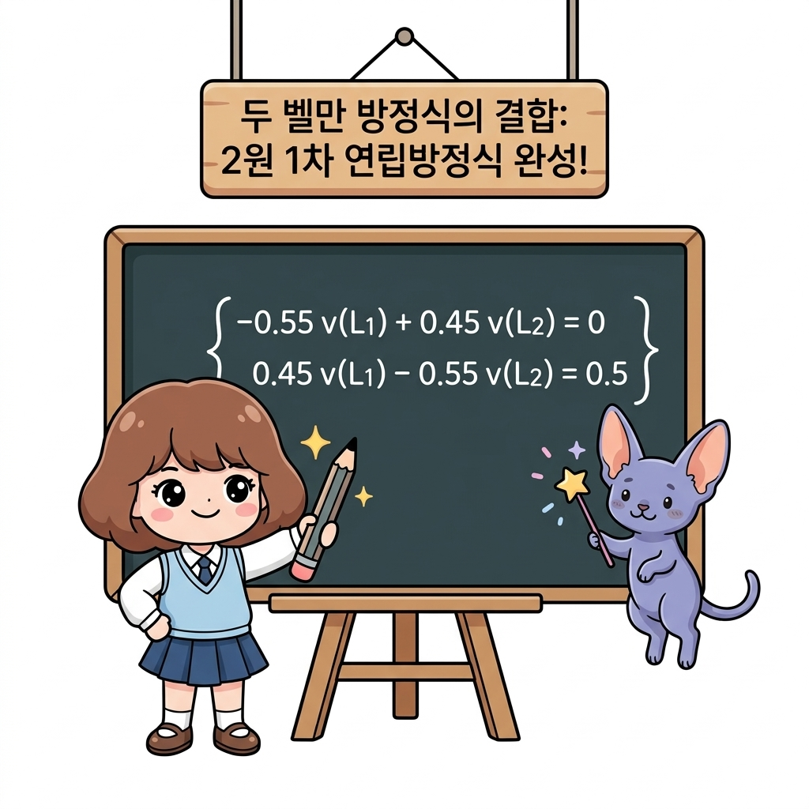

---

#### 연립방정식 풀이

보다시피 연립방정식이며, 이번처럼 단순한 문제라면 직접 계산하여 풀 수 있을 것입니다.

첫 번째 식에서 $v_{\pi}(L2) = \frac{0.55}{0.45} v_{\pi}(L1) = \frac{11}{9} v_{\pi}(L1)$을 두 번째 식에 대입하면:

$$
0.45 v_{\pi}(L1) - 0.55 \left( \frac{11}{9} v_{\pi}(L1) \right) = 0.5
$$

양변에 9를 곱하고 정리하면:

$$
4.05 v_{\pi}(L1) - 6.05 v_{\pi}(L1) = 4.5 \implies -2.0 v_{\pi}(L1) = 4.5 \implies v_{\pi}(L1) = -2.25
$$

이를 대입하면 $v_{\pi}(L2) = \frac{11}{9} (-2.25) = -2.75$를 얻을 수 있습니다.

참고로 답은 다음과 같습니다.

$$
\begin{cases}
v_{\pi}(L1) = -2.25 \\
v_{\pi}(L2) = -2.75
\end{cases}
$$

  

    🎧
    대화 음성 듣기 (도로시 & 지니)
  

  

    <button type="button" class="btn-audio-play" style="background: #0284c7; color: #ffffff; border: none; border-radius: 16px; padding: 5px 13px; font-size: 0.82rem; font-weight: 600; cursor: pointer; display: inline-flex; align-items: center; gap: 4px; box-shadow: 0 1px 2px rgba(2,132,199,0.3);">
      ▶️ 재생
    </button>
    <button type="button" class="btn-audio-stop" style="background: #e2e8f0; color: #475569; border: none; border-radius: 16px; padding: 5px 11px; font-size: 0.82rem; font-weight: 600; cursor: pointer; display: inline-flex; align-items: center; gap: 4px;">
      ⏹️ 정지
    </button>
  

  <audio src="./audio/dialogue_6_3_scene22.mp3" preload="none"></audio>

> 👧 **도로시**: "연립방정식을 계산해보니 v(L1)은 -2.25, v(L2)는 -2.75가 나왔어!"
> 
> 🐱 **지니**: "정확해! 무한히 이어지던 기대 수익이 드디어 딱 떨어지는 실수 숫자로 명쾌하게 풀려났단다!"

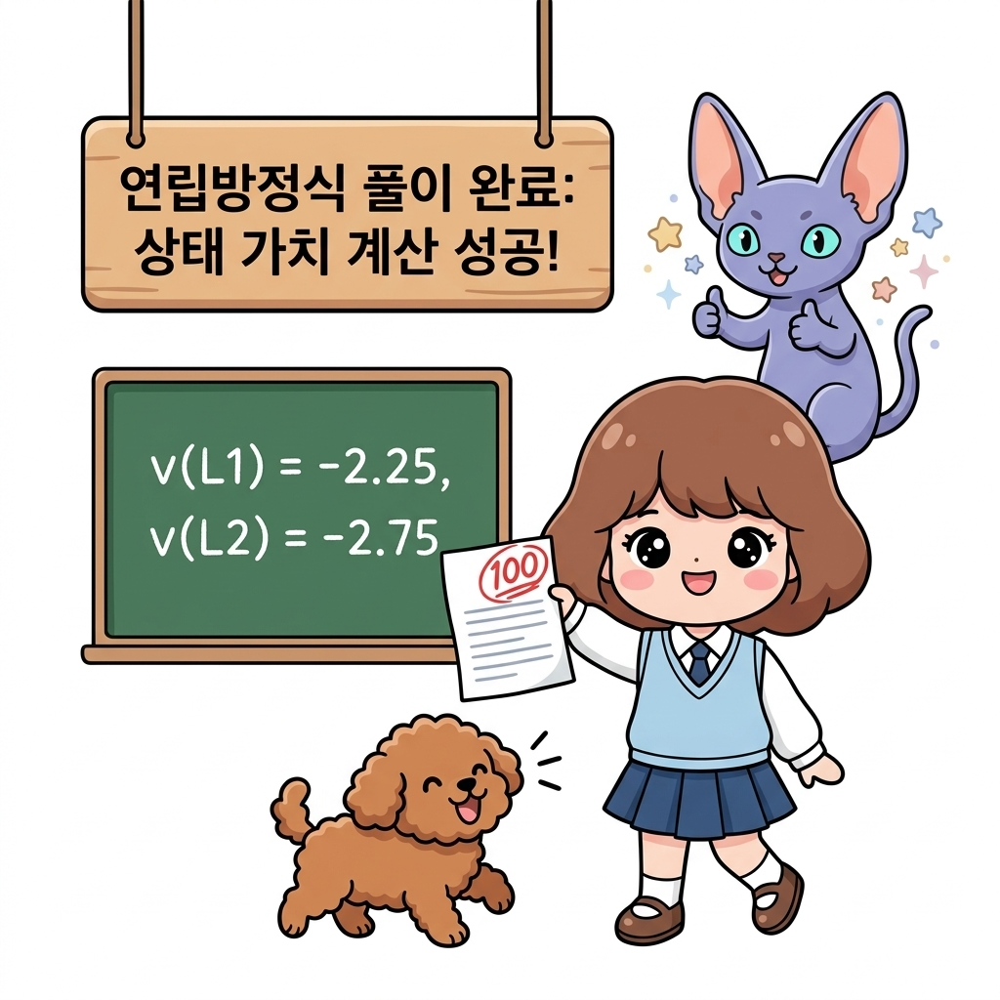

---

#### 이는 무작위 정책의 상태 가치 함수입니다

즉, 상태 *L1*에서 무작위로 행동하면 앞으로 -2.25의 수익을 기대할 수 있다는 뜻입니다. 

무작위로 행동하다 보면 벽에 부딪힐 수도 있으니 미래의 보상이 마이너스가 될 수도 있다는 건 충분히 이해할 것입니다. 

또한 *v**π*(*L1*)의 값이 *v**π*(*L2*)보다 큰 이유도 *L1* 옆에 사과가 있고 첫 번째 행동에서 그 사과를 얻을 확률이 50%이기 때문에 역시 이해할 수 있습니다.

  

    🎧
    대화 음성 듣기 (도로시 & 지니)
  

  

    <button type="button" class="btn-audio-play" style="background: #0284c7; color: #ffffff; border: none; border-radius: 16px; padding: 5px 13px; font-size: 0.82rem; font-weight: 600; cursor: pointer; display: inline-flex; align-items: center; gap: 4px; box-shadow: 0 1px 2px rgba(2,132,199,0.3);">
      ▶️ 재생
    </button>
    <button type="button" class="btn-audio-stop" style="background: #e2e8f0; color: #475569; border: none; border-radius: 16px; padding: 5px 11px; font-size: 0.82rem; font-weight: 600; cursor: pointer; display: inline-flex; align-items: center; gap: 4px;">
      ⏹️ 정지
    </button>
  

  <audio src="./audio/dialogue_6_3_scene23.mp3" preload="none"></audio>

> 👧 **도로시**: "둘 다 마이너스인 것도 신기하고, L1이 L2보다 더 큰 것도 재밌어!"
> 
> 🐱 **지니**: "벽에 부딪히기 쉬워서 마이너스지만, L1 옆에는 바로 사과가 있어서 첫 판에 딸 확률이 50%나 되니까 더 가치 있는 거야!"

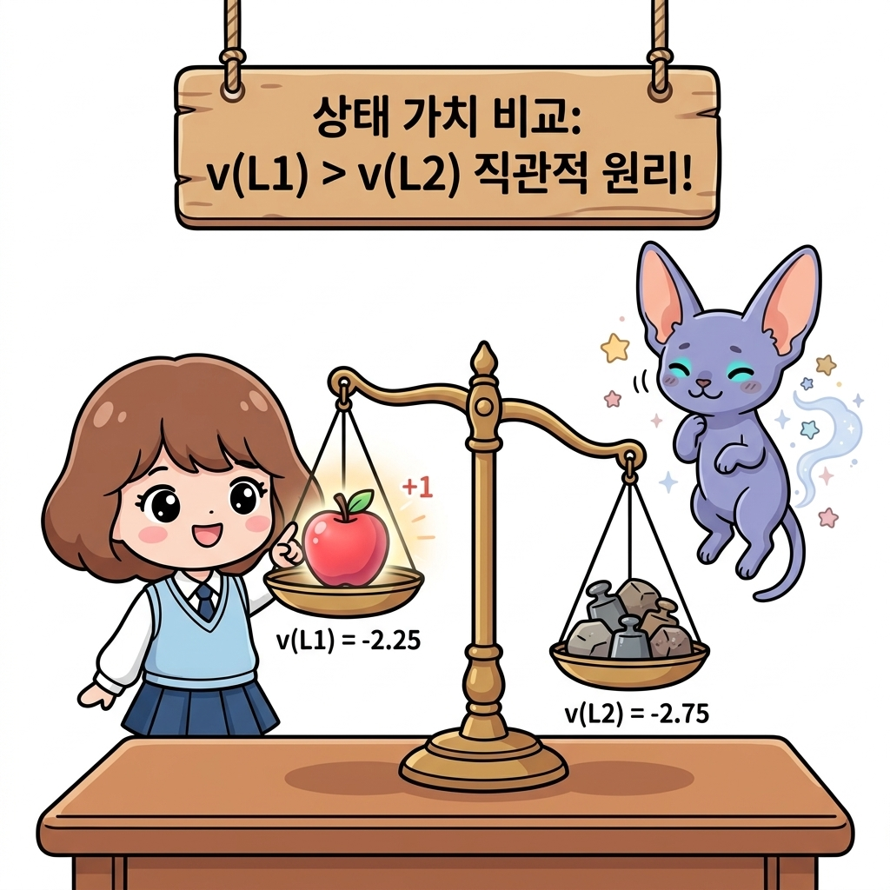

---

### 06.3.2 벨만 방정식의 의의

지금까지 살펴본 바와 같이 벨만 방정식을 통해 무한히 계속되는 계산을 유한한 연립방정식으로 변환할 수 있었습니다. 

이번처럼 행동이 무작위로 이루어지더라도 벨만 방정식을 이용하면 상태 가치 함수를 구할 수 있습니다.

> NOTE_ 상태 가치 함수는 기대 수익이며 '무한히 이어지는' 보상의 합으로 정의됩니다. 하지만 [식 06.7]에서 보듯 벨만 방정식에는 '무한'이라는 개념이 없습니다. 벨만 방정식 덕분에 무한의 굴레에서 빠져나온 셈입니다.

또한 이번 문제는 매우 단순했지만 복잡한 문제라도 벨만 방정식을 이용해 연립방정식으로 표현할 수 있습니다. 그리고 연립방정식을 푸는 알고리즘을 이용하면 자동으로 상태 가치 함수를 구할 수 있습니다.

  

    🎧
    대화 음성 듣기 (도로시 & 지니)
  

  

    <button type="button" class="btn-audio-play" style="background: #0284c7; color: #ffffff; border: none; border-radius: 16px; padding: 5px 13px; font-size: 0.82rem; font-weight: 600; cursor: pointer; display: inline-flex; align-items: center; gap: 4px; box-shadow: 0 1px 2px rgba(2,132,199,0.3);">
      ▶️ 재생
    </button>
    <button type="button" class="btn-audio-stop" style="background: #e2e8f0; color: #475569; border: none; border-radius: 16px; padding: 5px 11px; font-size: 0.82rem; font-weight: 600; cursor: pointer; display: inline-flex; align-items: center; gap: 4px;">
      ⏹️ 정지
    </button>
  

  <audio src="./audio/dialogue_6_3_scene24.mp3" preload="none"></audio>

> 👧 **도로시**: "벨만 방정식을 세우고, 정리하고, 연립방정식으로 푸는 3단계로 모든 게 해결되는구나!"
> 
> 🐱 **지니**: "바로 그거야! 아무리 거대한 세상이라도 벨만 방정식을 쓰면 컴퓨터가 자동으로 모든 가치를 풀어낼 수 있단다!"

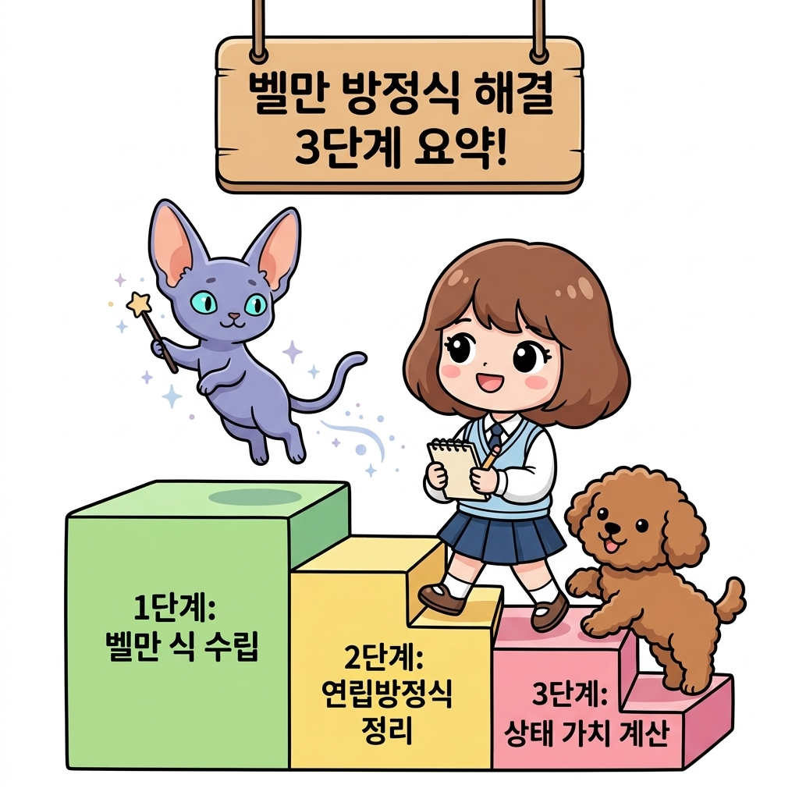

---

### 06.3.3 핵심정리

이번 절에서 배운 두 칸짜리 그리드 월드 벨만 방정식의 핵심 내용을 목록으로 깔끔하게 정리합니다.

  

    🎧
    대화 음성 듣기 (도로시 & 지니)
  

  

    <button type="button" class="btn-audio-play" style="background: #0284c7; color: #ffffff; border: none; border-radius: 16px; padding: 5px 13px; font-size: 0.82rem; font-weight: 600; cursor: pointer; display: inline-flex; align-items: center; gap: 4px; box-shadow: 0 1px 2px rgba(2,132,199,0.3);">
      ▶️ 재생
    </button>
    <button type="button" class="btn-audio-stop" style="background: #e2e8f0; color: #475569; border: none; border-radius: 16px; padding: 5px 11px; font-size: 0.82rem; font-weight: 600; cursor: pointer; display: inline-flex; align-items: center; gap: 4px;">
      ⏹️ 정지
    </button>
  

  <audio src="./audio/dialogue_6_3_scene25.mp3" preload="none"></audio>

> 👧 **도로시**: "오늘 배운 두 칸짜리 그리드 월드 벨만 예제를 마음속에 쏙 정리해두자!"
> 
> 🐱 **지니**: "결정적 전이의 간소화부터 연립방정식 해법까지, 핵심 정리 목록으로 확실하게 복습해보렴!"

*   **무한 분기에서 유한한 연립방정식으로의 변환**:
    *   상태 가치 함수는 본래 무한히 이어지는 미래 보상의 기댓값의 합이지만, 벨만 방정식을 이용하면 미지수가 포함된 유한한 연립 1차 방정식으로 변환할 수 있습니다.

*   **결정적 상태 전이 환경에서의 식 간소화**:
    *   상태 전이가 결정적($s' = f(s, a)$)인 환경에서는 특정 다음 상태로 갈 확률만 1이고 나머지는 0이 되므로, 다음 상태에 대한 시그마 기호($\sum_{s'}$)가 사라져 식이 간소화됩니다.
    
    $$
    v_{\pi}(s) = \sum_a \pi(a \mid s) \{ r(s, a, s') + \gamma v_{\pi}(s') \}
    $$

*   **두 칸짜리 그리드 월드에서의 벨만 방정식 도출**:
    *   할인율 $\gamma = 0.9$ 및 무작위 정책($\pi = 0.5$) 조건에서 각 상태의 벨만 방정식은 다음과 같이 세워집니다.
    *   **상태 *L1*에서의 벨만 방정식**:
        
        $$
        v_{\pi}(L1) = 0.5 \{ -1 + 0.9 v_{\pi}(L1) \} + 0.5 \{ 1 + 0.9 v_{\pi}(L2) \}
        $$
        
        정리하면:
        
        $$
        -0.55 v_{\pi}(L1) + 0.45 v_{\pi}(L2) = 0
        $$

    *   **상태 *L2*에서의 벨만 방정식**:
        
        $$
        v_{\pi}(L2) = 0.5 \{ 0 + 0.9 v_{\pi}(L1) \} + 0.5 \{ -1 + 0.9 v_{\pi}(L2) \}
        $$
        
        정리하면:
        
        $$
        0.45 v_{\pi}(L1) - 0.55 v_{\pi}(L2) = 0.5
        $$

*   **연립방정식의 해법과 상태 가치 계산 결과**:
    *   도출된 두 1차 방정식을 연립하여 풀면 다음의 유일한 해를 얻습니다.
    
    $$
    \begin{cases}
    v_{\pi}(L1) = -2.25 \\
    v_{\pi}(L2) = -2.75
    \end{cases}
    $$

*   **상태 가치 수치의 직관적 의미**:
    *   **음수 가치**: 무작위 정책에서는 양쪽 벽에 50% 확률로 계속 부딪혀 -1의 감점을 누적하므로 기대 수익이 음수가 됩니다.
    *   **$v_\pi(L1) > v_\pi(L2)$**: 상태 *L1* 바로 오른쪽 칸에 사과(+1)가 위치하여 첫 번째 행동에서 사과를 즉시 획득할 확률(50%)이 존재하므로, *L1*의 가치가 *L2*보다 0.5만큼 더 높습니다.

*   **벨만 방정식 해결의 3단계 프로세스**:
    1.  **1단계 (모델 수립)**: 각 상태별 벨만 방정식 작성
    2.  **2단계 (식 정리)**: 동류항을 모아 표준 연립 1차 방정식 형태로 정리
    3.  **3단계 (해 계산)**: 가감법/대입법(또는 행렬 역행렬 계산 알고리즘)으로 최종 상태 가치 $v_\pi(s)$ 산출
