# 06.3 벨만 방정식의 예

벨만 방정식 점화식을 기반으로 상태 가치 함수들을 구하기 위해 실제로 **연립방정식(Simultaneous Equations)**을 구축하고 해결하는 예제를 배웁니다. 

도로시의 블록 저울 조율 마법과 지니의 대수학 칠판 계산법을 통해 벨만 방정식의 수치적 해법을 통쾌하게 정복해봅시다!

  

    🎧
    대화 음성 듣기 (도로시 & 지니)
  

  

    <button type="button" class="btn-audio-play" style="background: #0284c7; color: #ffffff; border: none; border-radius: 16px; padding: 5px 13px; font-size: 0.82rem; font-weight: 600; cursor: pointer; display: inline-flex; align-items: center; gap: 4px; box-shadow: 0 1px 2px rgba(2,132,199,0.3);">
      ▶️ 재생
    </button>
    <button type="button" class="btn-audio-stop" style="background: #e2e8f0; color: #475569; border: none; border-radius: 16px; padding: 5px 11px; font-size: 0.82rem; font-weight: 600; cursor: pointer; display: inline-flex; align-items: center; gap: 4px;">
      ⏹️ 정지
    </button>
  

  <audio src="./audio/dialogue_6_3_scene1.mp3" preload="none"></audio>

> 👧 **도로시**: "지니! 지난번에 유도한 벨만 방정식으로 진짜 상태 가치를 구할 수 있는 거야?"
> 
> 🐱 **지니**: "그럼 도로시! 벨만 방정식은 미지수가 들어있는 연립방정식이라서, 대수학 마법으로 정확한 수치를 척척 풀어낼 수 있단다!"

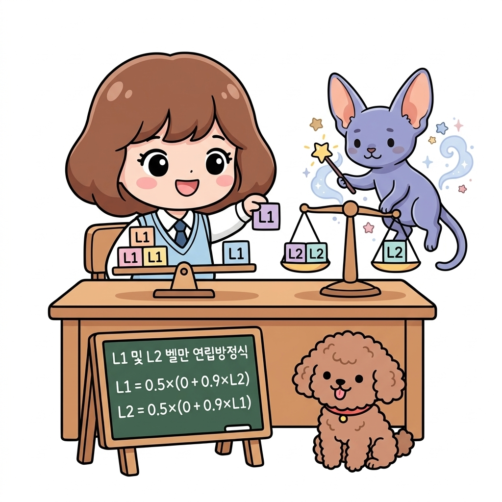

**그림 06-3** X와 Y 블록이 얹혀 있는 마법 저울들의 수평을 지팡이로 정교하게 맞추어 연립방정식을 연산하는 도로시와 지니

---

벨만 방정식은 강화 학습 문제를 풀기 위한 중요한 **기초**를 제공합니다. 

벨만 방정식을 이용하면 상태 가치 함수를 구할 수 있죠. 

이번 절에서는 그 '위력'을 보여주기 위해 벨만 방정식을 이용해 실제로 문제를 풀어보겠습니다.

  

    🎧
    대화 음성 듣기 (도로시 & 지니)
  

  

    <button type="button" class="btn-audio-play" style="background: #0284c7; color: #ffffff; border: none; border-radius: 16px; padding: 5px 13px; font-size: 0.82rem; font-weight: 600; cursor: pointer; display: inline-flex; align-items: center; gap: 4px; box-shadow: 0 1px 2px rgba(2,132,199,0.3);">
      ▶️ 재생
    </button>
    <button type="button" class="btn-audio-stop" style="background: #e2e8f0; color: #475569; border: none; border-radius: 16px; padding: 5px 11px; font-size: 0.82rem; font-weight: 600; cursor: pointer; display: inline-flex; align-items: center; gap: 4px;">
      ⏹️ 정지
    </button>
  

  <audio src="./audio/dialogue_6_3_scene2.mp3" preload="none"></audio>

> 👧 **도로시**: "벨만 방정식의 위력을 직접 눈으로 확인해보고 싶어!"
> 
> 🐱 **지니**: "좋아! 복잡한 미래의 무한한 길을 단 두 개의 깔끔한 연립방정식으로 압축하는 마법을 보여줄게!"

---

### 06.3.1 두 칸짜리 그리드 월드

여기서 다룰 문제는 [그림 06-7]의 '두 칸짜리 그리드 월드'입니다. 

#### 문제의 정의, 그리드 월드

그림 06-7 두 칸짜리 그리드 월드(벽에 부딪히면 -1, 사과를 얻으면 +1, 사과는 계속 생성)

  

    🎧
    대화 음성 듣기 (도로시 & 지니)
  

  

    <button type="button" class="btn-audio-play" style="background: #0284c7; color: #ffffff; border: none; border-radius: 16px; padding: 5px 13px; font-size: 0.82rem; font-weight: 600; cursor: pointer; display: inline-flex; align-items: center; gap: 4px; box-shadow: 0 1px 2px rgba(2,132,199,0.3);">
      ▶️ 재생
    </button>
    <button type="button" class="btn-audio-stop" style="background: #e2e8f0; color: #475569; border: none; border-radius: 16px; padding: 5px 11px; font-size: 0.82rem; font-weight: 600; cursor: pointer; display: inline-flex; align-items: center; gap: 4px;">
      ⏹️ 정지
    </button>
  

  <audio src="./audio/dialogue_6_3_scene3.mp3" preload="none"></audio>

> 👧 **도로시**: "L1과 L2, 딱 두 칸짜리 격자 세상이네? 룰은 어떻게 돼?"
> 
> 🐱 **지니**: "벽에 쾅 부딪히면 벌점 -1점이고, 탐스러운 사과를 따먹으면 보너스 +1점이야! 사과는 먹어도 계속 새로 열린단다!"

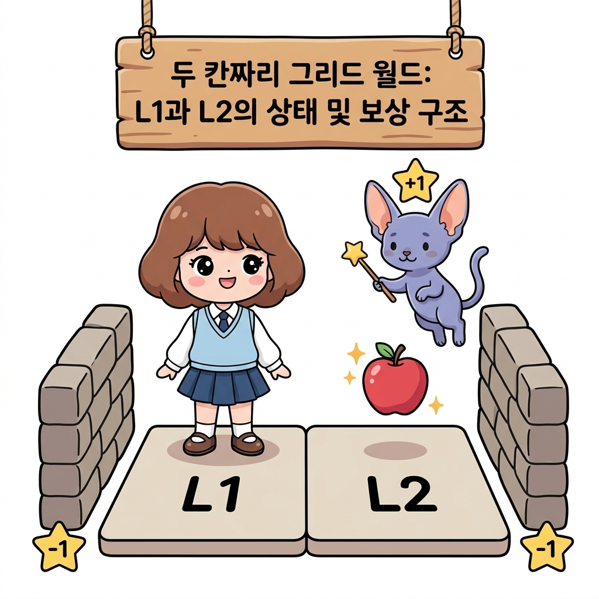

---

#### 문제의 시작

이번에는 에이전트가 **무작위**로 움직인다고 가정합니다. 

즉 50%의 확률로는 오른쪽, 나머지 50%의 확률로 왼쪽으로 이동합니다.

  

    🎧
    대화 음성 듣기 (도로시 & 지니)
  

  

    <button type="button" class="btn-audio-play" style="background: #0284c7; color: #ffffff; border: none; border-radius: 16px; padding: 5px 13px; font-size: 0.82rem; font-weight: 600; cursor: pointer; display: inline-flex; align-items: center; gap: 4px; box-shadow: 0 1px 2px rgba(2,132,199,0.3);">
      ▶️ 재생
    </button>
    <button type="button" class="btn-audio-stop" style="background: #e2e8f0; color: #475569; border: none; border-radius: 16px; padding: 5px 11px; font-size: 0.82rem; font-weight: 600; cursor: pointer; display: inline-flex; align-items: center; gap: 4px;">
      ⏹️ 정지
    </button>
  

  <audio src="./audio/dialogue_6_3_scene4.mp3" preload="none"></audio>

> 👧 **도로시**: "여기서 내가 왼쪽이나 오른쪽으로 반반의 확률로 걸어간다는 거지?"
> 
> 🐱 **지니**: "맞아! 반반, 즉 50% 확률로 왼쪽이나 오른쪽을 고르는 **무작위 정책**을 따르는 거야!"

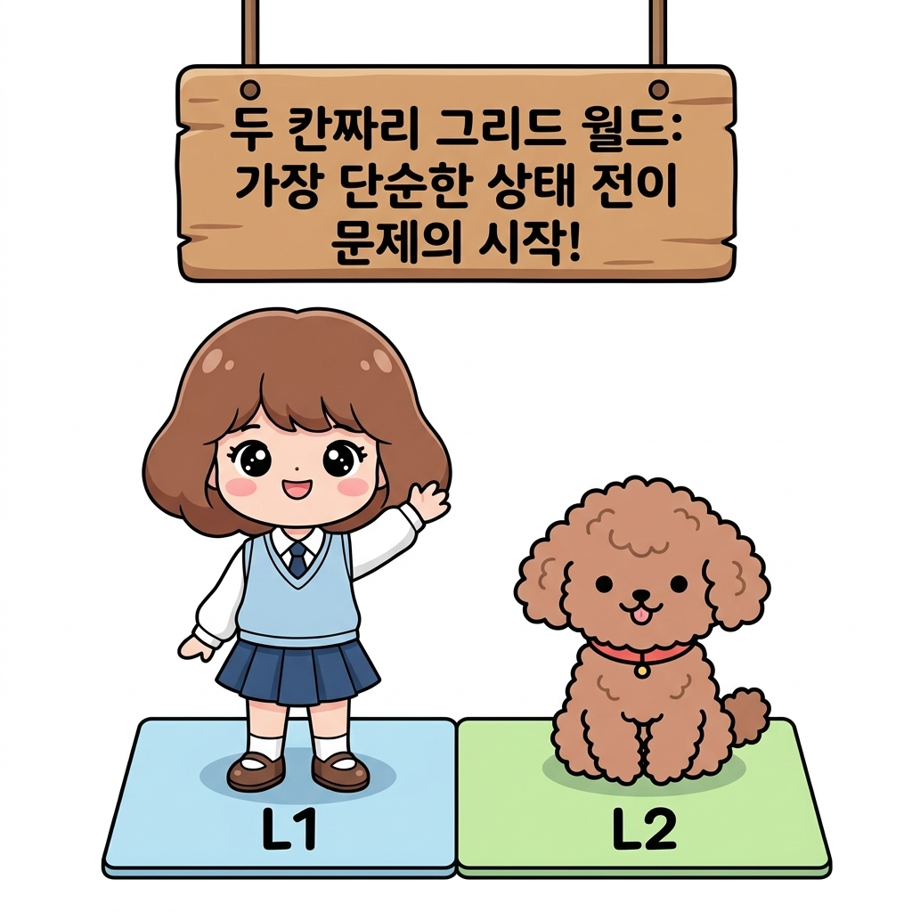

---

#### L1 에서 시작시 기대수익

*v**π*(*L1*)은 상태 *L1*에서 무작위 정책 *π*에 따라 행동했을 때 얻을 수 있는 기대 수익입니다. 

이 기대 수익은 앞으로 **무한히** 지속되는 **보상의 총합**입니다. 

  

    🎧
    대화 음성 듣기 (도로시 & 지니)
  

  

    <button type="button" class="btn-audio-play" style="background: #0284c7; color: #ffffff; border: none; border-radius: 16px; padding: 5px 13px; font-size: 0.82rem; font-weight: 600; cursor: pointer; display: inline-flex; align-items: center; gap: 4px; box-shadow: 0 1px 2px rgba(2,132,199,0.3);">
      ▶️ 재생
    </button>
    <button type="button" class="btn-audio-stop" style="background: #e2e8f0; color: #475569; border: none; border-radius: 16px; padding: 5px 11px; font-size: 0.82rem; font-weight: 600; cursor: pointer; display: inline-flex; align-items: center; gap: 4px;">
      ⏹️ 정지
    </button>
  

  <audio src="./audio/dialogue_6_3_scene5.mp3" preload="none"></audio>

> 👧 **도로시**: "L1에서 출발해서 영원히 움직이면 받을 수 있는 기대 수익은 어떻게 계산할까?"
> 
> 🐱 **지니**: "앞으로 무한히 계속해서 받을 미래 보상들의 총합인데, 끝없이 이어져서 직접 더하기는 불가능해 보여!"

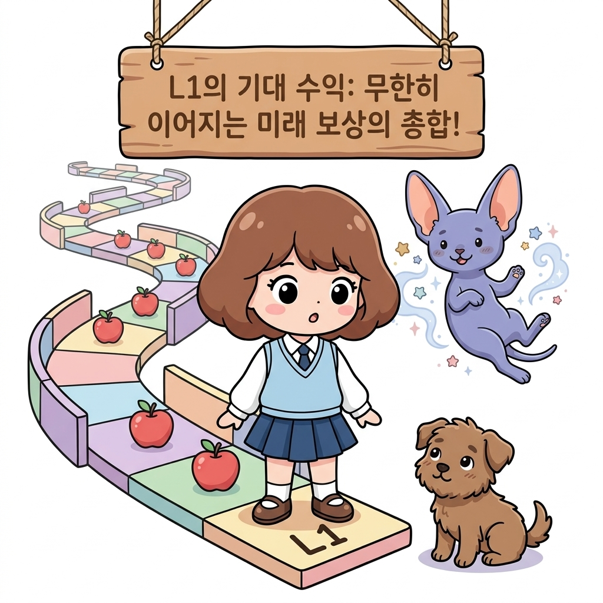

---

#### 그럼, L1 에 대해서 백업 다이어그램부터 살펴보죠

그림 06-8 넓게 퍼져나가는 백업 다이어그램(이번 문제에서 상태는 결정적으로 전이됨)

  

    🎧
    대화 음성 듣기 (도로시 & 지니)
  

  

    <button type="button" class="btn-audio-play" style="background: #0284c7; color: #ffffff; border: none; border-radius: 16px; padding: 5px 13px; font-size: 0.82rem; font-weight: 600; cursor: pointer; display: inline-flex; align-items: center; gap: 4px; box-shadow: 0 1px 2px rgba(2,132,199,0.3);">
      ▶️ 재생
    </button>
    <button type="button" class="btn-audio-stop" style="background: #e2e8f0; color: #475569; border: none; border-radius: 16px; padding: 5px 11px; font-size: 0.82rem; font-weight: 600; cursor: pointer; display: inline-flex; align-items: center; gap: 4px;">
      ⏹️ 정지
    </button>
  

  <audio src="./audio/dialogue_6_3_scene6.mp3" preload="none"></audio>

> 👧 **도로시**: "우와, 백업 다이어그램을 그려보니까 가지가 끝도 없이 퍼져나가네!"
> 
> 🐱 **지니**: "한 걸음 걸을 때마다 두 갈래씩 영원히 뻗어나가니까, 나무처럼 거대해지는 무한 분기란다!"

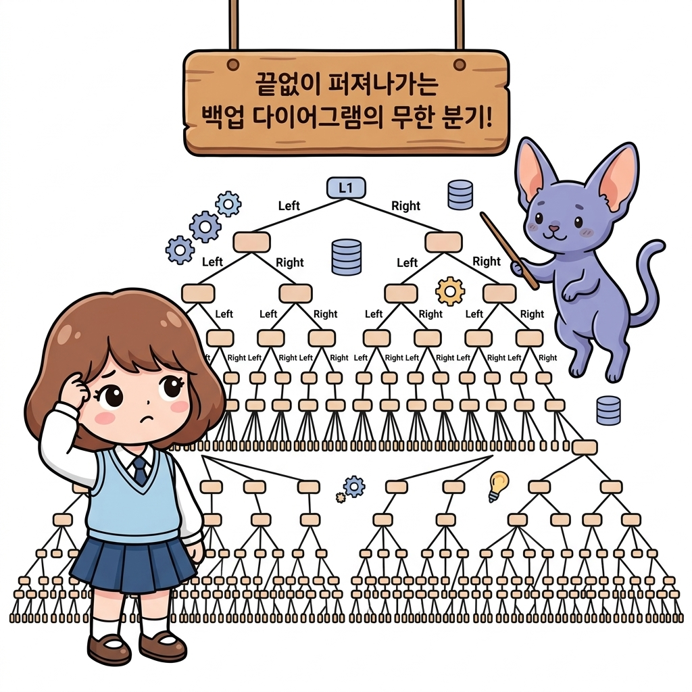

[그림 06-8]과 같이 지금 문제는 무한히 분기되어 뻗어나가는 계산입니다. 

---

#### 무한한 분기, 벨만 방정식의 필요성

이처럼 **무한히 분기**하는 계산을 **벨만 방정식**을 이용하여 구할 수 있습니다. 

  

    🎧
    대화 음성 듣기 (도로시 & 지니)
  

  

    <button type="button" class="btn-audio-play" style="background: #0284c7; color: #ffffff; border: none; border-radius: 16px; padding: 5px 13px; font-size: 0.82rem; font-weight: 600; cursor: pointer; display: inline-flex; align-items: center; gap: 4px; box-shadow: 0 1px 2px rgba(2,132,199,0.3);">
      ▶️ 재생
    </button>
    <button type="button" class="btn-audio-stop" style="background: #e2e8f0; color: #475569; border: none; border-radius: 16px; padding: 5px 11px; font-size: 0.82rem; font-weight: 600; cursor: pointer; display: inline-flex; align-items: center; gap: 4px;">
      ⏹️ 정지
    </button>
  

  <audio src="./audio/dialogue_6_3_scene7.mp3" preload="none"></audio>

> 👧 **도로시**: "다람쥐 쳇바퀴처럼 끝없는 무한 계산의 굴레에서 어떻게 빠져나오지?"
> 
> 🐱 **지니**: "바로 벨만 방정식이라는 마법 열쇠를 쓰면, 무한한 미래가 단 하나의 징검다리 점화식으로 쏙 정리된단다!"

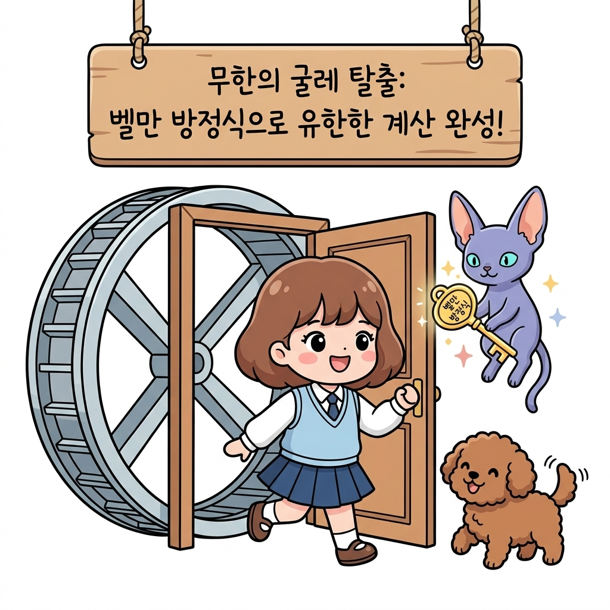

---

#### 그럼 벨만 방정식을 이용하여 *v**π*(*L1*)을 표현해봅시다

06.2.2절의 [식 06.7]에서 보았듯이 벨만 방정식은 다음과 같이 나타냅니다.

$$
\begin{aligned}
v_{\pi}(s) &= \sum_{a, s'} \pi(a \mid s) p(s' \mid s, a) \{ r(s, a, s') + \gamma v_{\pi}(s') \} \\
&= \sum_a \pi(a \mid s) \sum_{s'} p(s' \mid s, a) \{ r(s, a, s') + \gamma v_{\pi}(s') \}
\end{aligned}
$$

[식 06.7]

[식 06.7]의 첫 번째 식에서 두 번째 식으로 넘어가는 과정은, 모든 조합에 대한 총합 기호인 *Σ**a*, *s'*를 행동에 대한 합 *Σ**a*와 다음 상태에 대한 합 *Σ**s'*로 분리해 적은 것입니다. 

이는 행동과 상태의 결합 **기댓값**을 단계적으로 계산하기 위한 준비 단계입니다.

  

    🎧
    대화 음성 듣기 (도로시 & 지니)
  

  

    <button type="button" class="btn-audio-play" style="background: #0284c7; color: #ffffff; border: none; border-radius: 16px; padding: 5px 13px; font-size: 0.82rem; font-weight: 600; cursor: pointer; display: inline-flex; align-items: center; gap: 4px; box-shadow: 0 1px 2px rgba(2,132,199,0.3);">
      ▶️ 재생
    </button>
    <button type="button" class="btn-audio-stop" style="background: #e2e8f0; color: #475569; border: none; border-radius: 16px; padding: 5px 11px; font-size: 0.82rem; font-weight: 600; cursor: pointer; display: inline-flex; align-items: center; gap: 4px;">
      ⏹️ 정지
    </button>
  

  <audio src="./audio/dialogue_6_3_scene8.mp3" preload="none"></audio>

> 👧 **도로시**: "벨만 방정식의 시그마 기호가 행동과 다음 상태 둘 다 더하고 있네?"
> 
> 🐱 **지니**: "맞아! 행동에 대한 합과 다음 상태에 대한 합을 둘로 똑 떨어지게 분리하면 단계별로 계산하기 아주 쉬워져!"

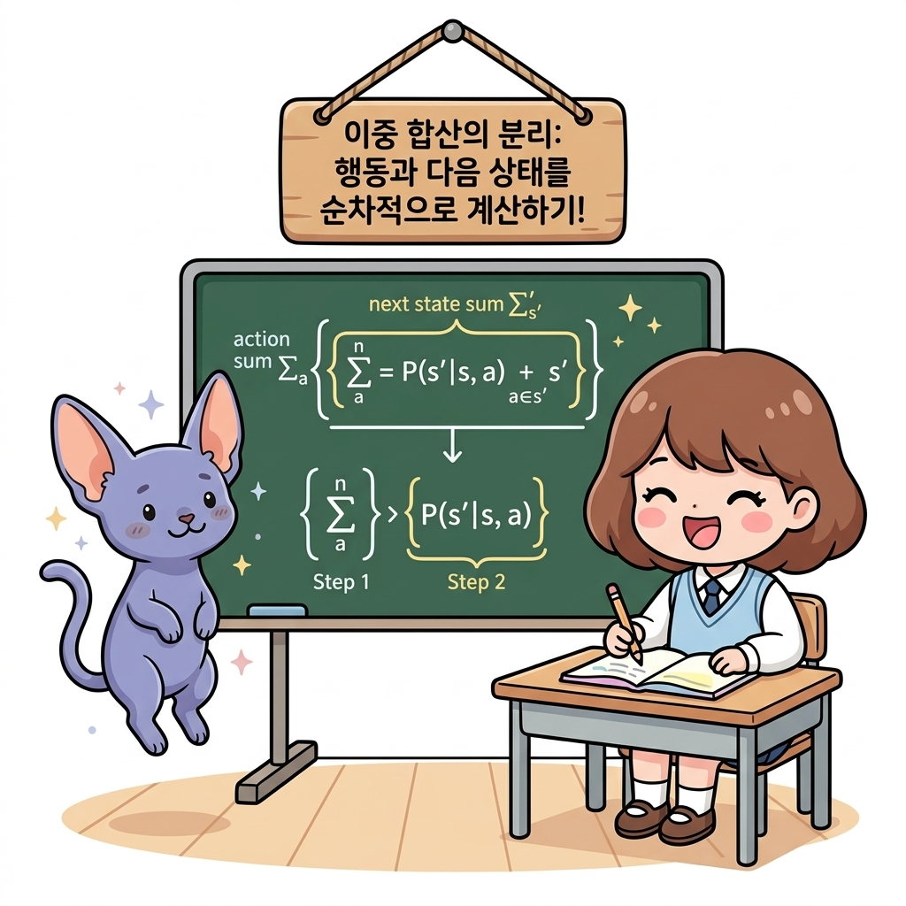

---

#### 결정적 상태전이

또한, 이번 그리드 월드 예제처럼 **상태 전이가 결정적(deterministic)**일 때는 수식이 아주 큰 폭으로 간소화됩니다. 

결정적 전이란 상태 *s*에서 행동 *a*를 취했을 때 도달할 다음 상태가 확률적으로 나뉘지 않고, 오직 하나의 상태 *s'* = *f*(*s*, *a*)로 **100%** 확실하게 정해지는 상황을 뜻합니다. 

  

    🎧
    대화 음성 듣기 (도로시 & 지니)
  

  

    <button type="button" class="btn-audio-play" style="background: #0284c7; color: #ffffff; border: none; border-radius: 16px; padding: 5px 13px; font-size: 0.82rem; font-weight: 600; cursor: pointer; display: inline-flex; align-items: center; gap: 4px; box-shadow: 0 1px 2px rgba(2,132,199,0.3);">
      ▶️ 재생
    </button>
    <button type="button" class="btn-audio-stop" style="background: #e2e8f0; color: #475569; border: none; border-radius: 16px; padding: 5px 11px; font-size: 0.82rem; font-weight: 600; cursor: pointer; display: inline-flex; align-items: center; gap: 4px;">
      ⏹️ 정지
    </button>
  

  <audio src="./audio/dialogue_6_3_scene9.mp3" preload="none"></audio>

> 👧 **도로시**: "이번 격자 세상은 발을 헛디딜 확률 없이, 내가 걸어간 칸으로 정확히 이동하지?"
> 
> 🐱 **지니**: "빙고! 바람이나 미끄러짐이 없는 결정적 전이라서, 다음 상태가 100% 확실하게 정해진단다!"

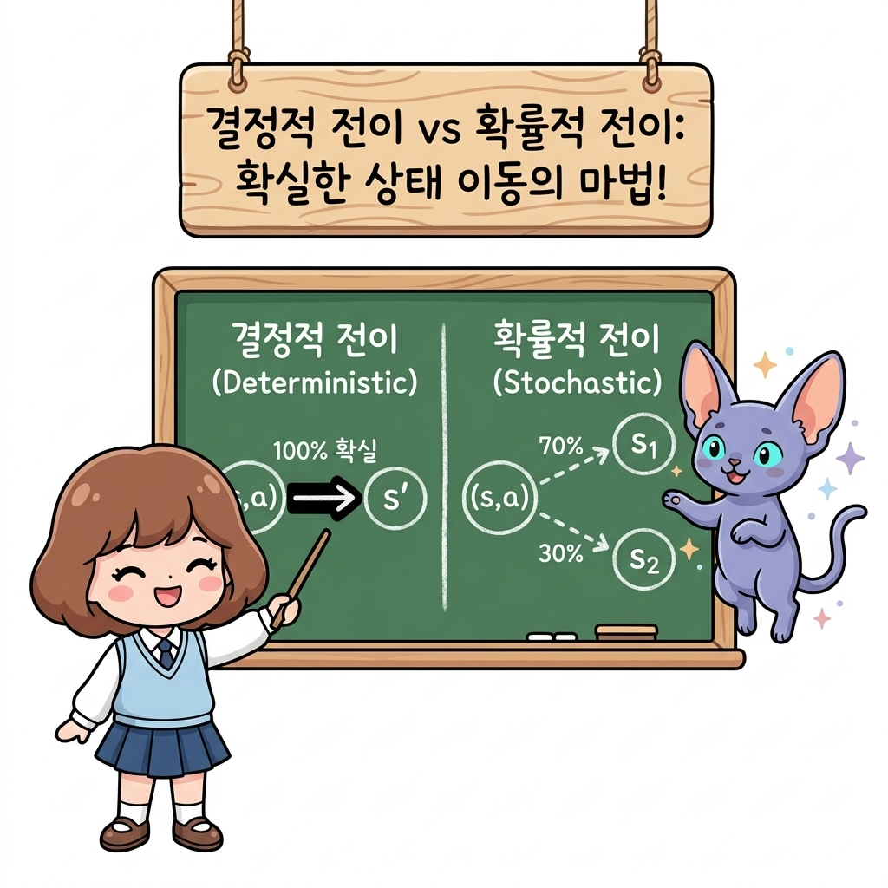

---

#### 상태전이 함수

이러한 관계를 상태 전이 확률 *p*(*s'* | *s*, *a*) 대신 **상태 전이 함수 *f*(*s*, *a*)**를 사용하여 대입하면 다음과 같습니다.

이를 [식 06.7]에 대입하면 다음과 같습니다.

*   *s'* = *f*(*s*, *a*)인 표적 상태로 갈 확률: *p*(*s'* | *s*, *a*) = 1
*   그 외의 다른 모든 상태로 갈 확률: *p*(*s'* | *s*, *a*) = 0

  

    🎧
    대화 음성 듣기 (도로시 & 지니)
  

  

    <button type="button" class="btn-audio-play" style="background: #0284c7; color: #ffffff; border: none; border-radius: 16px; padding: 5px 13px; font-size: 0.82rem; font-weight: 600; cursor: pointer; display: inline-flex; align-items: center; gap: 4px; box-shadow: 0 1px 2px rgba(2,132,199,0.3);">
      ▶️ 재생
    </button>
    <button type="button" class="btn-audio-stop" style="background: #e2e8f0; color: #475569; border: none; border-radius: 16px; padding: 5px 11px; font-size: 0.82rem; font-weight: 600; cursor: pointer; display: inline-flex; align-items: center; gap: 4px;">
      ⏹️ 정지
    </button>
  

  <audio src="./audio/dialogue_6_3_scene10.mp3" preload="none"></audio>

> 👧 **도로시**: "다음 칸이 100% 확실하다면, 전이 확률은 어떻게 바뀌어?"
> 
> 🐱 **지니**: "도착할 한 곳의 확률만 1이고, 나머지 다른 곳으로 갈 확률은 몽땅 0이 된단다!"

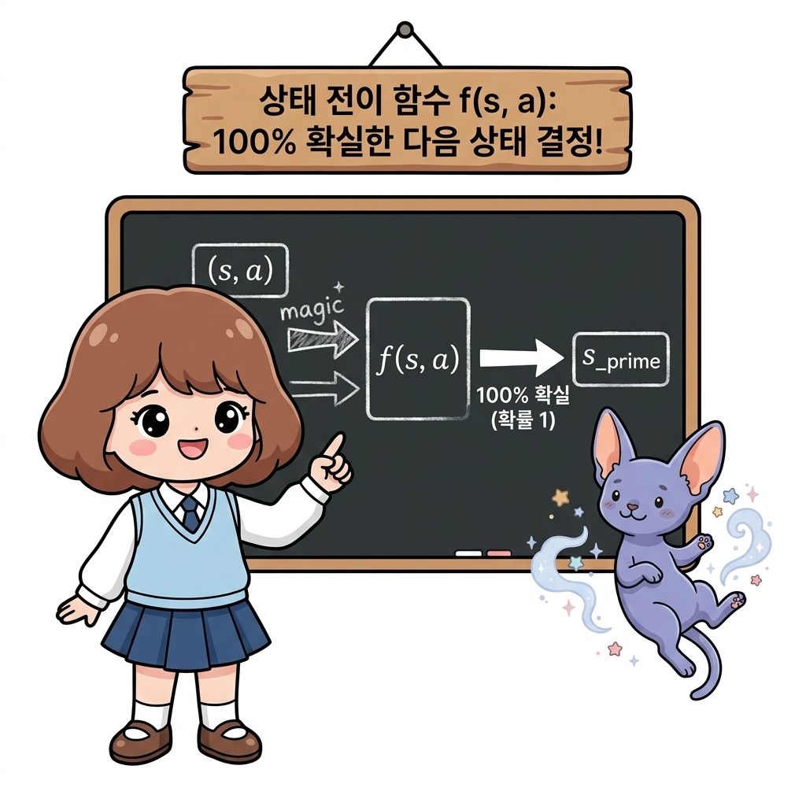

---

#### 합산 기호의 소멸

따라서 [식 06.7]의 상태 합(*Σ**s'*) 부분에서는 확률이 0인 항들이 모두 사라지고, 오직 *s'* = *f*(*s*, *a*)인 항 하나만 살아남아 합산 기호(*Σ**s'*) 자체가 완전히 사라지게 됩니다. 

  

    🎧
    대화 음성 듣기 (도로시 & 지니)
  

  

    <button type="button" class="btn-audio-play" style="background: #0284c7; color: #ffffff; border: none; border-radius: 16px; padding: 5px 13px; font-size: 0.82rem; font-weight: 600; cursor: pointer; display: inline-flex; align-items: center; gap: 4px; box-shadow: 0 1px 2px rgba(2,132,199,0.3);">
      ▶️ 재생
    </button>
    <button type="button" class="btn-audio-stop" style="background: #e2e8f0; color: #475569; border: none; border-radius: 16px; padding: 5px 11px; font-size: 0.82rem; font-weight: 600; cursor: pointer; display: inline-flex; align-items: center; gap: 4px;">
      ⏹️ 정지
    </button>
  

  <audio src="./audio/dialogue_6_3_scene11.mp3" preload="none"></audio>

> 👧 **도로시**: "확률이 0인 항들을 지우니까 다음 상태 시그마 기호가 통째로 사라졌어!"
> 
> 🐱 **지니**: "그렇지! 오직 확실한 한 칸만 남으니, 복잡했던 상태 합산 기호가 마법처럼 펑 하고 사라진 거야!"

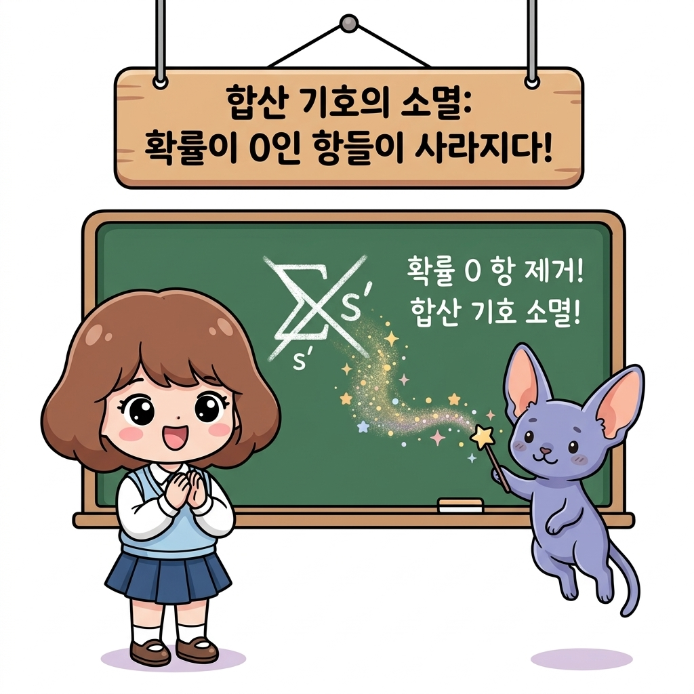

---

#### 간소화

결과적으로 **확률적(stochastic)** 환경에서 **결정적(deterministic)** 환경으로 넘어가면서, 다음 상태에 대한 확률 합산 부분인 *Σ**s'* *p*(*s'* | *s*, *a*)가 완전히 사라지게 됩니다.

이 과정을 수식으로 구체적으로 살펴보면 다음과 같습니다.

일반적인 벨만 방정식 [식 06.7]에서는 상태 *s*에서 행동 *a*를 취했을 때 **바람이나 미끄러짐 등으로 인해 도달할 수 있는** 여러 다음 상태 *s'*들의 가중 평균(기댓값)을 구하기 위해 다음 상태에 대한 합산 *Σ**s'* *p*(*s'* | *s*, *a*)를 사용했습니다.

$$
\sum_{s'} p(s' \mid s, a) \{ r(s, a, s') + \gamma v_{\pi}(s') \}
$$

하지만 **결정적 환경**에서는 상태 *s*에서 행동 *a*를 취했을 때 도달하는 다음 상태가 **상태 전이 함수 *s'* = *f*(*s*, *a*)로 100%** 확실히 정해집니다. 따라서 상태 전이 확률은 다음과 같이 단순해집니다.

*   *s'* = *f*(*s*, *a*) 일 때: *p*(*s'* | *s*, *a*) = 1
*   *s'* ≠ *f*(*s*, *a*) 일 때: *p*(*s'* | *s*, *a*) = 0

이를 다음 상태 합산식에 대입하여 전개하면, 확률이 0인 다른 모든 상태의 항들은 전부 0이 되어 사라지고, 오직 *s'* = *f*(*s*, *a*)인 단 하나의 항만 남게 됩니다.

$$
\begin{aligned}
\sum_{s'} p(s' \mid s, a) \{ r(s, a, s') + \gamma v_{\pi}(s') \}
&= 1 \cdot \{ r(s, a, f(s, a)) + \gamma v_{\pi}(f(s, a)) \} + 0 + 0 + \cdots \\
&= r(s, a, s') + \gamma v_{\pi}(s') \quad (\text{단, } s' = f(s, a))
\end{aligned}
$$

즉, **환경의 불확실성이 사라졌기 때문**에 다음 상태에 대한 합산 기호 *Σ**s'*와 전이 확률 *p*(*s'* | *s*, *a*)가 통째로 사라지고(소멸하고), 오직 에이전트가 어떤 행동을 선택할지에 대한 정책 확률 *Σ**a* *π*(*a* | *s*)만 남게 되는 것입니다.

결과적으로 벨만 방정식 [식 06.8]은 다음과 같이 매우 단순한 형태로 정리됩니다.

*s'* = *f*(*s*, *a*) 일 때,

$$
v_{\pi}(s) = \sum_a \pi(a \mid s) \{ r(s, a, s') + \gamma v_{\pi}(s') \}
$$

[식 06.8]

  

    🎧
    대화 음성 듣기 (도로시 & 지니)
  

  

    <button type="button" class="btn-audio-play" style="background: #0284c7; color: #ffffff; border: none; border-radius: 16px; padding: 5px 13px; font-size: 0.82rem; font-weight: 600; cursor: pointer; display: inline-flex; align-items: center; gap: 4px; box-shadow: 0 1px 2px rgba(2,132,199,0.3);">
      ▶️ 재생
    </button>
    <button type="button" class="btn-audio-stop" style="background: #e2e8f0; color: #475569; border: none; border-radius: 16px; padding: 5px 11px; font-size: 0.82rem; font-weight: 600; cursor: pointer; display: inline-flex; align-items: center; gap: 4px;">
      ⏹️ 정지
    </button>
  

  <audio src="./audio/dialogue_6_3_scene12.mp3" preload="none"></audio>

> 👧 **도로시**: "결정적 환경의 벨만 방정식 식 06.8이 이렇게나 간단해지다니!"
> 
> 🐱 **지니**: "각 행동을 고를 확률에, 그때 얻는 즉각 보상과 다음 상태 가치만 쏙 곱해서 더해주면 끝이란다!"

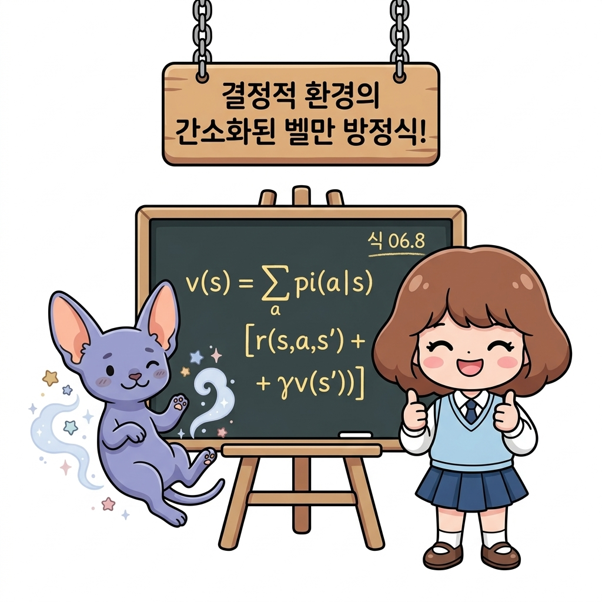

---

#### 문제대입

이제 [식 06.8]에 이번 문제를 대입해보죠. 

[그림 06-9]의 백업 다이어그램을 참고하면서 진행하겠습니다.

[그림 06-9] *v**π*(*L1*)을 구하기 위한 백업 다이어그램

[그림 06-9]를 보면 백업 다이어그램이 두 갈래로 나뉘어 있습니다. 

  

    🎧
    대화 음성 듣기 (도로시 & 지니)
  

  

    <button type="button" class="btn-audio-play" style="background: #0284c7; color: #ffffff; border: none; border-radius: 16px; padding: 5px 13px; font-size: 0.82rem; font-weight: 600; cursor: pointer; display: inline-flex; align-items: center; gap: 4px; box-shadow: 0 1px 2px rgba(2,132,199,0.3);">
      ▶️ 재생
    </button>
    <button type="button" class="btn-audio-stop" style="background: #e2e8f0; color: #475569; border: none; border-radius: 16px; padding: 5px 11px; font-size: 0.82rem; font-weight: 600; cursor: pointer; display: inline-flex; align-items: center; gap: 4px;">
      ⏹️ 정지
    </button>
  

  <audio src="./audio/dialogue_6_3_scene13.mp3" preload="none"></audio>

> 👧 **도로시**: "이제 L1의 백업 다이어그램을 보면서 수식을 조립해볼까?"
> 
> 🐱 **지니**: "좋아! L1에서는 왼쪽으로 벽을 들이받는 길과, 오른쪽으로 사과를 향해 가는 딱 두 갈래 길만 보면 돼!"

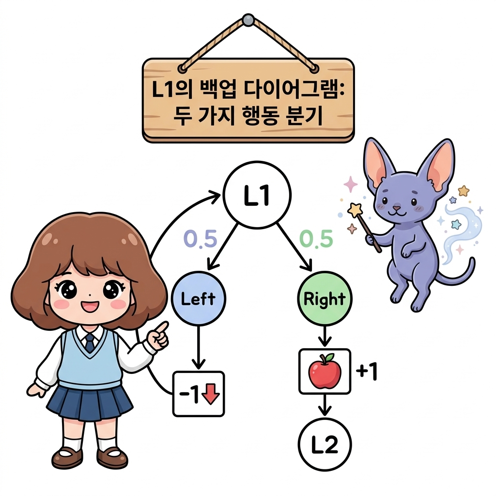

---

#### 그럼, L1에서 Left 이동 할때를 생각해 보자

먼저 에이전트가 상태 *L1*에서 **왼쪽(Left)**으로 이동하는 첫 번째 갈래 길을 살펴보겠습니다.

무작위 정책에 따라 에이전트는 **0.5의 확률**(*π*(Left | *L1*) = 0.5)로 왼쪽 행동을 선택합니다. 

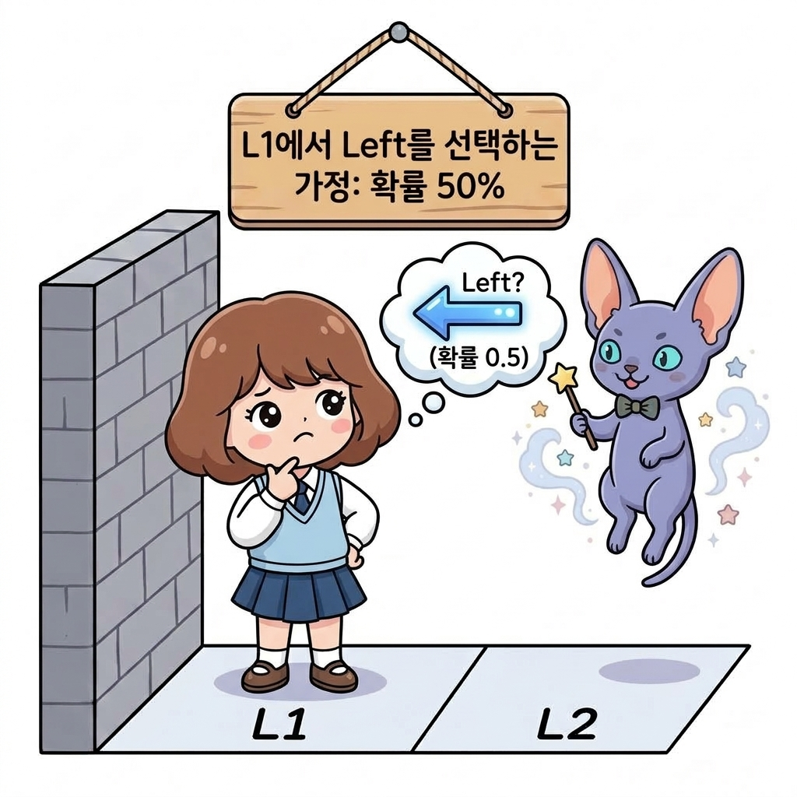

하지만 *L1*의 왼쪽은 막혀 있는 벽이기 때문에, 에이전트는 앞으로 나아가지 못하고 벽에 부딪혀 **제자리인 *L1*에 그대로 남게 됩니다**(상태가 전이되지 않고 *s'* = *L1*). 이때 벽에 부딪힌 대가로 **-1의 즉각 보상**(*r* = -1)을 받습니다. 

  

    🎧
    대화 음성 듣기 (도로시 & 지니)
  

  

    <button type="button" class="btn-audio-play" style="background: #0284c7; color: #ffffff; border: none; border-radius: 16px; padding: 5px 13px; font-size: 0.82rem; font-weight: 600; cursor: pointer; display: inline-flex; align-items: center; gap: 4px; box-shadow: 0 1px 2px rgba(2,132,199,0.3);">
      ▶️ 재생
    </button>
    <button type="button" class="btn-audio-stop" style="background: #e2e8f0; color: #475569; border: none; border-radius: 16px; padding: 5px 11px; font-size: 0.82rem; font-weight: 600; cursor: pointer; display: inline-flex; align-items: center; gap: 4px;">
      ⏹️ 정지
    </button>
  

  <audio src="./audio/dialogue_6_3_scene14.mp3" preload="none"></audio>

> 👧 **도로시**: "L1에서 왼쪽으로 가면 벽에 쿵 부딪혀서 제자리 L1에 남고 감점 -1이네!"
> 
> 🐱 **지니**: "맞아, 50% 확률에 보상 -1 더하기 할인율 0.9 곱하기 v(L1)을 묶어주면 돼!"

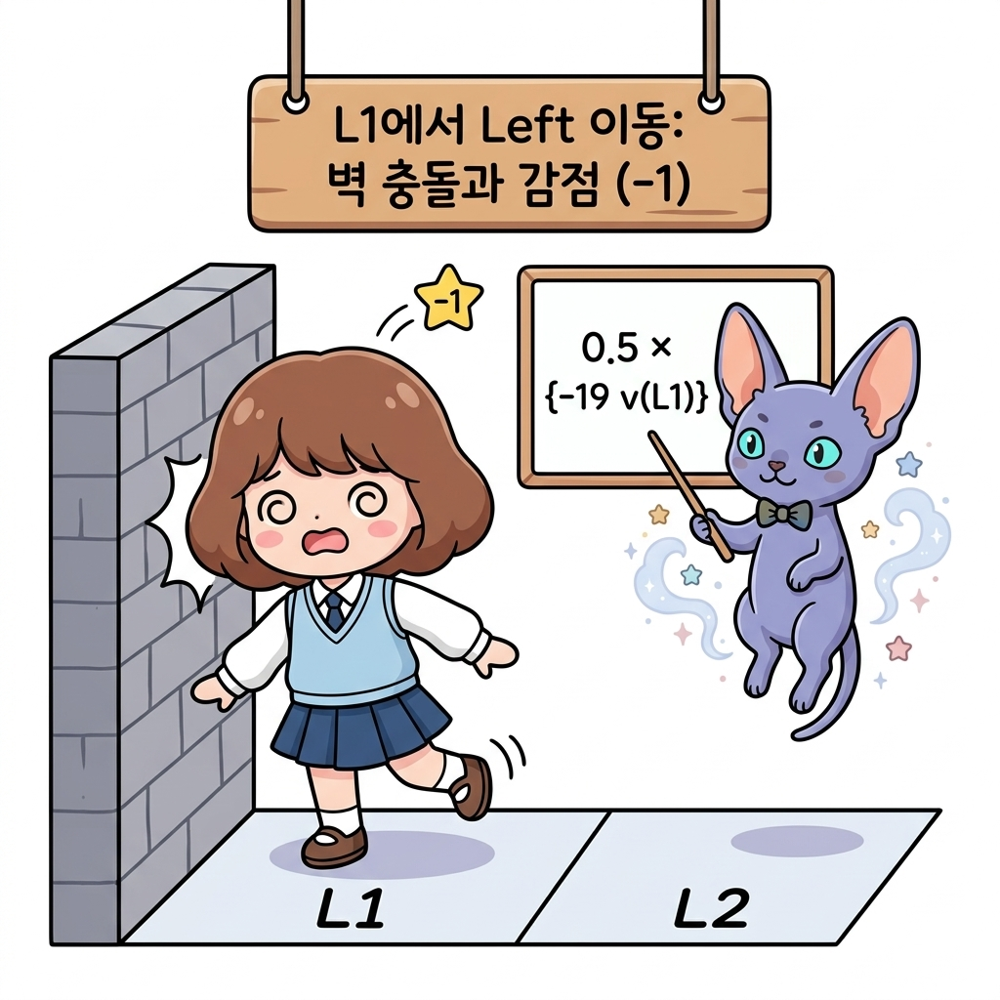

이제 앞서 유도한 간소화된 벨만 방정식 [식 06.8]의 항에 이 값들을 하나씩 차근차근 대입해볼까요?

*   **행동 선택 확률**: *π*(Left | *L1*) = 0.5
*   **즉각 보상**: *r*(*L1*, Left, *L1*) = -1
*   **할인율**: *γ* = 0.9
*   **다음 상태 가치**: 제자리로 돌아왔으므로 *v**π*(*s'*) = *v**π*(*L1*)

따라서 행동 Left를 선택했을 때 얻게 되는 기대 수익 부분은 다음과 같이 깔끔하게 정리됩니다.

$$
0.5 \{ -1 + 0.9 v_{\pi}(L1) \}
$$

---

#### 다음으로 L1에서 Right 이동 할때

이번에는 [그림 06-9]의 두 번째 갈래 길인 **오른쪽(Right)**으로 이동하는 경우를 살펴보겠습니다.

마찬가지로 무작위 정책에 따라 에이전트는 **0.5의 확률**(*π*(Right | *L1*) = 0.5)로 오른쪽 행동을 선택합니다.

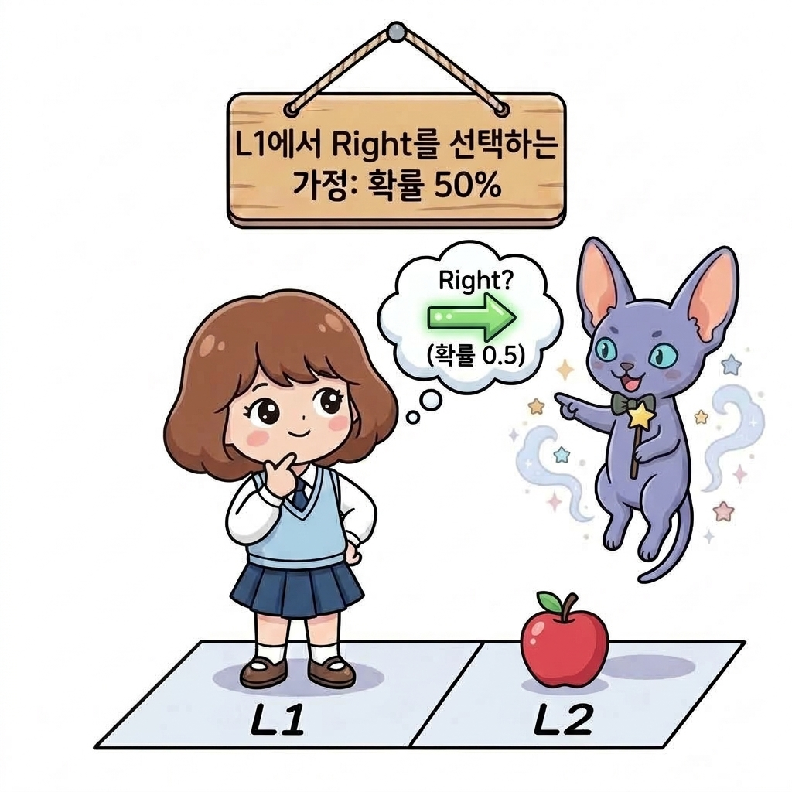

상태 *L1*의 오른쪽에는 이동을 가로막는 벽이 없고, 대신 탐스러운 사과가 놓여 있는 상태 *L2*가 있습니다. 따라서 에이전트는 아무런 방해 없이 **상태 *L2*로 전이**(*s'* = *L2*)하게 되며, 맛있는 사과를 획득한 보상으로 **+1의 즉각 보상**(*r* = 1)을 받습니다.

  

    🎧
    대화 음성 듣기 (도로시 & 지니)
  

  

    <button type="button" class="btn-audio-play" style="background: #0284c7; color: #ffffff; border: none; border-radius: 16px; padding: 5px 13px; font-size: 0.82rem; font-weight: 600; cursor: pointer; display: inline-flex; align-items: center; gap: 4px; box-shadow: 0 1px 2px rgba(2,132,199,0.3);">
      ▶️ 재생
    </button>
    <button type="button" class="btn-audio-stop" style="background: #e2e8f0; color: #475569; border: none; border-radius: 16px; padding: 5px 11px; font-size: 0.82rem; font-weight: 600; cursor: pointer; display: inline-flex; align-items: center; gap: 4px;">
      ⏹️ 정지
    </button>
  

  <audio src="./audio/dialogue_6_3_scene15.mp3" preload="none"></audio>

> 👧 **도로시**: "오른쪽으로 가면 L2로 넘어가면서 달콤한 사과 보너스 +1을 받네!"
> 
> 🐱 **지니**: "정답이야! 50% 확률에 보상 1 더하기 할인율 0.9 곱하기 v(L2)를 곱해주면 되지!"

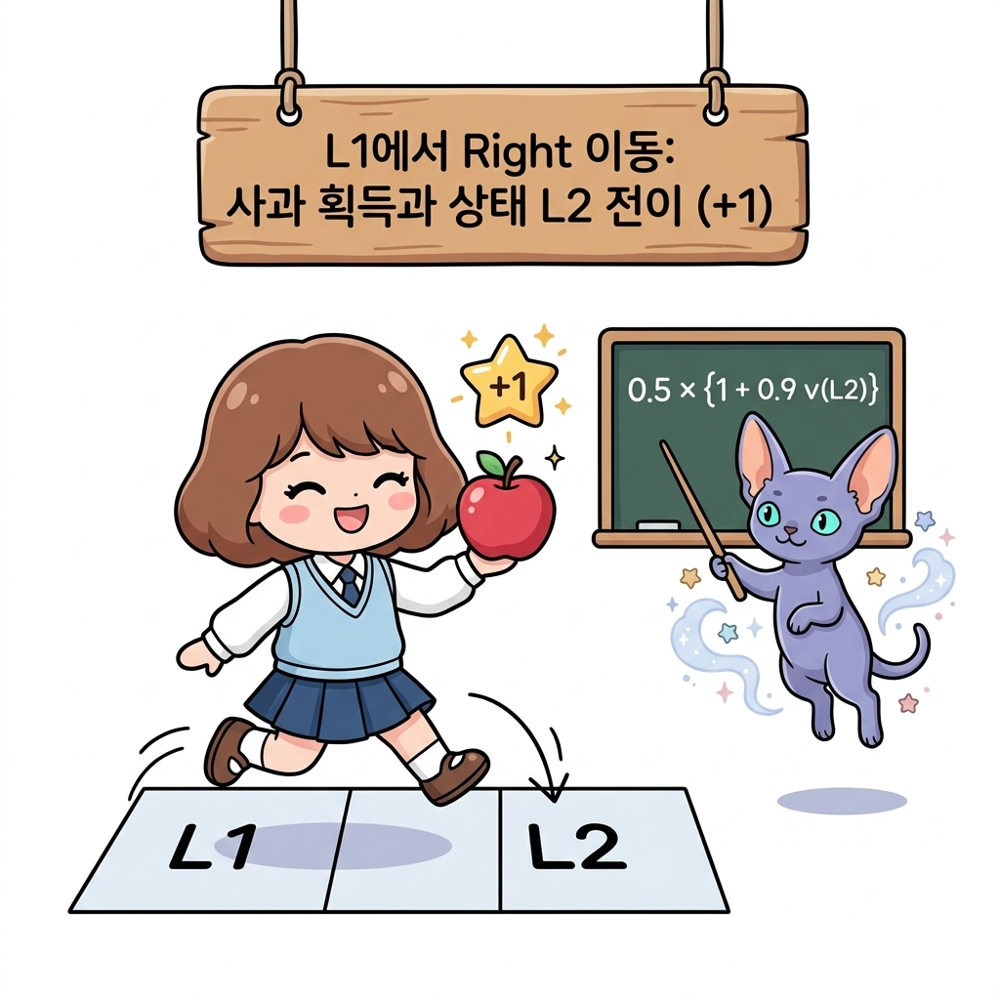

이제 앞서 유도한 간소화된 벨만 방정식 [식 06.8]의 항에 이 값들을 하나씩 차근차근 대입해볼까요?

*   **행동 선택 확률**: *π*(Right | *L1*) = 0.5
*   **즉각 보상**: *r*(*L1*, Right, *L2*) = 1
*   **할인율**: *γ* = 0.9
*   **다음 상태 가치**: 다음 칸인 *L2*에 도달했으므로 *v**π*(*s'*) = *v**π*(*L2*)

따라서 행동 Right를 선택했을 때 얻게 되는 기대 수익 부분은 다음과 같이 깔끔하게 정리됩니다.

$$
0.5 \{ 1 + 0.9 v_{\pi}(L2) \}
$$

---

#### *L1*에서의 벨만 방정식 정리하기

앞서 우리는 상태 *L1*에서 갈 수 있는 두 가지 행동(Left, Right)의 기대 수익을 각각 구해보았습니다.

*   **Left 이동 시**: 0.5 { -1 + 0.9 *v**π*(*L1*) }
*   **Right 이동 시**: 0.5 { 1 + 0.9 *v**π*(*L2*) }

이제 벨만 방정식 [식 06.8]에 따라, 상태 *L1*에서 가능한 이 두 갈래 길의 식을 **하나로 합쳐주기만 하면** 상태 *L1*의 벨만 방정식이 완성됩니다.

$$
v_{\pi}(L1) = 0.5 \{ -1 + 0.9 v_{\pi}(L1) \} + 0.5 \{ 1 + 0.9 v_{\pi}(L2) \}
$$

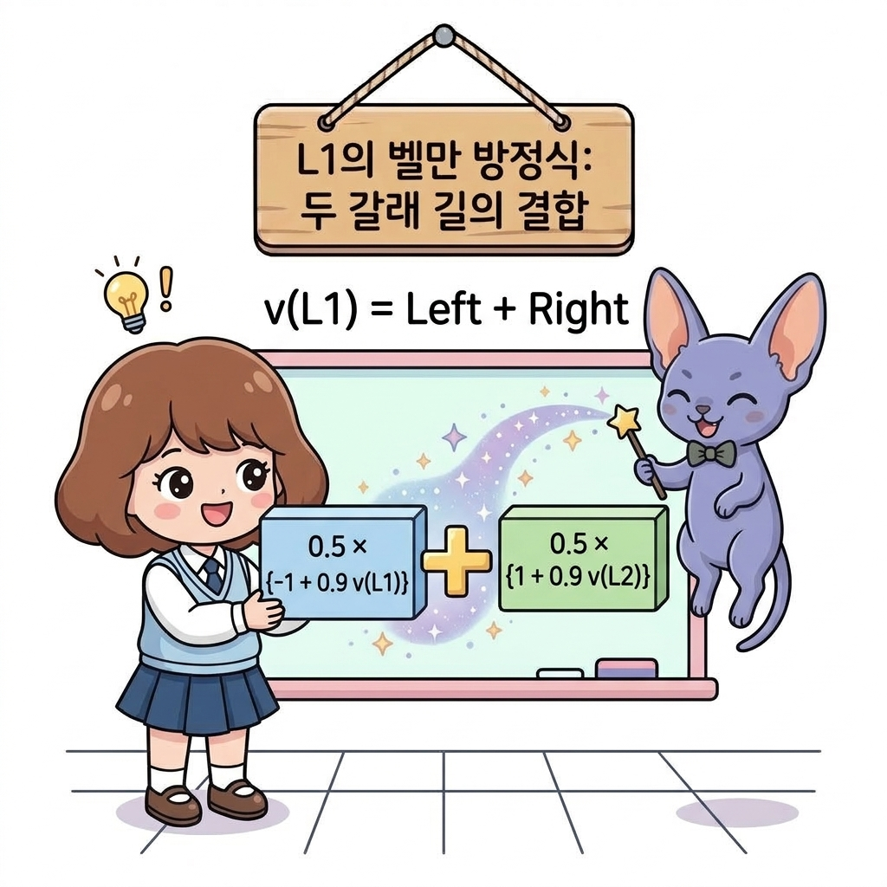

이 식을 우리가 풀기 쉬운 연립 1차 방정식 형태로 단계별로 차근차근 정리해보겠습니다.

**1단계: 우변의 괄호 풀기**

각 항의 계수를 괄호 안으로 곱해 전개합니다.

$$
v_{\pi}(L1) = \underbrace{-0.5 + 0.45 v_{\pi}(L1)}_{\text{Left 항}} + \underbrace{0.5 + 0.45 v_{\pi}(L2)}_{\text{Right 항}}
$$

**2단계: 상수항 계산하기**

왼쪽 벽 충돌 감점(-0.5)과 오른쪽 사과 획득 보상(+0.5)이 서로 상쇄되어 상수항이 **0**이 됩니다.

$$
v_{\pi}(L1) = 0.45 v_{\pi}(L1) + 0.45 v_{\pi}(L2)
$$

**3단계: 동류항 모으기**

좌변의 *v**π*(*L1*)을 우변으로 이항하여 *v**π*(*L1*)끼리 묶어 정리합니다.

$$
0 = -v_{\pi}(L1) + 0.45 v_{\pi}(L1) + 0.45 v_{\pi}(L2)
$$

$$
-0.55 v_{\pi}(L1) + 0.45 v_{\pi}(L2) = 0
$$

[식 06.9]

  

    🎧
    대화 음성 듣기 (도로시 & 지니)
  

  

    <button type="button" class="btn-audio-play" style="background: #0284c7; color: #ffffff; border: none; border-radius: 16px; padding: 5px 13px; font-size: 0.82rem; font-weight: 600; cursor: pointer; display: inline-flex; align-items: center; gap: 4px; box-shadow: 0 1px 2px rgba(2,132,199,0.3);">
      ▶️ 재생
    </button>
    <button type="button" class="btn-audio-stop" style="background: #e2e8f0; color: #475569; border: none; border-radius: 16px; padding: 5px 11px; font-size: 0.82rem; font-weight: 600; cursor: pointer; display: inline-flex; align-items: center; gap: 4px;">
      ⏹️ 정지
    </button>
  

  <audio src="./audio/dialogue_6_3_scene16.mp3" preload="none"></audio>

> 👧 **도로시**: "두 가지 행동을 더해서 정리하니까, -0.55 v(L1) + 0.45 v(L2) = 0이 됐어!"
> 
> 🐱 **지니**: "훌륭해 도로시! 미지수가 두 개인 멋진 첫 번째 일차방정식 [식 06.9]가 완성되었어!"

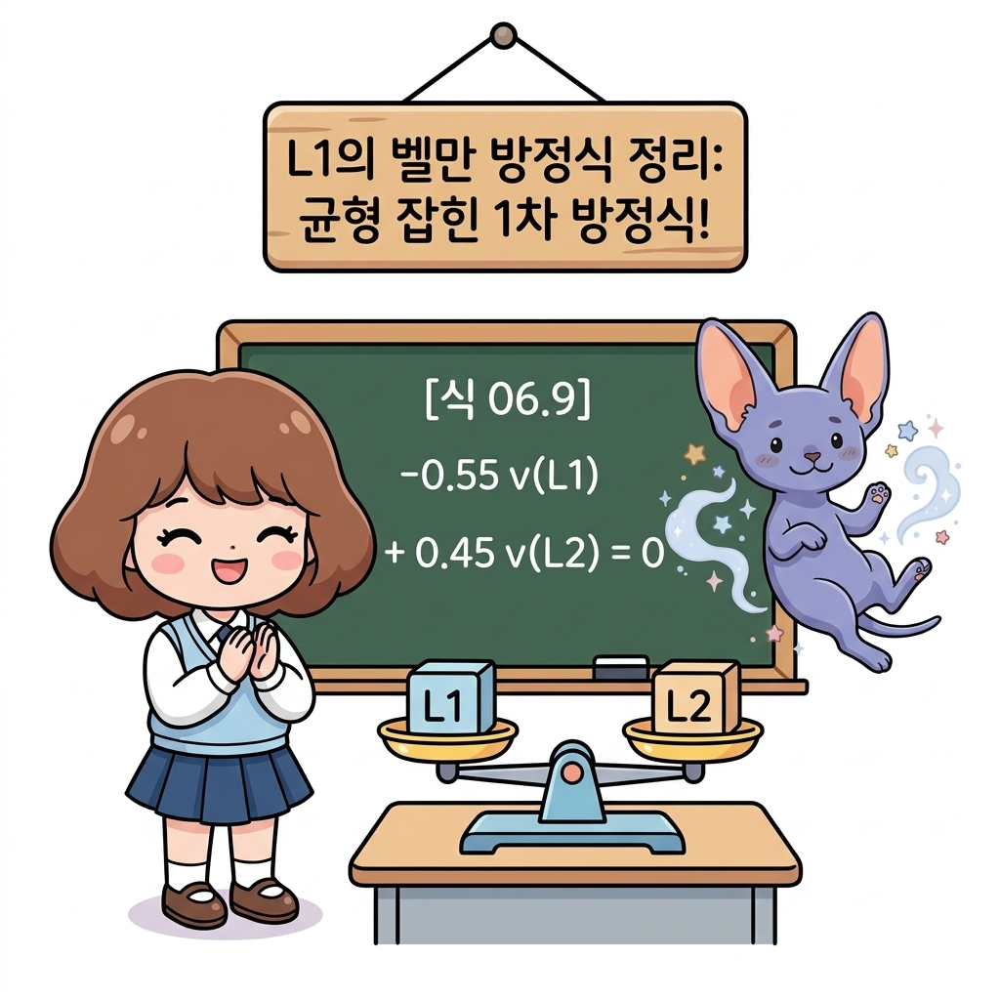

---

#### *L2*에서의 벨만 방정식

앞서 상태 *L1*을 통해 미지수가 2개(*v**π*(*L1*), *v**π*(*L2*))인 **첫 번째 1차 방정식** [식 06.9]를 얻었습니다. 

연립방정식을 완벽히 풀어 두 상태의 구체적인 가치를 계산하려면 **방정식이 하나 더 필요**합니다. 이제 에이전트가 오른쪽 칸인 **상태 *L2***에 서 있을 때의 상황을 살펴보고, *L2*에서의 벨만 방정식을 유도해보겠습니다.

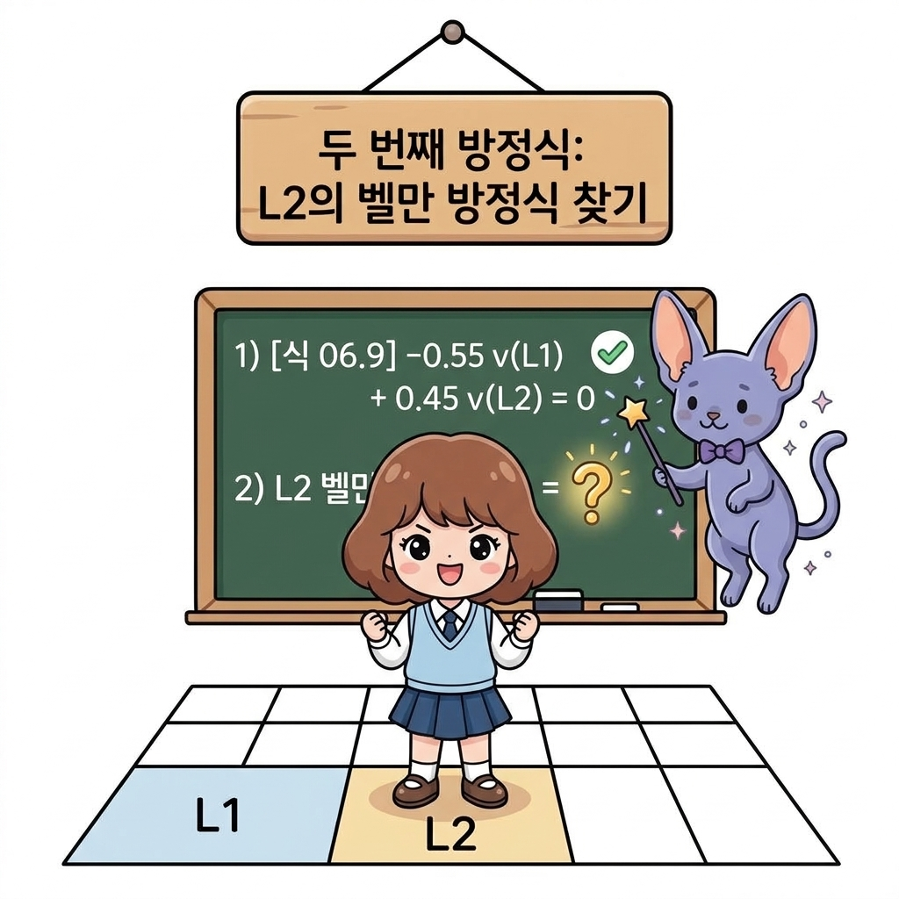

상태 *L2*에서도 마찬가지로 에이전트가 선택할 수 있는 행동은 **Left(왼쪽)**와 **Right(오른쪽)** 두 가지뿐입니다. 이때 에이전트가 겪게 될 상태 전이와 보상의 흐름을 [그림 06-10]의 백업 다이어그램을 통해 먼저 확인해보겠습니다.

[그림 06-10] *v**π*(*L2*)를 구하기 위한 백업 다이어그램

  

    🎧
    대화 음성 듣기 (도로시 & 지니)
  

  

    <button type="button" class="btn-audio-play" style="background: #0284c7; color: #ffffff; border: none; border-radius: 16px; padding: 5px 13px; font-size: 0.82rem; font-weight: 600; cursor: pointer; display: inline-flex; align-items: center; gap: 4px; box-shadow: 0 1px 2px rgba(2,132,199,0.3);">
      ▶️ 재생
    </button>
    <button type="button" class="btn-audio-stop" style="background: #e2e8f0; color: #475569; border: none; border-radius: 16px; padding: 5px 11px; font-size: 0.82rem; font-weight: 600; cursor: pointer; display: inline-flex; align-items: center; gap: 4px;">
      ⏹️ 정지
    </button>
  

  <audio src="./audio/dialogue_6_3_scene17.mp3" preload="none"></audio>

> 👧 **도로시**: "이번에는 L2 칸에 서 있을 때의 백업 다이어그램을 볼 차례야!"
> 
> 🐱 **지니**: "L2에서도 똑같이 왼쪽과 오른쪽, 두 갈래 행동의 기대 가치를 합쳐주면 된단다!"

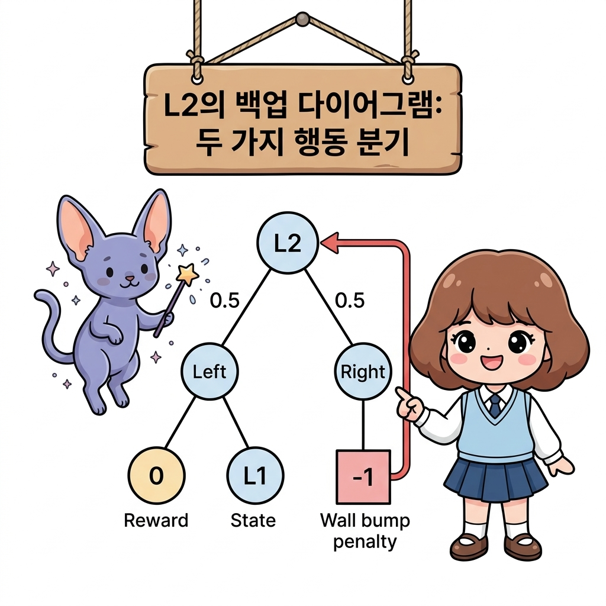

---

#### L2에서 Left 이동

먼저 에이전트가 상태 *L2*에서 **왼쪽(Left)**으로 이동하는 첫 번째 갈래 길을 살펴보겠습니다.
무작위 정책에 따라 에이전트는 **0.5의 확률**(*π*(Left | *L2*) = 0.5)로 왼쪽 행동을 선택합니다.

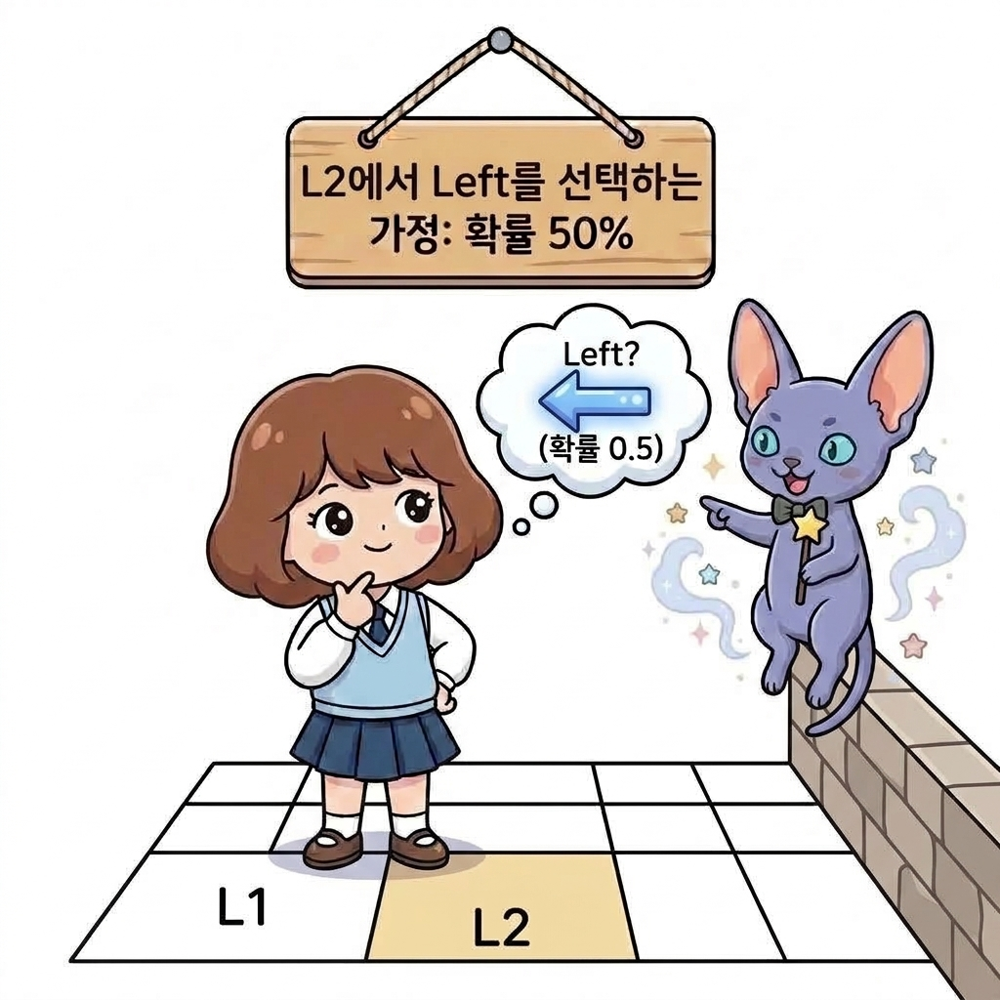

상태 *L2*에서 왼쪽으로 이동하면 이전 칸인 **상태 *L1*로 전이**(*s'* = *L1*)하게 됩니다. 

이때 *L2*에서 *L1*으로 돌아가는 경로에는 사과가 없으므로 **즉각 보상은 0**(*r* = 0)을 받습니다.

  

    🎧
    대화 음성 듣기 (도로시 & 지니)
  

  

    <button type="button" class="btn-audio-play" style="background: #0284c7; color: #ffffff; border: none; border-radius: 16px; padding: 5px 13px; font-size: 0.82rem; font-weight: 600; cursor: pointer; display: inline-flex; align-items: center; gap: 4px; box-shadow: 0 1px 2px rgba(2,132,199,0.3);">
      ▶️ 재생
    </button>
    <button type="button" class="btn-audio-stop" style="background: #e2e8f0; color: #475569; border: none; border-radius: 16px; padding: 5px 11px; font-size: 0.82rem; font-weight: 600; cursor: pointer; display: inline-flex; align-items: center; gap: 4px;">
      ⏹️ 정지
    </button>
  

  <audio src="./audio/dialogue_6_3_scene18.mp3" preload="none"></audio>

> 👧 **도로시**: "L2에서 왼쪽으로 가면 L1으로 돌아가는데, 이때 사과가 없으니 보상은 0이네?"
> 
> 🐱 **지니**: "맞아! 보상은 0점이고 다음 상태는 L1이니, 50%에 0.9 곱하기 v(L1)을 곱하면 돼!"

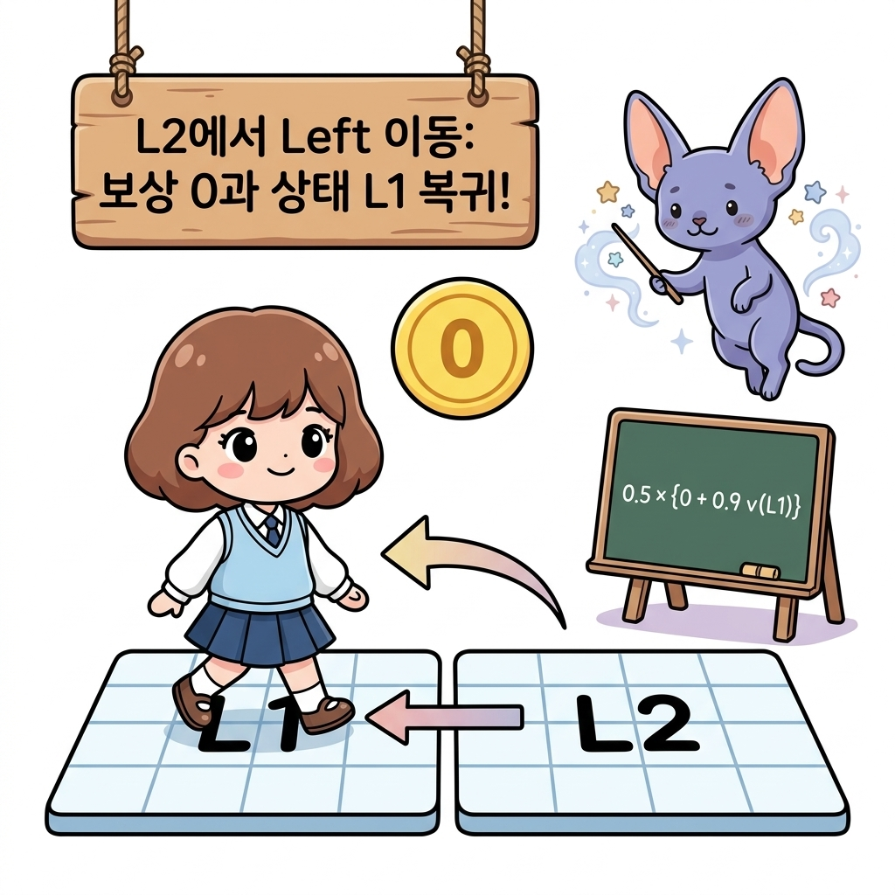

이제 앞서 유도한 간소화된 벨만 방정식 [식 06.8]의 항에 이 값들을 하나씩 차근차근 대입해볼까요?

*   **행동 선택 확률**: *π*(Left | *L2*) = 0.5
*   **즉각 보상**: *r*(*L2*, Left, *L1*) = 0
*   **할인율**: *γ* = 0.9
*   **다음 상태 가치**: 왼쪽 칸인 *L1*으로 되돌아왔으므로 *v**π*(*s'*) = *v**π*(*L1*)

따라서 행동 Left를 선택했을 때 얻게 되는 기대 수익 부분은 다음과 같이 깔끔하게 정리됩니다.

$$
0.5 \{ 0 + 0.9 v_{\pi}(L1) \}
$$

---

#### L2에서 Right 이동

이번에는 상태 *L2*에서 **오른쪽(Right)**으로 이동하는 두 번째 갈래 길을 살펴보겠습니다.
무작위 정책에 따라 에이전트는 **0.5의 확률**(*π*(Right | *L2*) = 0.5)로 오른쪽 행동을 선택합니다.

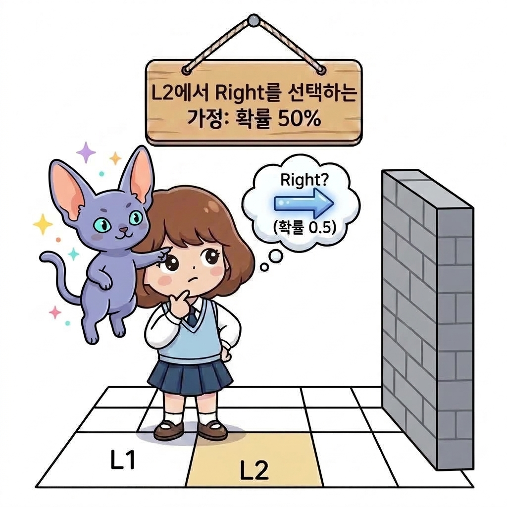

하지만 상태 *L2*의 오른쪽은 단단한 외벽으로 가로막혀 있습니다. 

따라서 에이전트는 앞으로 나아가지 못하고 벽에 부딪혀 **제자리인 *L2*에 머무르게 됩니다**(*s'* = *L2*). 이때 벽 충돌에 대한 벌칙으로 **-1의 즉각 보상**(*r* = -1)을 받습니다.

  

    🎧
    대화 음성 듣기 (도로시 & 지니)
  

  

    <button type="button" class="btn-audio-play" style="background: #0284c7; color: #ffffff; border: none; border-radius: 16px; padding: 5px 13px; font-size: 0.82rem; font-weight: 600; cursor: pointer; display: inline-flex; align-items: center; gap: 4px; box-shadow: 0 1px 2px rgba(2,132,199,0.3);">
      ▶️ 재생
    </button>
    <button type="button" class="btn-audio-stop" style="background: #e2e8f0; color: #475569; border: none; border-radius: 16px; padding: 5px 11px; font-size: 0.82rem; font-weight: 600; cursor: pointer; display: inline-flex; align-items: center; gap: 4px;">
      ⏹️ 정지
    </button>
  

  <audio src="./audio/dialogue_6_3_scene19.mp3" preload="none"></audio>

> 👧 **도로시**: "L2에서 오른쪽으로 가면 벽에 부딪혀서 제자리 L2에 남고 감점 -1점이군!"
> 
> 🐱 **지니**: "그렇지! 50%에 -1 더하기 0.9 곱하기 v(L2)를 곱해주면 오른쪽 경로 완성!"

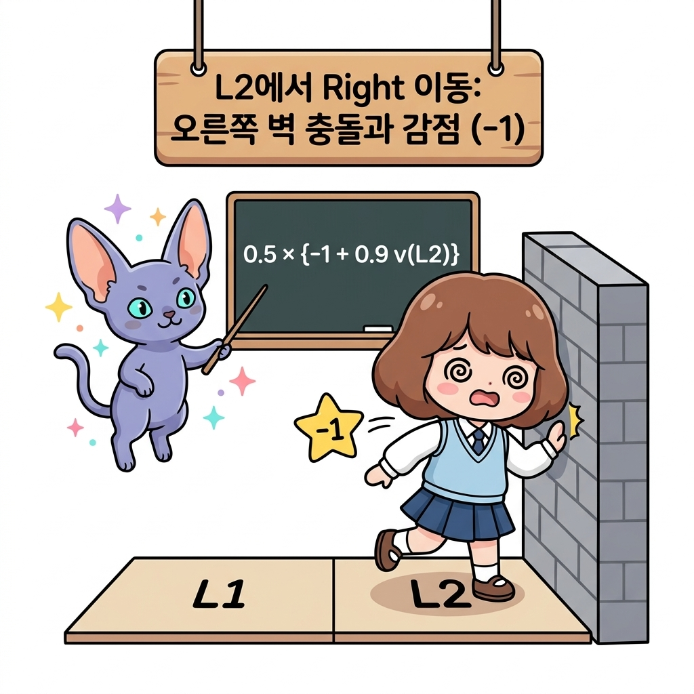

이제 앞서 유도한 간소화된 벨만 방정식 [식 06.8]의 항에 이 값들을 하나씩 차근차근 대입해볼까요?

*   **행동 선택 확률**: *π*(Right | *L2*) = 0.5
*   **즉각 보상**: *r*(*L2*, Right, *L2*) = -1
*   **할인율**: *γ* = 0.9
*   **다음 상태 가치**: 제자리인 *L2*에 머물렀으므로 *v**π*(*s'*) = *v**π*(*L2*)

따라서 행동 Right를 선택했을 때 얻게 되는 기대 수익 부분은 다음과 같이 깔끔하게 정리됩니다.

$$
0.5 \{ -1 + 0.9 v_{\pi}(L2) \}
$$

---

#### *L2*에서의 벨만 방정식 정리하기

앞서 우리는 상태 *L2*에서 갈 수 있는 두 가지 행동(Left, Right)의 기대 수익을 각각 구해보았습니다.

*   **Left 이동 시**: 0.5 { 0 + 0.9 *v**π*(*L1*) }
*   **Right 이동 시**: 0.5 { -1 + 0.9 *v**π*(*L2*) }

이제 벨만 방정식 [식 06.8]의 원리에 따라, 상태 *L2*에서 가능한 두 갈래 길의 식을 **하나로 합쳐주기만 하면** 상태 *L2*의 벨만 방정식이 완성됩니다.

$$
v_{\pi}(L2) = 0.5 \{ 0 + 0.9 v_{\pi}(L1) \} + 0.5 \{ -1 + 0.9 v_{\pi}(L2) \}
$$

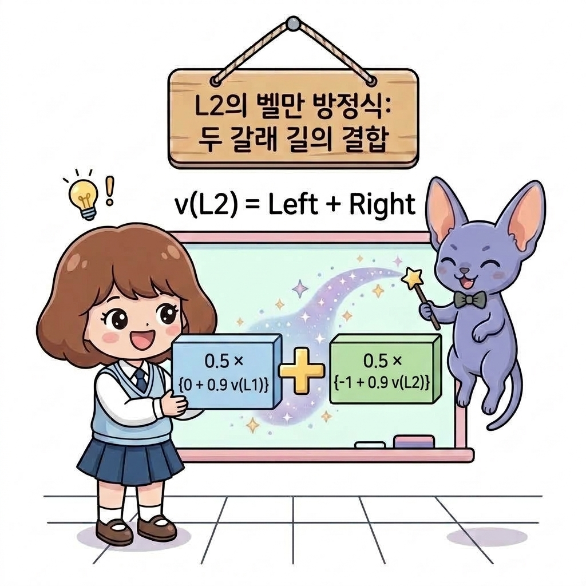

이 식을 우리가 풀기 쉬운 연립 1차 방정식 형태로 단계별로 차근차근 정리해보겠습니다.

**1단계: 우변의 괄호 풀기**

각 항의 계수를 괄호 안으로 곱해 전개합니다.

$$
v_{\pi}(L2) = \underbrace{0 + 0.45 v_{\pi}(L1)}_{\text{Left 항}} + \underbrace{(-0.5) + 0.45 v_{\pi}(L2)}_{\text{Right 항}}
$$

$$
v_{\pi}(L2) = 0.45 v_{\pi}(L1) - 0.5 + 0.45 v_{\pi}(L2)
$$

**2단계: 동류항 묶기**

좌변의 *v**π*(*L2*)를 우변으로 이항하여 *v**π*(*L2*)끼리 묶어 정리합니다.

$$
0 = 0.45 v_{\pi}(L1) - 0.5 + (0.45 - 1) v_{\pi}(L2)
$$

$$
0 = 0.45 v_{\pi}(L1) - 0.5 - 0.55 v_{\pi}(L2)
$$

**3단계: 상수항을 좌변으로 이항하여 두 번째 방정식 완성하기**

상수항 -0.5를 좌변으로 넘기면, 마침내 연립방정식을 풀기 위한 **두 번째 1차 방정식 [식 06.10]**이 깔끔하게 완성됩니다!

$$
0.5 = 0.45 v_{\pi}(L1) - 0.55 v_{\pi}(L2)
$$

보기 좋게 좌우 변을 맞추어 쓰면 다음과 같습니다.

$$
0.45 v_{\pi}(L1) - 0.55 v_{\pi}(L2) = 0.5
$$

[식 06.10]

  

    🎧
    대화 음성 듣기 (도로시 & 지니)
  

  

    <button type="button" class="btn-audio-play" style="background: #0284c7; color: #ffffff; border: none; border-radius: 16px; padding: 5px 13px; font-size: 0.82rem; font-weight: 600; cursor: pointer; display: inline-flex; align-items: center; gap: 4px; box-shadow: 0 1px 2px rgba(2,132,199,0.3);">
      ▶️ 재생
    </button>
    <button type="button" class="btn-audio-stop" style="background: #e2e8f0; color: #475569; border: none; border-radius: 16px; padding: 5px 11px; font-size: 0.82rem; font-weight: 600; cursor: pointer; display: inline-flex; align-items: center; gap: 4px;">
      ⏹️ 정지
    </button>
  

  <audio src="./audio/dialogue_6_3_scene20.mp3" preload="none"></audio>

> 👧 **도로시**: "L2의 식도 괄호를 풀고 정리하니까, 0.45 v(L1) - 0.55 v(L2) = 0.5가 나왔어!"
> 
> 🐱 **지니**: "완벽해! 이렇게 해서 두 번째 일차방정식 [식 06.10]까지 완벽하게 손에 넣었단다!"

![L2 벨만 방정식 정리: [식 06.10] 완성](./img/equation_consolidation.png)

---

#### 벨만 방정식 연립

이렇게 하여 2개 상태(*L1*, *L2*)에 대한 벨만 방정식을 모두 구했습니다. 

우리가 최종적으로 알아내고자 하는 미지수는 두 상태의 참된 가치인 *v**π*(*L1*)과 *v**π*(*L2*) 딱 2개입니다. 

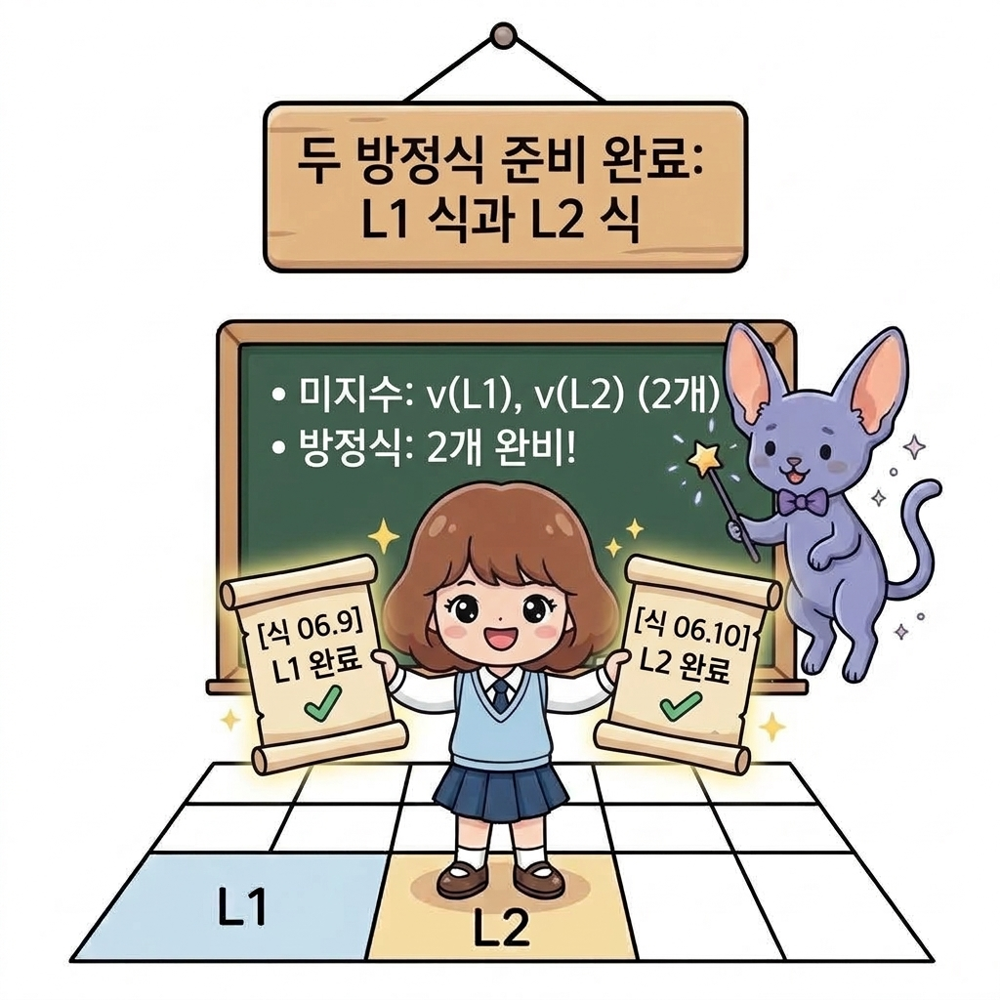

앞서 구한 상태 *L1*의 식 [식 06.9]와 상태 *L2*의 식 [식 06.10]을 나란히 모아보겠습니다.

*   **식 ① (*L1*의 벨만 방정식)**: -0.55 *v**π*(*L1*) + 0.45 *v**π*(*L2*) = 0
*   **식 ② (*L2*의 벨만 방정식)**: 0.45 *v**π*(*L1*) - 0.55 *v**π*(*L2*) = 0.5

**미지수가 2개이고, 서로 독립된 1차 방정식도 2개**이므로, 우리가 중학교 수학 시간에 배운 **2원 1차 연립방정식(System of Linear Equations)**을 세워 정확한 유일해를 완벽히 풀어낼 수 있습니다!

$$
\begin{cases}
-0.55 v_{\pi}(L1) + 0.45 v_{\pi}(L2) = 0 & \text{--- (식 ①, L1)} \\
0.45 v_{\pi}(L1) - 0.55 v_{\pi}(L2) = 0.5 & \text{--- (식 ②, L2)}
\end{cases}
$$

  

    🎧
    대화 음성 듣기 (도로시 & 지니)
  

  

    <button type="button" class="btn-audio-play" style="background: #0284c7; color: #ffffff; border: none; border-radius: 16px; padding: 5px 13px; font-size: 0.82rem; font-weight: 600; cursor: pointer; display: inline-flex; align-items: center; gap: 4px; box-shadow: 0 1px 2px rgba(2,132,199,0.3);">
      ▶️ 재생
    </button>
    <button type="button" class="btn-audio-stop" style="background: #e2e8f0; color: #475569; border: none; border-radius: 16px; padding: 5px 11px; font-size: 0.82rem; font-weight: 600; cursor: pointer; display: inline-flex; align-items: center; gap: 4px;">
      ⏹️ 정지
    </button>
  

  <audio src="./audio/dialogue_6_3_scene21.mp3" preload="none"></audio>

> 👧 **도로시**: "미지수는 v(L1)과 v(L2) 두 개고, 식도 딱 두 개니까 중학교 연립방정식이네!"
> 
> 🐱 **지니**: "맞아 도로시! 가감법이나 대입법으로 두 식을 묶어서 풀기만 하면 진짜 가치 숫자가 튀어나온단다!"

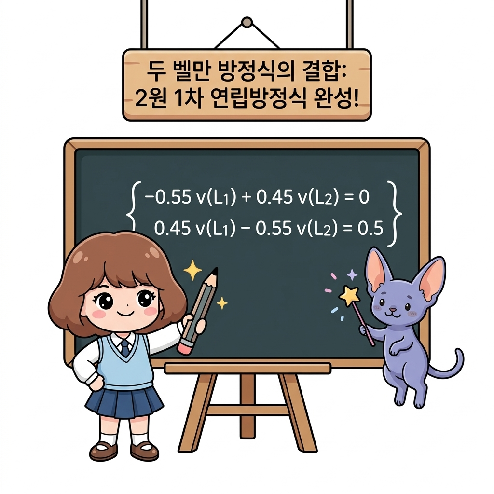

---

#### 연립방정식 풀이

이제 완성된 2원 1차 연립방정식을 **대입법(Substitution Method)**을 이용하여 단계별로 차근차근 풀어보겠습니다.

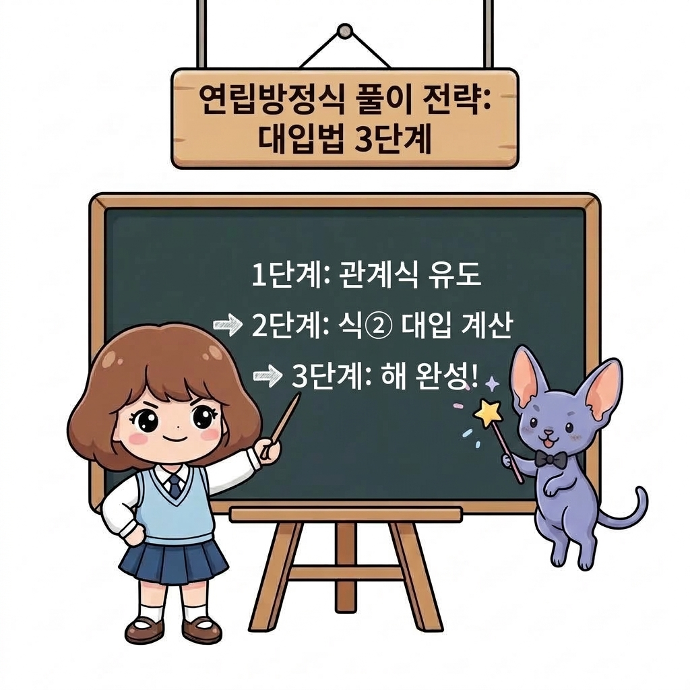

---

**1단계: 식 ①에서 한 미지수를 다른 미지수로 나타내기**

첫 번째 식에서 *v**π*(*L2*)를 *v**π*(*L1*)에 대한 식으로 정리합니다.

$$
-0.55 v_{\pi}(L1) + 0.45 v_{\pi}(L2) = 0
$$

-0.55 *v**π*(*L1*) 항을 우변으로 이항하면:

$$
0.45 v_{\pi}(L2) = 0.55 v_{\pi}(L1)
$$

양변을 0.45로 나누고, 분모와 분자에 100을 곱한 뒤 5로 약분합니다.

$$
v_{\pi}(L2) = \frac{0.55}{0.45} v_{\pi}(L1) = \frac{55}{45} v_{\pi}(L1) = \frac{11}{9} v_{\pi}(L1)
$$

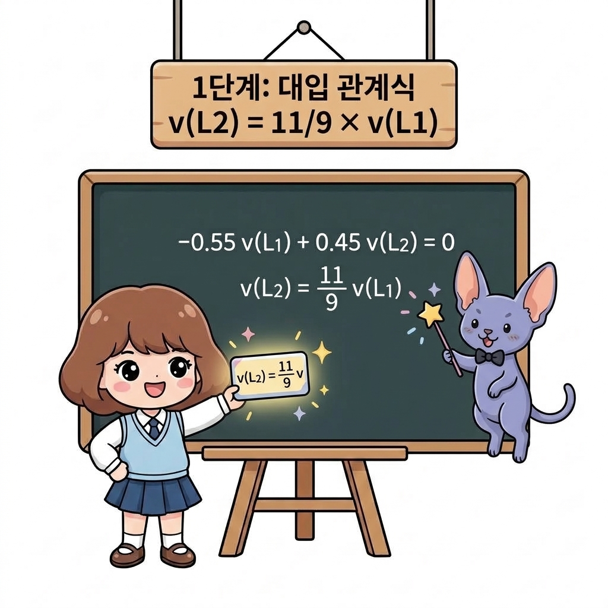

즉, **상태 *L2*의 가치는 상태 *L1* 가치의 (11/9)배**라는 중요한 관계식을 얻었습니다!

---

**2단계: 관계식을 식 ②에 대입하여 *v**π*(*L1*) 계산하기**

방금 구한 관계식 *v**π*(*L2*) = (11/9) *v**π*(*L1*)을 두 번째 식의 *v**π*(*L2*) 자리에 그대로 대입합니다.

$$
0.45 v_{\pi}(L1) - 0.55 \left( \frac{11}{9} v_{\pi}(L1) \right) = 0.5
$$

분모 9를 없애기 위해 **양변에 9를 곱합니다**.

$$
9 \times 0.45 v_{\pi}(L1) - 0.55 \times 11 v_{\pi}(L1) = 9 \times 0.5
$$

$$
4.05 v_{\pi}(L1) - 6.05 v_{\pi}(L1) = 4.5
$$

좌변의 동류항을 계산합니다.

$$
-2.0 v_{\pi}(L1) = 4.5
$$

양변을 -2.0으로 나누면, 마침내 첫 번째 미지수인 **상태 *L1*의 가치**가 완벽하게 계산됩니다!

$$
v_{\pi}(L1) = \frac{4.5}{-2.0} = -2.25
$$

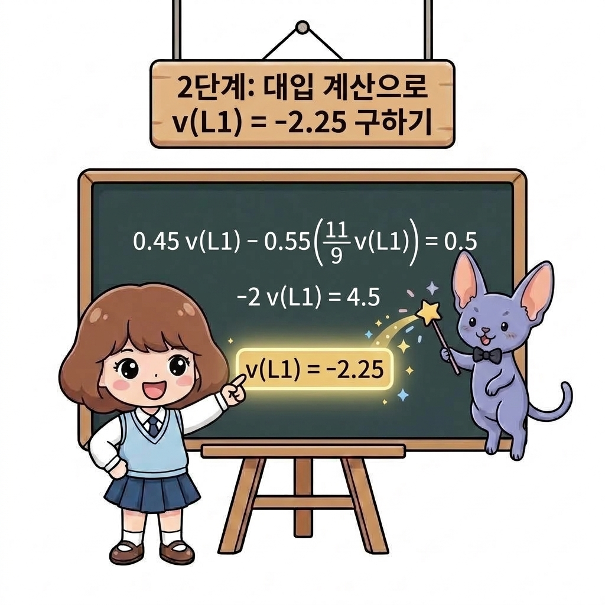

---

**3단계: 구해낸 *v**π*(*L1*)을 대입하여 *v**π*(*L2*) 구하기**

이제 1단계에서 구해두었던 관계식 *v**π*(*L2*) = (11/9) *v**π*(*L1*)에 방금 얻은 *v**π*(*L1*) = -2.25를 대입합니다.

$$
v_{\pi}(L2) = \frac{11}{9} \times (-2.25)
$$

-2.25는 분수로 -(9/4)이므로, 분모 9가 서로 깔끔하게 약분됩니다.

$$
v_{\pi}(L2) = \frac{11}{9} \times \left( -\frac{9}{4} \right) = -\frac{11}{4} = -2.75
$$

이로써 두 상태의 참된 가치가 모두 명쾌하게 계산되었습니다!

$$
\begin{cases}
v_{\pi}(L1) = -2.25 \\
v_{\pi}(L2) = -2.75
\end{cases}
$$

  

    🎧
    대화 음성 듣기 (도로시 & 지니)
  

  

    <button type="button" class="btn-audio-play" style="background: #0284c7; color: #ffffff; border: none; border-radius: 16px; padding: 5px 13px; font-size: 0.82rem; font-weight: 600; cursor: pointer; display: inline-flex; align-items: center; gap: 4px; box-shadow: 0 1px 2px rgba(2,132,199,0.3);">
      ▶️ 재생
    </button>
    <button type="button" class="btn-audio-stop" style="background: #e2e8f0; color: #475569; border: none; border-radius: 16px; padding: 5px 11px; font-size: 0.82rem; font-weight: 600; cursor: pointer; display: inline-flex; align-items: center; gap: 4px;">
      ⏹️ 정지
    </button>
  

  <audio src="./audio/dialogue_6_3_scene22.mp3" preload="none"></audio>

> 👧 **도로시**: "연립방정식을 계산해보니 v(L1)은 -2.25, v(L2)는 -2.75가 나왔어!"
> 
> 🐱 **지니**: "정확해! 무한히 이어지던 기대 수익이 드디어 딱 떨어지는 실수 숫자로 명쾌하게 풀려났단다!"

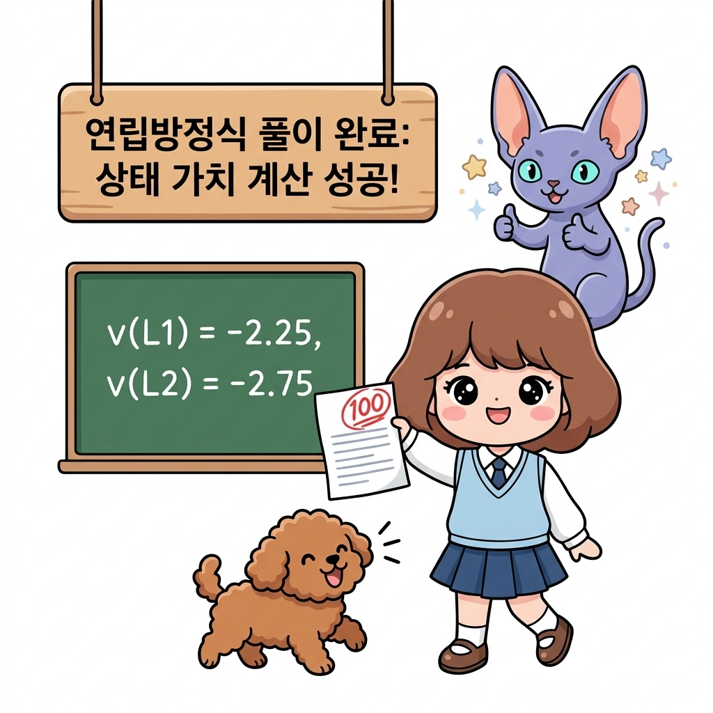

---

#### 이는 무작위 정책의 상태 가치 함수입니다

우리가 연립방정식을 풀어 얻은 해는 **무작위 정책(*π*)을 따를 때 각 상태의 참된 가치**를 뜻합니다.

$$
v_{\pi}(L1) = -2.25, \quad v_{\pi}(L2) = -2.75
$$

즉, 에이전트가 상태 *L1*에서 출발하여 무작위로 계속 움직이면 앞으로 얻게 될 할인 누적 보상(기대 수익)의 평균값이 **-2.25**이고, 상태 *L2*에서 출발하면 **-2.75**라는 의미입니다.

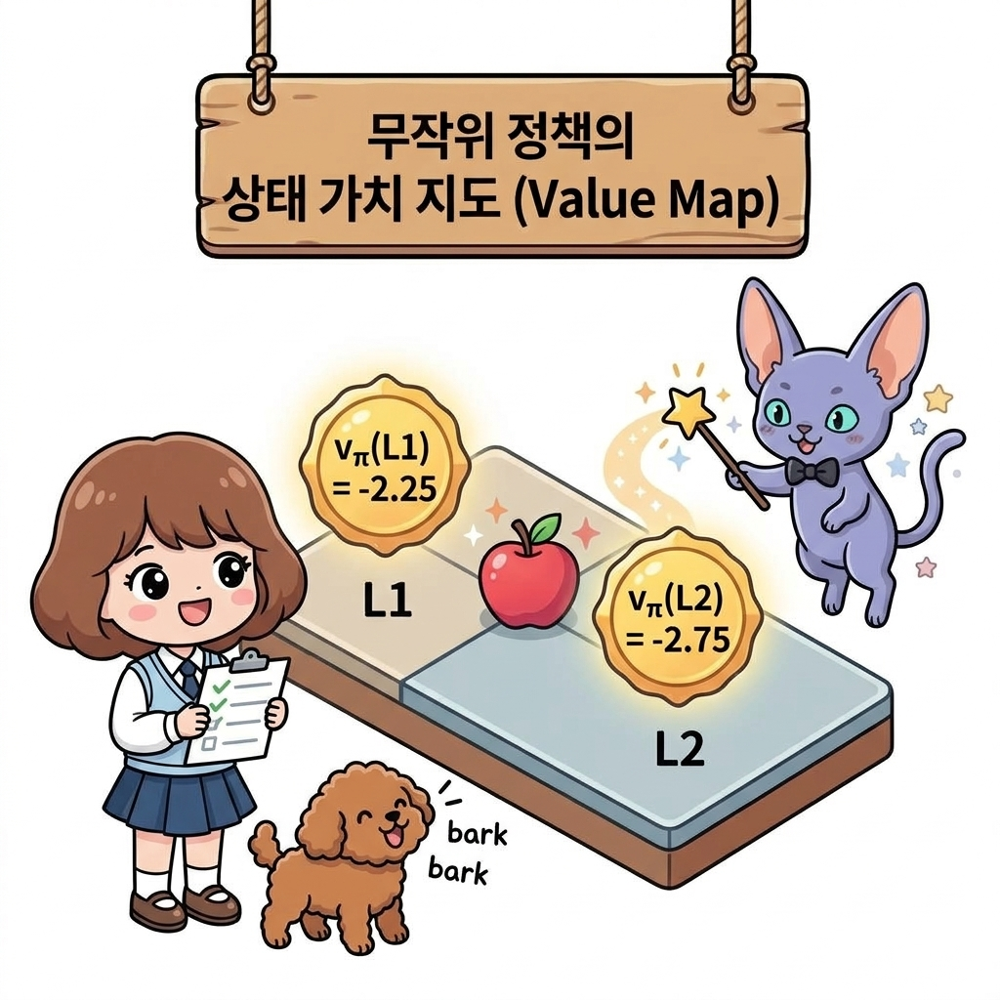

---

이 계산 결과는 강화학습 환경의 물리적 특성을 아주 정밀하게 반영하고 있으며, 두 가지 중요한 직관적 이유가 숨어 있습니다.

**1. 왜 기대 수익이 모두 음수(-)일까요?**

"사과를 먹으면 +1점을 얻는데, 왜 두 상태 모두 가치가 마이너스일까?" 하는 의문이 들 수 있습니다. 

에이전트는 50%의 확률로 무작위 행동을 취하므로, 길을 헤매다 보면 좌우 양 끝의 외벽에 부딪혀 **-1점의 감점 벌칙**을 반복해서 받게 됩니다. 사과를 얻는 보상(+1)의 기회보다 벽에 쿵 부딪혀 깎이는 벌칙(-1)의 가능성이 더 크고 계속 누적되기 때문에, 장기적으로 누적되는 전체 수익은 자연스럽게 음수가 됩니다.

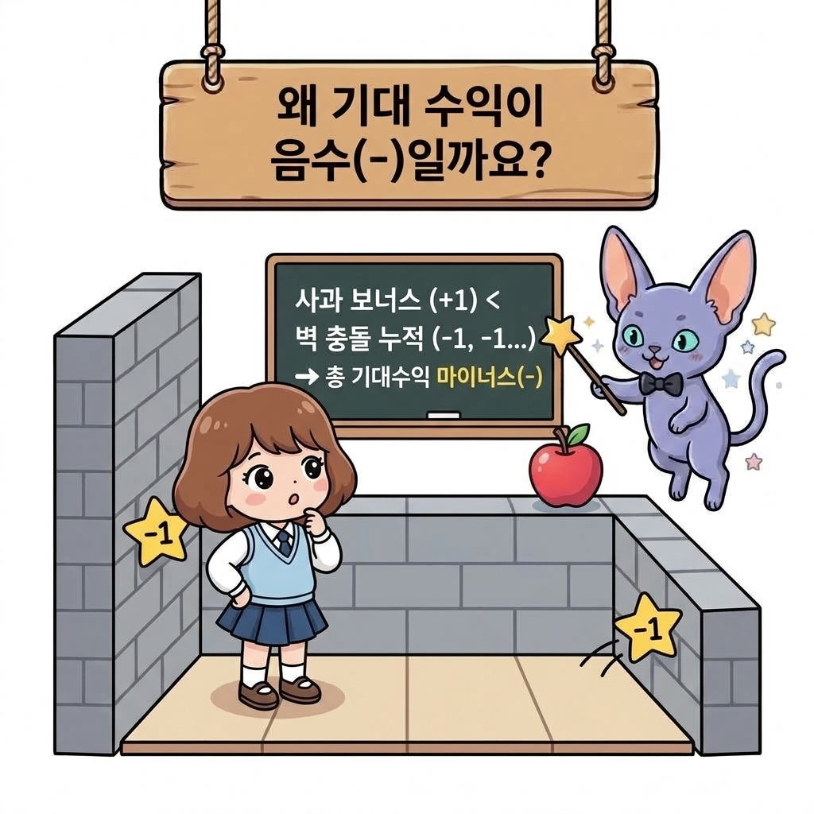

**2. 왜 상태 *L1*의 가치가 상태 *L2*보다 더 클까요?**

두 상태 모두 음수이지만, -2.25 > -2.75로 **상태 *L1*의 가치가 상태 *L2*보다 0.5만큼 더 큽니다**. 그 이유는 사과와의 물리적 거리 때문입니다.

*   **상태 *L1*에 서 있을 때**: 바로 오른쪽에 탐스러운 사과가 놓여 있어, 첫 번째 행동에서 오른쪽(Right)을 선택하면 **50%의 높은 확률로 즉시 사과 보너스(+1점)**를 손에 쥘 수 있습니다.
*   **상태 *L2*에 서 있을 때**: 오른쪽으로 가면 즉시 벽에 부딪혀 -1점을 받고, 왼쪽으로 가더라도 사과가 없어 즉각 보상은 0점입니다. 사과를 다시 먹으려면 최소 2번의 스텝(*L2* ➔ *L1* ➔ *L2*)을 거쳐야 합니다.

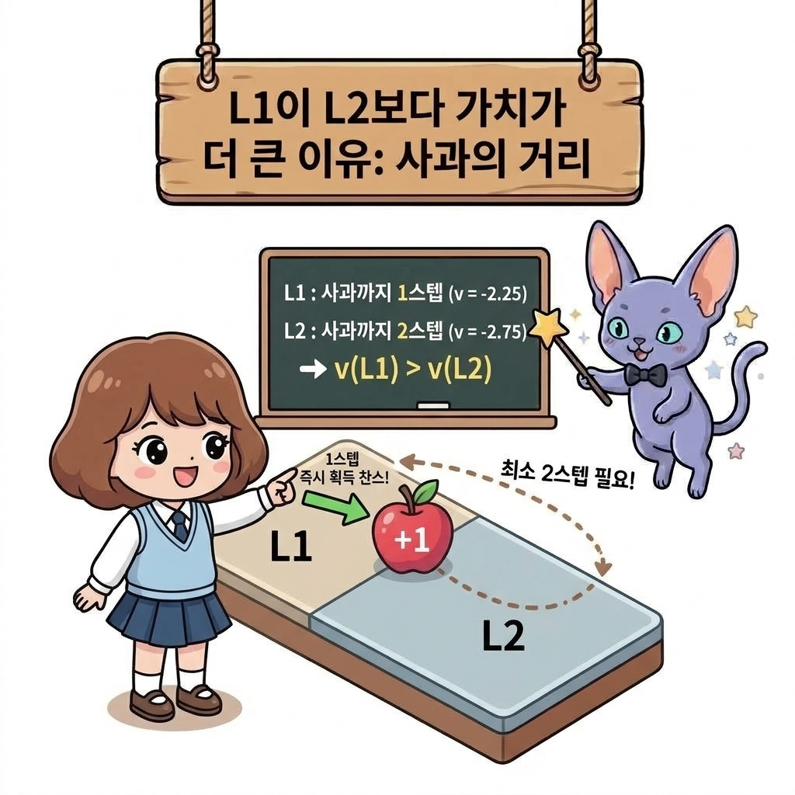

---

따라서 달콤한 보상이 눈앞에 있는 **상태 *L1*이 상태 *L2*보다 훨씬 유리하고 가치 있는 상태**라는 사실을 벨만 방정식의 계산 결과가 수학적으로 명쾌하게 증명해줍니다.

  

    🎧
    대화 음성 듣기 (도로시 & 지니)
  

  

    <button type="button" class="btn-audio-play" style="background: #0284c7; color: #ffffff; border: none; border-radius: 16px; padding: 5px 13px; font-size: 0.82rem; font-weight: 600; cursor: pointer; display: inline-flex; align-items: center; gap: 4px; box-shadow: 0 1px 2px rgba(2,132,199,0.3);">
      ▶️ 재생
    </button>
    <button type="button" class="btn-audio-stop" style="background: #e2e8f0; color: #475569; border: none; border-radius: 16px; padding: 5px 11px; font-size: 0.82rem; font-weight: 600; cursor: pointer; display: inline-flex; align-items: center; gap: 4px;">
      ⏹️ 정지
    </button>
  

  <audio src="./audio/dialogue_6_3_scene23.mp3" preload="none"></audio>

> 👧 **도로시**: "둘 다 마이너스인 것도 신기하고, L1이 L2보다 더 큰 것도 재밌어!"
> 
> 🐱 **지니**: "벽에 부딪히기 쉬워서 마이너스지만, L1 옆에는 바로 사과가 있어서 첫 판에 딸 확률이 50%나 되니까 더 가치 있는 거야!"

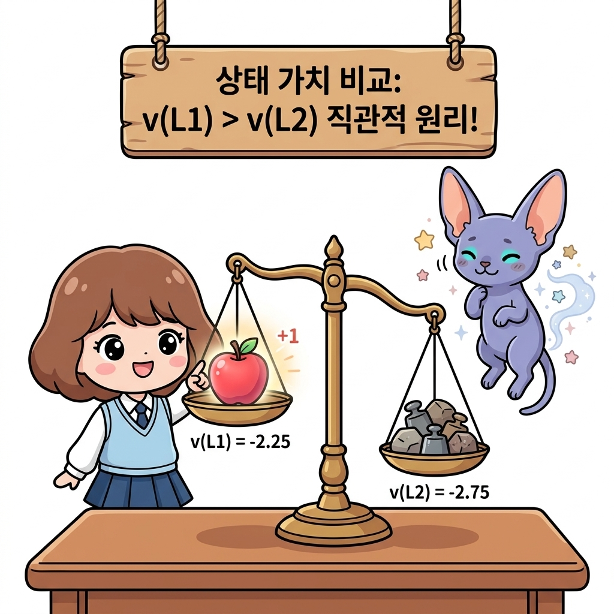

---

### 06.3.2 벨만 방정식의 의의

지금까지 우리는 두 칸짜리 그리드 월드라는 작은 환경을 통해 벨만 방정식이 실제로 어떻게 유도되고 풀리는지 전 과정을 생생하게 살펴보았습니다. 그렇다면 강화학습 전체의 관점에서 **벨만 방정식이 갖는 진정한 의의**는 무엇일까요? 

크게 세 가지 핵심으로 정리할 수 있습니다.

---

#### 1. 무한의 굴레에서 벗어나기 (무한한 시간의 1스텝 압축)

원래 상태 가치 함수는 에이전트가 앞으로 무한히 살아가면서 받게 될 **모든 보상의 할인 누적합**(기대 수익 *G**t*)으로 정의됩니다.

$$
G_t = R_{t+1} + \gamma R_{t+2} + \gamma^2 R_{t+3} + \cdots
$$

만약 이 정의 그대로 가치를 구하려면 영원히 끝나지 않는 미래를 끝까지 시뮬레이션해야 하므로, 컴퓨터로 계산하는 것이 사실상 불가능합니다. 

하지만 리처드 벨만(Richard Bellman)은 놀라운 발상의 전환을 보여주었습니다. 끝없는 미래 전체를 한꺼번에 내다볼 필요 없이, **"지금 당장 얻는 즉각 보상(1스텝)"과 "바로 다음 상태에서 누릴 가치"**라는 단 한 걸음의 **재귀적(Recursive) 관계로 문제**를 깔끔하게 압축해낸 것입니다.

> NOTE_ 상태 가치 함수는 기대 수익이며 '무한히 이어지는' 보상의 합으로 정의됩니다. 하지만 [식 06.7]에서 보듯 벨만 방정식에는 '무한'이라는 개념이 없습니다. 오직 현재 상태와 다음 상태의 1스텝 연결만 존재할 뿐입니다. 벨만 방정식 덕분에 우리는 비로소 끝없는 시간의 사슬, 즉 '무한의 굴레'에서 완벽하게 빠져나온 셈입니다.

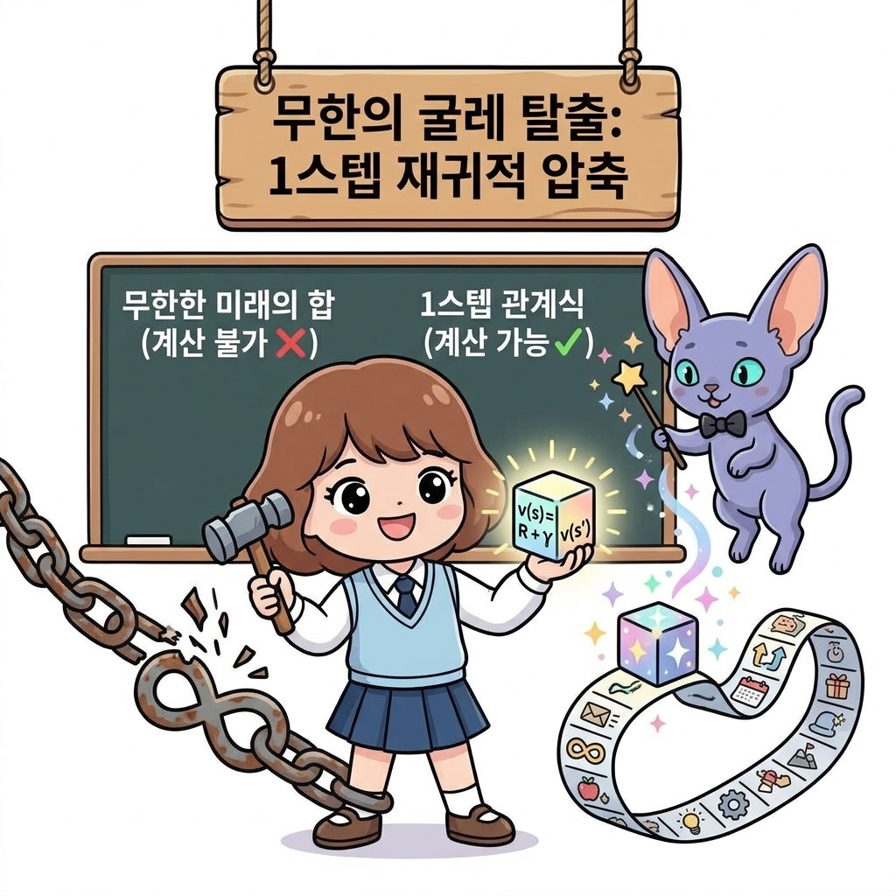

---

#### 2. 유한한 연립 1차 방정식으로의 변환

벨만 방정식의 가장 강력한 마법은 **무한한 시계열 계산 문제를 우리가 아주 잘 아는 유한한 연립방정식 문제로 바꾸어 놓는다는 점**입니다.

*   **미지수의 개수**: 환경에 존재하는 각 상태의 참된 가치 *v*(*s*) 총 *N*개
*   **방정식의 개수**: 각 상태마다 세워지는 1스텝 벨만 방정식 총 *N*개

미지수가 *N*개일 때 독립된 1차 방정식도 정확히 *N*개가 주어지므로, 선형대수학의 **연립 1차 방정식(행렬 방정식)** 체계가 완벽하게 성립합니다.

이번 예제에서는 상태가 2개뿐이어서 우리가 연필로 대입법을 써서 직접 손으로 풀었지만, 상태가 100개, 1만 개인 거대한 환경이라도 원리는 완전히 동일합니다. 컴퓨터에게 가우스 소거법이나 행렬 연산 알고리즘을 맡기면, 아무리 복잡한 세상이라도 모든 상태의 참된 가치를 눈 깜짝할 사이에 자동으로 찾아낼 수 있습니다.

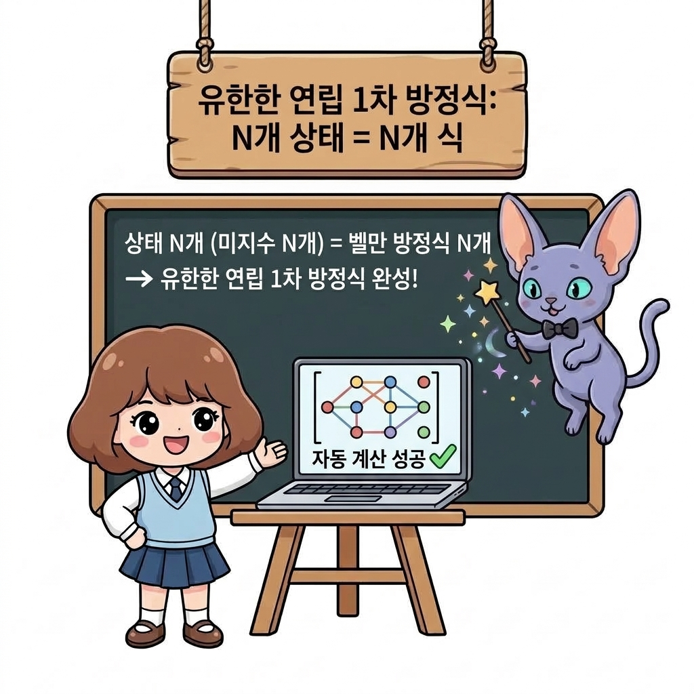

---

#### 3. 모든 강화학습 알고리즘의 든든한 뿌리

행동이 무작위로 선택되는 정책이든, 특정한 목적을 가진 정교한 정책이든 상관없이 벨만 방정식만 세울 수 있다면 그 정책의 진짜 가치를 객관적인 숫자로 평가할 수 있습니다.

또한 벨만 방정식의 가치는 단순한 수학적 정리에 머무르지 않습니다. 

앞으로 우리가 배우게 될 거의 모든 핵심 알고리즘이 바로 이 벨만 방정식에서 출발합니다:

*   **동적 프로그래밍(DP)**: 벨만 방정식을 반복적으로 갱신하여 최적의 가치와 정책을 찾아냅니다.
*   **시간차 학습(TD)**: 벨만 방정식의 좌변(현재 추정치)과 우변(1스텝 후 추정치)의 차이인 '벨만 오차'를 줄여나가며 학습합니다.
*   **Q-러닝(Q-Learning) & DQN**: 최적 벨만 방정식을 바탕으로 인공지능이 스스로 최고의 행동을 학습하도록 만듭니다.

즉, 벨만 방정식은 현대 강화학습이라는 거대한 건물이 흔들림 없이 우뚝 설 수 있도록 받쳐주는 **가장 튼튼하고 위대한 주춧돌**인 셈입니다.

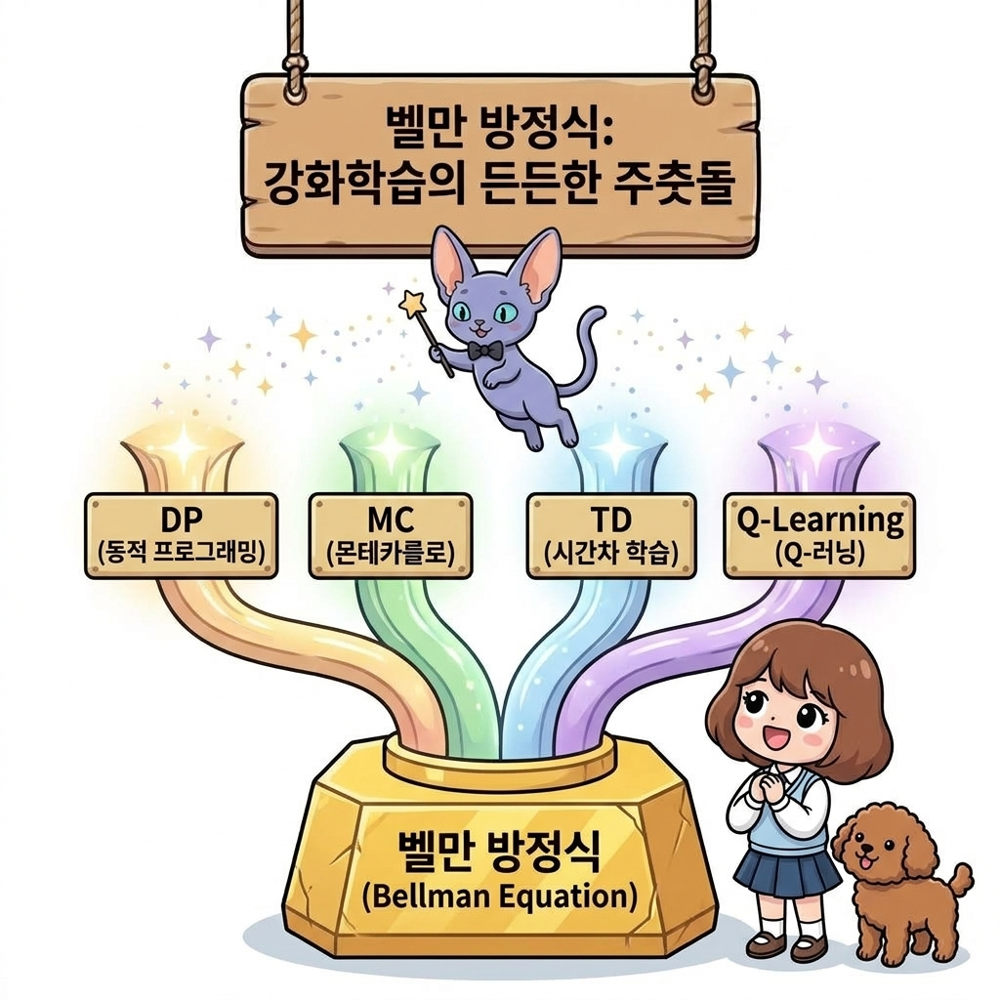

---

  

    🎧
    대화 음성 듣기 (도로시 & 지니)
  

  

    <button type="button" class="btn-audio-play" style="background: #0284c7; color: #ffffff; border: none; border-radius: 16px; padding: 5px 13px; font-size: 0.82rem; font-weight: 600; cursor: pointer; display: inline-flex; align-items: center; gap: 4px; box-shadow: 0 1px 2px rgba(2,132,199,0.3);">
      ▶️ 재생
    </button>
    <button type="button" class="btn-audio-stop" style="background: #e2e8f0; color: #475569; border: none; border-radius: 16px; padding: 5px 11px; font-size: 0.82rem; font-weight: 600; cursor: pointer; display: inline-flex; align-items: center; gap: 4px;">
      ⏹️ 정지
    </button>
  

  <audio src="./audio/dialogue_6_3_scene24.mp3" preload="none"></audio>

> 👧 **도로시**: "벨만 방정식을 세우고, 정리하고, 연립방정식으로 푸는 3단계로 모든 게 해결되는구나!"
> 
> 🐱 **지니**: "바로 그거야! 아무리 거대한 세상이라도 벨만 방정식을 쓰면 컴퓨터가 자동으로 모든 가치를 풀어낼 수 있단다!"

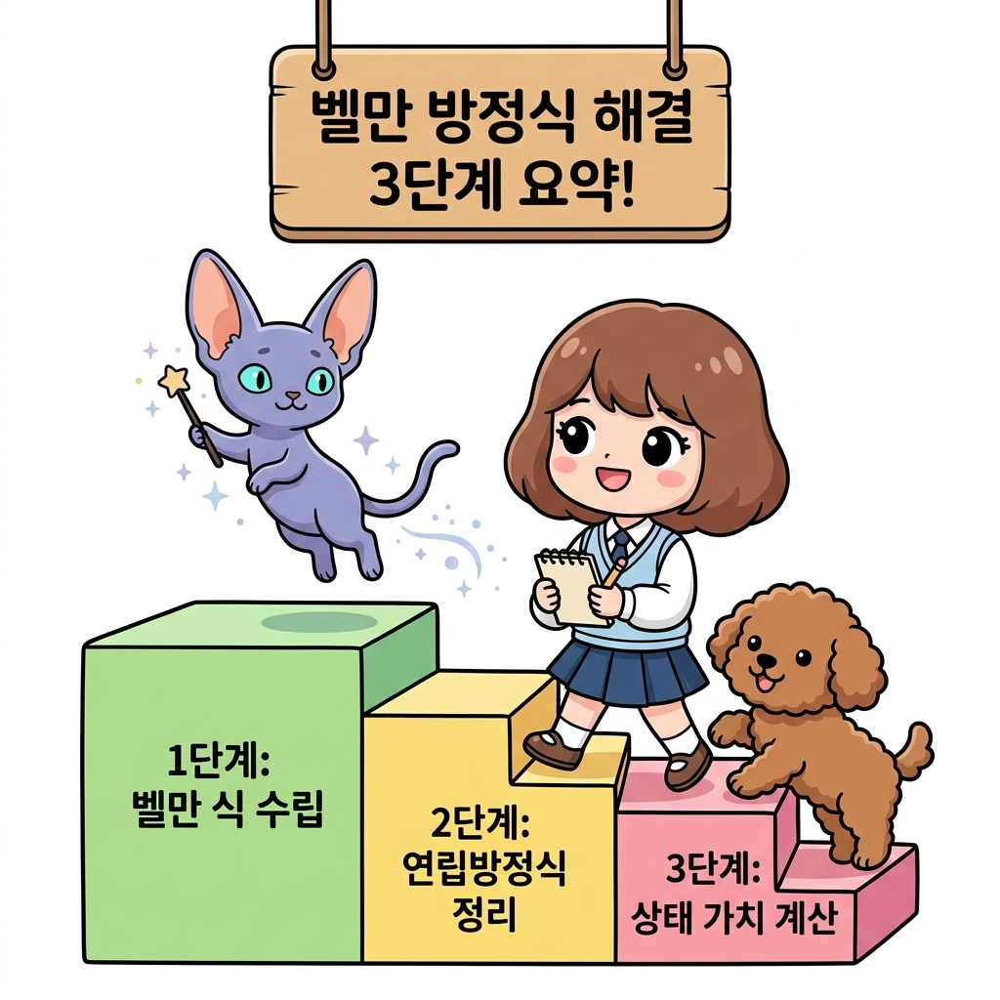

---

### 06.3.3 핵심정리

이번 절에서 배운 두 칸짜리 그리드 월드 벨만 방정식의 핵심 내용을 목록으로 깔끔하게 정리합니다.

  

    🎧
    대화 음성 듣기 (도로시 & 지니)
  

  

    <button type="button" class="btn-audio-play" style="background: #0284c7; color: #ffffff; border: none; border-radius: 16px; padding: 5px 13px; font-size: 0.82rem; font-weight: 600; cursor: pointer; display: inline-flex; align-items: center; gap: 4px; box-shadow: 0 1px 2px rgba(2,132,199,0.3);">
      ▶️ 재생
    </button>
    <button type="button" class="btn-audio-stop" style="background: #e2e8f0; color: #475569; border: none; border-radius: 16px; padding: 5px 11px; font-size: 0.82rem; font-weight: 600; cursor: pointer; display: inline-flex; align-items: center; gap: 4px;">
      ⏹️ 정지
    </button>
  

  <audio src="./audio/dialogue_6_3_scene25.mp3" preload="none"></audio>

> 👧 **도로시**: "오늘 배운 두 칸짜리 그리드 월드 벨만 예제를 마음속에 쏙 정리해두자!"
> 
> 🐱 **지니**: "결정적 전이의 간소화부터 연립방정식 해법까지, 핵심 정리 목록으로 확실하게 복습해보렴!"

*   **무한 분기에서 유한한 연립방정식으로의 변환**:
    *   상태 가치 함수는 본래 무한히 이어지는 미래 보상의 기댓값의 합이지만, 벨만 방정식을 이용하면 미지수가 포함된 유한한 연립 1차 방정식으로 변환할 수 있습니다.

*   **결정적 상태 전이 환경에서의 식 간소화**:
    *   상태 전이가 결정적(*s'* = *f*(*s*, *a*))인 환경에서는 특정 다음 상태로 갈 확률만 1이고 나머지는 0이 되므로, 다음 상태에 대한 시그마 기호(*Σ**s'*)가 사라져 식이 간소화됩니다.
    
    $$
    v_{\pi}(s) = \sum_a \pi(a \mid s) \{ r(s, a, s') + \gamma v_{\pi}(s') \}
    $$

*   **두 칸짜리 그리드 월드에서의 벨만 방정식 도출**:
    *   할인율 *γ* = 0.9 및 무작위 정책(*π* = 0.5) 조건에서 각 상태의 벨만 방정식은 다음과 같이 세워집니다.
    *   **상태 *L1*에서의 벨만 방정식**:
        
        $$
        v_{\pi}(L1) = 0.5 \{ -1 + 0.9 v_{\pi}(L1) \} + 0.5 \{ 1 + 0.9 v_{\pi}(L2) \}
        $$
        
        정리하면:
        
        $$
        -0.55 v_{\pi}(L1) + 0.45 v_{\pi}(L2) = 0
        $$

    *   **상태 *L2*에서의 벨만 방정식**:
        
        $$
        v_{\pi}(L2) = 0.5 \{ 0 + 0.9 v_{\pi}(L1) \} + 0.5 \{ -1 + 0.9 v_{\pi}(L2) \}
        $$
        
        정리하면:
        
        $$
        0.45 v_{\pi}(L1) - 0.55 v_{\pi}(L2) = 0.5
        $$

*   **연립방정식의 해법과 상태 가치 계산 결과**:
    *   도출된 두 1차 방정식을 연립하여 풀면 다음의 유일한 해를 얻습니다.
    
    $$
    \begin{cases}
    v_{\pi}(L1) = -2.25 \\
    v_{\pi}(L2) = -2.75
    \end{cases}
    $$

*   **상태 가치 수치의 직관적 의미**:
    *   **음수 가치**: 무작위 정책에서는 양쪽 벽에 50% 확률로 계속 부딪혀 -1의 감점을 누적하므로 기대 수익이 음수가 됩니다.
    *   ***v**π*(*L1*) > *v**π*(*L2*)**: 상태 *L1* 바로 오른쪽 칸에 사과(+1)가 위치하여 첫 번째 행동에서 사과를 즉시 획득할 확률(50%)이 존재하므로, *L1*의 가치가 *L2*보다 0.5만큼 더 높습니다.

*   **벨만 방정식 해결의 3단계 프로세스**:
    1.  **1단계 (모델 수립)**: 각 상태별 벨만 방정식 작성
    2.  **2단계 (식 정리)**: 동류항을 모아 표준 연립 1차 방정식 형태로 정리
    3.  **3단계 (해 계산)**: 가감법/대입법(또는 행렬 역행렬 계산 알고리즘)으로 최종 상태 가치 *v**π*(*s*) 산출
