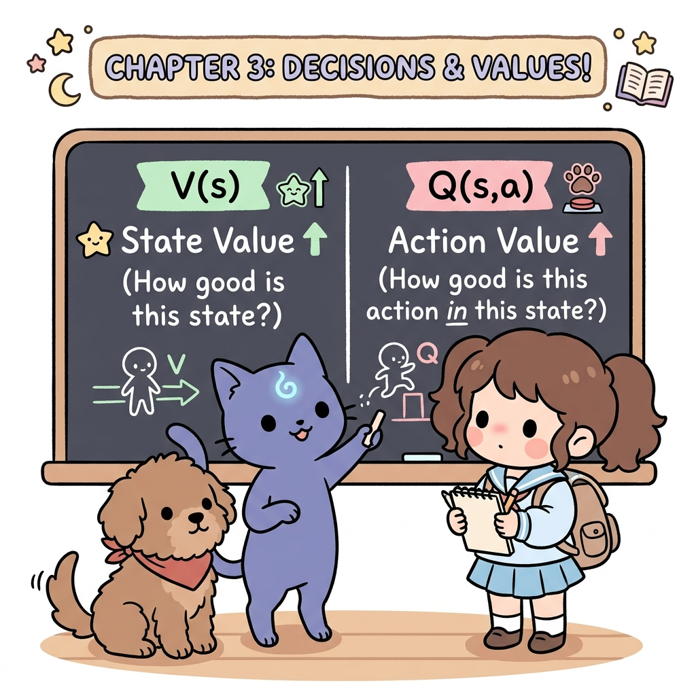
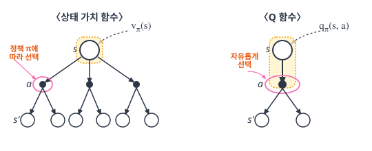
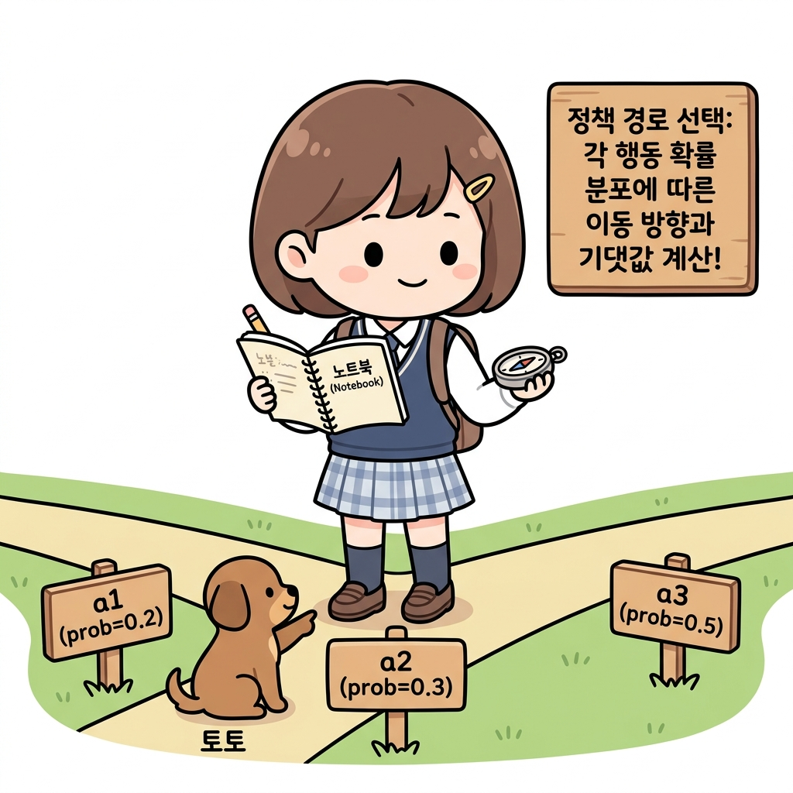
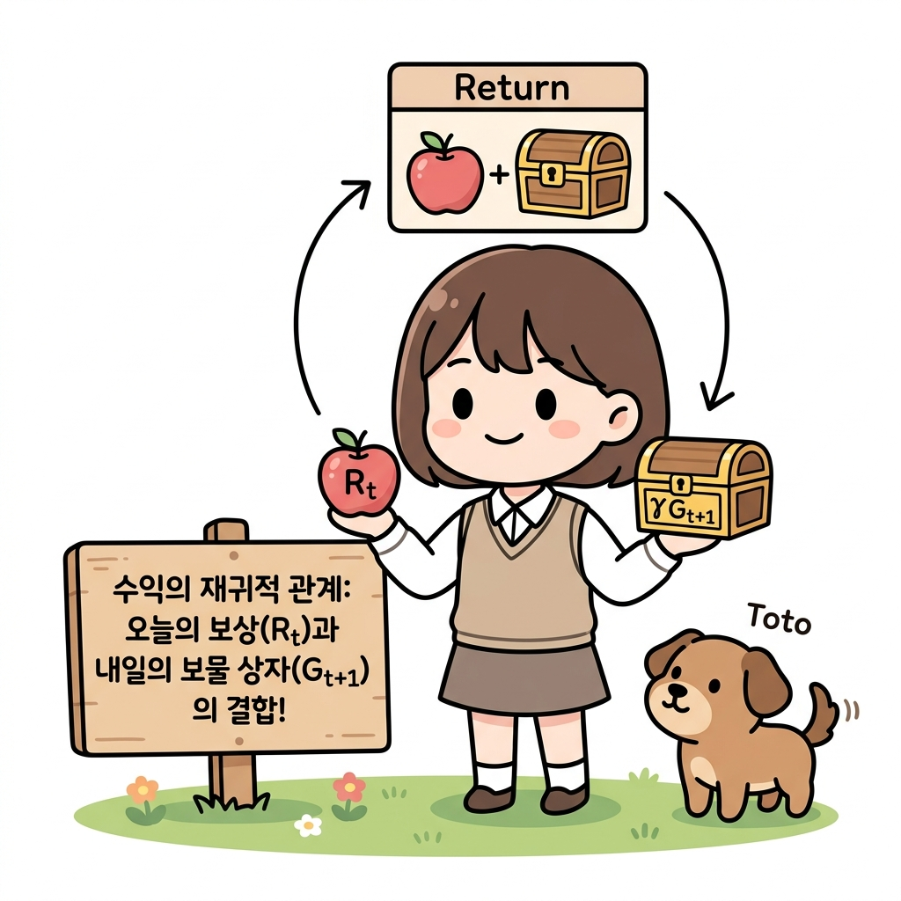
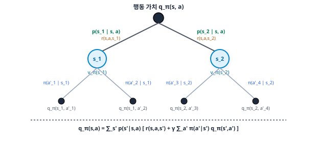

# 06.4 행동 가치 함수(Q 함수)와 벨만 방정식

**그림 06-4** 상태 가치 V(s)와 특정 행동까지 취한 상태의 가치 Q(s,a)의 핵심적 가치 개념 대조를 칠판으로 설명하는 지니와 도로시

상태만을 고려한 상태 가치 함수 $V(s)$를 넘어, 특정 상태에서 임의의 행동을 실행했을 때 얻는 기대 가치를 정의하는 **행동 가치 함수(Q 함수, $Q(s, a)$)**와 그 벨만 방정식을 공부합니다. 요정 지니와 도로시의 기분 좋은 판서 정리를 보며 두 가치 함수의 신비로운 연결 구조를 완벽하게 해부해봅시다!

---

이번 절에서는 행동 가치 함수action-value function를 새롭게 소개합니다. 

행동 가치 함수는 상태 가치 함수와 마찬가지로 강화 학습 이론에 자주 등장하는 중요한 함수입니다. 지금까지는 상태 가치 함수를 사용하여 벨만 방정식을 도출했습니다. 

이번 절에서는 행동 가치 함수의 정의식을 살펴본 후 행동 가치 함수를 이용한 벨만 방정식을 도출하겠습니다.

> NOTE_ 이 책에서는 설명을 간결하게 하고자 상태 가치 함수를 단순히 '가치 함수'라고 줄여 쓰기도 합니다. 또한 행동 가치 함수는 관례적으로 Q 함수Q-function라고 부릅니다. 그래서 이 책에서도 행동 가치 함수를 Q 함수로 표기하기도 합니다.

---

### 06.4.1 행동 가치 함수

먼저 상태 가치 함수를 복습하겠습니다.

$$
v_{\pi}(s) = \mathbb{E}_{\pi}[G_t \mid S_t = s]
$$

상태 가치 함수의 조건은 '상태가 *s*일 것'과 '정책이 *π*일 것' 두 가지입니다. 그리고 조건에 **'행동 *a*'를 추가**할 수 있는데 이것이 바로 **행동 가치 함수(Q 함수)**입니다. 

수식으로는 다음과 같습니다.
$$
q_{\pi}(s, a) = \mathbb{E}_{\pi}[G_t \mid S_t = s, A_t = a]
$$

Q 함수는 시간 *t*일 때 상태 *s*에서 행동 *a*를 취하고, 시간 *t* + 1부터는 정책 *π*에 따라 행동을 결정합니다. 이때 얻을 수 있는 기대 수익이 *q**π*(*s*, *a*)입니다.

> CAUTION_ *q**π*(*s*, *a*)의 행동 *a*는 정책 *π*와 무관하다는 점에 주의합시다. 즉, *q**π*(*s*, *a*)의 행동 *a*는 자유롭게 결정할 수 있으며, '다음 행동부터' 정책 *π*를 따릅니다.

#### Q 함수는 상태 가치 함수에 행동 *a*를 조건으로 추가한 것입니다. 

백업 다이어그램으로 비교하면 더 명확하게 알 수 있습니다.

그림 06-11 상태 가치 함수와 Q 함수의 백업 다이어그램

상태 가치 함수에서의 행동 *a*는 정책 *π*에 따라 선택됩니다. 

반면 Q 함수에서 행동 *a*는 자유롭게 선택할 수 있습니다. 

즉, **첫 번째 행동만큼은 현재 정책 *π*와 무관하게 학습자가 임의로 지정하여 강행해 보고, 두 번째 단계부터 정책 *π*를 따랐을 때의 기대 가치**를 평가합니다.

이 차이를 일상적인 예시로 비유해 보겠습니다.
* **상태 가치 함수 *v**π*(*s*) (처음부터 정책대로)**:
  오늘 아침 교실(*s*)에 등교했을 때 오늘 하루 동안 얻을 평균 점수입니다. 교실에 들어서자마자 1교시 첫 행동부터 내 평소 공부 습관(정책 *π*, 예: 공부 80%, 매점 20%)에 따라 확률적으로 움직입니다.
* **행동 가치 함수 *q**π*(*s*, *a*) (첫 행동은 고집대로 질러보기)**:
  오늘 교실(*s*)에 등교했을 때, 평소 습관과는 무관하게 **일단 1교시만큼은 내 고집대로 '매점 가기(*a*)'라는 행동을 강제 실행**하고, 그다음 2교시부터 평소 습관(정책 *π*)을 충실히 따랐을 때의 하루 기댓값입니다.

#### 왜 행동 *a*를 임의로 지정해서 평가할까요? (정책 개선의 열쇠)
강화 학습의 목적은 '더 좋은 행동 방식(정책)'을 찾아 정책을 업그레이드하는 것입니다. 

평균 점수판인 *v**π*(*s*)만 봐서는 "오늘 공부를 늘려야 할지, 매점 가기를 늘려야 할지" 알 수 없습니다.
하지만 Q 함수 *q**π*(*s*, *a*)를 통해 각 행동을 임의로 대입해 보면, "교실(*s*)에서 공부하기(*a*1)는 60점, 매점가기(*a*2)는 90점, 게임하기(*a*3)는 75점"이라는 **행동별 성적표**를 따로 받아볼 수 있습니다. 

이렇게 개별 가치를 따로 구해놓아야, "아! 가치가 가장 높은 90점짜리 매점 가기(*a*2)의 행동 확률을 높이도록 내 정책(*π*)을 개선해야겠구나!" 하고 **정책 개선(Policy Improvement)**을 할 수 있게 됩니다.

#### 상태 가치 함수와 Q 함수의 차이는 바로 이 점입니다.

따라서 만약 Q 함수의 행동 *a*를 정책 *π*에 따라 선택하도록 설계하면 Q 함수와 상태 가치 함수는 완전히 같아집니다.

#### 예를 들어 

상태 *s*에서 취할 수 있는 행동 후보가 {*a*1, *a*2, *a*3} 세 가지가 있다고 가정하고 이때 정책 *π*에 따라 행동한다고 해보죠. 

즉, 다음과 같은 상황입니다.

• *π*(*a*1 | *s*)의 확률로 행동 *a*1을 선택하는 경우 Q 함수는 *q**π*(*s*, *a*1)  
• *π*(*a*2 | *s*)의 확률로 행동 *a*2을 선택하는 경우 Q 함수는 *q**π*(*s*, *a*2)  
• *π*(*a*3 | *s*)의 확률로 행동 *a*3을 선택하는 경우 Q 함수는 *q**π*(*s*, *a*3)  

이 경우 기대 수익은 Q 함수의 가중 합으로 구할 수 있습니다. 

수식으로는 다음과 같습니다.
$$
\begin{aligned}
&\pi(a_1 \mid s) q_{\pi}(s, a_1) + \pi(a_2 \mid s) q_{\pi}(s, a_2) + \pi(a_3 \mid s) q_{\pi}(s, a_3) \\
&= \sum_{a = \{a_1, a_2, a_3\}} \pi(a \mid s) q_{\pi}(s, a)
\end{aligned}
$$

그리고 이 식은 상태 가치 함수와 똑같은 조건에서의 기대 수익입니다. 

따라서 다음 식이 성립합니다.
$$
v_{\pi}(s) = \sum_a \pi(a \mid s) q_{\pi}(s, a)
$$

[식 06.11]

---

### 06.4.2 행동 가치 함수를 이용한 벨만 방정식

이어서 행동 가치 함수(Q 함수)를 이용한 벨만 방정식을 도출하겠습니다. 

먼저 다음과 같이 Q 함수를 전개합니다.
$$
\begin{aligned}
q_{\pi}(s, a) &= \mathbb{E}_{\pi}[G_t \mid S_t = s, A_t = a] \\
&= \mathbb{E}_{\pi}[R_t + \gamma G_{t+1} \mid S_t = s, A_t = a]
\end{aligned}
$$

[식 06.12]

여기서 상태 *s*와 행동 *a*는 정해져 있습니다. 

그렇다면 다음 상태 *s'*로의 전이 확률은 *p*(*s'* | *s*, *a*)이고 보상은 *r*(*s*, *a*, *s'*) 함수에 의해 주어집니다. 

이 점을 고려하면 [식 06.12]는 다음과 같이 전개를 이어갈 수 있습니다.
$$
\begin{aligned}
q_{\pi}(s, a) &= \mathbb{E}_{\pi}[R_t + \gamma G_{t+1} \mid S_t = s, A_t = a] \\
&= \mathbb{E}_{\pi}[R_t \mid S_t = s, A_t = a] + \gamma \mathbb{E}_{\pi}[G_{t+1} \mid S_t = s, A_t = a] \\
&= \sum_{s'} p(s' \mid s, a) r(s, a, s') + \gamma \sum_{s'} p(s' \mid s, a) \mathbb{E}_{\pi}[G_{t+1} \mid S_{t+1} = s'] \\
&= \sum_{s'} p(s' \mid s, a) \{ r(s, a, s') + \gamma \mathbb{E}_{\pi}[G_{t+1} \mid S_{t+1} = s'] \} \\
&= \sum_{s'} p(s' \mid s, a) \{ r(s, a, s') + \gamma v_{\pi}(s') \}
\end{aligned}
$$

[식 06.13]

여기서는 식을 한 번에 변형했지만 06.2절에서 진행한 방식과 같습니다(식 전개가 잘 이해되지 않으면 06.2절을 참고하면서 한 단계씩 도전해보세요). 

또한 [식 06.11]을 이용하면 상태 가치 함수 *v**π*(*s'*)는 Q 함수를 사용하여 다음처럼 쓸 수 있습니다.
$$
q_{\pi}(s, a) = \sum_{s'} p(s' \mid s, a) \left\{ r(s, a, s') + \gamma \sum_{a'} \pi(a' \mid s') q_{\pi}(s', a') \right\}
$$

[식 06.14]

[식 06.14]의 *a'*는 시간 *t*+1에서의 행동입니다. 

이 [식 06.14]가 바로 행동 가치 함수(Q 함수)를 이용한 벨만 방정식입니다.

#### 백업 다이어그램

Q 함수의 벨만 방정식인 [식 06.14]를 백업 다이어그램 형태로 도출 관계를 매칭하여 시각화하면 다음과 같습니다.

그림 06-11a 행동 가치 함수(Q 함수) 벨만 방정식의 백업 다이어그램 구조

위 [그림 06-11a]에서 보듯, 행동 가치 함수 *q**π*(*s*, *a*)의 백업 다이어그램은 상단의 행동 노드 (*s*, *a*)에서 시작하여 환경의 전이 *p*(*s'* | *s*, *a*)에 따라 다음 상태 *s'*로 가고, 그 상태에서 다시 에이전트의 정책 *π*(*a'* | *s'*)에 따라 다음 행동 *a'*를 선택하는 흐름을 보여줍니다. 

이는 상태 가치 함수의 백업 다이어그램과 시작 노드의 종류 및 한 스텝 뒤의 노드 구성이 대칭을 이룹니다.
