# 06.4 행동 가치 함수(Q 함수)와 벨만 방정식

상태만을 고려한 상태 가치 함수 *v*(*s*)를 넘어, 특정 상태에서 임의의 행동을 실행했을 때 얻는 기대 가치를 정의하는 **행동 가치 함수(Q 함수, *q*(*s*, *a*))**와 그 벨만 방정식을 공부합니다. 

요정 지니와 도로시의 기분 좋은 판서 정리를 보며 두 가치 함수의 신비로운 연결 구조를 완벽하게 해부해봅시다!

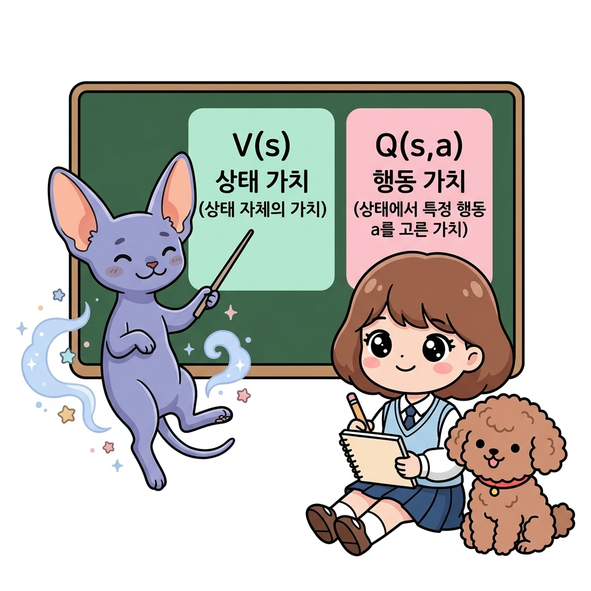

**그림 06-4** 상태 가치 V(s)와 특정 행동까지 취한 상태의 가치 Q(s,a)의 핵심적 가치 개념 대조를 칠판으로 설명하는 지니와 도로시

---

이번 절에서는 **행동 가치 함수action-value function**를 새롭게 소개합니다. 

**행동 가치 함수**는 상태 가치 함수와 마찬가지로 강화 학습 이론에 자주 등장하는 중요한 함수입니다. 

지금까지는 상태 가치 함수를 사용하여 벨만 방정식을 도출했습니다. 

이번 절에서는 행동 가치 함수의 정의식을 살펴본 후 행동 가치 함수를 이용한 벨만 방정식을 도출하겠습니다.

> NOTE_ 이 강의에서는 설명을 간결하게 하고자 상태 가치 함수를 단순히 '가치 함수'라고 줄여 쓰기도 합니다. 또한 행동 가치 함수는 관례적으로 Q 함수Q-function라고 부릅니다. 그래서 이 책에서도 행동 가치 함수를 Q 함수로 표기하기도 합니다.

---

### 06.4.1 행동 가치 함수

먼저 이전 절에서 깊이 있게 배웠던 **상태 가치 함수(State-Value Function)**를 다시 한번 복습해보겠습니다.

$$
v_{\pi}(s) = \mathbb{E}_{\pi}[G_t \mid S_t = s]
$$

수식을 자세히 들여다보면, 상태 가치 함수 *v**π*(*s*)에는 두 가지 핵심 전제 조건이 걸려 있습니다.

*   **조건 1 (현재 위치)**: 시간 *t*일 때 에이전트가 위치한 **현재 상태가 *s***이어야 합니다(*S**t* = *s*). 즉, 평가의 시작점이 상태 *s*로 고정됩니다.
*   **조건 2 (행동 기준)**: 앞으로 에이전트가 취할 모든 행동은 **현재의 정책 *π***를 충실히 따라야 합니다(기댓값 기호의 아래첨자 *π*).

즉, 상태 가치 함수는 **"내가 지금 상태 *s*에 서 있다면, 앞으로 현재 정책 *π*대로 살아갈 때 평균적으로 얼마의 총 보상(기대 수익)을 얻을 수 있는가?"**를 평가하는 상태 자체의 종합 성적표입니다.

---

그리고 이 상태 가치 함수의 조건에 **'지금 취할 특정 행동 *a*'를 조건으로 추가**할 수 있는데, 이것이 바로 강화학습에서 가장 중요한 **행동 가치 함수(Action-Value Function, Q 함수)**입니다!

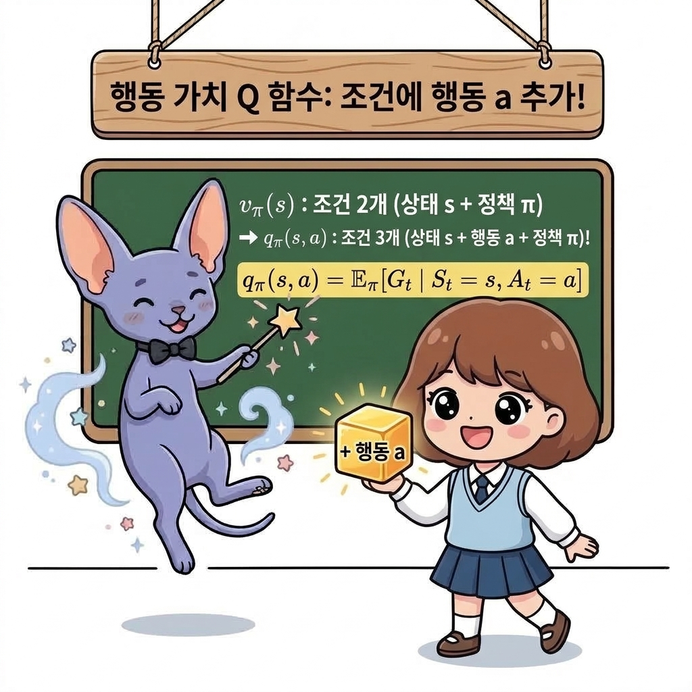

수식으로는 다음과 같이 조건절에 *A**t* = *a*를 덧붙여 정의합니다.
$$
q_{\pi}(s, a) = \mathbb{E}_{\pi}[G_t \mid S_t = s, A_t = a]
$$

---

상태 가치 함수가 단지 "내가 지금 교실(*s*)에 있으면 평균 몇 점일까?"라는 **장소 자체의 가치**를 묻는다면, 행동 가치 함수는 한 걸음 더 나아가 **"내가 지금 교실(*s*)에서 '공부하기(*a*)'를 실천하면 앞으로 평균 몇 점을 얻을 수 있을까?"**라는 **구체적인 행동의 가치**를 묻습니다. 

이처럼 조건에 행동 *a*가 추가됨으로써, 에이전트는 각 상태에서 선택할 수 있는 여러 행동들의 가치를 하나하나 따로따로 분리하여 평가할 수 있게 됩니다.

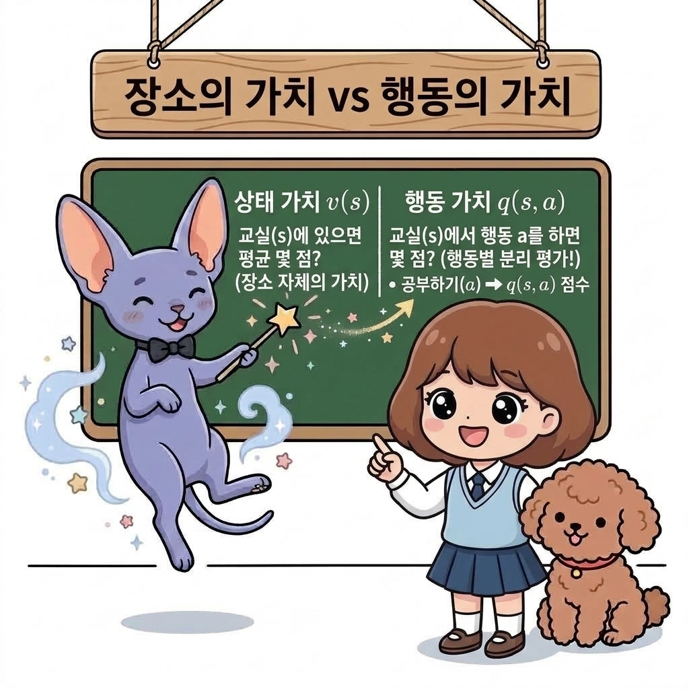

---

Q 함수 *q**π*(*s*, *a*)의 핵심 메커니즘은 다음과 같은 **2단계 시간 전개**로 이루어집니다.

1.  **시간 *t* (첫 번째 행동)**: 상태 *s*에서 지정된 특정 행동 *a*를 취합니다.
2.  **시간 *t* + 1부터 (이후의 행동들)**: 방금 취한 행동의 결과를 맞이한 다음 상태부터는 다시 평소의 정책 *π*에 따라 행동을 결정합니다.

이때 시간 *t*부터 미래로 이어지는 모든 보상의 할인 누적합(기대 수익)의 평균값이 바로 *q**π*(*s*, *a*)입니다.

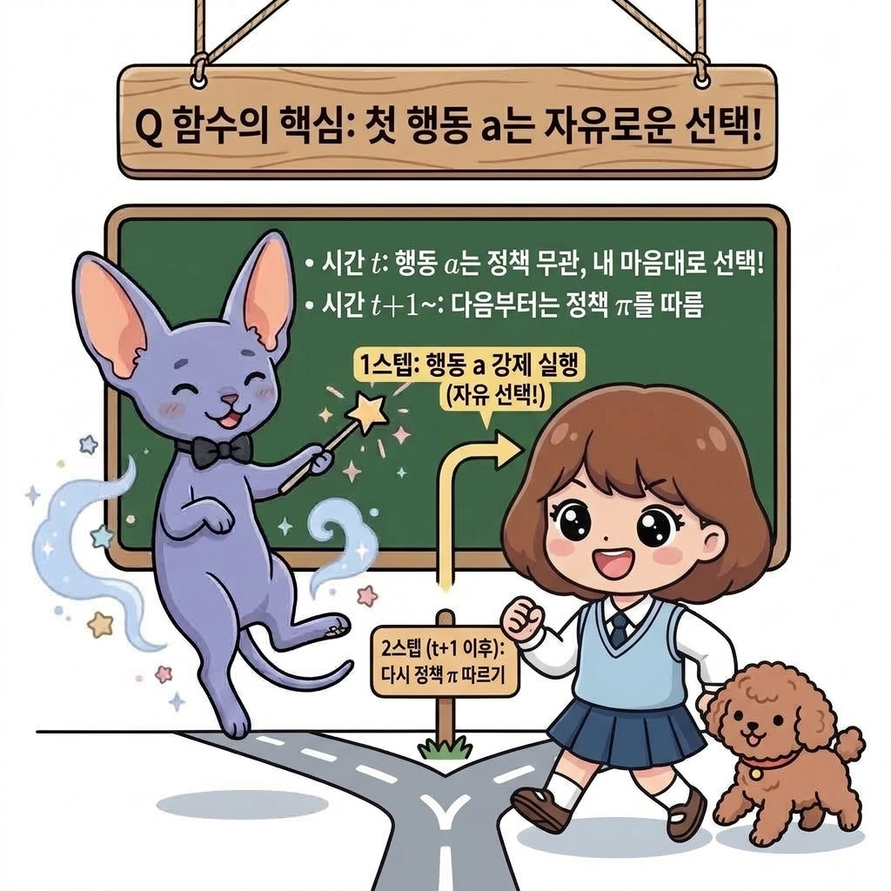

> CAUTION_ *q**π*(*s*, *a*)의 **첫 번째 행동 *a*는 현재 정책 *π*와 완전히 무관하게 자유롭게 선택할 수 있다**는 점이 가장 중요합니다! 현재 정책 *π*가 특정 행동을 선호하든 기피하든 상관없이, 우리는 "만약 이 행동 *a*를 강제로 질러보면 어떻게 될까?"를 마음껏 가상으로 시도해볼 수 있습니다. 그리고 그 첫 행동의 결과로 넘어간 다음 스텝(*t* + 1)부터 비로소 원래 정책 *π*를 성실히 따르게 됩니다.

----

#### 백업 다이어그램으로 보는 두 가치 함수의 결정적 차이

Q 함수가 상태 가치 함수에 '행동 *a*'를 조건으로 추가한 것이라는 사실은 **백업 다이어그램(Backup Diagram)**을 통해 시각적으로 비교해 보면 그 차이가 확연하게 드러납니다.

**그림 06-11** 상태 가치 함수와 Q 함수의 백업 다이어그램 구조 비교

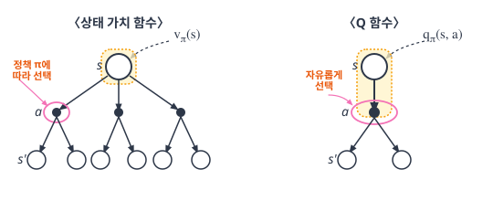

백업 다이어그램에서 **흰색 원(○)은 상태 노드**를 나타내고, **검은색 점(●)은 행동 노드**를 의미합니다. 

위 [그림 06-11]의 두 다이어그램을 비교해 보면 시작 지점과 첫 분기에서 매우 흥미로운 차이를 발견할 수 있습니다.

---

**1. 상태 가치 함수 *v**π*(*s*) (그림 왼쪽)**
*   최상단의 출발점이 **상태 노드 *s***입니다.
*   상태 *s*에서 아래의 여러 행동 노드(검은 점)들로 여러 갈래의 화살표가 뻗어나갑니다.
*   이 화살표들은 **현재 정책 *π*의 확률 분포(*π*(*a* | *s*))에 따라 확률적으로 선택**됩니다. 즉, **어떤 행동을 할지**가 에이전트의 평소 습관(정책)에 완전히 종속되어 결정되며, **특정 행동을 일부러 고를 수 없습니다.**

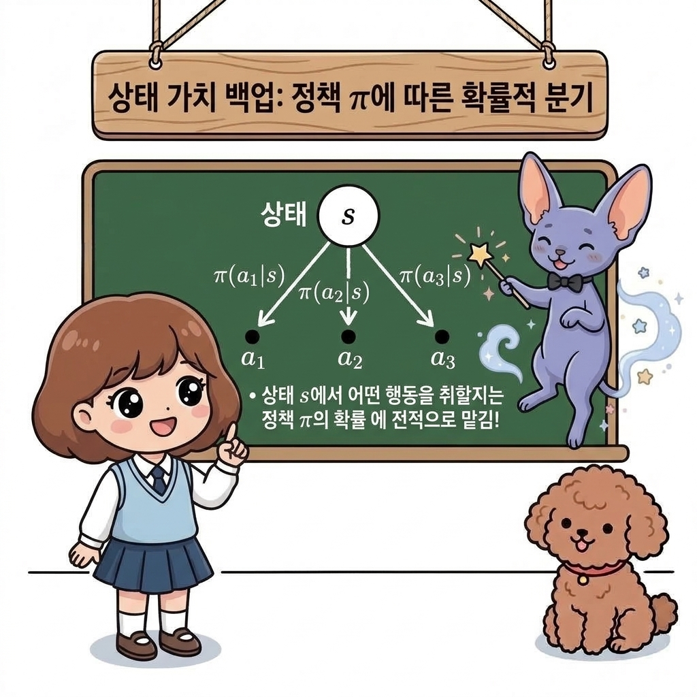

---

**2. 행동 가치 함수 *q**π*(*s*, *a*) (그림 오른쪽)**
*   최상단에서 상태 *s*와 특정 행동 노드 *a*(검은 점)가 **단일 선으로 직결**되어 있습니다.
*   여기서는 여러 갈래의 확률적 분기가 없습니다. 왜냐하면 행동 *a*는 정책 *π*의 확률에 따라 뽑히는 것이 아니라, **우리가 평가하고자 하는 특정 행동을 '자유롭게 지정'하여 강제 선택**한 것이기 때문입니다.
*   따라서 에이전트는 정책 *π*와 상관없이 **자신이 원하는 임의의 행동 *a***를 일단 저질러보고, 그 행동의 결과로 도착한 다음 상태 *s'*부터 비로소 정책 *π*를 따르게 됩니다.

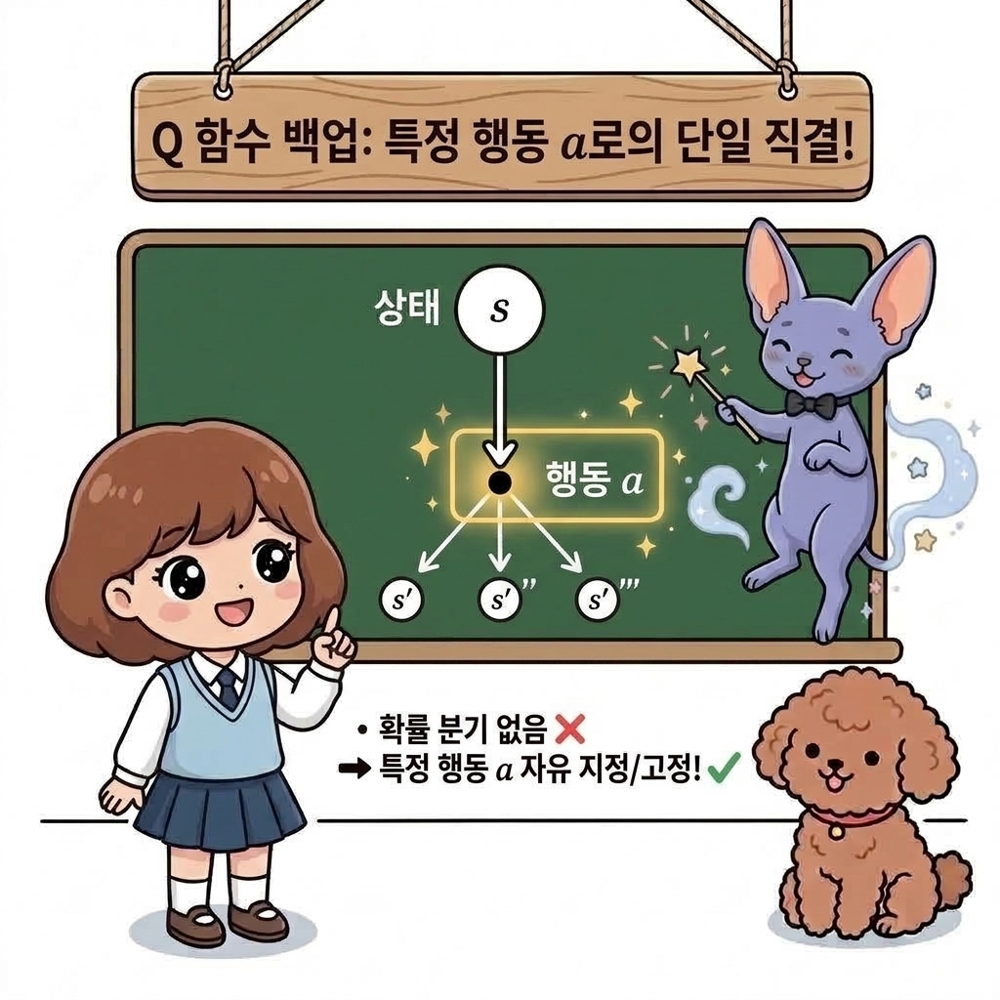

---

#### 첫 번째 행동의 강제 실행과 교실 일상 비유

즉, **첫 번째 행동만큼은 현재 정책 *π*와 무관하게 학습자가 임의로 지정하여 강행해 보고, 두 번째 단계부터 정책 *π*를 충실히 따랐을 때의 기대 가치**를 평가하는 것이 바로 Q 함수(행동 가치 함수)의 본질입니다.

이 차이를 일상적인 교실 생활 예시로 비유해 보겠습니다.

*   **상태 가치 함수 *v**π*(*s*) (처음부터 평소 습관대로)**:
    오늘 아침 교실(*s*)에 등교했을 때 오늘 하루 동안 얻을 평균 점수입니다. 교실에 들어서자마자 1교시 첫 행동부터 내 평소 공부 습관(정책 *π*, 예: 공부 80%, 매점 20%)에 따라 확률적으로 움직이며 하루를 보냅니다.
*   **행동 가치 함수 *q**π*(*s*, *a*) (첫 시간은 내 고집대로 질러보기!)**:
    오늘 교실(*s*)에 등교했을 때, 평소 습관과는 무관하게 **일단 1교시만큼은 내 고집대로 '매점 가기(*a*)'라는 특정 행동을 강제 실행**하고, 그다음 2교시부터 평소 습관(정책 *π*)을 충실히 따랐을 때 누리게 될 하루 만족도의 기댓값입니다.

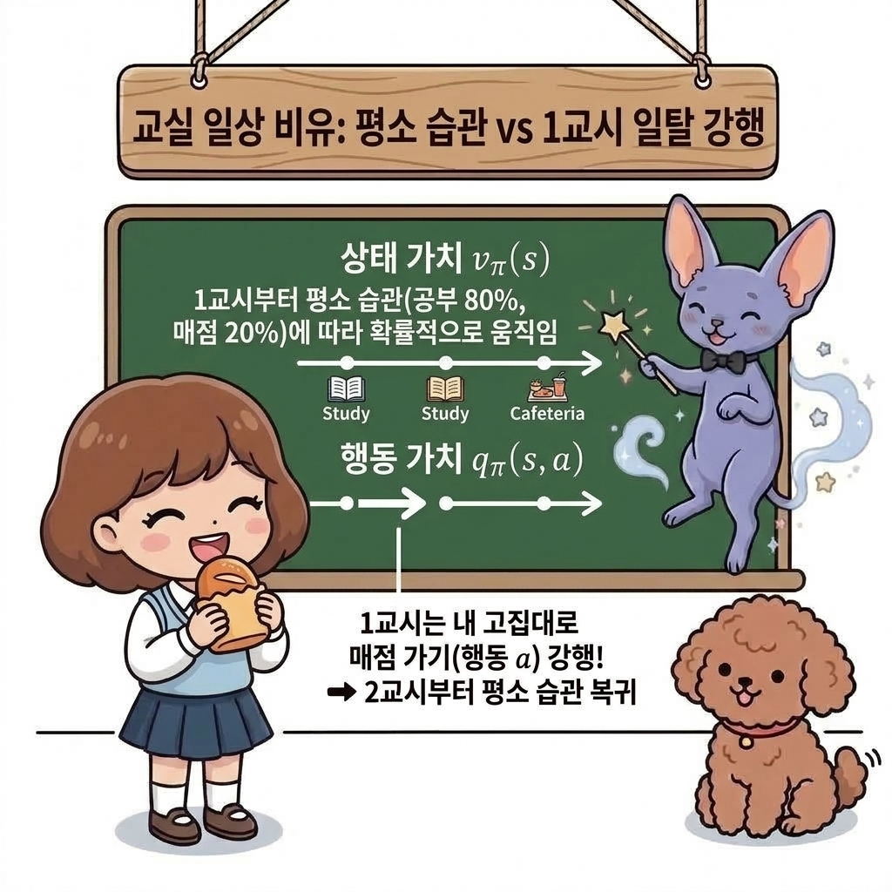

---

#### 왜 행동 *a*를 임의로 지정해서 평가할까요? (정책 개선의 열쇠)
강화 학습의 목적은 **'더 좋은 행동 방식(정책)'**을 찾아 정책을 업그레이드하는 것입니다. 

평균 점수판인 *v**π*(*s*)만 봐서는 "오늘 공부를 늘려야 할지, 매점 가기를 늘려야 할지" 알 수 없습니다.
하지만 Q 함수 *q**π*(*s*, *a*)를 통해 각 행동을 임의로 대입해 보면, "교실(*s*)에서 공부하기(*a*1)는 60점, 매점가기(*a*2)는 90점, 게임하기(*a*3)는 75점"이라는 **행동별 성적표**를 따로 받아볼 수 있습니다. 

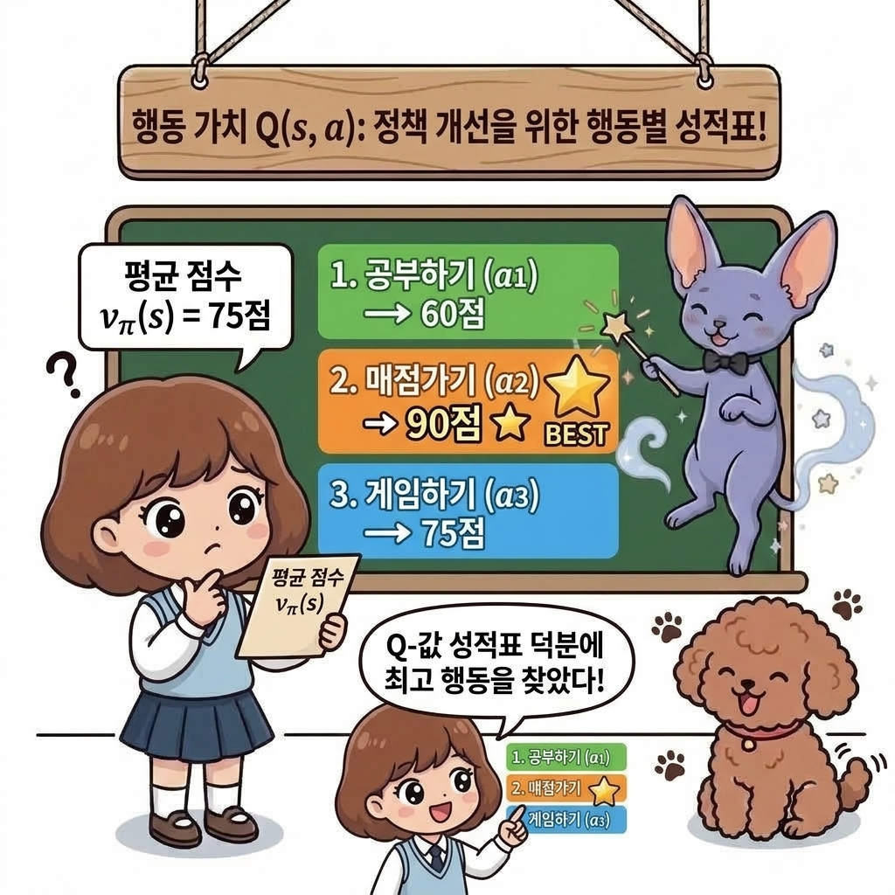

---

이렇게 개별 가치를 따로 구해놓아야, "아! 가치가 가장 높은 90점짜리 매점 가기(*a*2)의 행동 확률을 높이도록 내 정책(*π*)을 개선해야겠구나!" 하고 **정책 개선(Policy Improvement)**을 할 수 있게 됩니다.

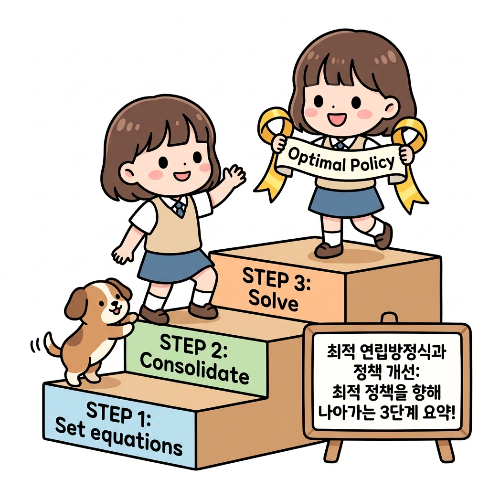

---

### 06.4.2 상태 가치와 Q 함수의 관계 (가중합 원리)

#### 상태 가치 함수와 Q 함수의 본질적 연결

따라서 만약 Q 함수의 행동 *a*를 정책 *π*에 따라 **선택하도록 설계**하면 Q 함수와 상태 가치 함수는 완전히 같아집니다.

---

#### 예를 들어: 교실에서의 세 가지 행동과 정책 가중합

앞서 살펴본 교실 예시를 통해 구체적으로 이해해 보겠습니다.

상태 *s*(교실)에서 에이전트가 선택할 수 있는 행동 후보가 {*a*1(공부하기), *a*2(매점가기), *a*3(게임하기)} 세 가지가 있고, 각 행동을 강제로 실행했을 때의 Q-값(행동별 성적표)이 다음과 같이 이미 매겨져 있다고 해보겠습니다.

*   *a*1(공부하기)의 행동 가치: *q**π*(*s*, *a*1) = 60점
*   *a*2(매점가기)의 행동 가치: *q**π*(*s*, *a*2) = 90점
*   *a*3(게임하기)의 행동 가치: *q**π*(*s*, *a*3) = 75점

이제 에이전트가 특정 행동을 강제하지 않고, **자신의 평소 습관인 정책 *π*의 확률 분포에 따라 행동을 선택**한다고 가정해 보죠.

*   *π*(*a*1 | *s*) = 0.5 (50% 확률로 공부하기 *a*1 선택)
*   *π*(*a*2 | *s*) = 0.3 (30% 확률로 매점가기 *a*2 선택)
*   *π*(*a*3 | *s*) = 0.2 (20% 확률로 게임하기 *a*3 선택)

그렇다면 오늘 아침 교실(*s*)에 등교했을 때 기대할 수 있는 **종합 평균 점수(상태 가치 *v**π*(*s*))**는 어떻게 구할 수 있을까요?

바로 **"각 행동을 고를 확률"에 "그 행동의 점수(Q-값)"를 곱한 뒤 모두 더한 가중 합(가중 평균, Weighted Sum)**으로 간단히 구해집니다.

*   **교실의 기대 수익(평균 점수)** = (0.5 × 60점) + (0.3 × 90점) + (0.2 × 75점) = 30 + 27 + 15 = **72점**

즉, **상태 가치 *v**π*(*s*)**는 완전히 별개의 새로운 값이 아니라, **각각의 개별 행동 가치 *q**π*(*s*, *a*)들을 현재 정책 *π*의 선택 확률 비율대로 골고루 섞어 합친 평균값**에 불과합니다.

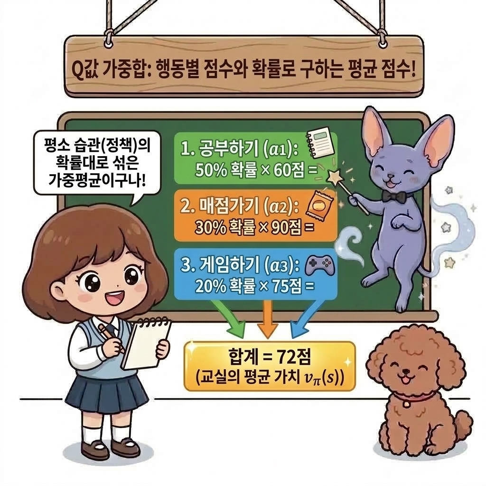

---

#### 가중합 수식 도출 [식 06.11]

$$
\begin{aligned}
&\pi(a_1 \mid s) q_{\pi}(s, a_1) + \pi(a_2 \mid s) q_{\pi}(s, a_2) + \pi(a_3 \mid s) q_{\pi}(s, a_3) \\
&= \sum_{a = \{a_1, a_2, a_3\}} \pi(a \mid s) q_{\pi}(s, a)
\end{aligned}
$$

그리고 이 식은 상태 가치 함수와 똑같은 조건에서의 기대 수익입니다. 

따라서 다음 식이 성립합니다.
$$
v_{\pi}(s) = \sum_a \pi(a \mid s) q_{\pi}(s, a)
$$

[식 06.11]

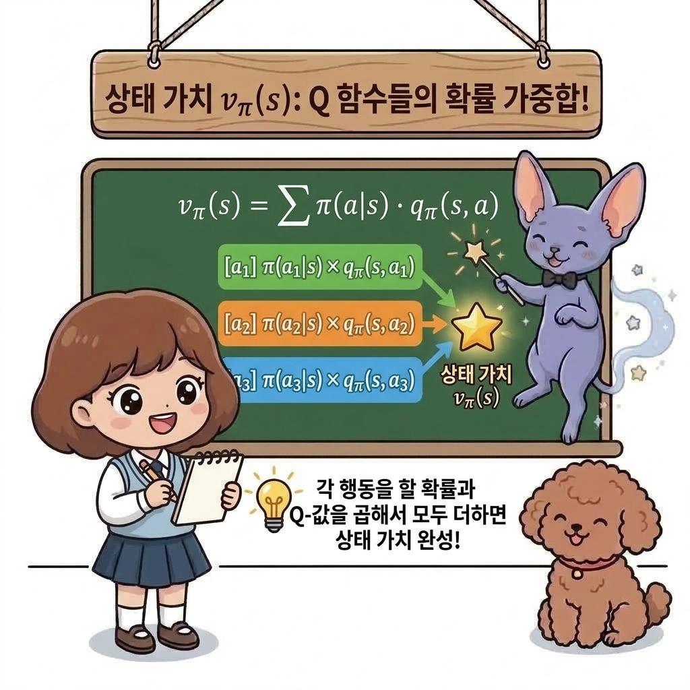

---

### 06.4.3 행동 가치 함수를 이용한 벨만 방정식

이어서 행동 가치 함수(Q 함수)를 이용한 벨만 방정식을 본격적으로 도출해 보겠습니다. 

앞서 06.2절에서 상태 가치 함수의 벨만 방정식을 유도할 때, 가장 중요한 출발점은 **"전체 수익 *G**t*를 '지금 당장 손에 쥐는 보상 *R**t*'과 '다음 스텝부터 얻을 미래 수익 할인합 *γG**t*+1'의 재귀적 형태로 쪼개는 것(*G**t* = *R**t* + *γG**t*+1)"**이었습니다.

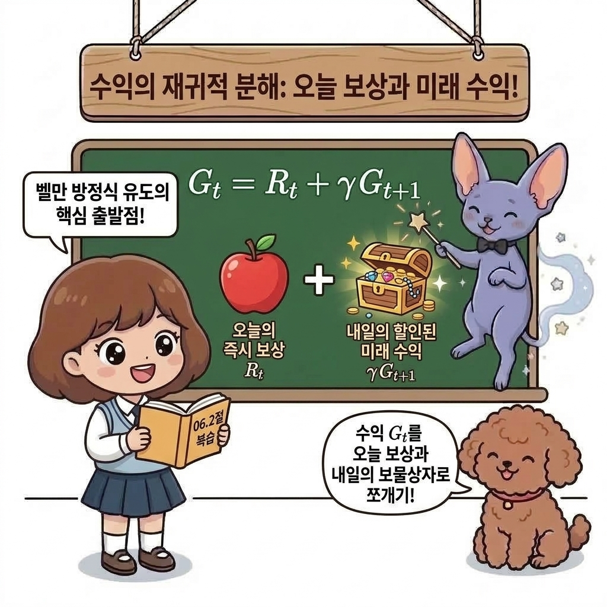

---

#### 조건부 행동 *a*가 추가된 수익의 재귀적 분해

단, 상태 가치 함수와의 **결정적인 차이점**은 조건부에 **상태 *S**t* = *s*뿐만 아니라 내가 지정한 행동 *A**t* = *a*까지 함께 주어져 있다**는 점입니다.

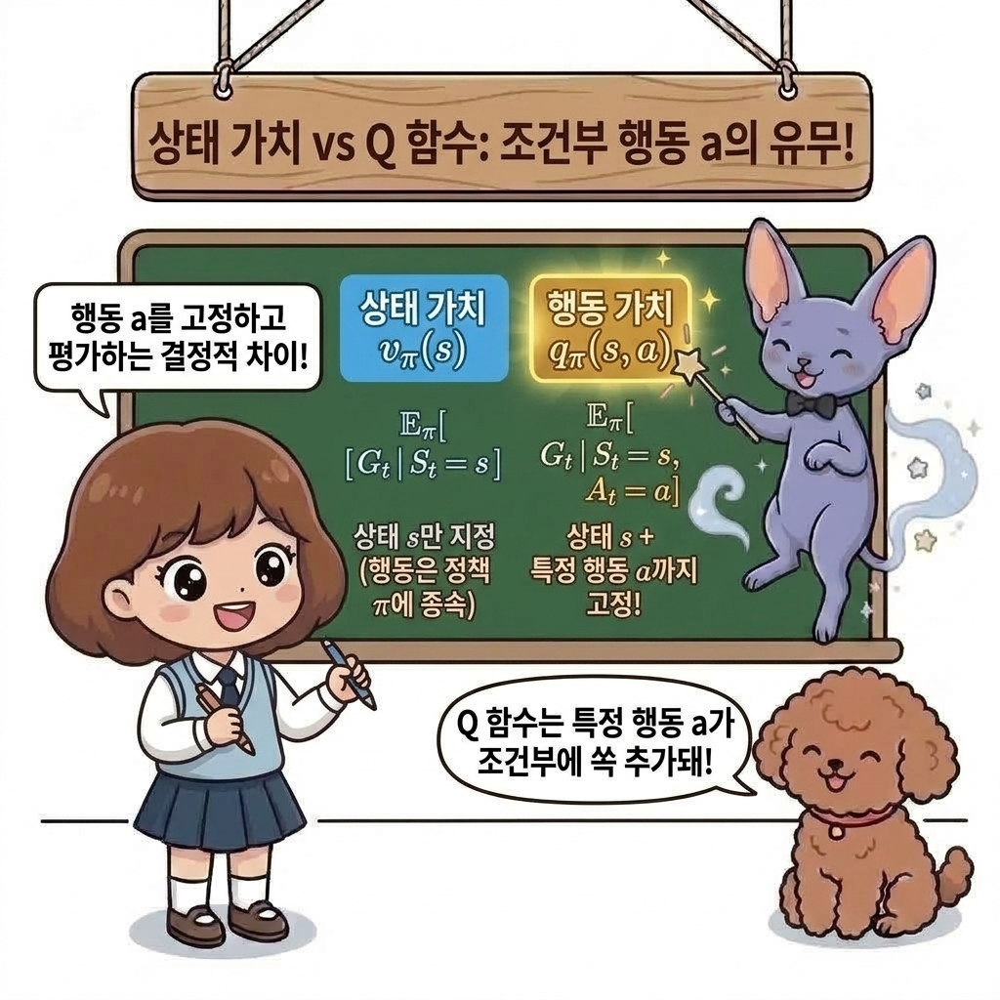

---

#### [식 06.12] Q 함수의 1단계 분해식 도출

$$
\begin{aligned}
q_{\pi}(s, a) &= \mathbb{E}_{\pi}[G_t \mid S_t = s, A_t = a] \\
&= \mathbb{E}_{\pi}[R_t + \gamma G_{t+1} \mid S_t = s, A_t = a]
\end{aligned}
$$

[식 06.12]

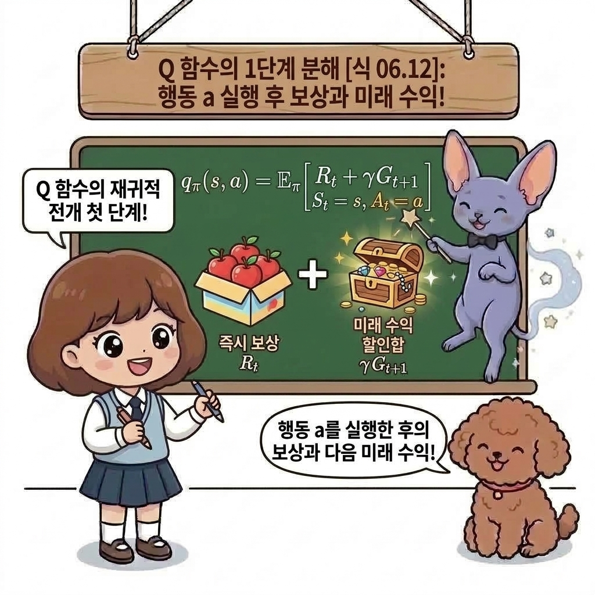

---

#### 1단계 시간 전개: 상태 전이 확률과 다음 상태 가치 *v**π*(*s'*)의 결합

[식 06.12]에서 상태 *s*와 **내가 실행한 행동 *a***는 이미 명확히 정해져 있습니다. 

에이전트가 상태 *s*에서 행동 *a*를 취하면, 환경의 규칙에 따라 다음 상태 *s'*로 넘어가게 됩니다. 이때:
*   다음 상태 *s'*로 이동할 확률은 **상태 전이 확률 *p*(*s'* | *s*, *a*)**로 주어집니다.
*   그 결과 에이전트가 받게 되는 즉시 보상은 **보상 함수 *r*(*s*, *a*, *s'*)**에 의해 결정됩니다.

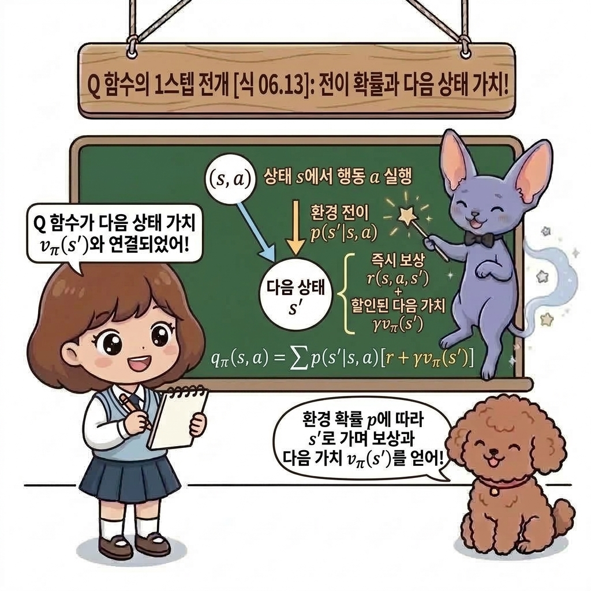

---

#### [식 06.13] Q 함수 1스텝 전개식의 단계별 유도

**1단계: 기댓값 기호의 분배 (선형성)**  
기댓값 연산자 𝔼를 **덧셈 기호**를 기준으로 **'당장의 보상'**과 **'미래 수익'**으로 각각 분리합니다.
$$
q_{\pi}(s, a) = \mathbb{E}_{\pi}[R_t \mid S_t = s, A_t = a] + \gamma \mathbb{E}_{\pi}[G_{t+1} \mid S_t = s, A_t = a]
$$

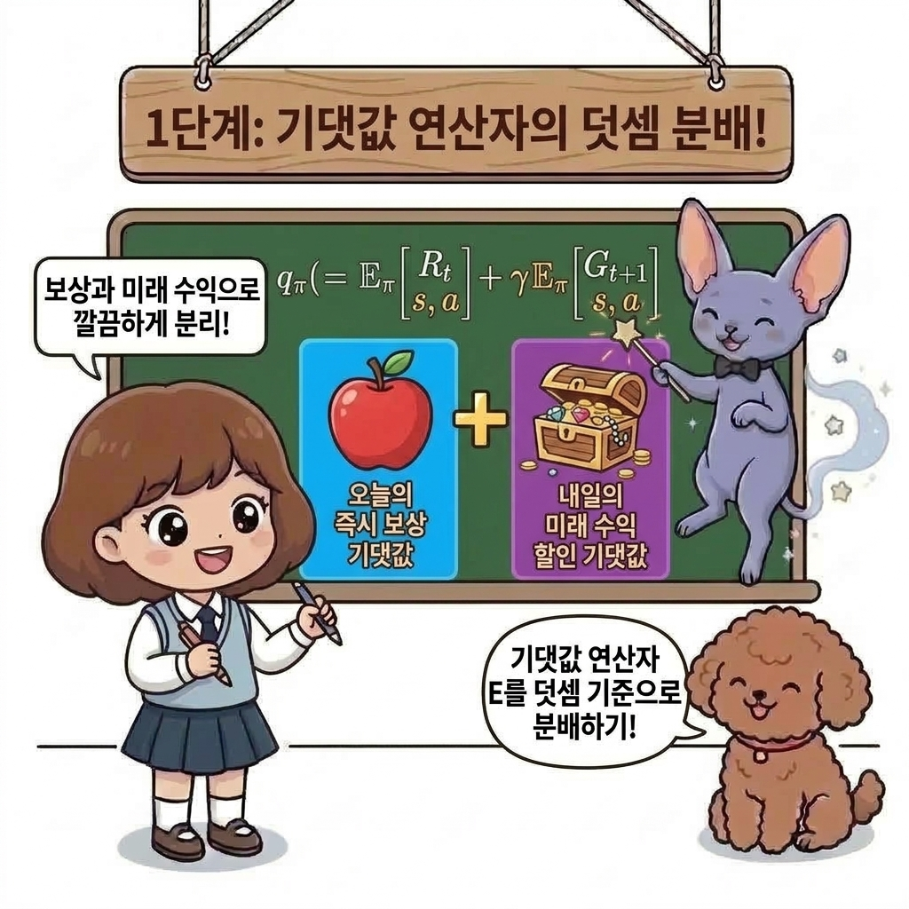

**2단계: 즉시 보상과 미래 수익을 확률 전이로 표현**  

*   **첫 번째 항 (즉시 보상의 기댓값)**: 행동 *a*를 취했을 때 환경 규칙에 따라 도달할 수 있는 모든 다음 상태 *s'*에 대해, 이동할 전이 확률 *p*(*s'* | *s*, *a*)과 그때 받게 되는 보상 *r*(*s*, *a*, *s'*)을 곱해 합산합니다.

$$
\mathbb{E}_{\pi}[R_t \mid S_t = s, A_t = a] = \sum_{s'} p(s' \mid s, a) r(s, a, s')
$$

*   **두 번째 항 (미래 수익의 기댓값)**: 다음 상태 *s'*에 도착한 순간부터(*S**t*+1 = *s'*) 에이전트는 평소 정책 *π*를 따릅니다. 따라서 상태 *s'*에서 앞으로 얻게 될 기대 수익(기댓값)은 다름 아닌 **다음 상태의 가치 *v**π*(*s'*)**입니다!

$$
\gamma \mathbb{E}_{\pi}[G_{t+1} \mid S_t = s, A_t = a] = \gamma \sum_{s'} p(s' \mid s, a) \mathbb{E}_{\pi}[G_{t+1} \mid S_{t+1} = s'] = \gamma \sum_{s'} p(s' \mid s, a) v_{\pi}(s')
$$

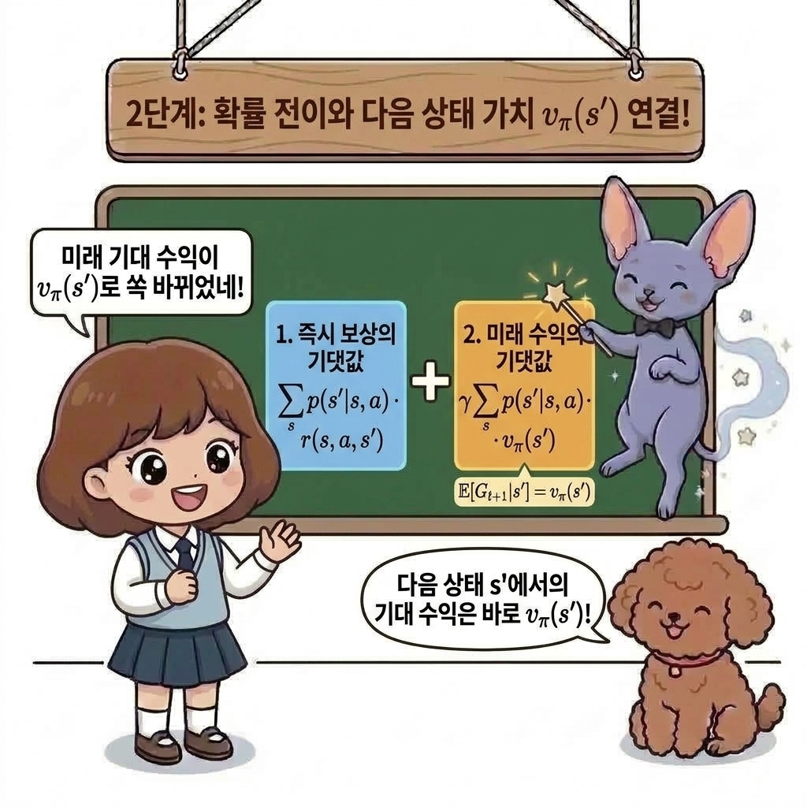

**3단계: 공통 확률 가중치로 묶기 ([식 06.13] 도출)**  

앞서 구한 두 항은 모두 공통으로 상태 전이 확률 합 기호를 가지고 있습니다. 

따라서 공통 인수인 전이 확률을 바깥으로 묶어내면 최종적으로 다음 식이 완성됩니다.
$$
\begin{aligned}
q_{\pi}(s, a) &= \sum_{s'} p(s' \mid s, a) r(s, a, s') + \gamma \sum_{s'} p(s' \mid s, a) v_{\pi}(s') \\
&= \sum_{s'} p(s' \mid s, a) \left\{ r(s, a, s') + \gamma v_{\pi}(s') \right\}
\end{aligned}
$$

[식 06.13]

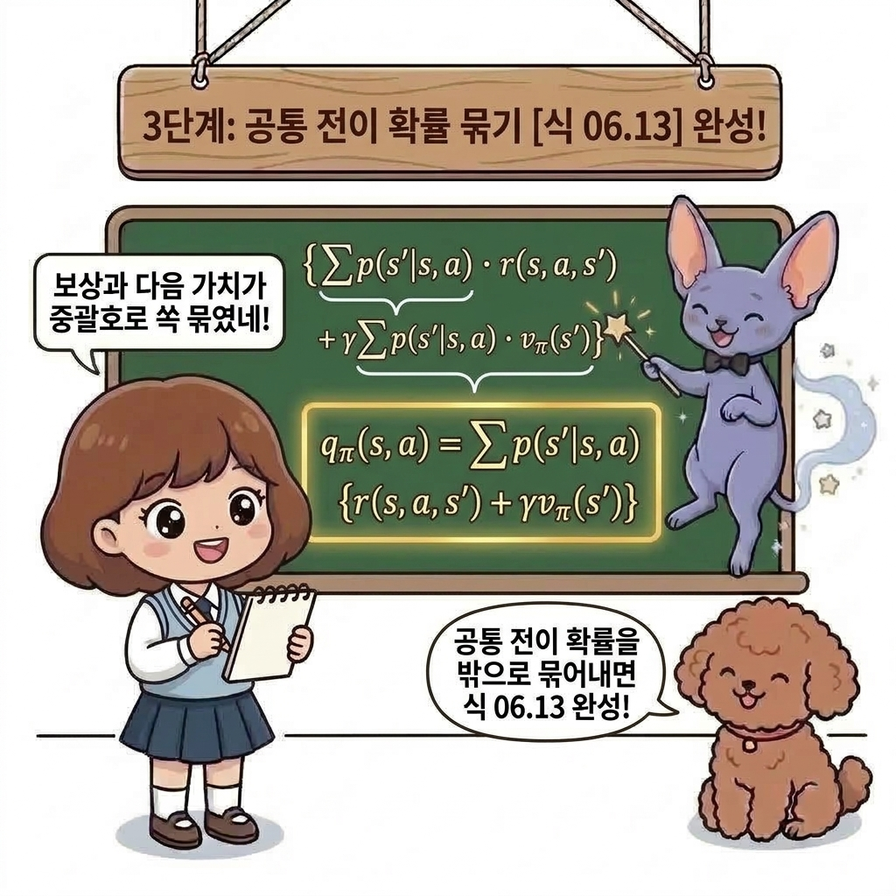

즉, [식 06.13]은 **"내가 고른 행동 *a*를 실행했을 때의 Q-값은, 그로 인해 도착할 수 있는 모든 다음 상태 *s'*에 대해 [지금 받는 즉시 보상 + 다음 상태의 할인된 가치 *v**π*(*s'*)]를 전이 확률에 따라 가중평균한 것"**이라는 매우 직관적인 물리적 의미를 담고 있습니다.

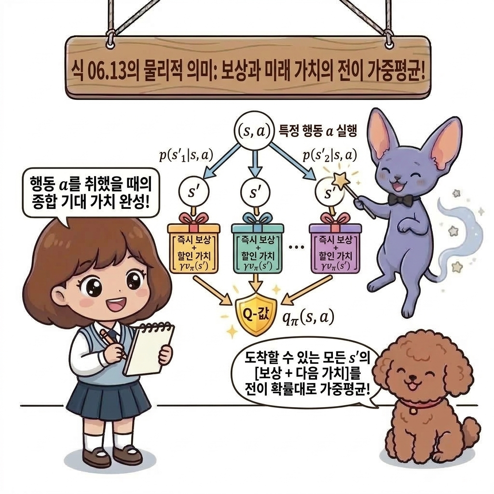

---

또한 [식 06.11]을 이용하면 상태 가치 함수 *v**π*(*s'*)는 Q 함수를 사용하여 다음처럼 쓸 수 있습니다.
$$
q_{\pi}(s, a) = \sum_{s'} p(s' \mid s, a) \left\{ r(s, a, s') + \gamma \sum_{a'} \pi(a' \mid s') q_{\pi}(s', a') \right\}
$$

[식 06.14]

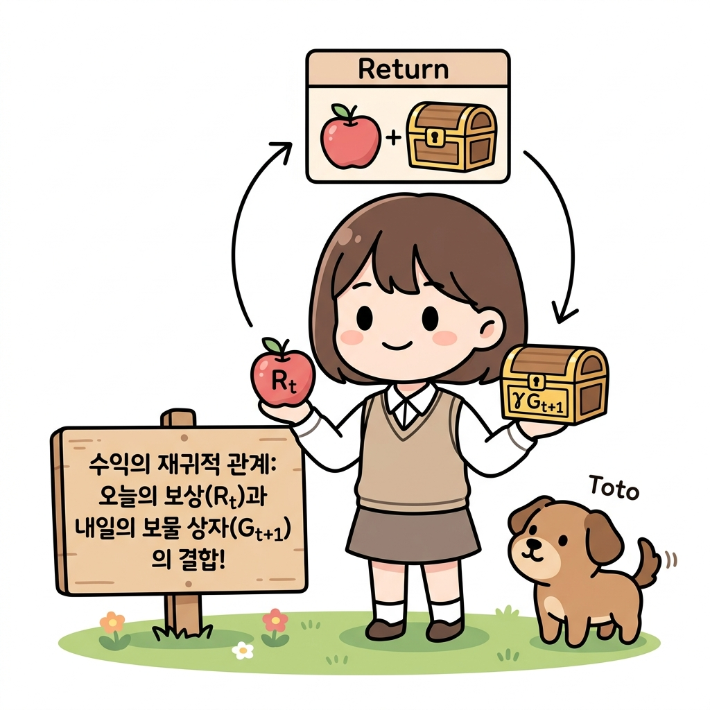

[식 06.14]의 *a'*는 시간 *t*+1에서의 행동입니다. 

이 [식 06.14]가 바로 행동 가치 함수(Q 함수)를 이용한 벨만 방정식입니다.

---

### 06.4.4 백업 다이어그램: Q 함수 벨만 방정식의 재귀적 흐름

행동 가치 함수(Q 함수)의 벨만 방정식인 [식 06.14]를 백업 다이어그램(Backup Diagram)으로 시각화하면, 수식에 담긴 기호들이 실제로 어떤 순서로 상호작용하고 가치를 거슬러 올려보내는지 한눈에 파악할 수 있습니다.

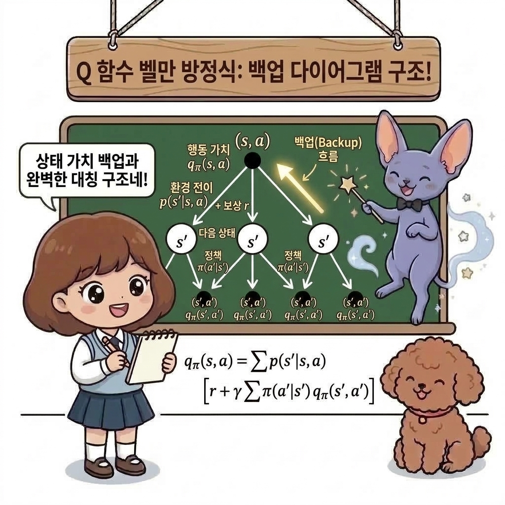

---

위 다이어그램에서 정보가 위아래로 흐르는 과정은 다음과 같습니다.

1.  **출발점: 최상단 행동 노드 (*s*, *a*) (검은 점)**  
    우리가 지금 평가하고자 하는 기준점으로, 상태 *s*에서 임의로 특정 행동 *a*를 딱 선택한 순간의 가치인 *q**π*(*s*, *a*)를 나타냅니다.
2.  **1단계 분기: 환경 전이 확률과 즉시 보상 (*p*(*s'* | *s*, *a*) + *r*)**  
    에이전트가 행동 *a*를 실행했으므로 이제 공은 환경에게 넘어갑니다. 환경의 물리 법칙과 규칙(상태 전이 확률 *p*(*s'* | *s*, *a*))에 따라 다음 상태 *s'*(흰색 원)들로 갈라지며, 이때 이동에 따른 즉시 보상 *r*(*s*, *a*, *s'*)을 받습니다.
3.  **2단계 분기: 정책에 따른 다음 행동 선택 (*π*(*a'* | *s'*))**  
    다음 상태 *s'*에 도착한 이후부터 에이전트는 평소 습관(정책 *π*)을 따릅니다. 정책의 확률 분포 *π*(*a'* | *s'*)에 따라 다음 행동들(*a'*)로 나뭇가지처럼 분기되며, 맨 아래 리프 노드에 도달하게 됩니다. 이 말단 노드가 바로 다음 시점의 행동 가치인 *q**π*(*s'*, *a'*)(검은 점)입니다.
4.  **아래에서 위로 거슬러 올라오는 백업(Backup) 계산**  
    *   **안쪽 가중합(정책)**: 맨 아래의 다음 행동 가치 *q**π*(*s'*, *a'*)들을 정책 확률 *π*(*a'* | *s'*)로 곱해 더하면, 다음 상태의 가치 *v**π*(*s'*) = ∑ *π*(*a'* | *s'*) *q**π*(*s'*, *a'*)가 복원됩니다.
    *   **바깥쪽 가중합(환경)**: 여기에 할인율 *γ*를 곱하고 즉시 보상 *r*을 더한 뒤, 환경 전이 확률 *p*(*s'* | *s*, *a*)로 한 번 더 곱해 더해주면 최종적으로 최상단의 행동 가치 *q**π*(*s*, *a*)가 완성됩니다.

**상태 가치 백업 다이어그램과의 완벽한 대칭성**  

*   **상태 가치 함수 *v**π*(*s*)의 백업 다이어그램**:  
    상태 노드(○) → [정책 *π*] → 행동 노드(●) → [환경 *p*] → 다음 상태 노드(○)
*   **행동 가치 함수 *q**π*(*s*, *a*)의 백업 다이어그램**:  
    행동 노드(●) → [환경 *p*] → 상태 노드(○) → [정책 *π*] → 다음 행동 노드(●)

이처럼 Q 함수의 백업 다이어그램은 상태 가치의 백업 다이어그램과 시작 노드의 종류(검은 점 vs 흰 원)와 전이 순서가 서로 반대로 맞물리는 아름다운 대칭을 이루고 있습니다.

---

### 06.4.5 학습 정리

1. **상태 가치 *v**π*(*s*)와 행동 가치 *q**π*(*s*, *a*)의 본질적 차이**:
   상태 가치 *v**π*(*s*)는 상태 *s*에 진입하자마자 첫 행동부터 평소 정책 *π*의 확률 분포대로 움직였을 때의 '종합 평균 점수'입니다. 반면 행동 가치(Q 함수) *q**π*(*s*, *a*)는 **첫 번째 행동만큼은 현재 정책과 무관하게 학습자가 원하는 임의의 특정 행동 *a*를 강제로 실행**해보고, 그 다음 두 번째 단계부터 정책 *π*를 따랐을 때의 기대 수익을 평가하는 '행동별 세부 성적표'입니다.

2. **Q 함수가 정책 개선(Policy Improvement)의 나침반이 되는 이유**:
   종합 평균 점수(*v**π*(*s*))만 알아서는 어떤 행동을 늘리고 줄여야 할지 알 수 없습니다. 하지만 각 행동 후보에 대한 Q-값(예: 공부하기 60점, 매점가기 90점, 게임하기 75점)을 구비해 두면, 가치가 가장 높은 90점짜리 행동의 선택 확률을 높이도록 내 정책을 더 나은 방향으로 업그레이드(정책 개선)할 수 있습니다.

3. **상태 가치와 Q 함수의 확률 가중합 관계 [식 06.11]**:
   상태 가치 *v**π*(*s*)는 완전히 새로운 물리량이 아니라, 상태 *s*에서 가능한 모든 행동 가치 *q**π*(*s*, *a*)들을 현재 정책의 행동 선택 확률 *π*(*a* | *s*)로 곱해 전부 합산한 가중 평균(가중합)입니다.
   $$v_{\pi}(s) = \sum_a \pi(a \mid s) q_{\pi}(s, a)$$

4. **행동 가치 함수(Q 함수)의 벨만 방정식 [식 06.14]**:
   수익 *G**t*를 즉시 보상 *R**t*과 미래 수익 할인합 *γG**t*+1로 재귀 분해하고, 환경 전이 확률 *p*(*s'* | *s*, *a*)과 다음 상태 가치 *v**π*(*s'*)를 결합한 뒤, 다시 *v**π*(*s'*)를 다음 시점의 Q 함수 가중합으로 치환함으로써 현재의 Q-값과 다음 시점의 Q-값들이 맞물리는 벨만 방정식이 완성됩니다.
   $$q_{\pi}(s, a) = \sum_{s'} p(s' \mid s, a) \left\{ r(s, a, s') + \gamma \sum_{a'} \pi(a' \mid s') q_{\pi}(s', a') \right\}$$

5. **백업 다이어그램의 순환 구조와 대칭성**:
   Q 함수의 백업 다이어그램은 상단의 행동 노드 (●)에서 출발하여 환경 전이 확률 *p*를 통해 다음 상태 노드 (○)들로 가고, 다시 에이전트의 정책 *π*에 의해 아래의 다음 행동 노드 (●)들로 나뭇가지처럼 갈라집니다. 맨 아래의 다음 Q-값들이 위로 거슬러 올라와(Backup) 현재의 Q-값을 계산하며, 이는 상태 가치 함수의 백업 다이어그램(`상태 ○ → 정책 π → 행동 ● → 환경 p → 다음 상태 ○`)과 시작 노드 및 전이 순서가 완벽한 대칭을 이룹니다.
