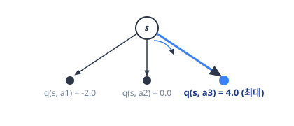
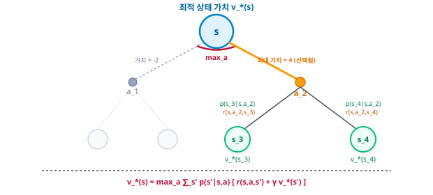

# 06.5 벨만 최적 방정식

**그림 06-5** 여러 점수의 카드를 "MAX" 마법 깔때기에 통과시켜 가장 우수한 최댓값 점수 카드만을 추출하는 도로시와 지니

수많은 정책 중 가장 영리하게 작동하는 최적 정책($\pi^*$) 하에서 가치 함수가 만족하는 특별한 공식인 **벨만 최적 방정식(Bellman Optimality Equation)**을 공부합니다. 기댓값 기호 대신 최선의 행동 하나만을 쏙 골라내는 **최댓값(max)** 깔때기 비유를 통해 최적 수식의 매혹적인 정의를 쉽게 이해해 봅시다!

---

벨만 방정식은 어떤 정책 *π*에 대해 성립하는 방정식입니다. 하지만 우리가 궁극적으로 찾으려는 것은 최적 정책입니다. 

최적 정책이란 모든 상태에서 상태 가치 함수가 최대인 정책입니다. 

물론 최적 정책도 벨만 방정식을 만족합니다. 게다가 정책이 '최적이다'라는 성질을 이용하면 벨만 방정식을 더 간단하게 표현할 수 있습니다. 

이번 절에서는 최적 정책에 대해 성립하는 방정식, 즉 벨만 최적 방정식bellman optimality equation에 대해 알아보겠습니다.

---

### 06.5.1 상태 가치 함수의 벨만 최적 방정식

먼저 벨만 방정식부터 시작하겠습니다. 

앞서 다음과 같은 식을 확인했습니다.
$$
\begin{aligned}
v_{\pi}(s) &= \sum_{a, s'} \pi(a \mid s) p(s' \mid s, a) \{ r(s, a, s') + \gamma v_{\pi}(s') \} \\
&= \sum_a \pi(a \mid s) \sum_{s'} p(s' \mid s, a) \{ r(s, a, s') + \gamma v_{\pi}(s') \}
\end{aligned}
$$

[식 06.7]

이번에도 식 전개를 감안하여 *∑**a, s'*를 *∑**a*와 *∑**s'*로 분리했습니다. 벨만 방정식은 어떠한 정책에서도 성립합니다. 

따라서 최적 정책을 *π*&#42;(*a* | *s*)라고 하면 다음과 같은 벨만 방정식이 성립합니다.
$$
v_*(s) = \sum_a \pi_*(a \mid s) \sum_{s'} p(s' \mid s, a) \{ r(s, a, s') + \gamma v_*(s') \}
$$

[식 06.15]

이 식에서 최적 정책의 가치 함수는 *v*&#42;(*s*)입니다. 

> 수학이나 강화 학습에서 별표(`*`)는 **'최적(Optimal)'**을 뜻하는 약속입니다. 세상에는 무수히 많은 정책(행동 습관) *π*1, *π*2, *π*3 등이 존재하고, 각 정책을 따랐을 때 얻는 가치도 제각각 다를 것입니다. 이 무수한 별들 중에서 **모든 상태에서 가장 큰 가치(최댓값)를 얻어내는 가장 밝고 이상적인 타겟**을 가리키기 위해 관례적으로 별표(`*`)를 붙여서 **\*π\*\*(최적 정책)**와 **\*v\*\*(최적 상태 가치 함수)**로 표기합니다. 이는 밤하늘의 무수한 별들 중 길을 찾아주는 가장 밝은 북극성과 같습니다.
>
> 

#### 최적의 행동

이제 우리가 고민하고 싶은 문제는 최적 정책 *π*&#42;(*a* | *s*)에 의해 선택되는 행동 *a*입니다. 

최적 정책 *π*&#42;(*a* | *s*)는 어떤 행동을 선택할까요? 

[그림 06-12]의 예를 보며 생각해보죠.

그림 06-12 세 가지 행동 중 어떤 행동을 선택할까?

그림에서는 세 개의 행동 후보 {*a*1, *a*2, *a*3}이 있고 *∑**s'* *p*(*s'* | *s*, *a*) { *r*(*s*, *a*, *s'*) + *γ v*\*(*s'*) }의 값이 각각 -2, 0, 4라고 가정합니다. 

#### 이때 어떤 확률 분포로 행동을 선택해야 할까요?

물론 최적 정책이기 때문에 값이 최대인 행동 *a*3을 100% 확률로 선택해야 합니다. 

결정적 정책인 셈이죠. 

따라서 확률적 정책 *π*&#42;(*a* | *s*)는 결정적 정책 *μ*&#42;(*s*)로 나타낼 수 있습니다. 

그리고 항상 *a*3을 선택하기 때문에 *v*&#42;(*s*)의 값은 4가 됩니다.

이 예에서 최적 정책은 *∑**s'* *p*(*s'* | *s*, *a*) { *r*(*s*, *a*, *s'*) + *γ v*\*(*s'*) }의 값이 가장 큰 행동을 선택하고 그 최댓값이 그대로 *v*&#42;(*s*)가 됨을 알 수 있습니다.

수식으로 표현하면 다음과 같습니다.
$$
v_*(s) = \max_a \sum_{s'} p(s' \mid s, a) \{ r(s, a, s') + \gamma v_*(s') \}
$$

[식 06.16]

이 식과 같이 최댓값은 `max` 연산자를 사용하여 표현할 수 있습니다. 

그리고 [식 06.16]이 바로 벨만 최적 방정식입니다.

> NOTE_ `max`는 값이 가장 큰 원소를 하나 선택하는 연산자입니다. 예를 들어 원소가 4개인 집합 *x* = {1, 2, 3, 4}가 있다고 해보죠. 이 집합에 대해 함수 *g*(*x*) = *x*2의 최댓값을 구하는 식은 다음과 같이 작성합니다.
> 
> $$
> \max_x g(x) = 16
> $$
> 
> 함수 *g*(*x*)는 *x* = 4일 때 *g*(*x*) = *x*2 = 16이 되어 값이 가장 큽니다. 이 계산을 `max` 연산자를 이용하여 이와 같이 나타낼 수 있습니다.

---

### 06.5.2 행동 가치 함수의 벨만 최적 방정식

행동 가치 함수(Q 함수)에 대해서도 마찬가지로 벨만 최적 방정식을 구할 수 있습니다. 

지금까지와 같은 흐름으로 Q 함수의 벨만 최적 방정식도 구해보겠습니다.

> NOTE_ 최적 정책에서의 행동 가치 함수를 **최적 행동 가치 함수**라고 합니다. 이 책에서는 최적 행동 가치 함수를 *q*&#42;로 표기합니다.

먼저 Q 함수의 벨만 방정식을 봅시다.
$$
q_{\pi}(s, a) = \sum_{s'} p(s' \mid s, a) \left\{ r(s, a, s') + \gamma \sum_{a'} \pi(a' \mid s') q_{\pi}(s', a') \right\}
$$

이 벨만 방정식은 모든 정책 *π*에 성립합니다. 

물론 최적 정책 *π*&#42;에도 성립하므로 최적 정책 *π*&#42;를 대입할 수 있습니다.
$$
q_*(s, a) = \sum_{s'} p(s' \mid s, a) \left\{ r(s, a, s') + \gamma \sum_{a'} \pi_*(a' \mid s') q_*(s', a') \right\}
$$

[식 06.17]

다음 전개는 4.06.2절에서 설명한 것과 같습니다. 

여기서 *π*&#42;는 최적 정책이므로 `max` 연산자로 단순화할 수 있습니다. 

즉 *∑**a'* *π*\*(*a'* | *s'*) ... 부분을 *max**a'* ... 로 바꿀 수 있습니다. 따라서 다음 식이 성립합니다.
$$
q_*(s, a) = \sum_{s'} p(s' \mid s, a) \{ r(s, a, s') + \gamma \max_{a'} q_*(s', a') \}
$$

[식 06.18]

[식 06.18]이 바로 Q 함수에 대한 벨만 최적 방정식입니다.

> NOTE_ MDP에서는 결정적 최적 정책이 하나 이상 존재합니다. 결정적 정책이란 특정 상태에서는 반드시 특정 행동을 선택하는 정책입니다. 따라서 최적 정책은 *μ*&#42;(*s*)와 같이 함수로 나타낼 수 있습니다. 또한 문제에 따라 최적 정책이 여러 개일 수도 있지만, 그 가치 함수들의 값은 모두 같습니다(모두가 최적이므로). 따라서 최적 정책의 가치 함수는 *v*&#42;(*s*)라는 하나의 기호로 나타낼 수 있습니다. 마찬가지로 최적 정책의 Q 함수도 *q*&#42;(*s*, *a*)로 하나만 존재합니다.

#### 백업 다이어그램

벨만 최적 방정식인 [식 06.16]을 백업 다이어그램 형태로 각 수식의 항과 매칭하여 시각화하면 다음과 같습니다.

그림 06-12a 상태 가치 함수의 벨만 최적 방정식 백업 다이어그램 구조

위 [그림 06-12a]에서 보듯, 벨만 최적 방정식은 모든 행동들에 대한 가치의 가중 기대 평균을 구하는 대신, 다음 단계에서 얻을 수 있는 가치합이 가장 높은 행동 *a*2만을 선택하는 ***max**a* 비선형 연산자**의 작동 원리(빨간색 max_a 아크 및 굵은 노란색 행동 활성화 연결선)를 명확하게 묘사하고 있습니다.
