# 06.5 벨만 최적 방정식

수많은 정책 중 가장 영리하게 작동하는 최적 정책(<i>&pi;</i>&ast;) 하에서 가치 함수가 만족하는 특별한 공식인 **벨만 최적 방정식(Bellman Optimality Equation)**을 공부합니다. 

**기댓값** 기호 대신 최선의 행동 하나만을 쏙 골라내는 **최댓값(max)** 깔때기 비유를 통해 최적 수식의 매혹적인 정의를 쉽게 이해해 봅시다!

**그림 06-5** 여러 점수 카드(60, 92, 75)를 "MAX" 마법 깔때기에 통과시켜 가장 우수한 최댓값 점수 카드(92)만을 추출하는 도로시와 지니, 토토

---

#### 최적정책이란?

벨만 방정식은 어떤 정책 *π*에 대해 성립하는 방정식입니다. 

하지만 우리가 궁극적으로 찾으려는 것은 최적 정책입니다. 

최적 정책이란 모든 상태에서 **상태 가치 함수**가 최대인 정책입니다. 

물론 최적 정책도 벨만 방정식을 만족합니다. 

게다가 정책이 '최적이다'라는 성질을 이용하면 벨만 방정식을 더 간단하게 표현할 수 있습니다. 

---

### 06.5.1 상태 가치 함수의 벨만 최적 방정식

최적 정책에 대해 성립하는 방정식, 즉 벨만 최적 방정식bellman optimality equation에 대해 알아보겠습니다.

**그림 06-5a** 이미 잘 알고 있는 '벨만 방정식'에 가장 우수한 가치를 찾는 '최적(Optimal)' 개념이 더해져 '벨만 최적 방정식'이 탄생하는 직관적 결합 원리

---

#### 먼저 벨만 방정식부터 시작하겠습니다. 

앞서 06.2절에서 유도했던 **상태 가치 함수의 벨만 기대 방정식([식 06.7])**을 다시 떠올려 보겠습니다.

$$
\begin{aligned}
v_{\pi}(s) &= \sum_{a, s'} \pi(a \mid s) p(s' \mid s, a) \{ r(s, a, s') + \gamma v_{\pi}(s') \} \\
&= \sum_a \pi(a \mid s) \sum_{s'} p(s' \mid s, a) \{ r(s, a, s') + \gamma v_{\pi}(s') \}
\end{aligned}
$$

[식 06.7]

수식을 보면 하나의 덩어리로 묶여 있던 시그마 기호 *∑**a, s'*를 바깥쪽의 *∑**a*와 안쪽의 *∑**s'*로 명확하게 분리했습니다. 

![벨만 기대 방정식 [식 06.7] 복습과 시그마 분리](./img/bellman_equation_06_7_review.png)

---

#### 이렇게 분리하는 데는 매우 중요한 직관적 이유가 있습니다.

1. **바깥쪽 시그마 (*∑**a* *π*(*a* | *s*)) — 에이전트의 주도 영역**:  
   상태 *s*에서 어떤 행동 *a*를 고를지는 전적으로 에이전트의 생각과 판단(정책 *π*)에 달려 있습니다.
2. **안쪽 시그마 (*∑**s'* *p*(*s'* | *s*, *a*) { ... }) — 환경의 반응 영역**:  
   에이전트가 행동 *a*를 일단 저지르고 나면, 그다음 어떤 다음 상태 *s'*로 이동하고 어떤 즉시 보상 *r*을 받게 될지는 환경의 물리 법칙과 규칙(전이 확률 *p*)에 의해 결정됩니다. 즉, 이 안쪽 부분이 바로 '행동 *a*를 취했을 때의 가치인 Q 함수 *q**π*(*s*, *a*)'입니다.

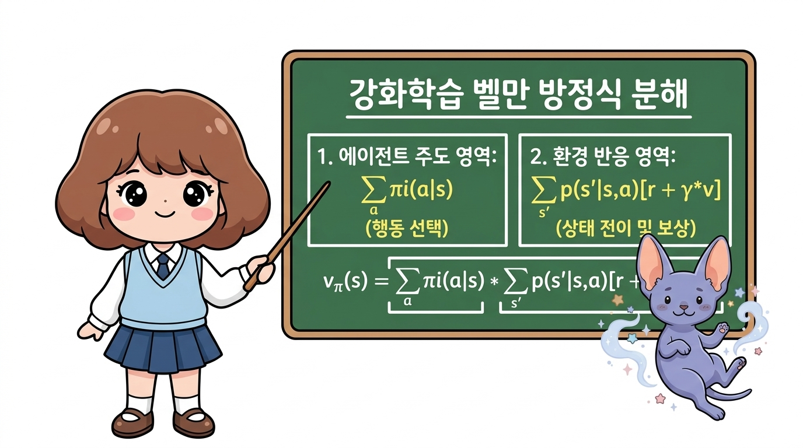

**그림 06-6** [식 06.7]의 2단계 분리 구조: 바깥쪽 시그마(에이전트의 행동 선택 *π*)와 안쪽 시그마(환경의 전이 확률 *p* 및 보상)의 역할 구분

이처럼 에이전트가 통제하는 '행동 선택'과 환경이 통제하는 '상태 전이'를 둘로 깔끔하게 갈라놓아야, 뒤에서 에이전트의 정책을 **가장 똑똑한 최고의 행동 하나만 100% 쏙 골라내는 최댓값(*max**a*) 형태**로 손쉽게 최적화할 수 있습니다.

---

#### 벨만 방정식은 어떠한 정책에서도 성립합니다. 

벨만 방정식의 가장 강력한 특징 중 하나는 **'보편성'**입니다. 

에이전트가 엉뚱하고 미숙한 정책을 따르든, 동전을 던져 무작위로 움직이는 정책을 따르든, 아니면 세상에서 가장 영리하게 행동하는 정책을 따르든 상관없이, 벨만 방정식은 **세상에 존재하는 그 어떤 정책 <i>&pi;</i>에 대해서도 예외 없이 100% 성립**합니다.

따라서 세상의 무수한 정책 중 가장 이상적이고 뛰어난 **최적 정책** <i>&pi;</i>&ast;(<i>a</i> | <i>s</i>) 역시 벨만 방정식을 당연히 완벽하게 만족합니다!

**그림 06-6a** 엉뚱한 초보 정책, 주사위를 굴리는 무작위 정책, 최고의 최적 정책(<i>&pi;</i>&ast;) 등 그 어떤 정책 카드를 제시해도 100% 완벽하게 성립하는 벨만 방정식의 놀라운 보편성

---

그러므로 일반 벨만 방정식([식 06.7])의 정책 자리 <i>&pi;</i>에 최적 정책 <i>&pi;</i>&ast;를 그대로 대입하면 다음과 같은 식이 성립합니다.

$$
v_*(s) = \sum_a \pi_*(a \mid s) \sum_{s'} p(s' \mid s, a) \{ r(s, a, s') + \gamma v_*(s') \}
$$

[식 06.15]

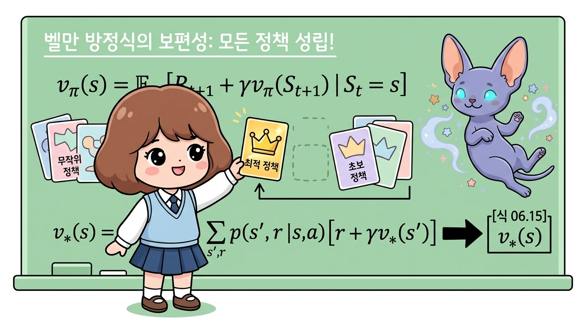

**그림 06-7** 세상의 모든 정책에 통하는 벨만 방정식의 보편성과 최적 정책(<i>&pi;</i>&ast;) 대입 원리

---

#### 최적 정책 <i>&pi;</i>&ast;로 지정

이 식에서 정책을 최적 정책 <i>&pi;</i>&ast;로 지정했으므로, 좌변의 현재 상태 가치와 우변의 다음 상태 가치 역시 저절로 최적 상태 가치 함수인 <strong><i>v</i>&ast;(<i>s</i>)</strong>와 <strong><i>v</i>&ast;(<i>s'</i>)</strong>로 바뀝니다.

[식 06.15]는 최적 정책 하에서의 가치를 다루고 있지만, 아직 겉모습은 일반 벨만 방정식처럼 여러 행동들을 확률적으로 더하는 시그마(<i>&sum;</i><i>a</i> <i>&pi;</i>&ast;) 형태를 유지하고 있습니다. 

이 식은 곧바로 살펴볼 진정한 **벨만 최적 방정식([식 06.16])**으로 건너가기 위한 결정적인 **징검다리** 역할을 합니다.

![벨만 최적 방정식으로 건너가는 징검다리 가교 [식 06.15]](./img/bellman_optimal_stepping_stone.png)

**그림 06-8** 벨만 기대 방정식([식 06.7])에서 최적 정책 대입([식 06.15])을 거쳐 벨만 최적 방정식([식 06.16], max_a)으로 건너가는 징검다리 가교 원리

----

#### 수학이나 강화 학습에서 별표(`*`)는 **'최적(Optimal)'**을 뜻하는 약속입니다. 

세상에는 무수히 많은 정책(행동 습관) *π*1, *π*2, *π*3 등이 존재하고, 각 정책을 따랐을 때 얻는 가치도 제각각 다를 것입니다. 

이 무수한 별들 중에서 **모든 상태에서 가장 큰 가치(최댓값)를 얻어내는 가장 밝고 이상적인 타겟**을 가리키기 위해 관례적으로 별표(`*`)를 붙여서 <strong><i>&pi;</i>&ast;(최적 정책)</strong>와 <strong><i>v</i>&ast;(최적 상태 가치 함수)</strong>로 표기합니다. 이는 밤하늘의 무수한 별들 중 길을 찾아주는 가장 밝은 북극성과 같습니다.

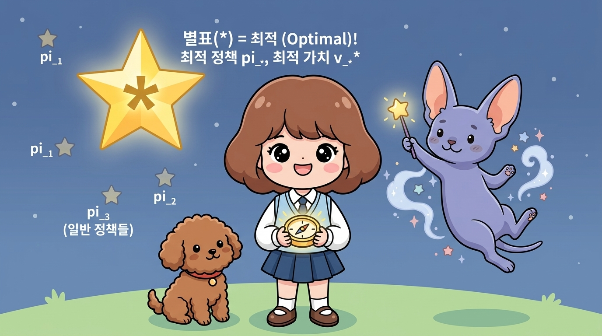

**그림 06-9** 무수한 일반 정책들(<i>&pi;</i>1, <i>&pi;</i>2, <i>&pi;</i>3) 중에서 가장 밝게 빛나는 북극성처럼 최적의 가치를 안내하는 별표(`*`) 기호의 수학적 의미

---

#### 최적의 행동: 가장 높은 점수를 주는 행동을 골라내기

이제 우리가 마주한 핵심 질문은 아주 명확합니다.

> **"과연 최적 정책 <i>&pi;</i>&ast;(<i>a</i> | <i>s</i>)는 현재 상태 <i>s</i>에서 어떤 행동 <i>a</i>를 선택해야 할까요?"**

**그림 06-9a** 현재 상태 <i>s</i>에서 어떤 행동 <i>a</i>를 골라야 할지 고민하는 도로시에게, "가장 높은 점수를 주는 행동이 바로 최적 행동"임을 알려주는 지니와 토토

---

앞서 [식 06.15]의 **우변**에 등장한 수식 덩어리를 다시 살펴보겠습니다:
$$
\sum_{s'} p(s' \mid s, a) \{ r(s, a, s') + \gamma v_*(s') \}
$$

이 수식은 기호가 길어서 복잡해 보이지만, 그 본질은 매우 단순합니다. 

바로 **"현재 상태 <i>s</i>에서 특정 행동 <i>a</i>를 딱 실행했을 때, 뒤따라올 '즉시 보상'과 '다음 상태에서의 미래 최적 가치 할인합'을 환경 전이 확률에 따라 가중평균한 기대 성적표(즉, 최적 행동 가치 <i>q</i>&ast;(<i>s</i>, <i>a</i>))"**를 뜻합니다.

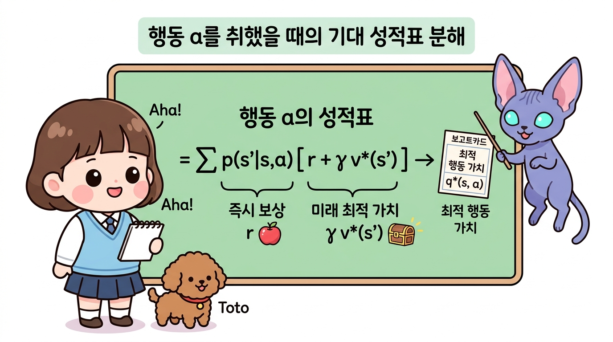

**그림 06-9b** 행동 *a*를 취했을 때 뒤따라올 [즉시 보상 *r*]과 [미래 최적 가치 &gamma;*v*&ast;(<i>s'</i>)]의 기대 가치 합을 직관적으로 분해하여 설명하는 지니와 도로시

---

이제 상태 <i>s</i>에 서 있는 에이전트(도로시) 앞에 세 가지 갈림길(행동 후보 {*a*1, *a*2, *a*3})이 놓여 있고, 각 행동을 실행했을 때의 기대 성적표가 다음과 같다고 가정해 보겠습니다.

*   **행동 *a*1 선택 시 기대 가치**: `-2.0점` (가시덤불에 걸려 감점을 받는 손해의 길)
*   **행동 *a*2 선택 시 기대 가치**: `0.0점` (이득도 손해도 없는 평범한 본전의 길)
*   **행동 *a*3 선택 시 기대 가치**: `+4.0점` (가장 달콤하고 풍성한 보물을 얻는 대박의 길!)

**그림 06-10** 상태 *s*에서 마주한 세 가지 행동 후보 {*a*1, *a*2, *a*3}의 기대 점수 비교와 에이전트의 선택 고민

---

#### 백업 다이어그램

아래 [그림 06-12]의 백업 다이어그램을 통해서도 이 세 갈래 행동의 기대 점수 구조를 명확하게 확인할 수 있습니다.

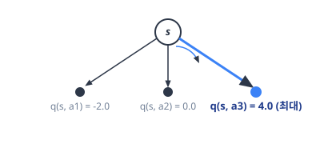

**그림 06-12** 세 가지 행동 후보 노드와 각각의 기대 가치(-2.0, 0.0, 4.0) 분기 구조

---

#### 1단계: 최선의 행동에 100% 몰빵! 확률 정책에서 결정적 정책으로의 변신

앞서 살펴본 것처럼 세 가지 행동 {*a*1, *a*2, *a*3}의 기대 점수가 각각 `-2.0점`, `0.0점`, `+4.0점`으로 매겨져 있다면, 최적 정책 <i>&pi;</i>&ast;는 어떤 **확률 분포**로 행동을 선택해야 할까요?

*   상식적으로 에이전트의 목표는 미래 수익을 **최대화**하는 것입니다.
*   그렇다면 손해를 보는 *a*1(-2점)이나 본전인 *a*2(0점)에 조금이라도 확률을 낭비할 이유가 전혀 없습니다!
*   따라서 가장 큰 보상을 안겨주는 최고의 행동 **a3(+4.0점)**에 **100%(확률 1.0)를 전부 집중**하고, 나머지 행동에는 0%를 배정하는 것이 가장 합리적입니다.

$$
\pi_*(a_1 \mid s) = 0, \quad \pi_*(a_2 \mid s) = 0, \quad \pi_*(a_3 \mid s) = 1.0
$$

이처럼 확률적 정책 <i>&pi;</i>&ast;(<i>a</i> | <i>s</i>)는 **특정 상태 <i>s</i>에서 단 하나의 행동만을 100% 실행**하는 **결정적 정책(Deterministic Policy, <i>&mu;</i>&ast;(<i>s</i>) = *a*3)**으로 자연스럽게 귀결됩니다.

그 결과 상태 <i>s</i>의 최적 가치 <i>v</i>&ast;(<i>s</i>)는 복잡한 확률 계산 없이, 선택된 행동 *a*3의 점수인 **4.0**이 그대로 됩니다.

$$
v_*(s) = (0 \times -2) + (0 \times 0) + (1.0 \times 4) = 4.0
$$

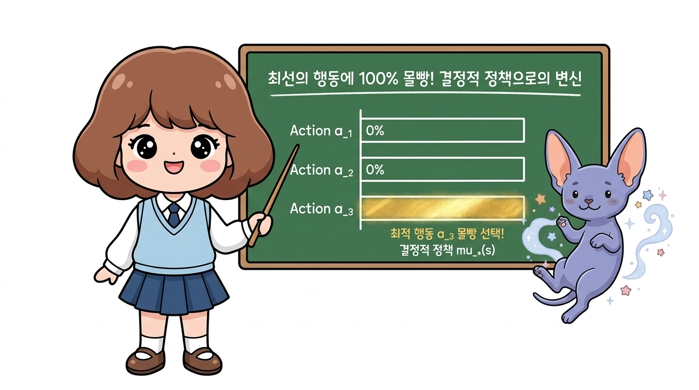

**그림 06-11** 세 가지 행동 후보 중 최선인 *a*3에만 확률 100%를 집중하여 **결정적 정책 <i>&mu;</i>&ast;(<i>s</i>)**이 되고 상태 가치가 4.0으로 확정되는 원리

---

#### 2단계: 시그마(∑) 가중평균에서 최댓값(max)으로! [식 06.16] 벨만 최적 방정식의 완성

이제 특정 숫자(-2, 0, 4)를 넘어 **일반적인 모든 상태와 행동에 대해 공식화**해 보겠습니다.

앞서 확인했듯이, 최적 정책은 여러 행동들의 가치를 확률대로 섞어 더하는 가중평균(<i>&sum;</i><i>a</i> <i>&pi;</i>&ast;)을 계산할 필요가 없습니다. 

그저 **가능한 모든 행동 후보들 중 기대 가치가 가장 큰 것 하나만 최댓값(`max`)으로 쏙 골라내면 그만**입니다!

**그림 06-11a** 여러 행동의 가치를 확률로 곱해 섞던 시그마(<i>&sum;</i>) 가중평균에서, 가장 높은 1등 가치만을 쏙 뽑아내는 *max**a* 연산자로 변신하는 원리

---

따라서 [식 06.15]의 바깥쪽 시그마 가중합 <i>&sum;</i><i>a</i> <i>&pi;</i>&ast;(<i>a</i> | <i>s</i>) 부분이 단 하나의 수학 연산자인 <strong><i>max</i><i>a</i>(최댓값 연산자)</strong>로 깔끔하게 치환됩니다.

$$
v_*(s) = \max_a \sum_{s'} p(s' \mid s, a) \left\{ r(s, a, s') + \gamma v_*(s') \right\}
$$

[식 06.16]

이 [식 06.16]이 바로 강화학습 이론의 최고 핵심 공식 중 하나인 **상태 가치 함수의 벨만 최적 방정식(Bellman Optimality Equation for State-Value Function)**입니다!

![벨만 최적 방정식의 완성 [식 06.16]](./img/optimality_bellman_equation_v.png)

**그림 06-12a** 바깥쪽의 시그마 확률 가중합이 가장 큰 가치를 하나만 쏙 골라내는 *max**a* 연산자로 대체되어 벨만 최적 방정식이 완성되는 원리

> **벨만 최적 방정식([식 06.16])의 놀라운 특징**:  
> 수식을 가만히 살펴보면 **정책 기호(<i>&pi;</i>)가 완전히 자취를 감추었습니다!**  
> 일반 벨만 방정식에서는 에이전트의 현재 정책 <i>&pi;</i>가 어떻게 정의되어 있는지 알아야 가치를 구할 수 있었지만, 벨만 최적 방정식은 환경의 전이 규칙(*p, r*)과 미래의 최적 가치(<i>v</i>&ast;)만으로 현재 상태의 최적 가치(<i>v</i>&ast;(<i>s</i>))가 완벽하게 결정됩니다.

---

#### 3단계: 'max' 연산자의 직관적 의미와 작동 원리 (마법 깔때기 비유)

수식에 새롭게 등장한 **`max` (최댓값 연산자)**는 컴퓨터 프로그래밍과 수학에서 가장 널리 쓰이는 연산자 중 하나로, **"주어진 여러 후보들 중 가장 큰 값을 하나만 쏙 뽑아낸다"**는 직관적인 의미를 갖습니다.

마치 여러 크기의 구슬이나 카드들을 **'MAX' 마법 깔때기(Funnel)**에 한꺼번에 쏟아부었을 때, 오직 1등 점수 카드 하나만을 아래로 통과시켜 주는 원리와 같습니다.

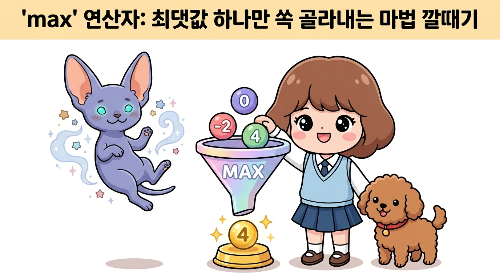

**그림 06-13** 여러 점수의 후보 카드(-2, 0, 4)를 'MAX' 깔때기에 통과시켜 오직 최댓값 4만을 추출하는 직관적 비유

> NOTE_ `max`는 집합이나 함수에서 값이 가장 큰 원소를 선택하는 연산자입니다.  
> 예를 들어 원소가 4개인 집합 *x* = {1, 2, 3, 4}가 있고, 각 원소의 제곱을 계산하는 함수 *g*(*x*) = *x*2이 있다고 해보겠습니다.  
> * *g*(1) = 1, *g*(2) = 4, *g*(3) = 9, *g*(4) = 16  
> 이 중 가장 큰 값(최댓값)을 구하는 수식은 `max` 기호를 사용하여 다음과 같이 표기합니다.
> 
> $$
> \max_x g(x) = 16
> $$
> 
> 이와 마찬가지로 벨만 최적 방정식의 *max**a* 역시 상태 *s*에서 선택할 수 있는 모든 행동 *a*에 대해 뒤따라올 점수를 각각 계산한 뒤, 그중 가장 큰 점수를 쏙 뽑아내어 현재 상태의 최적 가치 <i>v</i>&ast;(<i>s</i>)로 삼는 연산입니다.

---

### 06.5.2 행동 가치 함수의 벨만 최적 방정식

상태 가치 함수(V 함수)와 마찬가지로, **행동 가치 함수(Q 함수)**에 대해서도 동일한 논리로 벨만 최적 방정식을 유도할 수 있습니다. 

**그림 06-13a** 이미 정복한 상태 가치 함수(<i>v</i>&ast;)의 벨만 최적 방정식 원리를 바탕으로, 새로운 목표인 행동 가치 함수(<i>q</i>&ast;)의 벨만 최적 방정식 유도에 나서는 도로시와 지니

---

#### 최적 행동 가치 함수

어떤 상태 <i>s</i>에서 특정 행동 <i>a</i>를 취한 뒤, 그 이후의 모든 선택을 최적 정책(<i>&pi;</i>&ast;)에 따라 진행했을 때 얻게 되는 최고의 기대 수익을 **최적 행동 가치 함수(Optimal Action-Value Function)**라고 부르며, <i>q</i>&ast;(<i>s</i>, <i>a</i>)로 표기합니다.

$$
q_*(s, a) = \max_{\pi} q_{\pi}(s, a)
$$

이제 V 함수 때와 동일하게 2단계의 논리적 전개를 거쳐 Q 함수의 벨만 최적 방정식을 완성해 보겠습니다.

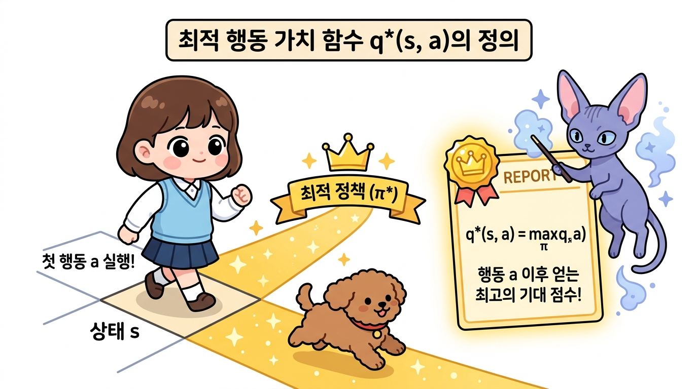

**그림 06-13b** 상태 <i>s</i>에서 첫 행동 <i>a</i>를 실행한 후, 황금빛 최적 정책(<i>&pi;</i>&ast;)의 길을 따라 얻을 수 있는 최고의 기대 성적표: 최적 행동 가치 함수 <i>q</i>&ast;(<i>s</i>, <i>a</i>)의 정의

---

#### 1단계: Q 함수 벨만 기대 방정식에 최적 정책(<i>&pi;</i>&ast;) 대입

먼저 앞서 배운 일반 정책 <i>&pi;</i>에 대한 Q 함수의 벨만 기대 방정식([식 06.14])을 떠올려 봅니다.

$$
q_{\pi}(s, a) = \sum_{s'} p(s' \mid s, a) \left\{ r(s, a, s') + \gamma \sum_{a'} \pi(a' \mid s') q_{\pi}(s', a') \right\}
$$

이 벨만 기대 방정식은 세상에 존재하는 **모든 정책 <i>&pi;</i>에 대해 항상 성립**하는 일반 공식입니다. 

따라서 최고의 정책인 **최적 정책 <i>&pi;</i>&ast;**를 대입해도 당연히 그대로 성립합니다.

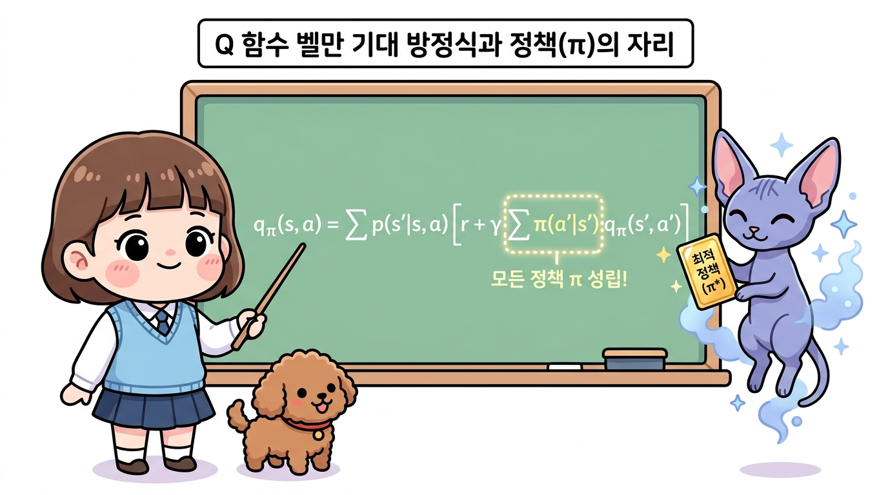

**그림 06-13c** 일반 정책 <i>&pi;</i>에 대해 성립하는 Q 함수 벨만 기대 방정식([식 06.14])과 최적 정책(<i>&pi;</i>&ast;) 카드를 대입할 준비를 하는 도로시와 지니

---

모든 <i>&pi;</i> 자리에 최적 정책 기호 <i>&pi;</i>&ast;와 최적 Q 함수 기호 <i>q</i>&ast;를 대입하면 다음과 같은 식을 얻습니다.
$$
q_*(s, a) = \sum_{s'} p(s' \mid s, a) \left\{ r(s, a, s') + \gamma \sum_{a'} \pi_*(a' \mid s') q_*(s', a') \right\}
$$

[식 06.17]

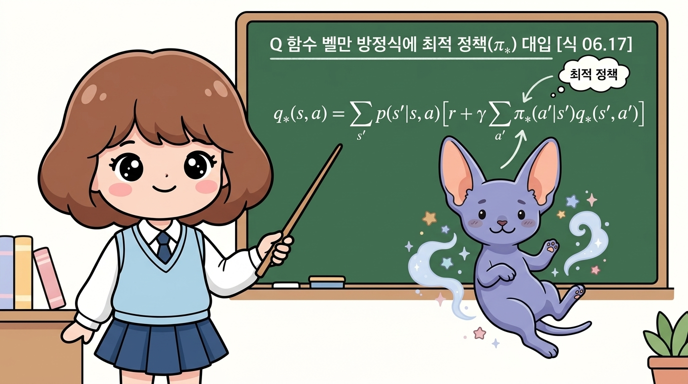

**그림 06-14** 일반 Q 함수 벨만 기대 방정식의 정책 자리에 최적 정책 <i>&pi;</i>&ast; 카드를 대입하여 [식 06.17]을 유도하는 과정

> **여기서 잠깐! 왜 식의 시작 부분(바깥쪽)에는 <i>max</i>가 붙지 않을까요?**  
> 상태 가치 함수 <i>v</i>(<i>s</i>)는 시작점부터 "어떤 행동을 고를까?"를 에이전트가 직접 결정해야 하므로 바깥쪽에 *max**a*가 붙었습니다.  
> 하지만 행동 가치 함수 <i>q</i>(<i>s</i>, <i>a</i>)는 **"상태 <i>s</i>에서 이미 행동 <i>a</i>를 취했다!"**는 사실이 함수 입력값으로 못 박혀 있습니다. 따라서 첫 번째 행동 <i>a</i>는 선택의 여지가 없으며, 에이전트가 최적의 선택(<i>max</i>)을 내리는 시점은 다음 상태 <i>s'</i>에 도달한 후 **그다음 행동 <i>a'</i>를 고를 때**부터 시작됩니다.

---

#### 2단계: 안쪽 시그마 가중합이 *max**a'*로 변신! [식 06.18]

다음 전개는 앞서 06.5.1절에서 상태 가치 함수를 유도했던 논리와 완벽하게 같습니다.

다음 상태 <i>s'</i>에 도달한 최적 에이전트는 여러 가능한 다음 행동 <i>a'</i>들의 가치를 확률적으로 섞는 가중평균(*&sum;**a'* *&pi;*&ast;)을 계산하지 않습니다. 대신 **가장 큰 Q 가치를 가져다줄 행동 하나만을 100% 확률로 쏙 선택(`max`)**합니다.

**그림 06-14a** 다음 상태 <i>s'</i>에 도달한 최적 에이전트가 확률 가중합 대신 가장 높은 Q 가치를 가져다주는 다음 행동 <i>a'</i> 하나만을 100% 최선의 선택(<i>max</i><i>a'</i>)으로 골라내는 원리

---

따라서 [식 06.17] 안쪽 괄호의 *&sum;**a'* *&pi;*&ast;(<i>a'</i> | <i>s'</i>) <i>q</i>&ast;(<i>s'</i>, <i>a'</i>) 부분이 단 하나의 최댓값 연산자 ***max**a'* <i>q</i>&ast;(<i>s'</i>, <i>a'</i>)**로 깔끔하게 치환됩니다!

$$
q_*(s, a) = \sum_{s'} p(s' \mid s, a) \left\{ r(s, a, s') + \gamma \max_{a'} q_*(s', a') \right\}
$$

[식 06.18]

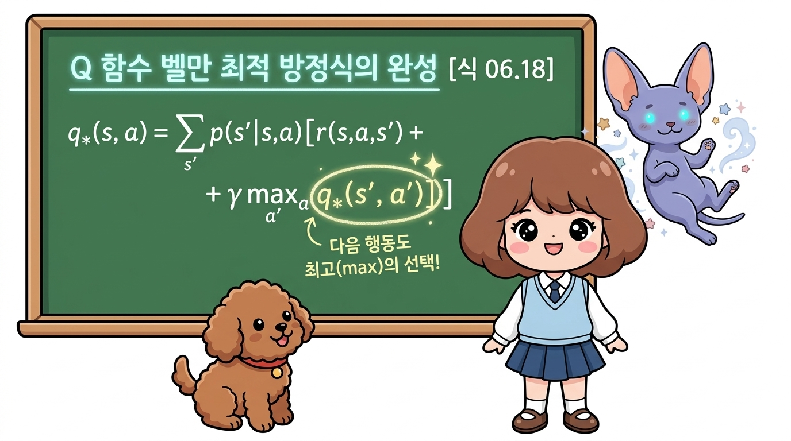

**그림 06-15** 안쪽의 복잡한 정책 확률 가중합이 미래 행동의 최고치를 쏙 뽑아내는 *max**a'* 연산자로 압축되어 완성된 Q 함수 벨만 최적 방정식 [식 06.18]

---

[식 06.18]이 바로 강화학습에서 널리 쓰이는 **Q 함수(행동 가치 함수)의 벨만 최적 방정식(Bellman Optimality Equation for Q-function)**입니다! 

이 방정식은 나중에 배울 대표적인 강화학습 알고리즘인 **Q-러닝(Q-Learning)**과 **DQN(Deep Q-Network)**의 굳건한 수학적 토대가 됩니다.

**그림 06-15a** Q-러닝(Q-Learning)과 DQN(Deep Q-Network) 등 현대 강화학습의 최고 핵심 알고리즘들을 든든하게 떠받치는 Q 함수 벨만 최적 방정식의 수학적 토대

> NOTE_ **MDP에서 결정적 최적 정책과 가치 함수의 유일성**  
> 모든 마르코프 결정 과정(MDP)에서는 항상 **최소 하나 이상의 결정적 최적 정책(Deterministic Optimal Policy)**이 존재합니다. 결정적 정책이란 어떤 상태 <i>s</i>에서 주사위를 굴리지 않고 특정 행동 <i>a</i>를 100% 확실하게 선택하는 정책으로, <i>&mu;</i>&ast;(<i>s</i>)와 같이 단일 함수 형태로 나타낼 수 있습니다.  
> 만약 보상이 똑같은 여러 갈래의 길이 존재한다면 최적 정책 자체는 여러 개가 될 수 있지만, 그 어떤 최적 정책을 따르더라도 **달성할 수 있는 최적 가치의 크기(<i>v</i>&ast;와 <i>q</i>&ast;)는 완벽하게 동일하고 유일**합니다. 따라서 최적 가치 함수는 복수 개가 아니라 <i>v</i>&ast;와 <i>q</i>&ast;라는 단 하나의 기호로 고유하게 정의됩니다.

---

### 06.5.3 벨만 최적 백업 다이어그램 분석과 대칭성

상태 가치 함수(<i>v</i>&ast;)와 행동 가치 함수(<i>q</i>&ast;)의 벨만 최적 방정식은 서로 완벽한 짝을 이루는 **거울 같은 대칭 구조**를 가지고 있습니다. 

두 방정식의 백업 다이어그램을 나란히 놓고 비교해 보면 그 직관을 한눈에 파악할 수 있습니다.

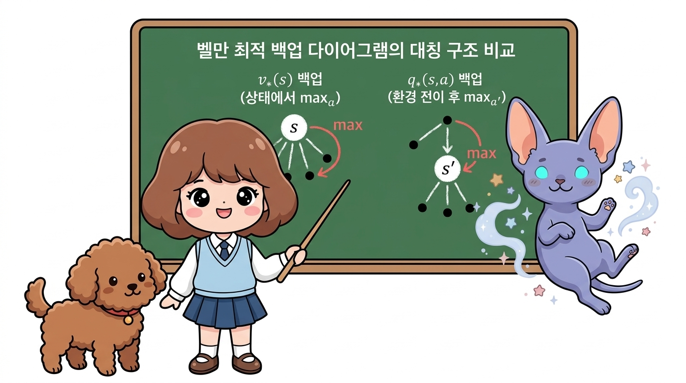

**그림 06-16** 상태 가치 함수(<i>v</i>&ast;)와 행동 가치 함수(<i>q</i>&ast;)의 최적 백업 다이어그램 비교: 최적 의사결정(*max*)이 일어나는 위치와 환경의 상태 전이 확률(*&sum;**s'* *p*)의 대칭 구조

---

#### 두 최적 가치 함수의 백업 다이어그램 대칭 구조

1. **상태 가치 함수 <i>v</i>&ast;(<i>s</i>)의 흐름**:
   - 출발점: 상태 <i>s</i> (흰색 원)
   - 1단계 (에이전트의 선택): 에이전트가 최선의 행동 <i>a</i>를 선택함 &rarr; ***max**a* 아크 발생**
   - 2단계 (환경의 반응): 선택된 행동에 대해 환경이 다음 상태 <i>s'</i>를 확률적으로 결정 &rarr; *&sum;**s'* *p*(<i>s'</i> | <i>s</i>, <i>a</i>)

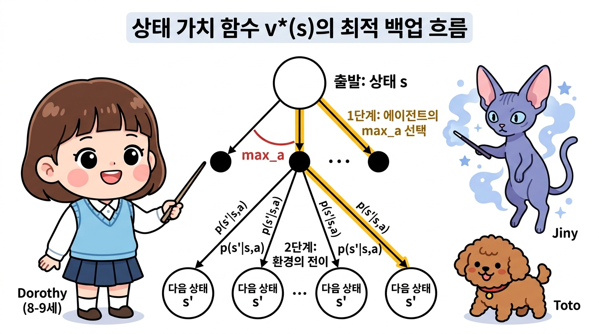

**그림 06-16a** 상태 가치 함수 <i>v</i>&ast;(<i>s</i>)의 최적 백업 다이어그램 흐름: 상태 <i>s</i> 출발 &rarr; 에이전트의 *max**a* 최적 행동 선택 &rarr; 환경의 확률적 전이

2. **행동 가치 함수 <i>q</i>&ast;(<i>s</i>, <i>a</i>)의 흐름**:
   - 출발점: 상태-행동 쌍 (<i>s</i>, <i>a</i>) (검은색 원)
   - 1단계 (환경의 반응): 이미 주어진 행동 <i>a</i>에 대해 환경이 다음 상태 <i>s'</i>로 전이 &rarr; *&sum;**s'* *p*(<i>s'</i> | <i>s</i>, <i>a</i>)
   - 2단계 (에이전트의 선택): 도착한 다음 상태 <i>s'</i>에서 최고의 다음 행동 <i>a'</i>를 선택함 &rarr; ***max**a'* 아크 발생**

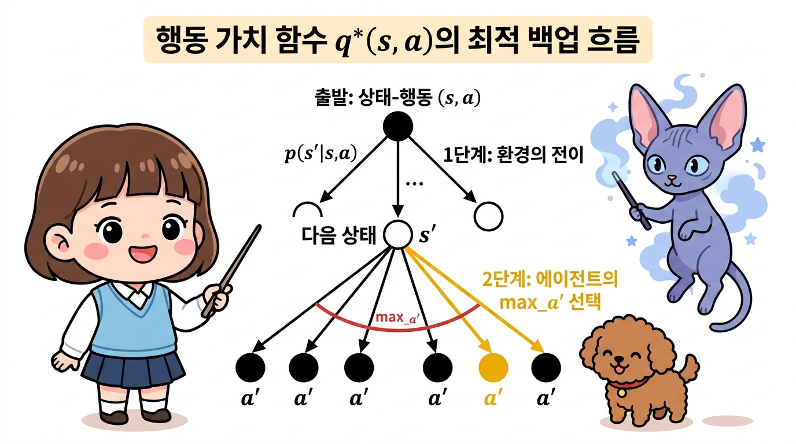

**그림 06-16b** 행동 가치 함수 <i>q</i>&ast;(<i>s</i>, <i>a</i>)의 최적 백업 다이어그램 흐름: 상태-행동 (<i>s</i>, <i>a</i>) 출발 &rarr; 환경의 상태 전이 &rarr; 다음 상태 <i>s'</i>에서의 *max**a'* 최적 행동 선택

이처럼 두 방정식은 단지 **'에이전트의 선택(<i>max</i>)'과 '환경의 전이(확률 <i>p</i>)'가 일어나는 순서만 뒤바뀌어 있을 뿐**, 동일한 최적 원리를 담고 있습니다.

---

#### 상태 가치 함수 벨만 최적 방정식 백업 다이어그램 상세 분석

벨만 최적 방정식인 [식 06.16]을 수식의 각 항과 매칭하여 구체적인 백업 다이어그램으로 시각화하면 다음과 같습니다.

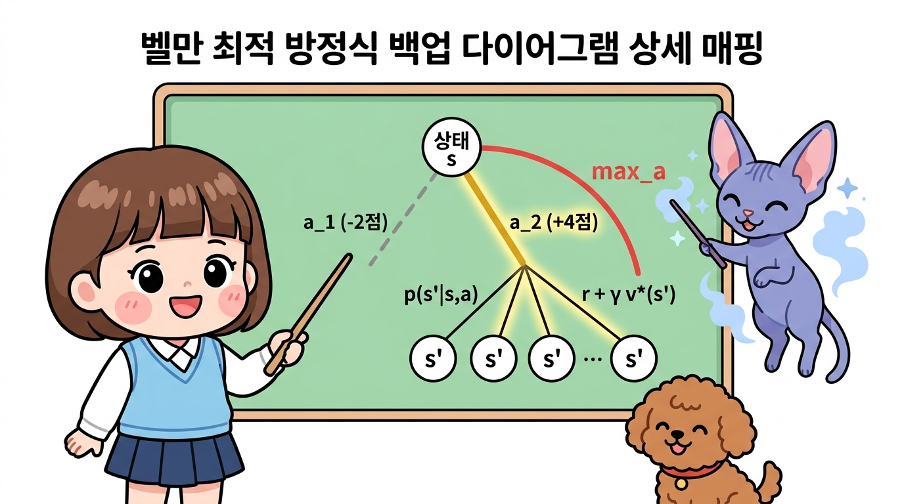

**그림 06-17** 상태 가치 함수 벨만 최적 방정식의 수식 항과 백업 다이어그램 가지의 1:1 대응 원리를 설명하는 도로시와 지니

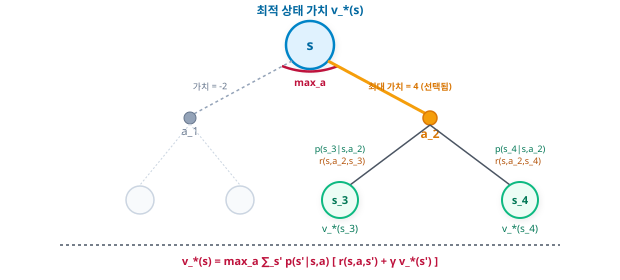

**그림 06-18** 상태 가치 함수의 벨만 최적 방정식 백업 다이어그램 상세 구조와 수식 각 항의 매핑 관계

위 [그림 06-17]과 [그림 06-18]을 통해 벨만 최적 방정식의 작동 구조를 세 가지 핵심 포인트로 정리해 보겠습니다.

1. **수식 항과 다이어그램 가지의 1:1 대응**:
   - **<i>v</i>&ast;(<i>s</i>)**: 다이어그램 맨 꼭대기의 출발점인 현재 상태 노드(흰색 원)입니다.
   - **빨간색 원호(*max**a* 아크)**: 에이전트의 여러 행동 갈림길을 가로지르는 빨간 곡선 호입니다. 모든 가능한 행동들의 가치를 확률대로 섞는 가중평균(시그마)을 취하지 않고, 가장 점수가 높은 1등 행동 하나만 단독으로 통과시키는 '최댓값 깔때기' 역할을 합니다.
   - **환경 전이 가지(*&sum;**s'* *p*(<i>s'</i> | <i>s</i>, <i>a</i>))**: 선택된 최적 행동 노드(검은색 원) 아래로 환경의 물리 법칙에 따라 다음 상태 <i>s'</i>들로 갈라지는 분기입니다.
   - **즉시 보상과 미래 가치 (*r* + &gamma;<i>v</i>&ast;(<i>s'</i>))**: 환경 전이를 거치며 얻는 즉각적인 보상 *r*과, 도착한 다음 상태 <i>s'</i>에 누적되어 있는 미래의 최적 가치 합입니다.

2. **황금빛 활성화 경로와 탈락한 회색 점선의 대비**:
   - 후보 행동 *a*1(-2.0점)과 *a*2(+4.0점) 중, 더 큰 보상을 안겨주는 행동 *a*2 가지에만 굵은 황금빛 불이 켜지며 선택됩니다.
   - 반면 점수가 낮은 열등한 행동 *a*1은 확률을 전혀 받지 못해(확률 0%) 회색 점선으로 탈락하며 가치 계산에서 완전히 배제됩니다.

3. **벨만 최적 방정식이 '비선형(Non-linear)'인 이유**:
   - 일반 벨만 기대 방정식은 단순 가중합(*&sum;*)으로만 이루어져 있어 덧셈과 곱셈만으로 표현되는 **선형 연립방정식(Linear Equation)**이었습니다. 따라서 행렬의 역행렬을 계산하여 수학적으로 단번에 해를 구할 수 있었습니다.
   - 하지만 벨만 최적 방정식은 여러 갈래 중 최고치 하나만을 조건문처럼 골라내는 ***max* 연산자**가 포함되어 있기 때문에 **비선형 연립방정식(Non-linear Equation)**이 됩니다.
   - 비선형 방정식은 단순 역행렬 계산으로 한 번에 풀리지 않으며, 바로 다음 장부터 배울 **가치 반복(Value Iteration)**이나 **정책 반복(Policy Iteration)** 같은 동적 프로그래밍(Dynamic Programming) 알고리즘을 통해 반복적으로 계산을 갱신하며 최적해를 찾아가게 됩니다.

---

### 06.5.4 학습 정리

**그림 06-19** 상태 가치 함수(<i>v</i>&ast;)와 행동 가치 함수(<i>q</i>&ast;)의 벨만 최적 방정식 및 *max* 연산자의 핵심 원리를 완벽하게 정복한 도로시와 지니, 토토

1. **최적 정책(<i>&pi;</i>&ast;)과 최적 가치 함수의 정의**:  
   모든 상태에서 상태 가치를 최대로 달성하는 정책을 **최적 정책(<i>&pi;</i>&ast;)**이라 합니다. 최적 정책을 따랐을 때 얻게 되는 최고의 기대 수익을 각각 **최적 상태 가치 함수(<i>v</i>&ast;(<i>s</i>) = max<i>&pi;</i> <i>v</i><i>&pi;</i>(<i>s</i>))**와 **최적 행동 가치 함수(<i>q</i>&ast;(<i>s</i>, <i>a</i>) = max<i>&pi;</i> <i>q</i><i>&pi;</i>(<i>s</i>, <i>a</i>))**라고 부릅니다.

2. **벨만 방정식의 보편성과 결정적 최적 정책(Deterministic Policy)**:  
   벨만 방정식은 초보/무작위 정책부터 최적 정책까지 **세상의 모든 정책에 대해 예외 없이 100% 성립**합니다. 최적 에이전트는 기대 점수를 최대화하기 위해 여러 행동 중 가장 높은 기대 수익을 주는 최선의 행동 하나에만 **확률 100%를 전부 집중(몰빵)**하므로, 확률적 정책은 자연스럽게 단 하나의 행동만을 선택하는 **결정적 정책(<i>&mu;</i>&ast;(<i>s</i>))**으로 귀결됩니다.

3. **상태 가치 함수의 벨만 최적 방정식 [식 06.16]**:  
   최적 정책 하에서는 행동들을 확률대로 섞는 가중평균(<i>&sum;</i><i>a</i> <i>&pi;</i>&ast;)을 구할 필요 없이, 가능한 행동 후보들 중 기대 가치가 가장 큰 것 하나만 **최댓값 연산자(*max**a*)**로 쏙 골라냅니다. 이로 인해 수식에서 정책 기호(<i>&pi;</i>)가 완전히 사라지고 환경의 규칙(*p, r*)과 미래의 최적 가치(<i>v</i>&ast;)만으로 현재 상태의 최적 가치가 결정됩니다.
   $$
   v_*(s) = \max_a \sum_{s'} p(s' \mid s, a) \left\{ r(s, a, s') + \gamma v_*(s') \right\}
   $$

4. **행동 가치 함수의 벨만 최적 방정식 [식 06.18]**:  
   Q 함수는 상태 <i>s</i>에서 이미 행동 <i>a</i>를 취한 상태에서 출발하므로 시작 시점에는 *max*가 붙지 않으며, 환경 전이를 거쳐 다음 상태 <i>s'</i>에 도착한 후 그다음 행동 <i>a'</i>를 선택할 때 **\*max\**a'***가 적용됩니다. 이 식은 현대 강화학습의 최고 핵심 알고리즘인 **Q-러닝(Q-Learning)**과 **DQN(Deep Q-Network)**의 탄탄한 수학적 모태가 됩니다.
   $$
   q_*(s, a) = \sum_{s'} p(s' \mid s, a) \left\{ r(s, a, s') + \gamma \max_{a'} q_*(s', a') \right\}
   $$

5. **백업 다이어그램의 거울 대칭성과 비선형 연립방정식**:  
   - <i>v</i>&ast;는 `상태 s 출발 → 에이전트의 max_a 선택 → 환경의 상태 전이 p` 순서로 흐르고, <i>q</i>&ast;는 `상태-행동 (s, a) 출발 → 환경의 상태 전이 p → 에이전트의 max_{a'} 선택` 순서로 흘러 완벽한 거울 대칭을 이룹니다.  
   - 또한 벨만 최적 방정식은 최고치 하나만을 골라내는 ***max* 연산자**로 인해 **비선형 연립방정식(Non-linear Equation)**이 되므로, 단순 행렬 연산 대신 다음 장부터 배울 동적 프로그래밍(가치 반복/정책 반복)과 같은 반복적 최적화 기법을 통해 해를 구하게 됩니다.

