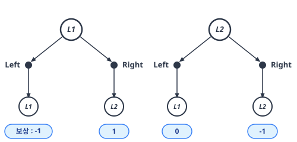
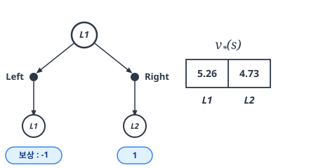
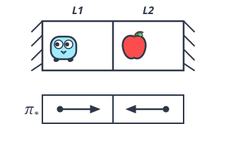

# 06.6 벨만 최적 방정식의 예

**그림 06-6** 그리드월드 격자판(L1, L2 등) 위에서 가시덤불 감점(-1)을 피해 황금사과 보상(+1)을 효율적으로 획득하는 최적 경로를 판서해주는 지니와 도로시

그리드월드 격자 환경에서 최적 방정식 수식을 대입해 직접 최적 가치와 최적 행동 패턴을 계산해 내는 실습을 배웁니다. 가시덤불 함정을 요리조리 피해 황금사과를 주워 나가는 도로시의 영리한 액션 게임 비유와 지니의 최적 계산법 수식을 6.6장에서 확실하게 터득해보아요!

---

이번 절에서는 [그림 06-13]의 '두 칸짜리 그리드 월드'를 다시 한번 다뤄보겠습니다. 

보상은 에이전트가 *L1*에서 *L2*로 이동할 때 +1, 벽에 부딪히면 -1입니다. 사과는 몇 번이고 다시 생성됩니다.

그림 06-13 두 칸짜리 그리드 월드

---

### 06.6.1 벨만 최적 방정식 적용

우리의 목표는 두 칸짜리 그리드 월드 문제에 벨만 최적 방정식을 적용하는 것입니다. 

앞서 살펴본 바와 같이 벨만 최적 방정식은 [식 06.16]처럼 나타낼 수 있습니다.
$$
v_*(s) = \max_a \sum_{s'} p(s' \mid s, a) \{ r(s, a, s') + \gamma v_*(s') \}
$$

[식 06.16]

또한 상태 전이가 결정적이라면 다음과 같이 단순화할 수 있습니다.

*s'* = *f*(*s*, *a*)일 때
$$
v_*(s) = \max_a \{ r(s, a, s') + \gamma v_*(s') \}
$$

[식 06.19]

이렇게 단순화할 수 있는 이유는 다음 식이 성립하기 때문입니다.

• *s'* = *f*(*s*, *a*)일 때 *p*(*s'* | *s*, *a*) = 1  
• *s'* ≠ *f*(*s*, *a*)일 때 *p*(*s'* | *s*, *a*) = 0  

따라서 [식 06.16]에서 *s'* = *f*(*s*, *a*)인 항만 남았습니다.

#### 최적 방정식 적용

이제 두 칸짜리 그리드 월드에 [식 06.19]의 벨만 최적 방정식을 적용합니다. 

참고로 상태 *L1*과 *L2*를 시작 위치로 한 백업 다이어그램(다음 단계의 백업 다이어그램)은 [그림 06-14]와 같습니다.

그림 06-14 상태 *L1*과 *L2*를 시작점으로 한 백업 다이어그램

[그림 06-14]를 참고하여 할인율이 0.9일 때의 벨만 최적 방정식은 다음과 같이 구할 수 있습니다.

$$
\begin{aligned}
v_*(L1) &= \max \begin{cases} -1 + 0.9 v_*(L1), \\ 1 + 0.9 v_*(L2) \end{cases} \\
v_*(L2) &= \max \begin{cases} 0.9 v_*(L1), \\ -1 + 0.9 v_*(L2) \end{cases}
\end{aligned}
$$

여기서 `max{...}`는 `max` 연산자를 뜻합니다. 

예를 들어 `max{a, b}`는 *a*와 *b* 중 큰 값을 반환합니다. 

이번에도 변수가 *v*&#42;(*L1*)과 *v*&#42;(*L2*) 두 개이고 방정식도 두 개입니다. 이 연립방정식으로 *v*&#42;(*L1*)과 *v*&#42;(*L2*)를 구할 수 있습니다. 

참고로 정답은 다음과 같습니다.
$$
\begin{aligned}
v_*(L1) &= 5.26 \\
v_*(L2) &= 4.73
\end{aligned}
$$

> CAUTION_ 앞의 연립방정식에서 `max` 연산을 하고 있는데, `max`는 비선형 연산입니다. 따라서 이 연립방정식을 푸는 알고리즘은 '선형 방정식 계산기'로는 풀 수 없지만 '비선형 방정식 계산기'를 사용하면 풀 수 있습니다. 물론 이번처럼 단순한 문제라면 직접 계산할 수도 있습니다.

두 칸짜리 그리드 월드처럼 단순한 문제라면 벨만 최적 방정식을 직접 손으로 계산하여 풀 수도 있습니다. 하지만 우리가 궁극적으로 알고 싶은 것은 최적 정책입니다. 

바로 이어서 최적 정책에 대해 알아보겠습니다.

---

### 06.6.2 최적 정책 구하기

최적 행동 가치 함수 *q*&#42;(*s*, *a*)를 알고 있다고 가정합시다. 

그렇다면 상태 *s*에서의 최적 행동은 다음과 같이 구할 수 있습니다.

*μ*&#42;(*s*) = argmax*a* *q*&#42;(*s*, *a*)

[식 06.20]

`argmax`는 (최댓값이 아니라) 최댓값을 만들어내는 인수(이번에는 행동 *a*)를 반환합니다. 

이 식과 같이 최적 행동 가치 함수를 알고 있는 경우, 함수의 값이 최대가 되는 행동을 선택하면 됩니다. 

그 행동을 선택하는 것이 바로 최적 정책인 것입니다.

또한 06.4절에서는 다음 식이 성립함을 보여줬습니다.

$$
q_{\pi}(s, a) = \sum_{s'} p(s' \mid s, a) \{ r(s, a, s') + \gamma v_{\pi}(s') \}
$$

[식 06.13]

이 식의 *q**π*와 *v**π*에서 정책의 첨자 *π*를 최적 정책인 첨자 `&#42;`로 대체할 수 있습니다. 

그리고 [식 06.20]에 대입하면 다음 식이 만들어집니다.
$$
\mu_* (s) = \operatorname{argmax}_a \sum_{s'} p(s' \mid s, a) \{ r(s, a, s') + \gamma v_*(s') \}
$$

[식 06.21]

[식 06.21]과 같이 최적 상태 가치 함수 *v*&#42;(*s*)를 사용하여 최적 정책 *μ*&#42;(*s*)를 얻을 수 있습니다.

> NOTE_ [식 06.20]과 [식 06.21]은 '탐욕 정책'이라고도 할 수 있습니다. 탐욕 정책은 국소적인 후보 중에서 최선의 행동을 찾습니다. 이번처럼 벨만 최적 방정식에서는 현재 상태(*s*)와 다음 상태(*s'*)만이 관련 있으며, 단순히 다음 상태만을 고려하여 가치가 가장 큰 행동을 선택합니다.

이제 [식 06.21]을 이용하여 두 칸짜리 그리드 월드 문제의 최적 정책을 찾아보죠. 

우리는 앞서 이 문제에서의 최적 상태 가치 함수인 *v*&#42;(*L1*)과 *v*&#42;(*L2*)를 구한 바 있습니다. 

여기서는 [그림 06-15]를 참고하여 먼저 상태 *L1*에서의 최적 행동을 구해봅니다.

그림 06-15 백업 다이어그램과 최적 상태 가치 함수

그림에서 보듯 취할 수 있는 행동은 Left와 Right 두 가지입니다. 

Left를 선택하면 상태 *L1*로 전이하여 보상 -1을 얻습니다. 

그러면 [식 06.21]의 *Σ**s'* *p*(*s'* | *s*, *a*) { *r*(*s*, *a*, *s'*) + *γ* *v**★*(*s'*) } 부분의 값은 다음과 같습니다(0.9는 할인율).

-1 + 0.9 *v*&#42;(*L1*) = -1 + 0.9 × 5.26 = 3.734

한편, 행동 Right를 선택하면 상태 *L2*로 전이하고 보상 1을 얻습니다. 

이 경우의 값은 다음과 같습니다.

1 + 0.9 *v*&#42;(*L2*) = 1 + 0.9 × 4.73 = 5.257

따라서 값이 더 큰 행동은 Right입니다. 

상태 *L1*에서의 최적 행동은 Right라는 뜻입니다. 같은 방식으로 상태 *L2*에서의 최적 행동을 찾으면 Left가 나옵니다.

드디어 최적 정책을 찾았습니다. 

[그림 06-16]과 같이 *L1*에서는 오른쪽으로, *L2*에서는 왼쪽으로 이동하는 행동이 최적 정책입니다.

그림 06-16 두 칸짜리 그리드 월드의 최적 정책

지금까지 살펴본 것처럼 최적 상태 가치 함수를 알면 최적 정책을 구할 수 있습니다.
