# 06.6 벨만 최적 방정식의 예

앞서 06.5절에서는 모든 정책을 통틀어 가장 높은 보상을 보장하는 **벨만 최적 방정식(Bellman Optimality Equation)**의 기본 원리를 배웠습니다. 이번 06.6절에서는 친숙한 **두 칸짜리 그리드월드(Two-state Grid World)** 환경에 직접 수식을 대입하여 최적 가치와 최적 정책을 한 걸음씩 손으로 유도해 봅니다.

도로시가 가시덤불을 완벽히 피하면서 탐스러운 황금사과를 무한히 수확하는 최적의 행동 규칙을 찾는 과정을 지니와 토토와 함께 단계별로 따라가 보겠습니다!

**그림 06-6** 두 칸짜리 그리드월드 격자판(L1, L2) 위에서 가시덤불 감점(-1)을 피해 황금사과 보상(+1)을 수확하는 최적 정책의 수학적 해법을 안내하는 지니와 도로시

---

#### 두 칸짜리 그리드월드 환경 복습

본격적인 수식 전개에 앞서 우리가 풀고자 하는 환경의 기본 규칙을 다시 확인해 보겠습니다.

그림 06-13 두 칸짜리 그리드 월드

- **상태 공간(State Space)**: 에이전트가 머무를 수 있는 위치는 <i>L1</i>과 <i>L2</i> 두 곳뿐입니다. (<i>S</i> = {<i>L1</i>, <i>L2</i>})
- **행동 공간(Action Space)**: 각 위치에서 선택할 수 있는 행동은 왼쪽(Left)과 오른쪽(Right) 두 가지입니다. (<i>A</i> = {Left, Right})
- **전이 규칙 및 즉각 보상(Reward)**:
  - <i>L1</i>에서 **Right**를 선택하면 <i>L2</i>로 이동하며 맛있는 황금사과 보상 **+1**을 얻습니다.
  - <i>L2</i>에서 **Left**를 선택하면 <i>L1</i>로 안전하게 되돌아가며 보상은 **0**입니다. (사과를 다시 먹기 위한 준비 단계)
  - 양쪽 벽(<i>L1</i>에서 Left, <i>L2</i>에서 Right)을 향해 돌진하면 쿵 부딪혀 제자리에 머물며 가시덤불 감점 **-1**을 받습니다.
- **할인율(Discount Factor)**: 미래 보상의 현재 가치를 반영하는 할인율은 <i>&gamma;</i> = 0.9로 설정합니다.

---

### 06.6.1 결정적 환경에서의 벨만 최적 방정식 단순화

우리의 첫 번째 목표는 일반적인 확률적 환경에서의 벨만 최적 방정식을 확인하고, 이것이 두 칸 그리드월드 같은 결정적 환경에서 어떻게 단순해지는지 이해하는 것입니다.

일반적인 MDP 환경에서의 벨만 최적 방정식은 [식 06.16]과 같이 다음 상태들에 대한 확률 가중합(&sum;)을 포함합니다.

$$
v_*(s) = \max_a \sum_{s'} p(s' \mid s, a) \{ r(s, a, s') + \gamma v_*(s') \}
$$

[식 06.16]

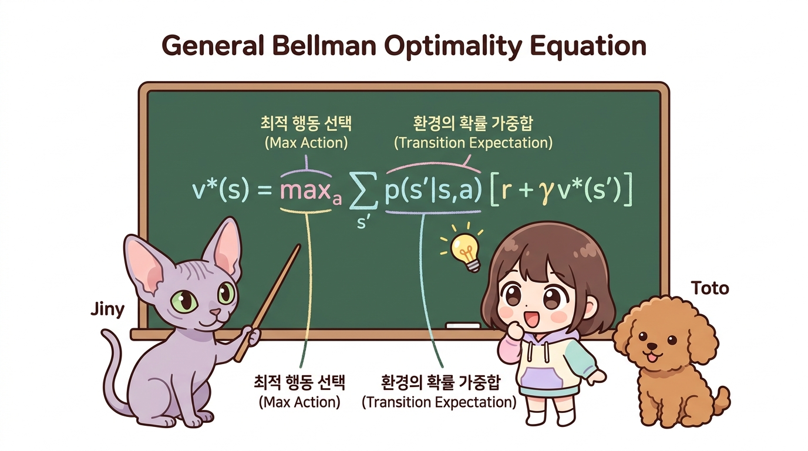

**그림 06-6-A** 일반적인 확률적 MDP 환경에서의 벨만 최적 방정식 구조: 에이전트의 최적 행동 선택(`max_a`)과 환경의 불확실한 상태 전이 확률 가중합(`&sum;_{s'} p(s'|s,a)`)의 조화로운 결합

지니의 칠판 설명을 보면, 복잡해 보이는 [식 06.16]은 사실 **두 개의 핵심 엔진**으로 구성되어 있음을 알 수 있습니다:

1. **에이전트의 최적 의지 (`max_a`)**:
   현재 상태 <i>s</i>에서 에이전트가 선택할 수 있는 모든 가능한 행동(Left, Right 등) 중, 앞으로 얻을 수 있는 총 가치를 최대로 만들어주는 '최고의 행동'을 하나 고릅니다.
2. **환경의 불확실성에 대한 기댓값 (`&sum;_{s'} p(s' | s, a)`)**:
   바람이 불거나 빙판길이 있는 현실적인 환경에서는 내가 '오른쪽'으로 가려고 결심해도 100% 오른쪽으로 가지 못하고 미끄러질 수 있습니다. 따라서 환경이 반응하여 데려다줄 수 있는 모든 다음 상태 <i>s'</i>에 대해 각 확률 <i>p</i>(<i>s'</i> &mid; <i>s</i>, <i>a</i>)을 곱한 평균(가중합)을 계산해야 합니다.
3. **보상과 미래 가치의 결합 (`{ r(s, a, s') + &gamma; v_*(s') }`)**:
   다음 상태로 이동하면서 즉시 주어지는 보상 <i>r</i>과, 할인율 <i>&gamma;</i>가 곱해진 미래 최적 가치 <i>v</i>&ast;(<i>s'</i>)의 합입니다.

---

하지만 우리가 지금 다루는 두 칸 그리드월드는 주사위를 굴리거나 미끄러지는 확률적 요소가 전혀 없는 **결정적 환경(Deterministic Environment)**입니다. 

즉, 어떤 상태 <i>s</i>에서 행동 <i>a</i>를 취하면 다음 상태 <i>s'</i>가 100% 확률로 오직 하나로 정해집니다. (<i>s'</i> = <i>f</i>(<i>s</i>, <i>a</i>))

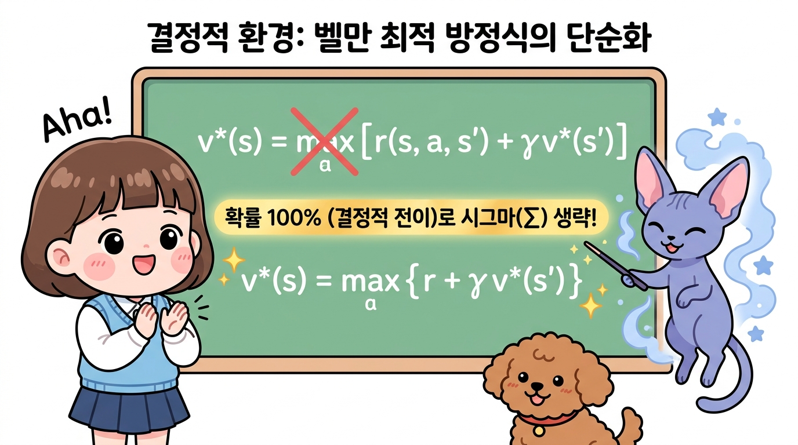

**그림 06-6-B** 결정적 환경에서 복잡한 시그마(&sum;) 전이 확률이 사라지고 단 하나의 목적지로 깔끔하게 축약되는 벨만 최적 방정식의 단순화 원리

---

결정적 전이 환경에서는 다음 두 가지가 성립합니다.

- 다음 상태가 <i>s'</i> = <i>f</i>(<i>s</i>, <i>a</i>)일 때: <i>p</i>(<i>s'</i> &mid; <i>s</i>, <i>a</i>) = 1
- 그 외의 모든 상태일 때: <i>p</i>(<i>s'</i> &mid; <i>s</i>, <i>a</i>) = 0

따라서 시그마 기호 안의 수많은 경우의 수 중에서 실제로 도달하는 단 하나의 항만 살아남으므로, 벨만 최적 방정식은 다음과 같이 명쾌한 형태로 단순화됩니다.

$$
v_*(s) = \max_a \{ r(s, a, s') + \gamma v_*(s') \} \quad \text{단, } s' = f(s, a)
$$

[식 06.19]

"현재 상태 <i>s</i>에서 내가 고를 수 있는 여러 행동 중, **즉각 보상 + 할인된 미래 최적 가치**의 합을 가장 크게 만들어주는 최고의 행동 하나를 선택한다!"라는 직관이 수식에 그대로 담겨 있습니다.

---

### 06.6.2 벨만 최적 연립방정식의 도출과 풀이

이제 단순화된 [식 06.19]를 두 칸 그리드월드의 두 상태 <i>L1</i>과 <i>L2</i>에 각각 적용해 보겠습니다. 

그림 06-14 상태 *L1*과 *L2*를 시작점으로 한 백업 다이어그램

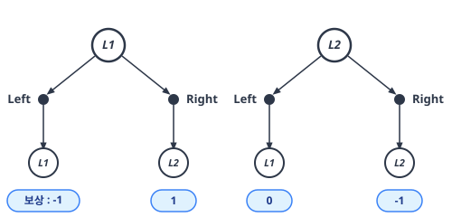

각 상태에서 취할 수 있는 행동(Left, Right)의 갈래를 백업 다이어그램에 따라 나열해 보면 다음과 같습니다.

---

#### 1) 상태 *L1*에서의 선택지
- **Left 선택 시**: 왼쪽 벽에 부딪혀 다시 <i>L1</i>에 머물며 보상 -1을 받습니다. &rarr; `-1 + 0.9 v_*(L1)`
- **Right 선택 시**: 오른쪽으로 이동하여 <i>L2</i>에 도착하고 보상 +1을 받습니다. &rarr; `1 + 0.9 v_*(L2)`

#### 2) 상태 *L2*에서의 선택지
- **Left 선택 시**: 왼쪽으로 이동하여 <i>L1</i>에 도착하고 보상 0을 받습니다. &rarr; `0 + 0.9 v_*(L1)`
- **Right 선택 시**: 오른쪽 벽에 부딪혀 다시 <i>L2</i>에 머물며 보상 -1을 받습니다. &rarr; `-1 + 0.9 v_*(L2)`

---

이 두 갈래 선택지 중 더 큰 값(`max`)을 골라내는 벨만 최적 연립방정식을 세우면 다음과 같습니다.
$$
\begin{aligned}
v_*(L1) &= \max \begin{cases} -1 + 0.9 v_*(L1), \\ 1 + 0.9 v_*(L2) \end{cases} \\
v_*(L2) &= \max \begin{cases} 0.9 v_*(L1), \\ -1 + 0.9 v_*(L2) \end{cases}
\end{aligned}
$$

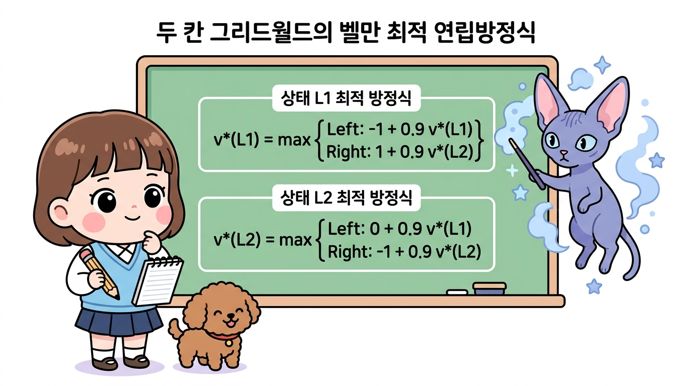

**그림 06-6-C** 칠판 위에 세워진 두 칸 그리드월드의 벨만 최적 연립 비선형 방정식

> [!NOTE]
> `max` 연산자는 주어진 후보들 중에서 최댓값을 고르는 **비선형 연산자(Non-linear operator)**입니다. 따라서 06.3절에서 일반 정책 평가를 풀 때 사용했던 역행렬 공식이나 선형 연립방정식 풀이기법을 곧바로 적용할 수는 없습니다. 하지만 지금처럼 단순한 문제에서는 어느 쪽이 승자일지 논리적으로 판단하여 쉽게 손으로 풀 수 있습니다.

---

#### 손으로 직접 풀어보는 연립방정식

상식적으로 최적 행동을 하는 똑똑한 에이전트라면 벽에 부딪혀 벌점(-1)을 받는 행동 대신, 반대쪽으로 이동하는 행동을 고를 것입니다.
- <i>L1</i>에서는 벌점을 받는 Left 대신 사과를 먹는 Right를 고를 것이 자명하므로: `v_*(L1) = 1 + 0.9 v_*(L2)`
- <i>L2</i>에서는 벽에 부딪히는 Right 대신 사과를 다시 수확하러 가는 Left를 고를 것이 자명하므로: `v_*(L2) = 0.9 v_*(L1)`

이제 <i>v</i>&ast;(<i>L2</i>) 식을 <i>v</i>&ast;(<i>L1</i>) 식에 그대로 대입해 보겠습니다!

$$
\begin{aligned}
v_*(L1) &= 1 + 0.9 \times \{ 0.9 v_*(L1) \} \\
v_*(L1) &= 1 + 0.81 v_*(L1)
\end{aligned}
$$

양변에서 0.81 <i>v</i>&ast;(<i>L1</i>)을 빼주면:

$$
\begin{aligned}
(1 - 0.81) v_*(L1) &= 1 \\
0.19 v_*(L1) &= 1 \\
v_*(L1) &= \frac{1}{0.19} = \frac{100}{19} \approx 5.263
\end{aligned}
$$

구해진 <i>v</i>&ast;(<i>L1</i>)을 <i>v</i>&ast;(<i>L2</i>) 식에 대입합니다:

$$
v_*(L2) = 0.9 \times 5.263 \approx 4.737
$$

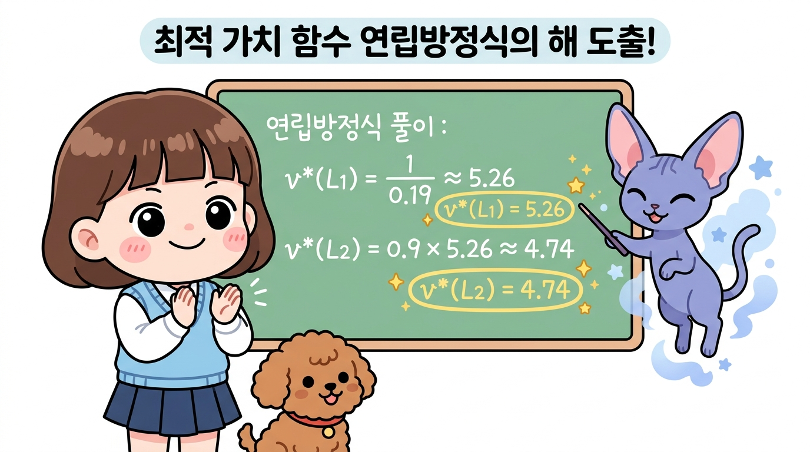

**그림 06-6-D** 지니의 칠판 풀이: 소수점 계산을 거쳐 두 상태의 최적 가치(v*(L1) ≈ 5.26, v*(L2) ≈ 4.74)를 깔끔하게 도출해낸 과정

---

소수점 둘째 자리까지 반올림하면 다음과 같은 최종 최적 가치를 얻게 됩니다.

$$
\begin{aligned}
v_*(L1) &\approx 5.26 \\
v_*(L2) &\approx 4.74
\end{aligned}
$$

우리가 처음에 가정한 "벽에 부딪히지 않는 쪽이 더 크다"는 가정이 실제로 맞는지 검산해 보면:

- <i>L1</i>: Right(1 + 0.9 &times; 4.74 = 5.266) &gt; Left(-1 + 0.9 &times; 5.26 = 3.734) &rarr; **Right 압승!**
- <i>L2</i>: Left(0 + 0.9 &times; 5.26 = 4.734) &gt; Right(-1 + 0.9 &times; 4.74 = 3.266) &rarr; **Left 압승!**

가정이 완벽하게 들어맞으며 최적 가치가 증명되었습니다.

---

### 06.6.3 최적 정책의 도출: max와 argmax의 차이

에이전트가 어떤 상태에서 최종적으로 가져갈 수 있는 최대 가치 <i>v</i>&ast;(<i>s</i>)를 구했습니다. 하지만 게임이나 실제 제어 환경에서 에이전트에게 필요한 것은 점수 숫자 자체가 아니라, **"지금 당장 어떤 행동을 실행해야 하는가?"**입니다.

여기서 바로 `max`와 `argmax`의 결정적인 차이가 등장합니다.

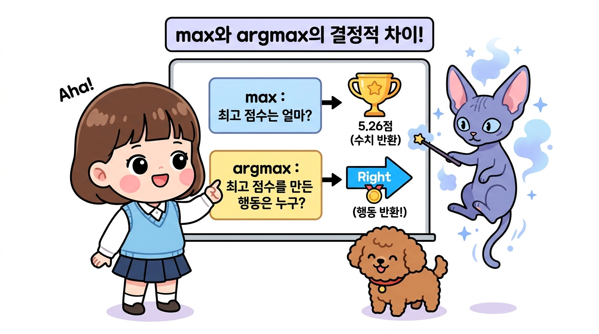

**그림 06-6-E** 점수 숫자를 알려주는 max(5.26)와 승리한 행동 선택지를 알려주는 argmax(Right)의 직관적인 개념 비교

- **`max`**: 여러 후보 중 **가장 높은 점수(Value)** 그 자체를 숫자로 꺼내옵니다.
  $$\max_a Q(s, a) = 5.26$$
- **`argmax` (Argument of the Maximum)**: 가장 높은 점수를 만들어낸 **최고의 원인/행동(Action)**을 선택지로 꺼내옵니다.
  $$\operatorname{argmax}_a Q(s, a) = \text{Right}$$

최적 행동 가치 함수 <i>q</i>&ast;(<i>s</i>, <i>a</i>)를 알고 있을 때, 상태 <i>s</i>에서의 최적 행동은 바로 이 `argmax`를 사용하여 정의됩니다.

$$
\mu_*(s) = \operatorname{argmax}_a q_*(s, a)
$$

[식 06.20]

앞선 06.4절 [식 06.13]에서 <i>q</i>*&pi;*(<i>s</i>, <i>a</i>)와 <i>v</i>*&pi;*(<i>s'</i>)의 관계를 배웠으므로, 첨자 *&pi;*를 최적 기호 `*`로 바꾸어 대입하면 최적 상태 가치 함수 <i>v</i>&ast;를 이용한 최적 정책 공식이 완성됩니다.

$$
\mu_*(s) = \operatorname{argmax}_a \sum_{s'} p(s' \mid s, a) \{ r(s, a, s') + \gamma v_*(s') \}
$$

[식 06.21]

이 공식은 눈앞의 다음 한 걸음 상태에서 미래 최적 가치가 가장 커지는 행동을 쏙 골라내는 **탐욕 정책(Greedy Policy)**의 형태를 띱니다.

---

#### 두 칸 그리드월드의 최적 행동 선택

그림 06-15 백업 다이어그램과 최적 상태 가치 함수

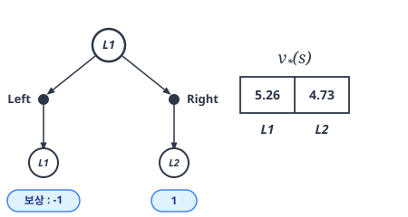

우리가 계산해 둔 <i>v</i>&ast;(<i>L1</i>) = 5.26과 <i>v</i>&ast;(<i>L2</i>) = 4.74를 [식 06.21]에 대입하여 각 상태의 최적 행동을 확정해 보겠습니다.

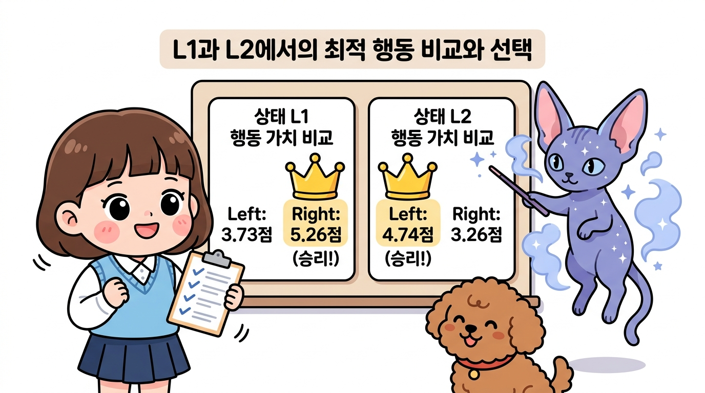

**그림 06-6-F** L1과 L2 두 상태에서 각 행동의 기대 가치를 정밀하게 비교하여 최적 행동(L1→Right, L2→Left)을 확정하는 과정

1. **상태 *L1*에서의 행동 가치 비교**:
   - `Left (벽)`: &minus;1 + 0.9 &times; <i>v</i>&ast;(<i>L1</i>) = &minus;1 + 0.9 &times; 5.26 = **3.734**
   - `Right (사과)`: +1 + 0.9 &times; <i>v</i>&ast;(<i>L2</i>) = 1 + 0.9 &times; 4.74 = **5.266**
   - <i>5.266 &gt; 3.734</i> 이므로, 상태 <i>L1</i>에서의 최적 행동은 **Right**입니다.
   $$
   \mu_*(L1) = \text{Right}
   $$

2. **상태 *L2*에서의 행동 가치 비교**:
   - `Left (귀환)`: 0 + 0.9 &times; <i>v</i>&ast;(<i>L1</i>) = 0 + 0.9 &times; 5.26 = **4.734**
   - `Right (벽)`: &minus;1 + 0.9 &times; <i>v</i>&ast;(<i>L2</i>) = &minus;1 + 0.9 &times; 4.74 = **3.266**
   - <i>4.734 &gt; 3.266</i> 이므로, 상태 <i>L2</i>에서의 최적 행동은 **Left**입니다.
   $$
   \mu_*(L2) = \text{Left}
   $$

그림 06-16 두 칸짜리 그리드 월드의 최적 정책

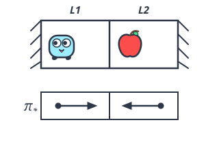

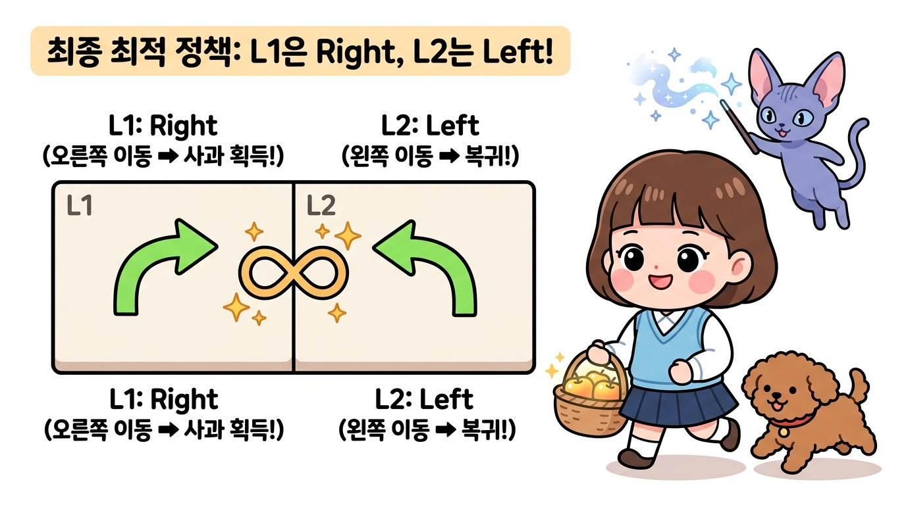

**그림 06-6-G** L1에서는 오른쪽으로, L2에서는 왼쪽으로 이동하며 끝없이 황금사과를 수확하는 무한 순환 최적 정책(&infin;)

에이전트 도로시의 최종 최적 정책은 매우 단순하면서도 명확합니다:

- **L1에 있을 때는 오른쪽(Right)으로 이동**하여 즉시 사과(+1)를 먹는다!
- **L2에 있을 때는 왼쪽(Left)으로 이동**하여 벽 감점(-1)을 피하고 다시 사과를 먹을 수 있는 L1으로 복귀한다!

이 왕복 행동을 무한히 반복함으로써 도로시는 감점을 0%로 만들고 황금사과 보상을 무한히 축적하게 됩니다.

---

### 06.6.4 학습 정리

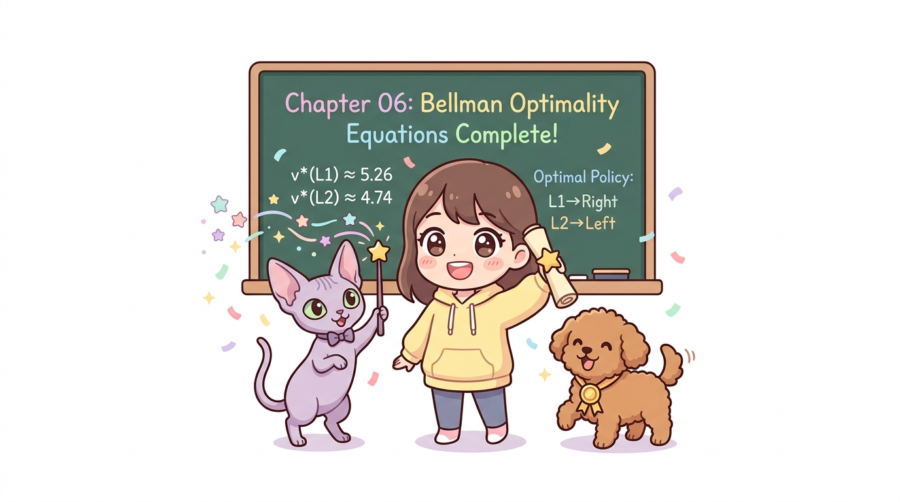

**그림 06-6-H** 벨만 최적 방정식의 이론부터 구체적인 그리드월드 수치 풀이까지 완벽하게 정복한 도로시, 지니, 토토의 축하 졸업식!

06장 '벨만 방정식'의 모든 여정을 마쳤습니다! 이번 06.6절에서 배운 핵심 내용을 5가지 포인트로 정리합니다.

1. **결정적 전이 환경의 축약**: 확률적 전이가 없는 환경에서는 전이 확률 시그마(&sum;) 항이 사라지고, 목표 상태 하나만 남은 형태 `v_*(s) = max_a { r + &gamma; v_*(s') }`로 단순화됩니다.
2. **비선형 연립방정식과 `max`**: 벨만 최적 방정식은 `max` 연산자가 포함되어 있어 역행렬 공식 등의 일반 선형 대수 기법으로는 풀 수 없지만, 단순한 환경에서는 논리적 판단을 통해 연립방정식으로 직접 손풀이가 가능합니다.
3. **손풀이를 통한 최적 가치 도출**: 두 칸 그리드월드에서 연립방정식을 전개한 결과, `v_*(L1) ≈ 5.26`, `v_*(L2) ≈ 4.74`라는 구체적인 최적 가치를 유도해 냈습니다.
4. **`max` vs `argmax`**: `max`는 최선의 상태 가치 점수 숫자를 알려주는 반면, `argmax`는 그 최선 점수를 획득하기 위해 취해야 할 실제 최적 행동을 반환합니다.
5. **최적 상태 가치 함수로부터 최적 정책 도출**: 상태 가치 함수 <i>v</i>&ast;를 알고 있다면, 단 한 번의 국소적 탐욕 선택(`argmax`)만으로도 전체 환경을 아우르는 최적 정책 &mu;&ast;(<i>s</i>)를 즉시 완성할 수 있습니다.

> **도로시**: "지니! 복잡해 보이던 벨만 최적 방정식이 직접 <i>L1</i>과 <i>L2</i> 연립방정식으로 풀어보니 정말 속 시원하게 이해돼요! <i>v</i>&ast;(<i>L1</i>) &approx; 5.26과 <i>v</i>&ast;(<i>L2</i>) &approx; 4.74를 구하니까 어떤 행동을 골라야 할지 `argmax`로 한눈에 보였어요!"  
> **지니**: "맞아요, 도로시! 하지만 상태가 수천, 수만 개로 늘어난다면 사람이 일일이 손으로 연립방정식을 풀 수는 없겠죠? 그래서 컴퓨터가 스스로 반복 계산을 통해 최적 가치와 최적 정책을 찾아내는 마법, 바로 **07장 다이내믹 프로그래밍(Dynamic Programming)**으로 나아갈 차례랍니다!"  
> **토토**: "멍멍! 다음 07장 모험도 정말 기대돼요, 멍멍!"
