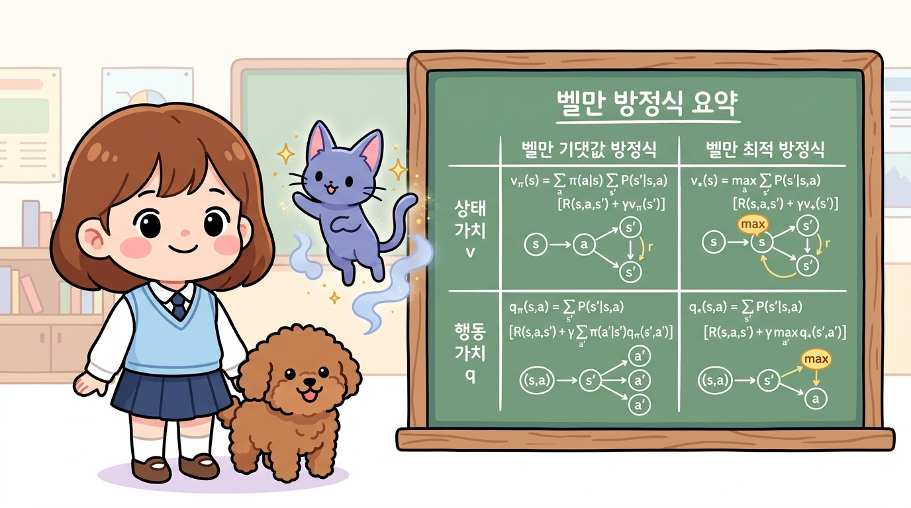
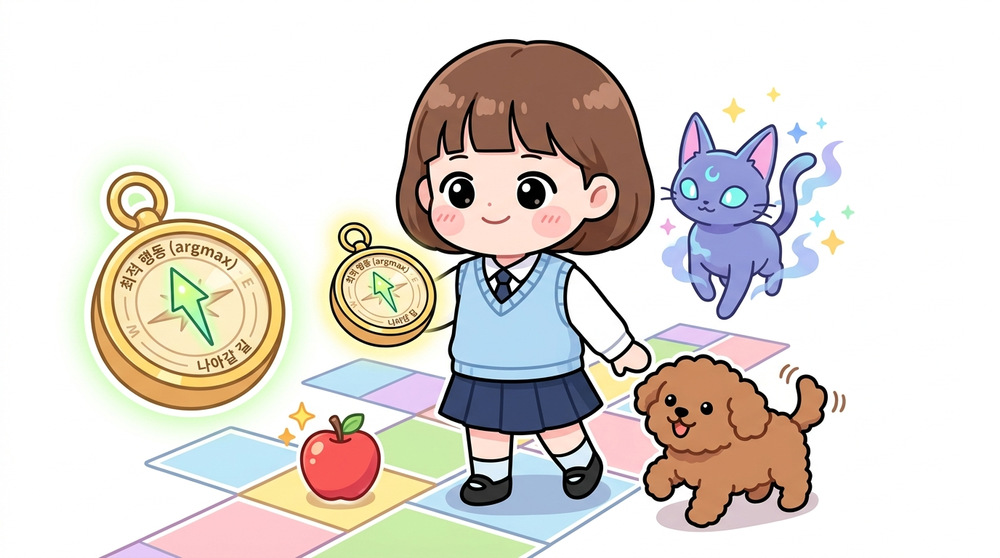
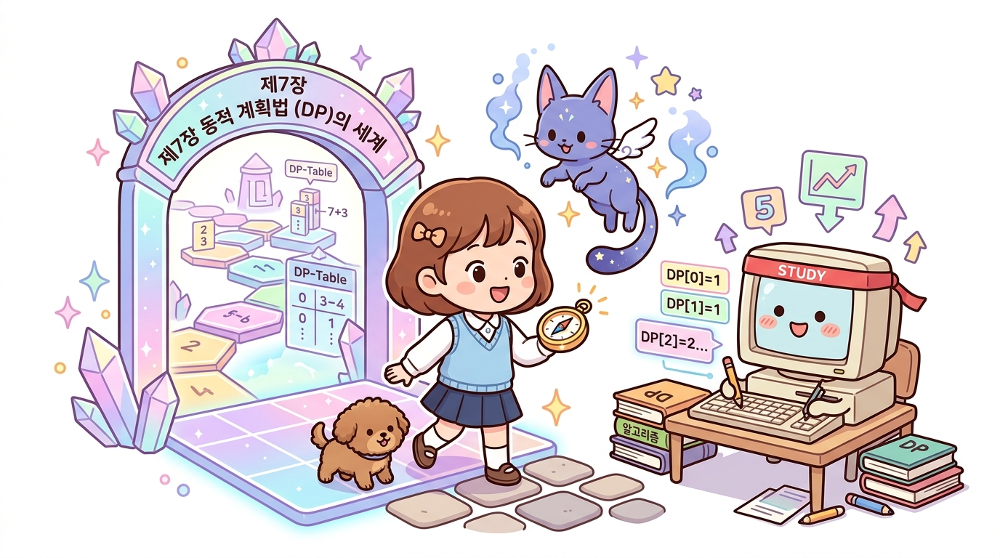

# 06.7 정리

  

    🎧
    대화 음성 듣기 (도로시, 지니, 토토)
  

  

    <button type="button" class="btn-audio-play" style="background: #0284c7; color: #ffffff; border: none; border-radius: 16px; padding: 5px 13px; font-size: 0.82rem; font-weight: 600; cursor: pointer; display: inline-flex; align-items: center; gap: 4px; box-shadow: 0 1px 2px rgba(2,132,199,0.3);">
      ▶️ 재생
    </button>
    <button type="button" class="btn-audio-stop" style="background: #e2e8f0; color: #475569; border: none; border-radius: 16px; padding: 5px 11px; font-size: 0.82rem; font-weight: 600; cursor: pointer; display: inline-flex; align-items: center; gap: 4px;">
      ⏹️ 정지
    </button>
  

  <audio src="./audio/dialogue_6_7_scene1.mp3" preload="none"></audio>

> 👧 **도로시**: "지니! 복잡해 보이던 벨만 방정식과 벨만 최적 방정식을 드디어 다 배웠어! 머릿속에 수식이 빙글빙글 돌지만, 정말 뿌듯해!"
> 
> 🐱 **지니**: "정말 대견하구나, 도로시! 6강은 강화학습 전체를 통틀어 가장 중요한 수학적 기둥이란다. 오늘 배운 공식들의 연결고리를 깔끔하게 정리해 두면, 앞으로 펼쳐질 7장 동적 계획법과 딥러닝 강화학습(DQN)도 술술 풀릴 거야!"
> 
> 🐶 **토토**: "멍멍! 벨만 최적 메달을 땄으니 이제 신나게 다음 모험으로 가자!"

**그림 06-7** 벨만 최적의 메달을 목에 걸고, 지니 요정이 선물해 준 7장 동적 계획법 마법 책을 힘차게 여는 도로시와 토토

벨만 방정식과 벨만 최적 방정식의 뼈대 공식을 최종적으로 대조 정리합니다. 상태 가치와 행동 가치 계산법을 정복하여 금빛 메달을 얻은 도로시처럼, 이제 수동 계산을 뛰어넘어 컴퓨터가 스스로 가치를 갱신해 나갈 거대한 **7장 동적 계획법(Dynamic Programming)** 세계의 출발선 앞에 지니와 함께 서봅시다!

---

## 1. 6강에서 배운 핵심: 벨만 방정식이란 무엇인가?

우리가 5강에서 배웠던 **가치 함수(Value Function)**는 "지금 이 상태에서 시작하면 앞으로 끝까지 얻을 보상의 합(기댓값)이 얼마나 될까?"를 나타내는 성적표였습니다.

하지만 끝없이 펼쳐지는 무한한 미래의 보상을 매 순간 처음부터 끝까지 다 더하는 것은 불가능에 가깝습니다. 이때 20세기의 위대한 수학자 리처드 벨만 교수가 제시한 해결책이 바로 **벨만 방정식(Bellman Equation)**입니다.

> 💡 **벨만 방정식의 한 줄 핵심 원리**  
> **"현재 상태의 가치 = 당장 한 걸음 내딛으며 얻는 즉각 보상(오늘의 사과) + 할인율이 적용된 다음 상태의 가치(내일의 보물상자)"**

  <b>현재 상태의 참 가치 <i>v</i>(<i>s</i>) = E [ <i>R</i><i>t</i>+1 + <i>γ</i> <i>v</i>(<i>S</i><i>t</i>+1) | <i>S</i><i>t</i> = <i>s</i> ]</b>

이 간단한 **재귀적(Recursive) 관계식** 덕분에, 우리는 까마득한 미래를 전부 헤매고 다니지 않아도 **"바로 이웃한 다음 상태들의 가치"**만 알면 현재의 가치를 완벽하게 계산할 수 있게 되었습니다!

---

## 2. 벨만 방정식 2 × 2 완전 정복 지도

  

    🎧
    대화 음성 듣기 (도로시, 지니, 토토)
  

  

    <button type="button" class="btn-audio-play" style="background: #0284c7; color: #ffffff; border: none; border-radius: 16px; padding: 5px 13px; font-size: 0.82rem; font-weight: 600; cursor: pointer; display: inline-flex; align-items: center; gap: 4px; box-shadow: 0 1px 2px rgba(2,132,199,0.3);">
      ▶️ 재생
    </button>
    <button type="button" class="btn-audio-stop" style="background: #e2e8f0; color: #475569; border: none; border-radius: 16px; padding: 5px 11px; font-size: 0.82rem; font-weight: 600; cursor: pointer; display: inline-flex; align-items: center; gap: 4px;">
      ⏹️ 정지
    </button>
  

  <audio src="./audio/dialogue_6_7_scene2.mp3" preload="none"></audio>

> 👧 **도로시**: "지니! 벨만 방정식이 4개나 되니까 머릿속에서 헷갈려. 이걸 한눈에 쏙 들어오게 정리할 수는 없을까?"
> 
> 🐱 **지니**: "후후, 걱정 마 도로시! 상태 가치와 행동 가치, 그리고 평균(기댓값)과 최선(최댓값)이라는 2가지 축만 알면 칠판 하나에 완벽하게 정리된단다!"
> 
> 🐶 **토토**: "멍멍! 2 곱하기 2 마법 격자판이네!"

**그림 06-7a** 상태 가치(*v*)와 행동 가치(*q*), 그리고 기댓값(평균)과 최적(최댓값 max)으로 구성된 4대 벨만 방정식의 대칭 구조를 칠판으로 정리하는 지니와 도로시, 토토

6강에서 등장한 수식들은 언뜻 보면 기호가 복잡해 보이지만, 사실 딱 **2가지 질문의 조합(2 × 2 매트릭스)**으로 완벽히 분류할 수 있습니다.

### 질문 1: 누구의 가치를 평가하는가?
1. **상태 가치 함수 *v*(*s*)**: 내가 발을 디디고 서 있는 **땅(위치 *s*)의 잠재력**을 평가합니다.
2. **행동 가치 함수 *q*(*s*, *a*)**: 그 땅에서 특정 방향으로 **발걸음(행동 *a*)을 뗐을 때의 성적표**를 평가합니다.

### 질문 2: 어떤 정책을 따르는가?
1. **벨만 기댓값 방정식 (Expectation)**: 정해진 규칙(임의의 정책 *π*)대로 움직일 때, 여러 갈래길의 **가중 평균(기댓값, ∑)**을 구합니다.
2. **벨만 최적 방정식 (Optimality)**: 가장 현명한 최적 정책(*π**)을 따를 때, 주사위를 굴리지 않고 **가장 큰 보물(최댓값, *max*)**만을 쏙 골라냅니다.

이 2가지 기준을 결합하면 아래처럼 깔끔한 4개의 핵심 방정식이 완성됩니다.

| 구분 | 1. 벨만 기댓값 방정식 (평균 / ∑ *π*) | 2. 벨만 최적 방정식 (최선 / *max*) |
| :--- | :--- | :--- |
| **상태 가치 (*v*)** *(내가 서 있는 땅의 가치)* | **[식 06.7]** *v**π*(*s*) 도로시의 정책 주사위(*π*)와 환경의 규칙(*p*)을 모두 고려한 **평균 상태 가치** | **[식 06.16]** *v**(*s*) 가장 높은 보상을 주는 최고의 행동 하나만을 고른 **최적 상태 가치** (*max**a*) |
| **행동 가치 (*q*)** *(취한 행동의 가치)* | **[식 06.14]** *q**π*(*s*, *a*) 첫 행동 *a*를 취한 뒤, 다음 땅(*s'*)부터 정책 주사위(*π*)를 굴리는 **평균 행동 가치** | **[식 06.18]** *q**(*s*, *a*) 첫 행동 *a*를 취한 뒤, 다음 땅(*s'*)에서 최선의 행동(*a'*)을 고르는 **최적 행동 가치** (*max**a'*) |

---

## 3. 4대 핵심 공식의 직관적 분해

지니의 마법 돋보기로 각 수식이 품고 있는 의미를 하나씩 분해해 보겠습니다.

### 1) 상태 가치 함수의 벨만 기댓값 방정식
어떤 정책 *π*를 따를 때, 상태 *s*의 가치는 다음과 같이 2단계로 계산됩니다.

  <b><i>v</i><i>π</i>(<i>s</i>) = ∑<i>a</i> <i>π</i>(<i>a</i> | <i>s</i>) ∑<i>s'</i> <i>p</i>(<i>s'</i> | <i>s</i>, <i>a</i>) { <i>r</i>(<i>s</i>, <i>a</i>, <i>s'</i>) + <i>γ</i> <i>v</i><i>π</i>(<i>s'</i>) }</b>

> 🔍 **지니의 수식 분해 현미경**
> 1. **∑*a* *π*(*a* | *s*) (에이전트의 영역)**: 도로시가 정책 주사위를 굴려 행동 *a*를 고를 확률입니다.
> 2. **∑*s'* *p*(*s'* | *s*, *a*) (환경의 영역)**: 발걸음을 내디뎠을 때 바람이 불거나 미끄러져 다음 상태 *s'*에 도착할 확률입니다.
> 3. ***r*(*s*, *a*, *s')**: 그 상태로 넘어가며 당장 베어무는 **달콤한 사과(+즉각 보상)**입니다.
> 4. ***γ* *v**π*(*s')**: 다음 상태 *s'*에 도착한 뒤 앞으로 누리게 될 **미래 보물상자의 할인된 가치**입니다.

---

### 2) 행동 가치 함수(Q 함수)의 벨만 기댓값 방정식
상태 *s*에서 특정한 첫 행동 *a*를 이미 저질렀을 때의 가치입니다.

  <b><i>q</i><i>π</i>(<i>s</i>, <i>a</i>) = ∑<i>s'</i> <i>p</i>(<i>s'</i> | <i>s</i>, <i>a</i>) { <i>r</i>(<i>s</i>, <i>a</i>, <i>s'</i>) + <i>γ</i> ∑<i>a'</i> <i>π</i>(<i>a'</i> | <i>s'</i>) <i>q</i><i>π</i>(<i>s'</i>, <i>a'</i>) }</b>

> 🔍 **지니의 수식 분해 현미경**
> - 첫 번째 행동 *a*는 이미 선택되어 시작하므로, **바깥쪽의 ∑*a* *π*(*a* | *s*)가 사라집니다.**
> - 대신 환경이 도로시를 다음 상태 *s'*로 이끈 후, 그곳에서 다시 다음 행동 *a'*를 고를 때 비로소 안쪽에서 정책 주사위 **∑*a'* *π*(*a'* | *s'*)**를 굴립니다!

---

### 3) 최적 상태 가치 함수의 벨만 최적 방정식
세상의 모든 정책 중 가장 우수한 최적 정책(*π**) 아래에서 성립하는 상태 가치입니다.

  <b><i>v</i>*(<i>s</i>) = <i>max</i><i>a</i> ∑<i>s'</i> <i>p</i>(<i>s'</i> | <i>s</i>, <i>a</i>) { <i>r</i>(<i>s</i>, <i>a</i>, <i>s'</i>) + <i>γ</i> <i>v</i>*(<i>s'</i>) } = <i>max</i><i>a</i> <i>q</i>*(<i>s</i>, <i>a</i>)</b>

> 🔍 **지니의 수식 분해 현미경**
> - 바깥쪽에 있던 정책 주사위 ∑*a* *π*(*a* | *s*)가 감쪽같이 사라지고, 그 자리에 **<i>max</i><i>a</i> 마법 깔때기**가 들어섰습니다!
> - 최적 정책은 어설프게 확률적으로 행동하지 않고, 오직 **가장 점수가 높은 단 하나의 행동만을 100% 선택**하기 때문입니다.
> - 따라서 ***v**(*s*) = *max**a* *q**(*s*, *a*)**라는 아름다운 관계가 성립합니다.

---

### 4) 최적 행동 가치 함수의 벨만 최적 방정식
최적 정책 아래에서 상태 *s*와 첫 행동 *a*를 취했을 때의 가치입니다.

  <b><i>q</i>*(<i>s</i>, <i>a</i>) = ∑<i>s'</i> <i>p</i>(<i>s'</i> | <i>s</i>, <i>a</i>) { <i>r</i>(<i>s</i>, <i>a</i>, <i>s'</i>) + <i>γ</i> <i>max</i><i>a'</i> <i>q</i>*(<i>s'</i>, <i>a'</i>) }</b>

> 🔍 **지니의 수식 분해 현미경**
> - 첫 행동 *a*를 취해 환경이 다음 상태 *s'*로 안내하면 즉시 보상 *r*을 받습니다.
> - 그다음 도착한 *s'*에서는 주사위를 굴릴 필요 없이 **가장 높은 Q값을 주는 최선의 다음 행동 *a'*를 선택(<i>max</i><i>a'</i>)하여 더합니다!**
> - 이 공식은 훗날 인공지능이 아타리 비디오 게임을 정복하고 알파고를 만든 **Q-러닝(Q-Learning)**과 **DQN(Deep Q-Network)**의 절대적인 뿌리가 됩니다.

---

## 4. 최적 가치 표로부터 최적 정책(*μ**) 손에 쥐기

  

    🎧
    대화 음성 듣기 (도로시, 지니, 토토)
  

  

    <button type="button" class="btn-audio-play" style="background: #0284c7; color: #ffffff; border: none; border-radius: 16px; padding: 5px 13px; font-size: 0.82rem; font-weight: 600; cursor: pointer; display: inline-flex; align-items: center; gap: 4px; box-shadow: 0 1px 2px rgba(2,132,199,0.3);">
      ▶️ 재생
    </button>
    <button type="button" class="btn-audio-stop" style="background: #e2e8f0; color: #475569; border: none; border-radius: 16px; padding: 5px 11px; font-size: 0.82rem; font-weight: 600; cursor: pointer; display: inline-flex; align-items: center; gap: 4px;">
      ⏹️ 정지
    </button>
  

  <audio src="./audio/dialogue_6_7_scene3.mp3" preload="none"></audio>

> 👧 **도로시**: "지니! 최적 가치를 다 구했으면, 이제 도로시는 어느 쪽으로 발걸음을 옮겨야 해?"
> 
> 🐱 **지니**: "max는 가장 높은 '점수'가 얼마인지를 뜻하고, argmax는 그 최고 점수를 주는 '행동 방향'을 콕 집어 가리키는 황금 나침반이란다!"
> 
> 🐶 **토토**: "멍멍! 나침반 바늘이 가리키는 최고의 길로 달려가자!"

**그림 06-7b** 최적 가치 표를 바탕으로 가장 높은 보상을 주는 최적 행동(argmax)을 가리키는 황금 나침반을 든 도로시와 지니, 토토

우리가 벨만 최적 방정식을 풀어 최적 가치 함수 *v**(*s*)나 *q**(*s*, *a*)를 알아냈다면, 도로시는 어떻게 행동해야 할까요?

정답은 아주 간단합니다. **가장 점수가 높은 쪽으로 고개를 돌려 성큼 발을 내딛는 것(탐욕적 선택, Greedy Action)**입니다!

  <b><i>μ</i>*(<i>s</i>) = <i>argmax</i><i>a</i> <i>q</i>*(<i>s</i>, <i>a</i>) = <i>argmax</i><i>a</i> ∑<i>s'</i> <i>p</i>(<i>s'</i> | <i>s</i>, <i>a</i>) { <i>r</i>(<i>s</i>, <i>a</i>, <i>s'</i>) + <i>γ</i> <i>v</i>*(<i>s'</i>) }</b>

> 💡 **<i>max</i>와 <i>argmax</i>의 차이를 기억하세요!**
> - **<i>max</i><i>a</i>**: "가장 높은 **점수가 몇 점**인가?" (점수 값 자체를 반환)
> - **<i>argmax</i><i>a</i>**: "그 최고 점수를 얻으려면 **어느 방향으로 움직여야 하는가?**" (최고 점수를 만든 **행동 *a***를 반환)

도로시에게 최적 가치 표가 쥐어져 있다면, 굳이 먼 미래의 복잡한 시나리오를 계산하지 않아도 됩니다. **바로 눈앞의 다음 한 걸음 중 점수가 가장 높은 곳으로만 걸어가면, 그것이 곧 전체 여정에서 완벽한 최적 정책이 됩니다.**

---

## 5. 왜 우리는 손으로 연립방정식을 계속 풀지 않을까?

  

    🎧
    대화 음성 듣기 (도로시, 지니, 토토)
  

  

    <button type="button" class="btn-audio-play" style="background: #0284c7; color: #ffffff; border: none; border-radius: 16px; padding: 5px 13px; font-size: 0.82rem; font-weight: 600; cursor: pointer; display: inline-flex; align-items: center; gap: 4px; box-shadow: 0 1px 2px rgba(2,132,199,0.3);">
      ▶️ 재생
    </button>
    <button type="button" class="btn-audio-stop" style="background: #e2e8f0; color: #475569; border: none; border-radius: 16px; padding: 5px 11px; font-size: 0.82rem; font-weight: 600; cursor: pointer; display: inline-flex; align-items: center; gap: 4px;">
      ⏹️ 정지
    </button>
  

  <audio src="./audio/dialogue_6_7_scene4.mp3" preload="none"></audio>

> 👧 **도로시**: "지니! 연립방정식으로 답이 딱 떨어지니까 정말 신기했어! 그럼 바둑이나 자율주행차 문제도 연립방정식을 세워서 풀면 되는 거야?"
> 
> 🐱 **지니**: "아쉽게도 현실 세상은 그렇게 호락호락하지 않단다, 도로시! 2가지 커다란 장벽이 가로막고 있거든."
> 
> 🐶 **토토**: "멍멍! 상태가 수억 개면 손으로 풀다가 쓰러지겠어!"

**그림 06-7c** 작은 2칸 세상을 넘어 수많은 타일이 펼쳐진 광활한 격자 세상 앞에서, 연립방정식 손계산을 넘어 컴퓨터 친구와 함께 제7장 동적 계획법(DP)의 세계로 나아가는 도로시와 토토, 지니

06.3절과 06.6절에서 우리는 두 칸짜리 그리드월드(*L1*, *L2*)에 벨만 방정식을 세우고, 중학교 때 배운 연립방정식을 손으로 풀어 가치를 구했습니다. 그렇다면 현실의 모든 강화학습 문제도 연립방정식으로 풀 수 있을까요?

### 1) 상태 수의 폭발 (차원의 저주)
- 우리가 푼 문제는 상태가 딱 **2개**뿐이었습니다.
- 하지만 체스 게임의 상태는 약 1040개, 바둑판의 상태는 무려 10170개에 달합니다.
- 상태가 10,000개만 되어도 **1만 원 1차 연립방정식**을 풀어야 하는데, 이는 슈퍼컴퓨터로도 역행렬을 계산하기 벅찬 양입니다.

### 2) 벨만 최적 방정식의 '비선형성'
- 일반 벨만 기댓값 방정식은 일차 결합(선형)이라 역행렬 공식으로 풀 수 있습니다.
- 하지만 최적 방정식에는 **<i>max</i> 연산자**가 들어있습니다. 최댓값 선택은 꺾인 선을 만드는 **비선형(Non-linear)** 연산이므로, 일반적인 가우스 소거법이나 행렬 곱셈으로는 한 번에 해를 구할 수 없습니다.

### 🚀 그래서 등장하는 마법: 제7장 동적 계획법(DP)!
> "수식을 한 방에 풀 수 없다면, **컴퓨터에게 어림짐작한 가치를 주고 계속 반복해서 다듬게(갱신하게) 하자!**"

다음 **7장 동적 계획법(Dynamic Programming)**에서는 거대한 연립방정식을 사람이 손으로 풀지 않습니다. 대신 벨만 방정식을 **가치 갱신 규칙(Update Rule)**으로 탈바꿈시켜, 컴퓨터가 스스로 여러 번 반복 계산하며 오차를 0으로 줄여나가는 놀라운 반복 알고리즘을 배우게 됩니다!

---

## 6. 핵심 요약 및 도로시의 모험 수첩

### 📋 4대 벨만 방정식 완전 비교표

| 공식 명칭 | 대상 함수 | 사용 정책 | 핵심 특징 | 수학적 연산자 | 주된 역할 및 용도 |
| :--- | :---: | :---: | :--- | :---: | :--- |
| **상태 가치 벨만 기댓값 방정식** | *v**π*(*s*) | 임의의 정책 *π* | 현재 땅과 다음 땅들의 평균 가치 연결 | ∑*a* *π*(*a* \| *s*) | 주어진 정책의 참 가치를 평가할 때 사용 (정책 평가) |
| **행동 가치 벨만 기댓값 방정식** | *q**π*(*s*, *a*) | 임의의 정책 *π* | 첫 행동을 취한 후의 평균 기대 보상 연결 | ∑*a'* *π*(*a'* \| *s'*) | 상태 가치와 행동 가치를 상호 변환하고 정책을 개선할 때 사용 |
| **최적 상태 가치 벨만 최적 방정식** | *v**(*s*) | 최적 정책 *π** | 모든 행동 중 최선의 점수 하나만 선택 | *max**a* | 환경 내에서 도달 가능한 궁극적인 최고 가치 기준선 제시 |
| **최적 행동 가치 벨만 최적 방정식** | *q**(*s*, *a*) | 최적 정책 *π** | 첫 행동 후 다음 단계부터 최선의 행동만 선택 | *max**a'* | **Q-러닝 및 DQN** 등 최신 강화학습 알고리즘의 핵심 토대 |

---

### 🎒 도로시의 모험 수첩: 꼭 기억해야 할 3가지!

1. **벨만 방정식의 본질은 '재귀(Recursion)'이다!**  
   현재의 가치는 '지금 얻는 사과'와 '다음에 도달할 땅의 가치'를 더한 것과 정확히 균형을 이룹니다.
2. **최적의 세계에서는 주사위(∑)가 깔때기(<i>max</i>)로 바뀐다!**  
   최적 정책은 머뭇거리지 않고 오직 최고 가치를 보장하는 단 하나의 행동만을 선택하므로 수식이 *max*로 단순화됩니다.
3. **최적 가치를 얻었다면 최적 정책은 공짜다!**  
   *argmax*를 이용해 바로 다음 한 단계만 탐욕적(Greedy)으로 가장 높은 길을 고르면, 전체 모험 경로가 완벽한 최적 정책으로 완성됩니다.

---

## 7. 6강 수료식: 동적 계획법의 세계로!

  

    🎧
    대화 음성 듣기 (도로시, 지니, 토토)
  

  

    <button type="button" class="btn-audio-play" style="background: #0284c7; color: #ffffff; border: none; border-radius: 16px; padding: 5px 13px; font-size: 0.82rem; font-weight: 600; cursor: pointer; display: inline-flex; align-items: center; gap: 4px; box-shadow: 0 1px 2px rgba(2,132,199,0.3);">
      ▶️ 재생
    </button>
    <button type="button" class="btn-audio-stop" style="background: #e2e8f0; color: #475569; border: none; border-radius: 16px; padding: 5px 11px; font-size: 0.82rem; font-weight: 600; cursor: pointer; display: inline-flex; align-items: center; gap: 4px;">
      ⏹️ 정지
    </button>
  

  <audio src="./audio/dialogue_6_7_scene5.mp3" preload="none"></audio>

> 🐱 **지니**: "도로시, 토토! 6강 벨만 방정식의 모든 시험을 훌륭하게 통과했어. 이제 머릿속에 장착한 4개의 마법 공식을 들고, 컴퓨터가 스스로 세상을 학습하는 **제7장 동적 계획법(Dynamic Programming)**의 세계로 힘차게 떠나보자!"
> 
> 👧 **도로시**: "응! 지니, 토토, 출발하자!"
> 
> 🐶 **토토**: "왕왕! 🐾"

**그림 06-7d** 6강 벨만 방정식의 4대 마법 공식을 완벽히 마스터하고 수료증을 들며 환호하는 도로시와 지니, 토토
