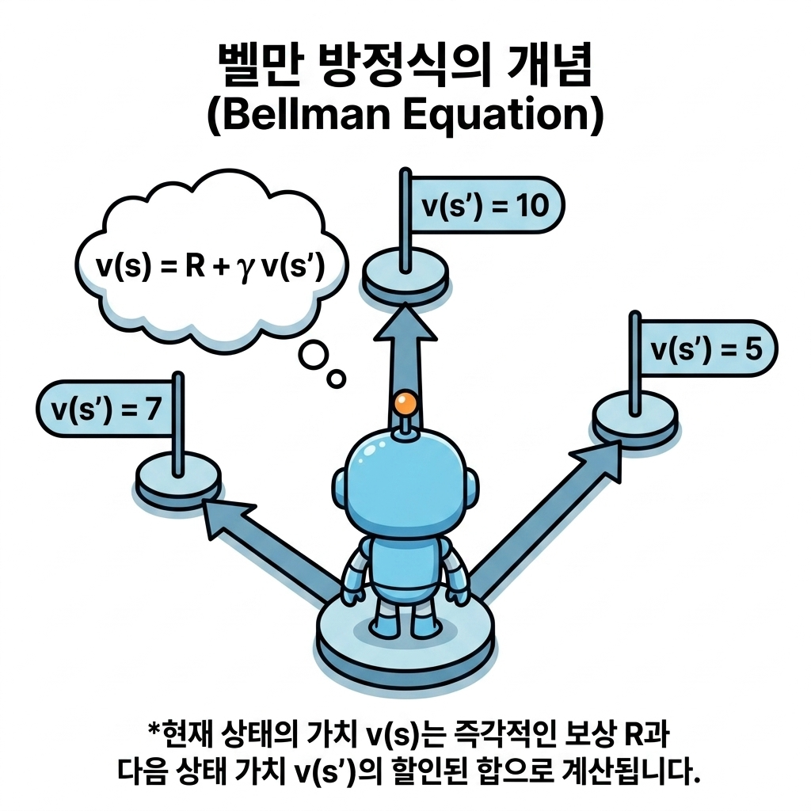

# 6강 벨만 방정식

**그림 06-0** 현재 상태의 진짜 가치(Present Value)와, 한 걸음 나아간 다음 상태의 가치(Future Value) 및 즉각 보상(Reward)이 완벽한 수평을 이루는 천칭 저울을 설명하는 지니와 도로시

벨만 방정식(Bellman Equation)은 **"현재 상태의 가치(점수)는, 한 걸음 내딛으며 얻는 즉시 보상과 그 후 마주할 다음 상태의 가치를 할인율만큼 곱해서 더한 값의 기댓값과 완벽히 동등하다"**는 재귀적 관계식입니다. 지니가 띄워준 신비한 천칭 저울처럼, 현재와 미래의 점수가 완벽한 수평을 이루는 벨만 방정식의 핵심 법칙을 6강에서 쉽게 파헤쳐봅시다!

---

우리가 5강에서 다루었던 **마르코프 결정 과정(MDP)**에서는 환경과 에이전트가 주고받는 상호작용 피드백 루프를 수식으로 정의하고, 장기적인 기대 수익 총합을 나타내는 **상태 가치 함수**에 대해 배웠습니다.

하지만 모든 미래 경로로 분기되어 넓게 퍼져나가는 확률적 상황에서 가치 함수를 실제로 계산하는 것은 매우 복잡하고 어렵습니다. 

> [!NOTE]
> **잠깐 복습! 가치 함수(Value Function)란 무엇일까요?**
> - **가치 함수(Value Function)**는 쉽게 말해 **"내가 지금 이 상태(위치)에 있으면 앞으로 평균적으로 보상을 얼마나 많이 얻을 수 있을까?"**를 점수로 평가해 놓은 표입니다.
>
> 또한 가치함수는 크게 **상태**와 **행동** 2가지로 구분됩니다.
>
> - **상태 가치 함수 *v*π(*s*)**: 현재 위치 *s*에서 시작하여, 앞으로 정해진 규칙(정책 π)대로 움직였을 때 기대되는 미래 보상들의 총합(기댓값)입니다.
> - **행동 가치 함수 *q*π(*s*, *a*)**: 현재 위치 *s*에서 특정한 첫 번째 행동 *a*를 먼저 취한 뒤, 그 이후부터 규칙대로 움직였을 때 기대되는 미래 보상의 총합입니다.

이번 6강에서는 기대 수익을 무한히 더해가는 복잡한 계산식에서 벗어나, **'현재 상태의 가치'와 '다음 상태들의 가치' 사이의 관계식**으로 문제를 깔끔하게 정리하는 강화 학습의 중추적인 수식, **벨만 방정식(Bellman Equation)**의 원리를 학습합니다.

---

## 직관적으로 이해하는 벨만 방정식

우리가 학습시키는 귀여운 로봇(에이전트)이 한 지점에 서서 앞으로 갈 수 있는 여러 경로들을 바라보고 있습니다. 각 갈림길 끝에는 미래의 상태들이 기다리고 있으며, 그 **상태**들의 **가치**는 이미 계산되어 **평가표(상태 가치)로 기록**되어 있습니다.

벨만 방정식은 **"현재 서 있는 상태의 참 가치 v(s)는 당장 이 단계에서 얻는 즉각적인 보상 R과, 행동을 취해 도착할 다음 상태의 할인된 가치 v(s')의 합산 기대치와 같다"**는 점을 밝힙니다.

이 간단하고도 위대한 원리 덕분에 에이전트는 무한한 미래를 매번 처음부터 끝까지 가상 시뮬레이션할 필요 없이, **바로 이웃한 다음 상태의 가치 정보**만을 활용하여 실시간으로 자신의 상태 가치를 갱신하고 최적의 행동을 설계할 수 있게 됩니다.

---

## 학습 목표

이 단원을 충실히 공부하고 나면 아래 네 가지 중요한 강화 학습 질문에 명확하게 답할 수 있습니다!

1. **벨만 방정식(Bellman Equation)**을 통해 무한히 뻗어 나가는 가치 기댓값 계산 과정을 어떻게 유한한 **연립방정식으로 변환**하여 해결하는지 설명할 수 있다.
2. 상태 가치 함수와의 차이를 명확히 인지하고, 특정 상태에서 임의의 행동을 취했을 때의 가치를 평가하는 **행동 가치 함수(Q 함수)**의 의의와 수식을 이해한다.
3. 모든 가능한 정책 중에서 가장 정책의 기대 가치를 보장하는 **최적 상태 가치 함수**와 **최적 행동 가치 함수**의 수식 형태를 학습한다.
4. 정책이 '최적'이라는 특성과 최댓값 연산자(max)를 활용하여 기댓값 합산 기호를 단순화하는 **벨만 최적 방정식(Bellman Optimality Equation)**을 유도하고, 직접 연립방정식으로 풀어 최적 정책을 도출할 수 있다.

---

## 학습 목차

- [06.1 벨만 인물 소개와 사전 학습](./6_1_벨만_소개와_사전_학습/index.html)
  - 벨만 방정식의 역사적 창시 배경인 리처드 벨만의 RAND 연구소 시절 흥미로운 예산 비화와 최적성 원리, 그리고 본 장의 수식을 풀기 위한 확률 및 기댓값 개념을 선행 학습합니다.
- [06.2 벨만 방정식 도출](./6_2_벨만_방정식_도출/index.html)
  - 주사위와 동전 예제를 통해 확률과 기대 보상을 구하는 과정을 복습하고, 가치 함수의 정의식으로부터 이웃 상태 간의 재귀적 관계를 나타내는 벨만 방정식을 유도합니다.
- [06.3 벨만 방정식의 예](./6_3_벨만_방정식의_예/index.html)
  - 두 칸짜리 초소형 그리드 월드 문제에 무작위 정책을 적용하여 벨만 방정식을 세우고, 이를 연립일차방정식으로 변환하여 실제 가치 함수 값을 구출해 봅니다.
- [06.4 행동 가치 함수(Q 함수)와 벨만 방정식](./6_4_행동_가치_함수_Q_함수와_벨만_방정식/index.html)
  - 상태뿐만 아니라 행동까지 사전에 선택 조건으로 부여하는 행동 가치 함수 q_π(s, a)를 새로 정의하고, 상태 가치 함수와의 상호 전환 및 Q 함수 전용 벨만 방정식을 유도합니다.
- [06.5 벨만 최적 방정식](./6_5_벨만_최적_방정식/index.html)
  - 가장 우수한 성과를 보장하는 최적 정책의 성질을 활용하여, 기대 가치 합산 기호를 행동 결정의 최댓값(max) 연산으로 단순화시킨 최적 상태/행동 가치 함수의 벨만 최적 방정식을 배웁니다.
- [06.6 벨만 최적 방정식의 예](./6_6_벨만_최적_방정식의_예/index.html)
  - 두 칸짜리 그리드 월드에 비선형 벨만 최적 방정식을 대입해 비선형 연립방정식을 풀고, 얻어진 최적 가치 표를 바탕으로 에이전트의 최종 최적 결정적 정책을 수립해 봅니다.
- [06.7 정리](./6_7_정리/index.html)
  - 6강에서 배운 벨만 방정식 및 벨만 최적 방정식의 핵심 수식들을 다시 한 번 표로 대조해 보며 지식을 확고히 다집니다.

---

## 학습 정리

1. **벨만 방정식의 선형 관계**: 현재 상태의 가치 *v**π*(*s*)는 즉각적인 기대 보상과 할인율 *γ*가 적용된 다음 상태들의 가치 *v**π*(*s'*)에 대한 가중 기대 합산식으로 정의되며, 모든 상태와 모든 정책에 대해 항상 성립합니다.
2. **행동 가치 함수(Q 함수)**: 상태 *s*에서 특정 행동 *a*를 강제로 선택한 후, 그 다음 단계부터 정책 *π*를 따랐을 때 얻을 기대 수익 *q**π*(*s*, *a*)를 뜻합니다. 이는 *v**π*(*s*) = $\sum_a$ *π*(*a* | *s*)*q**π*(*s*, *a*)의 관계로 상태 가치 함수와 이어집니다.
3. **벨만 최적 방정식의 비선형성**: 최적 정책 *π*&#42; 하에서는 다음 상태 가치들의 합산이 가치가 가장 큰 행동만을 100% 선택하는 비선형 연산자 $\max_a$로 대체되어 $v_*(s) = \max_a \sum_{s'} p(s' \mid s, a) \{r(s,a,s') + \gamma v_*(s')\}$ 형태로 단순화됩니다.
4. **최적 정책과 탐욕적 선택**: 최적 상태 가치 함수 *v*&#42;(*s*) 또는 최적 행동 가치 함수 *q*&#42;(*s*, *a*)를 알아내면, 단순히 다음 한 단계의 이웃 상태 가치를 극대화하도록 행동하는 탐욕적(Greedy) 선택을 통해 전체 최적 정책 $\mu_*$를 완벽하게 결정할 수 있습니다.
