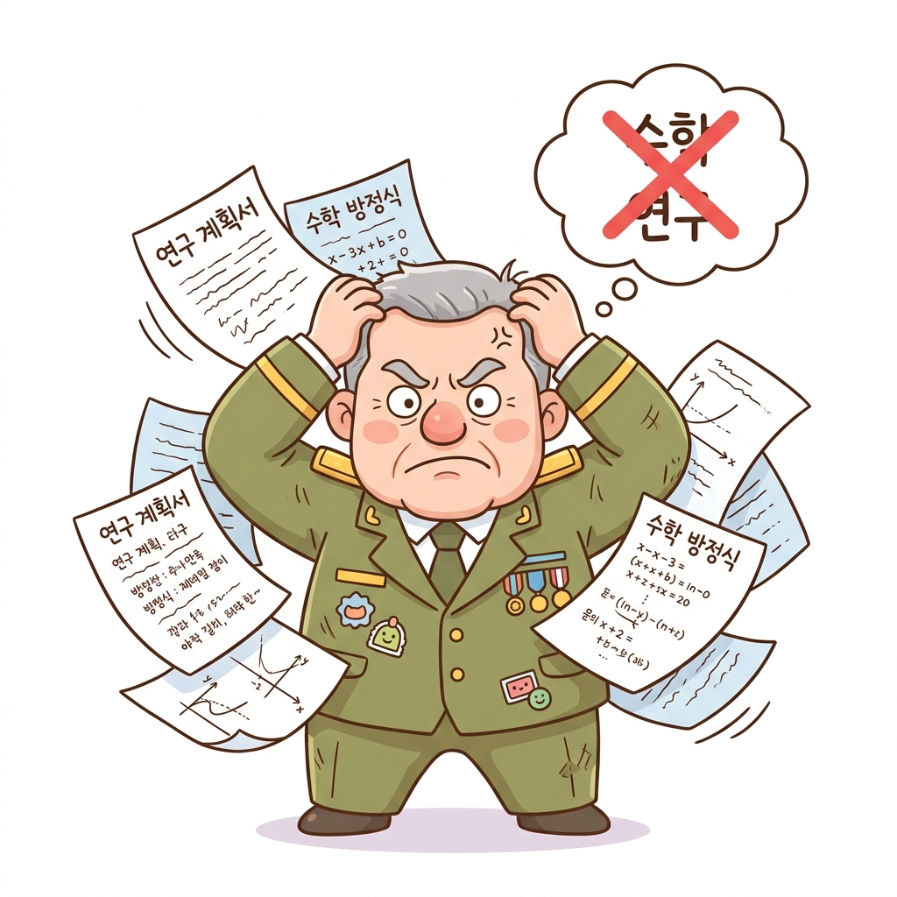

# 07.1 동적 프로그래밍의 유래

**그림 07-1-0** 국방부 장관이 극도로 싫어하는 단어인 '수학', '연구'를 지우고, 대신 '동적(Dynamic)'과 '프로그래밍(Programming)'이라는 이름 방패를 만드는 지니와 도로시

강화 학습과 컴퓨터 과학에서 아주 중요한 위치를 차지하는 **동적 프로그래밍(Dynamic Programming, DP)**이라는 이름은 처음 들었을 때 왠지 컴퓨터 메모리를 동적으로 쪼개어 코딩하는 고난도 최적화 기법처럼 느껴집니다. 

하지만 이 이름의 탄생에는 사실 리처드 벨만(Richard Bellman)이 미 국방부 장관으로부터 **연구 예산을 지켜내기 위해 기발한 잔머리(Public Relations)를 굴렸던 흥미진진한 비화**가 숨어 있습니다. 지니가 칠판 가득 요술로 띄워준 비하인드 역사를 구경하며, 딱딱한 최적화 이론 뒤에 숨은 위트 있는 유래부터 재미있게 알아봅시다!

---

---

# 07.1.1 흔히 오해하는 '프로그래밍'의 이미지

사람들이 '동적 프로그래밍'이라는 용어를 들었을 때 가장 흔히 상상하는 이미지는 컴퓨터 본체를 뜯어 하드웨어 회로를 땜질하거나 RAM 메모리를 극단적으로 분할하여 코드를 최적화하는 복잡한 저수준 컴퓨터 코딩 기술입니다.

그러나 벨만이 정의한 본래의 이름은 컴퓨터 구조나 코드를 동적으로 다루는 기술과는 거리가 멀었습니다.

---

# 07.1.2 연구비를 지켜내기 위한 벨만의 기발한 잔머리

이 최적화 수학 기법의 명명법은 철저하게 **"어떻게 해야 국방부 예산 삭감의 피바람을 맞지 않고 연구비를 지켜낼 것인가"**라는 생존 본능과 마케팅적 기획(PR)에서 도출되었습니다.

벨만은 연구비를 사수하기 위해, 정치가들이 절대 반대할 수 없는 두 개의 단어를 합쳐 마법 같은 방패 단어를 기획하기 시작했습니다.

---

# 07.1.3 예산 삭감의 칼바람과 찰스 윌슨 장관

1950년대 초, 리처드 벨만이 근무하던 랜드(RAND) 연구소는 미 공군의 예산 지원을 받고 있었습니다. 당시 미국의 국방부 장관은 제너럴 모터스(GM) CEO 출신인 **찰스 어윈 윌슨(Charles Erwin Wilson)**이었습니다.

윌슨 장관은 GM 시절의 실용주의적 비즈니스 관점에 사로잡혀 있어, 학문적 **'연구(Research)'**와 **'수학(Mathematics)'**이라는 단어만 들어도 진저리를 쳤습니다. 그는 실용적이지 않은 기초 수학 연구에 세금이 낭비된다고 여겨 관련 예산을 전부 잘라내려 했습니다.

벨만은 자신이 정립한 다단계 의사결정 수학적 기법을 국방부에 보고해야 하는 기안자 입장이었기에, 보고서 제목에 '수학'이나 '연구'라는 단어가 들어가는 순간 연구비가 완전히 잘릴 위기에 처했습니다.

---

# 07.1.4 단어의 완벽한 마케팅적 선택: Dynamic과 Programming

벨만은 관료들을 속이면서도 애국적이고 실용적인 기운을 뿜어내는 최고의 마케팅 키워드를 찾았고, 두 단어를 합성해 냈습니다.

1. **동적 (Dynamic)**: 
   벨만은 시간에 따라 상태가 시시각각 변화하는 시스템을 최적화하고 있었기에 'Dynamic'이라는 단어를 골랐습니다. 그는 자서전에서 다음과 같이 유쾌하게 회고했습니다.
   > *"나는 'Dynamic'이라는 단어를 선택했다. 왜냐하면 이 단어는 매우 활기차고 긍정적인 형용사이며, 그 어떤 정치가나 관료도 '동적(Dynamic)'이라는 말에 부정적인 반응을 보일 수 없기 때문이다. '동적'인 것에 반대할 사람이 세상에 어디 있겠는가?"*

2. **프로그래밍 (Programming)**:
   당시에는 '프로그래밍'이 컴퓨터 코딩을 뜻하는 말이 아니었습니다. 군사 행정 용어로 **'프로그램(계획, 일정표)'을 설계하고 자원을 분배하는 '의사결정 최적화 계획(Planning/Scheduling)'**을 뜻했습니다. 
   따라서 정치가들의 눈에는 복잡한 수학 연구가 아닌 **"국가 방위 활동의 일정을 짜는 실용적인 기획 도구"**로 보였습니다.

---

# 07.1.5 정치적 방패가 된 학문의 이름

벨만이 고안해 낸 **'동적 프로그래밍(Dynamic Programming)'**이라는 마법 같은 수식어는 장관과 정치인들의 예산 삭감 레이더망을 완벽하게 따돌렸습니다. 관료들은 이것이 국방 예산을 아끼고 효율적인 일정을 조율해 주는 최첨단 동적 국방 시스템으로 여겼고, 덕분에 벨만의 최적 제어 수학 연구는 예산 삭감 없이 무사히 완수될 수 있었습니다.

이처럼 동적 프로그래밍은 원래 **"수학 연구를 수호하기 위해 정치가의 가위질을 피해 만든 방패막이용 catchphrase"**에서 유래했습니다. 

이제 이 흥미로운 유래를 마음에 품고, 벨만이 연구비를 지켜내며 완성한 아름다운 동적 프로그래밍의 실체(정책 평가와 정책 개선)를 향해 본격적으로 나아가 봅시다!
