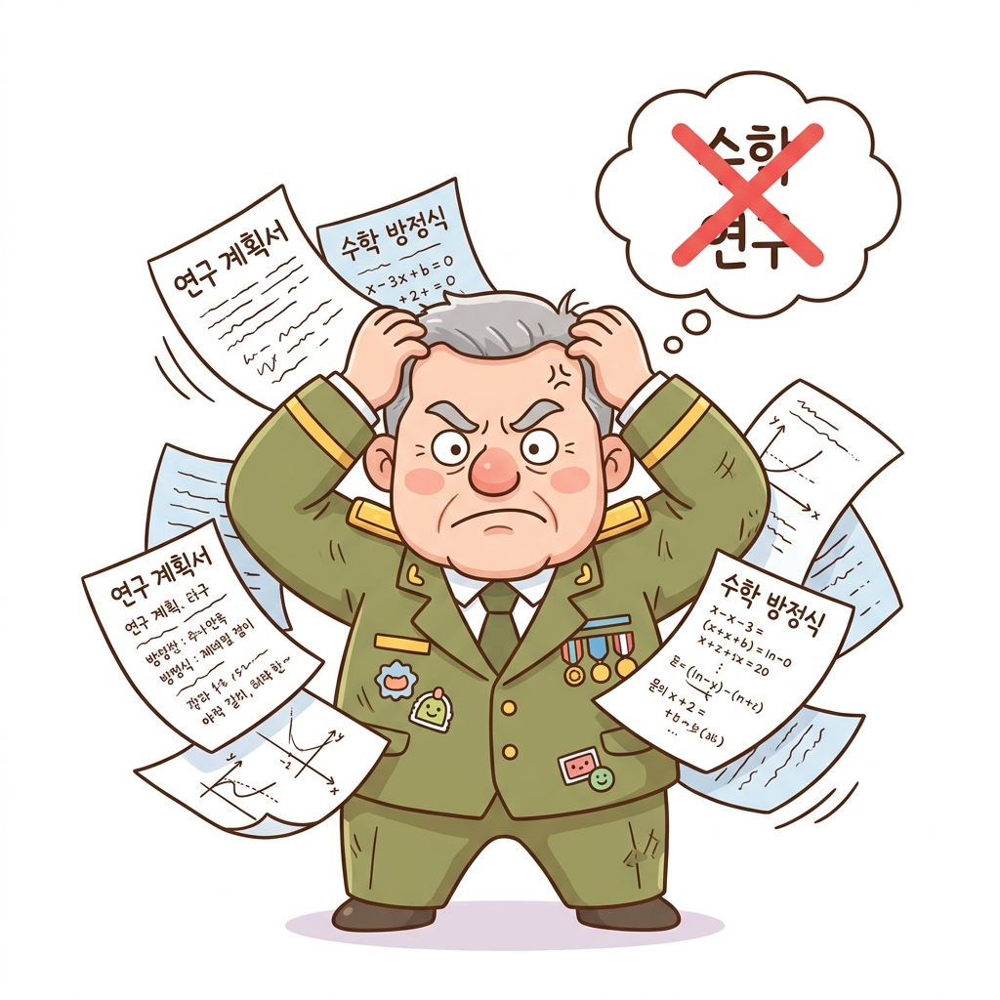
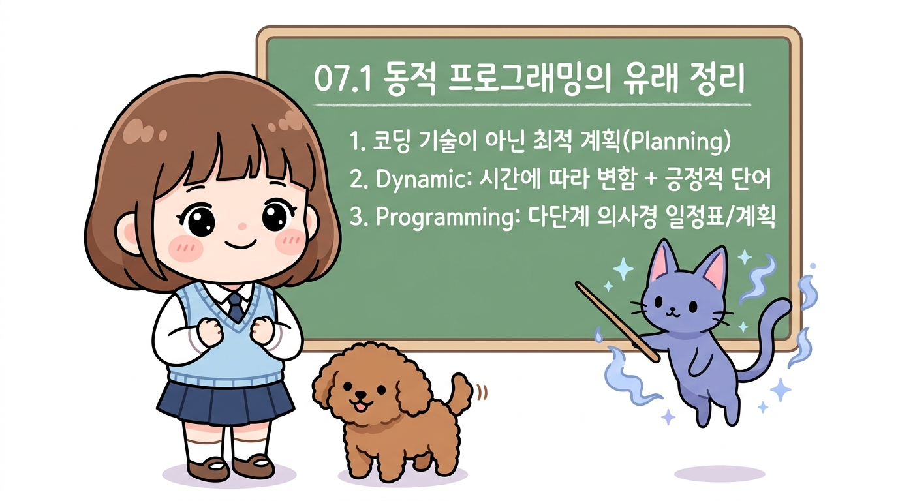

# 07.1 동적 프로그래밍의 유래
## 07.1 동적 프로그래밍(DP)의 시작과 호기심

컴퓨터 과학과 강화학습의 핵심 주춧돌, 동적 프로그래밍(Dynamic Programming)

- **동적 프로그래밍(Dynamic Programming, DP)**:
  - 강화학습과 컴퓨터 과학 전반에서 가장 중요한 최적화 알고리즘
  - 벨만 방정식을 풀어 최적 가치와 최적 정책을 계산하는 핵심 기초 이론
- **이름에서 느껴지는 첫인상**:
  - 메모리를 동적으로 할당하고 코드를 고난도로 최적화하는 저수준 컴퓨터 코딩 기술?
- **숨겨진 흥미진진한 비화**:
  - 딱딱한 수학 이론 뒤에 숨은 리처드 벨만(Richard Bellman)의 기발한 생존 전략과 위트 있는 작명 비하인드 스토리

> 여러분, 반갑습니다. 오늘부터 우리는 강화학습의 이론적 토대이자 컴퓨터 과학 역사에서 가장 위대한 최적화 기법 중 하나인 '제7장 동적 프로그래밍', 즉 다이내믹 프로그래밍(DP)의 세계로 들어섭니다. 흔히 '동적 프로그래밍'이라는 말을 처음 들으면 어떤 생각이 드시나요? 아마 컴퓨터 공학을 전공하신 분들이라면 C언어나 파이썬에서 메모리를 동적으로 쪼개고 코드를 최적화하는 복잡한 하드웨어 프로그래밍을 먼저 떠올리기 쉽습니다. 하지만 놀랍게도 이 거창하고 멋진 이름 뒤에는 1950년대 냉전 시절, 한 천재 수학자가 연구비를 지켜내기 위해 정치가와 관료들을 상대로 기발한 잔머리를 굴렸던 아주 유쾌하고 흥미진진한 역사적 비화가 숨어 있습니다. 오늘은 본격적인 수식으로 들어가기 전에, 이 매력적인 이름이 어떻게 탄생했는지 그 유래부터 편안하고 재미있게 살펴보겠습니다.

---

# 07.1 동적 프로그래밍의 유래
## 07.1 동적 프로그래밍의 탄생 비화

국방부 장관의 예산 삭감 칼바람을 막아선 이름 방패

**그림 07-1-0** 국방부 장관이 극도로 싫어하는 단어인 '수학', '연구'를 지우고, 대신 '동적(Dynamic)'과 '프로그래밍(Programming)'이라는 이름 방패를 만드는 지니와 도로시

- **리처드 벨만(Richard Bellman)의 절체절명의 위기**:
  - 미 국방부 장관의 기초 과학 연구비 대규모 삭감 정책
  - '수학'이나 '연구'라는 단어만 들어가도 예산 전액 삭감 위기
- **기발한 홍보(PR) 전략**:
  - 정치가들이 절대 반대할 수 없는 무적의 키워드 기획

> 화면의 그림을 보시면 우리 친구 지니와 도로시가 칠판 가득 적힌 '수학'과 '연구'라는 단어를 열심히 지우고 있습니다. 그리고 그 위에 '동적'과 '프로그래밍'이라는 멋진 글자를 새겨 넣으며 단단한 방패를 만들고 있죠. 1950년대 초, 최적 제어 이론의 대가였던 리처드 벨만 교수는 미국의 유명한 싱크탱크인 랜드(RAND) 연구소에서 근무하고 있었습니다. 당시 미 국방부에는 실용적이지 않은 기초 수학 연구에 세금이 낭비되는 것을 극도로 혐오하던 장관이 부임했는데요. 벨만은 자신이 평생을 바쳐 연구한 다단계 의사결정 수학 이론이 예산 삭감의 피바람을 맞아 사장될 위기에 처하자, 정치가들의 시비를 원천 차단할 수 있는 마법 같은 이름 방패를 고민하게 되었습니다. 과연 벨만은 어떤 기발한 아이디어로 연구비를 지켜냈을까요?

---

# 07.1 동적 프로그래밍의 유래
## 07.1.1 흔히 오해하는 '프로그래밍'의 이미지

대중들이 흔히 상상하는 저수준 컴퓨터 코딩 기술

- **일반적인 오해 (Misconception)**:
  - 컴퓨터 본체를 뜯어 하드웨어 회로를 납땜하는 작업
  - RAM 메모리를 극단적으로 분할하여 실행 속도를 높이는 고난도 C/C++ 최적화
  - 런타임(Runtime) 시점에 동적으로 라이브러리를 링크하거나 코드를 생성하는 기술
- **실제 본질**:
  - 벨만이 정의한 '프로그래밍'은 컴퓨터 구조나 소스 코드 작성과는 완전히 거리가 먼 개념이었습니다.

> 이번 슬라이드의 그림을 보시면 도로시가 머릿속으로 컴퓨터 본체를 뜯어내고 RAM 메모리를 쪼개가며 복잡하게 코딩하는 모습을 상상하고 있습니다. 실제로 많은 학생들이 '동적 프로그래밍'이라는 용어를 처음 마주했을 때 이와 똑같은 오해를 하곤 합니다. 컴퓨터 메모리 힙 영역을 '동적 할당'하듯이, 프로그램 실행 중에 코드를 동적으로 조작하거나 메모리를 절약하는 저수준 소프트웨어 엔지니어링 기법으로 착각하는 것이죠. 하지만 단언컨대 벨만이 정립한 동적 프로그래밍은 컴퓨터 하드웨어 구조나 소프트웨어 코딩 기술과는 근본적으로 아무런 관련이 없습니다. 그렇다면 벨만은 대체 왜 컴퓨터 코딩과 무관한 이론에 '프로그래밍'이라는 이름을 붙였을까요?

---

# 07.1 동적 프로그래밍의 유래
## 07.1.1 컴퓨터 공학이 아닌 최적화 수학 기법

다단계 의사결정 과정을 푸는 순수 수학적 알고리즘

- **동적 프로그래밍의 진짜 정체**:
  - 복잡한 전체 문제를 여러 개의 작은 부분 문제(Subproblems)로 나누어 해결하는 최적화 수학 기법
  - 시간에 따라 변화하는 환경에서 최적의 결정을 연속적으로 내리는 **다단계 의사결정 이론(Multi-stage Decision Process)**
- **그렇다면 왜 '동적'과 '프로그래밍'인가?**:
  - 컴퓨터가 대중화되기도 전인 1950년대 초에 왜 이런 컴퓨터스러운 이름이 붙었을까?
  - 이 질문에 대한 답은 컴퓨터 과학 연구실이 아닌, 당시 워싱턴 정계와 펜타곤의 정치적 역학 관계 속에서 찾을 수 있습니다.

> 그렇습니다. 동적 프로그래밍의 진짜 정체는 컴퓨터 코딩 기술이 아니라, 복잡하게 얽힌 거대한 문제를 작은 단위의 하위 문제들로 쪼개어 단계별로 해결해 나가는 순수 최적화 수학 기법입니다. 우리가 제6장에서 배웠던 벨만 최적 방정식처럼, 시간에 따라 순차적으로 진행되는 다단계 의사결정 과정을 수학적으로 완벽하게 풀어내는 알고리즘인 것이죠. 그런데 흥미로운 점은, 오늘날 우리가 쓰는 현대적인 디지털 컴퓨터가 제대로 보급되기도 전인 1950년대 초에 왜 하필 '프로그래밍'이라는 단어가 붙었느냐는 점입니다. 이 수수께끼를 풀기 위해서는 우리는 1950년대 냉전 시대의 미국 워싱턴 정계와 펜타곤 국방부 청사로 시간 여행을 떠나야 합니다.

---

# 07.1 동적 프로그래밍의 유래
## 07.1.2 연구비를 지켜내기 위한 벨만의 생존 전략

예산 삭감의 칼바람을 피하기 위한 브레인스토밍

- **연구 책임자로서의 절박한 생존 본능**:
  - "어떻게 해야 국방부의 예산 삭감 칼날을 피하고 연구팀의 연구비를 사수할 것인가?"
- **철저한 홍보 및 마케팅적 작명 기획 (Public Relations)**:
  - 딱딱하고 학술적인 명칭 대신, 관료들이 반박할 수 없는 단어 탐색
  - 정치가들의 귀에는 지극히 실용적이고 애국적으로 들리는 매력적인 수식어 발굴

> 그림을 보시면 연구실 책상에 앉은 리처드 벨만이 칠판에 적힌 단어들을 보며 깊은 고뇌에 빠져 있습니다. '수학(Mathematics)'과 '연구(Research)'에는 커다란 빨간색 엑스표가 쳐져 있고, 대신 '동적(Dynamic)'과 '프로그래밍(Programming)'이라는 단어에 동그라미를 치고 있죠. 연구자에게 연구비란 마치 생명수와도 같습니다. 아무리 위대한 수학적 이론을 발견했더라도 당장 연구소가 폐쇄되고 연구비가 전액 삭감된다면 연구를 지속할 수 없기 때문입니다. 벨만은 자신의 학문적 자존심을 내세우는 대신, 관료들의 눈높이에 맞춘 고도의 마케팅적 작명 전략을 세우기로 결심합니다. 정치인들이 도저히 반대할 수 없는 무적의 키워드를 찾기 시작한 것입니다.

---

# 07.1 동적 프로그래밍의 유래
## 07.1.3 예산 삭감의 칼바람과 찰스 윌슨 장관

1950년대 초 랜드(RAND) 연구소와 제너럴 모터스 출신 국방부 장관

- **역사적 배경**:
  - 1950년대 초, 리처드 벨만은 미 공군의 전폭적인 지원을 받던 **랜드(RAND) 연구소**에 재직 중
- **찰스 어윈 윌슨(Charles Erwin Wilson) 미 국방부 장관**:
  - 미국 최대의 자동차 제조 기업 제너럴 모터스(GM) CEO 출신
  - 극단적인 비즈니스 실용주의자: "세금으로 기초 수학을 연구하는 것은 돈 낭비다!"
  - **'연구(Research)'**와 **'수학(Mathematics)'**이라는 단어만 들어도 격노하며 예산을 전액 삭감

> 당시 상황을 조금 더 구체적으로 살펴보겠습니다. 1950년대 초 벨만이 몸담고 있던 랜드 연구소는 미 공군의 예산 지원으로 운영되는 핵심 싱크탱크였습니다. 그런데 당시 새롭게 취임한 미국의 국방부 장관이 누구였냐면, 제너럴 모터스(GM)의 최고경영자 출신인 찰스 어윈 윌슨이었습니다. 윌슨 장관은 기업 경영자 출신답게 철저한 비용 절감과 실용주의 노선을 걸었습니다. 그는 공장의 생산 라인처럼 눈앞에 당장 손에 잡히는 결과물이 나오지 않는 순수 학문 연구를 극도로 혐오했습니다. 복잡한 기호로 가득 찬 수학 공식 서류를 보면 머리를 쥐어뜯으며 화를 냈고, 세금을 낭비하는 '수학 연구' 예산을 닥치는 대로 잘라내기 시작했습니다.

---

# 07.1 동적 프로그래밍의 유래
## 07.1.3 기안자의 딜레마: '수학'과 '연구'를 숨겨라

정치적 검열 속에서 탄생해야 했던 새로운 학문의 이름

- **기안자 벨만의 절체절명의 딜레마**:
  - 벨만이 개발한 이론의 본질: "다단계 의사결정에 관한 수학적 최적 제어 연구"
  - 보고서 제목에 **'수학(Mathematics)'**이나 **'연구(Research)'**라는 단어가 단 한 글자라도 들어가는 순간, 장관의 결재 서류함에서 즉시 반려 및 예산 삭감 확정!
- **생존을 위한 작명 조건**:
  - 1. 정치인과 관료들이 감히 흠잡거나 반대할 수 없을 정도로 긍정적이고 진취적일 것
  - 2. 순수 수학이 아닌, 마치 군사 및 국방 활동을 효율적으로 기획하는 실용적 도구처럼 보일 것

> 벨만의 입장이 얼마나 곤혹스러웠을지 한번 상상해 보십시오. 자신이 공들여 정립한 연구 성과는 엄연히 '다단계 의사결정에 대한 고도의 수학적 최적화 연구'였습니다. 하지만 보고서 제목에 '수학'이나 '연구'라는 단어를 쓰는 순간, 윌슨 장관의 책상에 올라가자마자 빨간 줄이 그어지며 연구비가 완전히 끊길 판이었습니다. 결국 벨만은 두 가지 조건을 만족하는 새로운 명칭을 고안해야 했습니다. 첫째, 그 어떤 깐깐한 정치인이나 관료도 감히 반대할 수 없을 만큼 진취적이고 역동적인 단어여야 한다. 둘째, 순수 수학이 아니라 국가 방위의 실전 일정을 짜는 실용적인 기획 도구처럼 보여야 한다는 것이었습니다.

---

# 07.1 동적 프로그래밍의 유래
## 07.1.4 두 가지 마법의 단어: Dynamic과 Programming

관료들을 매료시킨 완벽한 마케팅적 결합

- **벨만의 기발한 합성어 제조**:
  - 활기찬 에너지의 결정체 **Dynamic (동적)**
  - 빈틈없는 최적 계획의 기어 휠 **Programming (프로그래밍/계획)**
- **마법 같은 화학 반응**:
  - 두 단어가 합쳐지자, 관료들의 눈에는 더 이상 골치 아픈 수학 연구가 아닌 **"시시각각 변하는 전장의 상황에 능동적으로 대처하는 국가 방위 최적화 시스템"**으로 둔갑!

> 화면의 매력적인 일러스트를 보시죠. 마법사 복장을 한 벨만이 한 손에는 눈부신 푸른빛의 에너지 결정인 'Dynamic'을 들고, 다른 한 손에는 정밀하게 맞물려 돌아가는 황금빛 기어 휠인 'Programming'을 들고 있습니다. 그리고 이 두 가지 원소를 마법의 도가니에 넣어 완벽한 '동적 프로그래밍' 방패를 빚어내고 있죠. 벨만은 정치가들의 심리를 꿰뚫어 보는 탁월한 마케터였습니다. 'Dynamic'이라는 진취적인 형용사와 'Programming'이라는 실용적인 명사를 결합하자, 관료들의 눈에는 이것이 예산을 낭비하는 수학 연구가 아니라, 미국 국방을 빈틈없이 지켜줄 최첨단 전략 기획 도구로 보이기 시작한 것입니다.

---

# 07.1 동적 프로그래밍의 유래
## 07.1.4 왜 'Dynamic(동적)'인가?

정치가들이 결코 반대할 수 없는 역동적인 형용사

- **수학적 본질**:
  - 정적(Static)인 문제를 푸는 것이 아니라, **시간의 흐름에 따라 상태가 시시각각 변화하는 동적 시스템**을 최적화한다는 수학적 의미를 완벽하게 내포
- **벨만의 유쾌한 회고 (자서전 <Eye of the Hurricane> 중)**:
  > *"나는 'Dynamic'이라는 단어를 선택했다. 왜냐하면 이 단어는 매우 활기차고 긍정적인 형용사이며, 그 어떤 정치가나 관료도 '동적(Dynamic)'이라는 말에 부정적인 반응을 보일 수 없기 때문이다. 세상에 '동적'인 것에 반대할 사람이 어디 있겠는가?"*
- **정치적 효과**:
  - '동적'이라는 말에 시비를 거는 관료는 곧 '시대에 뒤처진 게으른 자'로 비칠 수밖에 없음

> 그렇다면 왜 하필 첫 번째 단어가 'Dynamic', 즉 '동적'이었을까요? 여기에는 두 가지 절묘한 이유가 있습니다. 첫째는 수학적인 본질입니다. 벨만이 풀고자 했던 문제는 정지된 상태의 문제가 아니라, 시간에 따라 시스템의 상태가 시시각각 변화하는 동적 프로세스였기 때문에 수학적으로도 매우 정확한 표현이었습니다. 하지만 더 결정적인 것은 벨만 자신의 자서전에 적힌 솔직하고 유쾌한 고백입니다. 벨만은 자서전에서 이렇게 회고했습니다. "그 어떤 정치가나 관료도 '다이내믹'이라는 단어에 시비를 걸거나 반대할 수는 없다. 도대체 세상에 '동적이고 활기찬 것'에 반대할 정신 나간 관료가 어디 있겠는가?" 정치가들의 심리를 정조준한 완벽한 단어 선택이었던 셈입니다.

---

# 07.1 동적 프로그래밍의 유래
## 07.1.4 왜 'Programming(프로그래밍)'인가?

컴퓨터 코딩이 아닌 군사 행정에서의 '최적 계획 수립'

- **1950년대의 역사적 맥락**:
  - 당시 'Programming'은 소프트웨어 소스 코드 작성을 뜻하는 말이 아니었음
  - 군사 행정과 군수 물자 보급에서 **'자원을 최적으로 배분하고 일정을 수립하는 계획(Planning / Scheduling)'**을 의미
- **대표적 사례**:
  - 조지 단치히(George Dantzig)의 선형 계획법(Linear Programming, LP)과 동일한 어원
- **관료들의 시각**:
  - "이것은 국가 방위 활동의 작전 일정표(Program)를 짜는 매우 실용적인 국방 기획 도구로군!"
  - '수학'이라는 혐오 단어를 완전히 은폐하는 완벽한 가림막 달성

> 이제 두 번째 단어인 'Programming'의 비밀을 밝혀보겠습니다. 1950년대 당시에는 오늘날처럼 소프트웨어나 컴퓨터 코딩이라는 개념이 대중화되지 않았습니다. 당시 미 국방부와 군사 행정 조직에서 '프로그램(Program)'이란 바로 '군수 물자의 보급 일정표'나 '작전 계획(Schedule or Plan)'을 뜻하는 행정 용어였습니다. 여러분이 잘 아시는 선형 계획법(Linear Programming)의 프로그래밍도 컴퓨터 코딩이 아니라 최적의 자원 배분 계획을 뜻하듯이 말이죠. 따라서 관료들이 보기에 '프로그래밍'은 어려운 수학 이론이 아니라, 국방 예산을 아끼고 군사 작전의 최적 일정을 짜주는 지극히 실용적인 기획 도구로 보였던 것입니다.

---

# 07.1 동적 프로그래밍의 유래
## 07.1.5 장관의 가위질을 막아낸 무적의 방패

완벽한 마케팅으로 연구비를 사수하고 학문을 꽃피우다

- **예산 삭감 레이더망 완벽 회피**:
  - 찰스 윌슨 장관의 날카로운 예산 삭감 가위질을 '동적 프로그래밍' 방패로 완벽 방어
- **관료들의 호평**:
  - "우리 국방부의 다단계 작전 일정을 동적으로 최적화해 주는 훌륭한 시스템이군!"
- **역사적 성과**:
  - 벨만의 최적 제어 및 다단계 의사결정 연구는 단 한 푼의 예산 삭감 없이 무사히 완수
  - 훗날 인공지능과 강화학습의 위대한 주춧돌이 되는 알고리즘으로 탄생

> 그림을 보시면 찰스 윌슨 장관이 거대한 가위를 들고 예산을 자르려 달려들지만, 벨만이 들어 올린 '동적 프로그래밍' 방패에 가위가 힘없이 부딪치며 튕겨 나가고 있습니다. 벨만의 이 기발한 작명 마케팅은 대성공을 거두었습니다. 국방부 관료들은 보고서를 보며 "아, 이것은 우리 군의 다단계 작전 일정을 동적으로 최적화해 주는 훌륭한 기획 도구구나!"라며 감탄했고, 단 한 푼의 예산 삭감도 없이 벨만 연구팀의 연구비를 전액 승인해 주었습니다. 정치가의 무지함과 편견을 위트 있는 작명술로 극복하고, 인류의 위대한 수학적 유산을 무사히 지켜낸 순간이었습니다.

---

# 07.1 동적 프로그래밍의 유래
## 07.1.5 유래를 넘어 본질적인 DP의 세계로

생존을 위한 방패막이에서 컴퓨터 과학의 위대한 금자탑으로

- **방패막이용 Catchphrase에서 위대한 학문의 이름으로**:
  - 정치적 가위질을 피하기 위한 슬로건으로 출발했지만, 그 이름 속에 문제의 본질이 오롯이 보존됨
- **강화학습 7장에서 펼쳐질 본격적인 모험**:
  - 벨만이 지켜낸 이 알고리즘은 강화학습에서 어떻게 작동하는가?
  - 환경의 규칙(전이 확률 $P$, 보상 $R$)을 완벽히 알 때, 벨만 방정식을 반복 갱신하여 최적의 해를 구하는 방법
  - **정책 평가(Policy Evaluation)**와 **정책 개선(Policy Improvement)**의 메커니즘 예고

> 이처럼 동적 프로그래밍이라는 이름은 태생적으로 정치적 검열과 예산 삭감을 피하기 위한 일종의 '방패막이용 캐치프레이즈'에서 유래했습니다. 하지만 그 이름 속에는 '시간에 따라 변화하는 환경(Dynamic)'에서 '최적의 의사결정 계획을 수립한다(Programming)'는 본질적인 수학적 철학이 너무나도 절묘하게 녹아들어 있습니다. 이제 우리는 이 유쾌한 역사적 유래를 가슴에 품고, 벨만이 피땀 흘려 지켜낸 동적 프로그래밍의 진정한 수학적 실체를 향해 나아갈 것입니다. 다음 절부터는 환경의 모델을 알고 있을 때 벨만 방정식을 반복 갱신 규칙으로 활용하여 최적 정책을 찾아내는 강력한 DP의 원리를 본격적으로 탐구해 보겠습니다.

---

# 07.1 동적 프로그래밍의 유래
## 07.1.6 07.1장 학습 정리: 캐릭터 대화

지니, 도로시, 토토와 함께 정리하는 핵심 인사이트

**그림 07-1-6** 동적 프로그래밍의 탄생 비화와 진정한 의미를 완벽하게 정리한 지니와 도로시, 토토

- 👧 **도로시**: "동적 프로그래밍이 컴퓨터 코딩 최적화 기법인 줄 알았는데, 사실은 수학 연구비를 지키기 위한 벨만 교수님의 마법 같은 작명술이었다니 정말 흥미진진해!"
- 🐱 **지니**: "맞아! 하지만 그 이름 속에는 '시간에 따라 변화하는 상태를 다루고(Dynamic)', '다단계 의사결정의 최적 계획을 수립한다(Programming)'는 본질적인 수학적 의미가 아주 깊숙하게 담겨 있단다!"
- 🐶 **토토**: "멍멍! 이름의 진짜 뜻을 알았으니 이제 7장 모험도 자신 있어!"

> 화면의 정겨운 일러스트를 보시면 우리 친구 도로시와 지니, 토토가 환하게 웃으며 이번 절의 핵심을 정리하고 있습니다. 도로시가 이야기하듯 동적 프로그래밍은 컴퓨터 하드웨어 메모리를 다루는 기법이 아니라 연구비를 사수하기 위한 벨만의 눈부신 작명술이었습니다. 하지만 지니의 설명처럼 그 이름 속에는 시간에 따라 변하는 상태를 다루고 최적의 다단계 계획을 세운다는 학문의 본질이 고스란히 담겨 있죠. 이제 이름의 진짜 의미를 명확히 이해했으니, 7장의 나머지 알고리즘들도 훨씬 친근하고 자신감 있게 받아들일 수 있을 것입니다.

---

# 07.1 동적 프로그래밍의 유래
## 07.1.6 핵심 요약 ① 프로그래밍의 오해 & 연구비 사수 전략

동적 프로그래밍 탄생의 역사적 배경 2대 요약

- **1. '프로그래밍'에 대한 흔한 오해**:
  - 동적 프로그래밍(Dynamic Programming)의 '프로그래밍'은 C, 파이썬 같은 컴퓨터 소스 코드를 작성하거나 메모리를 동적으로 할당하는 저수준 코딩 엔지니어링 기술이 아닙니다.
- **2. 연구비 사수를 위한 리처드 벨만의 마케팅 전략**:
  - 1950년대 초 랜드(RAND) 연구소 시절, 순수 수학과 기초 연구를 극도로 혐오하던 찰스 윌슨 미 국방부 장관의 예산 삭감 칼바람을 피하기 위해, 관료들이 시비를 걸 수 없는 매력적인 단어들을 조합해 만든 정치적 방패막이 용어였습니다.

> 이번 장의 핵심 요약 첫 번째 슬라이드입니다. 우리가 꼭 기억해야 할 두 가지 역사적 사실이 정리되어 있습니다. 첫째, 동적 프로그래밍에서 프로그래밍은 절대 컴퓨터 코딩이 아니라는 점입니다. 둘째, 이 용어는 1950년대 초 랜드 연구소 시절, 수학 혐오증을 앓고 있던 제너럴 모터스 출신의 찰스 윌슨 국방부 장관의 예산 가위질로부터 소중한 최적화 수학 연구비를 지켜내기 위해 리처드 벨만이 고안한 고도의 마케팅 및 생존 전략이었다는 점입니다. 이 두 가지 역사적 배경을 기억해 두시면 앞으로 알고리즘을 공부하실 때 개념적 혼란을 완전히 방지할 수 있습니다.

---

# 07.1 동적 프로그래밍의 유래
## 07.1.6 핵심 요약 ② Dynamic & Programming의 본질과 강화학습의 주춧돌

두 단어의 진정한 의미와 강화학습에서의 결정적 역할

- **3. 두 단어의 진정한 의미와 결합**:
  - **동적 (Dynamic)**: 시간에 따라 상태가 시시각각 변화하는 다단계 프로세스를 최적화한다는 수학적 의미와 함께, 어떤 정치가도 거부할 수 없는 활기찬 형용사로 선택
  - **프로그래밍 (Programming)**: 당시 군사 행정 용어로 '최적의 계획표나 일정(Schedule/Plan)을 수립한다'는 의미로 쓰여 실용적 기획 도구의 인상 부여
- **4. 강화학습에서의 동적 프로그래밍의 본질**:
  - **"시간에 따라 순차 진행되는 다단계 의사결정 문제(MDP)를 수학적으로 쪼개어 최적의 해를 찾아내는 기법"**
  - 환경의 모델(전이 확률 $P$, 보상 $R$)을 완벽히 알 때, 벨만 방정식을 반복 갱신 규칙으로 삼아 최적 가치와 최적 정책을 완벽하게 계산하는 핵심 기초 알고리즘!

> 마지막 요약 슬라이드입니다. '동적'이라는 말은 시시각각 변화하는 시스템을 다룬다는 수학적 의미와 함께 정치가들의 흠잡기를 차단하는 역동적인 형용사였고, '프로그래밍'은 군사 작전의 최적 일정을 계획한다는 군사 행정 용어였습니다. 그리고 이것이 강화학습으로 넘어오면 바로 '마르코프 결정 과정(MDP)'이라는 다단계 의사결정 문제를 작은 하위 문제로 쪼개어 해결하는 가장 강력한 기초 알고리즘이 됩니다. 환경의 전이 확률과 보상을 알고 있을 때 벨만 방정식을 반복적으로 갱신하여 완벽한 최적 정책을 찾아내는 것, 이것이 바로 우리가 7장에서 본격적으로 배우게 될 동적 프로그래밍의 웅장한 실체입니다. 경청해 주셔서 감사합니다.
