# 07.2 동적 프로그래밍과 정책 평가

**그림 07-2-0** 환경 지도를 벨만 방정식으로 처리하여 진짜 가치 지도로 만들어내는 지니와 도로시
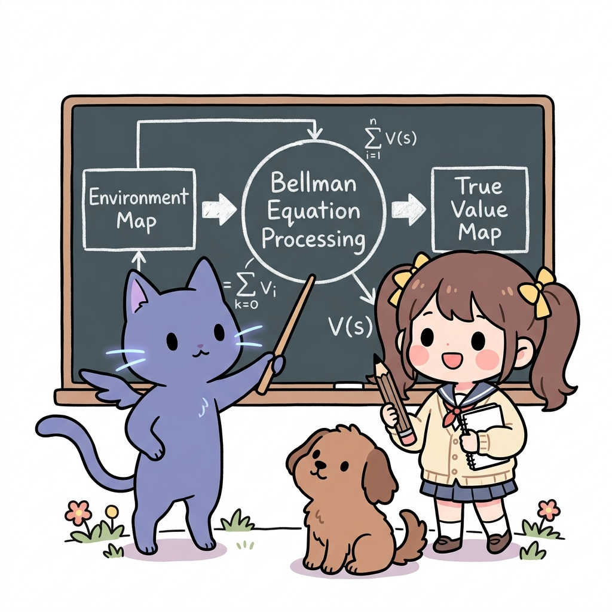

동적 프로그래밍(Dynamic Programming, DP)은 환경의 모든 정보(규칙)를 완벽하게 알고 있는 상태에서, 컴퓨터의 반복 연산을 통해 지도의 가치를 안전하고 정밀하게 계산해내는 방식입니다. 마법사 고양이 지니가 칠판 가득 그려준 개념도처럼, 우리가 가진 환경 정보를 어떻게 진짜 가치 지도로 탈바꿈시키는지 7장의 모험을 힘차게 시작해봅시다!

---

이전 장인 6강에서는 벨만 방정식에 대해 배웠습니다. 

벨만 방정식을 이용하면 연립방정식을 얻을 수 있고, 그 연립방정식을 풀 수 있다면 가치 함수를 구할 수 있습니다. 


이 흐름을 그림으로 표현해보죠.

**그림 07-1** 벨만 방정식을 이용하여 가치 함수를 구하는 흐름

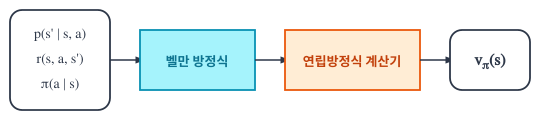

이와 같이 상태 전이 확률 *p*(*s'* | *s*, *a*), 보상 함수 *r*(*s*, *a*, *s'*), 정책 *π*(*a* | *s*)라는 세 가지 정보가 있다면 벨만 방정식을 이용해 연립방정식을 구할 수 있습니다. 

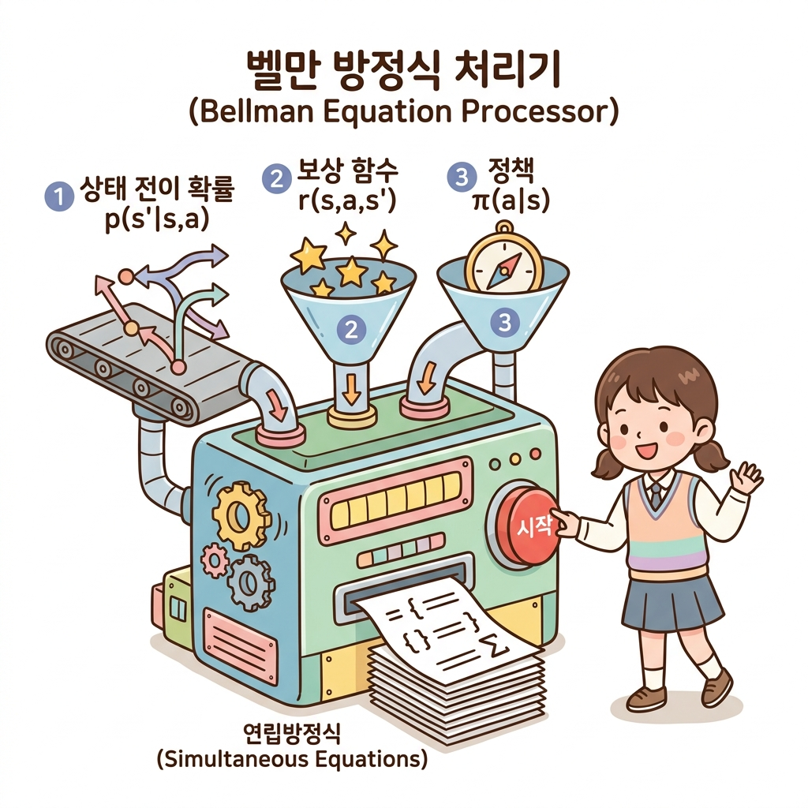


그리고 연립방정식을 푸는 프로그램(연립방정식 계산기)을 사용하여 가치 함수를 구할 수 있습니다. 


하지만 연립방정식을 직접 푸는 방식은 간단한 문제에서만 의미가 있습니다. 

상태와 행동 패턴의 수가 조금만 많아져도 감당할 수 없게 되죠. 그래서 등장한 것이 바로 **동적 프로그래밍**<sup>Dynamic Programming</sup> (DP) 혹은 **동적 계획법**입니다. 


동적 프로그래밍을 이용하면 상태와 행동의 수가 어느 정도 많아져도 가치 함수를 구할 수 있습니다. 


지금부터 동적 프로그래밍을 파헤쳐봅시다.


---


# 07.2 동적 프로그래밍과 정책 평가

강화 학습 문제에서는 종종 두 가지 문제를 해결해야 합니다. 

# 07.2.1 정책 평가와 정책 제어

# 07.2.1.1 두 가지 문제

바로 정책 평가와 정책 제어입니다.

* **정책 평가**<sup>policy evaluation</sup>는 정책 *π*가 주어졌을 때 그 정책의 가치 함수 *v*<sub>*π*</sub>(*s*) 또는 *q*<sub>*π*</sub>(*s*, *a*)를 구하는 문제입니다. 

* **정책 제어**<sup>policy control</sup>는 정책을 조정하여 최적 정책을 만들어내는 것을 말합니다.

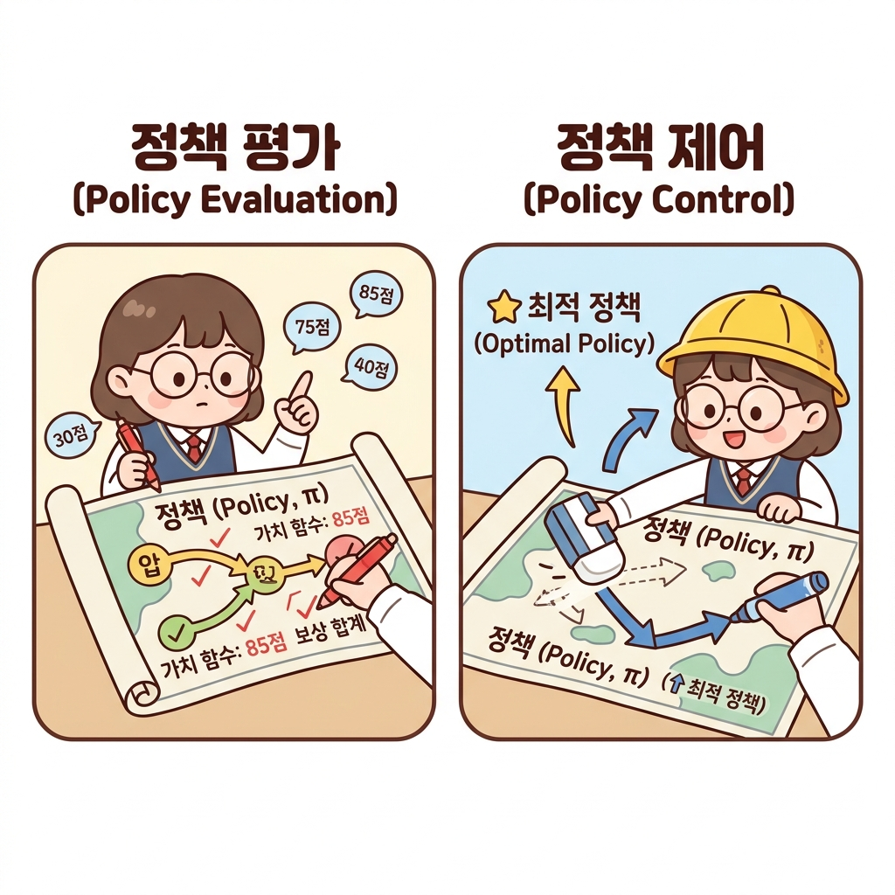

# 07.2.1.2 강화 학습의 목표


물론 강화 학습의 **궁극적인 목표는 정책 제어**입니다. 

하지만 첫 목표로 정책 평가부터 정복하는 경우가 많습니다. 대부분 문제에서 최적 정책을 직접 구하기는 매우 어렵기 때문이죠. 


그래서 이번 절에서는 동적 프로그래밍 알고리즘을 이용한 정책 평가 방법을 살펴보겠습니다.


---


# 07.2.2 동적 프로그래밍 기초

# 07.2.2.1 가치 함수의 정의와 벨만 방정식 복습

앞에서 **가치 함수**를 다음과 같이 정의했습니다.
  
v_{\pi}(s) = \mathbb{E}_{\pi} [ R_t + \gamma R_{t+1} + \gamma^2 R_{t+2} + \cdots \mid S_t = s ]
  


이렇게 **무한대**가 포함되어 있는 식은 일반적으로 계산할 수 없습니다.


 하지만 무한대에서 **탈출**하는 비법이 있으니, 바로 벨만 방정식입니다(식 06.1).


  
v_{\pi}(s) = \sum_{a, s'} \pi(a \mid s) p(s' \mid s, a) \{ r(s, a, s') + \gamma v_{\pi}(s') \}
  

[식 07.1]


벨만 방정식은 [식 07.1]과 같이 **'현재 상태 *s*의 가치 함수 *v*<sub>*π*</sub>(*s*)'**와 **'다음 상태 *s'*의 가치 함수 *v*<sub>*π*</sub>(*s'*)'**의 관계를 나타냅니다. 

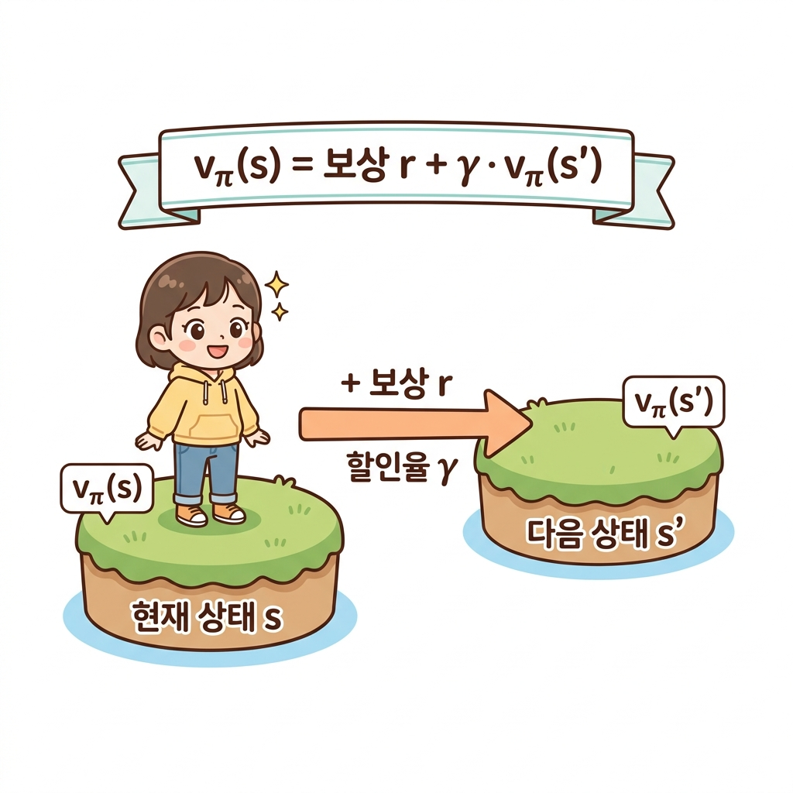


# 07.2.2.2 벨만 방정식을 이용한 가치 함수 갱신식

벨만 방정식은 많은 강화 학습 알고리즘에 중요한 기초를 제공합니다. DP를 사용한 방법도 벨만 방정식에서 파생되죠. 


바로 벨만 방정식을 '갱신식'으로 변형하는 것입니다. 

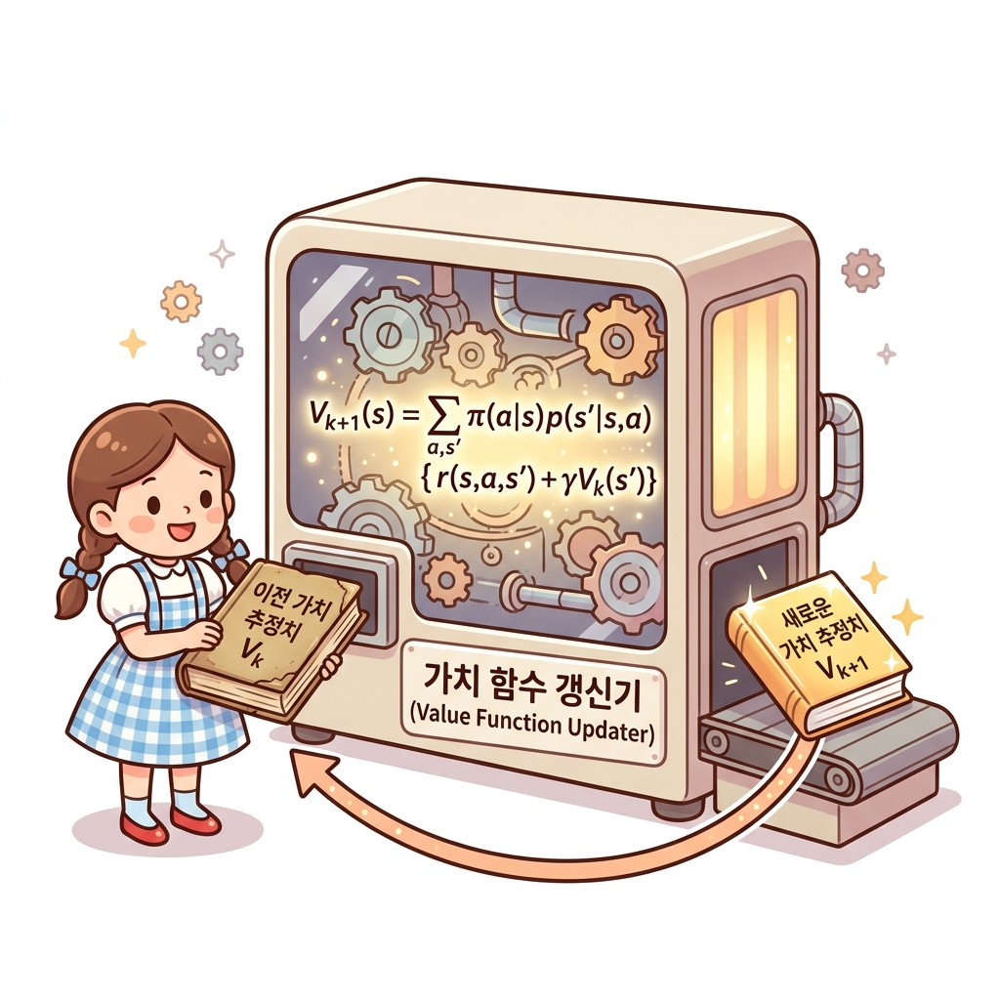


수식은 다음과 같습니다.
  
V_{k+1}(s) = \sum_{a, s'} \pi(a \mid s) p(s' \mid s, a) \{ r(s, a, s') + \gamma V_k(s') \}
  

[식 07.2]

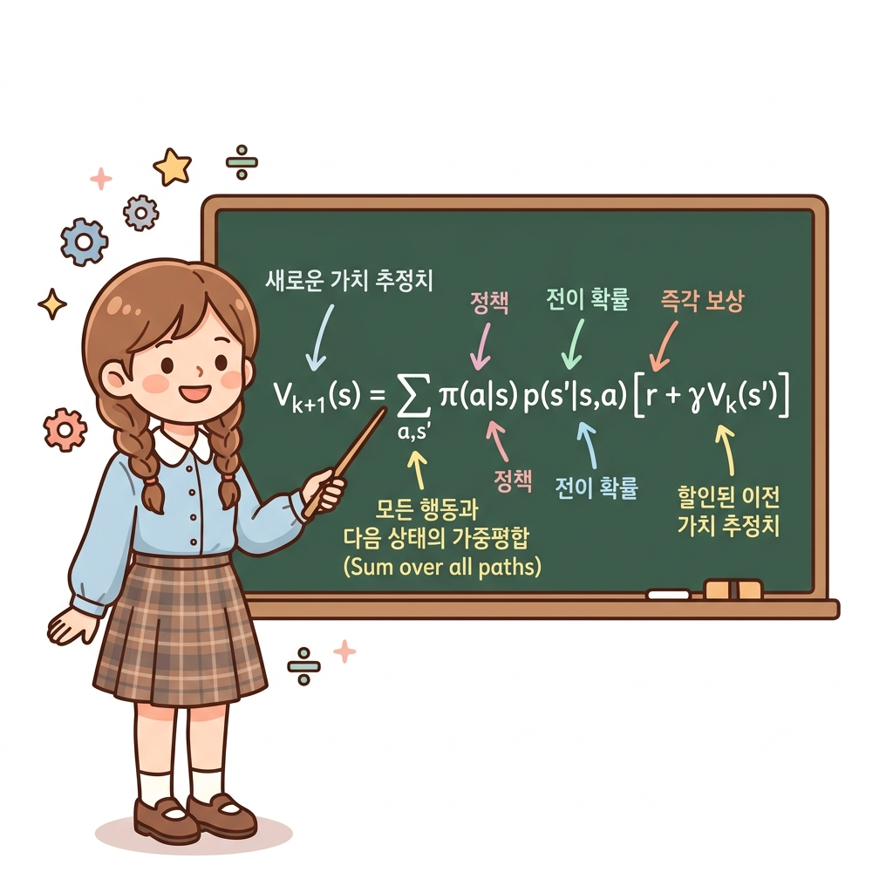


# 07.2.2.3 가치 함수의 추정치 표기 (V_k)

*V*<sub>*k*+1</sub>(*s*)는 *k*+1번째로 갱신된 가치 함수를 뜻하며 *k*번째로 갱신된 가치 함수는 *V*<sub>*k*</sub>(*s*)로 표기합니다. 이때 *V*<sub>*k*+1</sub>(*s*)와 *V*<sub>*k*</sub>(*s*)는 **'추정치'**라서 실제 가치 함수인 *v*(*s*)와 다릅니다. 그래서 **대문자 *V***로 표기합니다.


> **추정이란? (Estimation)**
> 
> 강화학습과 동적 프로그래밍에서 **'참값(True Value)'**은 우리가 최종적으로 알고 싶어 하는 수학적으로 완벽한 진짜 정답입니다. 하지만 학습 초기에는 이 진짜 값을 알 방법이 없습니다. 
> 
> 그래서 일단 임의의 값(예: 모든 방의 가치를 0점)으로 시작하여, 벨만 갱신식을 반복적으로 실행하면서 정답에 가깝도록 계속 값을 변경해 나갑니다. 이처럼 **'진짜 정답에 한 걸음씩 가깝게 다가가도록 어림잡아 짐작해 나가는 미완성의 값'**을 **추정치(Estimate)**라고 부릅니다.
> 
> 수학 기호로 표기할 때도 엄격하게 구분합니다:
> * **소문자 *v*<sub>*π*</sub>(*s*)**: 우리가 도달해야 하는 이론상의 고정된 진짜 정답 (**참값**)
> * **대문자 *V*<sub>*k*</sub>(*s*)**: 컴퓨터 메모리에 저장되어 반복 갱신을 거치며 계속 다듬어지고 변해가는 짐작값 (**추정치**)


# 07.2.2.4 추정치로 추정치를 개선하는 부트스트랩

[식 07.2]의 특징은 **한 단계 앞선 '다음 상태의 가치 함수 *V*<sub>*k*</sub>(*s'*)'의 값들을 이용(대입)하여, 지금 위치한 '지금 상태의 가치 함수 *V*<sub>*k*+1</sub>(*s*)'를 갱신**한다는 점입니다. (미래의 추정 가치를 끌어와 현재의 추정 가치를 정밀하게 고쳐 씁니다.)

그리고 이 식은 '추정치 *V*<sub>*k*</sub>(*s'*)'를 사용하여 '또 다른 추정치 *V*<sub>*k*+1</sub>(*s*)'를 개선합니다. 

이처럼 추정치를 사용하여 추정치를 개선하는 과정을 **부트스트랩**<sup>bootstrapping</sup>이라고 부릅니다.


> NOTE_ 부트스트랩은 신발(boot)을 신을 때 손가락으로 잡아당기는, 신발 뒤쪽에 달려 있는 고리 모양의 끈(strap)을 가리킵니다. 여기서 유래하여 다른 사람의 도움 없이 스스로 개선하는 과정을 뜻하는 의미로 쓰이고 있습니다.


# 07.2.2.5 반복적 정책 평가 알고리즘

이제 DP를 이용한 구체적인 알고리즘을 설명하겠습니다. 


먼저 *V*<sub>0</sub>(*s*)의 초깃값을 설정합니다. 

예를 들어 모든 상태에서 *V*<sub>0</sub>(*s*) = 0으로 초기화합니다. 

그리고 [식 07.2]를 이용하여 *V*<sub>0</sub>(*s*)에서 *V*<sub>1</sub>(*s*)로 갱신합니다. 이어서 *V*<sub>1</sub>(*s*)를 기반으로 *V*<sub>2</sub>(*s*)로 갱신합니다. 이 일을 반복하다 보면 최종 목표인 *V*<sub>*π*</sub>(*s*)에 가까워집니다. 

이 알고리즘을 **반복적 정책 평가**<sup>iterative policy evaluation</sup>라고 합니다.

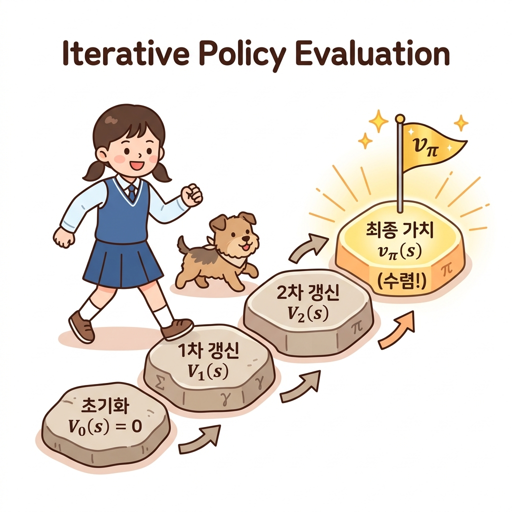


반복적 정책 평가 알고리즘을 실제 문제에 적용하려면 반복되는 갱신을 언젠가는 멈춰야 합니다. 

이때 갱신 횟수를 결정하는 기준으로 갱신된 양을 이용할 수 있습니다. 


이에 관한 예는 바로 뒤에서 설명할 것입니다. 

[식 07.2]에 따른 갱신을 반복하면 초기 가치 추정치 *V*<sub>0</sub>(*s*)가 어떤 엉뚱한 값으로 시작하더라도, 결국 최종 목표인 참 가치 함수 *v*<sub>*&pi;*</sub>(*s*)에 정확히 수렴한다는 사실은 수학적으로 이미 증명되어 있습니다. 

이를 보장하기 위해 만족해야 하는 핵심 조건은 다음과 같습니다.
1. **할인율 *&gamma;* < 1**: 할인율이 1보다 작으면 갱신을 거듭할 때마다 참값과의 오차(차이)가 매 단계마다 최소 *&gamma;*배(예: 0.9배) 이하로 줄어듭니다.
2. **유한한 상태 및 행동 공간**: 에이전트가 탐색할 상태(방)와 취할 수 있는 행동(선택지)의 개수가 끝없이 많지 않고 유한해야 합니다.

![가치 함수 수렴 원리(수축 사그림과 같이 각 상태에서 출발하여 취할 수 있는 행동은 **왼쪽(확률 0.5)**과 **오른쪽(확률 0.5)** 두 가지입니다.

우선 상태 ***L1*에서의 1차 가치 갱신 *V*<sub>1</sub>(*L1*)**을 구해보겠습니다.

1. **왼쪽으로 가는 경우 (확률 0.5)**:
   - 벽에 가로막혀 제자리 *L1*로 복귀하며, 벌점인 **보상 -1**을 받습니다.
   - 이때 도착한 다음 상태는 여전히 *L1*이므로, 우변에 대입할 이전 가치는 *V*<sub>0</sub>(*L1*) = 0이 됩니다.
   - 수식: `0.5 * (-1 + 0.9 * V_0(L1)) = 0.5 * (-1 + 0.9 * 0) = -0.5`
2. **오른쪽으로 가는 경우 (확률 0.5)**:
   - 다음 칸인 *L2* 상태로 한 칸 전진하며, 보너스인 **보상 +1**을 받습니다.
   - 도착한 다음 상태가 *L2*이므로, 대입할 이전 가치는 *V*<sub>0</sub>(*L2*) = 0이 됩니다.
   - 수식: `0.5 * (1 + 0.9 * V_0(L2)) = 0.5 * (1 + 0.9 * 0) = 0.5`

이 두 갈래 길에서 나온 가치들의 합이 바로 새롭게 갱신된 *V*<sub>1</sub>(*L1*)입니다.
  
\begin{aligned}
V_1(L1) &= 0.5 \{ -1 + 0.9 V_0(L1) \} + 0.5 \{ 1 + 0.9 V_0(L2) \} \\
&= 0.5 \cdot (-1 + 0.9 \cdot 0) + 0.5 \cdot (1 + 0.9 \cdot 0) \\
&= -0.5 + 0.5 \\
&= 0
\end{aligned}
  

---

동일한 방법으로 상태 ***L2*에서의 1차 가치 갱신 *V*<sub>1</sub>(*L2*)**도 구해봅시다.

1. **왼쪽으로 가는 경우 (확률 0.5)**:
   - 이전 칸인 *L1* 상태로 이동하며, 이때 받는 **보상은 0**입니다.
   - 도착한 다음 상태가 *L1*이므로, 대입할 이전 가치는 *V*<sub>0</sub>(*L1*) = 0이 됩니다.
   - 수식: `0.5 * (0 + 0.9 * V_0(L1)) = 0.5 * (0 + 0.9 * 0) = 0`
2. **오른쪽으로 가는 경우 (확률 0.5)**:
   - 벽에 부딪혀 제자리 *L2*에 머무르며, 벌점인 **보상 -1**을 받습니다.
   - 도착한 다음 상태가 *L2*이므로, 대입할 이전 가치는 *V*<sub>0</sub>(*L2*) = 0이 됩니다.
   - 수식: `0.5 * (-1 + 0.9 * V_0(L2)) = 0.5 * (-1 + 0.9 * 0) = -0.5`

두 행동의 결과를 합산하면 다음과 같습니다.
  
\begin{aligned}
V_1(L2) &= 0.5 \{ 0 + 0.9 V_0(L1) \} + 0.5 \{ -1 + 0.9 V_0(L2) \} \\
&= 0.5 \cdot (0 + 0.9 \cdot 0) + 0.5 \cdot (-1 + 0.9 \cdot 0) \\
&= 0 + (-0.5) \\
&= -0.5
\end{aligned}
  

이 모든 연산 과정을 일목요연하게 칠판 판서 형태로 요약한 그림이 바로 아래의 **그림 07-4.1**입니다. 수식이 복잡해 보여도 결국 각 방향으로 이동하면서 얻는 보상과 정책 확률의 단순한 곱하기와 더하기에 지나지 않습니다.

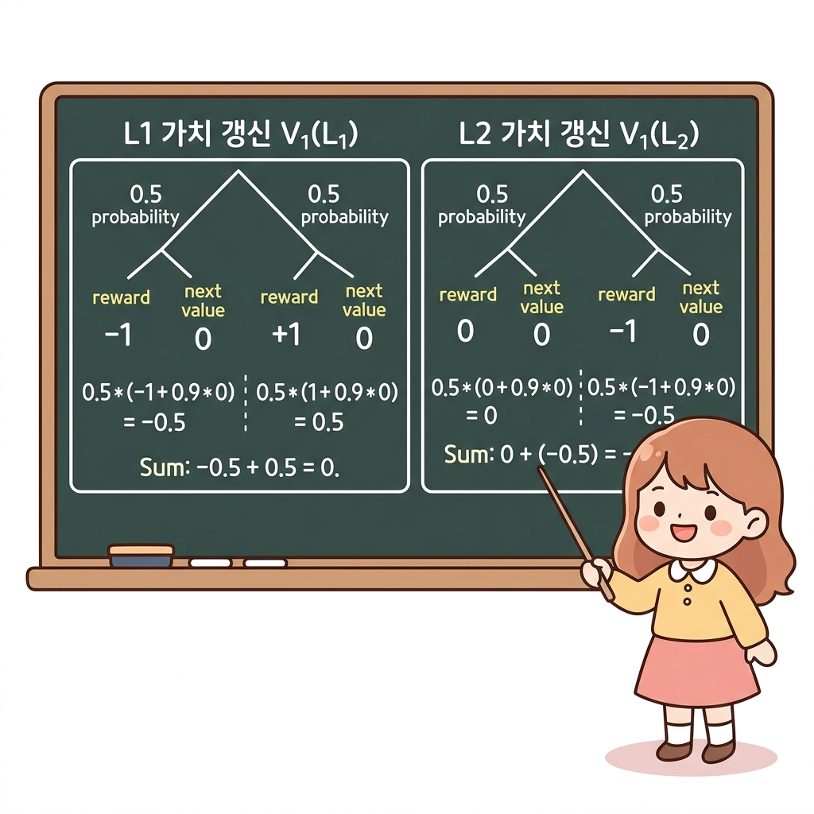

이것으로 모든 상태에 대한 가치 함수 갱신이 끝났습니다(이번 문제는 상태가 총 2개뿐입니다).하다면 다른 문헌<sup>[5]</sup>을 참고하기 바랍니다.

> NOTE_ 동적 프로그래밍(DP)은 특정한 성격을 지닌 알고리즘들의 총칭입니다. 대상 문제를 작은 문제로 나누어 답을 구하는 기법 전반을 말하죠. DP의 핵심은 '같은 계산을 두 번 하지 않는 것'입니다. 구현하는 방법에는 하향식<sup>top-down</sup>과 상향식<sup>bottom-up</sup>이 있습니다(하향식 방법은 메모이제이션<sup>memoization</sup>이라고도 합니다. 앞서 설명한 *V*<sub>0</sub>(*s*), *V*<sub>1</sub>(*s*)... 식으로 한 단계씩 증가하며 가치 함수를 갱신하는 방식은 상향식 방법입니다).
>
> 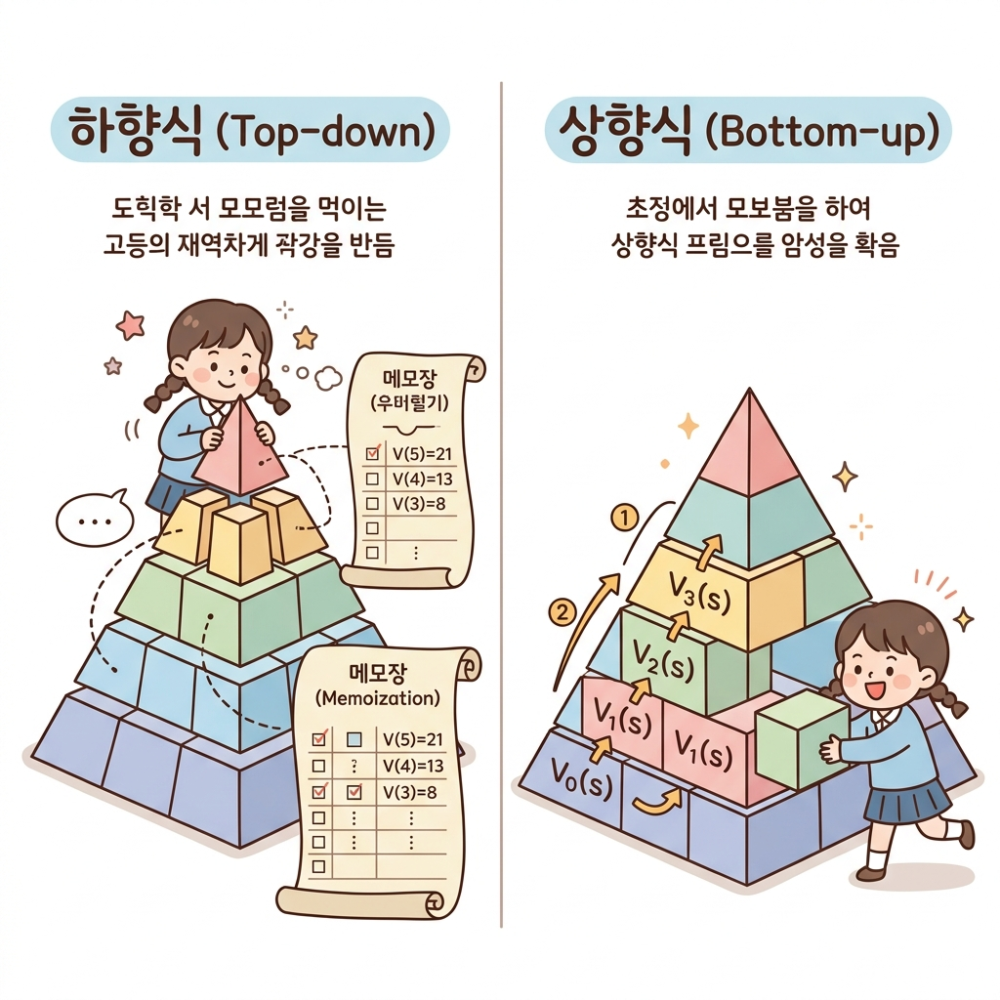


---


# 07.2.3 반복적 정책 평가 구현 (1) - 2개 딕셔너리 방식

'두 칸짜리 그리드 월드'를 예로 들어 반복적 정책 평가 알고리즘의 흐름을 살펴보겠습니다. 


[그림 07-2]의 문제를 생각해봅시다.

**그림 07-2** 두 칸짜리 그리드 월드(*L1*에서 *L2*로 이동하면 +1 보상, 벽에 부딪히면 -1 보상)

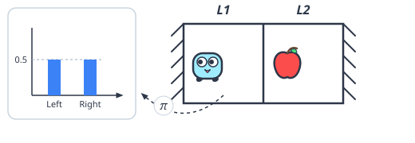

그림에서와 같이 에이전트는 무작위 정책 *π*에 따라 행동합니다(왼쪽과 오른쪽으로 이동할 확률이 각각 0.5). 


# 07.2.3.1 결정적 상태 전이 환경으로의 제약

> 💡 **상태 전이를 왜 결정적인 경우로 한정(제한)하여 문제를 풀까요?**
> 
> **1. 결정성은 그리드 크기와 무관합니다.**
> * **2칸짜리 그리드라도 확률적일 수 있습니다**: 만약 규칙에 "오른쪽으로 가려고 할 때, 10% 확률로 바닥에 미끄러져 제자리 *L1*에 머무른다"와 같은 예외적 물리 규칙이 있다면 그것은 확률적 전이 환경이 됩니다.
> * **100만 칸짜리 거대한 미로라도 결정적일 수 있습니다**: 미끄러짐이나 무작위 바람 없이 명령한 방향으로 언제나 100% 확률로 정확하게 한 칸 이동한다면 그것은 결정적 전이 환경입니다.
> 
> **2. 굳이 결정적 전이로 제한한 이유는 '수학적 단순함(학습 편의)' 때문입니다.**
> 처음부터 확률적 전이(바람의 저항이나 얼음판 미끄러짐 등 여러 상태로 흩어질 수 있는 복잡한 확률 *p*(*s'* &mid; *s*, *a*))를 대입하면, 수식을 계산할 때 곱해야 할 확률 값과 다음 상태에 대한 복잡한 합산 기호(&Sigma;<sub>*s'*</sub>)가 얽혀 연산이 너무 무겁고 복잡해집니다.
> 따라서 **"독자가 수학적 피로감 없이 알고리즘의 본질적인 동작 및 갱신 흐름(*V*<sub>0</sub> &rarr; *V*<sub>1</sub> &rarr; *V*<sub>2</sub> ...)을 직관적으로 배울 수 있도록, 가장 단순한 물리 규칙(결정적 전이)으로 환경을 제한하여 첫 실습 예제를 정의한 것"**입니다.
> 
> 즉, 이 문제에서 전이가 결정적인 이유는 칸수가 2칸이라서가 아니라, **"우리가 의도적으로 미끄러짐이나 무작위 오류가 전혀 없도록 제약 조건을 걸어 단순하게 문제를 정의했기 때문"**입니다.

**결정적 상태 전이**란, 에이전트가 어떤 상태 *s*에서 특정 행동 *a*를 취했을 때 바람이나 무작위성 같은 외부 변수가 개입하지 않도록 제한하여, **100%의 확률(확률 = 1.0)로 정해진 다음 상태 *s'*에 정확히 도착하게 만드는 것**을 의미합니다. 


예를 들어, 상태 *L1*에서 '오른쪽'으로 가는 행동을 취하면, 마치 기차가 철로를 따라 달리듯 100% 확률로 반드시 상태 *L2*에 안착합니다. 주사위(확률)에 따라 다른 엉뚱한 곳으로 빗나가거나 미끄러질 확률이 전혀 없는 상태를 말합니다.


수학적으로는 **다음 상태 *s'***가 확률 분포가 아니라 **고정된 함수 *s'* = *f*(*s*, *a*)**에 의해 단 하나로 고유하게 결정됩니다.

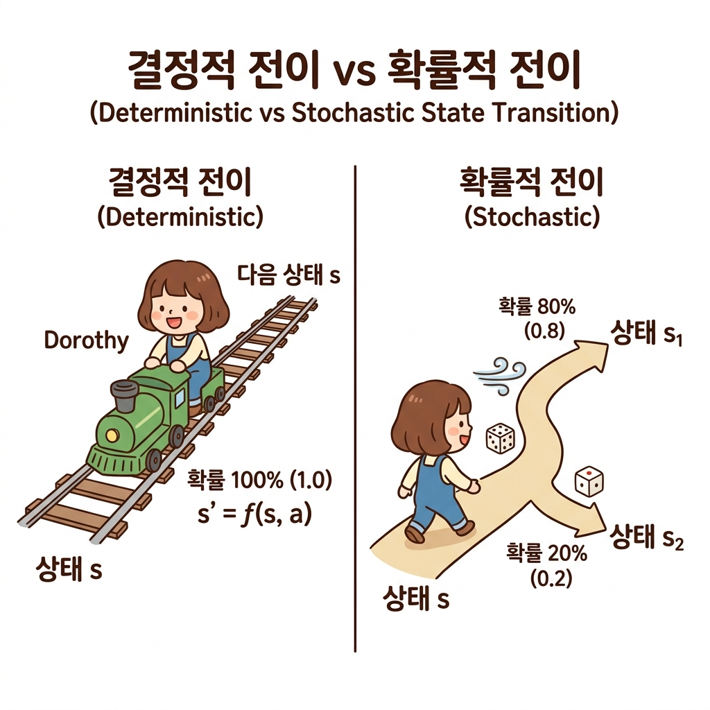

이처럼 다음 상태가 단 하나로 확정되면, 다음 상태 전이 확률인 *p*(*s'* &mid; *s*, *a*)의 값은 오직 실제 도착할 *s'* = *f*(*s*, *a*)에 대해서만 `1`이 되고, 나머지 다른 모든 상태에 대해서는 `0`이 됩니다. 


그 결과, 모든 다음 상태에 대해 합산(시그마)을 구하는 수식인 &Sigma;<sub>*s'*</sub>가 1에 대한 값으로 수축하면서 사라지게 되고, 오직 실제로 도달할 하나의 다음 상태 *s'*에 대해서만 가치를 평가하게 됩니다.

따라서 가치 함수 갱신식인 [식 07.2]를 다음과 같이 단순화할 수 있습니다.


*s'* = *f*(*s*, *a*) 일 때
  
V_{k+1}(s) = \sum_a \pi(a \mid s) \{ r(s, a, s') + \gamma V_k(s') \}
  

[식 07.3]

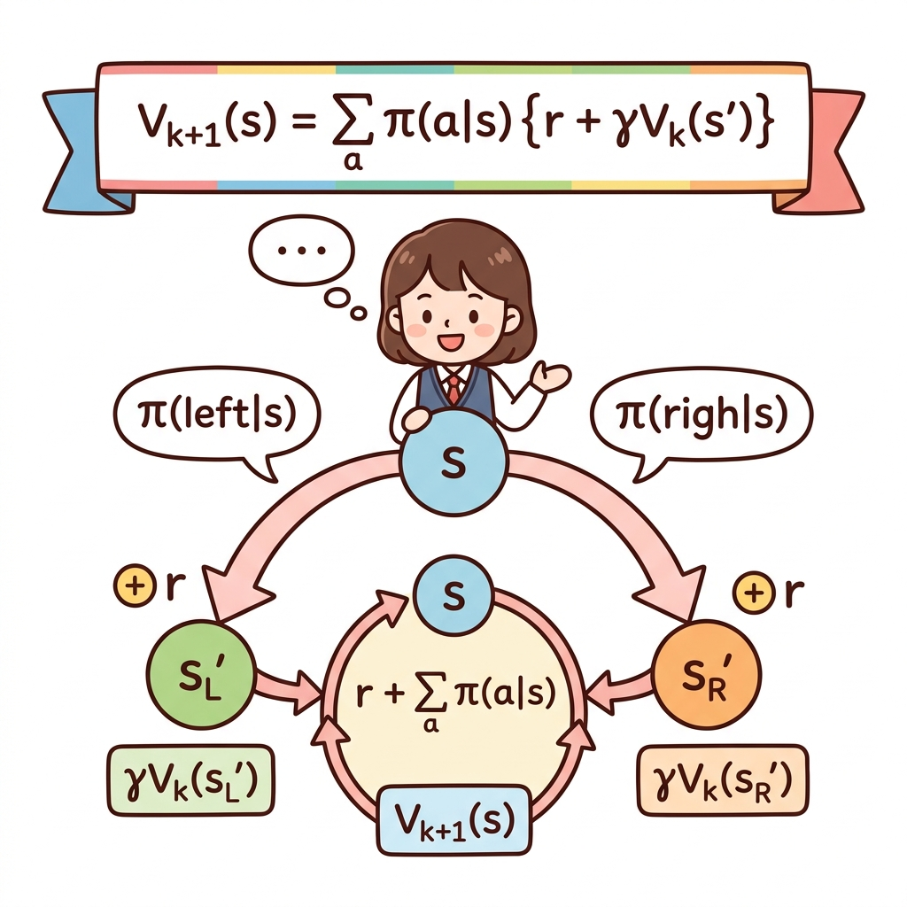

위의 [식 07.3]을 하나씩 쪼개어 해석하면 다음과 같이 매우 직관적입니다.

1. **행동 선택 확률 &pi;(*a* | *s*)**: 현재 상태 *s*에서 행동 *a*(예: 왼쪽 혹은 오른쪽)를 선택할 확률입니다.
2. **단 하나의 확정된 미래 *s'***: 행동 *a*를 취했을 때 도달하게 되는 다음 상태 *s'*가 정확히 1개로 결정되므로, 다음 상태들에 대한 복잡한 가중 합산(&Sigma;<sub>*s'*</sub>)을 할 필요가 없습니다.
3. **행동의 기대 가치 { *r* + *&gamma;* *V*<sub>*k*</sub>(*s'*) }**: 행동 *a*를 실행하여 얻는 즉각적인 보상 *r*과 그 목적지인 다음 상태 *s'*에 적혀있는 이전 버전의 가치 추정치 *V*<sub>*k*</sub>(*s'*)를 가져와 할인율 *&gamma;*를 곱해 더한 값입니다.
4. **행동들에 대한 합산 &Sigma;<sub>*a*</sub>**: 각 행동들을 통해 얻는 기대 가치를 행동 선택 확률(&pi;)로 곱해 모두 더해줍니다(가중 평균). 

이 과정을 거쳐 갱신된 새로운 가치가 바로 좌변의 현재 상태 가치 ***V*<sub>*k+1*</sub>(*s*)**가 됩니다. 

기존의 복잡한 [식 07.2]의 &Sigma;<sub>*a*, *s'*</sub>에서 상태 전이가 결정적이라는 제약 조건 덕분에 다음 상태를 찾는 복잡한 통계 확률 연산(&Sigma;<sub>*s'*</sub>)이 생략되어 식이 매우 명쾌해진 것입니다. 


# 07.2.3.2 2칸짜리 그리드 월드에서의 가치 함수 갱신

이번 문제에서는 [식 07.3]에 따라 가치 함수를 갱신해보겠습니다.

이제 정책 *&pi;*의 가치 함수를 반복적 정책 평가 알고리즘으로 구해보겠습니다. 우선 초깃값으로 *V*<sub>0</sub>(*s*)를 0으로 설정합니다. 

> 💡 **왜 굳이 초깃값(초기화)을 설정하고, 하필 0을 사용하는 걸까요?**
> 
> 1. **알고리즘 가동을 위한 출발점**: 반복적 정책 평가는 이전 버전의 가치 추정치 *V*<sub>*k*</sub>(*s'*)를 우변에 입력하여 새로운 가치 *V*<sub>*k+1*</sub>(*s*)를 계산해내는 징검다리식 순환 알고리즘입니다. 따라서 첫 바퀴(*k* = 0)를 돌리기 위한 **기초 출발점 데이터(*V*<sub>0</sub>)**가 반드시 메모리에 선언되어 있어야만 컴퓨터가 연산을 시작할 수 있습니다.
> 2. **어떤 값으로 시작하든 상관없음 (수렴 보장)**: 가치 수축 사상 원리에 의해, 초깃값을 100이나 -500으로 아무렇게나 설정해도 연산을 충분히 반복하면 결국에는 동일한 진짜 정답 가치인 *v*<sub>*&pi;*</sub>로 똑같이 수렴합니다.
> 3. **0의 강력한 수학적 단순함**: 0은 계산 과정을 가장 직관적으로 만들어 줍니다. 첫 번째 갱신 과정(*V*<sub>0</sub> &rarr; *V*<sub>1</sub>)에서 다음 상태의 가치 값들(*V*<sub>0</sub>(*s'*))이 전부 0이 되므로, 할인율 곱셈 연산(*&gamma;* *V*<sub>0</sub>(*s'*)) 부분이 통째로 날아갑니다. 덕분에 수식을 손으로 직접 계산하여 이해하기가 매우 쉽고 간단해집니다.

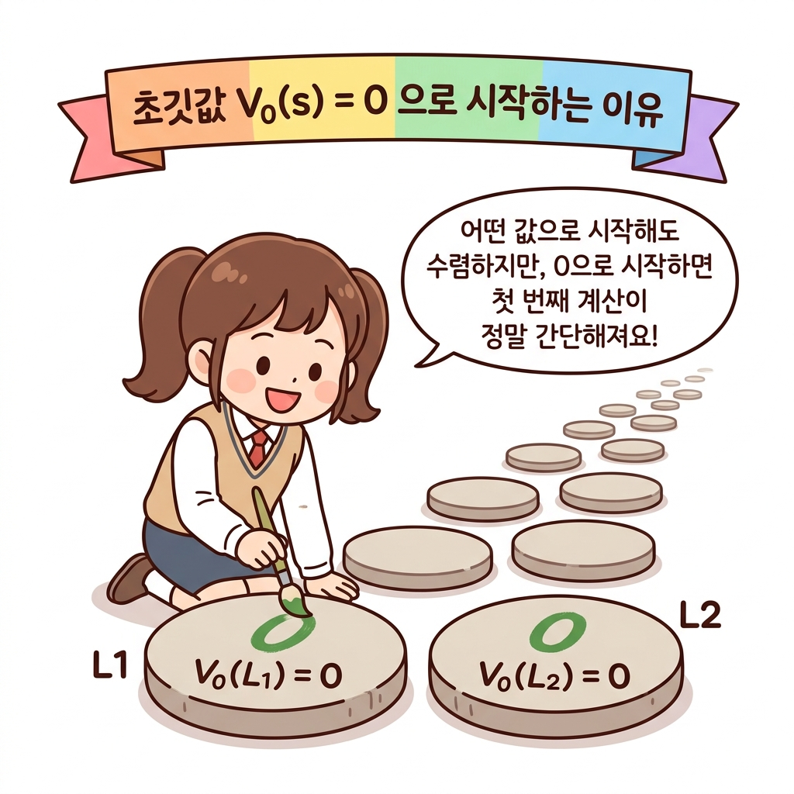

두 칸짜리 그리드 월드에서 상태는 두 개뿐이므로 다음과 같이 나타냅니다.
  
\begin{aligned}
V_0(L1) &= 0 \\
V_0(L2) &= 0
\end{aligned}
  

이어서 [식 07.3]에 따라 *V*<sub>0</sub>(*s*)를 갱신합니다. 


[그림 07-4]의 백업 다이어그램을 보면 쉽게 이해될 것입니다.

**그림 07-4** 상태 *L1*부터 시작하는 백업 다이어그램

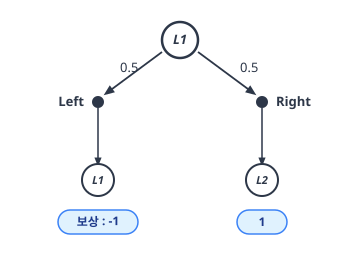

그림과 같이 두 갈래 길로 나뉩니다. 


하나는 0.5의 확률로 왼쪽으로 가는 행동을 선택해 -1의 보상을 받고 상태는 *L1*로 유지됩니다. 

여기에 할인율 *γ*를 0.9로 가정하고 [식 07.3]에 대입하면 다음과 같습니다.
  
0.5 \{ -1 + 0.9 V_0(L1) \}
  

[그림 07-4]의 또 다른 가능성은 상태 *L1*에서 오른쪽으로 가는 행동을 선택한 경우입니다. 


보상으로 1을 받고 상태 *L2*로 이동합니다. 


이를 [식 07.3]에 대입해보죠.
  
0.5 \{ 1 + 0.9 V_0(L2) \}
  


이상으로부터 *V*<sub>1</sub>(*L1*)은 다음과 같이 구할 수 있습니다.
  
\begin{aligned}
V_1(L1) &= 0.5 \{ -1 + 0.9 V_0(L1) \} + 0.5 \{ 1 + 0.9 V_0(L2) \} \\
&= 0.5 \cdot (-1 + 0.9 \cdot 0) + 0.5 \cdot (1 + 0.9 \cdot 0) \\
&= 0
\end{aligned}
  

같은 방법으로 *V*<sub>1</sub>(*L2*)도 계산할 수 있습니다. 


식은 다음과 같습니다.
  
\begin{aligned}
V_1(L2) &= 0.5 \{ 0 + 0.9 V_0(L1) \} + 0.5 \{ -1 + 0.9 V_0(L2) \} \\
&= 0.5 \cdot (0 + 0.9 \cdot 0) + 0.5 \cdot (-1 + 0.9 \cdot 0) \\
&= -0.5
\end{aligned}
  

이것으로 모든 상태에 대한 가치 함수 갱신이 끝났습니다(이번 문제는 상태가 총 2개뿐입니다). 


결과를 정리하면 [그림 07-5]와 같습니다.

**그림 07-5** 가치 함수 1차 갱신

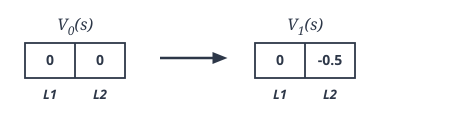

그림과 같이 *V*<sub>0</sub>(*s*)를 *V*<sub>1</sub>(*s*)로 갱신했습니다. 


이제부터는 같은 과정을 반복하면 됩니다. 

*V*<sub>1</sub>(*s*)에서 *V*<sub>2</sub>(*s*)를 계산하고, *V*<sub>2</sub>(*s*)에서 *V*<sub>3</sub>(*s*)를 계산하는 식으로 반복합니다.


# 07.2.3.3 파이썬 구현 및 임곗값 설정 실습

이제 이 계산을 파이썬으로 구현해봅시다. 

코드는 다음과 같습니다.


```python
V = {'L1': 0.0, 'L2': 0.0}
new_V = V.copy() # V의 복사본

for _ in range(100):
    new_V['L1'] = 0.5 * (-1 + 0.9 * V['L1']) + 0.5 * (1 + 0.9 * V['L2'])
    new_V['L2'] = 0.5 * (0 + 0.9 * V['L1']) + 0.5 * (-1 + 0.9 * V['L2'])
    V = new_V.copy()
    print(V)
```

**출력 결과**

```text
{'L1': 0.0, 'L2': -0.5}
{'L1': -0.22499999999999998, 'L2': -0.725}
{'L1': -0.42749999999999994, 'L2': -0.9274999999999999}
...
{'L1': -2.24999335965027827, 'L2': -2.7499335965027827}
```

이번 문제는 상태가 두 개뿐이라 각 상태의 가치 함수를 딕셔너리에 보관했습니다. 


그리고 현재 상태의 가치 함수를 `V`, 새로 갱신할 가치 함수를 `new_V`라고 했습니다. 이 코드를 실행하면 `V`가 갱신되는 과정을 확인할 수 있습니다. 참고로 실제 가치 함수의 값은 `[-2.25, -2.75]`입니다. 앞의 결과를 보면 100번째 갱신 시점(출력 결과의 마지막 줄)에서 거의 같은 값으로 수렴하는 모습을 볼 수 있습니다.


> NOTE_ 지금 코드에서는 `new_V = V.copy()`와 `V = new_V.copy()`처럼 딕셔너리를 복사해 이용했습니다. 이렇게 하면 `new_V`는 `V`와는 별개의 객체로 만들어집니다. 별개의 객체이므로 `new_V`의 원소를 갱신해도 `V`의 원소에는 영향을 주지 않습니다.


앞 코드에서는 갱신을 정해진 횟수만큼(100회) 진행했습니다. 

이번에는 임곗값을 설정하여 갱신 횟수를 자동으로 결정해보겠습니다.

<div align="right"><b>ch07/dp.py</b></div>

```python
V = {'L1': 0.0, 'L2': 0.0}
new_V = V.copy()

cnt = 0  # 갱신 횟수 기록
while True:
```


```python
    new_V['L1'] = 0.5 * (-1 + 0.9 * V['L1']) + 0.5 * (1 + 0.9 * V['L2'])
    new_V['L2'] = 0.5 * (0 + 0.9 * V['L1']) + 0.5 * (-1 + 0.9 * V['L2'])

    # 갱신된 양의 최댓값
    delta = abs(new_V['L1'] - V['L1'])
    delta = max(delta, abs(new_V['L2'] - V['L2']))

    V = new_V.copy()

    cnt += 1
    if delta < 0.0001:  # 임곗값 = 0.0001
        print(V)
        print('갱신 횟수:', cnt)
        break
```

**출력 결과**

```text
{'L1': -2.249167525908671, 'L2': -2.749167525908671}
갱신 횟수: 76
```

임곗값을 0.0001로 설정하고 갱신된 양의 최댓값이 임곗값 밑으로 떨어질 때까지 순환문을 반복합니다. 


갱신된 양의 최댓값은 `new_V`와 `V`에서 대응하는 원소들 간 차이의 절댓값으로 구합니다. 이번에는 원소가 두 개이므로 두 원소의 차이의 절댓값 중 큰 값을 선택합니다. 그 값이 `delta`입니다. `delta`가 임곗값보다 작아지면 갱신을 중단합니다.


출력 결과를 보면 76회 갱신한 끝에 가치 함수의 값이 정답에 근접해졌습니다.


---


# 07.2.4 반복적 정책 평가 구현 (2) - 덮어쓰기 방식

07.1.2절에서는 반복적 정책 평가 알고리즘을 구현하기 위해 두 개의 딕셔너리를 사용했습니다. 


하나는 현재의 가치 함수를 보관하는 `V`, 다른 하나는 갱신 시 사용하는 `new_V`입니다. 

이 두 딕셔너리를 사용하여 [그림 07-6]과 같이 가치 함수를 갱신했습니다.


그림 07-6 07.1.2절의 갱신 방법

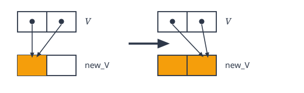

[그림 07-6]에서 주목할 점은 `new_V`의 각 원소를 계산할 때 `V`라는 딕셔너리의 값을 사용하고 있다는 점입니다. 


다르게 구현할 수도 있습니다. 

바로 딕셔너리를 하나만 쓰고 각 원소를 '덮어쓰는' 방법입니다. 


그림으로 표현하면 다음과 같습니다.

그림 07-7 새로운 갱신 방식

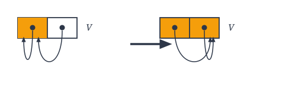

새로운 방식에서는 `V` 하나만 사용하여 각 원소를 덮어씁니다. 이를 '덮어쓰기 방식'이라고 부르겠습니다.

> NOTE_ 두 방식 모두 무한히 반복하면 올바른 값으로 수렴합니다. 다만 '덮어쓰기 방식'이 대체로 더 빠릅니다. 갱신한 원소를 곧바로 재활용하기 때문입니다. 예를 들어 [그림 07-7]에서는 왼쪽의 '이미 갱신된 값'을 바로 사용하여 오른쪽 원소를 갱신합니다.


# 07.2.4.1 덮어쓰기 방식(In-place) 파이썬 구현

이제 DP를 '덮어쓰기 방식'으로 구현해봅시다.

<div align="right"><b>ch07/dp_inplace.py</b></div>

```python
V = {'L1': 0.0, 'L2': 0.0}

cnt = 0
while True:
```


```python
    t = 0.5 * (-1 + 0.9 * V['L1']) + 0.5 * (1 + 0.9 * V['L2'])
    delta = abs(t - V['L1'])
    V['L1'] = t

    t = 0.5 * (0 + 0.9 * V['L1']) + 0.5 * (-1 + 0.9 * V['L2'])
    delta = max(delta, abs(t - V['L2']))
    V['L2'] = t

    cnt += 1
    if delta < 0.0001:
        print(V)
        print('갱신 횟수:', cnt)
        break
```

**출력 결과**

```text
{'L1': -2.2493782177156936, 'L2': -2.7494201578106514}
갱신 횟수: 60
```

이번에는 딕셔너리 `V`만 사용하여 원소들을 즉시 덮어썼습니다. 


결과를 보면 갱신은 **60회** 만에 끝났습니다. 이전 방식에서는 76회였으니 확실히 갱신 횟수가 줄었네요. 그러니 앞으로는 '덮어쓰기 방식'으로 구현하겠습니다.
