# 07.2 동적 프로그래밍과 정책 평가

동적 프로그래밍(Dynamic Programming, DP)은 **환경의 모든 정보(규칙)를 완벽하게 알고 있는 상태**에서, 컴퓨터의 반복 연산을 통해 지도의 가치를 안전하고 정밀하게 **계산해내는 방식**입니다. 


마법사 고양이 지니가 칠판 가득 그려준 개념도처럼, 우리가 가진 환경 정보를 어떻게 진짜 가치 지도로 탈바꿈시키는지 7장의 모험을 힘차게 시작해봅시다!


**그림 07-2-0** 환경 지도를 벨만 방정식으로 처리하여 진짜 가치 지도로 만들어내는 지니와 도로시


---


#### 이전 장인 6강에서는 벨만 방정식에 대해 배웠습니다. 

벨만 방정식을 이용하면 연립방정식을 얻을 수 있고, 그 **연립방정식을 풀 수 있다면 가치 함수**를 구할 수 있습니다. 


이 흐름을 그림으로 표현해보죠.

**그림 07-1** 벨만 방정식을 이용하여 가치 함수를 구하는 흐름

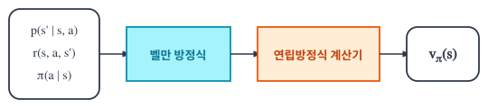


---


#### 연립방정식

이와 같이 상태 전이 확률 *p*(*s'* | *s*, *a*), 보상 함수 *r*(*s*, *a*, *s'*), 정책 *π*(*a* | *s*)라는 세 가지 정보가 있다면 벨만 방정식을 이용해 연립방정식을 구할 수 있습니다. 


그리고 연립방정식을 푸는 프로그램(연립방정식 계산기)을 사용하여 가치 함수를 구할 수 있습니다. 


---


#### 연립방정식의 한계

하지만 연립방정식을 직접 푸는 방식은 **간단한 문제**에서만 의미가 있습니다.  상태와 행동 패턴의 수가 조금만 많아져도 감당할 수 없게 되죠. 


그래서 등장한 것이 바로 **동적 프로그래밍**<sup>Dynamic Programming</sup> (DP) 혹은 **동적 계획법**입니다. 


동적 프로그래밍을 이용하면 상태와 행동의 수가 어느 정도 많아져도 가치 함수를 구할 수 있습니다. 


---


## 07.2.1 정책 평가와 정책 제어

지금부터 동적 프로그래밍을 파헤쳐봅시다.

강화 학습 문제에서는 종종 두 가지 문제를 해결해야 합니다. 


> 👧 **도로시**: "지니! 동적 프로그래밍의 진짜 세계로 들어가려면 먼저 해결해야 하는 '두 가지 문제'가 있다고? 그 두 가지 문제가 대체 무엇일까?"
> 
> 🐱 **지니**: "후후, 도로시! 우리가 강화학습 세상을 정복하기 위해 반드시 넘어야 할 두 개의 거대한 관문이란다. 과연 어떤 비밀이 숨겨져 있을지 함께 살펴볼까?"
> 
> 🐶 **토토**: "갸우뚱? 멍멍! 🐾"


**그림 07-1a** 동적 프로그래밍과 강화 학습에서 마주하게 될 핵심적인 '두 가지 문제'의 존재를 새롭게 인지하고 호기심에 가득 찬 눈으로 궁금해하는 도로시와 토토, 그리고 마법 두루마리를 펼쳐 보이는 지니


---


### 07.2.1.1 두 가지 문제

바로 정책 평가와 정책 제어입니다.


* **정책 평가**<sup>policy evaluation</sup>는 **정책 *π***가 주어졌을 때 그 정책의 **가치 함수 *v*<sub>*π*</sub>(*s*)** 또는 ***q*<sub>*π*</sub>(*s*, *a*)**를 구하는 문제입니다. 

* **정책 제어**<sup>policy control</sup>는 정책을 조정하여 **최적** 정책을 만들어내는 것을 말합니다.

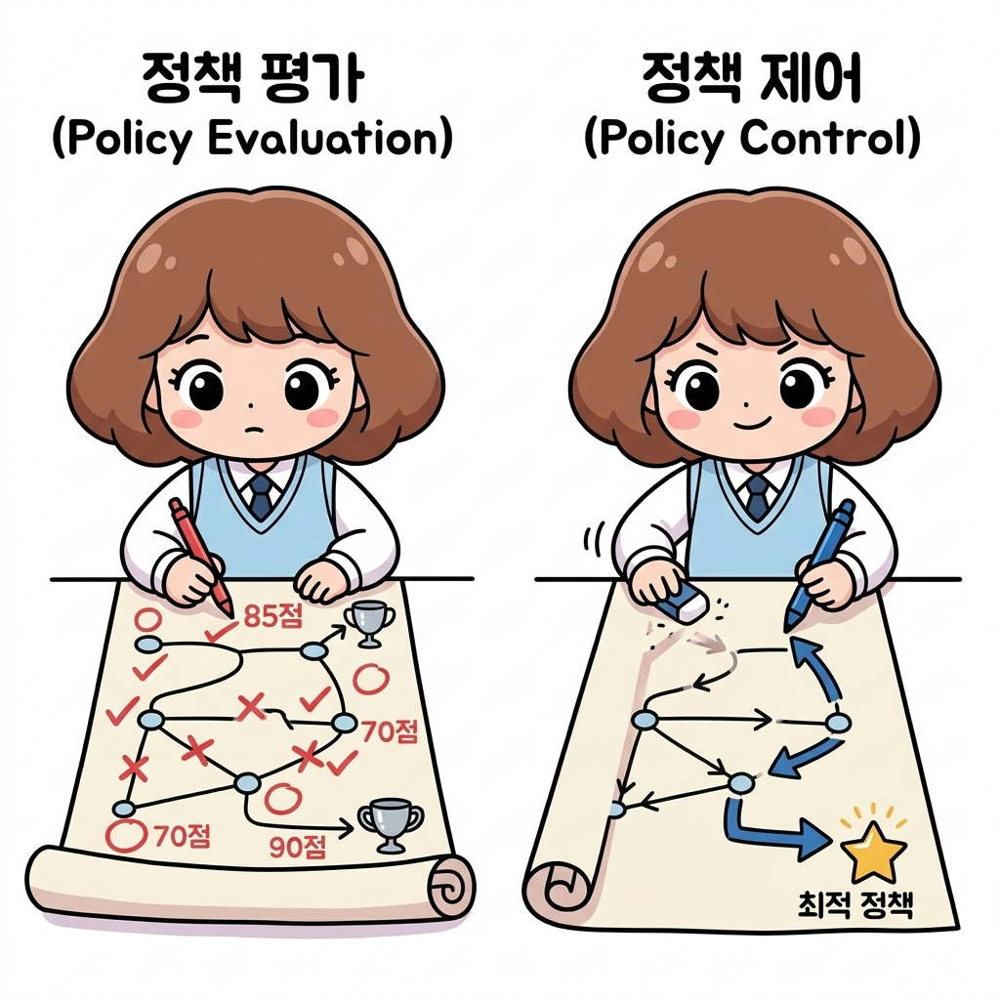


---


### 07.2.1.2 강화 학습의 목표


물론 강화 학습의 **궁극적인 목표는 정책 제어**입니다. 

하지만 첫 목표로 정책 **평가**부터 정복하는 경우가 많습니다. 


대부분 문제에서 최적 정책을 직접 구하기는 매우 어렵기 때문이죠. 

그래서 이번 절에서는 동적 프로그래밍 알고리즘을 이용한 정책 평가 방법을 살펴보겠습니다.


---


## 07.2.2 동적 프로그래밍 기초

동적 프로그래밍(DP)을 활용해 정책을 평가하려면, 6강에서 배운 벨만 방정식을 컴퓨터가 실제로 다룰 수 있는 **반복 갱신 규칙(Update Rule)**으로 바꾸는 기본 원리를 이해해야 합니다.


> 👧 **도로시**: "지니! 연립방정식을 직접 푸는 대신 컴퓨터가 가치를 찾아가게 하려면 어떤 마법의 주춧돌이 필요한 거야?"
> 
> 🐱 **지니**: "후후, 도로시! 바로 '벨만 갱신식'과 '부트스트랩'이라는 두 개의 튼튼한 블록이란다. 어림잡은 가치 추정치를 조금씩 다듬어 진짜 정답 가치로 수렴시키는 DP의 기초를 차근차근 쌓아보자!"
> 
> 🐶 **토토**: "신나게 블록 쌓자! 멍멍! 🐾"


**그림 07-1b** 동적 프로그래밍의 핵심 주춧돌인 '벨만 갱신식'과 '부트스트랩(반복 갱신)'의 기초 블록을 차근차근 쌓으며 학습 의지를 다지는 도로시와 지니, 토토


---


### 07.2.2.1 가치 함수의 정의와 벨만 방정식 복습

앞에서 **가치 함수**를 다음과 같이 정의했습니다.

$$
v_{\pi}(s) = \mathbb{E}_{\pi} [ R_t + \gamma R_{t+1} + \gamma^2 R_{t+2} + \cdots \mid S_t = s ]
$$

> [!NOTE]
> **가치 함수(Value Function)의 정의**  
> **가치 함수**는 **"에이전트가 특정 상태(위치 *s*)에서 출발하여, 앞으로 주어진 정책(*π*)을 따라 움직일 때 얻게 될 미래 보상들의 할인된 총합(기댓값)"**을 뜻합니다.  
> 즉, 현재 서 있는 위치의 잠재적인 장기 가치를 나타내는 **'평균 누적 보상 성적표'**라고 이해할 수 있습니다.


**그림 07-1c** 현재 상태 *s*에서 시작하여 미래에 얻게 될 할인 보상들의 총합(기댓값)인 상태 가치 함수 *v*<sub>*&pi;*</sub>(*s*)의 정의를 칠판 앞에서 복습하는 앳된 초등학생 도로시와 요정 고양이 지니, 그리고 반려견 토토


---


#### 이렇게 **무한대**가 포함되어 있는 식은 일반적으로 계산할 수 없습니다.


---

#### 벨만 방정식

하지만 무한대에서 **탈출**하는 비법이 있으니, 바로 벨만 방정식입니다(식 06.1).


$$
v_{\pi}(s) = \sum_{a, s'} \pi(a \mid s) p(s' \mid s, a) \{ r(s, a, s') + \gamma v_{\pi}(s') \}
$$


[식 07.1]


---


#### 현재 상태와 다음상태 관계

벨만 방정식은 [식 07.1]과 같이 **'현재 상태 *s*의 가치 함수 *v*<sub>*π*</sub>(*s*)'**와 **'다음 상태 *s'*의 가치 함수 *v*<sub>*π*</sub>(*s'*)'**의 관계를 나타냅니다. 


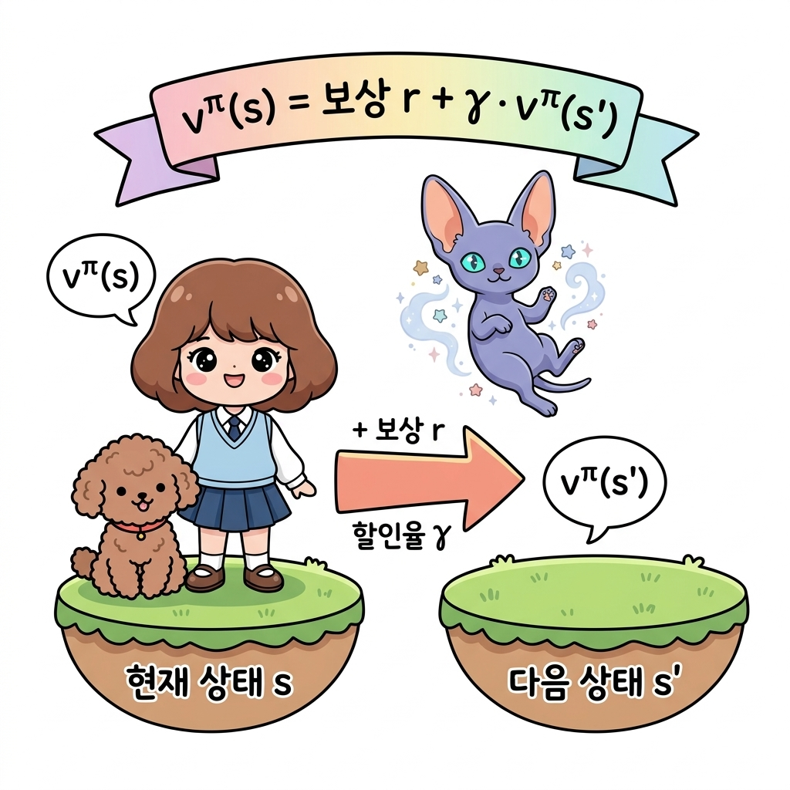


---


### 07.2.2.2 벨만 방정식을 이용한 가치 함수 갱신식

벨만 방정식은 많은 강화 학습 알고리즘에 중요한 기초를 제공합니다. DP를 사용한 방법도 벨만 방정식에서 파생되죠. 


바로 벨만 방정식을 '갱신식'으로 변형하는 것입니다. 

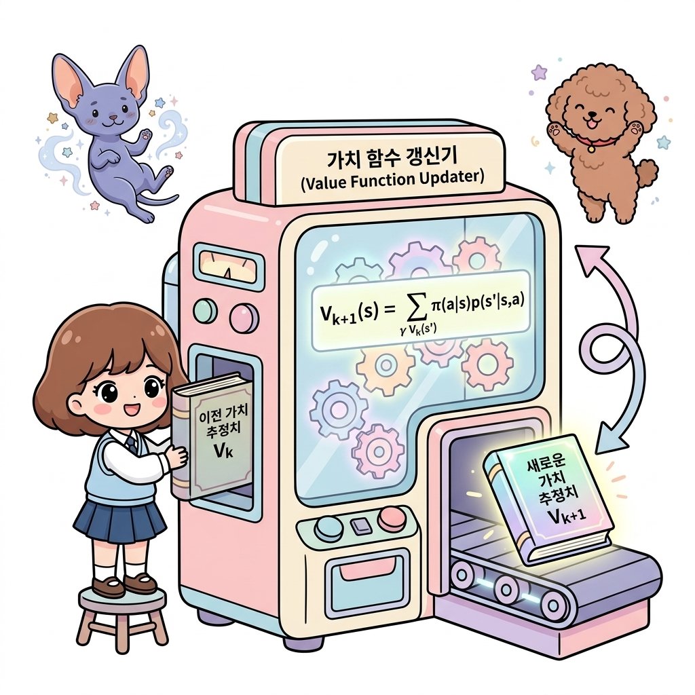


---


#### 수식은 다음과 같습니다.

$$
V_{k+1}(s) = \sum_{a, s'} \pi(a \mid s) p(s' \mid s, a) \{ r(s, a, s') + \gamma V_k(s') \}
$$

[식 07.2]

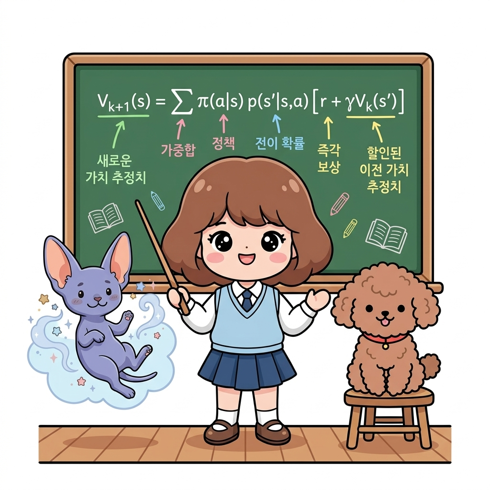


---


### 07.2.2.3 가치 함수의 추정치 표기 (V_k)

*V*<sub>*k*+1</sub>(*s*)는 *k*+1번째로 갱신된 가치 함수를 뜻하며 *k*번째로 갱신된 가치 함수는 *V*<sub>*k*</sub>(*s*)로 표기합니다. 


이때 *V*<sub>*k*+1</sub>(*s*)와 *V*<sub>*k*</sub>(*s*)는 **'추정치'**라서 실제 가치 함수인 *v*(*s*)와 다릅니다. 

그래서 **대문자 *V***로 표기합니다.


> **추정이란? (Estimation)**
> 
> 강화학습과 동적 프로그래밍에서 **'참값(True Value)'**은 우리가 최종적으로 알고 싶어 하는 수학적으로 완벽한 진짜 정답입니다. 하지만 학습 초기에는 이 진짜 값을 알 방법이 없습니다. 
> 
> 그래서 일단 임의의 값(예: 모든 방의 가치를 0점)으로 시작하여, 벨만 갱신식을 반복적으로 실행하면서 정답에 가깝도록 계속 값을 변경해 나갑니다. 이처럼 **'진짜 정답에 한 걸음씩 가깝게 다가가도록 어림잡아 짐작해 나가는 미완성의 값'**을 **추정치(Estimate)**라고 부릅니다.
> 
> 수학 기호로 표기할 때도 엄격하게 구분합니다:
> * **소문자 *v*<sub>*π*</sub>(*s*)**: 우리가 도달해야 하는 이론상의 고정된 진짜 정답 (**참값**)
> * **대문자 *V*<sub>*k*</sub>(*s*)**: 컴퓨터 메모리에 저장되어 반복 갱신을 거치며 계속 다듬어지고 변해가는 짐작값 (**추정치**)


---


### 07.2.2.4 추정치로 추정치를 개선하는 부트스트랩

[식 07.2]의 특징은 **한 단계 앞선 '다음 상태의 가치 함수 *V*<sub>*k*</sub>(*s'*)'의 값들을 이용(대입)하여, 지금 위치한 '지금 상태의 가치 함수 *V*<sub>*k*+1</sub>(*s*)'를 갱신**한다는 점입니다. (미래의 추정 가치를 끌어와 현재의 추정 가치를 정밀하게 고쳐 씁니다.)

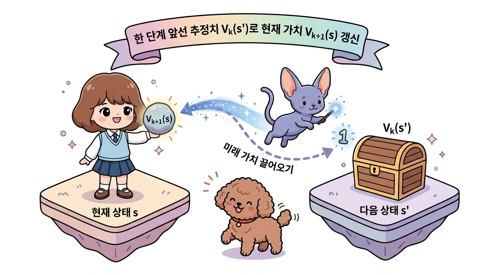


---


#### 부트스트랩 과정

그리고 이 식은 '추정치 *V*<sub>*k*</sub>(*s'*)'를 사용하여 '또 다른 추정치 *V*<sub>*k*+1</sub>(*s*)'를 개선합니다. 


이처럼 추정치를 사용하여 추정치를 개선하는 과정을 **부트스트랩**<sup>bootstrapping</sup>이라고 부릅니다.

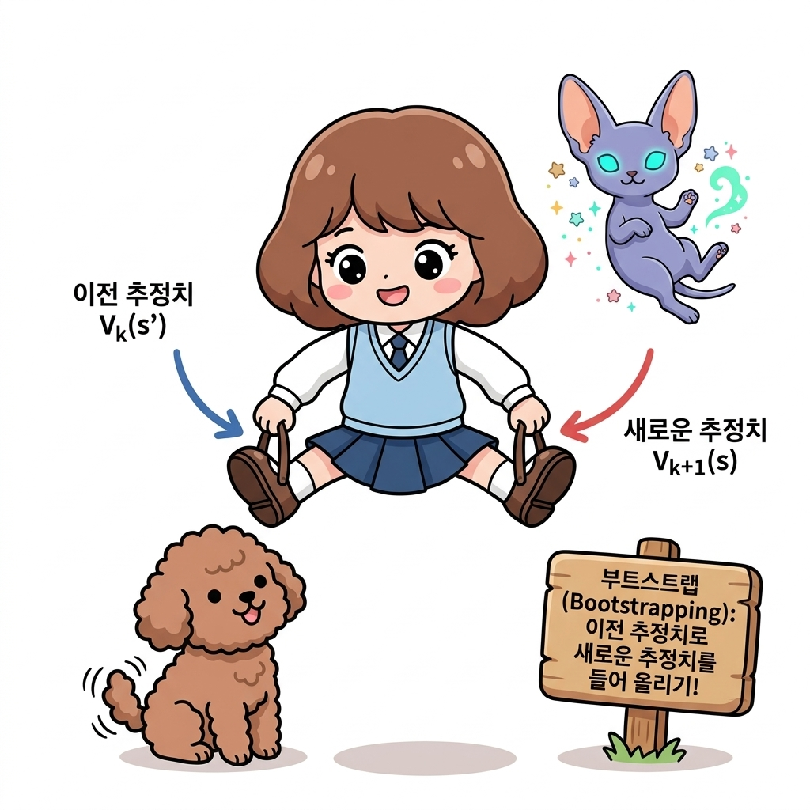


> NOTE_ 부트스트랩은 신발(boot)을 신을 때 손가락으로 잡아당기는, 신발 뒤쪽에 달려 있는 고리 모양의 끈(strap)을 가리킵니다. 여기서 유래하여 다른 사람의 도움 없이 스스로 개선하는 과정을 뜻하는 의미로 쓰이고 있습니다.


---


### 07.2.2.5 반복적 정책 평가 알고리즘

이제 DP를 이용한 구체적인 알고리즘을 설명하겠습니다. 

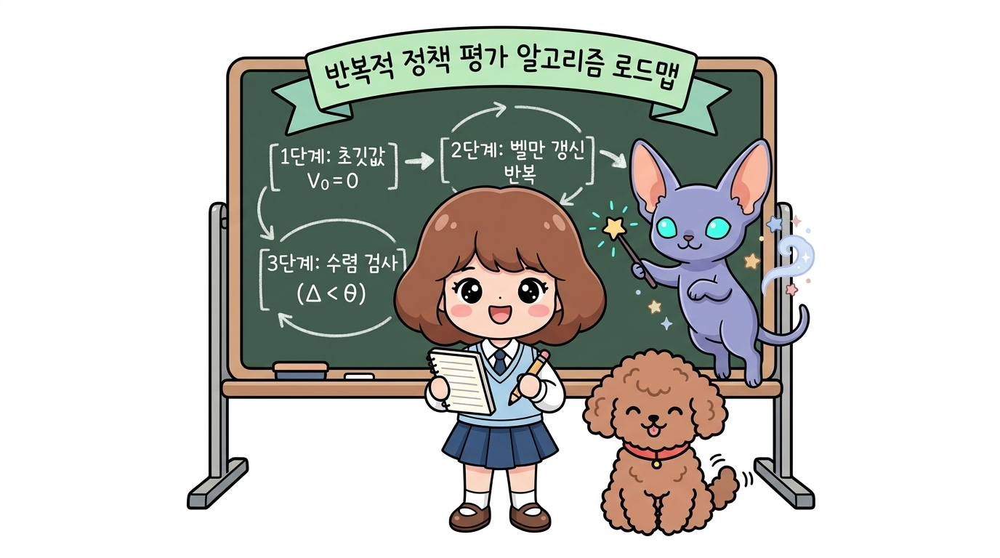

---

#### 먼저 *V*<sub>0</sub>(*s*)의 초깃값을 설정합니다. 

예를 들어 모든 상태에서 *V*<sub>0</sub>(*s*) = 0으로 초기화합니다. 

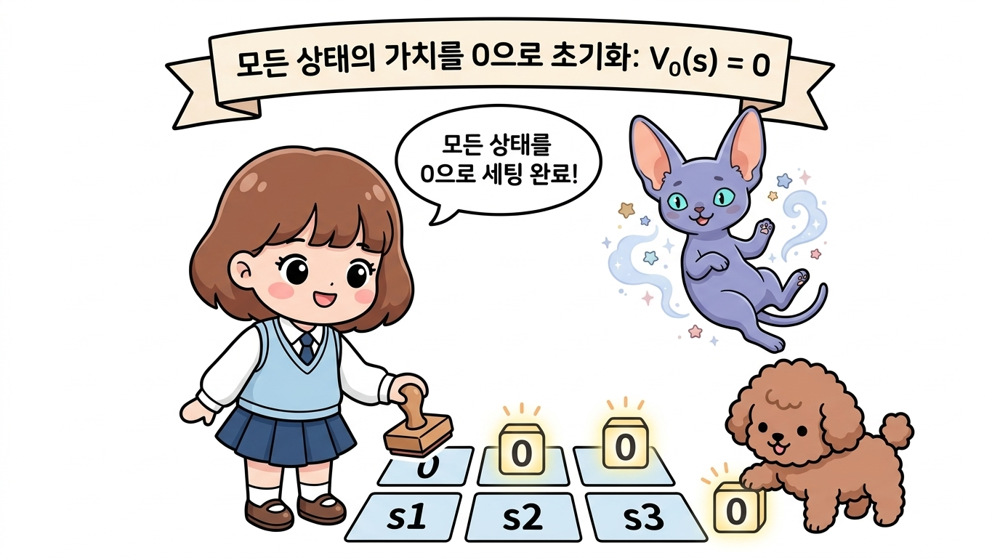

---


### 그리고 [식 07.2]를 이용하여 *V*<sub>0</sub>(*s*)에서 *V*<sub>1</sub>(*s*)로 갱신합니다. 

이어서 *V*<sub>1</sub>(*s*)를 기반으로 *V*<sub>2</sub>(*s*)로 갱신합니다. 이 일을 반복하다 보면 최종 목표인 *V*<sub>*π*</sub>(*s*)에 가까워집니다. 

이 알고리즘을 **반복적 정책 평가**<sup>iterative policy evaluation</sup>라고 합니다.

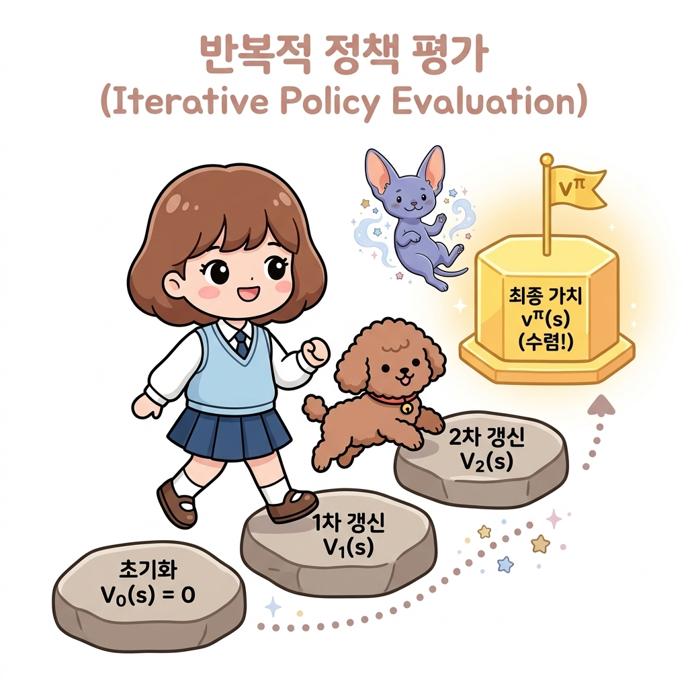


---

#### 갱신횟수

반복적 정책 평가 알고리즘을 실제 문제에 적용하려면 반복되는 갱신을 언젠가는 **멈춰야 합니다.** 

이때 갱신 횟수를 결정하는 기준으로 갱신된 양을 이용할 수 있습니다. 


이에 관한 예는 바로 뒤에서 설명할 것입니다. 


---

#### 가치함수 수렴

[식 07.2]에 따른 갱신을 반복하면 초기 가치 추정치 *V*<sub>0</sub>(*s*)가 어떤 엉뚱한 값으로 시작하더라도, 결국 최종 목표인 참 가치 함수 *v*<sub>*π*</sub>(*s*)에 정확히 수렴한다는 사실은 수학적으로 이미 증명되어 있습니다.

이를 보장하기 위해 만족해야 하는 핵심 조건은 다음과 같습니다.
1. **할인율 *γ* < 1**: 할인율이 1보다 작으면 갱신을 거듭할 때마다 참값과의 오차(차이)가 매 단계마다 최소 *γ*배(예: 0.9배) 이하로 줄어듭니다(수축 사상, Contraction Mapping).
2. **유한한 상태 및 행동 공간**: 에이전트가 탐색할 상태(방)와 취할 수 있는 행동(선택지)의 개수가 끝없이 많지 않고 유한해야 합니다.

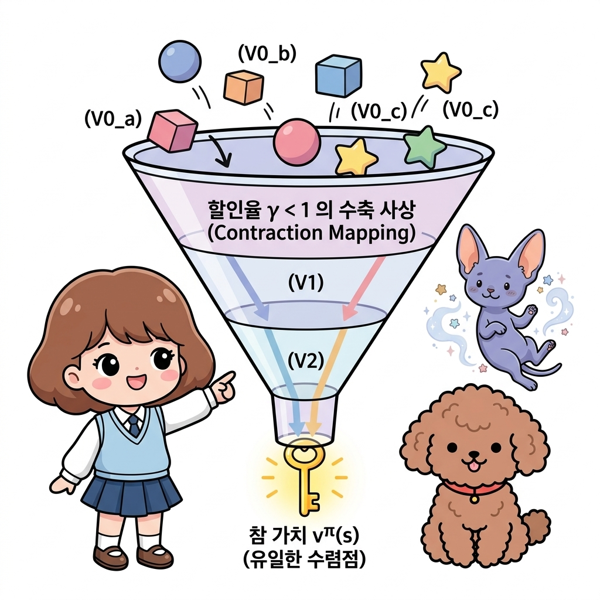

---

#### 상태 L1에서의 1차 가치 갱신 (*V*<sub>1</sub>(*L1*))

그림과 같이 각 상태에서 출발하여 취할 수 있는 행동은 **왼쪽(확률 0.5)**과 **오른쪽(확률 0.5)** 두 가지입니다.


우선 상태 ***L1*에서의 1차 가치 갱신 *V*<sub>1</sub>(*L1*)**을 왼쪽 행동과 오른쪽 행동으로 분리하여 차근차근 계산해보겠습니다.

##### 1. 왼쪽으로 이동하는 경우 (확률 0.5)

- **상황**: 도로시가 왼쪽으로 한 걸음 내딛지만, 왼쪽 외벽에 가로막혀 쿵! 부딪히며 제자리 ***L1* 상태**에 그대로 머무릅니다.
- **보상**: 벽에 부딪혔으므로 페널티인 **보상 -1**을 받습니다 (*r* = -1).
- **다음 상태의 가치**: 도착한 다음 상태가 여전히 *L1*이므로, 우변에 대입할 이전 가치는 초깃값 ***V*<sub>0</sub>(*L1*) = 0**이 됩니다.
- **왼쪽 경로의 가치 기여분**:
  $$
  \pi(\text{left} \mid L1) \times \left\{ r + \gamma V_0(L1) \right\} = 0.5 \times \{ -1 + 0.9 \times 0 \} = -0.5
  $$

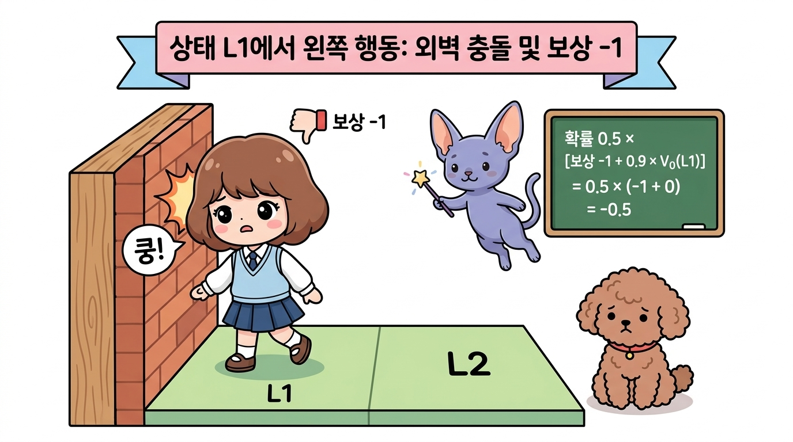

---

##### 2. 오른쪽으로 이동하는 경우 (확률 0.5)

- **상황**: 도로시가 오른쪽으로 경쾌하게 발걸음을 옮겨 옆 칸인 ***L2* 상태**로 전진하는 데 성공합니다.
- **보상**: 오른쪽으로 안전하게 전진했으므로 보너스인 **보상 +1**을 기분 좋게 획득합니다 (*r* = +1).
- **다음 상태의 가치**: 도착한 다음 상태가 *L2*이므로, 우변에 대입할 이전 가치는 초깃값 ***V*<sub>0</sub>(*L2*) = 0**이 됩니다.
- **오른쪽 경로의 가치 기여분**:
  $$
  \pi(\text{right} \mid L1) \times \left\{ r + \gamma V_0(L2) \right\} = 0.5 \times \{ +1 + 0.9 \times 0 \} = +0.5
  $$

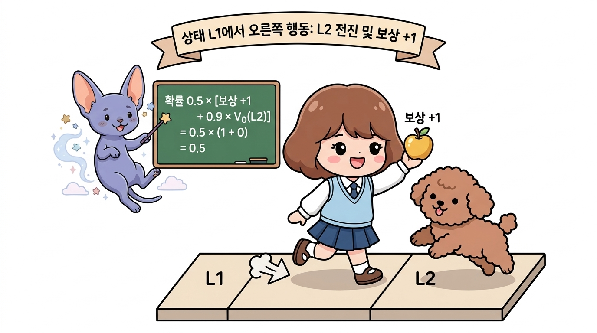

---

##### 3. L1 가치 함수 합산 결과

왼쪽과 오른쪽 두 갈래 행동에서 얻은 가치 기여분(-0.5와 +0.5)을 벨만 갱신식에 따라 가중합(기댓값)으로 합산하면 최종적으로 갱신된 ***V*<sub>1</sub>(*L1*)**이 도출됩니다.

$$
\begin{aligned}
V_1(L1) &= \sum_{a} \pi(a \mid L1) \left\{ r(L1, a, s') + \gamma V_0(s') \right\} \\
&= 0.5 \{ -1 + 0.9 V_0(L1) \} + 0.5 \{ 1 + 0.9 V_0(L2) \} \\
&= 0.5 \cdot (-1 + 0.9 \cdot 0) + 0.5 \cdot (1 + 0.9 \cdot 0) \\
&= -0.5 + 0.5 \\
&= 0
\end{aligned}
$$

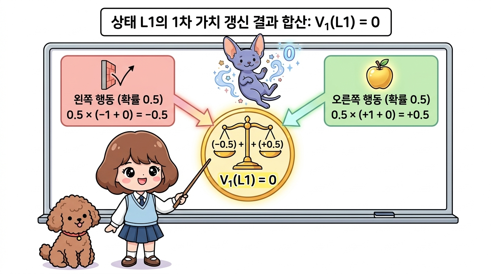

---

#### 상태 L2에서의 1차 가치 갱신 (*V*<sub>1</sub>(*L2*))

동일한 방법으로 상태 ***L2*에서의 1차 가치 갱신 *V*<sub>1</sub>(*L2*)**도 왼쪽 행동과 오른쪽 행동으로 분리하여 차근차근 계산해보겠습니다.


##### 1. 왼쪽으로 이동하는 경우 (확률 0.5)

- **상황**: 도로시가 상태 *L2*에서 왼쪽으로 발걸음을 옮겨 이전 칸인 ***L1* 상태**로 이동합니다.
- **보상**: 왼쪽으로 이동할 때는 보상이 주어지지 않으므로 **보상 0**을 받습니다 (*r* = 0).
- **다음 상태의 가치**: 도착한 다음 상태가 *L1*이므로, 우변에 대입할 이전 가치는 초깃값 ***V*<sub>0</sub>(*L1*) = 0**이 됩니다.
- **왼쪽 경로의 가치 기여분**:
  $$
  \pi(\text{left} \mid L2) \times \left\{ r + \gamma V_0(L1) \right\} = 0.5 \times \{ 0 + 0.9 \times 0 \} = 0
  $$

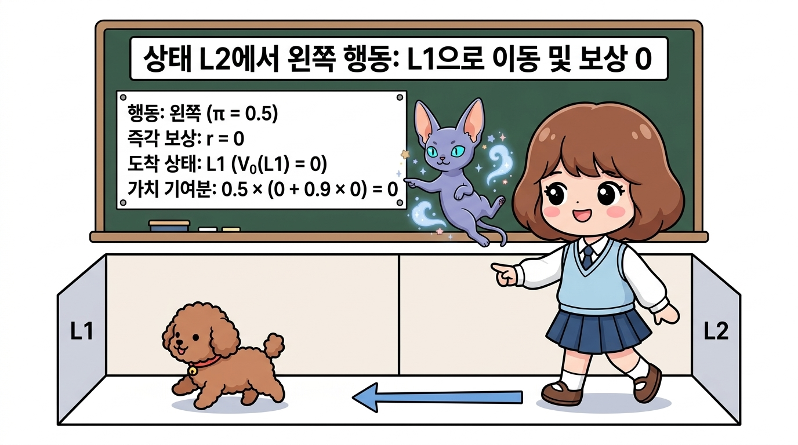

---


##### 2. 오른쪽으로 이동하는 경우 (확률 0.5)

- **상황**: 도로시가 오른쪽으로 이동을 시도하지만, 오른쪽 외벽에 가로막혀 쿵! 부딪히며 제자리 ***L2* 상태**에 그대로 머무릅니다.
- **보상**: 외벽에 부딪혔으므로 페널티인 벌점 **보상 -1**을 받습니다 (*r* = -1).
- **다음 상태의 가치**: 도착한 다음 상태가 여전히 *L2*이므로, 우변에 대입할 이전 가치는 초깃값 ***V*<sub>0</sub>(*L2*) = 0**이 됩니다.
- **오른쪽 경로의 가치 기여분**:
  $$
  \pi(\text{right} \mid L2) \times \left\{ r + \gamma V_0(L2) \right\} = 0.5 \times \{ -1 + 0.9 \times 0 \} = -0.5
  $$

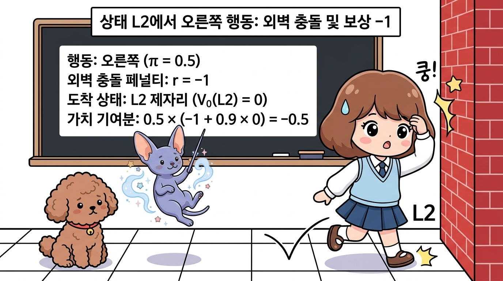

---

##### 3. L2 가치 함수 합산 결과

왼쪽과 오른쪽 두 갈래 행동에서 얻은 가치 기여분(0과 -0.5)을 벨만 갱신식에 따라 가중합(기댓값)으로 합산하면 최종적으로 갱신된 ***V*<sub>1</sub>(*L2*)**이 도출됩니다.

$$
\begin{aligned}
V_1(L2) &= \sum_{a} \pi(a \mid L2) \left\{ r(L2, a, s') + \gamma V_0(s') \right\} \\
&= 0.5 \{ 0 + 0.9 V_0(L1) \} + 0.5 \{ -1 + 0.9 V_0(L2) \} \\
&= 0.5 \cdot (0 + 0.9 \cdot 0) + 0.5 \cdot (-1 + 0.9 \cdot 0) \\
&= 0 + (-0.5) \\
&= -0.5
\end{aligned}
$$

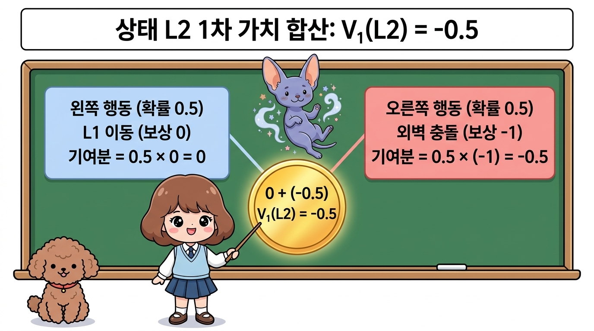

---

이 모든 연산 과정을 일목요연하게 칠판 판서 형태로 요약한 그림이 바로 아래의 **그림 07-4.1**입니다. 

수식이 복잡해 보여도 결국 각 방향으로 이동하면서 얻는 보상과 정책 확률의 단순한 곱하기와 더하기에 지나지 않습니다.

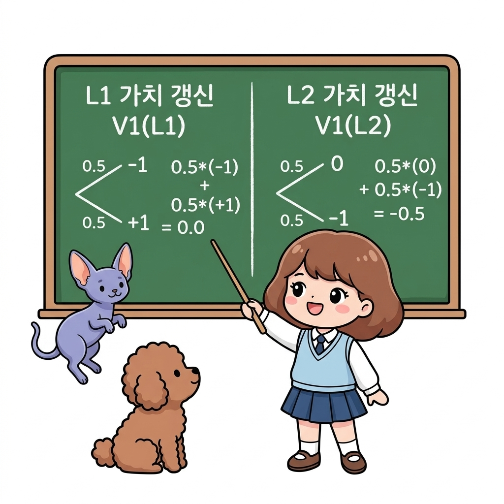


이것으로 모든 상태에 대한 1차 가치 함수 갱신이 끝났습니다(이번 문제는 상태가 L1, L2 총 2개뿐입니다). 

수학적 수렴 증명에 대해 더 자세히 알고 싶다면 다른 문헌<sup>[5]</sup>을 참고하기 바랍니다.


---


#### 동적 프로그래밍(DP)은 특정한 성격을 지닌 알고리즘들의 총칭입니다. 

대상 문제를 작은 문제로 나누어 답을 구하는 기법 전반을 말하죠. DP의 핵심은 '같은 계산을 두 번 하지 않는 것'입니다. 

구현하는 방법에는 하향식<sup>top-down</sup>과 상향식<sup>bottom-up</sup>이 있습니다(하향식 방법은 메모이제이션<sup>memoization</sup>이라고도 합니다. 

앞서 설명한 *V*<sub>0</sub>(*s*), *V*<sub>1</sub>(*s*)... 식으로 한 단계씩 증가하며 가치 함수를 갱신하는 방식은 상향식 방법입니다).


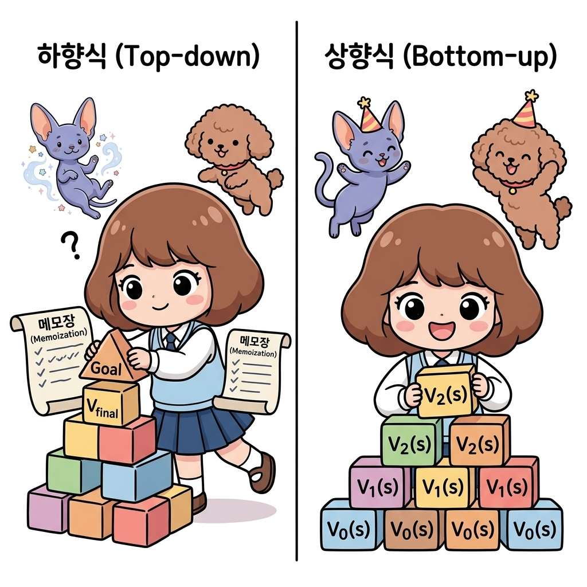


---


## 07.2.3 반복적 정책 평가 구현 (1) - 2개 딕셔너리 방식

이제 앞서 이론과 손계산으로 익힌 반복적 정책 평가(Iterative Policy Evaluation) 알고리즘을 파이썬 코드로 직접 구현해볼 차례입니다. 


알고리즘을 코드로 옮길 때 가장 먼저 결정해야 하는 중요한 문제는 **"이전 가치 *V*<sub>*k*</sub>와 새롭게 계산되는 가치 *V*<sub>*k*+1</sub>을 메모리 상에서 어떻게 관리할 것인가?"**입니다.


---

벨만 갱신식의 수학적 정의에 따르면, 모든 상태의 새로운 가치 *V*<sub>*k*+1</sub>(*s*)를 계산할 때는 우변에 대입되는 다음 상태들의 가치가 반드시 **"동일한 이전 단계 *k* 시점의 가치 *V*<sub>*k*</sub>(*s')"**이어야 합니다. 계산 도중에 기존 딕셔너리의 값을 곧바로 덮어써 버리면, 아직 갱신되지 않은 다른 상태가 방금 갱신된 새로운 값을 읽어버리는 계산 오염(동기화 불일치)이 발생할 수 있습니다.


따라서 가장 직관적이고 수학적으로 엄밀한 첫 번째 구현 방식은 **"이전 단계의 가치 *V*<sub>*k*</sub>를 오직 읽기만 하는 딕셔너리(`V`)"**와 **"새롭게 계산된 *V*<sub>*k*+1</sub>을 차곡차곡 기록하는 딕셔너리(`new_V`)"**의 **2개 딕셔너리를 분리하여 사용하는 방식**입니다.

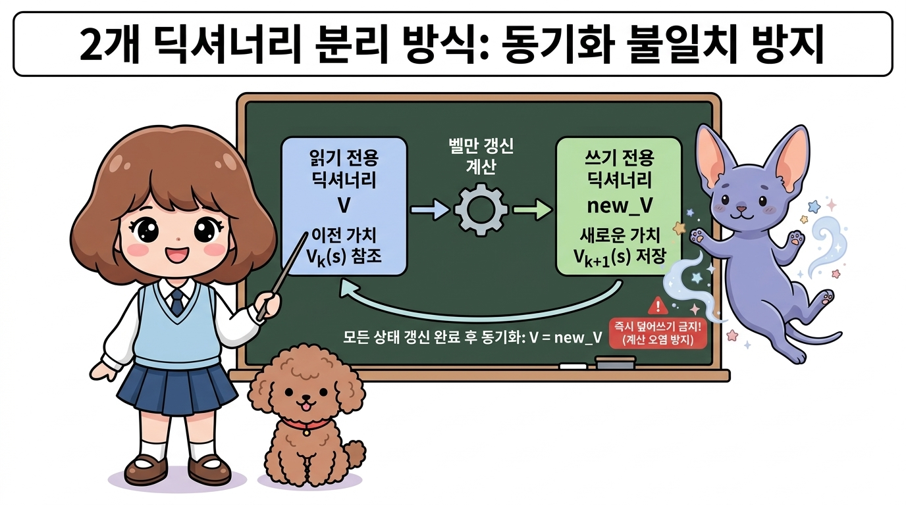

---


우리가 첫 번째 실습 예제로 다룰 **[그림 07-2]**의 '두 칸짜리 그리드 월드' 환경을 다시 한번 명확히 정의해보겠습니다.

**그림 07-2** 두 칸짜리 그리드 월드 환경과 에이전트의 균등 무작위 정책 *π*

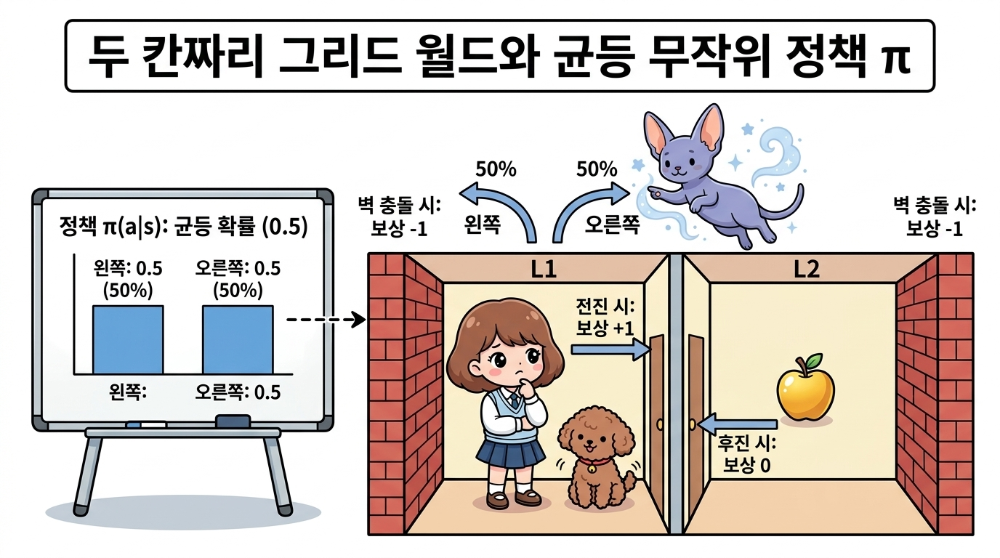

그림에서와 같이 에이전트(도로시)가 처한 환경 규칙과 행동 정책은 다음과 같이 아주 단순하고 명쾌합니다.

1. **2칸 격자 세계 (Grid World)**: 방은 오직 ***L1***과 ***L2*** 두 개뿐입니다.
   - **외벽 충돌 페널티**: *L1*의 왼쪽 끝과 *L2*의 오른쪽 끝은 단단한 벽으로 가로막혀 있어, 밖으로 나가려 하면 쿵! 부딪혀 제자리에 머무르고 **벌점 -1**을 받습니다.
   - **방 간의 이동**: *L1*에서 오른쪽으로 이동해 *L2*에 도달하면 탐스러운 황금 사과 **보상 +1**을 얻습니다. 반대로 *L2*에서 왼쪽으로 되돌아올 때는 별도의 보상 없이 **보상 0**을 얻습니다.
2. **균등 무작위 정책 (*π*)**: 도로시는 동전을 던지듯 왼쪽과 오른쪽 행동을 각각 0.5(50%)의 동일한 확률로 선택합니다.
   $$
   \pi(\text{left} \mid s) = 0.5, \quad \pi(\text{right} \mid s) = 0.5 \quad (\forall s \in \{L1, L2\})
   $$


---


### 07.2.3.1 결정적 상태 전이 환경으로의 제약

**결정적 상태 전이**란, 에이전트가 어떤 상태 *s*에서 특정 행동 *a*를 취했을 때 바람이나 무작위성 같은 외부 변수가 개입하지 않도록 제한하여, **100%의 확률(확률 = 1.0)로 정해진 다음 상태 *s'*에 정확히 도착하게 만드는 것**을 의미합니다. 

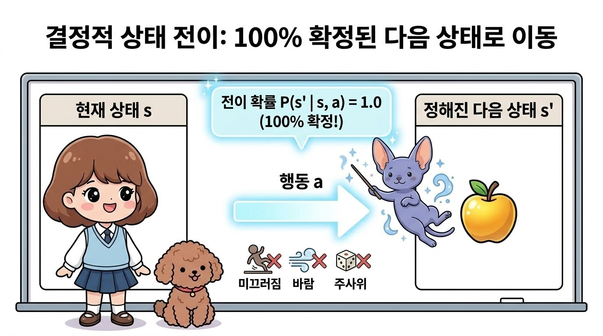 


> 💡 **상태 전이를 왜 결정적인 경우로 한정(제한)하여 문제를 풀까요?**
> 
> **1. 결정성은 그리드 크기와 무관합니다.**
> * **2칸짜리 그리드라도 확률적일 수 있습니다**: 만약 규칙에 "오른쪽으로 가려고 할 때, 10% 확률로 바닥에 미끄러져 제자리 *L1*에 머무른다"와 같은 예외적 물리 규칙이 있다면 그것은 확률적 전이 환경이 됩니다.
> * **100만 칸짜리 거대한 미로라도 결정적일 수 있습니다**: 미끄러짐이나 무작위 바람 없이 명령한 방향으로 언제나 100% 확률로 정확하게 한 칸 이동한다면 그것은 결정적 전이 환경입니다.
> 
> **2. 굳이 결정적 전이로 제한한 이유는 '수학적 단순함(학습 편의)' 때문입니다.**
> 처음부터 확률적 전이(바람의 저항이나 얼음판 미끄러짐 등 여러 상태로 흩어질 수 있는 복잡한 확률 *p*(*s'* &mid; *s*, *a*))를 대입하면, 수식을 계산할 때 곱해야 할 확률 값과 다음 상태에 대한 복잡한 합산 기호(&Sigma;<sub>*s'*</sub>)가 얽혀 연산이 너무 무겁고 복잡해집니다.
> 따라서 **"독자가 수학적 피로감 없이 알고리즘의 본질적인 동작 및 갱신 흐름(*V*<sub>0</sub> &rarr; *V*<sub>1</sub> &rarr; *V*<sub>2</sub> ...)을 직관적으로 배울 수 있도록, 가장 단순한 물리 규칙(결정적 전이)으로 환경을 제한하여 첫 실습 예제를 정의한 것"**입니다.
> 
> 즉, 이 문제에서 전이가 결정적인 이유는 칸수가 2칸이라서가 아니라, **"우리가 의도적으로 미끄러짐이나 무작위 오류가 전혀 없도록 제약 조건을 걸어 단순하게 문제를 정의했기 때문"**입니다.


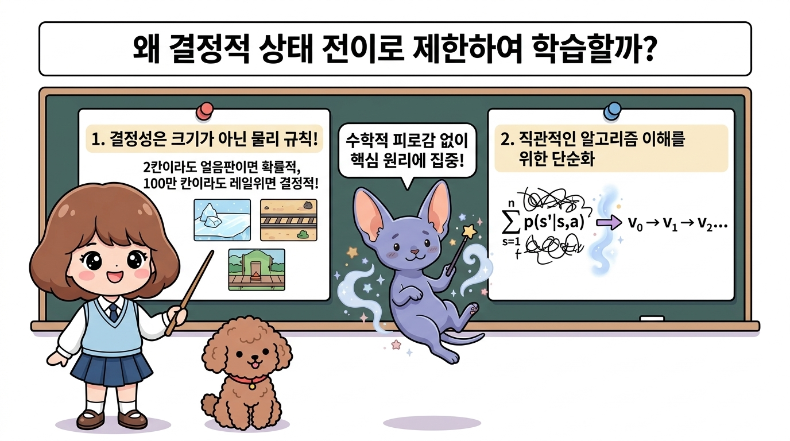

---


예를 들어, 상태 *L1*에서 '오른쪽'으로 가는 행동을 취하면, 마치 기차가 철로를 따라 달리듯 100% 확률로 반드시 상태 *L2*에 안착합니다. 

주사위(확률)에 따라 다른 엉뚱한 곳으로 빗나가거나 미끄러질 확률이 전혀 없는 상태를 말합니다.


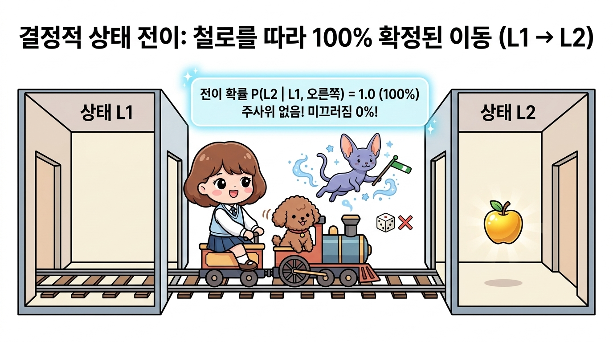

---


수학적으로는 **다음 상태 *s'***가 확률 분포가 아니라 **고정된 함수 *s'* = *f*(*s*, *a*)**에 의해 단 하나로 고유하게 결정됩니다.

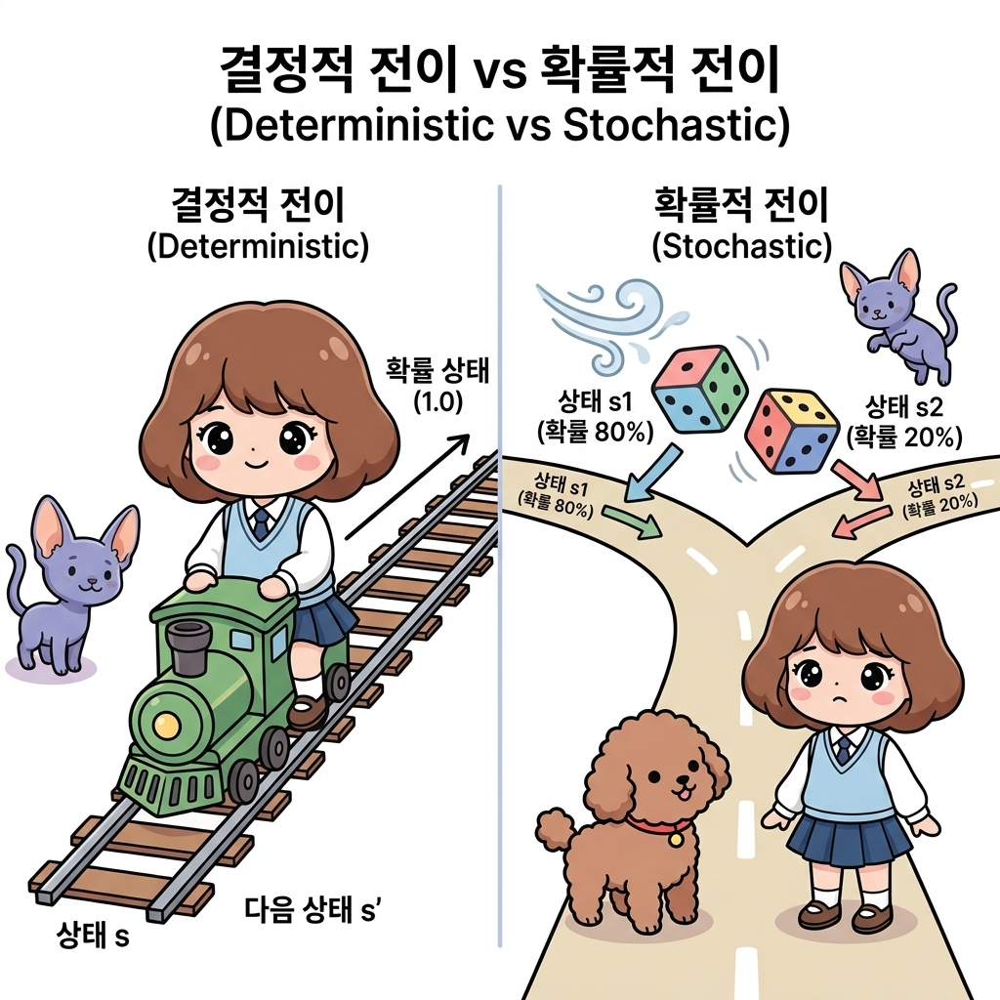


---


이처럼 다음 상태가 단 하나로 확정되면, 다음 상태 전이 확률인 *p*(*s'* &mid; *s*, *a*)의 값은 오직 실제 도착할 *s'* = *f*(*s*, *a*)에 대해서만 `1`이 되고, 나머지 다른 모든 상태에 대해서는 `0`이 됩니다. 


그 결과, 모든 다음 상태에 대해 합산(시그마)을 구하는 수식인 &Sigma;<sub>*s'*</sub>가 1에 대한 값으로 수축하면서 사라지게 되고, 오직 실제로 도달할 하나의 다음 상태 *s'*에 대해서만 가치를 평가하게 됩니다.

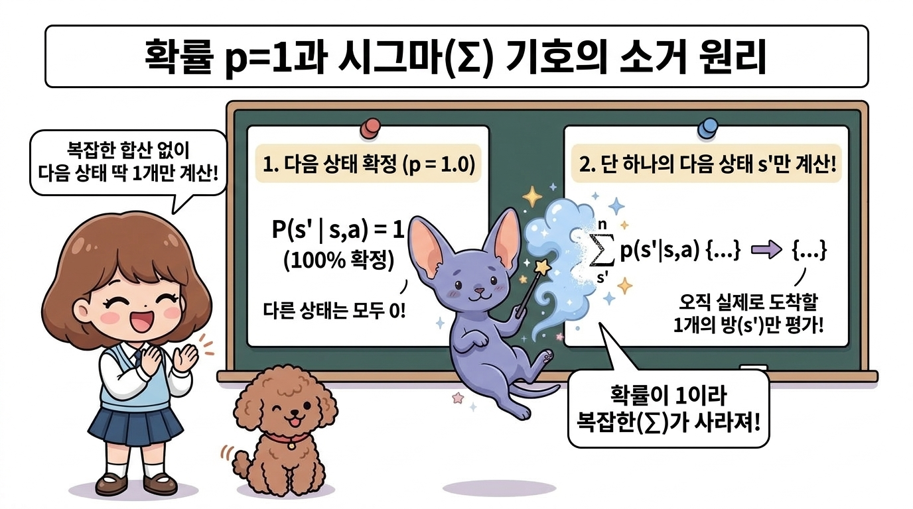


---


따라서 가치 함수 갱신식인 [식 07.2]를 다음과 같이 단순화할 수 있습니다.


*s'* = *f*(*s*, *a*) 일 때

$$
V_{k+1}(s) = \sum_a \pi(a \mid s) \{ r(s, a, s') + \gamma V_k(s') \}
$$


[식 07.3]

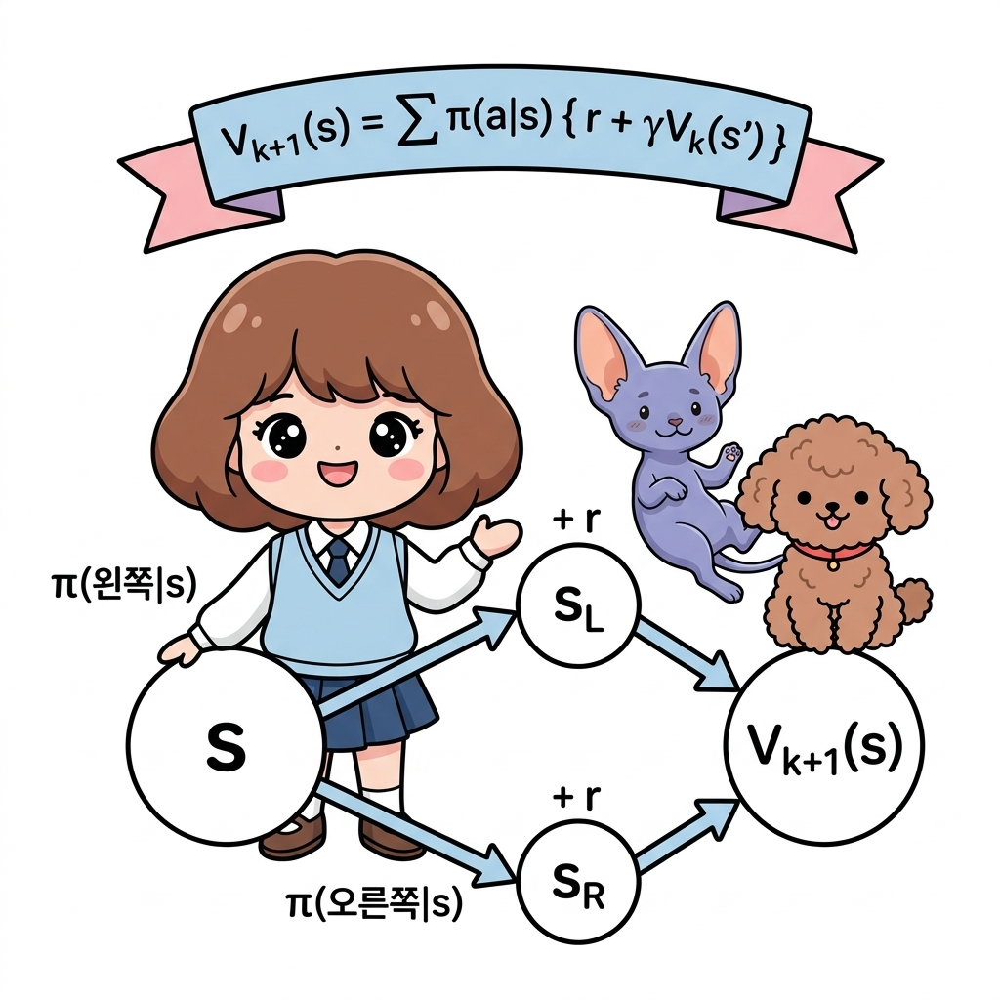

---


위의 [식 07.3]을 하나씩 쪼개어 해석하면 다음과 같이 매우 직관적입니다.

1. **행동 선택 확률 &pi;(*a* | *s*)**: 현재 상태 *s*에서 행동 *a*(예: 왼쪽 혹은 오른쪽)를 선택할 확률입니다.
2. **단 하나의 확정된 미래 *s'***: 행동 *a*를 취했을 때 도달하게 되는 다음 상태 *s'*가 정확히 1개로 결정되므로, 다음 상태들에 대한 복잡한 가중 합산(&Sigma;<sub>*s'*</sub>)을 할 필요가 없습니다.
3. **행동의 기대 가치 { *r* + *&gamma;* *V*<sub>*k*</sub>(*s'*) }**: 행동 *a*를 실행하여 얻는 즉각적인 보상 *r*과 그 목적지인 다음 상태 *s'*에 적혀있는 이전 버전의 가치 추정치 *V*<sub>*k*</sub>(*s'*)를 가져와 할인율 *&gamma;*를 곱해 더한 값입니다.
4. **행동들에 대한 합산 &Sigma;<sub>*a*</sub>**: 각 행동들을 통해 얻는 기대 가치를 행동 선택 확률(&pi;)로 곱해 모두 더해줍니다(가중 평균). 

이 과정을 거쳐 갱신된 새로운 가치가 바로 좌변의 현재 상태 가치 ***V*<sub>*k+1*</sub>(*s*)**가 됩니다. 

기존의 복잡한 [식 07.2]의 &Sigma;<sub>*a*, *s'*</sub>에서 상태 전이가 결정적이라는 제약 조건 덕분에 다음 상태를 찾는 복잡한 통계 확률 연산(&Sigma;<sub>*s'*</sub>)이 생략되어 식이 매우 명쾌해진 것입니다. 


---


### 07.2.3.2 2칸짜리 그리드 월드에서의 가치 함수 갱신

이번 문제에서는 [식 07.3]에 따라 가치 함수를 갱신해보겠습니다.

이제 정책 *&pi;*의 가치 함수를 반복적 정책 평가 알고리즘으로 구해보겠습니다. 


우선 초깃값으로 *V*<sub>0</sub>(*s*)를 0으로 설정합니다. 

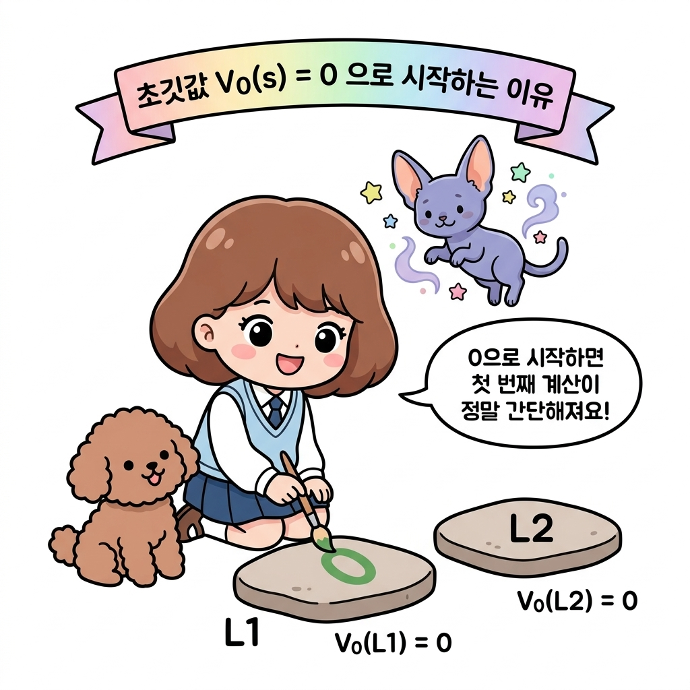


> 💡 **왜 굳이 초깃값(초기화)을 설정하고, 하필 0을 사용하는 걸까요?**
> 
> 1. **알고리즘 가동을 위한 출발점**: 반복적 정책 평가는 이전 버전의 가치 추정치 *V*<sub>*k*</sub>(*s'*)를 우변에 입력하여 새로운 가치 *V*<sub>*k+1*</sub>(*s*)를 계산해내는 징검다리식 순환 알고리즘입니다. 따라서 첫 바퀴(*k* = 0)를 돌리기 위한 **기초 출발점 데이터(*V*<sub>0</sub>)**가 반드시 메모리에 선언되어 있어야만 컴퓨터가 연산을 시작할 수 있습니다.
> 2. **어떤 값으로 시작하든 상관없음 (수렴 보장)**: 가치 수축 사상 원리에 의해, 초깃값을 100이나 -500으로 아무렇게나 설정해도 연산을 충분히 반복하면 결국에는 동일한 진짜 정답 가치인 *v*<sub>*&pi;*</sub>로 똑같이 수렴합니다.
> 3. **0의 강력한 수학적 단순함**: 0은 계산 과정을 가장 직관적으로 만들어 줍니다. 첫 번째 갱신 과정(*V*<sub>0</sub> &rarr; *V*<sub>1</sub>)에서 다음 상태의 가치 값들(*V*<sub>0</sub>(*s'*))이 전부 0이 되므로, 할인율 곱셈 연산(*&gamma;* *V*<sub>0</sub>(*s'*)) 부분이 통째로 날아갑니다. 덕분에 수식을 손으로 직접 계산하여 이해하기가 매우 쉽고 간단해집니다.


---


두 칸짜리 그리드 월드에서 상태는 두 개뿐이므로 다음과 같이 나타냅니다.

$$
\begin{aligned}
V_0(L1) &= 0 \\
V_0(L2) &= 0
\end{aligned}
$$

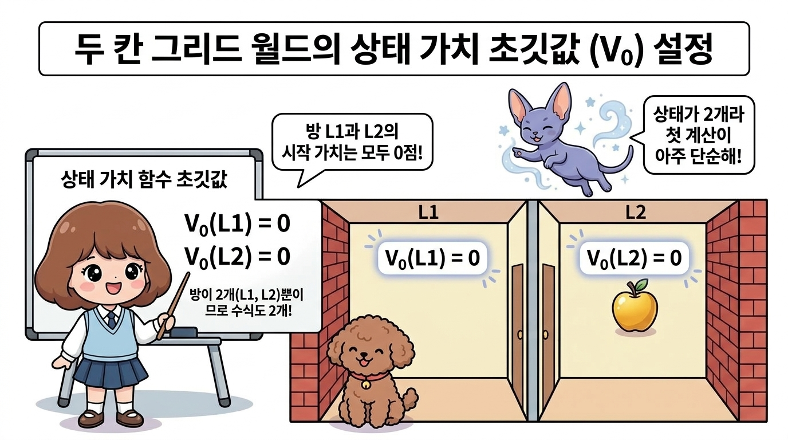


---


#### 이어서 [식 07.3]에 따라 *V*<sub>0</sub>(*s*)를 갱신합니다. 

이제 우리가 정의한 두 칸짜리 그리드 월드에서 **상태 가치 함수를 1차 갱신(*V*<sub>0</sub> &rarr; *V*<sub>1</sub>)하는 전체 과정**을 손계산으로 하나씩 풀어보겠습니다.

[그림 07-4]의 백업 다이어그램을 보면 가치 갱신이 어떤 경로를 통해 흘러가는지 한눈에 파악할 수 있습니다.

**그림 07-4** 상태 *L1*부터 시작하는 백업 다이어그램

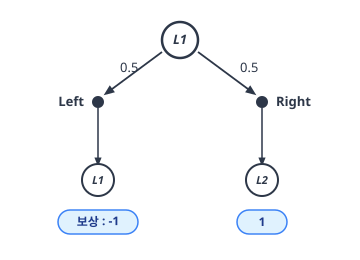

---

#### 그림과 같이 두 갈래 길로 나뉩니다. 

상태 ***L1*에서 출발한 에이전트(도로시)**는 균등 무작위 정책(*π*)에 따라 50%의 확률로 왼쪽, 50%의 확률로 오른쪽을 선택합니다. 

먼저 **왼쪽 행동**을 선택하는 첫 번째 경로를 계산해보겠습니다:

1. **상황**: 도로시가 왼쪽으로 이동하지만, 단단한 외벽에 가로막혀 쿵! 부딪히며 제자리 ***L1* 상태**에 그대로 머무릅니다.
2. **즉각 보상**: 벽에 부딪혔으므로 외벽 충돌 페널티인 **벌점 보상 -1**을 받습니다 (*r* = -1).
3. **다음 상태의 가치**: 도착한 다음 상태가 여전히 *L1*이므로, 우변에 대입할 이전 가치는 초깃값 ***V*<sub>0</sub>(*L1*) = 0**이 됩니다.
4. **할인율 적용**: 할인율 *γ* = 0.9를 적용하여 [식 07.3]에 대입합니다.

$$
0.5 \times \{ -1 + 0.9 \times V_0(L1) \} = 0.5 \times \{ -1 + 0.9 \times 0 \} = -0.5
$$


---

#### [그림 07-4]의 또 다른 가능성은 상태 *L1*에서 **오른쪽**으로 가는 행동을 선택한 경우입니다. 

이번에는 50%의 확률로 **오른쪽 행동**을 선택하는 두 번째 경로를 계산해보겠습니다:

1. **상황**: 도로시가 오른쪽 문을 열고 한 걸음 내딛어 옆 칸인 ***L2* 상태**로 경쾌하게 전진합니다.
2. **즉각 보상**: 안전하게 전진하여 *L2* 방에 도착했으므로 달콤한 황금 사과 **보상 +1**을 기분 좋게 획득합니다 (*r* = +1).
3. **다음 상태의 가치**: 도착한 다음 상태가 *L2*이므로, 우변에 대입할 이전 가치는 초깃값 ***V*<sub>0</sub>(*L2*) = 0**이 됩니다.
4. **오른쪽 경로의 가치 기여분**:

$$
0.5 \times \{ 1 + 0.9 \times V_0(L2) \} = 0.5 \times \{ 1 + 0.9 \times 0 \} = +0.5
$$


---

#### 이상으로부터 *V*<sub>1</sub>(*L1*)은 다음과 같이 구할 수 있습니다.

벨만 갱신식에 따라 왼쪽 행동에서 얻은 가치 기여분(-0.5)과 오른쪽 행동에서 얻은 가치 기여분(+0.5)을 확률 가중치로 합산하면, 최종적으로 갱신된 새로운 가치 추정치 ***V*<sub>1</sub>(*L1*)**이 도출됩니다.

$$
\begin{aligned}
V_1(L1) &= 0.5 \{ -1 + 0.9 V_0(L1) \} + 0.5 \{ 1 + 0.9 V_0(L2) \} \\
&= 0.5 \cdot (-1 + 0.9 \cdot 0) + 0.5 \cdot (1 + 0.9 \cdot 0) \\
&= -0.5 + 0.5 \\
&= 0
\end{aligned}
$$

왼쪽 벽에 부딪혀 깎인 점수(-0.5)와 오른쪽 방으로 전진해 얻은 점수(+0.5)가 정확히 상쇄되어, 1차 갱신 후의 가치는 여전히 **0**을 유지합니다.


---

#### 같은 방법으로 *V*<sub>1</sub>(*L2*)도 계산할 수 있습니다. 

이번에는 에이전트(도로시)가 **오른쪽 방인 *L2*에서 출발하는 경우**를 동일한 원리로 손계산해보겠습니다.

1. **왼쪽으로 이동하는 경우 (확률 0.5)**:
   - 이전 방인 *L1*로 후진합니다. 이때 주어지는 보상은 없습니다 (*r* = 0).
   - 왼쪽 경로의 가치 기여분:
   $$
   0.5 \times \{ 0 + 0.9 \times V_0(L1) \} = 0.5 \times (0 + 0) = 0
   $$
2. **오른쪽으로 이동하는 경우 (확률 0.5)**:
   - 오른쪽 외벽에 쿵! 부딪혀 제자리 *L2*에 머무르고 벌점 **보상 -1**을 받습니다 (*r* = -1).
   - 오른쪽 경로의 가치 기여분:
   $$
   0.5 \times \{ -1 + 0.9 \times V_0(L2) \} = 0.5 \times (-1 + 0) = -0.5
   $$

두 경로의 기여분을 합산한 최종 식은 다음과 같습니다.

$$
\begin{aligned}
V_1(L2) &= 0.5 \{ 0 + 0.9 V_0(L1) \} + 0.5 \{ -1 + 0.9 V_0(L2) \} \\
&= 0.5 \cdot (0 + 0.9 \cdot 0) + 0.5 \cdot (-1 + 0.9 \cdot 0) \\
&= 0 + (-0.5) \\
&= -0.5
\end{aligned}
$$

이것으로 두 칸짜리 그리드 월드의 모든 상태(*L1*, *L2*)에 대한 1차 가치 함수 갱신이 완료되었습니다!


---


#### 결과를 정리하면 [그림 07-5]와 같습니다.

모든 상태의 초깃값을 0으로 둔 상태(*V*<sub>0</sub>)에서 벨만 갱신식을 1회 적용한 결과(*V*<sub>1</sub>)는 다음과 같이 변했습니다:


$$
V_0 = \{ L1: 0.0, \; L2: 0.0 \} \quad \longrightarrow \quad V_1 = \{ L1: 0.0, \; L2: -0.5 \}
$$


**그림 07-5** 가치 함수 1차 갱신

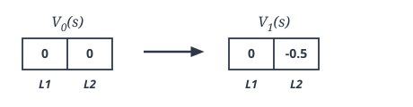

도로시와 지니가 칠판에 적어둔 아래의 요약표를 보면, 복잡해 보이던 수식들이 단지 각 방향의 보상과 확률의 단순한 사칙연산이었음을 명쾌하게 이해할 수 있습니다.


---

#### 이제부터는 같은 과정을 반복하면 됩니다. 

방금 구한 1차 갱신값 *V*<sub>1</sub>(*s*)를 다시 우변에 입력값으로 대입하여 *V*<sub>2</sub>(*s*)를 계산하고, 이어서 *V*<sub>2</sub>(*s*)를 대입해 *V*<sub>3</sub>(*s*)를 계산하는 과정을 징검다리처럼 쉼 없이 반복합니다.


$$
V_0(s) \; \longrightarrow \; V_1(s) \; \longrightarrow \; V_2(s) \; \longrightarrow \; V_3(s) \; \dots \; \longrightarrow \; v_\pi(s)
$$


수축 사상(Contraction Mapping) 원리에 의해, 초깃값을 0이 아닌 100이나 -500으로 아무렇게나 설정했더라도 연산을 거듭할수록 오차가 *γ*배씩 줄어들어 결국 **유일한 진짜 정답 가치 함수인 *v*<sub>*π*</sub>(*s*) = [-2.25, -2.75]**로 완벽하게 수렴하게 됩니다.

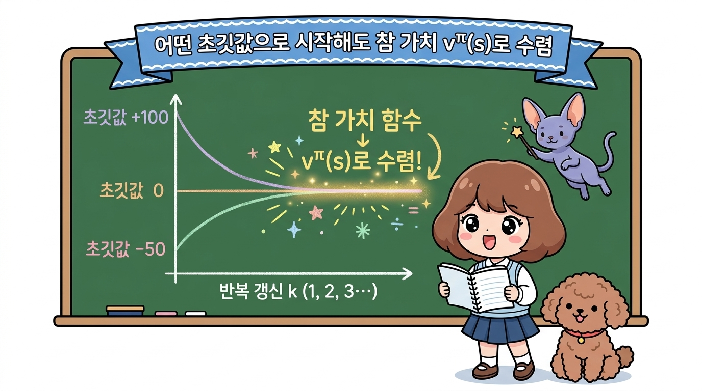

---


### 07.2.3.3 파이썬 구현 및 임곗값 설정 실습

손으로 1차 갱신을 풀어보았으니, 이제 컴퓨터 파이썬 코드로 100회 이상의 반복 갱신을 자동으로 시뮬레이션해보겠습니다.


독자 여러분이 직접 코드를 내려받아 실행해볼 수 있도록 독립 실행 파일(`dp.py`)을 제공합니다:

> 💾 **파이썬 실습 소스 코드 다운로드**:  
> [📥 dp.py 다운로드](./dp.py)

#### 1. 100회 고정 반복 갱신 코드

가장 먼저 갱신을 정해진 횟수(100회)만큼 단순 무식하게 반복하는 기초 구현입니다.

```python
# ch07/dp.py - 파트 1: 100회 고정 반복
V = {'L1': 0.0, 'L2': 0.0}
new_V = V.copy()  # 계산 오염을 방지하기 위한 V의 복사본

for _ in range(100):
    # 벨만 갱신식에 따라 새로운 가치 계산
    new_V['L1'] = 0.5 * (-1 + 0.9 * V['L1']) + 0.5 * (1 + 0.9 * V['L2'])
    new_V['L2'] = 0.5 * (0 + 0.9 * V['L1']) + 0.5 * (-1 + 0.9 * V['L2'])
    
    # 갱신된 새 값을 이전 값에 덮어쓰기 (다음 스텝 준비)
    V = new_V.copy()
    print(V)
```

**출력 결과**

```text
{'L1': 0.0, 'L2': -0.5}
{'L1': -0.22499999999999998, 'L2': -0.725}
{'L1': -0.42749999999999994, 'L2': -0.9274999999999999}
...
{'L1': -2.24999335965027827, 'L2': -2.7499335965027827}
```

이번 문제는 상태가 두 개뿐이라 각 상태의 가치 함수를 파이썬의 `dict` 자료형에 간단히 보관했습니다.


---


#### 그리고 현재 상태의 가치 함수를 `V`, 새로 갱신할 가치 함수를 `new_V`라고 했습니다.

이 코드를 실행하면 `V`가 갱신되는 과정을 실시간으로 확인할 수 있습니다. 


참고로 이론적으로 연립방정식을 직접 풀어 구한 진짜 정답 가치 함수의 값은 ***v*<sub>*π*</sub>(*L1*) = -2.25, *v*<sub>*π*</sub>(*L2*) = -2.75**입니다. 앞의 출력 결과를 보면 100번째 갱신 시점에서 이론상 참값과 소수점 아래 넷째 자리까지 완벽하게 일치하는 모습을 볼 수 있습니다!


> 💡 **NOTE_ 딕셔너리 복사(`V.copy()`)가 필수적인 이유**  
> 파이썬에서 만약 `new_V = V`라고 단순 대입하면, 두 변수가 **컴퓨터 메모리 상의 동일한 객체 주소**를 공유하게 됩니다. 그렇게 되면 `new_V['L1']`을 수정하는 순간 `V['L1']`까지 동시에 바뀌어버려, 뒤이어 계산되는 `new_V['L2']`가 이전 값이 아닌 방금 바뀐 엉뚱한 값을 읽어버리는 치명적인 계산 오염이 일어납니다.  
> 따라서 반드시 `new_V = V.copy()`를 호출하여 완전히 독립된 새로운 메모리 공간에 복제본을 만들어 분리해야 합니다.

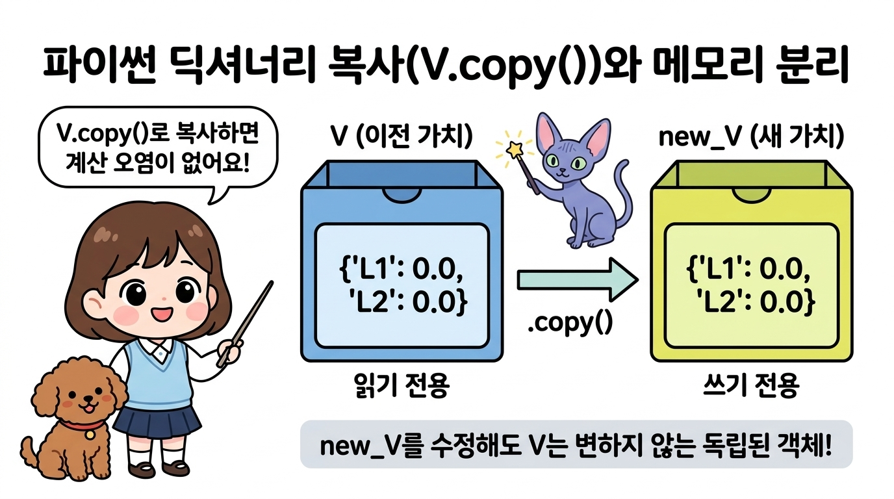


---


#### 앞 코드에서는 갱신을 정해진 횟수만큼(100회) 진행했습니다. 

하지만 실제 문제에서는 정답 가치에 도달하기 위해 몇 번을 돌아야 할지 사전에 알 수 없습니다. 불필요하게 1000번, 1만 번을 돌리면 컴퓨터 자원이 낭비되고, 너무 적게 돌리면 덜 수렴된 오답을 얻게 됩니다.


따라서 **가치의 변화량(차이)이 아주 미세해졌을 때 자동으로 멈추는 "임곗값(threshold) 기반 중단 조건"**을 도입합니다.

> 💾 **파이썬 실습 소스 코드 다운로드**:  
> [📥 dp.py 다운로드](./dp.py)

<div align="right"><b>ch07/dp.py</b></div>

```python
V = {'L1': 0.0, 'L2': 0.0}
new_V = V.copy()

cnt = 0  # 갱신 횟수 카운터
while True:
    # 1. 새로운 가치 추정치 계산
    new_V['L1'] = 0.5 * (-1 + 0.9 * V['L1']) + 0.5 * (1 + 0.9 * V['L2'])
    new_V['L2'] = 0.5 * (0 + 0.9 * V['L1']) + 0.5 * (-1 + 0.9 * V['L2'])

    # 2. 이번 단계에서 갱신된 양의 최댓값(delta) 측정
    delta = abs(new_V['L1'] - V['L1'])
    delta = max(delta, abs(new_V['L2'] - V['L2']))

    # 3. 이전 가치를 새 가치로 교체
    V = new_V.copy()
    cnt += 1

    # 4. 수렴 판정: 변화량이 0.0001보다 작아지면 루프 탈출!
    if delta < 0.0001:  # 임곗값 theta = 0.0001
        print("최종 가치 추정치:", V)
        print('총 갱신 횟수:', cnt)
        break
```

**출력 결과**

```text
최종 가치 추정치: {'L1': -2.249167525908671, 'L2': -2.749167525908671}
총 갱신 횟수: 76
```

임곗값을 `0.0001`로 설정하고 갱신된 양의 최댓값이 임곗값 밑으로 떨어질 때까지 `while` 순환문을 반복 실행했습니다.


---


#### 갱신된 양의 최댓값은 `new_V`와 `V`에서 대응하는 원소들 간 차이의 절댓값으로 구합니다. 

이번 문제에서는 상태가 2개(*L1*, *L2*)뿐이므로 두 원소의 차이의 절댓값 중 더 큰 값을 선택합니다. 그 값이 바로 오차의 지표인 **`delta`(*&Delta;*)**입니다.


$$
\Delta = \max \left( |\text{new\_V}(L1) - V(L1)|, \; |\text{new\_V}(L2) - V(L2)| \right)
$$


`delta`가 우리가 설정한 허용 오차 임곗값(*&theta;* = 0.0001)보다 작아지면, 더 이상 값을 갱신해도 유의미한 변화가 없다고 판단하여 `break`로 루프를 깔끔하게 종료합니다.


출력 결과를 보면 **정확히 76회 갱신**한 끝에 참값([-2.25, -2.75])과 오차 0.0008 수준의 완벽한 근사해에 도달했음을 확인할 수 있습니다.

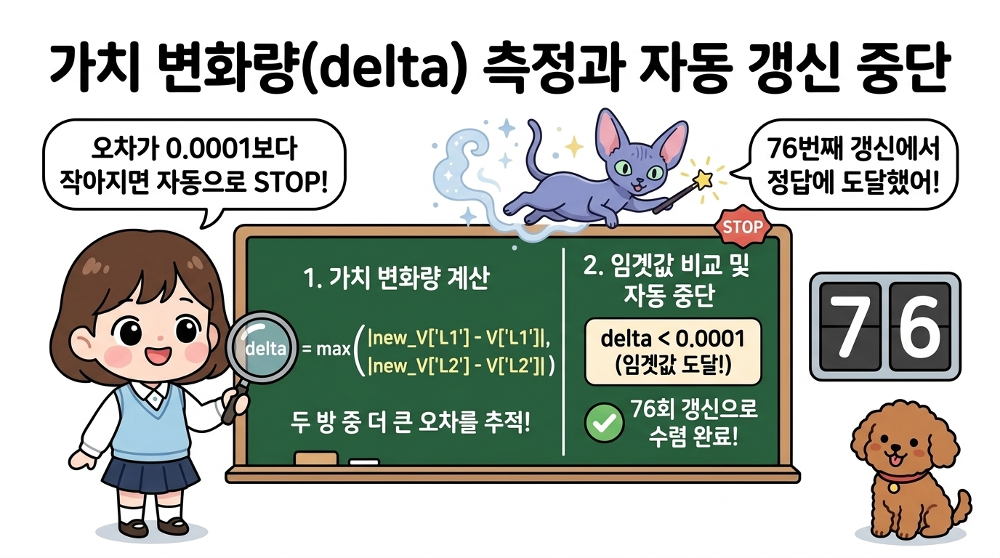


---


## 07.2.4 반복적 정책 평가 구현 (2) - 덮어쓰기 방식

앞선 07.2.3절에서는 반복적 정책 평가 알고리즘을 구현하기 위해 두 개의 딕셔너리를 사용했습니다. 


하나는 현재의 이전 가치 함수를 보관하는 읽기 전용 `V`, 다른 하나는 새롭게 계산된 가치 함수를 임시로 받아 적는 쓰기 전용 `new_V`입니다. 


> 👧 **도로시**: "지니! 공책 두 개(`V`, `new_V`)를 번갈아 펼쳐놓고 옮겨 적는 게 은근히 손도 많이 가고 번거로워. 공책 하나만 써서 바로바로 지우개로 지우고 새 값을 쓰면 안 될까?"
> 
> 🐱 **지니**: "후후, 정말 날카로운 관찰이야 도로시! 바로 그게 컴퓨터 과학과 강화학습에서 가장 사랑받는 **'제자리 덮어쓰기(In-place Update)'** 비법이란다. 공책을 절반만 써서 메모리도 아끼고, 방금 계산한 따끈따끈한 최신 정보를 곧바로 다음 방 계산에 활용하니 계산 속도도 훨씬 빨라지지!"
> 
> 🐶 **토토**: "공책 하나로 쓱싹쓱싹! 더 가볍고 빠르게 달린다, 멍멍! 🐾"


---


#### 이 두 딕셔너리를 사용하여 [그림 07-6]과 같이 가치 함수를 갱신했습니다.

**그림 07-6** 2개 딕셔너리를 사용한 완전 동기 갱신 방법

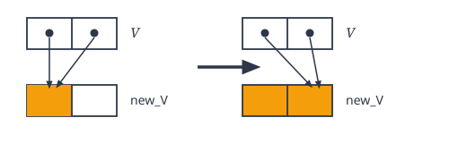

[그림 07-6]에서 주목할 점은 `new_V`의 각 원소를 계산할 때, 언제나 오직 이전 단계 시점의 `V`라는 딕셔너리 값만을 참조하고 있다는 점입니다. 


이 방식은 수학적인 벨만 갱신식 정의(*V*<sub>*k+1*</sub>을 계산할 때 우변에 오직 *V*<sub>*k*</sub>만을 대입)에 가장 충실한 정석적인 방법이지만, **"방금 갱신된 따끈따끈한 최신 가치 정보를 다음 방을 계산할 때 곧바로 써먹지 못하고 다음 바퀴까지 기다려야 한다"**는 아쉬운 점이 있습니다.

---

#### 다르게 구현할 수도 있습니다. 

바로 딕셔너리를 2개로 쪼개지 않고, **단 하나만 선언한 뒤 계산이 끝나는 즉시 그 자리에서 값을 '덮어쓰는(In-place)' 방법**입니다. 


그림으로 표현하면 다음과 같습니다.

**그림 07-7** 덮어쓰기(In-place) 갱신 방식

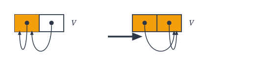

새로운 방식에서는 `V` 하나만 사용하여 각 원소를 즉시 덮어씁니다. 이를 **'덮어쓰기 방식(In-place Method)'**이라고 부릅니다.


> 💡 **NOTE_ 덮어쓰기 방식이 더 빠른 이유**  
> 두 방식 모두 무한히 반복하면 동일한 정답 가치 함수로 수렴한다는 사실이 수학적으로 증명되어 있습니다.  
> 하지만 **'덮어쓰기 방식'이 실전에서 대체로 훨씬 더 빠릅니다.** 갱신한 최신 원소를 그 다음 원소를 계산할 때 '즉시 재활용'하기 때문입니다.  
> 예를 들어 [그림 07-7]에서는 왼쪽 *L1*의 '이미 갱신된 최신 값'을 곧바로 사용하여 오른쪽 *L2*의 가치를 계산하므로, 가치의 전파 속도가 비약적으로 빨라집니다.

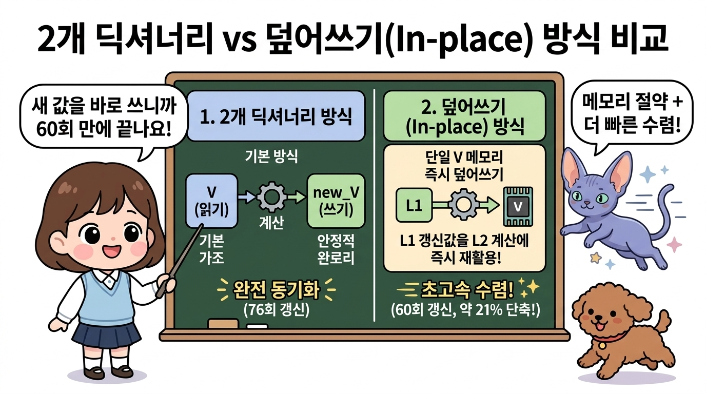


---


### 07.2.4.1 덮어쓰기 방식(In-place) 파이썬 구현

이제 DP를 '덮어쓰기 방식'으로 구현해봅시다.


독자 여러분이 직접 코드를 내려받아 실행해보고 이전 방식과 속도를 비교해볼 수 있도록 독립 실행 파일(`dp_inplace.py`)을 제공합니다:

> 💾 **파이썬 실습 소스 코드 다운로드**:  
> [📥 dp_inplace.py 다운로드](./dp_inplace.py)

<div align="right"><b>ch07/dp_inplace.py</b></div>

```python
V = {'L1': 0.0, 'L2': 0.0}

cnt = 0
while True:
    # 1. 상태 L1 갱신 (계산 즉시 V['L1']에 덮어씀)
    t = 0.5 * (-1 + 0.9 * V['L1']) + 0.5 * (1 + 0.9 * V['L2'])
    delta = abs(t - V['L1'])
    V['L1'] = t

    # 2. 상태 L2 갱신 (방금 갱신된 새로운 V['L1'] 값을 '즉시' 대입하여 계산!)
    t = 0.5 * (0 + 0.9 * V['L1']) + 0.5 * (-1 + 0.9 * V['L2'])
    delta = max(delta, abs(t - V['L2']))
    V['L2'] = t

    cnt += 1
    # 수렴 판정
    if delta < 0.0001:
        print("최종 가치 추정치:", V)
        print('총 갱신 횟수:', cnt)
        break
```

**출력 결과**

```text
최종 가치 추정치: {'L1': -2.2493782177156936, 'L2': -2.7494201578106514}
총 갱신 횟수: 60
```

이번에는 별도의 `new_V` 없이 오직 딕셔너리 `V` 하나만 사용하여 계산된 원소들을 즉시 덮어썼습니다. 


결과를 보면 갱신은 **60회** 만에 끝났습니다! 이전 2개 딕셔너리 방식에서는 76회였으니, **갱신 횟수가 무려 16회(약 21%)나 단축**되었네요. 


메모리 공간도 절약되고 수렴 속도도 훨씬 빠르기 때문에, 앞으로 우리가 다룰 모든 강화학습 동적 프로그래밍 알고리즘에서는 이 효율적인 **'덮어쓰기 방식(In-place)'**을 표준으로 채택하여 구현해 나갈 것입니다!


---


## 07.2.5 학습 정리

> 👧 **도로시**: "지니! 복잡해 보이던 연립방정식을 직접 풀지 않고도, 0에서 출발해서 벨만 갱신식과 덮어쓰기 방식으로 참값([-2.25, -2.75])을 컴퓨터로 척척 찾아내는 과정이 정말 마법처럼 신기했어!"
> 
> 🐱 **지니**: "후후, 대견하구나 도로시! '현재의 어림셈을 이용해 다음 어림셈을 계산하는' 부트스트랩과 동적 프로그래밍의 강력한 수축 사상 원리를 완벽하게 마스터한 덕분이란다. 이제 주어진 정책을 평가할 줄 알게 되었으니, 다음 절에서는 더 좋은 정책을 스스로 찾아 나서는 '정책 개선'과 '정책 반복법'의 신나는 모험을 떠나보자!"
> 
> 🐶 **토토**: "정책 평가 정복 완료! 다음 보물 찾으러 가자, 멍멍! 🐾"


**그림 07-8** 07.2절 동적 프로그래밍과 정책 평가의 핵심 원리를 완벽하게 정복하고 수료증을 자랑하는 도로시와 지니, 토토

1. **반복적 정책 평가의 핵심 원리**:
   - 연립방정식을 한 번에 풀지 않고, 벨만 방정식을 반복 갱신 규칙(Update Rule)으로 변환하여 가치 함수를 단계별로 다듬어 나가는 알고리즘입니다.
   - 수학적 수축 사상(Contraction Mapping) 원리에 의해, 초깃값을 어떤 값(*V*<sub>0</sub> = 0 등)으로 설정하더라도 충분히 반복하면 언제나 유일한 참 가치 함수 *v*<sub>*π*</sub>(*s*)로 반드시 수렴합니다.

2. **부트스트랩(Bootstrapping) 메커니즘**:
   - 다음 상태의 가치 추정치(*V*(*s'*))를 우변의 입력으로 대입하여 현재 상태의 새로운 가치 추정치(*V*(*s*))를 계산하는 순환적 갱신 방식입니다.
   - 실제 환경을 무한히 끝까지 시뮬레이션하지 않고도, 단 한 걸음 앞의 가치를 이용해 효율적으로 학습할 수 있습니다.

3. **임곗값(*θ*) 기반의 자동 종료 판정**:
   - 고정된 횟수(예: 100회) 동안 무작정 반복하는 대신, 이전 가치와 새 가치 간의 최대 변화량인 오차 지표 *&delta;* = max(|new_V(*s*) - V(*s*)|)를 실시간으로 측정합니다.
   - *&delta;* < *&theta;* (예: 0.0001) 조건을 만족하는 순간 루프를 스스로 탈출함으로써 불필요한 계산 낭비를 막고 76회 만에 스마트하게 수렴을 완료합니다.

4. **제자리 덮어쓰기(In-place) 방식의 압도적 효율성**:
   - 읽기용 `V`와 쓰기용 `new_V`를 분리하는 정석적 2개 딕셔너리 동기 방식 대신, 단 하나의 딕셔너리 `V`에 계산 즉시 값을 덮어쓰는 기법입니다.
   - 방금 계산된 최신 가치 정보를 다음 상태 계산에 지체 없이 즉각 재활용하므로, 수렴 횟수가 76회에서 60회로 약 21% 단축되고 메모리 사용량도 절반으로 절감되어 실전 강화학습의 표준 기법으로 널리 쓰입니다.

