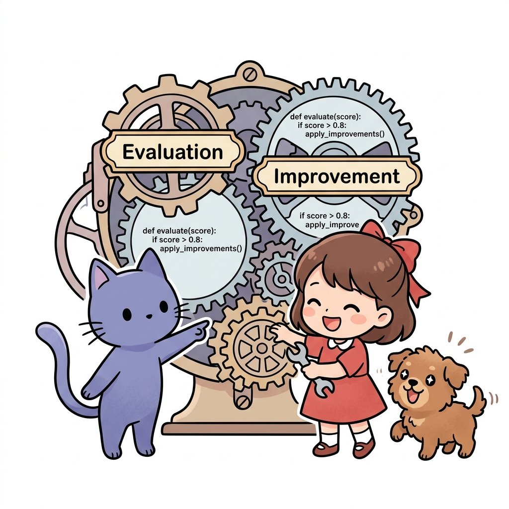
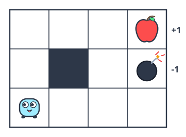
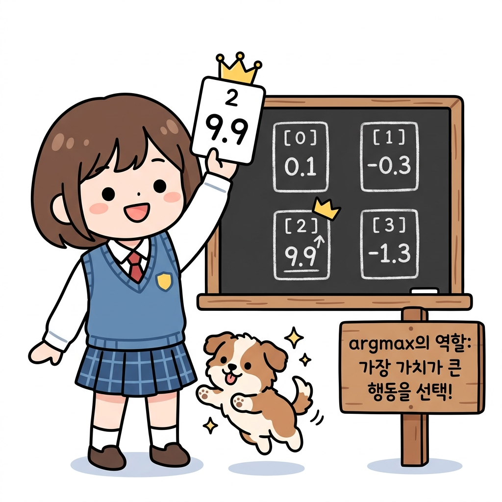
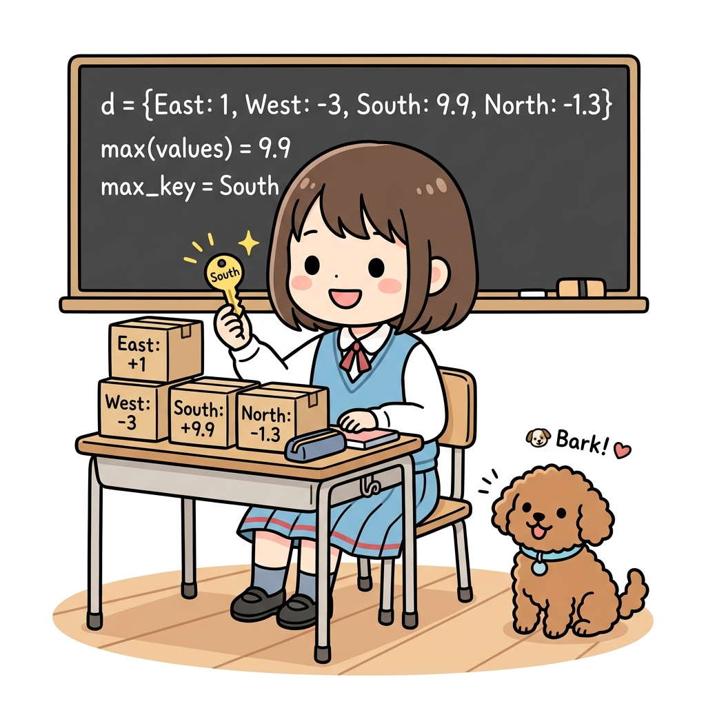
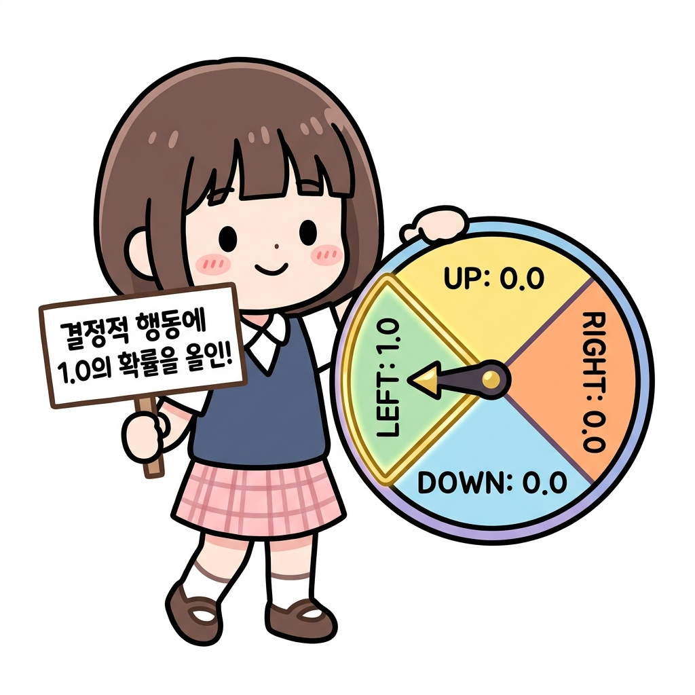
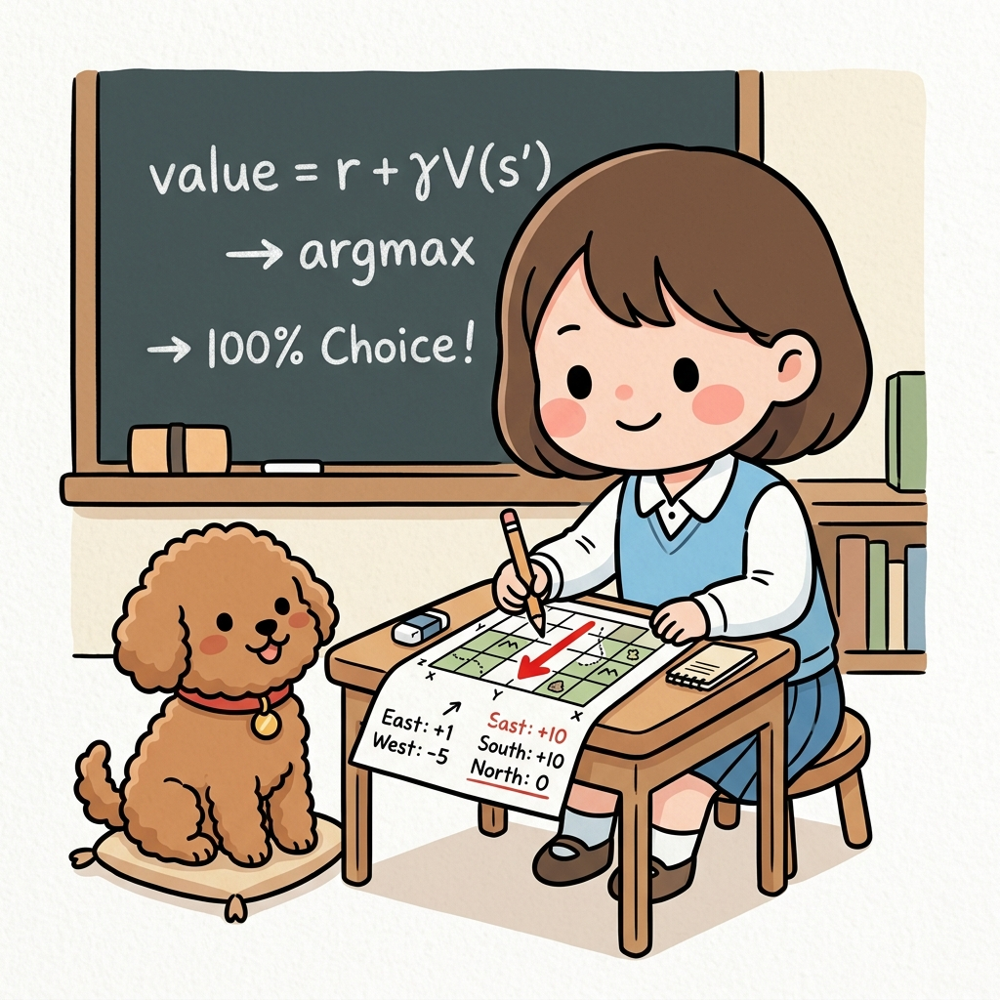
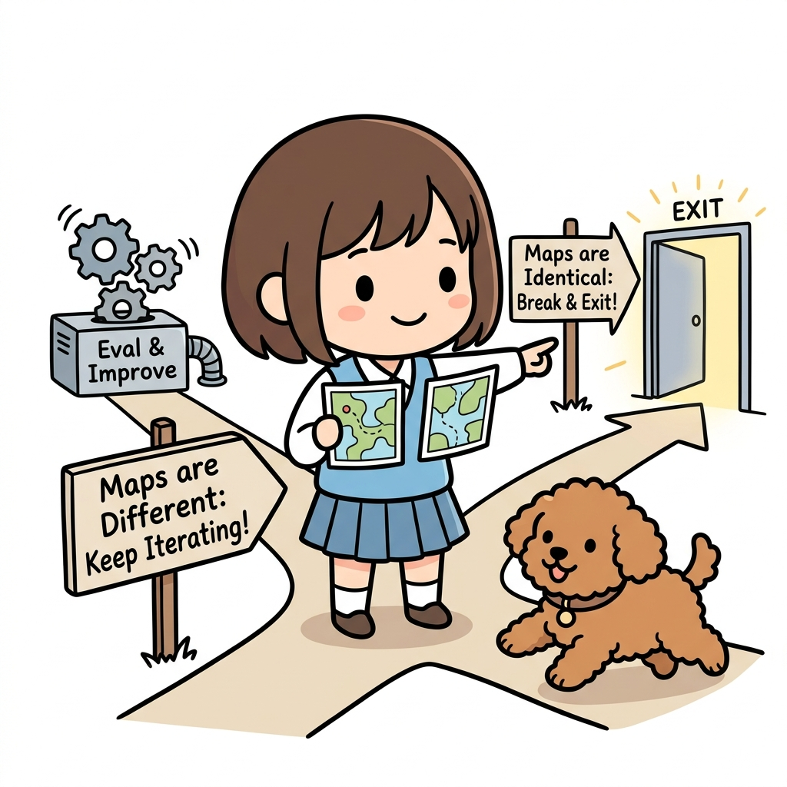
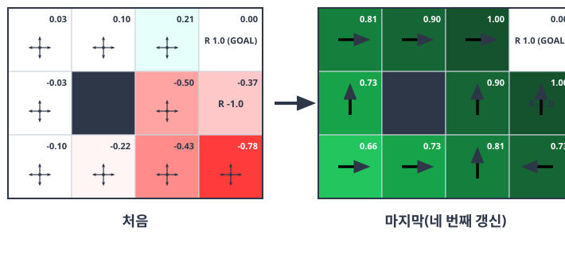

# 07.5 정책 반복법 구현

정책 반복법을 이용하여 최적 정책을 찾아봅시다. 

**그림 07-14-1** 정책 평가와 개선 기어를 파이썬 렌치로 유기적으로 연결하여 조립하는 지니와 도로시


정책 반복법의 완성은 우리가 앞서 만든 **'정책 평가(가치 함수 계산)' 기어**와 앞으로 만들 **'정책 개선(탐욕화 업데이트)' 기어**를 파이썬 코드로 톱니처럼 정확히 맞물려 돌리는 일입니다. 지니의 설명을 따라 두 거대한 연산 기어가 조립되어 스스로 움직이는 마법 같은 루프를 파이썬 코드로 설계하러 떠나볼까요?

---


다시 한번 [그림 07-15]의 '3 × 4 그리드 월드'를 풀어보겠습니다.

**그림 07-15** 3 × 4 그리드 월드




정책을 평가하는 코드는 앞에서 이미 구현했습니다. 남은 일은 '정책 개선'뿐입니다.


----


# 07.5.1 정책 개선

정책을 개선하기 위해서는 **현재의 가치 함수**에 대한 **탐욕 정책**을 구합니다. 


수식으로 다음과 같이 표현할 수 있습니다.
$$
\mu'(s) = \operatorname{argmax}_a \sum_{s'} p(s' \mid s, a) \{ r(s, a, s') + \gamma v_{\mu}(s') \} \tag{식 07.7}
$$


#### 결정적

또한 이번 문제에서 상태는 고유하게 전이됩니다. 즉, 결정적입니다. 

따라서 탐욕화를 다음과 같이 단순화할 수 있습니다.

*s'* = *f*(*s*, *a*) 일 때
$$
\mu'(s) = \operatorname{argmax}_a \{ r(s, a, s') + \gamma v_{\mu}(s') \} \tag{식 07.8}
$$

[식 07.8]과 같이 다음 상태 *s'*는 하나만 존재할 수 있습니다.


#### 탐욕정책

이제 [식 07.8]을 바탕으로 탐욕 정책을 구하는 함수를 구현하면 됩니다. 

사전 준비로 `argmax()` 함수부터 구현하겠습니다. `argmax()`는 딕셔너리를 매개변수로 받아 값이 가장 큰 원소의 키를 반환합니다. 


사용법부터 보겠습니다.

```python
action_values = {0: 0.1, 1: -0.3, 2: 9.9, 3: -1.3} # 9.9가 최댓값(키는 2)

max_action = argmax(action_values)
print(max_action)
```

**출력 결과**

```text
2
```

구현하기는 어렵지 않습니다.





#### argmax()

보다시피 argmax() 는 매우 간단한 코드입니다. 


<div align="right"><b>ch07/policy_iter.py</b></div>

```python
def argmax(d):
    max_value = max(d.values())
    max_key = 0
    for key, value in d.items():
        if value == max_value:
            max_key = key
    return max_key
```

매개변수로 주어진 딕셔너리 `d`에서 가장 큰 값을 찾아 그 키를 반환합니다. 코드를 간소화하기 위해 최댓값이 여러 개라면 마지막 키를 반환하도록 했습니다. 

따라서 언제나 하나의 키만 반환합니다.

> **💡 그림으로 보는 argmax() 작동 로직 (딕셔너리 키 찾기)**
> 
> * **딕셔너리 `d` (상자들)**: 동, 서, 남, 북 4방향의 점수가 적힌 상자(딕셔너리)가 들어옵니다. (예: `d = {East: 1, West: -3, South: 9.9, North: -1.3}`)
> * **최댓값 찾기 (`max_value = max(d.values())`)**: 4개의 상자의 점수 중에서 가장 큰 값인 **`9.9`**를 찾습니다.
> * **최댓값의 키 찾기 (`for key, value in d.items()`)**: 상자들을 하나씩 열어보며 점수가 `9.9`인 상자를 찾습니다. 그 결과인 **`South`** 방향(키)을 획득하여 반환합니다. 
>   (만약 공동 1등이 존재한다면, 코드는 마지막에 대조된 키를 최종 갱신하여 반환하게 됩니다.)
> 
> **그림 07-17** 4개의 점수 상자 중 가장 큰 값(9.9)을 가진 남쪽(South) 열쇠를 꺼내는 도로시와 토토
> 


#### 탐욕화 함수

이제 `argmax()` 함수를 사용하여 가치 함수를 탐욕화하는 함수를 구현하겠습니다.

<div align="right"><b>ch07/policy_iter.py</b></div>

```python
def greedy_policy(V, env, gamma):
    pi = {}

    for state in env.states():
        action_values = {}

        for action in env.actions():
            next_state = env.next_state(state, action)
            r = env.reward(state, action, next_state)
            value = r + gamma * V[next_state] # ❶
            action_values[action] = value

        max_action = argmax(action_values) # ❷
        action_probs = {0: 0, 1: 0, 2: 0, 3: 0}
        action_probs[max_action] = 1.0
        pi[state] = action_probs # ❸
    return pi
```

`greedy_policy(V, env, gamma)` 함수는 가치 함수 `V`, 환경 `env`, 할인율 `gamma`를 매개변수로 받고, 건네진 가치 함수 `V`를 사용하여 탐욕화한 정책을 반환합니다.


❶에서는 각 행동을 대상으로 [식 07.8]의 *r*(*s*, *a*, *s'*) + *γv*<sub>*π*</sub>(*s'*) 부분을 계산합니다. 그리고 ❷에서 `argmax()` 함수를 호출하여 가치 함수 값이 가장 큰 행동(`max_action`)을 찾은 다음, `max_action`이 선택될 확률이 1.0이 되도록(결정적이 되도록) 확률 분포를 생성합니다. 그리고 이를 상태 `state`에서 취할 수 있는 행동의 확률 분포로 설정합니다. 이상이 탐욕 정책을 구현한 함수입니다.



> **💡 그림으로 보는 greedy_policy() 작동 로직**
> 
> * **❶ 가치 계산 (`value = r + gamma * V[next_state]`)**: 
>   각 상태(격자 칸)에서 가능한 행동(동서남북)을 하나씩 취해봅니다. 각 방향으로 한 걸음 갔을 때 얻는 **즉각 보상 사과(*r*)**와 **이동한 땅의 미래 가치 표 점수(*V[next_state]*)에 할인율(*γ*)을 곱한 값**을 더해, 그 방향의 총 가치를 구합니다.
> * **❷ 가장 높은 가치 탐색 (`max_action = argmax(action_values)`)**: 
>   동서남북 4방향의 점수를 대조하여 가장 기대 가치가 높은 방향(예: 남쪽의 +10)을 찾아냅니다.
> * **❸ 정책에 100% 선택 기록 (`action_probs[max_action] = 1.0`)**: 
>   가장 큰 기대 점수를 주는 그 한 방향의 선택 확률을 100%(1.0)로 설정하고 나머지는 0으로 만들어, 도로시의 새 보물 지도(`pi`)의 해당 칸에 꾹 기록해 둡니다. 이 과정을 격자 세상의 모든 칸을 돌며 수행합니다.
> 
> **그림 07-16** 각 상태에서 가장 좋은 방향을 계산하여 지도(π)에 화살표로 꾹 그리는 도로시
> 

> CAUTION_ 탐욕 정책은 결정적인 정책을 만들어줍니다. 따라서 ❸에서 `pi[state] = max_action`처럼 행동을 하나만 지정할 수도 있습니다. 하지만 정책 평가를 수행하는 `policy_eval(pi, ...)` 함수가 확률적 정책을 받도록 구현되어 있으므로 이번 코드도 확률적으로 구현했습니다.


---


# 07.5.2 평가와 개선 반복

이제 평가와 개선을 반복하는 '정책 반복법'을 구현할 준비가 되었습니다. 


#### 함수작성

이번 절에서는 정책 반복법을 `policy_iter(env, gamma, threshold=0.001, is_render=False)`라는 함수로 구현합니다. 


각 매개변수의 타입과 의미는 다음과 같습니다.

• `env` (Environment): 환경
• `gamma` (float): 할인율
• `threshold` (float): 정책을 평가할 때 갱신을 중지하기 위한 임곗값
• `is_render` (bool): 정책 평가 및 개선 과정을 렌더링할지 여부


다음은 코드입니다.

<div align="right"><b>ch07/policy_iter.py</b></div>

```python
def policy_iter(env, gamma, threshold=0.001, is_render=False):
    pi = defaultdict(lambda: {0: 0.25, 1: 0.25, 2: 0.25, 3: 0.25})
    V = defaultdict(lambda: 0)

    while True:
        V = policy_eval(pi, V, env, gamma, threshold) # ❶ 평가
        new_pi = greedy_policy(V, env, gamma) # ❷ 개선

        if is_render:
            env.render_v(V, pi)

        if new_pi == pi: # ❸ 갱신 여부 확인
            break
        pi = new_pi

    return pi
```


먼저 정책 `pi`와 가치 함수 `V`를 초기화합니다. `defaultdict`를 사용하여 초깃값을 부여했습니다. 정책 `pi`의 초깃값은 각 행동이 균등하게 선택되도록 설정했습니다.


이 코드에서 핵심은 ❶과 ❷입니다. ❶에서는 현재의 정책을 평가하여 가치 함수 `V`를 얻습니다. 그다음 ❷에서 `V`를 바탕으로 탐욕화된 정책 `new_pi`를 얻습니다.


❸에서는 정책이 갱신되었는지 확인합니다. 

갱신되지 않았다면 벨만 최적 방정식을 만족하는 것이고, 이때의 `pi` (와 `new_pi`)가 최적 정책이라는 뜻이 됩니다. 그렇다면 `while` 순환문을 빠져나와 `pi`를 반환합니다.

> **💡 그림으로 보는 policy_iter() 루프 탈출 조건 (Break)**
> 
> * **지도가 다를 때 (`new_pi != pi`)**: 아직 평가와 개선을 더 반복해야 하므로 `Eval & Improve` 루프 쳇바퀴(상태 가치 평가 ❶ ➔ 탐욕 정책 개선 ❷)로 다시 돌아갑니다.
> * **지도가 같아질 때 (`new_pi == pi`)**: 더 이상 지도의 화살표가 바뀌지 않으므로, 정책이 최적으로 수렴했다고 판정하고 무한 루프를 **탈출(`break` ❸)**하여 최적 지도를 최종 반환합니다.

**그림 07-18** 두 지도가 같은지 대조해보고 루프 탈출구(Exit)로 나가는 도로시와 토토



#### 문제풀이

이제 실제로 `policy_iter()` 함수를 사용하여 문제를 풀어보겠습니다.

<div align="right"><b>ch07/policy_iter.py</b></div>

```python
env = GridWorld()
gamma = 0.9
pi = policy_iter(env, gamma)
```

이 코드를 실행하면 정책 반복법의 각 단계별 결과를 시각화해줍니다. 


결과는 [그림 07-16]과 같습니다.

**그림 07-16** 처음과 마지막 가치 함수 및 정책(각 칸에 가치 함수의 값과 정책 표시)



그림에서 보듯 처음에는 무작위 정책으로 시작했고 가치 함수 값은 마이너스(빨간색)가 대부분입니다. 하지만 네 번째 갱신 후에는 목표 지점을 제외한 모든 칸에서 플러스(녹색)로 바뀝니다. 

또한 진행 방향(화살표)을 보면 모든 칸에서 폭탄을 피하고 사과를 얻는 방향으로 향하고 있습니다. 


이것이 최적 정책입니다.


#### 축하합니다! 

정책 반복법을 사용하여 드디어 최적 정책을 찾아냈습니다. 

'3 × 4 그리드 월드'를 완전히 정복했다는 뜻입니다.


> CAUTION_ '3 × 4 그리드 월드' 문제에서 결정적 최적 정책은 두 가지가 있습니다. 
>
> 하나는 물론 [그림 07-16]에서 보여준 정책입니다. 그리고 다른 하나는 [그림 07-16]의 정책과 같지만 시작 지점(왼쪽 맨 아래 칸)에서 '위'로 이동하는 정책입니다. 
>
> 시작 지점에서는 '오른쪽'과 '위' 중 어느 쪽을 선택해도 최단 시간에 골인할 수 있습니다.
