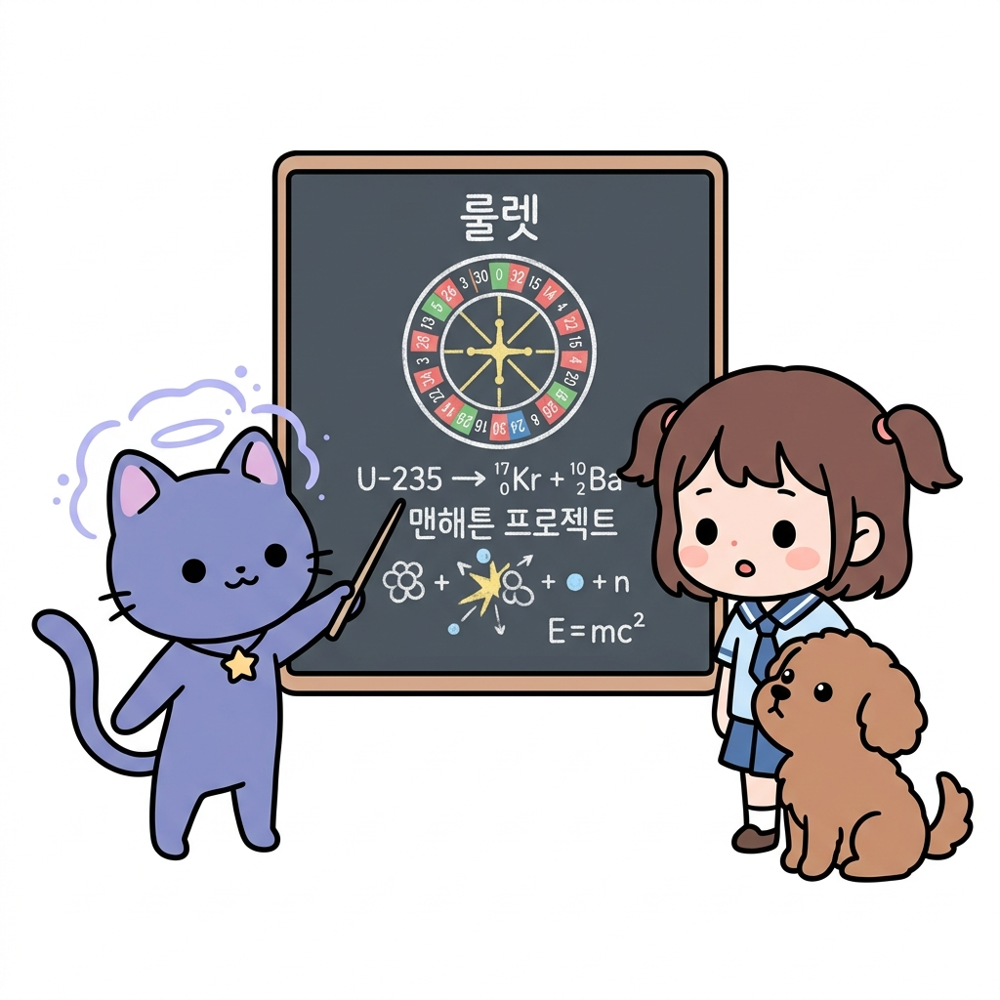
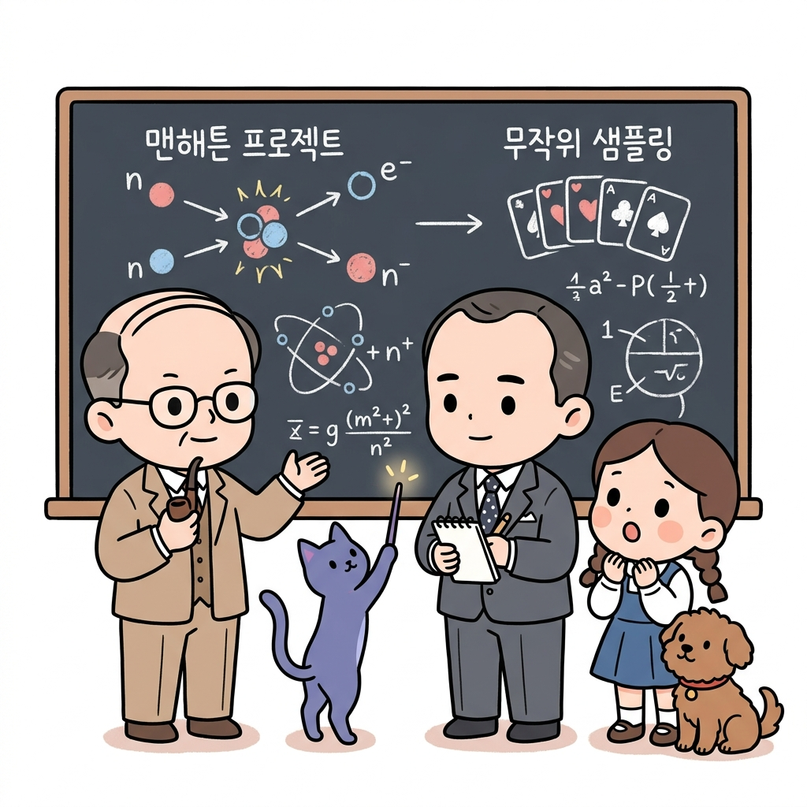
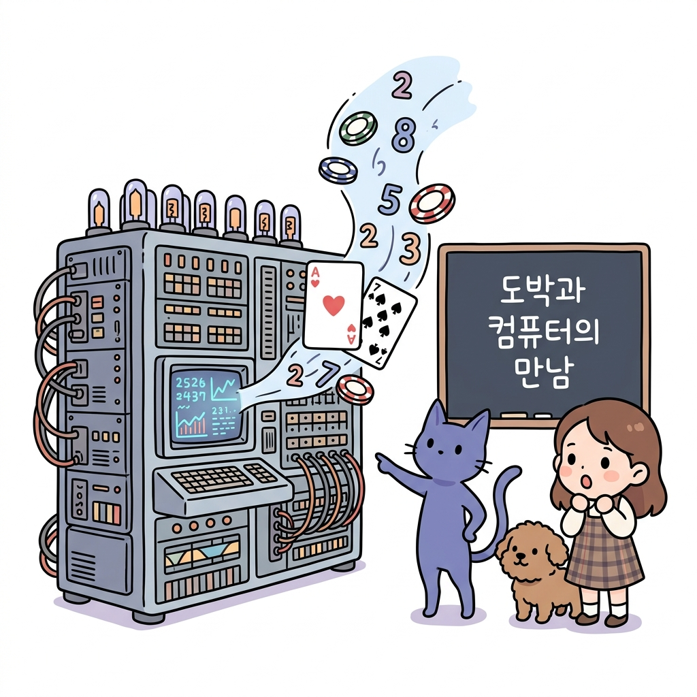
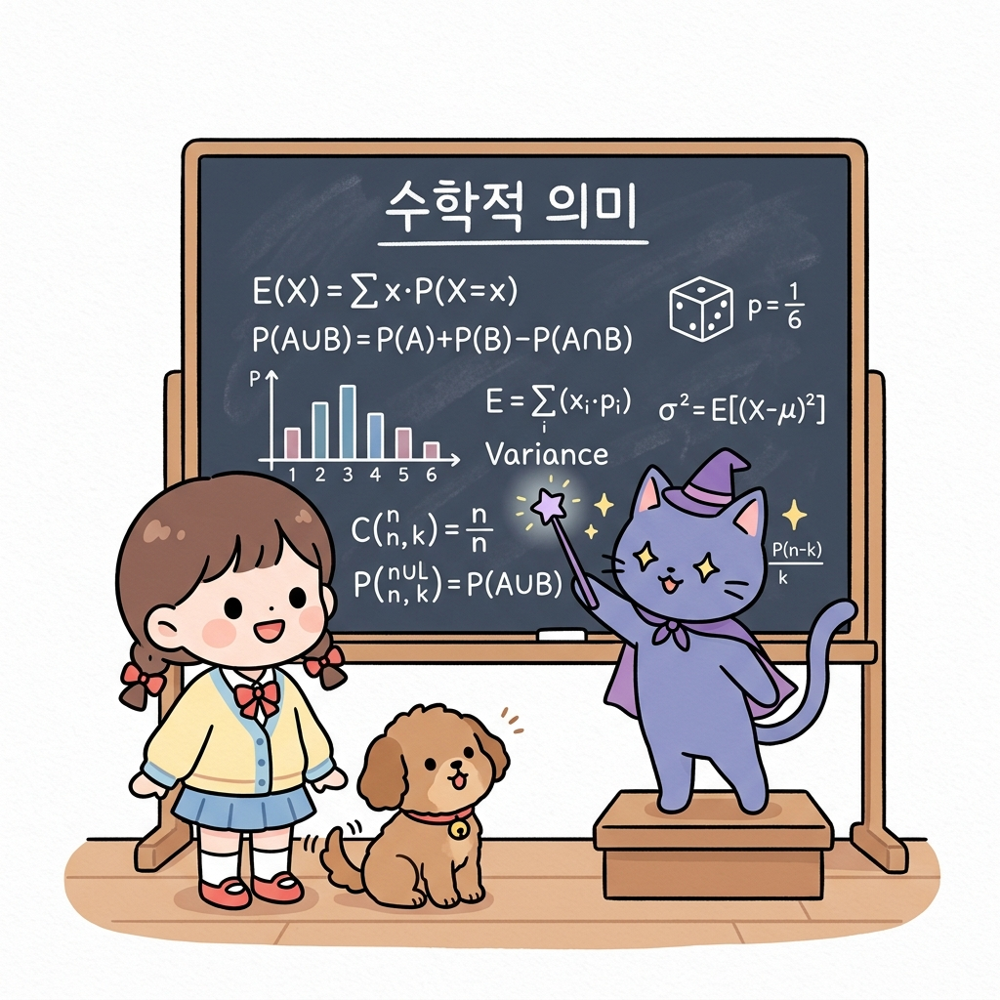
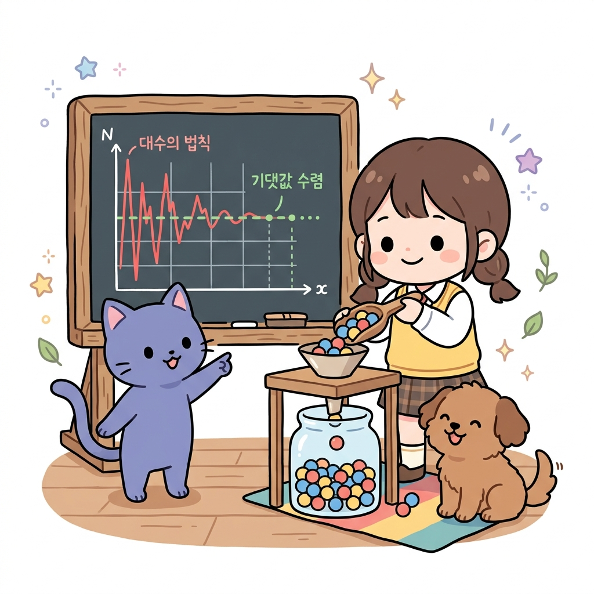
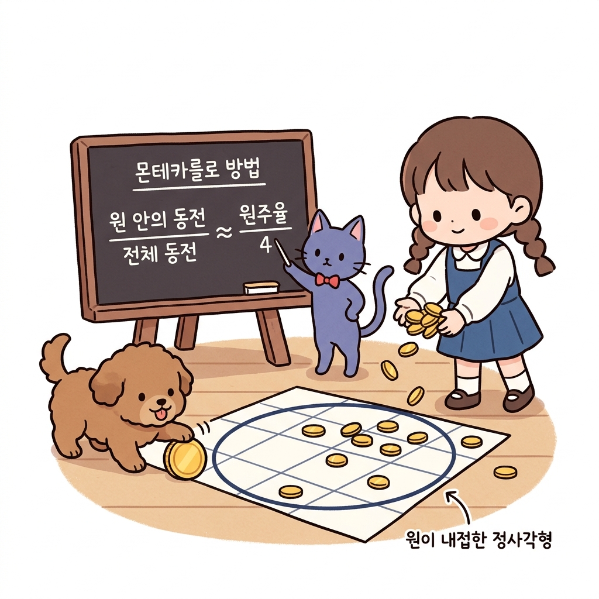
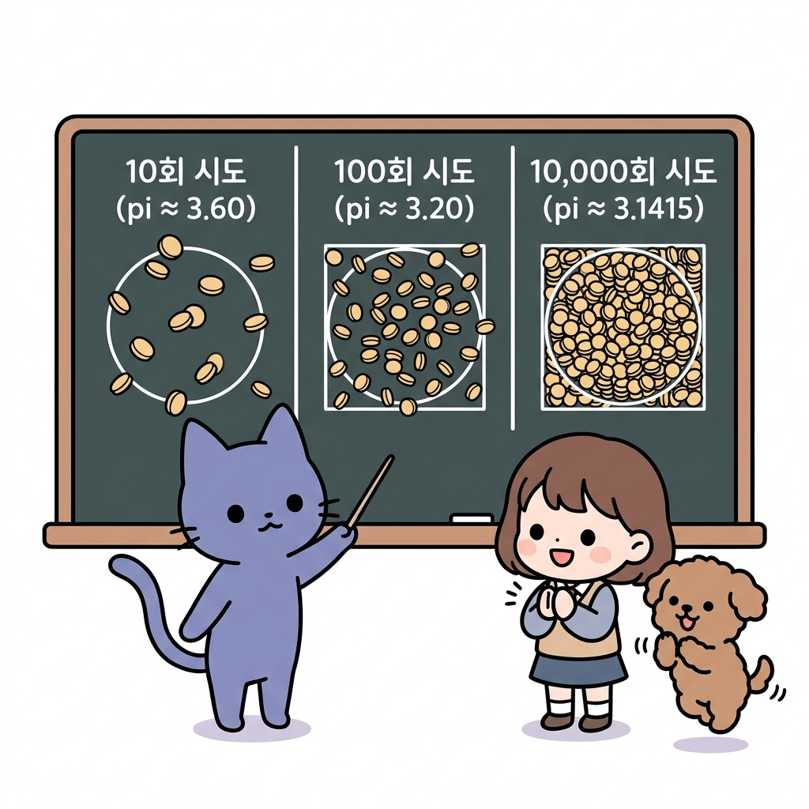

# 09.0 몬테카를로법의 수학적 기초와 역사적 유래

**그림 09-0-1** 스타니스와프 울람과 존 폰 노이만의 맨해튼 프로젝트 비화 및 무작위 룰렛 시뮬레이션을 설명해주는 지니와 도로시

강화 학습에서 확률 분포를 몰라도 수많은 실제 모험 샘플들을 모아 평균을 내어 최적 경로를 찾아내는 방식을 **몬테카를로법(Monte Carlo Method)**이라고 합니다. 

이 위대한 **무작위 계산 기법**이 어떻게 도박의 도시 몬테카를로의 이름과 얽혀 전쟁의 그늘 속에서 천재 수학자들의 머리로부터 탄생했는지 지니와 함께 흥미진진한 비화로 알아봅시다!

> **도로시와 토토의 비유로 이해하기**:
> 도로시는 연못에 돌멩이를 무수히 많이 던져서, 원형 분수대 안에 빠진 돌멩이와 사각형 연못에 빠진 돌멩이 개수의 비율을 셌습니다. 놀랍게도 복잡한 수학 공식 없이 오직 돌멩이를 신나게 던지고 센 것만으로 완벽한 분수대의 넓이 비율과 원주율 *π*를 찾아냈습니다! 이것이 몬테카를로 방법의 기적적인 원리입니다.

---

## 09.0.1 몬테카를로법의 역사적 유래

### 09.0.1.1 병상에서 시작된 솔리테어 카드 놀이

1946년, 맨해튼 프로젝트에 참여했던 폴란드계 미국인 천재 수학자 **스타니스와프 울람(Stanisław Ulam)**은 뇌염 수술을 받고 병상에 누워 요양을 하고 있었습니다. 너무 심심했던 그는 혼자서 카드를 정렬하여 맞추는 '솔리테어(Solitaire)' 카드 게임을 반복해서 하고 있었습니다. 

**그림 09-0-2** 병상에 누워 카드 놀이를 하며 표본 확률(Random Sampling)의 무서운 힘을 번뜩 깨달은 울람과 지니

수학자였던 울람은 문득 궁금해졌습니다.
> "이 솔리테어 카드가 처음에 무작위로 섞여서 주어졌을 때, 성공적으로 게임이 풀릴 확률은 수학적으로 계산하면 얼마나 될까?"

#### 수학적 계산
그는 순열과 조합론을 사용하여 정밀한 대수적 확률을 계산하려 했습니다. 

하지만 카드의 조합 가짓수는 52!로 무한대에 가까울 정도로 거대했고, 수식으로 계산해내기란 현실적으로 불가능했습니다. 

#### 바로 실전으로

이때 울람은 엉뚱하면서도 **기발한 생각**을 하게 됩니다:

> "어려운 수학 공식으로 머리를 싸맬 필요가 있을까? 실제로 카드를 100번 섞어서 게임을 해보고, 그중 성공한 횟수를 세면 대략적인 확률을 바로 구할 수 있잖아!"

---

### 09.0.1.2 맨해튼 프로젝트와 삼촌의 도박 도시

**그림 09-0-2-2** 울람의 무작위 샘플링 카드의 확률 직관을 맨해튼 프로젝트(중성자 확산) 연산에 적용할 수 있음을 깨달은 존 폰 노이만과 스타니스와프 울람

울람은 이 아이디어를 동료이자 천재 중의 천재였던 **존 폰 노이만(John von Neumann)**에게 공유했습니다. 폰 노이만은 이 무작위 시행을 통한 확률 계산이 당시 개발 중이던 중성자 확산과 핵무기 연쇄 반응 연산에 완벽하게 쓰일 수 있음을 깨달았습니다.

당시 핵무기 개발은 일급비밀(맨해튼 프로젝트)이었기 때문에, 두 사람은 이 시뮬레이션 기법을 부를 극비 프로젝트 암호명이 필요했습니다. 울람에게는 카지노 도박을 몹시 좋아해서 친척들의 골머리를 썩이던 삼촌이 한 명 있었는데, 그 삼촌이 자주 가던 세계적인 카지노 도시가 바로 모나코의 **'몬테카를로(Monte Carlo)'**였습니다.

**그림 09-0-2-3** 프랑스 남부 지중해 연안 모나코 영토 안에 위치한 '몬테카를로'의 위치 지도를 돋보기로 탐색하는 지니, 도로시, 토토

무작위로 돌아가는 룰렛 휠과 카드 딜링의 카지노 도박이야말로 이 무작위 시뮬레이션의 본질과 통했기에, 이 기법의 암호명은 **'몬테카를로'**로 정해졌고 오늘날 컴퓨터 과학에서 가장 거대한 기법의 이름으로 남게 되었습니다.

**그림 09-0-2-4** 1940년대 거대한 컴퓨터(진공관) 연산 회로 속에서 룰렛 칩과 카드 확률이 무작위 숫자로 시뮬레이션되는 역사적인 만남

---

## 09.0.2 몬테카를로법의 수학적 의미

그럼 몬테카를로법에 대한 수학적 의미에 대해서 알아 봅니다.

**그림 09-0-3-0** 몬테카를로법의 수학적 기초 이론을 칠판 공식으로 도로시와 토토에게 열정적으로 과외해주는 지니

---

### 09.0.2.1 대수의 법칙 (Law of Large Numbers)

몬테카를로법을 지탱하는 가장 거대한 수학적 기둥은 **대수의 법칙(큰 수의 법칙)**입니다. 

**그림 09-0-3-1** 샘플 횟수(n)가 적을 땐 극심하게 흔들리다(요동) 샘플이 많아질수록 점차 완벽하게 참 기댓값으로 수렴해 들어가는 대수의 법칙 시뮬레이션

임의의 확률 변수 *X*에 대해, 무작위로 독립 추출된 표본(샘플)의 개수 *n*이 무한히 커질수록, 표본들의 평균(샘플 평균)은 원래 확률 분포의 참 기댓값 *E*[*X*]로 확실하게 수렴한다는 정리입니다.

$$
\lim_{n \to \infty} \frac{1}{n} \sum_{i=1}^{n} X^{(i)} = \mathbb{E}[X]
$$

이 법칙 덕분에 우리는 복잡한 상태 전이 확률 분포나 기댓값 수식을 몰라도, **실제 세상에서 무수히 많은 모험**을 겪고(샘플링) 그 보상들의 평균을 내는 것만으로 진짜 기대 **가치를 정확히 추정**할 수 있게 됩니다.

---

### 09.0.2.2 동전 던지기로 원주율 *π* 구하기

몬테카를로법이 **어떻게 동작하는지 가장 명쾌하게 이해**할 수 있는 예는 사각형 안의 동전 던지기 실험입니다. 

**그림 09-0-3** 사각형 안에 내접하는 원을 그리고 무작위로 동전을 던져 원주율을 기하학적으로 추정하는 도로시

한 변의 길이가 2*r*인 정사각형을 그리면 이 정사각형의 넓이는 4*r*2이 됩니다. 

그리고 이 안에 딱 맞게 들어가는 반지름 *r*인 원을 그리면 원의 넓이는 *πr*2이 됩니다. 

#### 동전 던지기

이 영역 전체에 도로시가 금화 동전을 무작위로 무수히 많이 던진다고 해봅시다. 

전체 정사각형 영역에 떨어진 동전의 총 개수를 *N*total이라 하고, 그중에서 안쪽 동그란 원 안에 쏙 들어간 동전의 개수를 *N*circle이라고 하면 다음과 같은 비례식이 성립합니다.
$$
\frac{N_{\text{circle}}}{N_{\text{total}}} \approx \frac{\text{원의 넓이}}{\text{정사각형의 넓이}} = \frac{\pi r^2}{4r^2} = \frac{\pi}{4}
$$

양변에 4를 곱하면 우리는 원주율 *π*의 참값을 복잡한 삼각함수나 수학 공식 없이 오직 동전을 던지는 무작위 시도만으로 유도할 수 있습니다!

$$
\pi \approx 4 \times \frac{N_{\text{circle}}}{N_{\text{total}}}
$$

실제로 동전을 10개, 100개, 10000개로 늘려가며 던져보면, 이 계산값은 정확하게 우리가 잘 아는 3.14159...로 수렴해 나가게 됩니다. 

**그림 09-0-4** 동전 던지기 횟수(샘플 데이터 개수)가 많아질수록 기하학적으로 원주율 *π*의 참값에 점점 더 오차 없이 수렴하는 시각화

강화 학습에서의 몬테카를로법 역시 이와 동일하게 환경 모델의 수학 공식 대신 에이전트가 직접 겪은 에피소드(체험)의 평균값으로 참 가치를 알아내는 똑똑한 기법입니다.
