# 09.1 몬테카를로법 기초

**그림 09-1** 마법의 소원 분수대에 황금 동전을 무수히 던지며 원의 넓이(몬테카를로 적분)를 기하학적으로 추정하는 도로시와 지니
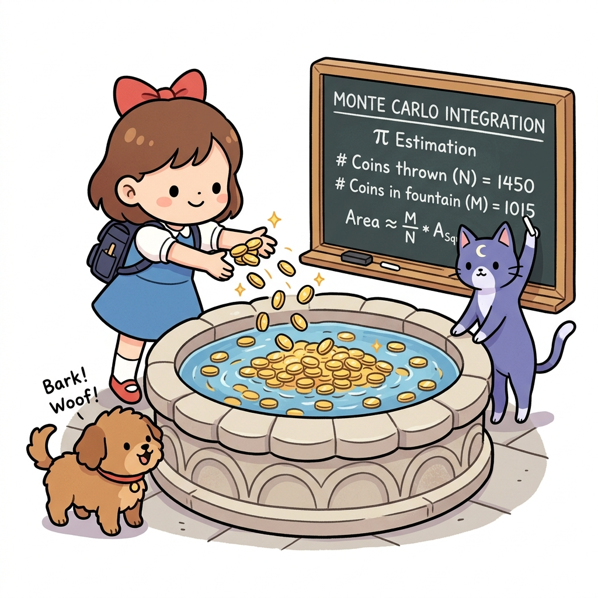

몬테카를로법(Monte Carlo Method)의 대수적 기초를 공부합니다. 무작위 샘플링을 반복하여 원하는 참값을 추정해내는 원리를 이해하기 위해, 주사위 던지기 실험 및 분수대 동전 던지기 비유를 통해 샘플 모델의 핵심을 파악해 봅시다!


---


#### 지금까지는 환경 모델이 알려진 문제를 다뤘습니다. 

예를 들어 '그리드 월드' 문제에서는 에이전트의 행동에 따른 다음 상태(위치)와 보상이 명확했습니다. 수식으로 표현하면 **상태 전이 확률 *p*(*s'* | *s*, *a*)**와 **보상 함수 *r*(*s*, *a*, *s'*)**를 이용할 수 있었습니다(상태 전이가 결정적이라면 *s'* = *f*(*s*, *a*) 함수로 나타낼 수도 있습니다). 

**그림 09-1-1** 그리드 보드게임 판 위에서 정직하게 한 칸씩 이동하며 상태 전이와 보상(+1)을 시뮬레이션할 수 있는 **알려진 환경 모델**의 세계
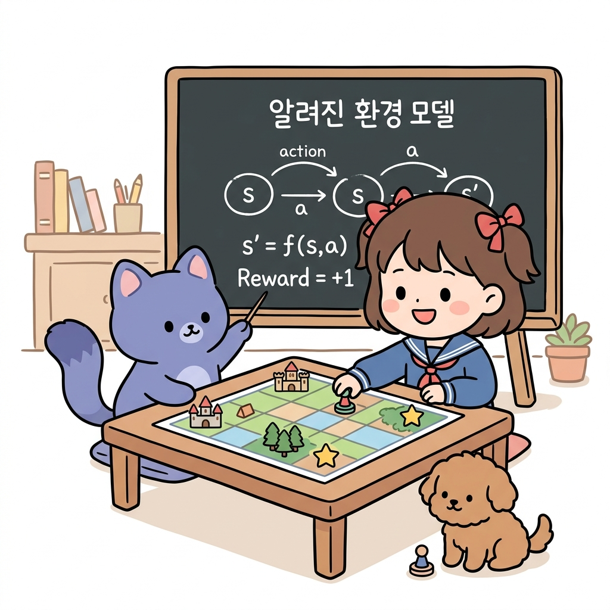

이처럼 환경 모델이 알려진 문제에서는 에이전트 측에서 '상태, 행동, 보상'의 전이를 **시뮬레이션**할 수 있습니다.


#### 하지만, 현실에는 환경 모델을 알 수 없는 문제가 많습니다. 

예를 들어 '상품 재고 관리'를 생각해보죠. 이 문제에서는 '상품이 얼마나 팔릴 것인가'가 환경의 상태 전이 확률에 해당합니다. 


그런데 상품의 판매량은 여러 요인이 복잡하게 얽혀 결정되기 때문에 **완벽하게 알아내기가 현실적으로 불가능**합니다.

**그림 09-1-2** 상품의 판매량(상태 전이 확률)을 미리 예측하거나 수식으로 완벽히 통제할 수 없는 현실적인 비정상 환경 모델의 세계
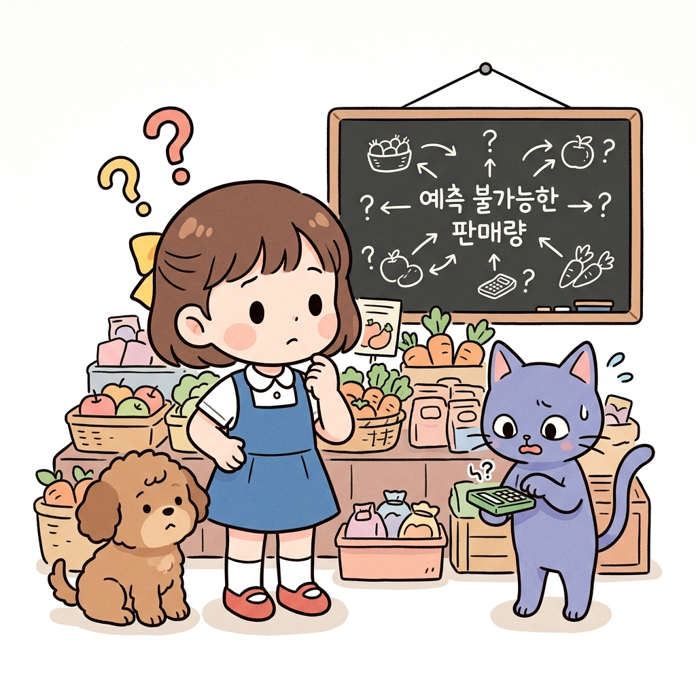

또한 상태 전이 확률을 이론적으로는 알 수 있더라도 **계산량이 너무 많은 경우**가 허다합니다. 


얼마나 많은지 실감할 수 있도록 이번 절에서는 우선 '주사위'를 예로 들어 간단한 작업을 해보겠습니다.


---


## 09.1.1 주사위 눈의 합

주사위 두 개를 굴리는 문제를 상상해봅시다. 각 눈이 나올 확률은 정확하게 **1/6**이라고 가정합니다. 

**그림 09-1-2-2** 각각 1/6의 독립된 확률을 가진 입체 주사위 두 개를 던지는 상상 실험을 시작하는 도로시와 지니
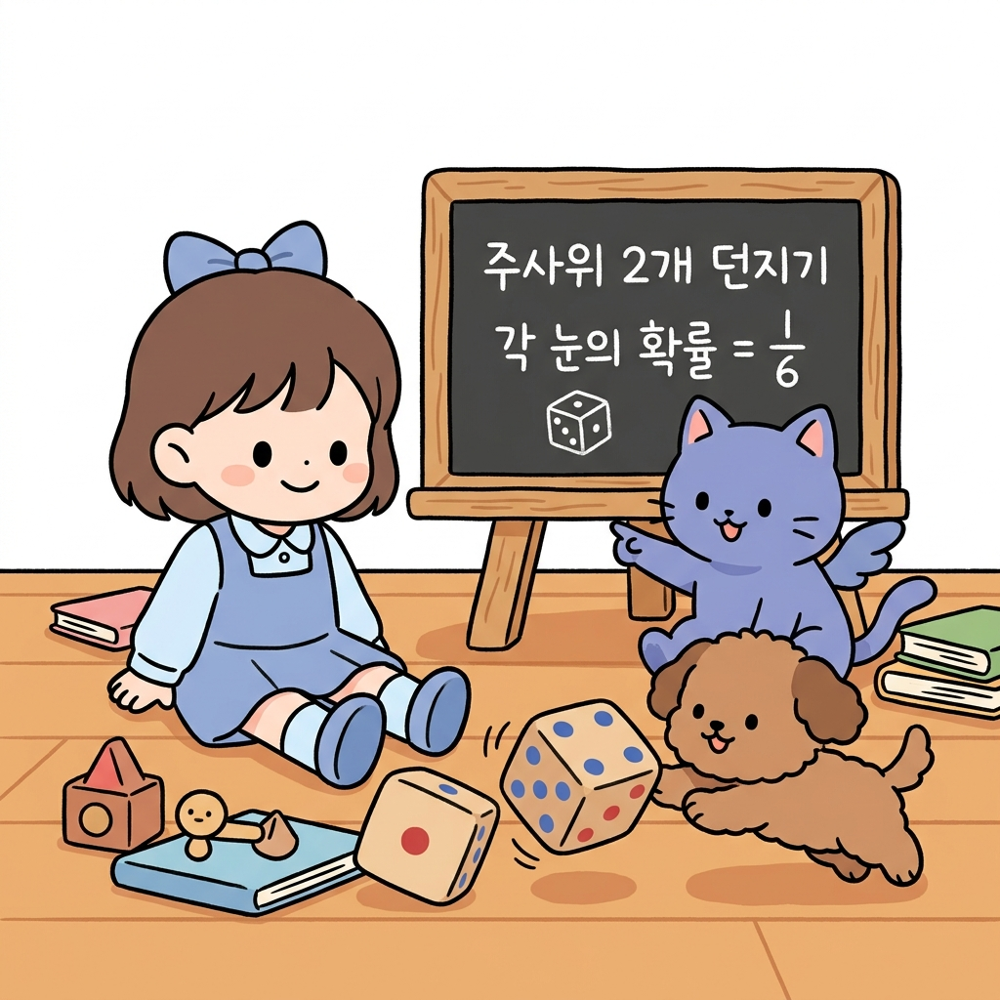


#### 2개의 주사위 확율 전개도

이때 주사위 눈의 합을 확률 분포로 표현해봅시다. 

이해를 돕기 위해 [그림 09-1]과 같이 전개도를 그려봤습니다.

**그림 09-1** 주사위 두 개를 던져 나오는 눈의 합 전개도(첫 번째 전개에서는 첫 번째 주사위에서 나온 눈의 수를, 두 번째 전개에서는 두 주사위에서 나온 눈의 합을 표시)

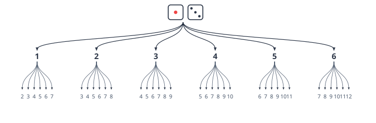


이처럼 전개도를 그려보면 맨 아래 줄에 **'눈의 합'**이 나옵니다. 

**그림 09-1-2-2-b** 가죽 컵에 주사위 2개를 담아 테이블 위에 굴려 무작위 표본(샘플)을 획득하는 도로시와 지니
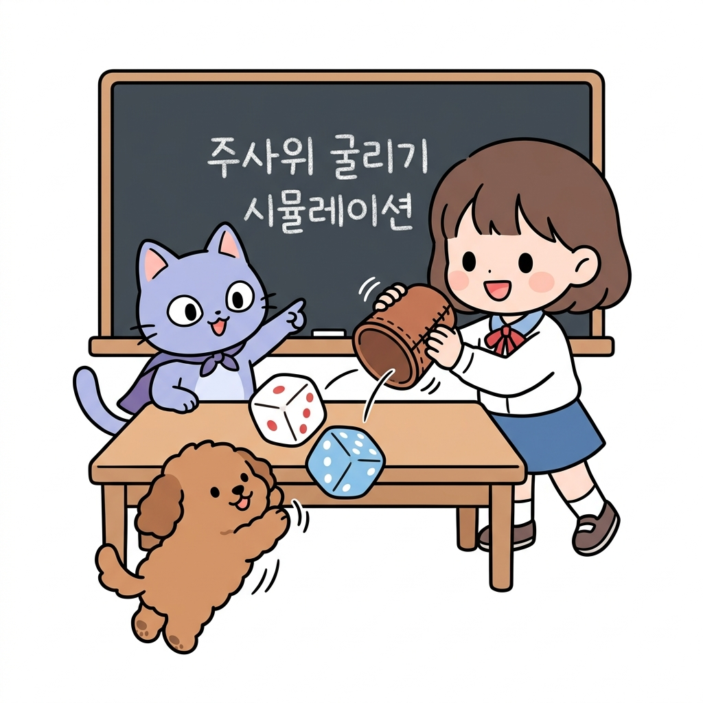

#### 2개의 주사위 확율 분포

**총 36개**가 만들어지며 이를 집계하면 확률 분포를 구할 수 있습니다. 예컨대 눈의 합이 3인 경우는 총 2개이므로 확률은 2/36입니다. 

> [!NOTE]
> **💡 확률분포(Probability Distribution)란?**
> 어떤 확률 변수(여기서는 '두 주사위 눈의 합')가 취할 수 있는 모든 개별 값과, 그 값들이 각각 나타날 확률을 표, 그래프, 수식 등으로 대응시켜 놓은 것을 말합니다. 주사위 눈의 합은 최소 2부터 최대 12까지의 값을 취할 수 있고, 각각의 합이 나타날 확률은 조합의 수에 따라 1/36부터 6/36까지 다양하게 분포되어 나타납니다.


같은 방식으로 모든 경우를 집계하면 [그림 09-2]의 확률 분포를 얻을 수 있습니다.

**그림 09-2** 주사위 두 개를 던졌을 때 나오는 눈의 합 확률 분포

| 합 | 2 | 3 | 4 | 5 | 6 | 7 | 8 | 9 | 10 | 11 | 12 |
| :---: | :---: | :---: | :---: | :---: | :---: | :---: | :---: | :---: | :---: | :---: | :---: |
| 확률 | 1/36 | 2/36 | 3/36 | 4/36 | 5/36 | 6/36 | 5/36 | 4/36 | 3/36 | 2/36 | 1/36 |

이제 이 확률 분포를 이용하여 기댓값을 계산해봅시다. 

**그림 09-1-2-3** 주사위 2개를 던질 때 나오는 총 36가지 눈의 합 조합 격자 매트릭스(합이 3인 2가지 경우가 하이라이트됨)
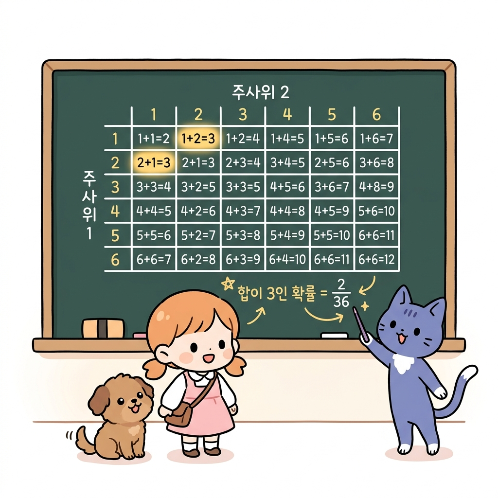 


#### 코드작성

코드로는 다음과 같이 구현할 수 있습니다.

```python
ps = {2: 1/36, 3: 2/36, 4: 3/36, 5: 4/36, 6: 5/36, 7: 6/36,
      8: 5/36, 9: 4/36, 10: 3/36, 11: 2/36, 12: 1/36}

V = 0
for x, p in ps.items():
    V += x*p
print(V) # [출력 결과] 6.999999999999999
```

확률 분포(주사위 눈의 합과 그 확률)를 입력하여 기댓값을 구했습니다. 

> [!NOTE]
> **💡 기댓값(Expected Value)이란?**
> 어떤 확률적인 사건이 일어났을 때 얻을 수 있는 값의 '평균적인 예측치'를 뜻합니다. 수학적으로는 이산확률변수 *X*가 가질 수 있는 모든 개별 값 *x*에 그 값이 나타날 확률 *P*(*X* = *x*)를 각각 곱한 후, 그 결과를 모두 더하여 계산합니다.
> 
> $$
> \mathbb{E}[X] = \sum_{x} x \cdot P(X = x)
> $$
> 
> 예를 들어 주사위 두 개를 던졌을 때 기대할 수 있는 이론적 평균 합은 정확하게 `7.0`입니다.


결과는 6.999...입니다.

**그림 09-1-2-4** 수학 이론에 따른 참값 7과 컴퓨터의 이진 소수점 연산 한계로 인한 미세한 부동소수점 오차(6.9999...)의 대비
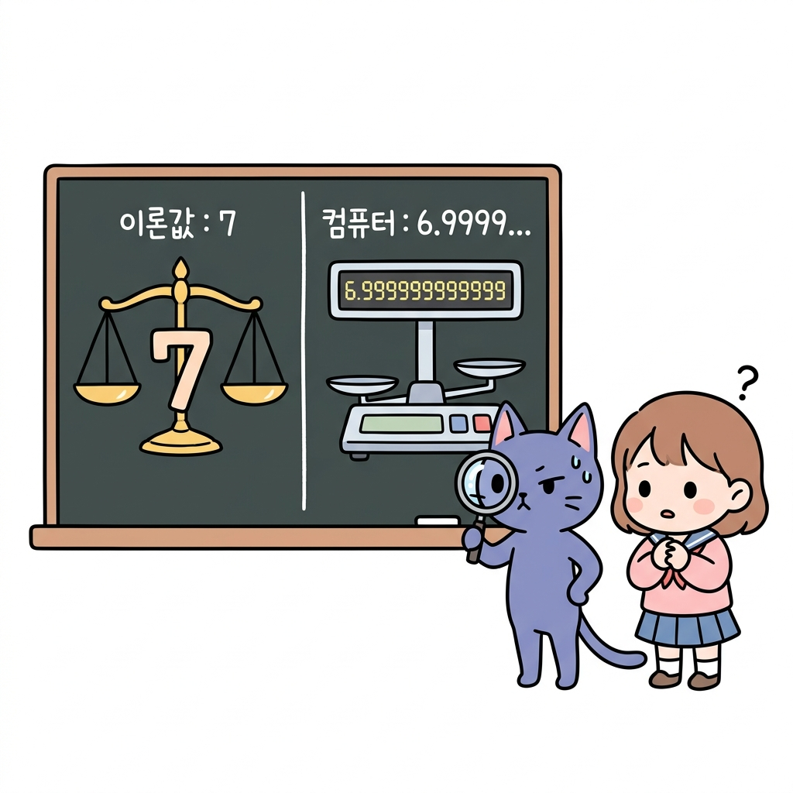

> [!TIP]
> **💡 왜 7.0이 아니라 6.9999...가 나올까요? (부동소수점 계산 오차)**
> 컴퓨터는 내부적으로 모든 숫자를 `0`과 `1`로만 이루어진 **이진수**로 처리합니다. 그런데 `1/36 = 0.027777...`과 같이 십진수에서는 **유한**하거나 단순한 소수라도 이진수로 변환하면 무한히 반복되는 **무한소수**가 되는 경우가 대부분입니다.
>
> 컴퓨터는 이 무한소수를 **메모리 한계** 내에서 일정한 자릿수까지만 잘라서 보관하므로, 끝자리에서 미세한 **반올림 오차(Round-off error)가 누적**됩니다. 그 결과 수학적 이론값인 `7.0`과 소수점 끝자리에서 아주 미세한 오차가 발생한 `6.999999999999999`를 반환하게 되는 것입니다.


#### 이와 같이 확률 분포를 알면 기댓값을 계산할 수 있습니다.

**그림 09-1-2-5** 확률 분포를 입력으로 주입하면 연산식에 의해 참 기댓값 7을 출력으로 바로 뱉어내는 마법의 기댓값 계산기
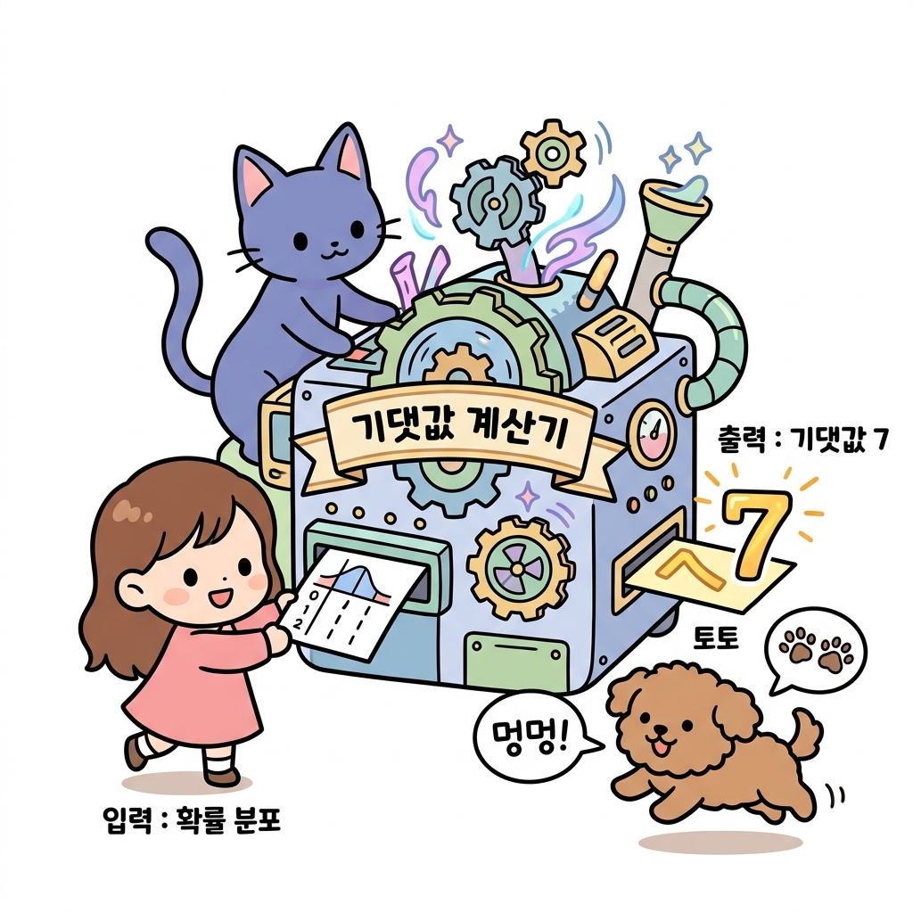


> NOTE_ 여기서 기댓값을 계산한 이유는 강화 학습에서는 기댓값 계산이 주를 이루기 때문입니다. 다시 이야기하지만 강화 학습의 목적은 **'수익'**을 극대화하는 것입니다. 여기서 수익은 **'보상의 총합에 대한 기댓값'**입니다.


---


## 09.1.2 분포 모델과 샘플 모델

방금 주사위 눈의 합을 '확률 분포'로 표현했습니다. 


#### 분포모델

즉, 주사위를 굴리는 시도를 확률 분포로 모델링한 것입니다. 

**그림 09-1-3** 확률 분포 지도를 바탕으로 모든 경우의 수와 이론적 확률식을 고도로 정밀 계산하여 모델링하는 분포 모델의 세계


이렇게 **확률 분포**로 표현된 모델을 **분포 모델**<sup>distribution model</sup>이라고 합니다.


#### 샘플모델

모델을 표현하는 방법에 분포 모델만 있는 것은 아닙니다. **샘플 모델**<sup>sample model</sup>도 있습니다. 

샘플 모델이란 **'표본을 추출(샘플링)할 수만 있으면 충분하다'**라는 모델입니다. 주사위를 예로 들면, 주사위를 '실제로 굴려서(=샘플링해서)' 나온 눈의 합을 관찰하는 방법입니다. 

**그림 09-1-3b** 속이 보이지 않는 불투명한 블랙박스 상자에서 실제 구슬을 한 알씩 꺼내며 무작위 표본(샘플) 데이터를 직접 관측하는 샘플 모델의 세계
 


#### 조건

분포 모델의 조건이 '확률 분포를 정확하게 알고 있다'라면, 샘플 모델의 조건은 '샘플링할 수 있다'입니다(그림 09-3).

**그림 09-3** 분포 모델과 샘플 모델 예

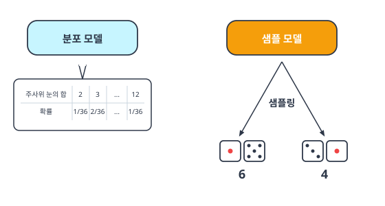

[그림 09-3]의 샘플 모델에서는 6이나 4와 같은 구체적인 샘플 데이터를 얻을 수 있습니다. 

샘플 모델에서는 전체의 확률 분포는 필요하지 않으며 단순히 샘플링만 할 수 있으면 충분합니다. 다만, 샘플링을 무한히 반복하면 그 분포가 곧 확률 분포와 같아집니다.


**그림 09-3b** 확률 지도를 들고 머릿속으로 전체 경우의 수를 계산해 보는 도로시(분포 모델)와 주사위를 직접 컵에 넣어 굴려보며 눈금 표본을 모으는 토토(샘플 모델)
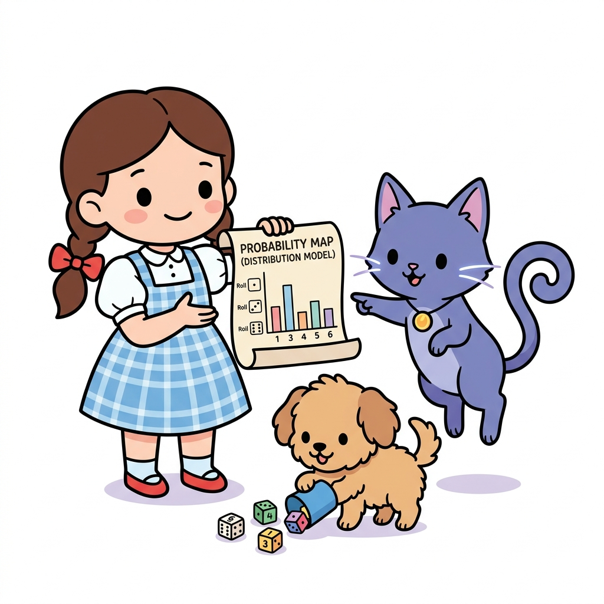

> **도로시와 토토의 비유로 이해하기**:
> - **분포 모델**은 도로시가 36가지 주사위 눈 조합과 각 확률이 완벽하게 적힌 지도를 들고 칠판에서 공부하는 것과 같습니다. 모든 확률적 가능성을 머릿속으로 계산해볼 수 있죠.
> - **샘플 모델**은 토토가 직접 주사위를 컵에 넣고 수없이 굴려가며 실제로 나온 표본 눈들을 눈으로 확인하며 배우는 것과 같습니다. 전체 지도는 모르지만, 실제 경험(시행)을 통해 표본을 모아 기댓값을 알아냅니다.


#### 파이썬 코드

그림 샘플 모델을 실제로 구현해보봅시다. 

앞에서와 마찬가지로 '주사위 두 개'를 던지는 문제입니다.

<div align="right"><b>ch05/dice.py</b></div>

```python
import numpy as np

def sample(dices=2):
    x = 0
    for _ in range(dices):
        x += np.random.choice([1, 2, 3, 4, 5, 6])
    return x
```

코드를 간단히 살펴보죠. 

**그림 09-1-3-2** `sample()` 파이썬 코드가 실행되면서 주사위를 차례로 2번 굴려 눈금의 합(10)을 반환하는 제어 흐름 시각화
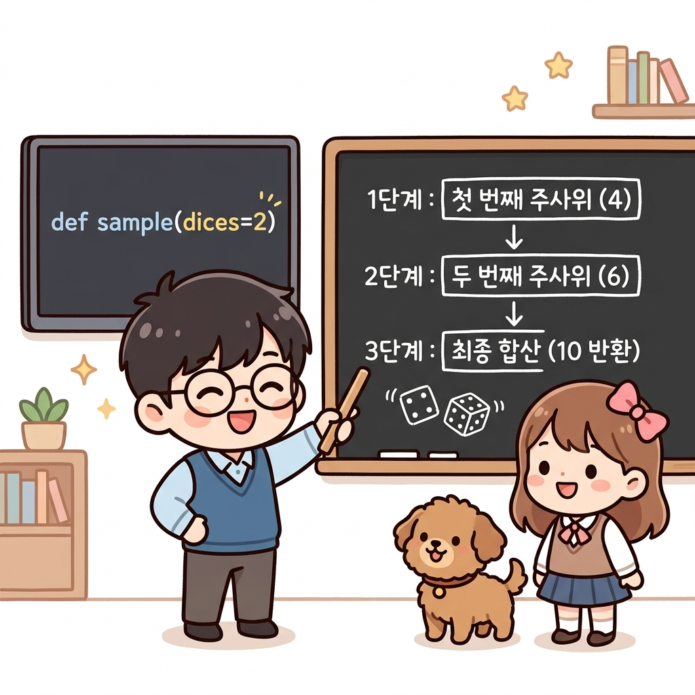

먼저 `np.random.choice([1, 2, 3, 4, 5, 6])` 코드에 의해 1~6 사이의 원소 중 하나가 무작위로 선택됩니다. 이것이 주사위 한 개를 굴렸을 때의 결과(샘플 데이터)입니다. 


이번 문제에서는 주사위를 두 번 굴리기 때문에 이 일을 두 번 반복합니다. 

이제 방금 구현한 `sample()` 메서드를 사용해보겠습니다.

```python
print(sample()) # [출력 결과] 10
print(sample()) # [출력 결과] 4
print(sample()) # [출력 결과] 8
```

이와 같이 실행할 때마다 결과가 달라집니다. 


이상으로 주사위 두 개를 굴리는 문제를 **'샘플 모델' 방식**으로 구현했습니다. 

확률 분포를 준비할 필요가 없기 때문에 이처럼 간단하게 구현할 수 있습니다.


#### 여러 개의 주사위: 샘플 모델이 빛을 발하는 순간!

만약 주사위를 2개가 아니라 **10개** 굴려서 합계를 구해야 한다면 두 모델의 차이는 어떻게 될까요? 

* **샘플 모델은 너무나 쉽습니다!** 
  소스코드 함수 호출 시 주사위 개수를 지정하는 매개변수(`dices`)의 값만 바꾸어 실행하면 끝입니다. 단순히 `sample(10)`이라고 실행하면 컴퓨터가 알아서 눈 깜짝할 사이에 주사위를 10번 무작위로 던져 합을 구해줍니다. 주사위가 100개, 1,000개로 늘어나도 수학 공식 필요 없이 매개변수 숫자만 변경하면 해결됩니다.
  
* **반면, 분포 모델은 머리가 아파집니다.**
  주사위 10개의 합에 대한 이론적인 확률 분포 표를 미리 구해야 하는데, 그러기 위해서는 무려 $6^{10} = 60,466,176$가지(약 6천만 가지!)나 되는 모든 경우의 수를 일일이 대조하여 확률을 나누어야 하기 때문입니다. 주사위가 더 많아지면 슈퍼컴퓨터로도 모든 확률 분포를 계산하는 것이 불가능해집니다.

이처럼 **"모든 경우의 수를 일일이 계산하기가 현실적으로 불가능하거나 수학 공식(환경 모델)을 모를 때, 실제로 굴려보면서(샘플링) 그 평균값으로 진짜 값을 찾아가는 과정"**이 바로 샘플 모델의 강력한 장점이자 **몬테카를로법**의 존재 이유입니다.


#### 기대값 계산

그렇다면 샘플 모델로 기댓값을 계산하려면 어떻게 해야 할까요? 

샘플링을 많이 하고 평균을 구하면 됩니다. 이 방법이 바로 몬테카를로법입니다.

**그림 09-1-3-3** 샘플링 시도 횟수가 증가함에 따라 확률 변수의 평균값이 격렬한 요동을 치다가 수학적 이론 기댓값인 7.0으로 무결하게 수렴하는 대수의 법칙(큰 수의 법칙) 그래프
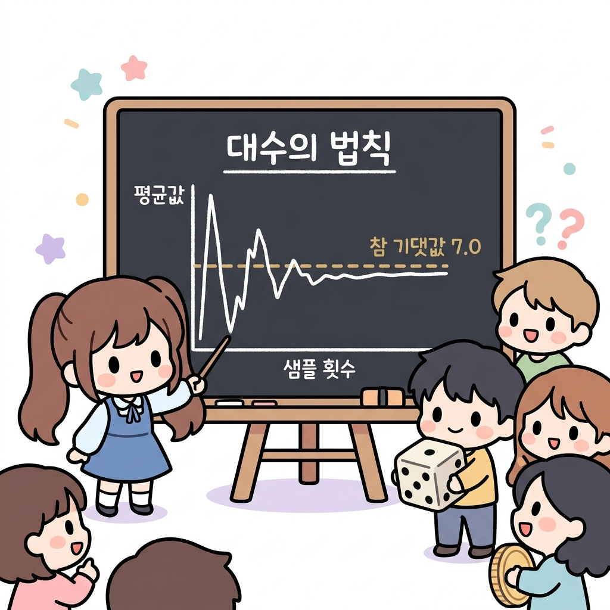

 '숫자를 세어 평균을 구하는' 간단한 방법이지만 표본 수를 무한대로 늘리면 큰 수의 법칙에 따라 그 평균이 참값으로 수렴합니다.


> NOTE_ 3장의 밴디트 문제에서는 실제로 슬롯머신을 플레이하고 그 평균으로 슬롯머신의 좋고 나쁨(가치)을 추정했습니다. 이때 사용한 방법이 바로 몬테카를로법입니다. 6장의 주제는 밴디트 문제에서 사용했던 몬테카를로법을 강화 학습 문제에 적용하는 것입니다.


---


## 09.1.3 몬테카를로법 구현

몬테카를로법으로 **기댓값**을 구하는 코드를 작성해봅시다. 


#### 수학적 표현

수학적으로 몬테카를로법은 수많은 무작위 샘플(*s<sub>i</sub>*)들의 **표본 평균(Sample Mean)**을 구하여 기댓값(*V*)을 추정합니다. 총 샘플링 횟수(시도 횟수)를 *N*이라 할 때, 표본 평균의 기댓값 계산 공식은 다음과 같습니다.

$$
V \approx \frac{1}{N} \sum_{i=1}^{N} s_i
$$

여기서 각 변수의 의미는 아래와 같습니다.
- *N*: 전체 시도(샘플링) 횟수입니다.
- *s<sub>i</sub>*: *i*번째 실제로 주사위를 굴렸을 때 나온 눈의 합(실제 획득한 샘플값)입니다.
- ∑ *s<sub>i</sub>*: 수집한 모든 샘플값들의 총합입니다.


#### 코드 변환

이 간단한 수학 수식을 고스란히 파이썬 코드로 번역하여 매핑하면 다음과 같습니다.

**그림 09-1-3-4** 수학적인 표본 평균 기댓값 공식과 이를 1:1로 대응시킨 파이썬 구현 코드의 매핑 구조
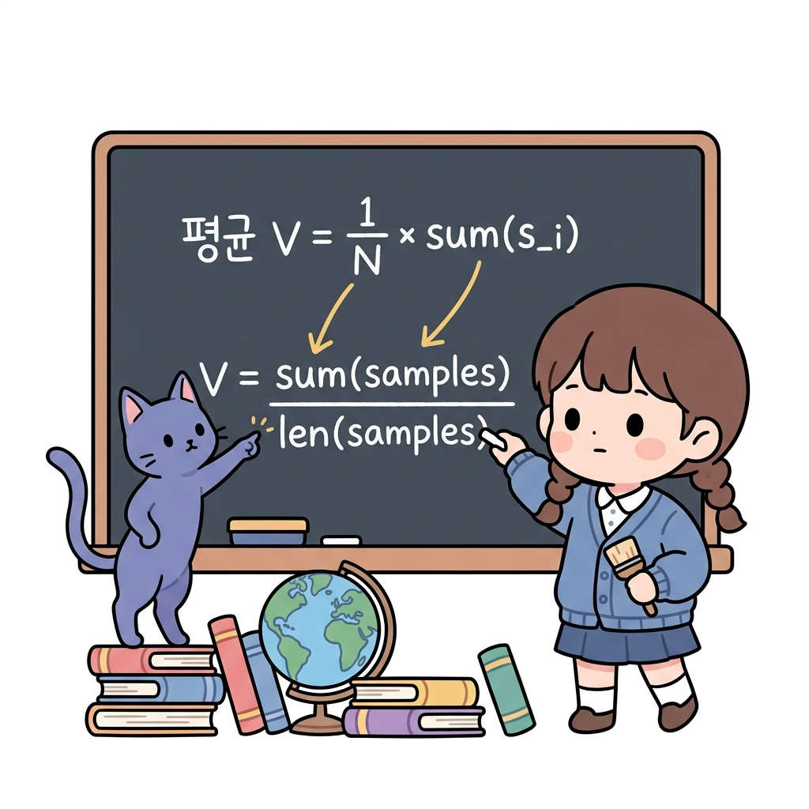

* **수식의 *N***: 코드의 전체 샘플 개수인 `len(samples)` (또는 `trial`)에 매핑됩니다.
* **수식의 ∑ *s<sub>i</sub>***: 코드의 모든 샘플 합인 `sum(samples)`에 매핑됩니다.
* **수식의 평균 *V***: 최종 계산값인 `V = sum(samples) / len(samples)`에 매핑됩니다.

이제 이를 바탕으로 전체 코드를 작성해봅시다.

```python
trial = 1000 # 샘플링 횟수

samples = []
for _ in range(trial): # 샘플링
    s = sample()
    samples.append(s)

V = sum(samples) / len(samples) # 평균 계산
print(V)
```

**출력 결과**

```text
6.98
```

샘플링을 1000번 수행하여 평균을 구했습니다. 


각 시도의 결과를 `samples` 리스트에 추가하고 마지막으로 평균을 구하는 순서로 작성했습니다. 실행 결과를 보면 6.98이 나왔는데, 정답이 7이므로 얼추 맞는 값이라고 할 수 있습니다. 물론 결과는 실행할 때마다 달라지지만 대략 7과 가까운 값을 얻을 수 있습니다.


> NOTE_ 몬테카를로법은 샘플 수를 늘릴수록 신뢰도가 높아집니다. 
>
> 전문 용어로는 **'분산<sup>variance</sup>이 작아진다'**고 합니다. 분산을 직관적으로 표현하면 '정답에서 벗어난 편차'라고 할 수 있습니다. 분산에 대해서는 9.5.2절에서 자세히 설명합니다.


#### 이어서 샘플 데이터를 얻을 때마다 평균을 구하고 싶은 경우를 생각해보시다. 

간단하게는 다음 코드처럼 구현할 수 있습니다.

```python
trial = 1000

samples = []
for _ in range(trial):
    s = sample()
    samples.append(s)
    V = sum(samples) / len(samples) # 매번 평균 계산
    print(V)
```


앞에서와 마찬가지로 리스트에 샘플 데이터를 추가하고 그 리스트에서 평균을 구합니다. 


이번에는 `for`문 안에서 평균을 계산했습니다. 

이 방식은 물론 정확한 계산 방법이지만 더 효율적인 방법도 생각해볼 수 있습니다. 

바로 3.3.2절에서 배운 '증분 구현'입니다. 


#### 증분방식

요점만 정리하면 다음 그림과 같습니다.  

**그림 09-4** 모든 샘플 데이터를 보관해야 해서 메모리가 무거운 일반 평균법과, 가볍고 스마트한 가치 갱신식을 이용하는 증분 평균법의 비교
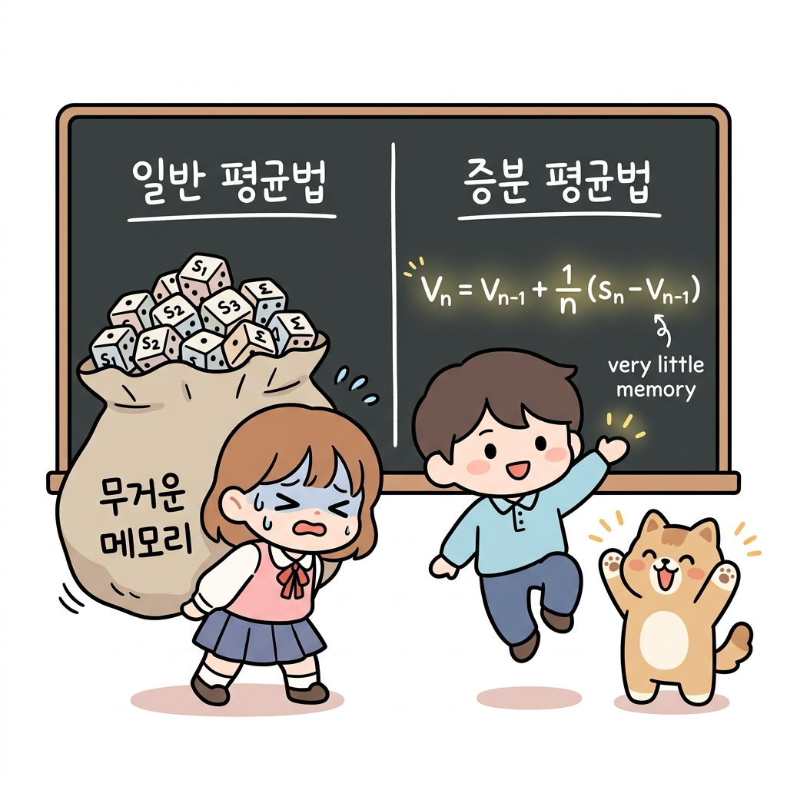

평균을 어느 방식으로 계산하든 결과는 같습니다. 


하지만 샘플 데이터를 얻을 때마다 평균을 구해야 할 때는 **증분 방식이 더 효율적**입니다. 

그러니 증분 방식으로 평균을 구해보겠습니다.

<div align="right"><b>ch05/dice.py</b></div>

```python
trial = 1000
V, n = 0, 0

for _ in range(trial):
    s = sample()
    n += 1
    V += (s - V) / n # 또는 V = V + (s - V) / n
    print(V)
```

**출력 결과**

```text
4.0
6.0
5.333333333333333
...
6.959959959959965
6.960000000000005
```

이 코드를 실행하면 샘플 데이터를 얻을 때마다 평균을 계산합니다. 

출력 결과를 보면 샘플 데이터가 늘어날수록 정답인 7에 가까워짐을 알 수 있습니다.


이상으로 몬테카를로법의 기초를 마칩니다. 


다음 절에서는 강화 학습 문제에 몬테카를로법을 적용해보겠습니다.

