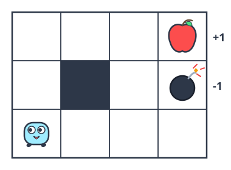
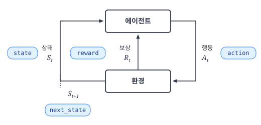
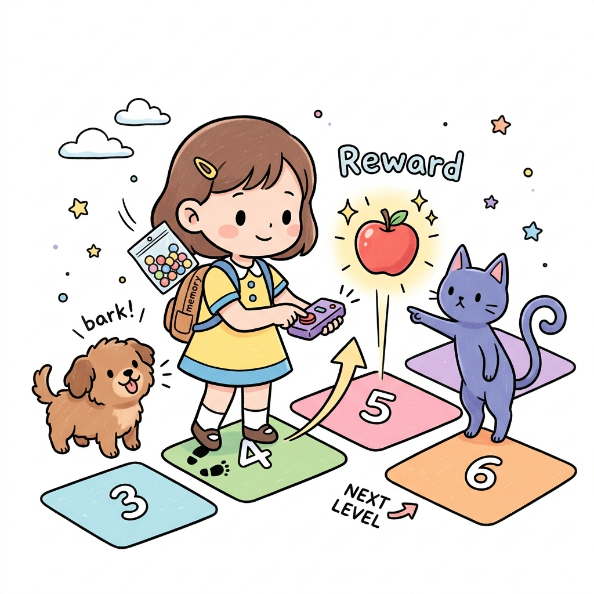
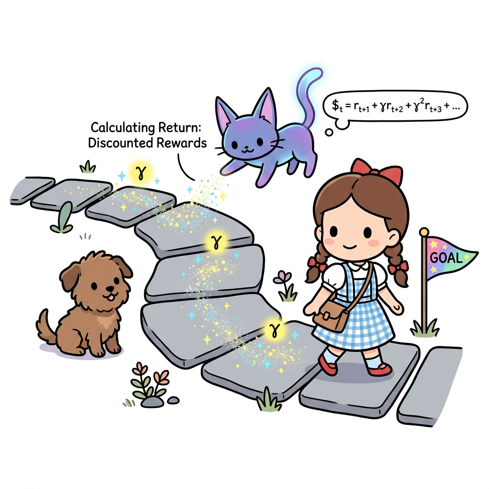
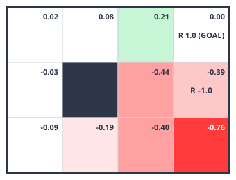

# 09.3 몬테카를로법 구현

**그림 09-3** 그리드월드 조작 조종 패드를 쥐고 모니터를 보며, 지니가 보여주는 RandomAgent와 eval() 코드 연동을 실행하는 도로시


파이썬 코드를 기반으로 몬테카를로 정책 평가 알고리즘을 실제로 작성해 봅니다. 환경 클래스 `GridWorld`에 물리적 움직임을 전달하는 `step()` 메서드를 구현하고, 에이전트 클래스에서 실시간으로 경험(경로)을 에피소드 데이터 형태로 담아 가치를 갱신하는 과정을 지니 요정의 칠판 릴레이 코드로 명확하게 실습해봅시다!

---

4장에서 다룬 '3 × 4 그리드 월드' 문제를 이번에는 몬테카를로법으로 풀어보겠습니다.

**그림 09-10** 3 × 4의 그리드 월드



이번에는 환경 모델(상태 전이 확률과 보상 함수)을 이용하지 않고 정책을 평가합니다. 이렇게 하려면 에이전트에게 실제로 행동하도록 시키는 메서드가 필요합니다.

## 09.3.1 step() 메서드

GridWorld 클래스에는 `step()` 메서드가 있습니다. 에이전트에게 행동을 시키는 메서드죠. 어떻게 사용하는지 함께 봅시다.

```python
from common.gridworld import GridWorld

env = GridWorld()
action = 0 # 더미 행동
next_state, reward, done = env.step(action) # 행동 수행

print('next_state:', next_state)
print('reward:', reward)
print('done:', done)
```

**출력 결과**
```
next_state: (1, 0)
reward: 0.0
done: False
```


`step()` 메서드는 행동을 매개변수로 받습니다. `env.step(action)`이라고 호출하면 현재 환경에서 행동 `action`을 수행하고, 그 결과로 `next_state`, `reward`, `done`이라는 세 가지 값을 반환합니다. `state`, `action`, `reward`, `next_state`의 관계는 [그림 09-11]을 보면 명확하게 알 수 있습니다.

**그림 09-11** 코드와 수식의 대응 관계



그림과 같이 현재 시간을 *t*라고 했을 때, *S*<sub>*t*</sub>는 `state`, *A*<sub>*t*</sub>는 `action`에 해당합니다. 시간 *t*에 에이전트가 행동을 하면, 보상으로 *R*<sub>*t*</sub>를 얻고 다음 상태 *S*<sub>*t+1*</sub>로 전이합니다. 이때 얻은 보상 *R*<sub>*t*</sub>가 `reward`에 해당하고 다음 상태 *S*<sub>*t+1*</sub>이 `next_state`에 해당합니다.

**그림 06-11b** 행동 리모컨의 버튼을 누르고 얻은 보상 사과와 다음 상태 이동 경험을 배낭 속 memory 리스트에 패키징하여 담는 도로시와 지니


> **도로시와 토토의 비유로 이해하기**:
> 도로시가 그리드월드 발판에서 행동 리모컨의 `step(action)` 버튼을 딸깍 누르면, 즉시 얻는 보상 사과가 뿅 나오고 다음 발판인 `next_state`로 이동하게 됩니다. 동시에 도로시가 메고 있는 배낭(`self.memory`) 속에는 이때의 경험 구슬인 `(상태, 행동, 보상)`이 조르륵 팩으로 묶여 저장됩니다.

> [!NOTE]
> '3 × 4 그리드 월드'에서는 상태 전이가 결정적으로 이루어지지만 확률적으로 결정되는 경우도 생각할 수 있습니다. 예를 들어 에이전트가 오른쪽으로 이동하는 행동을 시도하면 80%의 확률로만 오른쪽으로 이동하고, 나머지 20%의 확률로는 제자리에 머물러 있을 수 있겠지요. 상태 전이가 확률적일 때는 똑같은 상태에서 똑같이 행동하더라도 `step()` 메서드가 다른 결과를 반환할 수 있습니다.

`GridWorld` 클래스에서는 `step()` 메서드를 통해 에이전트에게 행동하도록 하여 샘플 데이터를 얻습니다. 또한, `GridWorld` 클래스에는 `reset()` 메서드도 있습니다. 환경을 초기 상태로 재설정하는 메서드입니다. 사용법은 다음과 같습니다.

```python
env = GridWorld()
state = env.reset() # 상태 초기화
```


`reset()` 메서드는 초기 상태(`state`)를 반환합니다.

이상으로 `GridWorld` 클래스에 대해 조금 더 알아보았습니다.

## 09.3.2 에이전트 클래스 구현

이제 몬테카를로법을 이용하여 정책 평가를 수행하는 에이전트를 구현할 차례입니다. 무작위 정책에 따라 행동하는 에이전트를 `RandomAgent` 클래스로 구현하겠습니다. 먼저 코드의 전반부를 살펴봅시다.

<div align="right"><b>ch05/mc_eval.py</b></div>

```python
class RandomAgent:
    def __init__(self):
        self.gamma = 0.9
        self.action_size = 4

        random_actions = {0: 0.25, 1: 0.25, 2: 0.25, 3: 0.25}
        self.pi = defaultdict(lambda: random_actions)
        self.V = defaultdict(lambda: 0)
        self.cnts = defaultdict(lambda: 0)
        self.memory = []

    def get_action(self, state):
        action_probs = self.pi[state]
        actions = list(action_probs.keys())
        probs = list(action_probs.values())
        return np.random.choice(actions, p=probs)
```

초기화 메서드인 `__init__()`에서 할인율 `gamma`와 행동의 가짓수 `action_size`를 설정합니다. 그리고 무작위 행동을 할 확률 분포를 `random_actions`로 만들어 정책 `self.pi`에 설정합니다. `self.V`는 가치 함수를, `self.memory`는 에이전트가 실제로 행동하여 얻은 경험('상태, 행동, 보상')을 담는 역할입니다. `self.cnts`는 '증분 방식'으로 수익의 평균을 구할 때 사용합니다.

다음은 `get_action(self, state)` 메서드입니다. 이 메서드는 `state`에서 수행할 수 있는 행동을 하나 가져옵니다. 중요한 부분은 마지막 줄의 `np.random.choice(actions, p=probs)`입니다. `probs`의 확률 분포에 따라 행동을 한 개씩 샘플링하는 코드입니다.


> [!NOTE]
> 몬테카를로법에서는 에이전트가 행동을 선택하게 하는 것, 즉 '행동을 샘플링할 수 있다'는 것이 조건입니다. 따라서 행동의 확률 분포를 담는 `self.pi` 변수를 사용하지 않는 방법도 있습니다. 이번 절에서 보여드리는 에이전트는 '분포 모델'에 따른 구현이며, 또 다른 방법으로 '샘플 모델'에 따른 구현도 생각해볼 수 있습니다. 샘플 모델 방식의 구현은 6.5절에서 설명합니다.

다음은 `RandomAgent` 클래스의 나머지 코드(후반부)입니다.

<div align="right"><b>ch05/mc_eval.py</b></div>

```python
class RandomAgent:
    ...

    def add(self, state, action, reward):
        data = (state, action, reward)
        self.memory.append(data)

    def reset(self):
        self.memory.clear()

    def eval(self):
        G = 0
        for data in reversed(self.memory): # 역방향으로(reversed) 따라가기
            state, action, reward = data
            G = self.gamma * G + reward
            self.cnts[state] += 1
            self.V[state] += (G - self.V[state]) / self.cnts[state]
```

먼저 실제로 수행한 행동과 보상을 기록해주는 `add()` 메서드를 보겠습니다. 이 메서드를 호출하면 '상태, 행동, 보상'을 `(state, action, reward)` 튜플로 묶어 리스트인 `self.memory`에 추가합니다. 튜플로 묶는 이유는 무엇일까요? 예를 들어 다음과 같은 시계열 데이터를 얻었다고 가정해봅시다.

$$
S_0, A_0, R_0, S_1, A_1, R_1 \cdots S_8, A_8, R_8, S_9
$$

이 데이터를 얻었다면 지금 코드에서는 다음과 같은 형태로 보관합니다.

```python
# agent.memory
[(S0, A0, R0), (S1, A1, R1), ..., (S8, A8, R8)]
```


보다시피 `(state, action, reward)` 단위로 저장되어 있습니다. 여기서 주의할 점은 마지막 상태(지금 예에서 *S*<sub>9</sub>)는 `self.memory`에 저장되지 않는다는 것입니다. 왜냐하면 마지막 상태(목표 지점)의 가치 함수는 항상 0이기 때문이죠. 다르게 말하면, 마지막 상태는 가치 함수를 갱신할 필요가 없으므로 `self.memory`에 추가하지 않습니다.

다음은 `eval()` 메서드를 보겠습니다. `RandomAgent` 클래스에서 몬테카를로법을 수행하는 주인공이죠. 먼저 수익 $G$를 0으로 초기화하고, 실제로 얻은 `self.memory`를 역방향으로 따라가면서 각 상태에서 얻은 수익을 계산합니다. 그리고 각 상태에서의 가치 함수를 그때까지 얻은 수익의 평균으로 구합니다. 이 코드에서는 평균을 '증분 방식'으로 계산했습니다.

**그림 06-12b** 에피소드가 골 지점(GOAL)에서 종료된 뒤, 역방향(reversed)으로 되짚어가며 할인율 gamma를 정밀하게 곱해 효율적으로 수익 G를 누적하는 지니와 도로시


> **도로시와 토토의 비유로 이해하기**:
> 도로시는 목표 지점(에피소드의 끝)에 도달한 뒤, 출발지점을 향해 징검다리를 거꾸로 밟고 되돌아가며(`reversed(memory)`) 각 단계마다 할인율 *γ*를 꼼꼼하게 곱해줍니다. 이렇게 뒤에서부터 계산해 나가면, 중복 연산 없이 단 한 번의 루프만으로 모든 상태의 누적 할인 수익 *G*를 매우 빠르고 깔끔하게 계산할 수 있습니다!

이상이 `RandomAgent` 클래스입니다.

## 09.3.3 몬테카를로법 실행

에이전트를 구현한 `RandomAgent` 클래스와 환경을 구현한 `GridWorld` 클래스를 연동하여 실행해봅시다.

<div align="right"><b>ch05/mc_eval.py</b></div>

```python
env = GridWorld()
agent = RandomAgent()

episodes = 1000
for episode in range(episodes): # 에피소드 1000번 수행
    state = env.reset()
    agent.reset()

    while True:
        action = agent.get_action(state) # 행동 선택
        next_state, reward, done = env.step(action) # 행동 수행

        agent.add(state, action, reward) # (상태, 행동, 보상) 저장
        if done: # 목표에 도달 시
            agent.eval() # 몬테카를로법으로 가치 함수 갱신
            break # 다음 에피소드 시작

        state = next_state

# 모든 에피소드 종료
# 가치 함수 시각화
env.render_v(agent.V)
```

에피소드를 총 1000번 실행했습니다. 에피소드가 시작되면 환경과 에이전트를 초기화한 다음 `while`문 안에서 나머지 작업들을 처리합니다. 먼저 에이전트에게 행동하게 하고 그 결과로 얻은 '상태, 행동, 보상'의 샘플 데이터를 기록합니다. 목표에 도달하면 그동안 얻은 샘플 데이터를 이용하여 몬테카를로법으로 가치 함수를 갱신합니다. 마지막으로 `while`문을 빠져나와 다음 에피소드를 시작합니다.

그리고 1000번의 에피소드가 모두 끝나면 `env.render_v(agent.V)` 코드에서 가치 함수를 시각화합니다.

다음 그림은 이 코드를 실행하여 얻은 가치 함수를 시각화한 모습입니다.

**그림 09-12** 몬테카를로법으로 얻은 가치 함수



이번에는 무작위 정책의 가치 함수를 평가했습니다. 에이전트의 시작 위치는 왼쪽 맨 아래의 한 곳으로 고정되어 있지만 무작위 정책이기 때문에 어떠한 위치든 경유할 수 있습니다. 그래서 모든 위치(상태)에서의 가치 함수를 평가할 수 있었습니다.


> [!CAUTION]
> 에이전트의 시작 위치가 고정되어 있고 정책이 결정적이라면, 에이전트는 정해진 상태만을 경유합니다. 이렇게 되면 일부 상태에서는 수익 샘플 데이터를 수집하지 못할 수 있습니다.

참고 삼아 [그림 09-12]의 결과를 동적 프로그래밍(DP)으로 평가한 결과와 비교해보겠습니다.

**그림 09-13** 몬테카를로법으로 얻은 가치 함수와 동적 프로그래밍으로 얻은 가치 함수 비교


동적 프로그래밍으로 얻은 오른쪽 그림이 올바른 결과지만, 몬테카를로법을 이용한 경우에도 차이가 거의 없음을 알 수 있습니다. 이처럼 몬테카를로법을 이용하면 환경 모델을 몰라도 정책 평가를 제대로 할 수 있습니다.

