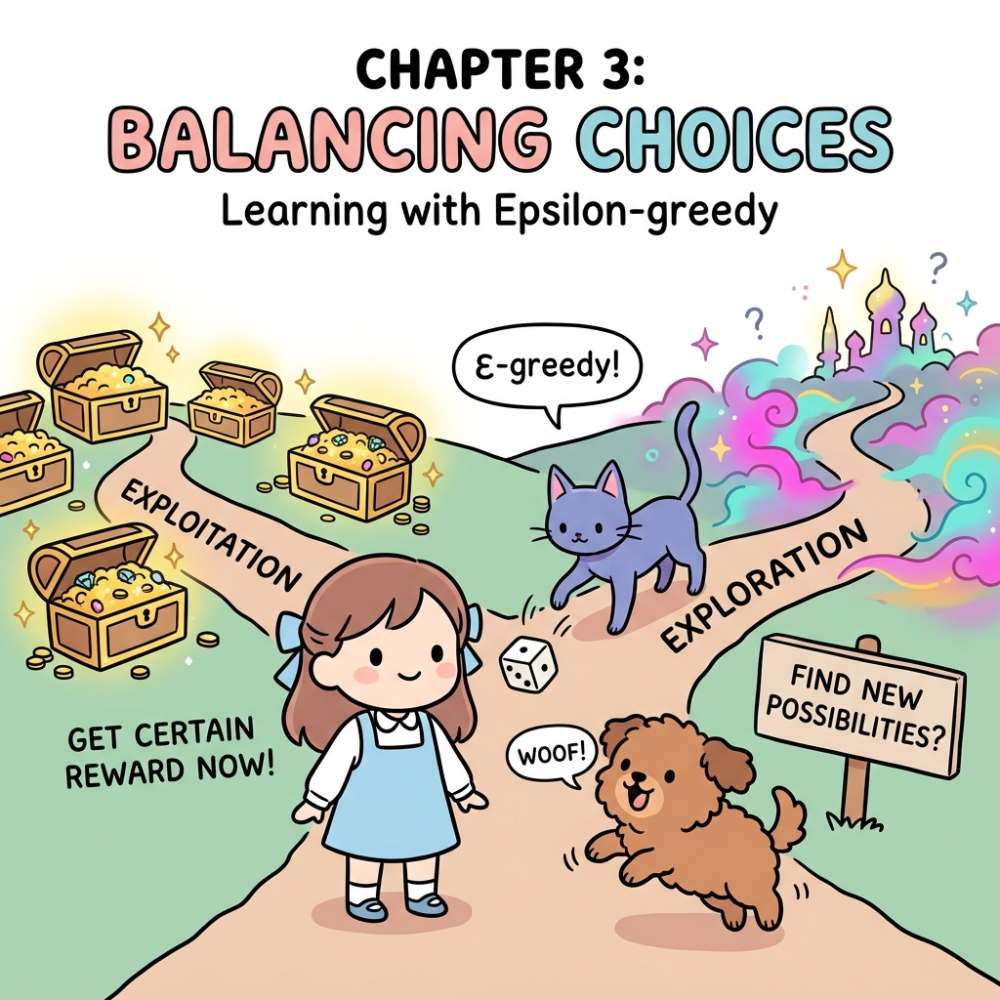
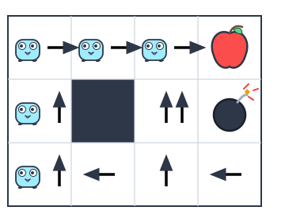
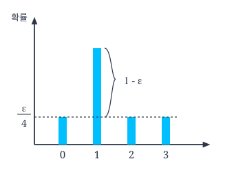
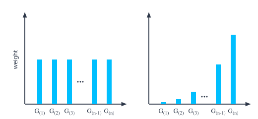
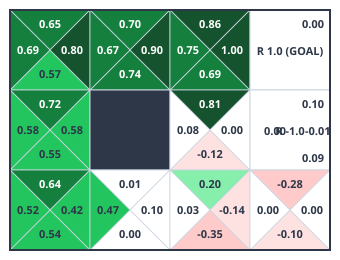

# 09.4 몬테카를로법으로 정책 제어하기

**그림 09-4** 탐색-이용(Exploration-Exploitation) 갈림길에서 지니의 Epsilon-Greedy 주사위 마법을 보며 나아갈 길을 결정하는 도로시


가치 함수 평가를 넘어 최적 정책을 순차적으로 갱신하는 **정책 제어(Policy Control)**와 탐색-이용의 균형을 다룹니다. 무작위 행동 탐색의 비율을 제어하는 ***ε*-탐욕 정책(*ε*-greedy policy)**을 활용하여 몬테카를로법으로 최적 솔루션에 수렴해 나가는 전체 루프를 요정 지니의 딜레마 주사위 놀이와 함께 정복해봅시다!

---

앞서 5.2절에서는 몬테카를로법으로 '정책 평가'를 수행했습니다. 정책 평가의 다음 단계는 최적 정책을 찾는 '정책 제어'입니다. 이번 절에서는 몬테카를로법을 이용한 정책 제어를 설명합니다. 다행히도 새로 배울 내용은 많지 않습니다. 핵심 아이디어들을 4.3절에서 이미 다 배웠기 때문이죠. 핵심은 바로 평가와 개선을 번갈아 반복하는 것입니다. 그럼 구현에 앞서 가볍게 복습해보겠습니다.


## 09.4.1 평가와 개선

**그림 09-13** 정책 평가(Evaluation)와 정책 개선(Improvement)의 과정을 탁구 핑퐁 패들로 주고받는 지니와 도로시


최적 정책은 '평가'와 '개선'을 번갈아 반복하여 얻습니다. '평가' 단계에서는 정책을 평가하여 가치 함수를 얻습니다. 그리고 '개선' 단계에서는 가치 함수를 탐욕화하여 정책을 개선합니다. 이 두 과정을 번갈아 반복함으로써 최적 정책(과 최적 가치 함수)에 점점 다가갈 수 있습니다.

앞에서는 몬테카를로법으로 정책을 평가했습니다. 예를 들어 *π*라는 정책이 있다면, 몬테카를로법을 이용해 *V<sub>π</sub>(s)*를 얻을 수 있었습니다. 그다음은 개선 단계입니다. 개선 단계에서는 탐욕화를 수행합니다. 수식으로 다음처럼 표현할 수 있습니다.

$$
\mu(s) = \operatorname{argmax}_a Q(s, a)
$$
[식 6.3]

$$
= \operatorname{argmax}_a \sum_{s'} p(s' \mid s, a) \{ r(s, a, s') + \gamma V(s') \}
$$
[식 6.4]

개선 단계에서는 가치 함수의 값을 최대로 만드는 행동을 선택합니다(이 책에서는 '탐욕화'라고 부릅니다). *Q* 함수(행동 가치 함수)의 경우 [식 6.3]과 같이 *Q* 함수가 최댓값을 반환하는 행동을 선택합니다. 이때 행동이 단 하나로 결정되므로 함수 *μ(s)*로 나타낼 수 있습니다. 또한 [식 6.4]와 같이 가치 함수 *V*로 나타낼 수도 있습니다.

앞 절까지는 가치 함수 *V*에 대한 평가를 진행했습니다. 만약 가치 함수 *V*를 사용하여 정책을 개선한다면 [식 6.4]를 계산하면 됩니다. 하지만 이 식에는 제약이 있습니다. 일반적인 강화 학습 문제에서는 환경 모델, 즉 *p*(*s'* | *s*, *a*)와 *r*(*s*, *a*, *s'*)를 알 수 없습니다. 그런데 [식 6.4]는 환경 모델을 사용하지 않으면 계산할 수 없죠. 따라서 일반적인 강화 학습 문제에서는 *Q* 함수를 이용하는 [식 6.3]을 이용해야 합니다. 이 식에서는 단순히 *Q(s, a)*가 최대가 되는 행동 *a*를 찾아내기만 하면 되므로 환경 모델이 필요 없습니다.

*Q* 함수를 대상으로 개선할 경우 *Q* 함수를 '평가'해야 합니다. 앞 절까지는 몬테카를로법으로 상태 가치 함수를 평가했습니다. 평가 대상을 *Q* 함수로 바꿔줘야 합니다. 그러려면 몬테카를로법의 갱신식에서 *V(s)*에서 *Q(s, a)*로 전환해야겠죠. 수식으로는 다음과 같습니다.


**[상태 가치 함수 평가]**

* 일반적인 방식: *V<sub>π</sub>(s)* = (*G<sup>(1)</sup>* + *G<sup>(2)</sup>* + ... + *G<sup>(n)</sup>*) / *n*
* 증분 방식: *V<sub>n</sub>(s)* = *V<sub>n-1</sub>(s)* + (1 / *n*) * {*G<sup>(n)</sup>* - *V<sub>n-1</sub>(s)*}

[식 6.6]

**[Q 함수 평가]**

* 일반적인 방식: *Q<sub>n</sub>(s, a)* = (*G<sup>(1)</sup>* + *G<sup>(2)</sup>* + ... + *G<sup>(n)</sup>*) / *n*
* 증분 방식: *Q<sub>n</sub>(s, a)* = *Q<sub>n-1</sub>(s, a)* + (1 / *n*) * {*G<sup>(n)</sup>* - *Q<sub>n-1</sub>(s, a)*}

[식 6.5]

여기서 *G<sup>(n)</sup>*은 *n*번째 에피소드에서 얻을 수 있는 수익이고 *V<sub>n</sub>(s)*는 *n*번째 에피소드가 끝난 시점의 상태 가치 함수 추정치입니다. 마찬가지로 *Q<sub>n</sub>(s, a)*는 *n*번째 에피소드가 끝난 시점의 Q 함수 추정치입니다. 이 식들에서 알 수 있듯이 상태 가치 함수든 Q 함수든 대상이 바뀌었을 뿐, 몬테카를로법으로 하는 계산 자체는 변하지 않습니다.

## 09.4.2 몬테카를로법으로 정책 제어 구현

이제 몬테카를로법으로 정책을 제어하는 에이전트를 구현하겠습니다. 클래스 이름은 `McAgent`입니다. 먼저 코드 전반부를 보겠습니다.

```python
class McAgent:
    def __init__(self):
        self.gamma = 0.9
        self.action_size = 4

        random_actions = {0: 0.25, 1: 0.25, 2: 0.25, 3: 0.25}
        self.pi = defaultdict(lambda: random_actions)
        self.Q = defaultdict(lambda: 0) # V가 아닌 Q를 사용
        self.cnts = defaultdict(lambda: 0)
        self.memory = []

    def get_action(self, state):
        action_probs = self.pi[state]
        actions = list(action_probs.keys())
        probs = list(action_probs.values())
        return np.random.choice(actions, p=probs)
        return np.random.choice(actions, p=probs)

    def add(self, state, action, reward):
        data = (state, action, reward)
        self.memory.append(data)

    def reset(self):
        self.memory.clear()
```

앞 절에서 구현한 `RandomAgent` 클래스와 거의 같습니다. 유일한 차이는 `self.V`에서 `self.Q`로 이름을 바꾼 부분입니다.

이어서 핵심인 정책 제어를 구현합니다.

```python
def greedy_probs(Q, state, action_size=4):
    qs = [Q[(state, action)] for action in range(action_size)]
    max_action = np.argmax(qs)

    action_probs = {action: 0.0 for action in range(action_size)}
    # 이 시점에서 action_probs는 {0: 0.0, 1: 0.0, 2: 0.0, 3: 0.0}이 됨
    action_probs[max_action] = 1 # ❶
    return action_probs # 탐욕 행동을 취하는 확률 분포 반환

class McAgent:
    ...

    def update(self):
        G = 0
        for data in reversed(self.memory):
            state, action, reward = data
            G = self.gamma * G + reward
            key = (state, action)
            self.cnts[key] += 1
            # [식 6.5]에 따라 self.Q 갱신
            self.Q[key] += (G - self.Q[key]) / self.cnts[key] # ❷

            # state의 정책 탐욕화
            self.pi[state] = greedy_probs(self.Q, state)
```


먼저 `greedy_probs()` 함수를 준비합니다. 에이전트의 메서드가 아닌 외부 함수로 구현했습니다. 이 함수는 이름에서 짐작할 수 있듯이 탐욕 행동을 취하도록 하는 확률 분포를 반환합니다. 즉, 매개변수로 받은 `state` 상태에서 *Q* 함수의 값이 가장 큰 행동만을 취하게끔 확률 분포를 만들어줍니다. 예를 들어 주어진 상태에서 0번째 행동의 *Q* 함수 값이 가장 크다면 `{0: 1.0, 1: 0.0, 2: 0.0, 3: 0.0}`을 반환합니다.

`update()` 메서드에서는 `self.Q`를 갱신합니다. 여기서 주의할 점은 `self.Q`의 키가 `(state, action)` 튜플이라는 점입니다. 그리고 [식 6.5]에 따라 '증분 방식'으로 `self.Q`를 갱신하고, `self.Q` 갱신이 끝나면 `state`의 정책을 탐욕화합니다.

이상이 `McAgent` 클래스입니다. 그런데 사실 이 코드는 제대로 작동하지 못합니다. 개선할 점이 두 가지가 있는데, 바로 다음 부분입니다.

* 코드의 ❶: 완전한 탐욕이 아닌 *ε*-탐욕 정책으로 변경
* 코드의 ❷: *Q* 갱신을 '고정값 *α* 방식'으로 수행

이제부터 두 개선 사항에 대해 구체적으로 알아봅시다.

## 09.4.3 *ε*-탐욕 정책으로 변경(첫 번째 개선 사항)

에이전트는 개선 단계에서 정책을 탐욕화합니다. 탐욕화의 결과로 해당 상태에서 취할 수 있는 행동이 단 하나로 고정됩니다(만약 *Q*의 값이 같다면 여러 가지 행동을 취할 수도 있습니다). 예를 들어 정책을 탐욕화하여 [그림 09-14]처럼 행동하게 되었다고 가정해봅시다.

**그림 09-14** 탐욕 정책과 에이전트가 따라가는 경로




그림과 같이 탐욕 행동만을 수행하면 에이전트의 경로가 한 가지로 고정됩니다. 그러면 모든 상태와 행동 조합에 대한 수익 샘플 데이터를 수집할 수 없겠죠. 이 문제를 해결하려면 에이전트가 '탐색'도 시도하도록 해야 합니다.

> [!NOTE]
> 밴디트 문제에서 설명했듯이 여기에서도 '활용과 탐색의 트레이드오프'가 생깁니다. 지금까지의 경험에 비춰 가장 좋다고 생각되는 행동이 '활용'이고, 다른 시도를 하여 새로운 경험을 늘리는 행동이 '탐색'입니다. 그래서 활용과 탐색은 상충관계입니다.

에이전트에게 '탐색'을 시키는 대표적인 방법이 *ε*-탐욕 정책입니다. 기본적으로 *Q* 함수의 값이 가장 큰 행동을 선택하되, 무작위성을 '살짝' 첨가하여 낮은 확률로 아무 행동이나 선택하도록 하는 정책입니다. 이렇게 하면 각 상태에서 정해진 행동만 선택되는 문제를 방지할 수 있습니다(잘하면 모든 상태를 거치고, 할 수 있는 모든 행동을 경험해볼 수도 있습니다). 그러면서도 대다수 경우에 탐욕 행동을 취하기 때문에 최적 정책에 가까운 결과를 얻을 수 있습니다.

이제 *ε*-탐욕 버전의 `greedy_probs()` 함수를 구현해보겠습니다.

<div align="right"><b>ch05/mc_control.py</b></div>

```python
def greedy_probs(Q, state, epsilon=0, action_size=4):
    qs = [Q[(state, action)] for action in range(action_size)]
    max_action = np.argmax(qs)

    base_prob = epsilon / action_size
    action_probs = {action: base_prob for action in range(action_size)}
    # 이 시점에서 action_probs = {0: epsilon / 4, 1: epsilon / 4, 2: epsilon / 4, 3: epsilon / 4}
    action_probs[max_action] += (1 - epsilon)
    return action_probs
```

이전 코드에서는 100% 탐욕스러웠던 확률 분포를 *ε*-탐욕 형태로 변경했습니다. 확률 분포를 *ε*-탐욕 형태로 만들기 위해 우선 모든 행동의 확률을 *ε* / 4로 설정하고(이번 문제에서는 행동의 가짓수가 4개), *Q* 함수 값이 가장 큰 행동에 따로 1 - *ε*의 확률을 더했습니다. [그림 09-15]를 보면 이렇게 설정한 이유가 확실하게 이해될 것입니다.

**그림 09-15** *ε*-탐욕 정책에 의해 각 행동이 선택될 확률



참고로 지금 구현한 `greedy_probs()` 함수는 앞으로 반복해서 사용할 것이므로 `common/utils` 파일에도 비슷한 코드를 넣어뒀습니다. `from common.utils import greedy_probs` 코드를 추가하여 언제든 가져와 사용할 수 있습니다.

## 09.4.4 고정값 *α* 방식으로 수행(두 번째 개선 사항)

다음은 두 번째 개선 사항입니다. 먼저 수정한 부분의 코드를 보겠습니다.

<div align="right"><b>ch05/mc_control.py</b></div>

```python
# 수정 전
# self.Q[key] += (G - self.Q[key]) / self.cnts[state] #

# 수정 후
alpha = 0.1
self.Q[key] += (g - self.Q[key]) * alpha # ❷
```

이와 같이 ❷ 부분을 고정값 `alpha`로 바꿔줍니다. 수정 전과 후의 방식에는 [그림 09-16]과 같은 차이가 있습니다.


**그림 09-16** '수정 전 방식(왼쪽)'과 '고정값 방식(오른쪽)'에서 각 데이터에 부여되는 가중치



수정 전 방식은 모든 샘플 데이터(*G<sup>(1)</sup>, G<sup>(2)</sup>, ..., G<sup>(n)</sup>*)에 가중치를 '균일'하게 주고 평균을 냅니다. '표본 평균'이죠. 표본 평균에서는 각 데이터에 대한 가중치가 모두 $1/n$입니다.

반면, 고정값 *α*로 갱신하는 방식은 오른쪽 그림처럼 각 데이터에 대한 가중치가 '기하급수적'으로 커집니다. 이를 '지수 이동 평균<sup>exponential moving average</sup>'이라고 합니다. 지수 이동 평균은 최신 데이터일수록 가중치를 훨씬 크게 줍니다.

몬테카를로법을 이용한 정책 제어에는 지수 이동 평균이 적합합니다. '수익'이라는 샘플 데이터가 생성되는 확률 분포가 시간에 따라 달라지기 때문입니다. 더 정확히 말하면, 에피소드가 진행될수록 정책이 갱신되기 때문에 수익이 생성되는 확률 분포도 달라집니다. 밴디트 문제의 용어를 빌려 '비정상 문제<sup>non-stationary problem</sup>'라고 할 수 있습니다. 샘플 데이터(수익)를 생성하는 확률 분포가 일정하지 않은 경우에는 지수 이동 평균이 적합하다는 사실은 1.5.1절에서 설명했습니다.

> [!NOTE]
> 수익은 '환경의 상태 전이'와 '에이전트의 정책'이라는 두 가지 확률적 처리를 반복하며 만들어집니다. 이 두 가지 처리에서의 확률 분포가 아무것도 변하지 않는다면 샘플링되는 수익의 분포 역시 '정상(변하지 않음)'입니다. 하지만 둘 중 하나라도 변화한다면 수익의 확률 분포는 '비정상'이 됩니다. 지금 예에서는 정책을 반복적으로 개선하기 때문에 에피소드를 거칠 때마다 정책이 달라질 수밖에 없습니다. 이에 따라 수익의 확률 분포도 변화합니다.


## 09.4.5 몬테카를로법으로 정책 반복법 구현(개선 버전)

앞의 두 개선 사항을 반영하여 `McAgent` 클래스를 다음과 같이 수정했습니다(달라진 부분에 배경색을 칠했습니다).

<div align="right"><b>ch05/mc_control.py</b></div>

```python
class McAgent:
    def __init__(self):
        self.gamma = 0.9
        self.epsilon = 0.1 # (첫 번째 개선) ε-탐욕 정책의 ε
        self.alpha = 0.1 # (두 번째 개선) Q 함수 갱신 시의 고정값 α
        self.action_size = 4

        random_actions = {0: 0.25, 1: 0.25, 2: 0.25, 3: 0.25}
        self.pi = defaultdict(lambda: random_actions)
        self.Q = defaultdict(lambda: 0)
        # self.cnts = defaultdict(lambda: 0)
        self.memory = []

    def get_action(self, state):
        action_probs = self.pi[state]
        actions = list(action_probs.keys())
        probs = list(action_probs.values())
        return np.random.choice(actions, p=probs)

    def add(self, state, action, reward):
        data = (state, action, reward)
        self.memory.append(data)

    def reset(self):
        self.memory.clear()

    def update(self):
        G = 0
        for data in reversed(self.memory):
            state, action, reward = data
            G = self.gamma * G + reward
            key = (state, action)
            # self.cnts[key] += 1
            # self.Q[key] += (G - self.Q[key]) / self.cnts[key]
            self.Q[key] += (G - self.Q[key]) * self.alpha # ❶
            self.pi[state] = greedy_probs(self.Q, state, self.epsilon) # ❷
```


초기화할 때 `self.epsilon`과 `self.alpha` 인스턴스 변수를 새로 추가했습니다.

`self.epsilon`은 *ε*-탐욕 정책에서 무작위로 행동할 확률입니다. 지금처럼 0.1로 설정하면 10%의 확률로 무작위 행동을 선택하고, 90%의 확률로 탐욕 행동을 선택합니다. 코드 ❷에서 이 값을 `greedy_probs()` 함수에 전달하여 *ε*-탐욕 정책에 따른 확률 분포를 만들도록 했습니다.

`self.alpha`는 Q 함수를 갱신할 때 사용하는 고정값입니다. 코드 ❶에서 고정값인 `self.alpha`로 Q 함수를 갱신합니다.

이상이 개선된 버전의 `McAgent` 클래스입니다. 이제 새로운 `McAgent` 클래스를 `GridWorld` 클래스와 함께 사용해보겠습니다.

<div align="right"><b>ch05/mc_control.py</b></div>

```python
env = GridWorld()
agent = McAgent()

episodes = 10000
for episode in range(episodes):
    state = env.reset()
    agent.reset()

    while True:
        action = agent.get_action(state)
        next_state, reward, done = env.step(action)

        agent.add(state, action, reward)
        if done:
            agent.update()
            break

        state = next_state

env.render_q(agent.Q)
```

총 1만 번의 에피소드로 학습하고, 마지막으로 `env.render_q(agent.Q)`로 Q 함수를 시각화했습니다. 이 코드를 실행하면 다음 그림을 얻을 수 있습니다.


**그림 09-17** Q 함수 시각화



각 상태에서 취할 수 있는 행동이 4가지이므로 [그림 09-17]과 같이 각 칸을 네 개로 나누어 그렸습니다. 그림을 보면 마이너스 보상을 피하고 플러스 보상을 얻는 행동의 Q 함수가 커지는 것을 알 수 있습니다(결과는 실행할 때마다 달라집니다). 이 결과에서 탐욕 행동들만 뽑아내면 [그림 09-18]처럼 됩니다.

**그림 09-18** Q 함수로부터 얻을 수 있는 탐욕 정책


이와 같이 Q 함수로부터 얻은 탐욕 정책으로도 최적 정책과 비슷한 결과를 얻을 수 있습니다. 실제로는 에이전트가 *ε*-탐욕 정책에 따라 어떤 상태에서든 (낮은 확률로) 무작위로 행동하기도 합니다. 하지만 대부분은 탐욕 행동을 선택하기 때문에 대체로 좋은 결과를 얻을 수 있습니다.

지금까지 몬테카를로법으로 정책 제어를 구현해보았습니다.

