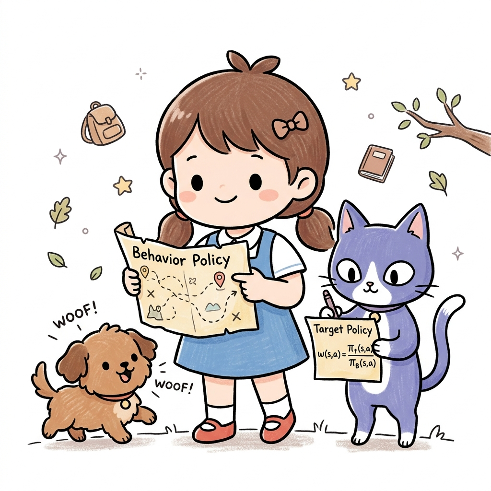
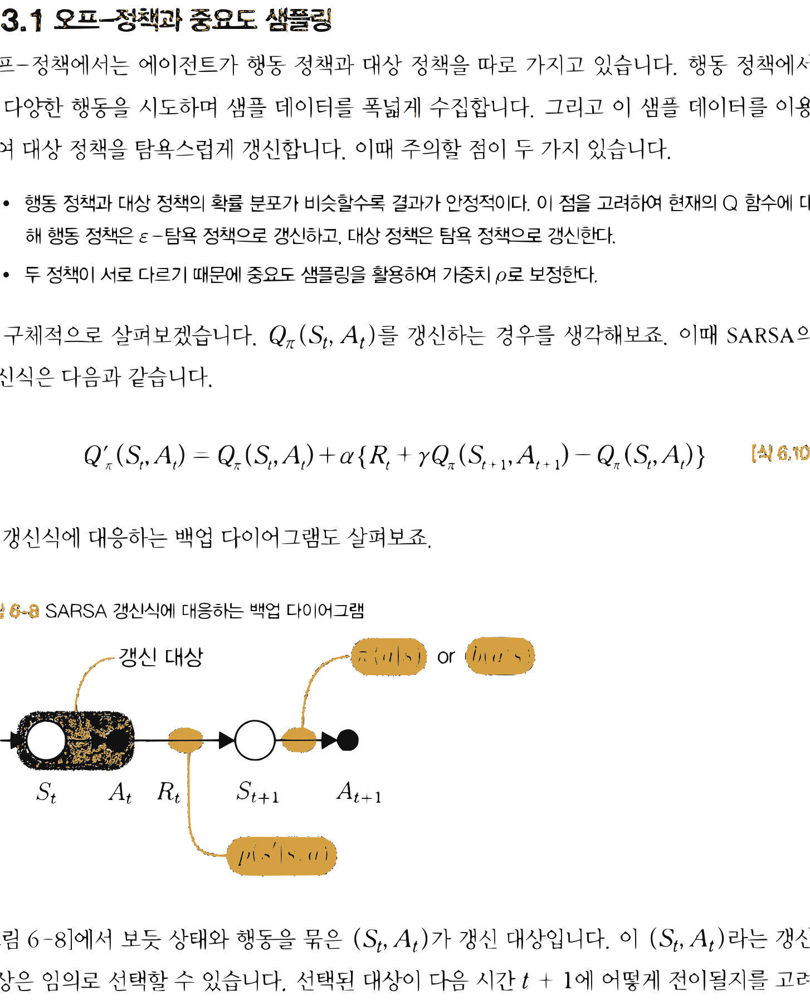
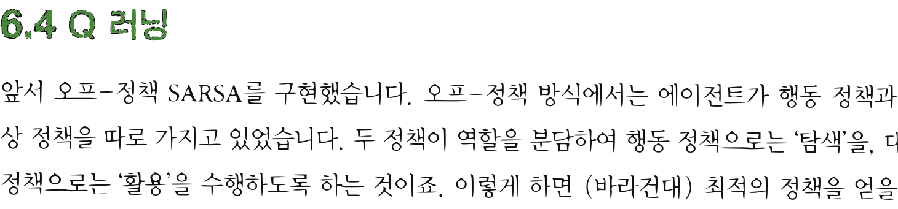

# 10.3 오프-정책 SARSA

**그림 10-3** 탐험 지도(Behavior Policy)와 학습 목표 책(Target Policy)의 확률 변동 비를 대수적으로 유도해 칠판에 필기해주는 지니와 도로시


오프-정책(Off-policy) 시간차 학습 방식을 SARSA 제어 알고리즘에 융합합니다. 중요도 샘플링 비율 $w$를 가중치로 대입하여, 행동 정책이 겪은 모험 데이터로부터 학습 대상 정책의 Q 가치를 보정하는 정교한 연산 방식을 도로시의 지도 탐색 비유로 명쾌하게 풀어봅시다!

---

이번에는 오프-정책 SARSA를 구현할 차례입니다. 보통 이쯤에서 'Q 러닝'이 등장하지만 이 책에서는 '오프-정책 SARSA'부터 도출하고 'Q 러닝'은 그 후에 살펴보겠습니다.

## 10.3.1 오프-정책과 중요도 샘플링

오프-정책에서는 에이전트가 행동 정책과 대상 정책을 따로 가지고 있습니다. 행동 정책에서는 다양한 행동을 시도하며 샘플 데이터를 폭넓게 수집합니다. 그리고 이 샘플 데이터를 이용하여 대상 정책을 탐욕스럽게 갱신합니다. 이때 주의할 점이 두 가지 있습니다.

* 행동 정책과 대상 정책의 확률 분포가 비슷할수록 결과가 안정적이다. 이 점을 고려하여 현재의 Q 함수에 대해 행동 정책은 *ε*-탐욕 정책으로 갱신하고, 대상 정책은 탐욕 정책으로 갱신한다.
* 두 정책이 서로 다르기 때문에 중요도 샘플링을 활용하여 가중치 *ρ*로 보정한다.

더 구체적으로 살펴보겠습니다. *Q*<sub>*π*</sub>(*S*<sub>*t*</sub>, *A*<sub>*t*</sub>)를 갱신하는 경우를 생각해보죠. 이때 SARSA의 갱신식은 다음과 같습니다.

$$
Q_{\pi}'(S_t, A_t) = Q_{\pi}(S_t, A_t) + \alpha \{ R_t + \gamma Q_{\pi}(S_{t+1}, A_{t+1}) - Q_{\pi}(S_t, A_t) \}
$$
[식 7.10]

이 갱신식에 대응하는 백업 다이어그램도 살펴보죠.

**그림 10-8** SARSA 갱신식에 대응하는 백업 다이어그램


갱신 대상 $\pi(a \mid s)$ or $b(a \mid s)$
$p(s' \mid s, a)$

[그림 10-8]에서 보듯 상태와 행동을 묶은 $(S_t, A_t)$가 갱신 대상입니다. 이 $(S_t, A_t)$라는 갱신 대상은 임의로 선택할 수 있습니다. 선택된 대상이 다음 시간 $t+1$에 어떻게 전이될지를 고려


하는 것이죠. 이때 다음 상태 *S*<sub>*t+1*</sub>은 환경의 상태 전이 확률 $p(s' \mid s, a)$에 따라 샘플링됩니다. 그리고 상태 *S*<sub>*t+1*</sub>에서 선택되는 행동은 대상 정책 *π* (또는 행동 정책 $b$)에 따라 샘플링됩니다. 이렇게 얻은 샘플 데이터를 [식 7.10]에 대입하여 *Q*<sub>*π*</sub>(*S*<sub>*t*</sub>, *A*<sub>*t*</sub>)를 갱신합니다. 이때 행동이 정책 *π*에 따라 선택됨을 명시하면 SARSA의 갱신식을 다음처럼 작성할 수 있습니다.

샘플링: $A_{t+1} \sim \pi$
$$
Q_{\pi}'(S_t, A_t) = Q_{\pi}(S_t, A_t) + \alpha \{ R_t + \gamma Q_{\pi}(S_{t+1}, A_{t+1}) - Q_{\pi}(S_t, A_t) \}
$$
[식 7.12]

[식 7.12]는 *Q*<sub>*π*</sub>(*S*<sub>*t*</sub>, *A*<sub>*t*</sub>)를 $R_t + \gamma Q_{\pi}(S_{t+1}, A_{t+1})$ 방향으로 갱신함을 나타냅니다. 즉, $R_t + \gamma Q_{\pi}(S_{t+1}, A_{t+1})$이 'TD 목표'인 것입니다.

다음으로 행동 *A*<sub>*t+1*</sub>이 정책 $b$에 따라 샘플링된 경우를 생각해보죠. 이 경우 가중치 *ρ*로 TD 목표를 보정합니다 (중요도 샘플링). 가중치 *ρ*는 '정책이 *π*일 때 TD 목표를 얻을 확률'과 '정책이 $b$일 때 TD 목표를 얻을 확률'의 비율입니다. 수식으로는 다음처럼 표현됩니다.

$$
\rho = \frac{\pi(A_{t+1} \mid S_{t+1})}{b(A_{t+1} \mid S_{t+1})}
$$

따라서 오프-정책 SARSA의 갱신식은 다음과 같습니다.

샘플링: $A_{t+1} \sim b$
$$
Q_{\pi}'(S_t, A_t) = Q_{\pi}(S_t, A_t) + \alpha \{ \rho ( R_t + \gamma Q_{\pi}(S_{t+1}, A_{t+1}) ) - Q_{\pi}(S_t, A_t) \}
$$
[식 7.13]

이 식과 같이 행동은 정책 $b$에 따라 샘플링되고 가중치 *ρ*로 TD 목표가 보정됩니다.

## 10.3.2 오프-정책 SARSA 구현

오프-정책 SARSA를 구현해보겠습니다.

<div align="right"><b>ch06/sarsa_off_policy.py</b></div>

```python
class SarsaOffPolicyAgent:
    def __init__(self):
        self.gamma = 0.9
        self.alpha = 0.8
        self.epsilon = 0.1
        self.action_size = 4

        random_actions = {0: 0.25, 1: 0.25, 2: 0.25, 3: 0.25}
        self.pi = defaultdict(lambda: random_actions)
        self.b = defaultdict(lambda: random_actions)
        self.Q = defaultdict(lambda: 0)
        self.memory = deque(maxlen=2)

    def get_action(self, state):
        action_probs = self.b[state] # ❶ 행동 정책에서 가져옴
        actions = list(action_probs.keys())
        probs = list(action_probs.values())
        return np.random.choice(actions, p=probs)

    def reset(self):
        self.memory.clear()

    def update(self, state, action, reward, done):
        self.memory.append((state, action, reward, done))
        if len(self.memory) < 2:
            return

        state, action, reward, done = self.memory[0]
        next_state, next_action, _, _ = self.memory[1]

        if done:
            next_q = 0
            rho = 1
        else:
            next_q = self.Q[next_state, next_action]
            # ❷ 가중치 rho 계산
            rho = self.pi[next_state][next_action] / self.b[next_state][next_action]

        # ❸ rho로 TD 목표 보정
        target = rho * (reward + self.gamma * next_q)
        self.Q[state, action] += (target - self.Q[state, action]) * self.alpha

        # ❹ 각각의 정책 개선
        self.pi[state] = greedy_probs(self.Q, state, 0)
        self.b[state] = greedy_probs(self.Q, state, self.epsilon)
```


코드의 ❶~❹를 차례로 살펴보죠.

❶ 행동을 추출하는 `get_action()` 메서드에서는 `self.b`의 확률 분포에서 행동을 선택합니다.

❷ 중요도 샘플링으로 가중치 rho를 구합니다. 이 가중치는 대상 정책 `self.pi`와 행동 정책 `self.b`의 확률 비율입니다.

❸ 함수의 갱신 대상인 TD 목표(target)에 가중치 rho를 곱합니다.

❹ 대상 정책 `self.pi`는 탐욕 정책으로 개선하고, 행동 정책 `self.b`는 *ε*-탐욕 정책으로 개선합니다.

이제 `SarsaOffPolicyAgent` 클래스를 사용하여 그리드 월드 문제를 풀어보죠. 에이전트를 구동하는 코드는 앞 절과 같으니 여기서는 결과를 바로 보겠습니다.

**그림 10-9** 오프-정책 SARSA로 얻은 결과



결과는 실행할 때마다 달라집니다. [그림 10-9]의 결과를 보면 아직 개선할 여지가 있어 보입니다. 다음 절에서는 어떻게 개선할지를 고민해보겠습니다.

