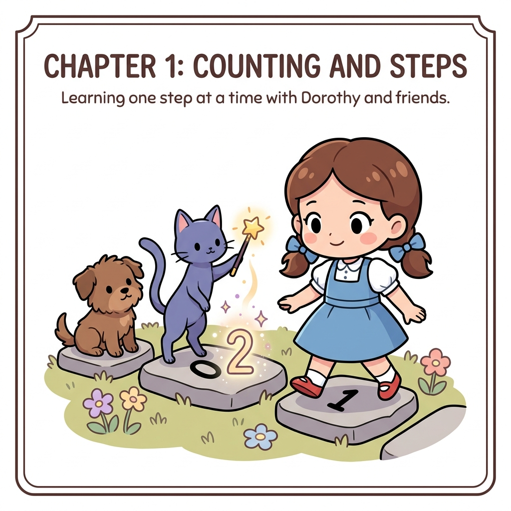

# CHAPTER 10 TD법

**그림 10-0** 단 한 걸음(One-step)을 앞으로 전진하자마자 마법 지팡이로 이전 발판의 가치를 업데이트해주는 지니와 도로시

---

5장에서 몬테카를로법에 대해 배웠습니다. 몬테카를로법을 이용하면 환경 모델 없이도 정책을 평가할 수 있습니다. 그리고 평가와 개선을 번갈아 반복하면서 최적 정책(또는 최적에 가까운 정책)을 얻을 수 있습니다. 하지만 몬테카를로법은 에피소드의 끝에 도달한 후에야 가치 함수를 갱신할 수 있습니다. 에피소드가 끝나야만 수익이 확정되기 때문입니다.

> [!NOTE]
> 지속적 과제에서는 몬테카를로법을 이용할 수 없습니다. 또한 일회성 과제라도 완료까지 시간이 걸리는 에피소드에서라면 몬테카를로법으로 가치 함수를 갱신하는 데는 오랜 시간이 소요됩니다. 특히 에피소드의 초기 단계에서는 에이전트의 정책이 무작위적인 경우가 많기 때문에 시간이 더 많이 필요합니다.

이번 장에서는 환경 모델을 사용하지 않을 뿐 아니라 행동을 한 번 수행할 때마다 가치 함수를 갱신하는 TD법을 설명합니다. TD는 'Temporal Difference'의 약자로, '시간차'라는 뜻입니다. 에피소드가 끝날 때까지 기다리지 않고 일정 시간마다 정책을 평가하고 개선합니다.
