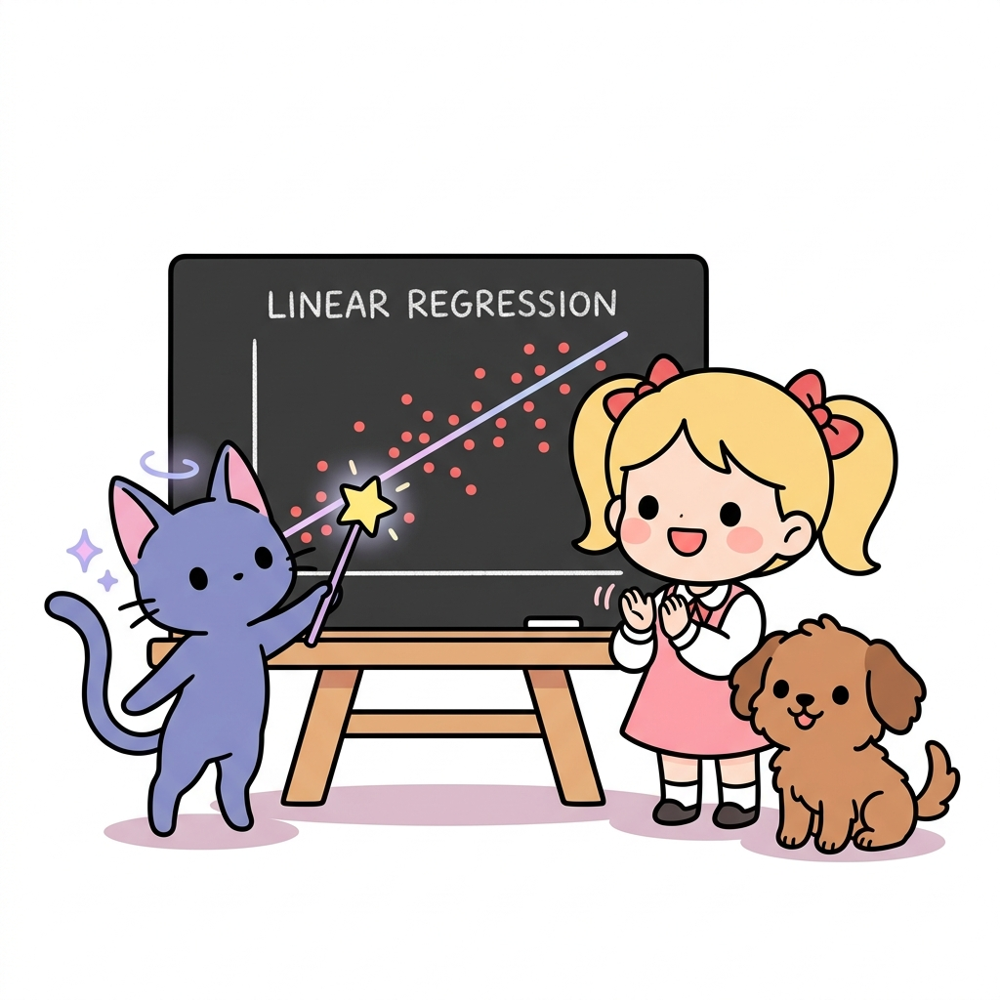
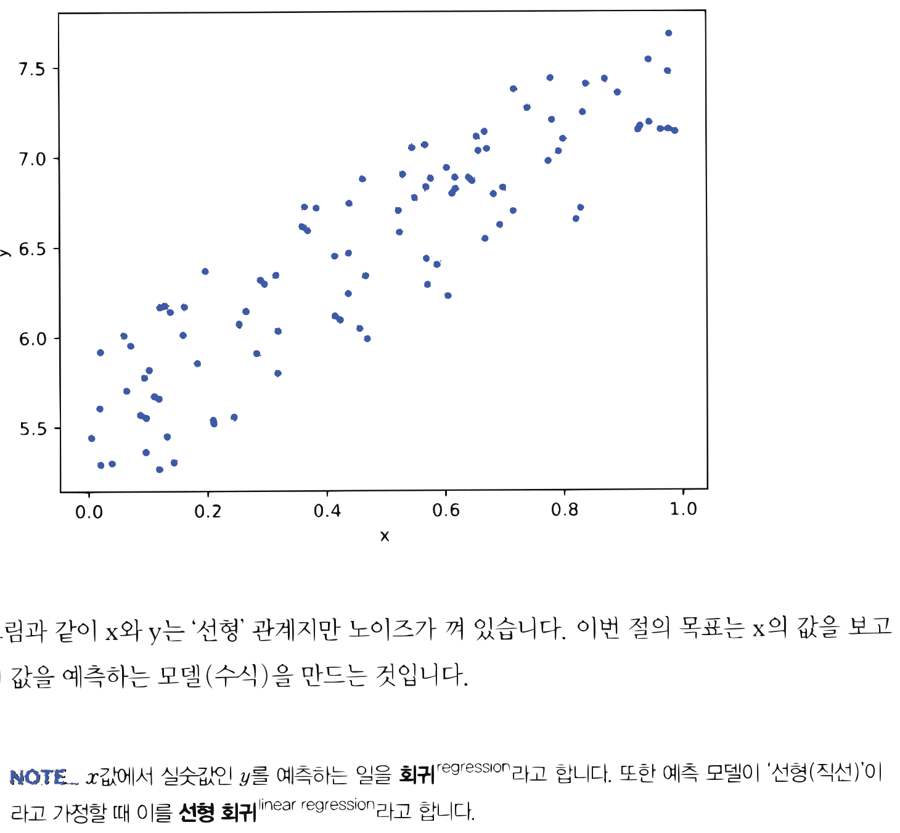
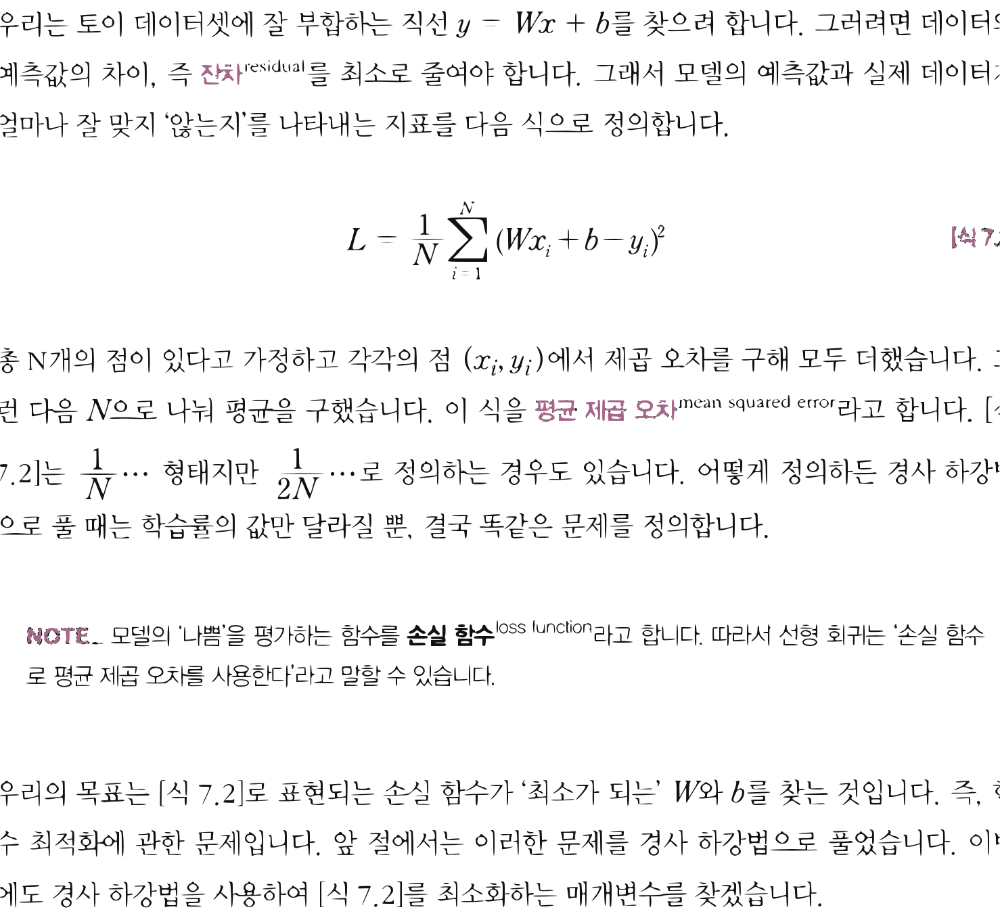
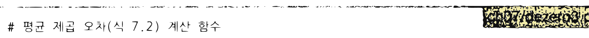
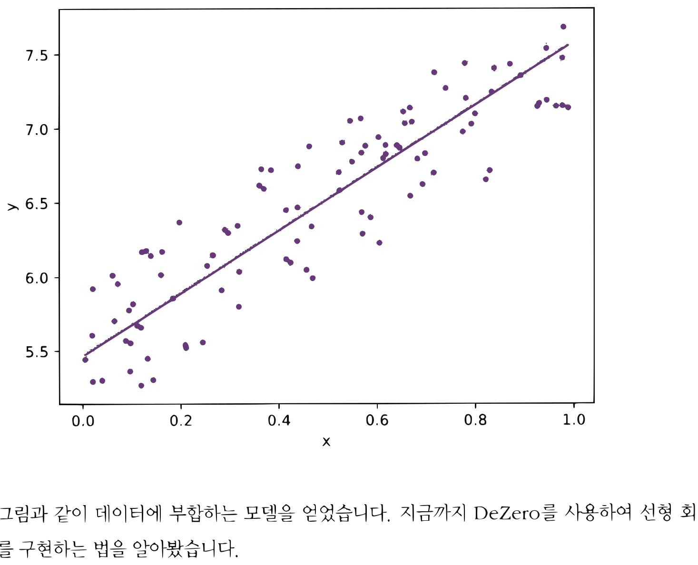

# 11.2 선형 회귀

**그림 11-2** 칠판 위에 흩뿌려진 빨간색 경험 데이터 점들을 관통하는 완벽한 예측 직선을 요술 지팡이로 그려보이는 지니와 도로시


머신러닝의 주춧돌이자 수많은 인공지능 예측의 뿌리가 되는 **선형 회귀(Linear Regression)** 이론을 공부합니다. 연속적인 데이터 점들의 분포를 가장 정확하게 설명해주는 직선 수식($y = wx + b$)의 평균제곱오차(MSE) 손실을 정의하고, 경사하강법(Gradient Descent) 마법을 통해 최적의 매개변수를 수렴시켜 나가는 과정을 지니와 함께 재미있게 배워봅시다!

---

머신러닝은 '데이터'를 이용해 문제를 해결합니다. 문제 해결 방법을 사람이 생각하는 게 아니라, 수집된 '데이터'를 보고 컴퓨터가 발견(학습)해내는 것입니다. 이처럼 '데이터'에서 해결책을 찾는 것이 머신러닝의 본질입니다. 이번 절에서는 DeZero를 이용해 머신러닝 문제를 풀어보겠습니다. 그 첫걸음으로 머신러닝에서 가장 기본이 되는 '선형 회귀'를 구현해보겠습니다.

## 11.2.1 토이 데이터셋

먼저 실험용으로 작은 데이터셋을 만들겠습니다. 실험용의 작은 데이터셋을 **토이 데이터셋**<sup>toy dataset</sup>이라고 합니다. 그리고 문제를 언제든 똑같이 재현할 수 있도록 데이터 생성용 난수 발생기의 시드를 고정하겠습니다.

```python
import numpy as np

np.random.seed(0) # 시드 고정
x = np.random.rand(100, 1)
y = 5 + 2 * x + np.random.rand(100, 1)
```

이와 같이 x와 y, 두 개의 변수로 구성된 데이터셋을 만들었습니다. x와 y를 2차원상의 점 위치라고 해보죠. 그러면 데이터셋을 구성하는 점들은 직선상에 있되 y에는 난수가 노이즈로 추가된 형태가 됩니다(그림 11-5).


**그림 11-5** 노이즈가 포함된 데이터셋



그림과 같이 x와 y는 '선형' 관계지만 노이즈가 껴 있습니다. 이번 절의 목표는 x의 값을 보고 y의 값을 예측하는 모델(수식)을 만드는 것입니다.

> [!NOTE]
> x값에서 실숫값인 y를 예측하는 일을 **회귀**<sup>regression</sup>라고 합니다. 또한 예측 모델이 '선형(직선)'이라고 가정할 때 이를 **선형 회귀**<sup>linear regression</sup>라고 합니다.

## 11.2.2 선형 회귀 이론

지금 목표는 주어진 데이터로부터 결과를 잘 맞히는 함수를 찾는 것입니다. 여기서는 $y$와 *x*가 선형 관계라고 가정하기 때문에 그 함수를 식 $y = Wx + b$로 표현할 수 있습니다($W$는 스칼라). 식 $y = Wx + b$는 직선이며 [그림 11-6]처럼 표현됩니다.


**그림 11-6** 선형 회귀의 예


예측값(모델)
잔차
데이터

우리는 토이 데이터셋에 잘 부합하는 직선 $y = Wx + b$를 찾으려 합니다. 그러려면 데이터와 예측값의 차이, 즉 **잔차**<sup>residual</sup>를 최소로 줄여야 합니다. 그래서 모델의 예측값과 실제 데이터가 얼마나 잘 맞지 '않는지'를 나타내는 지표를 다음 식으로 정의합니다.

$$
L = \frac{1}{N} \sum_{i=1}^N (W x_i + b - y_i)^2
$$
[식 8.2]

총 N개의 점이 있다고 가정하고 각각의 점 $(x_i, y_i)$에서 제곱 오차를 구해 모두 더했습니다. 그런 다음 $N$으로 나눠 평균을 구했습니다. 이 식을 **평균 제곱 오차**<sup>mean squared error</sup>라고 합니다. [식 8.2]는 $\frac{1}{N} \dots$ 형태지만 $\frac{1}{2N} \dots$로 정의하는 경우도 있습니다. 어떻게 정의하든 경사 하강법으로 풀 때는 학습률의 값만 달라질 뿐, 결국 똑같은 문제를 정의합니다.

> [!NOTE]
> 모델의 '나쁨'을 평가하는 함수를 **손실 함수**<sup>loss function</sup>라고 합니다. 따라서 선형 회귀는 '손실 함수로 평균 제곱 오차를 사용한다'라고 말할 수 있습니다.

우리의 목표는 [식 8.2]로 표현되는 손실 함수가 '최소가 되는' $W$와 $b$를 찾는 것입니다. 즉, 함수 최적화에 관한 문제입니다. 앞 절에서는 이러한 문제를 경사 하강법으로 풀었습니다. 이번에도 경사 하강법을 사용하여 [식 8.2]를 최소화하는 매개변수를 찾겠습니다.


## 11.2.3 선형 회귀 구현

이제 DeZero를 사용하여 선형 회귀를 구현하겠습니다. 먼저 전반부의 코드를 보시죠.

<div align="right"><b>ch07/dezero3.py</b></div>

```python
import numpy as np
from dezero import Variable
import dezero.functions as F

# 토이 데이터셋
np.random.seed(0)
x = np.random.rand(100, 1)
y = 5 + 2 * x + np.random.rand(100, 1)
x, y = Variable(x), Variable(y) # 생략 가능

# 매개변수 정의
W = Variable(np.zeros((1, 1)))
b = Variable(np.zeros(1))

# 예측 함수
def predict(x):
    y = F.matmul(x, W) + b # 행렬 곱으로 여러 데이터 일괄 계산
    return y
```

매개변수인 W와 b를 Variable 인스턴스로 생성합니다(W는 대문자). W의 형상은 $(1, 1)$이고 b의 형상은 $(1,)$입니다. 또한 이 코드에서는 `predict()` 함수를 정의했습니다. 여기서 행렬을 곱해주는 `matmul()` 함수를 사용하여 계산을 수행합니다. 행렬 곱을 이용하면 여러 데이터를(예제 코드에서는 100개의 데이터) 일괄로 계산할 수 있습니다. 일괄 계산 시 형상은 [그림 11-7]처럼 변화됩니다.

**그림 11-7** 행렬 곱 연산 시 형상 변화(b는 생략)

$\quad\quad x \quad\quad W \quad = \quad y$
형상: $(100, 1) \quad (1, 1) \quad\quad (100, 1)$

[그림 11-7]과 같이 대응하는 차원의 원소 수가 일치함을 알 수 있습니다. 그리고 결과인 y의 형상은 $(100, 1)$이 됩니다. 즉, 데이터가 100개인 x의 원소 각각에 W를 곱한 것입니다. 이런 식으로 단 한 번의 계산으로 모든 데이터의 예측값을 구할 수 있습니다. 지금 예에서의 x는


1차원 데이터입니다. 만약 차원 수가 D인 경우에도 W의 형상을 (D, 1)로 바꿔주기만 하면 됩니다. 예를 들어 D=4라면 [그림 11-8]과 같은 계산이 이루어집니다.

**그림 11-8** 행렬 곱의 형상 변화(x가 4차원 데이터인 경우)


$x \quad W \quad = \quad y$
$(100, 4) \quad (4, 1) \quad\quad (100, 1)$

[그림 11-8]과 같이 `x.shape[1]`과 `W.shape[0]`의 원소 수를 일치시키면 행렬 곱이 올바르게 계산됩니다. 즉, 100개의 데이터 각각에 대해 W와의 '내적' 계산이 이루어집니다.

다음은 후반부 코드입니다.

<div align="right"><b>ch07/dezero3.py</b></div>

```python
# 평균 제곱 오차(식 7.2) 계산 함수
def mean_squared_error(x0, x1):
    diff = x0 - x1
    return F.sum(diff ** 2) / len(diff)

# 경사 하강법으로 매개변수 갱신
lr = 0.1
iters = 100

for i in range(iters):
    y_pred = predict(x)
    loss = mean_squared_error(y, y_pred)
    # 또는 loss = F.mean_squared_error(y, y_pred)
    W.cleargrad()
    b.cleargrad()
    loss.backward()

    W.data -= lr * W.grad.data
    b.data -= lr * b.grad.data

    if i % 10 == 0: # 10회 반복마다 출력
        print(loss.data)

print('====')
print('W =', W.data)
print('b =', b.data)
```

**출력 결과**
```text
42.296340129442335
0.24915731977561134
0.10078974954301652
0.09461859803040694
0.0902667138137311
0.08694585483964615
0.08441084206493275
0.08247571022229121
0.08099850454041051
0.07987086218625004
====
W = [[2.11807369]]
b = [5.46608905]
```

`mean_squared_error(x0, x1)`은 평균 제곱 오차를 구하는 함수로, DeZero의 함수를 이용하여 [식 8.2]를 구현했습니다.

그리고 경사 하강법으로 매개변수를 갱신했습니다. 참고로 DeZero가 제공하는 평균 제곱 오차 함수인 `F.mean_squared_error()`를 사용해도 됩니다.

이제 코드를 실행해봅시다. 그러면 손실 함수의 출력값이 줄어드는 모습을 볼 수 있습니다. 그리고 최종적으로 $\mathrm{W} = [[2.11807369]], \mathrm{b} = [5.46608905]$라는 값을 얻을 수 있습니다. 참고로 W와 b를 이 값으로 설정한 직선 그래프는 [그림 11-9]와 같습니다.


**그림 11-9** 학습 후 모델



그림과 같이 데이터에 부합하는 모델을 얻었습니다. 지금까지 DeZero를 사용하여 선형 회귀를 구현하는 법을 알아봤습니다.

