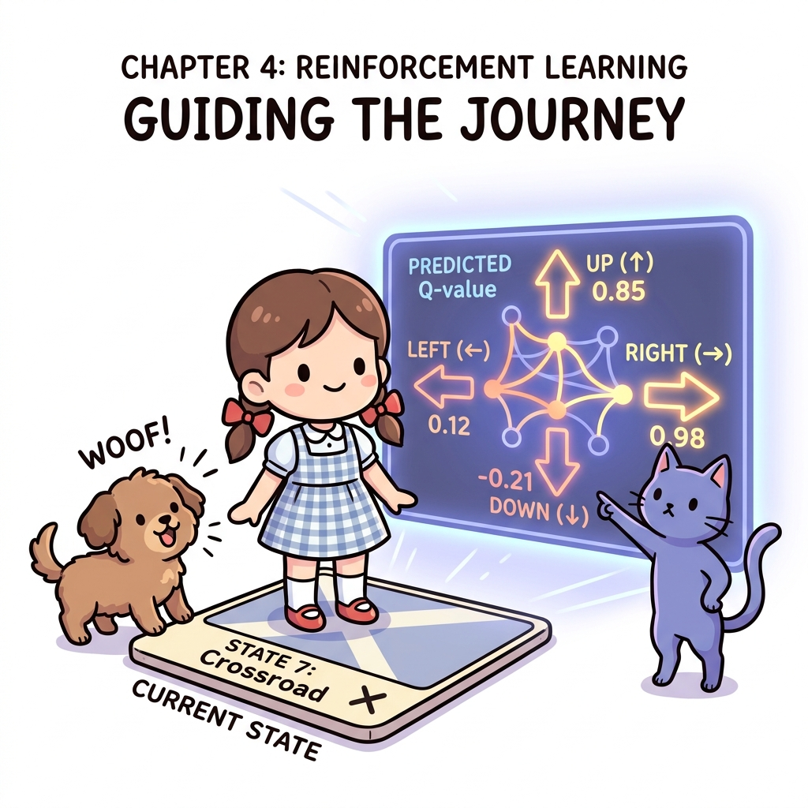
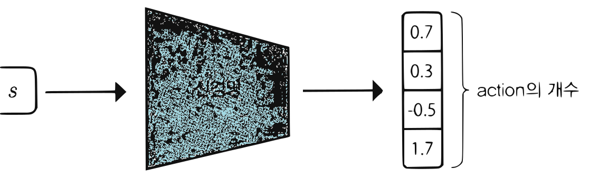
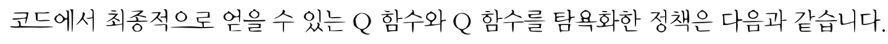
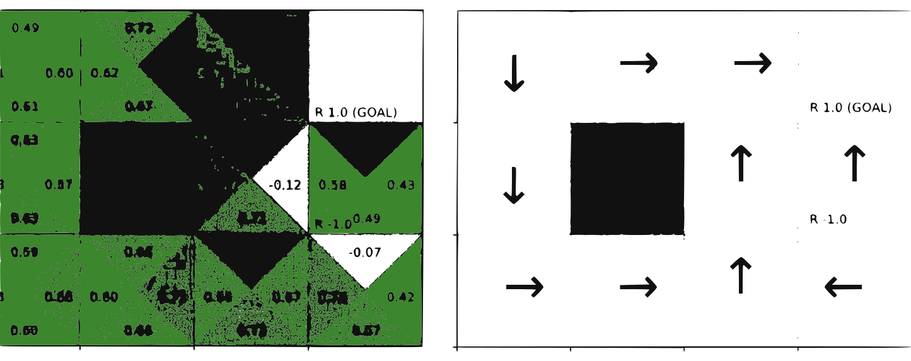

# 11.4 Q 러닝과 신경망

**그림 11-4** 현재 상태를 입력받아 각 행동 방향(상, 하, 좌, 우)의 예측 Q 가치들을 입체적으로 출력하는 마법 전광판을 확인하는 지니와 도로시


드디어 이번 장의 클라이맥스인 **신경망 기반 Q 러닝(Neural Q-learning)**을 실전 코딩으로 구현합니다. 상태(State)의 원-핫 인코딩 전처리 및 Q 함수 테이블을 뉴럴 네트워크로 대체하여, 대규모의 상태 후보를 갖는 문제에서도 무리 없이 가치를 근사해 내는 메커니즘을 도로시의 마법 전광판 점수 확인 비유로 유쾌하게 마스터해봅시다!

---

6장에서 TD법을 배웠습니다. 그중에서도 Q 러닝이라는, 강화 학습에서 가장 유명한 알고리즘을 배웠습니다. 이번 절의 주제는 Q 러닝과 신경망의 '결합'입니다. 강화 학습과 딥러닝의 결합은 지금까지 많은 혁신을 가져왔습니다. 드디어 우리도 강화 학습과 딥러닝이 만나는 세계로 발을 디딜 차례입니다. 먼저 신경망의 전처리에 대해 설명하겠습니다.

## 11.4.1 신경망의 전처리

신경망에서 '범주형 데이터'를 다룰 때는 원-핫 벡터로 변환하는 것이 일반적입니다. 범주형 데이터는 예컨대 옷 사이즈(S/M/L)나 혈액형(A/B/O/AB)처럼 범주로 묶을 수 있는 데이터입니다. 이러한 범주형 데이터는 전처리 과정에서 원-핫 벡터로 만듭니다. **원-핫 벡터**<sup>one-hot vector</sup>란 여러 원소 중 '하나만 1'이고 다른 원소는 모두 0인 벡터를 말합니다. 예를 들어 옷 사이즈 S, M, L을 차례대로 $(1, 0, 0), (0, 1, 0), (0, 0, 1)$과 같이 표현합니다.


'3x4 그리드 월드' 문제에서는 상태를 (0, 0) 또는 (2, 2) 형태로 표현합니다. 즉 에이전트의 위치를 (y, x) 형태로 표현하며, 총 12가지 좌표 중 하나에 해당하므로 '범주형 데이터'라고 할 수 있습니다. 따라서 '3x4 그리드 월드'의 상태를 전처리의 일환으로 원-핫 벡터로 변환하겠습니다. 코드는 다음과 같습니다.

```python
import numpy as np

def one_hot(state):
    # ❶ 벡터 준비
    HEIGHT, WIDTH = 3, 4
    vec = np.zeros(HEIGHT * WIDTH, dtype=np.float32)

    # ❷ state에 해당하는 원소만 1.0으로 설정
    y, x = state
    idx = WIDTH * y + x
    vec[idx] = 1.0

    # ❸ 배치 처리를 위해 새로운 축 추가
    return vec[np.newaxis, :]

state = (2, 0)
x = one_hot(state)

print(x.shape) # [출력 결과] (1, 12)
print(x)       # [출력 결과] [[0. 0. 0. 0. 0. 0. 0. 0. 1. 0. 0. 0.]]
```

`one_hot()` 함수는 state를 받아 원-핫 벡터로 변환합니다. 원리는 간단합니다. ❶ 먼저 각각의 원소를 담을 벡터를 준비합니다(모든 값을 0으로 초기화). ❷ 그런 다음 주어진 state에 해당하는 원소만 1.0으로 설정합니다. ❸ 또한 배치 처리(일괄 처리)를 가정하여 `vec[np.newaxis, :]` 코드로 새로운 축을 추가합니다. 이렇게 하면 `one_hot()` 함수가 반환하는 텐서의 형상이 $(1, 12)$가 됩니다(원래 vec의 형상은 $(12,)$였습니다).

> [!NOTE]
> 신경망에서는 데이터를 모아서 '배치'로 처리합니다. 예를 들어 100개의 데이터를 한꺼번에 처리하려면 형상이 $(100, 12)$인 데이터를 입력합니다.


## 11.4.2 Q 함수를 표현하는 신경망

앞에서 이야기했듯이 지금까지는 Q 함수를 테이블로 구현했습니다(파이썬 코드에서는 딕셔너리(defaultdict)로). 예를 들어 다음과 같은 코드입니다.

```python
from collections import defaultdict

Q = defaultdict(lambda: 0)
state = (2, 0)
action = 0

print(Q[state, action]) # [출력 결과] 0.0
```

Q는 (state, action) 쌍의 데이터를 입력받아 Q 함수의 값을 출력합니다. 즉 (state, action) 쌍의 데이터 하나하나에 대해 Q 함수의 값이 개별적으로 저장되어 있습니다.

이제 테이블로 표현된 Q 함수를 신경망으로 '변신'시켜보죠. 그러려면 먼저 신경망의 입력과 출력을 명확하게 규정해야 합니다. 후보가 몇 가지 있는데, 대표적으로 [그림 11-13]과 같은 두 가지 신경망 구조를 생각해볼 수 있습니다.

**그림 11-13** 두 가지 신경망 구조


첫 번째 구조:
입력: *s*, *a* -> 신경망 -> 출력: 스칼라 (1.7)

두 번째 구조:
입력: *s* -> 신경망 -> 출력: action의 개수 (0.7, 0.3, -0.5, 1.7)


첫 번째 구조는 상태와 행동 두 가지를 입력으로 받는 신경망입니다. 출력으로는 Q 함수의 값을 하나만 내보냅니다(일단 배치는 고려하지 않고 데이터를 하나씩만 입력하는 경우를 생각해 보죠).

두 번째 구조는 상태만을 입력받아, 가능한 행동의 개수만큼 Q 함수의 값을 출력하는 신경망입니다. 예를 들어 행동의 가짓수가 4개라면 원소 4개짜리 벡터를 출력합니다.

그런데 첫 번째 구조는 계산 비용 측면에서 문제가 있습니다. 어떤 상태에서 Q 함수의 최댓값을 구하는 계산 비용, 즉 수식으로 표현하면 $\max_a Q(s, a)$의 계산 비용이 커집니다.

> [!NOTE]
> Q 러닝에서는 $\max_a Q(s, a)$를 계산해야 합니다. 상태 *s*에서 Q 함수가 최대가 되는 행동을 찾는 계산이죠. 이 계산을 첫 번째 신경망 구조에서 수행하려면 행동 후보의 수만큼 신경망을 순전파하여 Q 함수의 값을 구해야 합니다. 행동의 수가 4개라면 순전파를 총 4번 수행하여 가능한 행동 각각에 대한 Q 함수를 구해야 하는 것이죠. 반면, 두 번째 신경망 구조에서는 모든 행동에 대한 Q 함수를 순전파 단 한 번으로 구할 수 있습니다.

그럼 (상태만을 입력받는) 두 번째 구조를 구현해봅시다. 2계층의 완전 연결 형태로 구성된 신경망으로 구현하겠습니다.

```python
from dezero import Model
import dezero.functions as F
import dezero.layers as L

class QNet(Model):
    def __init__(self):
        super().__init__()
        self.l1 = L.Linear(100) # 중간층의 크기
        self.l2 = L.Linear(4)   # 행동의 크기(가능한 행동의 개수)

    def forward(self, x):
        x = F.relu(self.l1(x))
        x = self.l2(x)
        return x

qnet = QNet()

state = (2, 0)
state = one_hot(state) # 원-핫 벡터로 변환

qs = qnet(state)
print(qs.shape) # [출력 결과] (1, 4)
```

DeZero의 방식을 따라 Model 클래스를 상속받아 신경망 모델을 구현했습니다. 초기화 시에는 필요한 계층을 생성합니다. DeZero에서는 계층 생성 시 출력 크기만 지정하면 됩니다. 지금 코드에서는 출력 크기가 각각 100과 4인 선형 변환 계층을 두 개 생성했습니다. 그리고 순전파에서 수행할 처리를 `forward()` 메서드에 작성하는데, 신경망의 주요 처리가 여기서 이루어집니다.

이것으로 Q 함수를 신경망으로 대체할 수 있게 되었습니다. 계속해서 방금 작성한 신경망을 이용하여 Q 러닝 알고리즘을 구현해보겠습니다.

## 11.4.3 신경망과 Q 러닝

먼저 Q 러닝에 대해 가볍게 복습해봅시다. 7장에서 배운 것처럼 Q 러닝에서는 다음 식을 통해 Q 함수를 갱신합니다.

$$
Q'(S_t, A_t) = Q(S_t, A_t) + \alpha \{ R_t + \gamma \max_a Q(S_{t+1}, a) - Q(S_t, A_t) \}
$$
[식 8.3]

이 식에 의해 $Q(S_t, A_t)$의 값은 목표인 $R_t + \gamma \max_a Q(S_{t+1}, a)$ 방향으로 갱신됩니다. 이때 *α*는 목표 방향으로 얼마나 나아갈 것인지를 조정합니다.

여기서 목표인 $R_t + \gamma \max_a Q(S_{t+1}, a)$를 $T$로 간소화해보죠.

$$
Q'(S_t, A_t) = Q(S_t, A_t) + \alpha \{ T - Q(S_t, A_t) \}
$$
[식 8.4]

[식 8.4]는 입력이 $S_t, A_t$일 때 출력이 $T$가 되도록 Q 함수를 갱신하는 것으로 해석할 수 있습니다. 신경망 맥락에 대입하여 표현하자면, 입력이 $S_t, A_t$일 때 출력이 $T$가 되도록 학습시킨다는 뜻입니다. 즉, $T$를 정답 레이블로 볼 수 있습니다. 또한 $T$는 스칼라값이기 때문에 회귀 문제로 생각할 수 있습니다.


이상을 바탕으로 Q 러닝을 수행하는 에이전트를 QLearningAgent라는 이름으로 구현하겠습니다. 먼저 전반부의 코드를 보시죠.

<div align="right"><b>ch07/q_learning_nn.py</b></div>

```python
class QLearningAgent:
    def __init__(self):
        self.gamma = 0.9
        self.lr = 0.01
        self.epsilon = 0.1
        self.action_size = 4

        self.qnet = QNet()                  # 신경망 초기화
        self.optimizer = optimizers.SGD(self.lr) # 옵티마이저 생성
        self.optimizer.setup(self.qnet)     # 옵티마이저에 신경망 등록

    def get_action(self, state):
        if np.random.rand() < self.epsilon:
            return np.random.choice(self.action_size)
        else:
            qs = self.qnet(state)
            return qs.data.argmax()
```

먼저 클래스를 초기화할 때 신경망과 옵티마이저를 초기화합니다. 그리고 옵티마이저에 신경망을 연결합니다.

`get_action()` 메서드에서는 $\varepsilon$-탐욕 정책에 따라 행동을 선택합니다. 즉 $\varepsilon$의 확률로 무작위 행동을 선택하고, 그 외에는 Q 함수가 최대가 되는 행동을 선택합니다. 참고로 `get_action(self, state)`의 state로는 원-핫 벡터로 변환된 상태가 입력된다고 가정합니다.

다음은 QLearningAgent의 나머지 코드입니다.

<div align="right"><b>ch07/q_learning_nn.py</b></div>

```python
class QLearningAgent:
    ...

    def update(self, state, action, reward, next_state, done):
        # ❶ 다음 상태에서 최대가 되는 Q 함수의 값(next_q) 계산
        if done: # ❷ 목표 상태에 도달
            next_q = np.zeros(1) # ❸ [0.] (목표 상태에서의 Q 함수는 항상 0)
        else:    # # 그 외 상태
            next_qs = self.qnet(next_state)
            next_q = next_qs.max(axis=1)
        next_q.unchain() # ❹ next_q를 역전파 대상에서 제외

        # ❺ 목표
        target = self.gamma * next_q + reward
        # ❻ 현재 상태에서의 Q 함수 값(q) 계산
        qs = self.qnet(state)
        q = qs[:, action]
        # ❼ 목표(target)와 q의 오차 계산
        loss = F.mean_squared_error(target, q)

        # ❽ 역전파 -> 매개변수 갱신
        self.qnet.cleargrads()
        loss.backward()
        self.optimizer.update()

        return loss.data
```

`update()` 메서드에서는 Q 함수를 갱신합니다. ❶ 먼저 다음 상태에서 최대가 되는 Q 함수의 값(next_q)을 구합니다. ❷ 다만 done = True일 경우, 즉 next_state가 목표 상태라면 next_state에서의 Q 함수는 항상 0입니다. ❸ 그래서 next_q를 0으로 설정합니다(정확히는 `np.zeros(1)`로 설정).

> [!NOTE]
> next_q는 정답 레이블을 만들기 위해 사용됩니다. 지도 학습에서는 정답 레이블에 대한 기울기는 필요 없기 때문에 ❹ `next_q.unchain()`을 수행하여 역전파의 대상에서 next_q를 제외합니다(unchain은 '사슬을 풀다'라는 뜻입니다). 이렇게 하면 next_q는 단순한 숫자 타입이 됩니다. 그래서 나중에 역전파를 수행해도 next_q와 관련된 기울기 계산이 이루어지지 않습니다. 불필요한 계산을 생략하는 것이죠.

이어서 ❺ 목표(target)를 구하고 ❻ 현재 상태에서의 Q 함수(q)를 구합니다. ❼ 그리고 손실 함수로 target과 q의 평균 제곱 오차를 구합니다. 마지막으로 DeZero의 방식에 따라 ❽ 역전파를 수행하여 매개변수를 갱신합니다.

참고로 앞의 코드에서는 target 계산에 쓰이는 next_q의 값을 if문에서 설정했습니다. 그런데 if문을 사용하지 않고 다음과처럼 구현할 수도 있습니다.

```python
class QLearningAgent:
    ...
    def update(self, state, action, reward, next_state, done):
        done = int(done) # ❶ 0 or 1
        next_qs = self.qnet(next_state)
        next_q = next_qs.max(axis=1)
        next_q.unchain()
        # 기존 코드: target = self.gamma * next_q + reward
        target = reward + (1 - done) * self.gamma * next_q # ❷

        ...
```

파이썬에서 bool 타입을 int 타입으로 변환하면 True는 1로, False는 0으로 바뀝니다. ❶ 그래서 `done = int(done)` 코드를 써서 숫자 타입으로 변환한 다음 ❷ `(1 - done)` 형태로 계산식에 바로 응용할 수 있습니다. 이 코드는 다음 장에서 미니배치로 학습할 때 유용하게 활용됩니다.

이상이 QLearningAgent 클래스의 코드입니다. 이제 에이전트를 실행해봅시다.

<div align="right"><b>ch07/q_learning_nn.py</b></div>

```python
env = GridWorld()
agent = QLearningAgent()

episodes = 1000 # 에피소드 수
loss_history = []

for episode in range(episodes):
    state = env.reset()
    state = one_hot(state)
    total_loss, cnt = 0, 0
    done = False

    while not done:
        action = agent.get_action(state)
        next_state, reward, done = env.step(action)
        next_state = one_hot(next_state)

        loss = agent.update(state, action, reward, next_state, done)
        total_loss += loss
        cnt += 1
        state = next_state

    average_loss = total_loss / cnt
    loss_history.append(average_loss)
```


에피소드 수를 1000회로 설정하고 에피소드별 평균 손실을 기록했습니다. 결과는 [그림 11-14]와 같습니다.

**그림 11-14** 에피소드별 손실 추이



신경망을 이용한 강화 학습에서는 학습 시 손실이 안정되게 나오지 않는 경우가 많습니다. [그림 11-14]도 변화의 폭이 큽니다. 그렇더라도 큰 틀에서 보면 에피소드를 거듭할수록 손실이 작아지고 있음을 알 수 있습니다.

앞의 코드에서 최종적으로 얻을 수 있는 Q 함수와 Q 함수를 탐욕화한 정책은 다음과 같습니다.

**그림 11-15** 신경망을 이용한 Q 러닝으로 얻은 Q 함수와 정책




실행할 때마다 다르지만 대체로 좋은 결과를 얻을 수 있습니다. [그림 11-15]는 완전한 최적 정책은 아니지만 에피소드 횟수를 늘리면 최적 정책에 가까운 정책을 안정적으로 얻을 수 있습니다.

이상으로 신경망을 이용한 Q 러닝 구현을 마칩니다.

