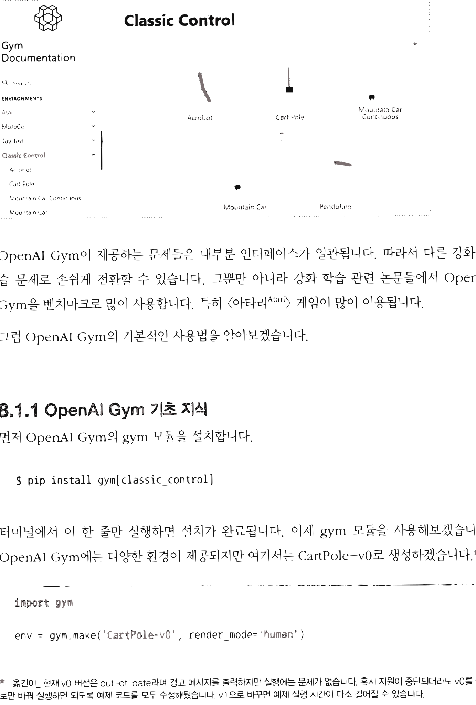
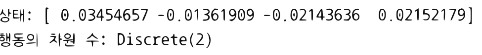
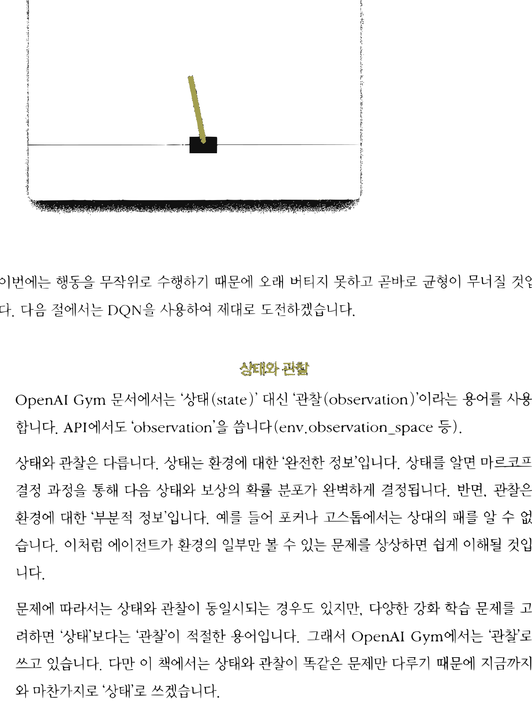

# 12.1 OpenAI Gym

**그림 12-1** 카트 폴(Cart Pole) 막대의 균형을 잡기 위해 실시간으로 좌우 조작을 연습해 보는 도로시와 지니


기존 격자 세상을 벗어나 물리엔진 기반 강화학습 실습 표준 도구인 **OpenAI Gym** 라이브러리의 구조와 사용법을 배웁니다. 수레 위 막대를 쓰러뜨리지 않고 똑바로 세우는 CartPole 게임 환경에서 상태 변수들을 실시간으로 관찰하고, 무작위 행동을 가하는 랜덤 에이전트를 요정 지니와 함께 구현해봅시다!

---

OpenAI Gym은 오픈소스 라이브러리입니다. [그림 12-1]과 같이 다양한 강화 학습 문제(환경)를 제공합니다.


**그림 12-1** OpenAI Gym<sup>[9]</sup>의 문제 목록 화면



OpenAI Gym이 제공하는 문제들은 대부분 인터페이스가 일관됩니다. 따라서 다른 강화 학습 문제로 손쉽게 전환할 수 있습니다. 그뿐만 아니라 강화 학습 관련 논문들에서 OpenAI Gym을 벤치마크로 많이 사용합니다. 특히 \<아타리<sup>Atari</sup>\> 게임이 많이 이용됩니다.

그럼 OpenAI Gym의 기본적인 사용법을 알아보겠습니다.

## 12.1.1 OpenAI Gym 기초 지식

먼저 OpenAI Gym의 `gym` 모듈을 설치합니다.

```bash
pip install gym[classic_control]
```

터미널에서 이 한 줄만 실행하면 설치가 완료됩니다. 이제 `gym` 모듈을 사용해보겠습니다. OpenAI Gym에는 다양한 환경이 제공되지만 여기서는 CartPole-v0로 생성하겠습니다.<sup>*</sup>

```python
import gym

env = gym.make('CartPole-v0', render_mode='human')
```

---
<sup>*</sup> **옮긴이** 현재 v0 버전은 out-of-date라며 경고 메시지를 출력하지만 실행에는 문제가 없습니다. 혹시 지원이 중단되더라도 v0를 v1으로만 바꿔 실행하면 되도록 예제 코드를 모두 수정해뒀습니다. v1으로 바꾸면 예제 실행 시간이 다소 길어질 수 있습니다.


\<카트 폴\>이라는 문제 환경이 생성되었습니다. 환경 생성 시 render_mode를 'human'으로 설정하면 [그림 12-2]와 같은 플레이 화면을 보여줍니다(화면 출력을 원하지 않으면 'rgb_array'로 설정).

**그림 12-2** \<카트 폴\> 화면 구성


막대(폴), 카트

그림과 같이 카트를 좌우로 움직여 막대(폴)의 균형을 잡는 '균형 잡기' 게임입니다. 막대가 넘어지거나(일정 각도 이상 기울어지거나) 카트가 정해진 범위를 벗어나면 실패입니다.

> [!NOTE]
> \<카트 폴\>에는 버전 0(CartPole-v0)과 버전 1(CartPole-v1)이 있습니다. 버전 0은 200단계 동안 균형을 유지하면 성공이고 버전 1은 500단계까지 버텨야 합니다.

앞의 코드에 이어서 다음 코드를 실행해보죠.

```python
state = env.reset()[0] # 상태 초기화
print('상태:', state)

action_space = env.action_space
print('행동의 차원 수:', action_space)
```

**출력 결과**
```text
상태: [ 0.03454657 -0.01361909 -0.02143636  0.02152179]
행동의 차원 수: Discrete(2)
```


`state = env.reset()[0]` 코드로 초기 '상태'를 얻습니다. `env.reset()` 메서드는 환경을 초기화한 후 상태와 기타 정보를 담은 배열을 반환합니다. 이 배열의 0번째 원소가 상태 정보입니다. 출력 결과를 보면 state는 원소가 네 개인 배열임을 알 수 있습니다. 참고로 각 원소는 차례대로 다음을 뜻합니다.

* 카트의 위치
* 카트의 속도
* 막대의 각도
* 막대의 각속도(회전 속도)

또한 행동 공간의 크기(취할 수 있는 행동의 개수)는 `env.action_space`를 보면 알 수 있습니다. 이를 출력해보면 Discrete(2)라는 클래스의 인스턴스입니다. 출력 결과로부터 행동의 후보가 두 가지임을 알 수 있습니다. 0은 카트를 왼쪽으로, 1은 오른쪽으로 움직이는 행동을 뜻합니다.

이제 실제로 카트를 움직여 시간을 한 단계만큼 보내겠습니다.

```python
action = 0 # 혹은 1
next_state, reward, terminated, truncated, info = env.step(action)
print(next_state)
```

**출력 결과**
```text
[ 0.03454657 -0.01361909 -0.02143636  0.02152179]
```

이와 같이 `env.step(action)` 메서드로 행동을 취합니다. 결과로는 다음 다섯 가지 정보를 얻습니다.

* next_state: 다음 상태(OpenAI Gym 문서에서는 'observation')
* reward: 보상
* terminated: 목표 상태 도달 여부
* truncated: MDP 범위 밖의 종료 조건 충족 여부(시간 초과 등)
* info: 추가 정보


보상 reward는 float 타입의 스칼라값입니다. \<카트 폴\>에서는 균형이 유지되는 동안에는 보상이 항상 1입니다.

terminated는 목표 상태에 도달했는지 여부를, truncated는 시간 초과처럼 MDP에서 정의하지 않은, 이번 문제만의 특수한 종료 조건이 충족됐는지 여부를 알려줍니다. \<카트 폴\>에서는 정확하게 다음 상황에서 True를 반환합니다.

* terminated: 막대 각도가 12도 초과(균형 잃음) 혹은 카트가 화면을 벗어남
* truncated: 행동 200회 초과(CartPole-v1에서는 500회)

마지막으로 info에는 디버깅에 유용한 정보가 담겨 있습니다(환경 모델 등). 강화 학습 알고리즘을 구현하고 평가할 때는 기본적으로 info는 사용하지 않습니다.

이상으로 OpenAI Gym을 다루는 데 필요한 지식은 모두 정리했습니다.

## 12.1.2 랜덤 에이전트

이제 코드를 하나로 묶어 움직여봅시다. 먼저 무작위로 행동하는 에이전트를 가정하여 1회분의 에피소드를 구동해보겠습니다.

<div align="right"><b>ch08/gym_play.py</b></div>

```python
import numpy as np
import gym

env = gym.make('CartPole-v0', render_mode='human')
state = env.reset()[0]
done = False

while not done: # 에피소드가 끝날 때까지 반복
    env.render() # 진행 과정 시각화
    action = np.random.choice([0, 1]) # 행동 선택(무작위)
    next_state, reward, terminated, truncated, info = env.step(action)
    done = terminated | truncated    # 둘 중 하나만 True면 에피소드 종료
env.close()
```

while문을 사용하여 에피소드가 끝날 때까지 행동을 계속하며, 행동은 0 또는 1을 무작위로 선택합니다. 또한 OpenAI Gym에서는 `env.render()`를 호출하여 문제의 진행 과정을 시각화할 수 있습니다. \<카트 폴\>은 다음과 같은 창이 생성됩니다.


**그림 12-3** \<카트 폴\> 렌더링(시각화)



이번에는 행동을 무작위로 수행하기 때문에 오래 버티지 못하고 곧바로 균형이 무너질 것입니다. 다음 절에서는 DQN을 사용하여 제대로 도전하겠습니다.

<div align="center">
<b>상태와 관찰</b>
</div>

OpenAI Gym 문서에서는 '상태(state)' 대신 '관찰(observation)'이라는 용어를 사용합니다. API에서도 'observation'을 씁니다(env.observation_space 등).

상태와 관찰은 다릅니다. 상태는 환경에 대한 '완전한 정보'입니다. 상태를 알면 마르코프 결정 과정을 통해 다음 상태와 보상의 확률 분포가 완벽하게 결정됩니다. 반면, 관찰은 환경에 대한 '부분적 정보'입니다. 예를 들어 포커나 고스톱에서는 상대의 패를 알 수 없습니다. 이처럼 에이전트가 환경의 일부만 볼 수 있는 문제를 상상하면 쉽게 이해될 것입니다.

문제에 따라서는 상태와 관찰이 동일시되는 경우도 있지만, 다양한 강화 학습 문제를 고려하면 '상태'보다는 '관찰'이 적절한 용어입니다. 그래서 OpenAI Gym에서는 '관찰'로 쓰고 있습니다. 다만 이 책에서는 상태와 관찰이 똑같은 문제만 다루기 때문에 지금까지와 마찬가지로 '상태'로 쓰겠습니다.


