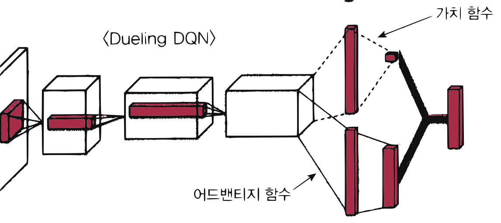
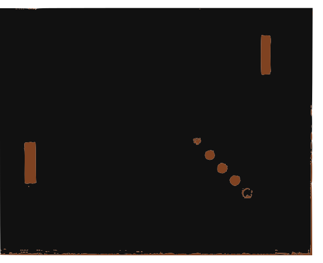

# 12.4 DQN 확장

**그림 12-4** Q1/Q2로 과대평가를 잡는 더블 DQN과 특정 징검다리를 우대하는 우선순위 Replay 기법을 칠판에 적어주는 지니

DQN 성능을 뛰어넘는 대표적인 3가지 확장 기법인 **Double DQN**, **우선순위 경험 재생(PER)**, **Dueling DQN**의 핵심 동작 원리를 공부합니다. 과대평가 편향 방지, 경험 리플레이의 가중 탐색, 상태 가치와 행동 이득(Advantage) 분리의 신비한 계산 구조를 지니 요정과 도로시의 최적 탐색 비유를 통해 넓은 안목으로 바라봅시다!

---

DQN은 딥러닝에서 가장 유명한 알고리즘에 속합니다. 그래서 DQN을 발전시킨 기법도 수없이 연구되고 제안되었죠. 이번 절에서는 그중 유명한 기법 세 가지를 소개하겠습니다.

## 12.4.1 Double DQN

첫 번째 기법은 Double DQN[13]입니다. 설명에 앞서 DQN을 잠시 복습해보죠. DQN에서는 '목표 신경망'이라는 기법을 사용합니다. 원본 신경망 외에 매개변수가 다른 신경망(목표 신경망)을 하나 더 사용하는 것이죠. 두 신경망의 매개변수를 각각 *θ*와 $\theta'$라고 하고, 두 신경망에 의해 표현되는 Q 함수를 $Q_{\theta}(s, a)$와 $Q_{\theta'}(s, a)$라고 합시다. 이때 Q 함수 갱신에 사용하는 목표는 다음 식으로 표현됩니다.

$$R_t + \gamma \max_a Q_{\theta'}(S_{t+1}, a)$$

DQN에서는 $Q_{\theta}(s, a)$의 값을 이 식의 값과 가까워지게 학습하는데 이를 'TD 목표'라고 합니다. 여기서 문제가 되는 부분은 $\max_a Q_{\theta'}(S_{t+1}, a)$입니다. 즉, 오차가 포함된 추정치($Q_{\theta'}$)에 max 연산을 수행하면 실제 Q 함수를 사용해 계산할 때보다 과대적합되는 문제가 생깁니다. 이 문제를 해결한 것이 Double DQN입니다. Double DQN에서는 다음 식을 TD 목표로 삼습니다.

$$R_t + \gamma Q_{\theta'}(S_{t+1}, \operatorname{argmax}_a Q_{\theta}(S_{t+1}, a))$$

핵심은 $Q_{\theta}(s, a)$를 사용하여 최대가 되는 행동을 선택하고 실제 값은 $Q_{\theta'}(s, a)$에서 구하는 것입니다. 이렇게 두 개의 Q 함수를 구분하여 사용하기 때문에 과대적합이 사라지고 학습이 더 안정적으로 이루어집니다. 과대적합이 구체적으로 무엇인지, 어떤 원리로 해소되는지는 부록 C에서 설명하고 있으니 관심 있는 분은 참고하기 바랍니다.

## 12.4.2 우선순위 경험 재생(PER)

DQN에서 사용되는 경험 재생은 경험 $E_t = (S_t, A_t, R_t, S_{t+1})$을 버퍼에 저장하고, 학습 시 버퍼에서 경험 데이터를 무작위로 추출하여 사용합니다. 이를 더욱 발전시킨 것이 **우선순위 경험 재생**prioritized experience replay[14](PER)입니다. 경험 데이터를 무작위로 선택하는 대신 이름 그대로 우선순위에 따라 선택되도록 한 기법입니다.

그렇다면 경험 데이터의 우선순위는 어떻게 정할까요? 자연스럽게 떠올릴 수 있는 방식은 다음 공식입니다.

$$\delta_t = \left| R_t + \gamma \max_a Q_{\theta'}(S_{t+1}, a) - Q_{\theta}(S_t, A_t) \right|$$

이 식과 같이 TD 목표인 $R_t + \gamma \max_a Q_{\theta'}(S_{t+1}, a)$와 $Q_{\theta}(S_t, A_t)$의 차이를 구하여 그 절댓값을 $\delta_t$로 합니다($\delta$는 '델타'로 발음합니다). 이때 $\delta_t$가 크면 그만큼 수정할 것이 많다는, 즉 배워야 할 게 많다는 뜻입니다. 반대로 $\delta_t$가 작으면 이미 좋은 매개변수이고 배울 것이 적다는 뜻입니다.

우선순위 경험 재생에서는 $\delta_t$까지를 경험 데이터에 포함시켜 $(S_t, A_t, R_t, S_{t+1}, \delta_t)$를 버퍼에 추가합니다. 그런 다음 버퍼에서 경험 데이터를 꺼낼 때 $\delta_t$를 이용하여 각 경험 데이터가 선택될 확률을 구합니다. 예를 들어 버퍼에 담긴 경험 데이터가 $N$개라면, $i$번째 경험 데이터가 선택될 확률은 다음 식으로 표현됩니다.

$$p_i = \frac{\delta_i}{\sum_{k=1}^{N} \delta_k}$$

이 확률 $p_i$에 따라 버퍼에서 경험 데이터를 추출합니다. 우선순위 경험 재생을 사용하면 배울 게 많은 데이터일수록 우선적으로 사용되기 때문에 학습이 더 빨리 진행되리라 기대할 수 있습니다.

## 12.4.3 Dueling DQN

마지막으로 Dueling DQN[15] 기법을 소개합니다. Dueling DQN은 신경망의 구조를 개선한 기법입니다. 이 기법에서 핵심은 어드밴티지 함수입니다. **어드밴티지 함수**advantage function는 Q 함수와 가치 함수의 차이이며 수식으로는 다음과 같습니다.

$$A_{\pi}(s, a) = Q_{\pi}(s, a) - V_{\pi}(s) \tag{식 8.1}$$

[식 9.1]의 어드밴티지 함수는 *a*라는 행동이 정책 *π*에 따라 행동할 때보다 얼마나 좋은지(혹은 나쁜지)를 나타냅니다. 어떻게 이런 의미가 되는지는 오른쪽 두 항의 의미가 다음과 같음을 생각하면 어렵지 않게 이해될 것입니다.

* $Q_{\pi}(s, a)$: 상태 *s*에서 '특정 행동 *a*'를 취하고 그 이후에는 *π*에 따라 행동했을 때 얻을 수 있는 기대 수익
* $V_{\pi}(s)$: 상태 *s*에서 이후의 모든 행동을 정책 *π*에 따라 했을 때 얻을 수 있는 기대 수익

즉 $Q_{\pi}(s, a)$와 $V_{\pi}(s)$의 차이는 상태 *s*에서 행동 *a*를 할 것인가, 아니면 정책 *π*에 따라 행동할 것인가의 차이입니다. 다시 말해 어드밴티지 함수는 '*a*라는 행동이' '정책 *π*에 따라 선택되는 행동'보다 얼마나 이로운지를 나타내는 지표로 해석할 수 있습니다.

또한 어드밴티지 함수를 다음과 같이 변형하면 Q 함수를 구할 수 있습니다.

$$Q_{\pi}(s, a) = A_{\pi}(s, a) + V_{\pi}(s) \tag{식 8.2}$$

Dueling DQN은 [식 9.2]를 신경망으로 표현하는데, 그 구조는 [그림 12-13]과 같습니다.

**그림 12-13** DQN(위)과 Dueling DQN(아래) 비교*

\<DQN\>
\<Dueling DQN\> - 가치 함수, 어드밴티지 함수

\* **그림 출처**: Wang, Ziyu, et al. "Dueling network architectures for deep reinforcement learning." International conference on machine learning. PMLR, 2016.

그림과 같이 중간까지는 똑같이 진행하다가 Dueling DQN에서는 어드밴티지 함수 $A(s, a)$와 가치 함수 $V(s)$로 분기합니다. 그리고 마지막으로 두 분기를 다시 합쳐 $Q(s, a)$를 출력합니다. 이 구조가 Dueling DQN의 특징입니다.

그렇다면 어드밴티지 함수와 가치 함수를 분기하여 학습하면 어떤 점이 좋아질까요? 주로 무슨 행동을 선택해도 결과가 달라지지 않는 상황에서는 이점이 생깁니다. 예를 들어 \<퐁\> 게임을 플레이하다가 [그림 12-14]와 같은 상황이 되었다고 상상해봅시다.

**그림 12-14** 공이 플레이어 진영에 진입하기 직전의 화면

이 상황에서는 어떤 행동을 해도 결과는 패배(마이너스 보상)입니다. DQN의 경우 어떤 상태 *s*에서 실제로 한 행동 *a*에 대해 $Q(s, a)$를 학습합니다. 그런데 지금의 예처럼 결과가 확정된 상황이라도 모든 행동을 시도해보지 않으면 $Q(s, a)$가 학습되지 않습니다. 반면 Dueling DQN은 한쪽 분기에서 가치 함수 $V(s)$를 경유합니다. 가치 함수는 어떤 상태 *s*에서의 가치로, 행동은 전혀 고려하지 않지요. 따라서 이 그림의 상태를 경험하면 $V(s)$가 학습되어 다른 행동을 시도하지 않아도 $Q(s, a)$의 근사 성능이 좋아집니다. 이런 특성 덕분에 학습이 빨라지리라 기대할 수 있습니다.

이상으로 DQN의 확장 기법 세 가지를 소개했습니다. 참고로 10.3절에서는 DQN을 기반으로 한 더욱 발전된 알고리즘을 몇 가지 더 소개합니다.

