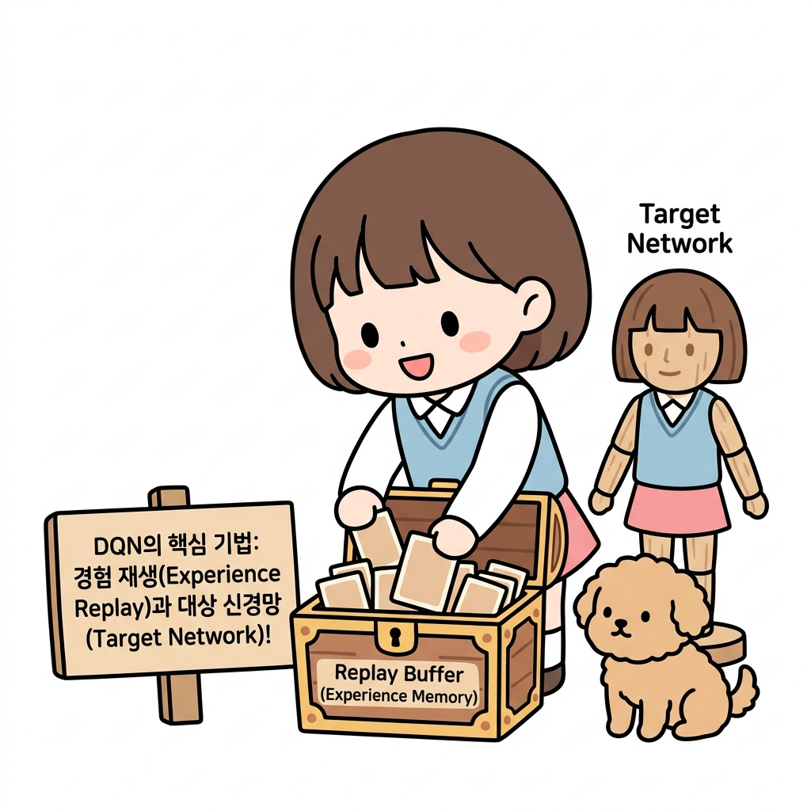

<b>CHAPTER 12</b>

# DQN

**그림 12-0** 과거 모험 카드상자(Replay Buffer)에서 모은 경험을 토대로 메인/타깃 모니터를 대조 갱신하는 지니와 도로시

---

> **도로시와 토토의 비유로 이해하기**:
> 도로시는 과거 모험의 기록 카드들이 가득 찬 보물 상자(Replay Buffer)에서 무작위로 카드를 꺼내 복습하며 학습(경험 재생)합니다. 한편으로는 학습이 한쪽으로 치우쳐 춤추지 않도록, 기준을 잡아줄 도로시 마네킹 인형(Target Network)을 세워두고 비교 갱신합니다. 이 두 가지가 합쳐져 딥마인드의 전설적인 DQN이 탄생했습니다!

이번 장의 주제는 DQN입니다. DQNDeep Q Network은 Q 러닝과 신경망을 이용한 기법입니다. 지난 11장에서 Q 러닝과 신경망을 결합하는 방법을 배웠는데, DQN은 여기에 새로운 기술인 '경험 재생'과 '목표 신경망'을 더한 것입니다. 이번 장에서는 이 기술들에 대해 알아본 다음, 코드로 구현하여 효과까지 검증해보겠습니다. 나아가 DQN을 확장한 기법인 'Double DQN', '우선순위 경험 재생', 'Dueling DQN'도 소개합니다.

DQN은 비디오 게임과 같은 복잡한 문제도 훌륭하게 해결합니다. 그 덕분에 지금의 딥러닝 붐이 시작되었죠. 이런 점에서 DQN은 딥러닝 분야의 기념비적인 연구라고 할 수 있습니다. DQN이 처음 발표된 건 2013년입니다. 벌써 세월이 꽤 흘렀지만 지금도 DQN을 기반으로 한 방법론이 활발하게 제안되고 있을 만큼 DQN은 여전히 중요한 알고리즘입니다.

또한 이번 장부터는 이전까지의 '그리드 월드'에서 벗어나 좀 더 실용적인 문제를 다룹니다. OpenAI Gym 라이브러리가 제공하는 \<카트 폴Cart Pole\>이 그 주인공입니다.
