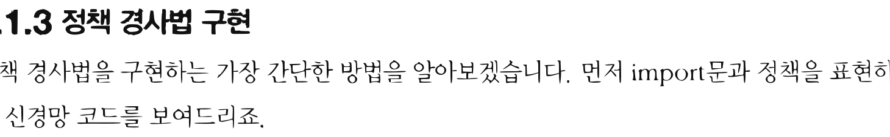
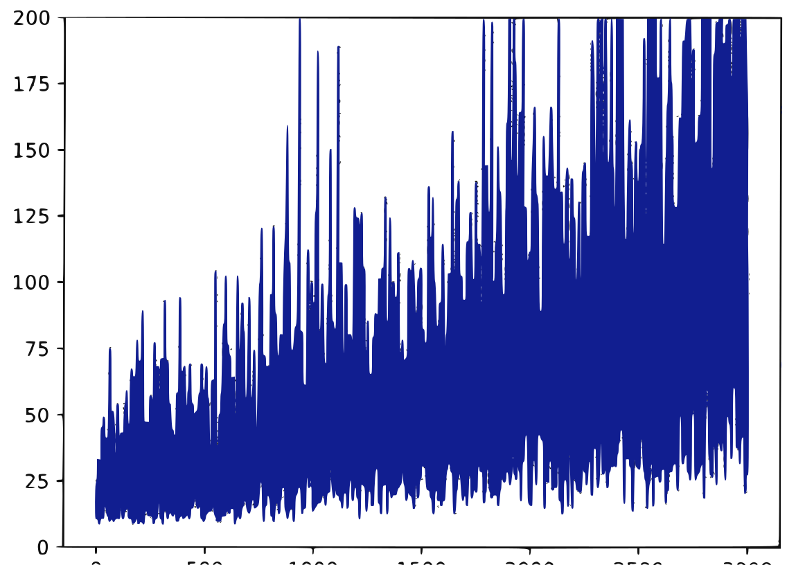
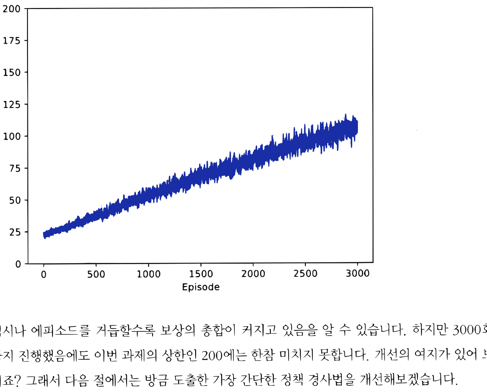

# 13.1 가장 간단한 정책 경사법

**그림 13-1** 완만하게 솟아오른 정책의 경사로 위를 밝게 걸어가며 기울기(Gradient) 방향을 체크하는 도로시와 지니


정책 함수 자체의 매개변수를 직접 경사(기울기)를 이용해 갱신하는 **정책 경사법(Policy Gradient)**의 기본적인 원리와 수치 유도 방법을 공부합니다. 상태와 행동의 결합 확률적 전이를 설명하는 미분 공식을 통해 가장 간단한 형태의 정책 경사 알고리즘을 지니 요정과 함께 차근차근 유도해 봅시다!

---

정책 경사법은 경사, 즉 기울기를 이용하여 정책을 갱신하는 기법들의 총칭입니다. 정책 경사법 기반의 알고리즘은 여러 가지가 있지만 이번 절에서는 가장 간단한 정책 경사법을 도출해보


겠습니다. 그리고 다음 절부터는 이번에 배운 기법을 토대로 조금씩 개선하면서 새로운 기법들을 소개할 것입니다.

## 13.1.1 정책 경사법 도출

확률적 정책은 수식으로 $\pi(a|s)$로 표현합니다. $\pi(a|s)$는 상태 *s*에서 *a*라는 행동을 취할 확률입니다. 이번 장에서는 정책을 신경망으로 모델링합니다. 이를 위해 신경망의 가중치 매개변수 전체를 *θ* 기호로 집약하여 표현하기로 하죠. *θ*는 모든 매개변수의 원소들을 한 줄로 나열한 벡터입니다. 그리고 신경망으로 구현한 정책을 $\pi_{\theta}(a|s)$로 표현하겠습니다.

다음으로 정책 $\pi_{\theta}$를 이용하여 목적 함수를 설정합니다. 목적 함수를 설정하면 이후 목적 함수의 값을 가장 크게 만드는 매개변수 *θ*를 찾아야 합니다. 이 일이 '최적화'라고 불리는 작업이며 일반적인 신경망 학습 과정을 말합니다.

> [!NOTE]
> 최적화 문제를 풀 때 이번 장에서는 일반적으로 쓰이는 손실 함수 대신 목적 함수를 설정합니다. 손실 함수는 경사 하강법으로 최솟값을 찾습니다. 반면 목적 함수는 경사 상승법으로 최댓값을 찾습니다. 경사 하강법은 기울기에 마이너스를 곱한 방향으로, 경사 상승법은 플러스를 곱한 방향으로 매개변수를 갱신합니다. 단, 목적 함수에 마이너스를 붙이면 손실 함수로 취급할 수 있으므로(반대도 마찬가지) 손실 함수와 목적 함수는 본질적으로 같은 역할을 합니다.

그럼 정책 $\pi_{\theta}$를 사용하여 목적 함수를 설정해보겠습니다. 먼저 문제 설정을 명확히 합시다. 일회성 과제이고 행동은 정책 $\pi_{\theta}$에 따라 선택한다고 해보죠. 그리고 매 행동의 결과로 다음과 같이 '상태, 행동, 보상'으로 구성된 시계열 데이터를 얻었다고 가정합니다.

$$\tau = (S_0, A_0, R_0, S_1, A_1, R_1, \cdots, S_{T+1})$$

$\tau$(타우)는 **궤적**<sup>trajectory</sup>; 경로를 뜻합니다. 이때 수익은 할인율을 이용하여 다음 식으로 표현할 수 있습니다.

$$G(\tau) = R_0 + \gamma R_1 + \gamma^2 R_2 + \cdots + \gamma^T R_T$$


수익을 $\tau$로부터 계산할 수 있음을 명시하기 위해 $G(\tau)$로 표기했습니다. 이때 목적 함수 $J(\theta)$는 다음 식으로 표현됩니다.

$$J(\theta) = \mathbb{E}_{\tau \sim \pi_{\theta}} [G(\tau)]$$

수익 $G(\tau)$는 확률적으로 변하기 때문에 그 기댓값이 목적 함수가 됩니다. 지금 식에서 기댓값 $\mathbb{E}$의 첨자로 '$\tau \sim \pi_{\theta}$'가 붙어 있습니다. 시계열 데이터 $\tau$가 정책 $\pi_{\theta}$로부터 생성됨을 뜻하는 표기 방식입니다.

> [!NOTE]
> $\tau$의 생성 과정에는 에이전트의 정책 외에도 환경의 상태 전이 확률 $p(s'|s, a)$와 보상 함수 $r(s, a, s')$도 관여합니다. 그러나 우리가 통제할 수 있는 요인은 에이전트의 정책뿐입니다. 그래서 $\mathbb{E}_{\tau \sim \pi_{\theta}} [\cdots]$와 같이 '$\tau \sim \pi_{\theta}$'로만 표기하기로 합니다.

목적 함수가 정해지면 다음으로 그 기울기를 구합니다. 매개변수 *θ*에 대한 기울기를 $\nabla_{\theta}$로 표현합니다. 우리의 목표는 $\nabla_{\theta} J(\theta)$를 구하는 것이고 결과는 [식 10.1]입니다. 도출 과정은 부록 D.1절에서 설명하니 관심 있는 분은 참고하기 바랍니다.

$$\begin{aligned}
\nabla_{\theta} J(\theta) &= \nabla_{\theta} \mathbb{E}_{\tau \sim \pi_{\theta}} [G(\tau)] \\
&= \mathbb{E}_{\tau \sim \pi_{\theta}} \left[ \sum_{t=0}^{T} G(\tau) \nabla_{\theta} \log \pi_{\theta} (A_t | S_t) \right]
\end{aligned} \tag{식 9.1}$$

이 식에서 주목할 점은 $\nabla_{\theta}$가 $\mathbb{E}$ 안에 들어있다는 점인데(기울기 계산은 $\nabla_{\theta} \log \pi_{\theta} (A_t | S_t)$로 이루어집니다) 이와 관련해서는 바로 뒤에서 자세히 살펴보겠습니다.

$\nabla_{\theta} J(\theta)$가 구해지면 이어서 신경망의 매개변수를 갱신합니다. 적용할 수 있는 최적화 방법은 다양하며, 경사 상승법에 따른 간단한 방법을 다음 식으로 표현할 수 있습니다.

$$\theta \leftarrow \theta + \alpha \nabla_{\theta} J(\theta)$$

이 식과 같이 매개변수 *θ*를 기울기 방향으로 *α*만큼 갱신합니다. 여기서 *α*는 학습률입니다.


## 13.1.2 정책 경사법 알고리즘

$\nabla_{\theta} J(\theta)$는 [식 10.1]과 같이 기댓값으로 표현됩니다. 이 기댓값은 몬테카를로법으로 구할 수 있습니다. 몬테카를로법은 샘플링을 여러 번 하여 평균을 구하는 방법입니다. 에이전트를 정책 $\pi_{\theta}$에 따라 실제로 행동하게 하여 $n$개의 궤적 $\tau$를 얻었다고 가정하죠. 이때 각 $\tau$에서 기댓값, 즉 [식 10.1]의 내용$(\sum_{t=0}^T G(\tau) \nabla_{\theta} \log \pi_{\theta}(A_t | S_t))$을 계산하고 평균을 구하면 $\nabla_{\theta} J(\theta)$를 근사할 수 있습니다. 수식으로는 다음과 같이 표현됩니다.

$$\begin{aligned}
&\text{샘플링: } \tau^{(i)} \sim \pi_{\theta} \quad (i = 1, 2, \cdots, n) \\
&x^{(i)} = \sum_{t=0}^{T} G(\tau^{(i)}) \nabla_{\theta} \log \pi_{\theta} (A_t^{(i)} | S_t^{(i)}) \\
&\nabla_{\theta} J(\theta) \simeq \frac{x^{(1)} + x^{(2)} + \cdots + x^{(n)}}{n}
\end{aligned}$$

이 식에서 $i$번째 에피소드에서 얻은 궤적을 $\tau^{(i)}$, $i$번째 에피소드의 시간 *t*에서의 행동을 $A_t^{(i)}$, 상태를 $S_t^{(i)}$로 표현했습니다.

참고로 몬테카를로법의 샘플 수가 1개일 때, 즉 앞의 식에서 $n=1$일 때를 생각해보시다. 이런 경우는 다음과 같이 단순화할 수 있습니다.

$$\begin{aligned}
&\text{샘플링: } \tau \sim \pi_{\theta} \\
&\nabla_{\theta} J(\theta) \simeq \sum_{t=0}^T G(\tau) \nabla_{\theta} \log \pi_{\theta} (A_t | S_t) \tag{식 9.2}
\end{aligned}$$

이번 장에서는 원리를 이해하기 쉽도록 [식 10.2]를 대상으로 한 정책 경사법을 다룰 것입니다. [식 10.2]는 $\nabla_{\theta} \log \pi_{\theta} (A_t | S_t)$를 모든 시간($t=0 \sim T$)에서 구하고, 각 기울기에 수익 $G(\tau)$를 '가중치'로 곱하여 모두 더합니다. 이 계산 과정을 시각화하면 [그림 13-1]과 같습니다.


**그림 13-1** 정책 경사법으로 계산하는 과정


$G(\tau) \nabla_{\theta} \log \pi_{\theta}(A_0|S_0) + G(\tau) \nabla_{\theta} \log \pi_{\theta}(A_1|S_1) + \cdots + G(\tau) \nabla_{\theta} \log \pi_{\theta}(A_T|S_T)$

이제 [그림 13-1]에서 수행하는 계산의 '의미'를 생각해봅시다. 우선 $\log$의 미분으로 다음의 식이 성립합니다.

$$\nabla_{\theta} \log \pi_{\theta}(A_t | S_t) = \frac{\nabla_{\theta} \pi_{\theta}(A_t | S_t)}{\pi_{\theta}(A_t | S_t)}$$

이 식과 같이 $\nabla_{\theta} \log \pi_{\theta}(A_t | S_t)$는 $\nabla_{\theta} \pi_{\theta}(A_t | S_t)$라는 기울기(벡터)에 $\frac{1}{\pi_{\theta}(A_t | S_t)}$을 곱한 것입니다. 이로부터 $\nabla_{\theta} \log \pi_{\theta}(A_t | S_t)$와 $\nabla_{\theta} \pi_{\theta}(A_t | S_t)$는 같은 방향을 가리킨다는 사실을 알 수 있습니다. $\nabla_{\theta} \pi_{\theta}(A_t | S_t)$는 상태 *S*<sub>*t*</sub>에서 행동 *A*<sub>*t*</sub>를 취할 확률이 가장 높아지는 방향을 가리킵니다. 마찬가지로 $\nabla_{\theta} \log \pi_{\theta}(A_t | S_t)$도 상태 *S*<sub>*t*</sub>에서 행동 *A*<sub>*t*</sub>를 취할 확률이 가장 높아지는 방향을 가리키죠. 그 방향에 대해 식 $G(\tau) \nabla_{\theta} \log \pi_{\theta}(A_t | S_t)$와 같이 $G(\tau)$라는 '가중치'가 곱해집니다.

예를 들어 에이전트가 수익 $G(\tau)$로 100을 얻었다고 해보죠. 그렇다면 수익을 얻도록 해준 직전 행동이 더 잘 선택되도록 기울기를 조절해야 하니, 가중치를 100만큼 주어 강화한다는 뜻입니다. 즉, 선택의 결과가 좋았다면 그만큼 직전 행동을 강화한다는 뜻입니다. 반대로 좋지 않은 선택에 대해서는 직전 행동을 그만큼 약화시킵니다.

## 13.1.3 정책 경사법 구현

정책 경사법을 구현하는 가장 간단한 방법을 알아보겠습니다. 먼저 import문과 정책을 표현하는 신경망 코드를 보여드리죠.


<div align="right"><b>ch09/simple_pg.py</b></div>

```python
import numpy as np
import gym
from dezero import Model
from dezero import optimizers
import dezero.functions as F
import dezero.layers as L

class Policy(Model):
    def __init__(self, action_size):
        super().__init__()
        self.l1 = L.Linear(128) # # 첫 번째 계층
        self.l2 = L.Linear(action_size) # # 두 번째 계층

    def forward(self, x):
        x = F.relu(self.l1(x)) # # 첫 번째 계층에서는 ReLU 함수 사용
        x = F.softmax(self.l2(x)) # # 두 번째 계층에서는 소프트맥스 함수 사용
        return x
```

정책 신경망을 2층의 완전 연결 모델로 구현했습니다. 최종 출력의 원소 수는 행동의 수(`action_size`)로 설정합니다. 최종 출력은 소프트맥스 함수의 출력이므로 결국 각 행동의 '확률'을 얻을 수 있습니다.

> [!NOTE]
> 소프트맥스 함수에 원소 $n$개짜리 벡터를 입력하면 마찬가지로 원소 $n$개짜리 벡터를 출력합니다. 이때 $i$번째 출력 $y_i$는 다음 식으로 표현됩니다.
>
> $$y_i = \frac{e^{x_i}}{\sum_{k=1}^n e^{x_k}}$$
>
> 여기서 $e$는 자연로그의 밑(2.71828...로 이어지는 실수)입니다. 소프트맥스 함수의 출력값은 0 이상 1 이하의 실수이며 모두 더하면 항상 1이 됩니다($\sum_{i=1}^n y_i = 1$). 그래서 소프트맥스 함수의 출력은 '확률'로 사용할 수 있습니다.

다음은 Agent 클래스 차례입니다. 먼저 초기화 메서드와 `get_action()` 메서드를 보겠습니다.

<div align="right"><b>ch09/simple_pg.py</b></div>

```python
class Agent:
    def __init__(self):
        self.gamma = 0.98
        self.lr = 0.0002
        self.action_size = 2

        self.memory = []
        self.pi = Policy(self.action_size)
        self.optimizer = optimizers.Adam(self.lr)
        self.optimizer.setup(self.pi)

    def get_action(self, state):
        state = state[np.newaxis, :] # # 배치 처리용 축 추가
        probs = self.pi(state)       # # 순전파 수행
        probs = probs[0]
        action = np.random.choice(len(probs), p=probs.data) # # 행동 선택
        return action, probs[action] # # 선택된 행동과 확률 반환
```

`get_action()` 메서드는 상태 `state`에서의 행동을 결정합니다. 이를 위해 `self.pi(state)`로 신경망의 순전파를 수행하여 확률 분포 `probs`를 얻습니다. 그런 다음 이 확률 분포에 따라 하나의 행동을 샘플링합니다. 그리고 선택된 행동과 함께 그 행동의 확률도 반환합니다(지금 코드에서는 `probs[action]`).

이제 `get_action()` 메서드를 사용해봅시다.

```python
env = gym.make('CartPole-v0', render_mode='rgb_array')
state = env.reset()
agent = Agent()

action, prob = agent.get_action(state)
print('행동:', action)
print('확률:', prob)

G = 100.0 # # 더미 가중치
J = G * F.log(prob)
print('J:', J)

# # 기울기 구하기
J.backward()
```

**출력 결과**
```text
행동: 1
확률: variable(0.49956715)
J: variable(-69.4013237953186)
```


이 코드는 초기 상태에서의 행동과 그 확률을 출력합니다. 또한 더미 가중치를 적용하여 다음 식으로 표현되는 기울기를 구하는 코드도 보여줍니다([식 10.2]에서 $t=0$일 때의 항을 추출한 식입니다).

$$G(\tau) \nabla_{\theta} \log \pi_{\theta}(A_0 | S_0)$$

참고로 이 코드에 등장하는 변수들은 각각 다음 수식에 해당합니다.

* `prob` (Dezero.Variable) : $\pi_{\theta}(A_0 | S_0)$
* `G` (float) : $G(\tau)$
* `J` (Dezero.Variable) : $G(\tau) \log \pi_{\theta}(A_0 | S_0)$

J가 구해지면 `J.backward()`를 실행하여 $G(\tau) \nabla_{\theta} \log \pi_{\theta}(A_0 | S_0)$을 구합니다.

이어서 Agent 클래스의 나머지 코드를 보겠습니다.

<div align="right"><b>ch09/simple_pg.py</b></div>

```python
class Agent:
    ...

    def add(self, reward, prob):
        data = (reward, prob)
        self.memory.append(data)

    def update(self):
        self.pi.cleargrads()

        G, loss = 0, 0
        for reward, prob in reversed(self.memory): # # 수익 G 계산
            G = reward + self.gamma * G

        for reward, prob in self.memory: # # 손실 함수 계산
            loss += -F.log(prob) * G

        loss.backward()
        self.optimizer.update()
        self.memory = [] # # 메모리 초기화
```


`add()` 메서드는 에이전트가 행동을 취해 보상을 얻을 때마다 호출됩니다. 이 메서드에서는 보상(reward)과 에이전트가 취한 행동의 확률(prob)을 메모리(`self.memory`)에 저장합니다.

`update()` 메서드는 에이전트가 목표에 도달했을 때 호출됩니다. 먼저 수익 G를 계산합니다. 수익은 획득한 보상을 역방향으로 추적하면 효율적으로 계산할 수 있습니다(원리는 5.2.3절 참고). 그런 다음 손실 함수를 계산합니다. 각 시간에서의 `-F.log(prob)`를 구하고 가중치로 G를 곱하여 모두 더하면 됩니다. 나머지는 일반적인 신경망 학습과 같습니다.

> [!CAUTION]
> 신경망 학습에서는 보통 손실 함수를 이용합니다. 손실 함수를 설정하려면 목적 함수 $J(\theta)$에 마이너스를 곱하여 $-J(\theta)$로 바꿔주면 됩니다. $-J(\theta)$를 손실 함수로 쓴다면 경사 하강법용의 다양한 최적화 기법(SGD, Adam 등)을 활용하여 매개변수를 갱신할 수 있습니다.

마지막으로 에이전트를 \<카트 폴\> 환경에서 동작시켜봅시다.

```python
episodes = 3000
env = gym.make('CartPole-v0', render_mode='rgb_array')
agent = Agent()
reward_history = []

for episode in range(episodes):
    state = env.reset()[0]
    done = False
    total_reward = 0

    while not done:
        action, prob = agent.get_action(state) # # 행동 선택
        # # 행동 수행
        next_state, reward, terminated, truncated, info = env.step(action)
        done = terminated | truncated

        agent.add(reward, prob) # # ❶ 보상과 행동의 확률을 에이전트에 추가
        state = next_state      # # 상태 전이
        total_reward += reward  # # 보상 총합 계산

    agent.update() # # ❷ 정책 갱신
    reward_history.append(total_reward)
```


익숙한 코드입니다. while문 안에서 ❶ 에이전트가 받은 보상(reward)과 그 보상을 얻게 해준 행동의 확률(prob)을 에이전트에 추가합니다. 그리고 while문을 빠져나오면(에피소드가 끝나면) ❷ agent.update()를 호출해 정책을 갱신합니다.

이 코드를 실행하면 에피소드가 늘어날수록 보상도 늘어납니다. 결과를 그래프로 그리면 다음과 같습니다.

**그림 13-2** 에피소드별 보상 합계 추이



[그림 13-2]에서 볼 수 있듯이 비록 변동은 크지만 에피소드가 진행됨에 따라 결과가 점차 나아집니다. 하지만 단 한 번의 실험 결과이기 때문에 아직 신뢰하기는 어렵습니다. 그래서 같은 실험을 100번 반복하여 평균한 결과를 보겠습니다.


**그림 13-3** 100번의 실험을 평균한 결과



역시나 에피소드를 거듭할수록 보상의 총합이 커지고 있음을 알 수 있습니다. 하지만 3000회까지 진행했음에도 이번 과제의 상한인 200에는 한참 미치지 못합니다. 개선의 여지가 있어 보이죠? 그래서 다음 절에서는 방금 도출한 가장 간단한 정책 경사법을 개선해보겠습니다.

