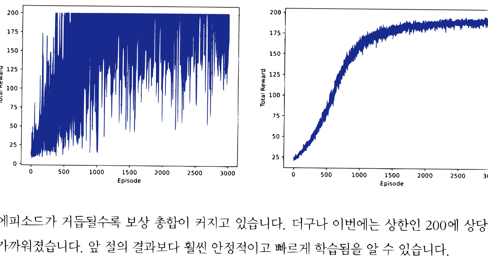

# 13.2 REINFORCE

**그림 13-2** 몬테카를로 샘플 에피소드 전체의 반환값을 기반으로 정책 가중치를 직접 업데이트하는 도로시와 지니


    에피소드 전체의 실제 수익 $G_t$를 정책 경사에 반영하여 실용적인 갱신을 가능하게 하는 **REINFORCE(레인포스)** 알고리즘을 공부합니다. 까다로운 상태 확률 분포 $d(s)$를 몬테카를로법을 사용해 시원하게 소거하고, 에이전트의 성공적인 경험 확률을 쑥쑥 키우는 최적 정책 계산법을 지니와 함께 구현해봅시다!

---

REINFORCE<sup>[16]</sup>는 앞 절의 정책 경사법을 개선한 기법입니다. 먼저 수식으로 REINFORCE 알고리즘을 도출한 다음, 앞 절의 코드를 일부 수정하는 형태로 구현까지 해보겠습니다.

> [!NOTE]
> REINFORCE라는 이름은 '**RE**ward **I**ncrement = **N**onnegative **F**actor $\times$ **O**ffset **R**einforcement $\times$ **C**haracteristic **E**ligibility'의 머리글자를 따서 지었습니다.


## 13.2.1 REINFORCE 알고리즘

앞 절의 내용을 복습해보죠. 가장 간단한 정책 경사법은 [식 10.1]에 따라 구현됩니다.

$$\nabla_{\theta} J(\theta) = \mathbb{E}_{\tau \sim \pi_{\theta}} \left[ \sum_{t=0}^{T} G(\tau) \nabla_{\theta} \log \pi_{\theta} (A_t | S_t) \right] \tag{식 9.1}$$

[식 10.1]의 $G(\tau)$는 지금까지 얻은 모든 보상의 총합입니다(정확히는 '할인율을 적용한' 보상의 총합). 여기서 생각해볼 문제가 있습니다. $G(\tau) \nabla_{\theta} \log \pi_{\theta} (A_t | S_t)$ 부분을 보면, 특정 시간 *t*에서 행동 *A*<sub>*t*</sub>를 선택할 확률에 '항상 일정한' 가중치 $G(\tau)$를 적용하고 있습니다.

그런데 좋은 행동인지 나쁜 행동인지는 그 행동 '이후에' 얻는 보상의 총합으로 평가됩니다(가치 함수의 정의를 떠올려보세요). 행동 '전에' 얻은 보상은 그 행동의 좋고 나쁨과 무관합니다. 예를 들어 특정 시간 *t*에 취한 행동 *A*<sub>*t*</sub>를 평가할 때는 그 이전에 무엇을 했고 보상을 얼마나 얻었는지는 중요하지 않습니다. 행동 *A*<sub>*t*</sub>를 하고 난 후 어떤 결과가 나오느냐에 따라, 즉 시간 *t* 이후에 얻는 보상의 총합에 따라 행동 *A*<sub>*t*</sub>의 좋고 나쁨이 결정됩니다.

[식 10.1]에서 행동 *A*<sub>*t*</sub>에 대한 가중치는 $G(\tau)$입니다. 이 가중치에는 시간 *t* 이전의 보상도 포함됩니다. 본질적으로 관련이 없는 보상이 노이즈로 섞여 있다는 뜻입니다. 이 노이즈를 제거하기 위해 가중치 $G(\tau)$를 다음과 같이 변경할 수 있습니다.

$$\begin{aligned}
&\nabla_{\theta} J(\theta) = \mathbb{E}_{\tau \sim \pi_{\theta}} \left[ \sum_{t=0}^{T} G_t \nabla_{\theta} \log \pi_{\theta} (A_t | S_t) \right] \tag{식 9.3} \\
&G_t = R_t + \gamma R_{t+1} + \cdots \gamma^{T-t} R_T
\end{aligned}$$

이와 같이 가중치를 *G*<sub>*t*</sub>로 변경했습니다. 가중치 *G*<sub>*t*</sub>는 시간 $t \sim T$ 동안에 얻는 보상의 총합입니다. 이제 시간 *t* 앞의 보상은 포함하지 않는 가중치 *G*<sub>*t*</sub>를 써서 행동 *A*<sub>*t*</sub>가 선택될 확률을 강화할 수 있습니다. 이것이 앞 절의 정책 경사법을 개선하는 아이디어입니다.

[식 10.3]에 기반한 알고리즘을 REINFORCE라고 합니다. 이 책에서는 [식 10.3]이 성립함을 증명하지는 않습니다. 증명에 관심 있는 분은 다른 문헌<sup>[17], [18]</sup>을 참고하기 바랍니다.


> [!NOTE]
> [식 10.3]에 기반한 알고리즘인 REINFORCE는 가장 간단한 정책 경사법([식 10.1]에 기반한 알고리즘)보다 우수합니다. [식 10.1]과 [식 10.3] 모두 샘플 수를 무한히 늘리면 정확한 $\nabla_{\theta} J(\theta)$에 수렴합니다('편향이 없다'고 표현할 수 있죠). 반면 샘플이 흩어진 정도인 '분산'은 [식 10.1]이 더 큽니다. [식 10.1]의 가중치에는 관련 없는 데이터(노이즈)가 섞여 있기 때문입니다.

## 13.2.2 REINFORCE 구현

REINFORCE는 분산이 작기 때문에 데이터 샘플이 적더라도 더 정확하게 근사할 수 있습니다. 실제로 구현하여 얼마나 정확한지 검증해보죠. REINFORCE의 코드는 앞 절의 코드와 거의 같습니다. 다른 점은 Agent 클래스의 `update()` 메서드뿐입니다. 그럼 무엇이 다른지 함께 보겠습니다.

<div align="right"><b>ch09/reinforce.py</b></div>

```python
class Agent:
    ...

    def update(self):
        self.pi.cleargrads()

        G, loss = 0, 0
        for reward, prob in reversed(self.memory): # # 수익 G 계산
            G = reward + self.gamma * G
            loss += -F.log(prob) * G             # # 손실 함수 계산

        loss.backward()
        self.optimizer.update()
        self.memory = []
```

`update()` 메서드는 에이전트가 목표에 도달했을 때 호출된다고 했습니다. `self.memory`는 리스트이며, 에이전트가 얻은 보상(reward)과 행동의 확률(prob)을 순서대로 담고 있습니다. 이번 코드에서는 `self.memory`의 원소들을 뒤쪽부터 거꾸로 따라가면서 각 시각의 G를 구해 손실 함수를 바로 갱신합니다.

이제 REINFORCE를 실행해보죠. 코드를 한 번만 실행했을 때와 100번을 평균한 그래프를 함께 보겠습니다.


**그림 13-4** 에피소드별 보상 합계 추이(왼쪽은 1회 실행 시, 오른쪽은 100회 평균)



에피소드가 거듭될수록 보상 총합이 커지고 있습니다. 더구나 이번에는 상한인 200에 상당히 가까워졌습니다. 앞 절의 결과보다 훨씬 안정적이고 빠르게 학습됨을 알 수 있습니다.

