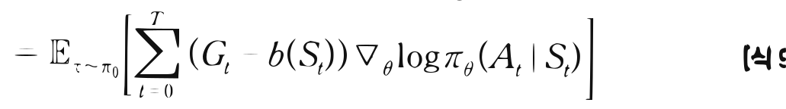

# 13.3 베이스라인

**그림 13-3** 평균적인 보상 기준선(Baseline)을 칠판에 긋고 이보다 잘한 모험 행동의 강도를 선별적으로 높이는 지니와 도로시


정책 경사법의 치명적 한계인 큰 분산(Variance) 문제를 극복하기 위한 **베이스라인(Baseline)** 도입 원리를 배웁니다. 매 에피소드마다 획득한 보상에서 평균적인 가치 기준선 $b(s)$를 감산해 줌으로써 양의 보상 쏠림을 해결하고 학습을 고도로 안정화하는 분산 저감 공식을 지니와 함께 유도해봅시다!

---

다음으로 REINFORCE를 개선하는 **베이스라인**<sup>baseline</sup> 기술을 소개합니다. 먼저 간단한 예를 들어 아이디어를 설명하고 이어서 REINFORCE에 베이스라인을 적용해보겠습니다.

## 13.3.1 베이스라인 아이디어

A, B, C라는 세 사람이 시험을 치렀고 각각 90점, 40점, 50점을 받았습니다.

**그림 13-5** 세 명의 시험 성적

| | |
|---|---|
| A | 90 |
| B | 40 |
| C | 50 |

시험 성적의 분산을 구해보죠. 넘파이를 사용하면 다음과 같이 구할 수 있습니다.


```python
import numpy as np

x = np.array([90, 40, 50])
print(np.var(x))
```

**출력 결과**
```text
466.6666666666667
```

결과에서 보듯이 시험 성적의 분산은 466.6666666666667로, 큰 값입니다. 분산은 '데이터의 흩어진 정도'를 나타내므로 점수의 편차가 심하다는 뜻입니다. 이 분산을 줄일 방법을 생각해봅시다.

이전 시험 성적들을 이용해볼 수 있습니다. 예를 들어 지금까지의 시험 성적이 [그림 13-6]과 같았다고 해보죠.

**그림 13-6** 세 명의 이전 시험 성적

| | 첫 번째 시험 | 두 번째 시험 | ... | 열 번째 시험 |
|---|---|---|---|---|
| A | 92 | 80 | ... | 74 |
| B | 32 | 51 | ... | 56 |
| C | 45 | 53 | ... | 49 |

이와 같이 이전 시험들의 성적이 주어지면 다음 시험의 점수를 예측할 수 있습니다. 간단한 방법으로는 이전 시험들의 평균을 내는 방법이 있습니다. 다음 시험 성적은 지금까지의 평균과 같을 거라고 예측하는 것입니다.

[그림 13-6]의 결과를 각각 평균하면 A는 82점, B는 46점, C는 49점이라고 가정해봅시다. 이를 '예측값'으로 사용하여 다음 시험의 실제 결과와 얼마나 차이가 나는지 보겠습니다.


**그림 13-7** 실제 결과와 예측값의 차이


실제 결과 - 과거 성적의 평균(예측값) = 차이
A: 90 - A: 82 = A: 8
B: 40 - B: 46 = B: -6
C: 50 - C: 49 = C: 1

이제 [그림 13-7]의 차이에서 분산을 구해봅시다.

```python
x = np.array([90, 40, 50])

avg = np.array([82, 46, 49])
diff = x - avg # [8, -6, 1]
print(np.var(diff))
```

**출력 결과**
```text
32.666666666666664
```

분산은 32.666...으로 처음과 비교하면 정말 많이 줄었습니다. 이 예에서 알 수 있듯이 어떤 결과에서 예측값을 빼면 분산을 줄일 수 있습니다. 예측값의 정확도가 높을수록 분산은 작아집니다. 이것이 바로 베이스라인 기법의 아이디어입니다. 지금 예에서는 평균을 베이스라인으로 이용했습니다.

다음 절에서는 베이스라인을 REINFORCE에 적용하겠습니다.

## 13.3.2 베이스라인을 적용한 정책 경사법

REINFORCE는 [식 10.3]으로 표현됩니다. 여기에 베이스라인을 적용하면 [식 10.4]가 됩니다.

$$\begin{aligned}
\nabla_{\theta} J(\theta) &= \mathbb{E}_{\tau \sim \pi_{\theta}} \left[ \sum_{t=0}^{T} G_t \nabla_{\theta} \log \pi_{\theta} (A_t | S_t) \right] \tag{식 9.3} \\
&= \mathbb{E}_{\tau \sim \pi_{\theta}} \left[ \sum_{t=0}^{T} (G_t - b(S_t)) \nabla_{\theta} \log \pi_{\theta} (A_t | S_t) \right] \tag{식 9.4}
\end{aligned}$$


[식 10.4]에서는 *G*<sub>*t*</sub> 대신 $G_t - b(S_t)$를 사용했습니다. 여기서 $b(S_t)$는 임의의 함수입니다. 즉, $b(S_t)$라는 함수는 입력이 *S*<sub>*t*</sub>이기만 하면 어떤 함수라도 상관없다는 뜻입니다. 이 $b(S_t)$가 베이스라인입니다.

> [!NOTE]
> [식 10.3]에서 [식 10.4]로의 변형이 성립한다는 증명은 부록 D.2절에서 다룹니다. 관심 있는 분은 참고하기 바랍니다.

예를 들어 상태 *S*<sub>*t*</sub>에서 지금까지 얻은 보상의 평균을 $b(S_t)$로 사용할 수 있습니다. 앞 절의 시험 성적 예가 여기에 해당하죠. 그리고 실무에서는 가치 함수를 많이 사용합니다. 수식으로 쓰면 $b(S_t) = V_{\pi_{\theta}} (S_t)$가 되죠. 베이스라인을 적용하여 분산을 줄일 수 있다면 학습 시 샘플 효율이 좋아집니다.

참고로 베이스라인으로 가치 함수를 사용하면 실제 가치 함수 $V_{\pi_{\theta}} (S_t)$를 알 수 없습니다. 이 경우 가치 함수에 대해서도 학습해야 합니다.

마지막으로 베이스라인을 사용하는 이유를 직관적으로 보여주는 설명을 덧붙이겠습니다. \<카트 폴\>에서 [그림 13-8]처럼 막대가 균형을 잃은 상태를 생각해봅시다.

**그림 13-8** 막대가 균형을 잃은 상태


막대가 균형을 잃어 게임이 끝나기 직전입니다.<sup>\*</sup> 이 상태에서는 어떤 행동을 선택하든 몇 단계 후에 게임이 종료됩니다.

그림의 상태를 *s*, 이 상태에서의 행동을 *a*라고 하죠. 그리고 상태 *s*에서 몇 단계 후, 예를 들어 3단계 후에는 반드시 게임이 끝난다고 가정합시다. 그러면 상태 *s*에서의 수익은 3이 됩니다(할인율 *γ*를 1로 가정).

---
\* OpenAI Gym의 \<카트 폴\>은 12도만 기울어도 게임이 끝나지만 여기서는 이론을 설명하기 위해 막대가 바닥에 완전히 닿아야 끝난다고 가정하겠습니다.


이 조건에서 기본적인 REINFORCE라면, 상태 *s*에서 행동 *a*는 가중치 3만큼 강화됩니다(상태 *s*에서 행동 *a*가 선택될 확률이 커짐). 하지만 어떤 행동을 하든 3단계 후에는 반드시 게임이 끝나기 때문에 행동 *a*가 선택될 확률을 높이는 건 아무런 의미가 없는 일입니다.

이때 베이스라인이 등장합니다. 베이스라인으로 가치 함수를 사용하고 [그림 13-8]의 예에서 $V_{\pi_{\theta}} (s) = 3$임을 알고 있다고 가정하죠(실제로는 몬테카를로법이나 TD법 등으로 학습하여 추정해야 합니다). 그렇다면 가중치는 $G - V_{\pi_{\theta}}$이므로 결국 0입니다. 가중치가 0이므로 어떤 행동을 선택하든 그 행동이 선택될 확률은 커지지도 작아지지도 않습니다. 이처럼 베이스라인을 적용하면 학습 과정에서의 낭비를 줄일 수 있습니다.

