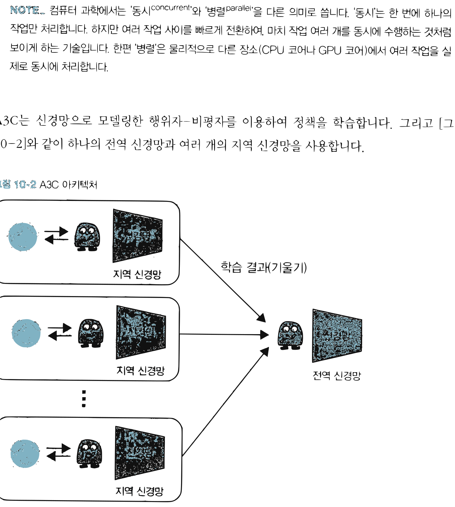
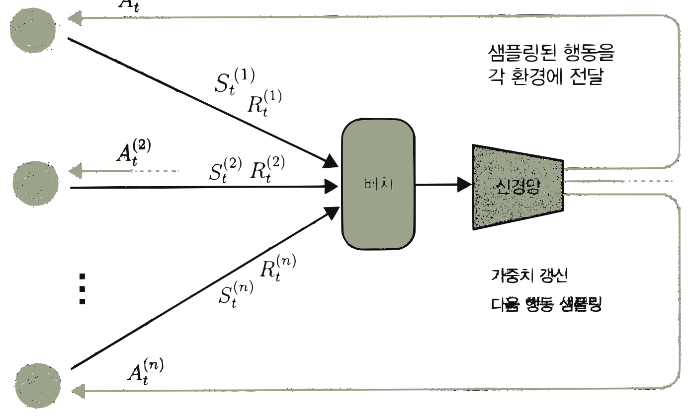
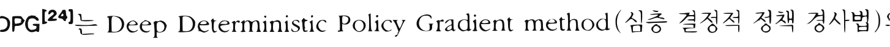
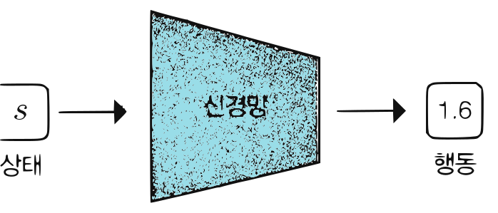

# 14.2 정책 경사법 계열의 고급 알고리즘

**그림 14-2** 비동기적으로 분산 학습을 전개하는 A3C/A2C 요원 인형들과 도로시의 학습 지휘선

정책 경사법의 이론적 한계를 보완해 실용화 수준을 획기적으로 끌어올린 고급 알고리즘들을 살펴봅니다. 여러 CPU 환경에서 독립적으로 탐색하는 비동기 분산형 학습 방식인 **A3C/A2C**, 연속 행동 공간을 장악한 오프-정책의 대표 주자 **DDPG**, 그리고 신뢰 영역 제한을 두어 정책 갱신폭을 조절하는 **TRPO/PPO**의 원리를 지니와 함께 비교 분석해 봅시다!

---

9장에서는 REINFORCE와 행위자-비평자 등의 정책 경사법 알고리즘에 대해 설명했습니다. 이번 절에서는 같은 계열에서 더욱 고도화된 알고리즘들을 소개합니다. 소개할 알고리즘은 다음과 같습니다.

* A3C, A2C (분산 학습 알고리즘)
* DDPG (결정적 정책을 따르는 알고리즘)
* TRPO, PPO (목적 함수에 제약을 추가하는 알고리즘)

알고리즘의 특징에 따라 이와 같이 세 그룹으로 나눴습니다. A3C와 A2C부터 만나보겠습니다.

## 14.2.1 A3C, A2C

A3C[23]는 'Asynchronous Advantage Actor-Critic'의 약자입니다. 이름에 A가 세 개, C가 한 개여서 A3C라고 하죠. A3C의 특징은 Asynchronous, 즉 '비동기'라는 점입니다. 여기서 말하는 비동기란 여러 에이전트가 병렬로 행동하며 비동기적으로 매개변수를 갱신한다는 뜻입니다.

> [!NOTE]
> 컴퓨터 과학에서는 '동시concurrent'와 '병렬parallel'을 다른 의미로 씁니다. '동시'는 한 번에 하나의 작업만 처리합니다. 하지만 여러 작업 사이를 빠르게 전환하여, 마치 작업 여러 개를 동시에 수행하는 것처럼 보이게 하는 기술입니다. 한편 '병렬'은 물리적으로 다른 장소(CPU 코어나 GPU 코어)에서 여러 작업을 실제로 동시에 처리합니다.

A3C는 신경망으로 모델링한 행위자-비평자를 이용하여 정책을 학습합니다. 그리고 [그림 14-2]와 같이 하나의 전역 신경망과 여러 개의 지역 신경망을 사용합니다.

**그림 14-2** A3C 아키텍처

지역 신경망 -> 학습 결과(기울기) -> 전역 신경망

지역 신경망은 각자의 환경에서 독립적으로 플레이하며 학습합니다. 그리고 학습 결과인 기울기를 전역 신경망에 보냅니다. 전역 신경망은 여러 지역 신경망에서 보내온 기울기를 이용해 비동기적으로 가중치 매개변수를 갱신합니다. 이렇게 전역 신경망의 가중치 매개변수를 갱신하는 동안 주기적으로 전역 신경망과 지역 신경망의 가중치 매개변수를 동기화합니다.

A3C의 장점은 여러 에이전트를 병렬로 행동하게 하여 학습 속도를 높인다는 것입니다. 게다가 에이전트들이 독립적으로 행동(탐색)하기 때문에 한층 다양한 데이터를 얻을 수 있습니다. 그 덕분에 학습 데이터의 전체적인 상관관계를 약화시킬 수 있어 학습이 더욱 안정적으로 이루어집니다.

> [!NOTE]
> DQN에서는 학습 데이터의 상관관계를 약화시키기 위해 경험 재생 기법을 사용했습니다. 경험 재생은 경험 데이터를 버퍼에 저장해두고, 거기서 무작위로 여러 개를 골라내는 기법입니다. 하지만 경험 재생은 온-정책 방식으로는 사용할 수 없습니다. 메모리 사용량과 계산량이 커진다는 것도 단점입니다.

병렬 처리는 온-정책 방식에서도 사용할 수 있는 범용 아이디어입니다. 여러 에이전트를 병렬로 움직여 (경험 재생에 의존하지 않고도) 데이터의 상관관계를 약화시킬 수 있죠. 실제로 A3C 논문 발표 이후 많은 연구에서 병렬 처리가 유행처럼 번지고 있습니다.

또한 A3C의 행위자-비평자는 신경망의 가중치를 공유합니다. [그림 14-3]과 같이 하나의 신경망에서 가중치를 공유하여 정책과 가치 함수를 출력합니다. 정책과 가치 함수 모두 입력에 가까운 층은 가중치가 비슷할 것이라서 이처럼 신경망 사이에 매개변수를 공유하는 구조가 효과가 있습니다.

**그림 14-3** A3C의 신경망 구조

상태 S -> Conv -> ReLU -> Conv -> ReLU ->
  - Linear -> Softmax -> $\pi(a|s)$ 정책
  - Linear -> $V_{\pi}(s)$ 가치 함수

다음으로 A2C[23]를 보겠습니다. A2C는 매개변수를 (비동기가 아니라) 동기식으로 갱신합니다. A3C에서 첫 번째 A(Asynchronous)가 빠진 이름이죠. A2C는 [그림 14-4]와 같은 구성으로 구현할 수 있습니다.

**그림 14-4** A2C 아키텍처

각 환경에서 실행
상태 $S_t^{(i)}$, 보상 $R_t^{(i)}$ -> 배치 -> 신경망 -> 가중치 갱신, 다음 행동 샘플링 -> 샘플링된 행동을 각 환경에 전달 $A_t^{(i)}$

그림과 같이 각각의 환경에서 에이전트가 독립적으로 동작합니다. 따라서 시간 *t*에서의 상태는 환경마다 다릅니다. 그리고 시간 *t*에서 각 환경의 상태를 (동기화하여) 배치로 묶어 신경망을 학습시킵니다. 이때 신경망의 출력(정책의 확률 분포)에서 다음 행동을 샘플링하며, 샘플링된 행동을 각 환경에 전달합니다.

실험 결과 A2C 방식의 동기식 갱신 성능도 A3C보다 떨어지지 않았습니다. 그런데 구현하기는 A2C가 더 쉽고 GPU 같은 컴퓨트 자원을 더 효율적으로 사용할 수 있습니다. 이런 장점 때문에 실무에서는 A2C를 더 많이 이용합니다.

> [!NOTE]
> A3C는 신경망을 환경별로 실행해야 합니다. 따라서 $n$개의 환경을 준비한다면 이상적으로는 GPU도 $n$개 준비해야 합니다. 반면 A2C에서는 신경망을 실행하는 부분이 하나로 통합되어 있어서 GPU 하나로 계산할 수 있습니다.

## 14.2.2 DDPG

정책을 직접 모델링하는 정책 경사법 같은 기법은 행동 공간이 연속적인 문제에도 활용할 수 있습니다. 예를 들어 [그림 14-5]와 같이 정책을 모델링한 신경망이 '정규분포의 평균'을 출력하도록 설계할 수 있습니다. 실제 행동은 이 정규분포에서 샘플링하여 얻습니다.

**그림 14-5** 정책용 신경망이 연속된 값의 확률 분포를 출력하는 예

상태 S -> 신경망(정책) -> 정규분포의 평균(1.7) -> 정규분포 -> 샘플링 -> 행동(1.82)

DDPG[24]는 Deep Deterministic Policy Gradient method (심층 결정적 정책 경사법)의 약자입니다. 이름이 말해주듯 연속적인 행동 공간에서의 문제에 맞춰 설계된 알고리즘입니다. [그림 14-6]과 같이 이 알고리즘의 신경망은 행동을 연속적인 값으로 직접 출력합니다.

**그림 14-6** 행동을 연속적인 값으로 직접 출력하는 신경망

상태 S -> 신경망(정책) -> 행동(1.6)

DDPG의 정책은 특정 상태 *s*를 입력하면 행동 *a*가 고유하게 결정되기 때문에 결정적 정책입니다. DDPG에서는 이 결정적 정책을 DQN에 통합합니다. 정책을 나타내는 신경망을 $\mu_{\theta}(s)$라 하고, DQN의 Q 함수를 나타내는 신경망을 $Q_{\phi}(s, a)$라 하며, *θ*와 $\phi$ (파이)는 각 신경망의 매개변수입니다. 이때 DDPG는 다음 두 가지 학습 과정을 거쳐 매개변수를 갱신합니다.

1. Q 함수의 출력이 커지도록 정책 $\mu_{\theta}(s)$의 매개변수 *θ*를 갱신
2. DQN에서 수행하는 Q 러닝을 통해 Q 함수 $Q_{\phi}(s,a)$의 매개변수 $\phi$를 갱신

첫 번째 학습 과정부터 알아보죠. 첫 번째 학습은 [그림 14-7]과 같이 두 개의 신경망을 조합하여 Q 함수의 출력이 최대가 되도록 결정적 정책 $\mu_{\theta}(s)$의 매개변수 *θ*를 갱신하는 것입니다.

**그림 14-7** 두 신경망에 의한 계산 흐름

상태 *s* -> 신경망(정책: $\mu_{\theta}(s)$) -> 행동 *a* -> 신경망(Q 함수: $Q_{\phi}(s,a)$) -> $q$
상태 *s* -> Q 함수: $Q_{\phi}(s,a)$

이 그림에서 중요한 점은 $\mu_{\theta}(s)$가 출력하는 행동 *a*가 연속적인 값이고, 이 출력 *a*가 그대로 $Q_{\phi}(s, a)$의 입력이 된다는 점입니다. 이렇게 연결된 두 신경망에서 역전파를 수행하며, 그 결과로 기울기 $\nabla_a q$가 구해지고($q$는 Q 함수의 출력) 기울기 $\nabla_a q$를 이용해 매개변수 *θ*를 갱신할 수 있습니다.

> [!NOTE]
> [그림 14-7]에서 만약 행동을 확률적 정책으로 샘플링했다면 역전파가 샘플링을 하는 지점에서 멈춥니다. 샘플링 이후로는 기울기가 0으로만 전달된다는 이야기입니다. 이렇게 되면 정책의 매개변수를 갱신할 수 없습니다.

두 번째 학습은 DQN으로 하는 Q 러닝입니다. 방법은 9장에서 설명했습니다. 다만 이번에는 결정적 정책 $\mu_{\theta}(s)$를 사용하여 계산 효율을 높일 수 있습니다.

DQN에서 Q 함수의 갱신은 $Q_{\phi}(S_t, A_t)$의 값이 $R_t + \gamma \max_a Q_{\phi}(S_{t+1}, a)$가 되도록(또는 근접하도록) 하는 것이었습니다. 그런데 앞서 첫 번째 학습을 통해 정책 $\mu_{\theta}(s)$는 Q 함수가 커지는 행동을 출력합니다. 따라서 다음 근사를 적용할 수 있습니다.

$$\max_a Q_{\phi}(s, a) \simeq Q_{\phi}(s, \mu_{\theta}(s))$$

최댓값을 구하는 $\max_a$는 일반적으로 계산량이 많습니다. 그런데 DDPG에서는 $\max_a Q_{\phi}(s, a)$ 계산을 $Q_{\phi}(s, \mu_{\theta}(s))$라는 두 개의 신경망 순전파([그림 14-7])로 대체합니다. 이렇게 계산을 단순화하여 학습 효율을 높이는 것입니다.

> [!NOTE]
> DDPG는 '소프트 목표'와 '탐색 노이즈'라는 아이디어도 활용합니다. **소프트 목표**soft target는 DQN의 '목표 신경망'을 '부드럽게' 만든 기법입니다. 목표 신경망의 매개변수를 학습 중인 매개변수와 주기적으로 동기화하는 대신, '매번' 학습 중인 매개변수의 방향에 가까워지도록 갱신하는 것이죠. **탐색 노이즈**exploration noise는 결정적 정책에 노이즈를 넣어 행동에 무작위성을 주입하는 기법입니다. 자세한 내용은 DDPG 논문[24]을 참고하기 바랍니다.

## 14.2.3 TRPO, PPO

정책 경사법에서는 정책을 신경망으로 모델링하고 기울기 기반으로 매개변수를 갱신합니다. 정책 경사법은 기울기로 매개변수의 갱신 '방향'은 알 수 있지만, 얼마만큼 갱신해야 좋은가를 뜻하는 '갱신 폭'은 알 수 없다는 단점이 있습니다. 폭이 너무 넓으면 정책이 나빠지고, 반대로 너무 좁으면 학습이 거의 진행되지 않습니다. 이 문제를 해결한 것이 TRPOTrust Region Policy Optimization [25]입니다. '신뢰 영역 정책 최적화'라고 번역할 수 있습니다. 이름에서 알 수 있듯이 신뢰할 수 있는 영역 안에서, 즉 적절한 갱신 폭으로 정책을 최적화할 수 있습니다.

두 확률 분포가 얼마나 유사한지를 측정하는 지표로 **쿨백-라이블러 발산**Kullback-Leibler Divergence (KLD)이 있습니다. TRPO에서는 정책 갱신 전후의 쿨백-라이블러 발산을 지표로 삼아, 그 값이 임겟값을 넘지 않아야 한다는 제약을 부과합니다. 즉, 쿨백-라이블러 발산 제약이 걸린 상태에서 목적 함수를 최대화하는 문제로 보는 것입니다. 이 제약 덕분에 적절한 갱신 폭을 구할 수 있습니다.

> [!NOTE]
> TRPO의 세부 내용(특히 수학적 도출)은 복잡하기 때문에 자세한 설명은 생략합니다. 중요한 점은 기울기 갱신 폭을 적절하게 관리하기 위해, 한 번의 갱신으로 정책이 너무 크게 변하지 않도록 제약을 부과한다는 것입니다. 이 제약 안에서 학습을 진행하는 것이죠. 이후는 제약이 걸린 최적화 문제이며, 수학적으로 해결할 수 있습니다.

TRPO에서 제약이 걸린 최적화 문제를 풀려면 헤세 행렬hessian matrix이라는 이차 미분 계산이 필요합니다. 헤세 행렬은 계산량이 많아 병목을 일으킵니다. 이 문제를 개선한 방법이 PPOProximal Policy Optimization [26]입니다. PPO는 TRPO를 단순화한 기법으로, 계산량을 줄이면서도 성능은 TRPO와 비슷하여 실무에서 많이 활용합니다.

