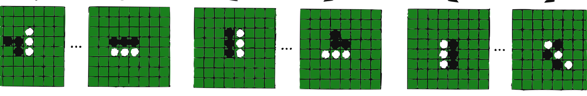
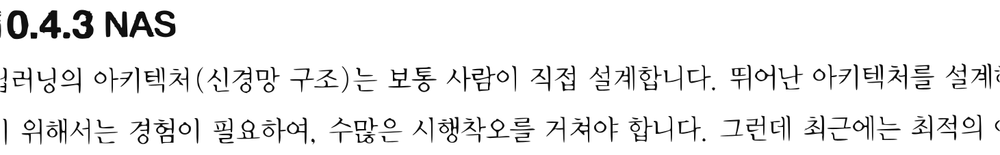
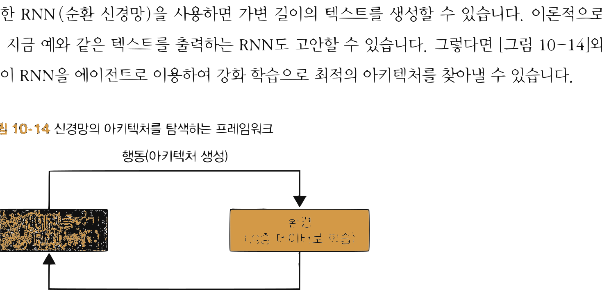

# 14.4 사례 연구

**그림 14-4** 바둑판(알파고), 로봇 제어, 반도체 칩 설계 등 현실 및 가상 세계의 정복 사례들을 칠판에 붙이며 설명해주는 지니와 눈이 반짝이는 도로시


인공지능 연구가 실생활에 적용되어 기적 같은 혁신을 불러일으킨 역사적 **사례 연구(Case Study)**들을 꼼꼼하게 해부합니다. 이세돌 9단과의 바둑 대결을 승리한 **알파고(AlphaGo)**의 몬테카를로 트리 탐색(MCTS) 결합 메커니즘부터 실제 로봇 물리 제어, 아키텍처 자동 설계(NAS), 심지어 에너지 효율화 시스템까지 강화학습이 도달한 위대한 정점들을 지니와 도로시의 대화로 생생하게 들어봅시다!

---

딥러닝 사례로는 비디오 게임이나 바둑과 같은 보드 게임이 유명하지만 그 외에도 로봇 제어, 자율주행, 의료, 금융, 바이오 등 다양한 분야에서 성과를 거두고 있습니다. 이번 절에서는 딥러닝이 어떤 용도로 활용되는지를 보여드릴 겸, 유명한 사례를 몇 가지 소개하겠습니다.


## 14.4.1 보드 게임

바둑, 장기, 오셀로 등의 보드 게임은 다음과 같은 특성을 지니고 있습니다.

* 보드의 모든 정보를 알 수 있음(완전 정보)
* 한쪽이 승리하면 다른 쪽은 패배함(제로섬<sup>zero-sum</sup>)
* 상태 전이에 우연이라는 요소가 없음(결정적)

이런 성질을 지닌 게임에서 중요한 것은 '수 읽기'입니다. "내가 이 수를 두면 상대가 저 수를 둘 것이고, 그러면 나는 이 수로 받아칠 것이다"처럼 앞으로 일어날 일을 다양하게 예측해볼수록 더 좋은 수를 찾을 수 있습니다. 보드 게임에서 '수 읽기'는 [그림 14-12]처럼 트리 구조로 표현할 수 있습니다.

**그림 14-12** 오셀로를 예로 든 게임 트리


오셀로판의 수 읽기 트리

그림과 같이 보드를 노드로, 다음 수를 에지(화살표)로 표현한 것을 **게임 트리**<sup>game tree</sup>라고 합니다. 게임 트리를 모두 펼칠 수 있다면 가능한 모든 결과가 드러나기 때문에 최선의 수를 찾을 수 있습니다. 하지만 바둑이나 장기는 가능한 상태(돌이나 말을 배치하는 패턴)가 천문학적으로 많아서 게임 트리를 모두 전개하기가 현실적으로 불가능합니다. 따라서 문제를 풀려면 게임 트리를 효율적으로 탐색해야 합니다.


> [!NOTE]
> 게임 트리에서 가능한 상태(노드)의 수는 보드 게임마다 다릅니다. 오셀로는 $10^{58}$개, 체스는 $10^{123}$개, 장기는 $10^{226}$개, 바둑은 $10^{400}$개입니다.

**몬테카를로 트리 탐색**<sup>Monte Carlo Tree Search (MCTS)</sup>은 트리의 전개를 몬테카를로법으로 근사하는 기법입니다. 예를 들어 돌들이 특정 형태로 놓여 있는 보드 상태가 얼마나 좋은지 평가할 때, 돌을 무작위로 두는 두 플레이어에게 승패가 결정될 때까지 계속 두게 합니다. 이러한 시도(특정 상태의 보드에서 시작하는 게임)를 수차례 반복하여, 그 승률로 해당 보드 상태가 '얼마나 좋은가'를 근사적으로 나타냅니다. 이처럼 승패가 결정될 때까지 무작위로 게임을 진행시키는 일을 **플레이아웃**<sup>playout</sup> 또는 **롤아웃**<sup>rollout</sup>이라고 합니다.

몬테카를로 트리 탐색은 현재의 보드 상태에서 가능한 모든 수를 각각 평가하고, 그 결과를 토대로 다음 수를 결정하는 흐름으로 진행합니다. 그리고 일반적으로는 이 기본 아이디어에 더하여 유망해 보이는 보드 상태로 전개한 후 평가한 결과를 피드백하는 메커니즘이 보강됩니다. 몬테카를로 트리 탐색에 대한 자세한 내용은 해당 논문<sup>[34]</sup>을 참고하기 바랍니다.

### 알파고

알파고<sup>AlphaGo [35]</sup>는 몬테카를로 트리 탐색에 심층 강화 학습을 결합한 기법입니다. 2016년 세계 최고의 바둑 기사에게 승리를 거두며 세상을 놀라게 한 주인공이죠.

알파고에는 두 개의 신경망이 사용되는데, 하나는 현재 바둑판에서 이길 확률을 평가하는 Value 신경망이고 다른 하나는 정책을 나타내는 Policy 신경망입니다. Policy 신경망은 다음에 둘 수를 확률로 출력합니다. 예를 들어 (1, 1) 위치에 둘 확률은 2.4%, (1, 2) 위치에 둘 확률은 0.2%와 같은 식이죠. 이 두 신경망으로 몬테카를로 트리 탐색을 더 정밀하게 수행할 수 있게 되었습니다.

알파고는 인간의 기보 데이터를 이용해 두 신경망을 학습시켰습니다. 그런 다음 **셀프 플레이**<sup>self-play</sup> 형태로 대국을 반복하고 여기서 수집한 경험 데이터를 사용해 학습을 더욱 강화했습니다.


> [!NOTE]
> 셀프 플레이는 강화 학습의 틀 안에서 설명할 수 있습니다. 바둑을 두는 '에이전트'가 있고 에이전트의 복제체인 대전 상대가 '환경' 역할을 합니다. 이 둘이 상호작용하면서 최종적으로 승리 혹은 패배라는 보상을 얻습니다. 이처럼 환경 속에서 상호작용하며 데이터를 수집한다는 점에서 알파고가 활용한 방식은 강화 학습이라고 말할 수 있습니다.

### 알파고 제로

알파고는 인간의 기보를 학습 데이터로 사용했습니다. 하지만 알파고 제로<sup>AlphaGo Zero [36]</sup>는 학습 데이터를 전혀 사용하지 않고 셀프 플레이를 통한 강화 학습만으로 학습했습니다. 또한 알파고에서 사용하던 '도메인 지식(바둑 규칙)'을 이용하지 않은 점도 큰 특징입니다. 이 외에도 다음과 같은 점을 개선했습니다.

* Policy 신경망과 Value 신경망을 하나의 신경망으로 표현
* 몬테카를로 트리 탐색으로 플레이아웃하지 않고, 신경망의 출력만으로 각 노드(상태)를 평가

이처럼 기존 알파고보다 단순하고 범용적으로 개선했습니다. 더구나 인간이 쌓아둔 기보 데이터 없이 강화 학습만으로 학습했음에도 놀랍게도 기보 데이터를 활용한 알파고를 압도하는 성능을 보여줬습니다. 실제로 알파고와의 대국에서 100대 0으로 압승을 거뒀습니다.

> [!NOTE]
> 인간의 지식을 활용하는 지도 학습이 도달할 수 있는 수준은 학습 데이터에 반영된 인간의 실력까지입니다. 한편 강화 학습은 스스로 새로운 경험을 쌓아가며 학습하기 때문에 이런 한계가 없습니다. 이론적으로는 인간을 뛰어넘을 수 있는 것이죠. 실제로 알파고 제로는 인간의 수준을 한참 넘어섰습니다. 그래서 알파고 제로 또한 강화 학습의 가능성을 보여준 중요한 연구입니다.

### 알파제로

알파제로<sup>AlphaZero [37]</sup>는 알파고 제로를 미세하게 조정한 것이지만 거의 같은 알고리즘을 이용합니다. 그럼에도 바둑뿐 아니라 체스와 장기까지 둘 수 있습니다. 보드 게임의 종류에 상관없는 범용 알고리즘으로 진화한 것입니다.


## 14.4.2 로봇 제어

딥러닝은 로봇 제어와 같은 시스템에도 활용됩니다. 하나의 예로, 구글은 로봇 팔이 다양한 물건을 잡을 수 있도록 학습시키는 데 성공했습니다.<sup>[38]</sup> [그림 14-13]과 같이 로봇은 위쪽에 장착된 카메라가 보내주는 영상을 해석하여 어떻게 행동할지를 결정합니다. 행동의 결과로 물체를 잡으면 성공, 잡지 못하면 실패라는 보상을 줍니다. 이처럼 강화 학습의 틀 안에서 학습을 진행합니다.

**그림 14-13** 일곱 대의 로봇이 경험 데이터를 수집하는 모습<sup>[38]</sup>


실제 로봇 팔 7대가 물건들을 집어 올리려고 하는 실험 현장 사진

필요한 데이터는 그림과 같이 로봇 일곱 대를 수개월 동안 실제 운용하여 수집했습니다. 이때 QT-Opt라는 강화 학습 알고리즘을 이용했습니다. QT-Opt는 Q 러닝 기반이기 때문에 오프-정책 기법입니다. 과거에 얻은 경험 데이터도 활용한다는 뜻이죠. 로봇을 실제로 운용해야 하는 환경이라면 데이터 수집 비용이 많이 들기 때문에 과거 데이터를 활용할 수 있다는 건 커다란 장점입니다.

논문에 따르면 QT-Opt는 미지의 물건도 96% 확률로 잡는 데 성공하여, 구글이 이전에 개발한 지도 학습 방식보다 실패 확률을 1/5 이하로 줄였다고 합니다.

## 14.4.3 NAS

딥러닝의 아키텍처(신경망 구조)는 보통 사람이 직접 설계합니다. 뛰어난 아키텍처를 설계하기 위해서는 경험이 필요하여, 수많은 시행착오를 거쳐야 합니다. 그런데 최근에는 최적의 아


키텍처를 컴퓨터가 자동으로 설계하는 연구<sup>[39]</sup>가 활발히 진행되고 있습니다. 흔히들 **NAS**<sup>Neural Architecture Search</sup>라고 부르는 분야입니다.

NAS를 수행하는 방법에는 베이지안 최적화<sup>Bayesian optimization</sup>와 유전 프로그래밍<sup>genetic programming</sup> 등 여러 가지가 있습니다. 그중 유력한 후보가 강화 학습입니다. 붐을 일으킨 주인공은 「Neural Architecture Search with Reinforcement Learning」 논문<sup>[40]</sup>입니다. 이 논문에서는 강화 학습으로 신경망 구조를 자동으로 최적화하여 사람이 설계한 것 이상의 아키텍처를 발견하는 데 성공했습니다. 어떻게 해냈는지를 간략하게 알아보겠습니다.

핵심 아이디어는 신경망 아키텍처를 '텍스트'로 표현할 수 있다는 점에 주목한 것입니다. 예를 들어 신경망의 아키텍처를 다음 예와 같은 텍스트로 정의할 수 있습니다(가상 포맷입니다).

```
graph {
  node {
    input: 'Input1'
    output: 'Result ReLU'
    op_type: 'Relu'
  }
  node {
    input: 'Result ReLU'
    input: 'Input2'
    output: 'Output'
    op_type: 'Add'
  }
  ...
}
```

또한 RNN(순환 신경망)을 사용하면 가변 길이의 텍스트를 생성할 수 있습니다. 이론적으로는 지금 예와 같은 텍스트를 출력하는 RNN도 고안할 수 있습니다. 그렇다면 [그림 14-14]와 같이 RNN을 에이전트로 이용하여 강화 학습으로 최적의 아키텍처를 찾아낼 수 있습니다.

**그림 14-14** 신경망의 아키텍처를 탐색하는 프레임워크


에이전트(RNN) -> 행동(아키텍처 생성) -> 환경(검증 데이터로 학습) -> 보상(인식 정확도) -> 에이전트(RNN)


그림과 같이 RNN이 신경망의 아키텍처를 텍스트로 생성합니다. 이 작업이 바로 에이전트의 행동에 해당합니다. 그리고 생성된 아키텍처(신경망)를 검증 데이터로 학습시키고 마지막으로 인식 정확도를 측정합니다. 이 인식 정확도가 보상으로 작용합니다. 논문에서는 REINFORCE 알고리즘으로 RNN의 매개변수를 갱신하였고 그 결과 RNN은 점차 인식 정확도가 더 높은 아키텍처를 출력했습니다.

> [!NOTE]
> 논문에서는 아키텍처의 범위를 제한하는 장치가 마련되어 있습니다. 예를 들어 합성곱 계층의 파라미터를 필터와 스트라이드 크기만으로 제한하고, RNN으로 두 매개변수의 값을 차례대로 출력하게 하는 식입니다.

## 14.4.4 기타 예시

심층 강화 학습을 적용한 사례는 이 외에도 많습니다. 이번 절에서는 그중 세 가지를 소개하겠습니다.

#### 자율주행

자율주행 자동차를 만들기 위한 연구가 전 세계적으로 앞다투어 이루어지고 있습니다. 대부분은 딥러닝을 활용한 '지도 학습'으로 진행되고 있으나 한편으로는 강화 학습으로 접근하는 움직임도 보입니다.<sup>[41]</sup> 자율주행이라는 문제는 환경을 관찰하여 최적의 행동(브레이크 밟기, 핸들 돌리기 등)을 선택하는 일련의 결정이기 때문에 강화 학습에 잘 들어맞습니다.

강화 학습으로 자율주행에 도전해볼 수 있는 환경으로 AWS DeepRacer<sup>[42]</sup>가 있습니다. DeepRacer는 딥러닝 기법으로 제어하는 자율주행 레이싱카입니다. 사용자는 딥러닝 알고리즘을 구현하고 보상 함수 등도 직접 설정합니다. 그런 다음 시뮬레이터를 써서 AWS에서 학습시킵니다. 최종적으로 만들어진 모델은 가상 레이스나 실물 자동차 레이스에서 이용할 수 있습니다. 실제로 '챔피언십 컵' 등의 레이스가 정기적으로 개최되어 상금을 걸고 경쟁을 벌이고 있습니다.


#### 건물 에너지 관리

건물은 많은 전력을 소비합니다. 그래서 전력 소비 줄이기가 중요한 과제이지만 건물 내 환경은 매우 복잡하여 효율적으로 운영하기가 쉽지 않습니다. 이 문제를 해결하기 위해 최근 다양한 심층 강화 학습 기법이 제안되어 좋은 성과를 거두고 있습니다.<sup>[43]</sup>

예를 들어 오피스 빌딩의 공조 설비 운영에 DQN 기반 기법이 제안되었습니다.<sup>[44]</sup> 이 연구에서는 근무 환경을 쾌적하게 유지하면서 비용을 30% 이상 줄였다고 합니다. 또한 구글의 데이터센터도 냉각 시스템을 머신러닝으로 제어하여 전력 소비를 40%나 줄이는 데 성공했습니다.<sup>[45]</sup> 여기에도 강화 학습 기법이 일부 사용되었습니다.

#### 반도체 칩 설계

반도체 칩 설계는 작은 기판에 수십억 개 이상의 트랜지스터를 배치하는 일입니다. 복잡한 문제인 만큼 많은 어려움이 따릅니다. 지금까지의 반도체 칩은 숙련된 전문가들이 오랜 시간을 투자해 설계했지만 구글은 딥러닝을 활용한 칩 설계 방법을 새롭게 제안했습니다.<sup>[46]</sup>

구글의 연구는 반도체 칩 설계를 강화 학습 문제로 간주하고, 에이전트가 다양한 반도체 레이아웃을 시도하며 최적의 설계를 찾습니다. 그 결과, 놀랍게도 6시간 안에 설계를 완료했으며 모든 주요 지표에서 인간 전문가의 설계보다 우수하거나 동등한 성능을 달성했다고 합니다. 이 기술은 이미 구글이 개발하는 TPU<sup>Tensor Processing Unit</sup> 설계에 활용되고 있습니다.*

