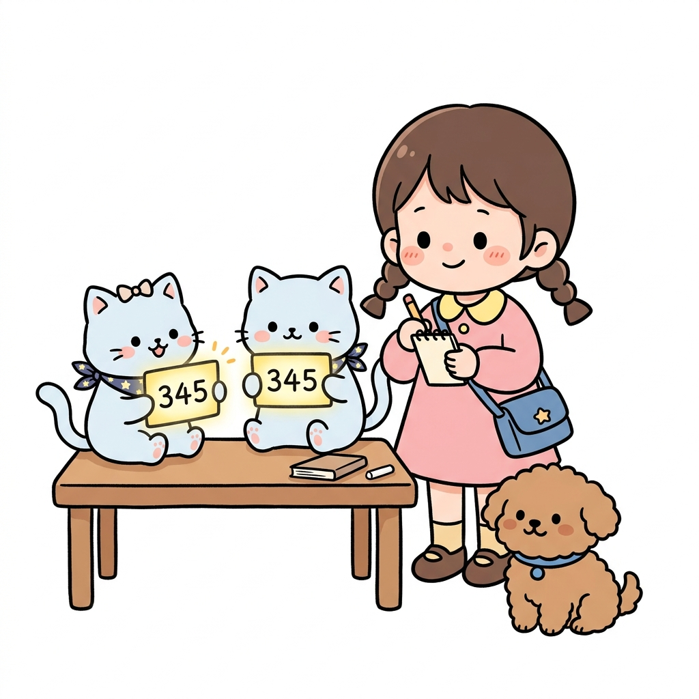
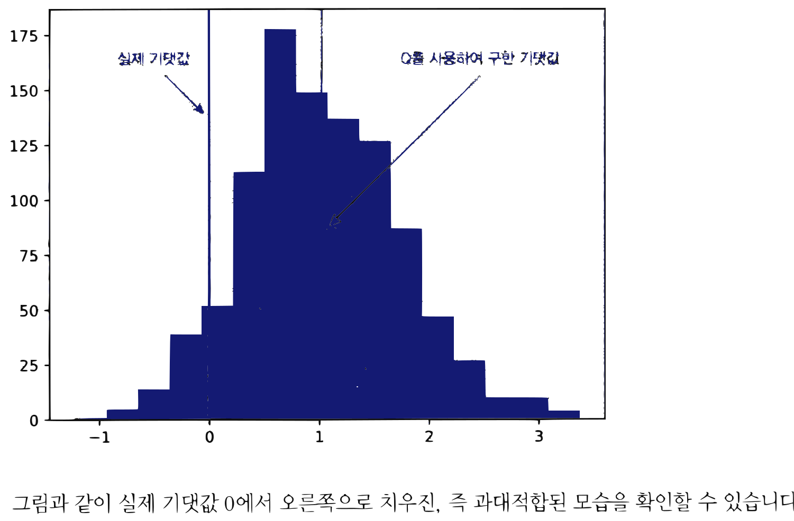
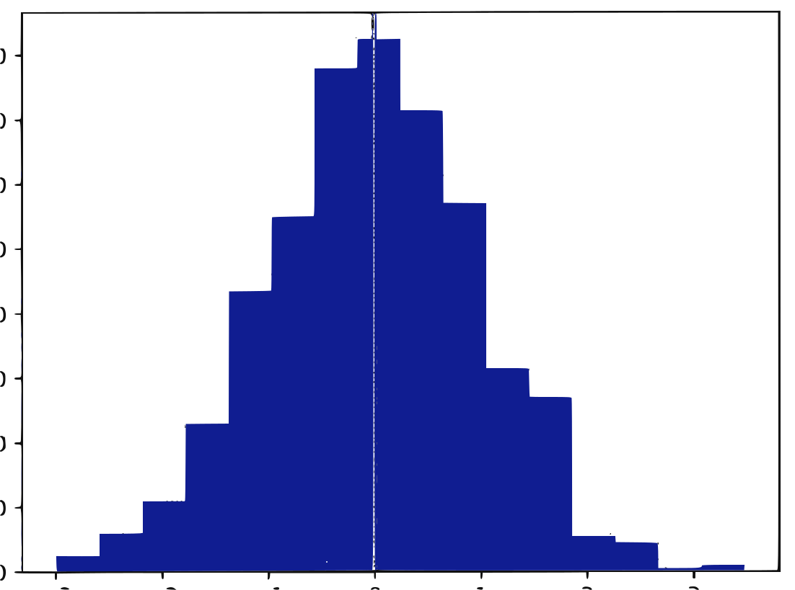

# APPENDIX C

# Double DQN 이해하기

**그림 C-0** Q1, Q2 두 장의 보물가치 카드를 교차 검증하며 과대평가 거품을 걷어내는 쌍둥이 지니 요정과 도로시


---

> **도로시와 토토의 비유로 이해하기**:
> 쌍둥이 도로시 마법사(Q1과 Q2)가 등장하여 환상적인 복습 협동을 펼칩니다. 한 도로시(Q1)가 신나서 최고 행동(max)을 고르면, 다른 도로시(Q2)가 그 행동 가치를 한 번 더 차분하게 검증하여, 혼자 공부할 때 빠지기 쉬운 가치의 과대평가(Overestimation) 거품을 말끔히 걷어냅니다!

8.4.1절에서 DQN의 TD 목표에 문제가 있음을 지적했습니다. 구체적으로는 TD 목표인 $R_t + \gamma \max_a Q_{\theta}(S_{t+1}, a)$의 $\max_a Q_{\theta}(S_{t+1}, a)$ 계산이 '과대적합'되는 문제입니다. 그렇다면 여기서 말하는 '과대적합'의 실체는 무엇이고, Double DQN에서는 이 문제를 어떻게 개선하는지 지금부터 알아봅시다(이번 부록의 설명은 Hatena의 블로그 글<sup>*</sup>을 참고했습니다).

## C.1 DQN에서의 과대적합이란?

행동 후보가 네 개인 문제가 있고, 상태 *s*에서 Q 함수의 값이 모두 같다고 가정합시다. 즉, $q(s, a_0) = q(s, a_1) = q(s, a_2) = q(s, a_3) = 0$입니다. 이 경우 다음 식이 성립합니다.

$$\mathbb{E} [ \max_a q(s, a) ] = 0$$

이와 같이 Q 함수의 값이 모두 0이므로 기댓값 중 max 연산의 결과도 당연히 0입니다.

다음으로 '추정치'인 Q 함수를 사용하는 경우를 생각해봅시다. 추정치 Q 함수를 $Q$로 표기하고, 그 값에 정규분포에서 생성된 무작위 수가 노이즈로 포함되어 있다고 가정합니다. 그러면

---
\* "DQNの進化史(DQN 진화의 역사) ② Double-DQN, Dueling-network, Noisy-network"  
https://horomary.hatenablog.com/entry/2021/02/06/013412

부록 C Double DQN 이해하기 351


다음 식이 성립합니다.

$$\mathbb{E} [ \max_a Q(s, a) ] > 0$$

즉, 실젯값(0)보다 크게 평가되어 버립니다. 이것이 바로 과대적합입니다.

이제 과대적합 현상을 실제 코드로 확인해보십시다.

```python
import numpy as np
import matplotlib.pyplot as plt

samples = 1000
action_size = 4
Qs = []

for _ in range(samples):
    # 정규분포에서 생성한 무작위 수를 노이즈로 추가
    Q = np.random.randn(action_size)
    Qs.append(Q.max())

# 히스토그램으로 시각화
plt.hist(Qs, bins=16)
plt.axvline(x=0, color='red')
plt.axvline(x=np.array(Qs).mean(), color='cyan')
plt.show()
```

Q 함수의 실제 기댓값은 0입니다. 그런데 지금은 추정치이기 때문에 노이즈를 추가했습니다. 노이즈는 정규분포(평균 0, 표준편차 1)에서 생성한 무작위 수(Q) 중 최댓값(Q.max())입니다. 총 1000개의 샘플을 수집하여 그 분포를 히스토그램으로 그리니 결과가 다음과 같았습니다.


**그림 C-1** Q.max()의 데이터 분포


실제 기댓값 (x=0)
Q를 사용하여 구한 기댓값 (x=1.0 부근)

그림과 같이 실제 기댓값 0에서 오른쪽으로 치우친, 즉 과대적합된 모습을 확인할 수 있습니다.

## C.2 과대적합 해결 방법

다음으로 과대적합을 방지하는 Double DQN에 대해 알아보죠. Double이라는 단어에서 짐작할 수 있듯이 '두 개의 Q 함수'를 사용하는 게 핵심입니다. 먼저 코드를 살펴보겠습니다.

```python
import numpy as np
import matplotlib.pyplot as plt

samples = 1000
action_size = 4
Qs = []

for _ in range(samples):
    Q = np.random.randn(action_size)
    Q_prime = np.random.randn(action_size)  # 또 다른 Q 함수
    idx = np.argmax(Q)                      # Q에서 최대 행동 선택
    Qs.append(Q_prime[idx])                 # 선택된 행동에 대한 값을 Q_prime에서 구함
```

부록 C Double DQN 이해하기 353


```python
# 히스토그램으로 시각화
plt.hist(Qs, bins=16)
plt.axvline(x=0, color='red')
plt.axvline(x=np.array(Qs).mean(), color='cyan')
plt.show()
```

Q 함수를 두 개 사용한다는 점이 이전과 다릅니다(Q와 Q_prime). 두 Q 함수 모두 추정치이며 오차가 포함되어 있습니다. 그러나 오차는 서로 독립적입니다. 이 코드에서 Q 함수의 최댓값을 계산할 때 두 Q 함수를 다음과 같이 구분하여 사용했습니다.

* 최대 행동을 선택할 때는 Q를 이용
* 선택된 행동에 대한 값은 다른 Q_prime을 이용

이렇게 바꿨을 때 결과가 어떻게 달라지는지 봅시다.

**그림 C-2** Double DQN 이용 시의 데이터 분포



[그림 C-2]의 히스토그램은 0을 중심으로 분포하고 있습니다. 그리고 빨간 선과 하늘색 선이 겹쳐서 과대적합이 해소되었음을 알 수 있습니다. 이처럼 '행동 선택'과 '값 구하기'를 각각의 Q 함수로 구하면 과대적합을 방지할 수 있습니다.

이상으로 DQN의 과대적합 문제와 Double DQN을 통한 해법까지 알아보았습니다.

